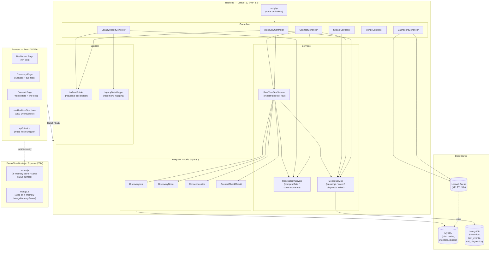

# Klearcom — Voice Observability Platform
## Design Document

---

## I. Executive Summary

**Klearcom** is a three-tier, web-based voice observability platform that enables enterprise operations teams to continuously monitor and analyse telephony infrastructure. It solves two distinct but complementary problems:

| Module | Problem Solved |
|---|---|
| **Connect** | Continuously probe Toll-Free Numbers (TFNs) across carriers and geographies; surface reachability degradation before customers notice it. |
| **Discovery** | Automatically traverse and map IVR (Interactive Voice Response) trees via scripted test calls; produce a navigable node graph of every prompt, DTMF branch, and transfer point. |

**Target audience:** Telecoms operations engineers, contact-centre platform teams, and QA leads who need programmatic visibility into the health and structure of carrier-hosted voice services.

**Value proposition:**
- Real-time streaming of test-call events to the browser (Server-Sent Events).
- Dual-store architecture: structured relational data for KPIs and time-series checks; MongoDB for unstructured call transcripts and diagnostics.
- Centralised reachability metric and IVR tree builder — single source of truth for all modules (post-refactor).

**Architecture style:** Modular monolith (Laravel REST API) + thin SPA (React) + Node.js dev-API proxy. All communication is HTTP/SSE; no message broker is currently wired to production.

---

## II. System Architecture

### High-Level Data-Flow Diagram



### Component Breakdown

#### Frontend — React 18 SPA (Vite + TypeScript)

| Component | Responsibility |
|---|---|
| `App.tsx` | Root layout: sidebar nav (Dashboard / Discovery / Connect), `<Routes>` |
| `DashboardPage` | Renders KPI tiles (availability %, operational counts) from `GET /dashboard/kpis` |
| `DiscoveryPage` | Job creation form, job list table, live SSE feed, IVR tree viewer, MongoDB transcripts panel |
| `ConnectPage` | TFN monitor creation, monitor list, live SSE feed, check history table, MongoDB transcripts panel |
| `useRealtimeTest` | Custom hook: POSTs to start endpoint → opens `EventSource` → accumulates events / progress / error state |
| `api/client.ts` | Typed `fetch` wrapper; throws on non-2xx and network errors; exposes `get / post / patch / delete` |
| `IvrTree` | Recursive component rendering a nested IVR node tree |
| `LiveTestFeed` | Progress bar + scrollable event log for SSE streams |
| `MongoStatus` | Sidebar widget: pings `/api/health` to show MongoDB connection status |
| `uiStore` | Zustand store holding `selectedDiscoveryId` and `selectedMonitorId` |

#### Backend — Laravel 10 (PHP 8.x)

| Controller | Route Prefix | Role |
|---|---|---|
| `DashboardController` | `/dashboard` | Aggregates KPI data with 30 s cache |
| `DiscoveryController` | `/discovery` | CRUD for jobs; triggers async test via `RealTimeTestService` |
| `ConnectController` | `/connect` | CRUD for monitors; triggers async test; reads check history |
| `StreamController` | (nested) | Delivers SSE events by polling MongoDB `test_events` collection |
| `MongoController` | `/mongodb` | Health probe, transcripts, diagnostics read-endpoints |
| `LegacyReportController` | `/legacy` | Carrier summary report and IVR depth report |

| Service | Role |
|---|---|
| `RealTimeTestService` | Orchestrates the full test lifecycle: writes step events to MongoDB, creates DB records, updates model state |
| `ReachabilityService` | Single source of truth for reachability % calculation and `active / alert` status derivation |
| `MongoService` | Thin wrapper over MongoDB PHP driver: insert/query for transcripts, test events, diagnostics |

| Support Class | Role |
|---|---|
| `IvrTreeBuilder` | Static utility: builds a recursive nested array from a flat `DiscoveryNode` collection |
| `LegacyDataMapper` | Maps raw arrays to report row / job context DTOs; uses direct array access (no `extract()`) |

#### Dev-API — Node.js / Express (ESM)

A local-only development server that mirrors the same REST surface as the Laravel backend. Uses an in-memory JavaScript object (`store.js`) as a relational substitute and either MongoDB Atlas (via `MONGODB_URI` env var) or `mongodb-memory-server` as the document store. Not deployed to production.

---

## III. Data Model

### Storage Strategy

| Concern | Store | Rationale |
|---|---|---|
| Jobs, monitors, check results | **MySQL** (Eloquent ORM) | Structured, relational, queryable for aggregations and time-series |
| Call transcripts, test events, diagnostics | **MongoDB** | Variable-schema event payloads; high write throughput; document per event |
| KPI aggregations | **Laravel Cache** (file/Redis) | Reduce repeated `COUNT`/`AVG` queries; 30 s TTL |

### MySQL — Relational Schema

```mermaid
erDiagram
    DISCOVERY_JOBS {
        bigint      id              PK
        varchar     name
        varchar     phone_number
        varchar(5)  country_code
        enum        status          "pending|running|completed|failed"
        int         menu_depth
        int         nodes_discovered
        json        languages
        timestamp   started_at      NULL
        timestamp   completed_at    NULL
        timestamp   created_at
        timestamp   updated_at
    }

    DISCOVERY_NODES {
        bigint      id              PK
        bigint      discovery_job_id FK
        bigint      parent_id       FK_SELF NULL
        text        prompt_text
        varchar     dtmf_option     NULL
        varchar     node_type       "menu|prompt|transfer"
        int         depth
        timestamp   created_at
        timestamp   updated_at
    }

    CONNECT_MONITORS {
        bigint      id              PK
        varchar     name
        varchar     toll_free_number
        varchar(5)  country_code
        varchar     carrier         NULL
        enum        status          "active|paused|alert"
        float       reachability_pct
        timestamp   last_checked_at NULL
        timestamp   created_at
        timestamp   updated_at
    }

    CONNECT_CHECK_RESULTS {
        bigint      id              PK
        bigint      connect_monitor_id FK
        boolean     reachable
        int         latency_ms      NULL
        varchar     carrier_route   NULL
        varchar     failure_reason  NULL
        timestamp   checked_at
        timestamp   created_at
        timestamp   updated_at
    }

    DISCOVERY_JOBS   ||--o{ DISCOVERY_NODES       : "has many"
    DISCOVERY_NODES  ||--o{ DISCOVERY_NODES       : "parent / children"
    CONNECT_MONITORS ||--o{ CONNECT_CHECK_RESULTS  : "has many"
```

**Recommended indexes (not yet in migrations):**
- `discovery_jobs(status)` — filters by running/completed in dashboard
- `connect_monitors(status)` — alert count in KPI query
- `connect_monitors(country_code)` — `DISTINCT` in KPI query
- `connect_check_results(connect_monitor_id, checked_at DESC)` — reachability window look-up
- `discovery_nodes(discovery_job_id, parent_id)` — tree build query

### MongoDB — Document Collections

#### `transcripts`
```jsonc
{
  "_id": ObjectId,
  "module": "discovery" | "connect",
  "reference_id": 42,          // FK → discovery_jobs.id or connect_monitors.id
  "payload": {
    "event": "prompt_detected",
    "transcript": "Welcome. Press 1 for accounts.",
    "session_id": "uuid-v4"
  },
  "created_at": ISODate,
  "app": "klearcom"            // seed-data discriminator
}
// Index: { module: 1, reference_id: 1, created_at: -1 }
```

#### `test_events`
```jsonc
{
  "_id": ObjectId,
  "session_id": "uuid-v4",
  "module": "discovery" | "connect",
  "reference_id": 42,
  "event": {
    "type": "step" | "status" | "complete",
    "event": "dtmf_sent",
    "message": "Sending DTMF: 1",
    "progress": 45,
    "reachable": true,          // connect only
    "transcript": "…"           // discovery only
  },
  "created_at": ISODate
}
// Index: { session_id: 1, created_at: 1 }
```

#### `call_diagnostics`
```jsonc
{
  "_id": ObjectId,
  "module": "discovery" | "connect",
  "reference_id": 42,
  "session_id": "uuid-v4",
  "mos_score": 4.2,
  "latency_ms": 115,
  "packet_loss_pct": 0,
  "created_at": ISODate
}
// Index: { module: 1, reference_id: 1 }
```

---

## IV. API Design / Interface

All endpoints share the prefix `/api`. No authentication middleware is currently applied (see Open Questions). The backend returns JSON with a consistent `{ "data": … }` envelope for collection and resource responses.

### Base URL
- **Production (Laravel):** `https://<host>/api`
- **Local dev (Node.js dev-API):** `http://localhost:8080/api`

### Health & MongoDB

| Method | Path | Description |
|---|---|---|
| `GET` | `/health` | Platform health + MongoDB ping |
| `GET` | `/mongodb/status` | MongoDB collection counts |
| `GET` | `/mongodb/transcripts?module=&reference_id=` | List call transcripts |
| `GET` | `/mongodb/diagnostics/{module}/{referenceId}` | List call diagnostics |

**`GET /health` — response**
```jsonc
{
  "status": "ok",
  "platform": "Klearcom",
  "version": "1.0.0",
  "mongodb": {
    "connected": true,
    "mode": "atlas",
    "database": "klearcom",
    "collections": { "transcripts": 12, "test_events": 48, "diagnostics": 6 }
  }
}
```

### Dashboard

| Method | Path | Description |
|---|---|---|
| `GET` | `/dashboard/kpis` | Aggregated KPI data (30 s cached) |

**`GET /dashboard/kpis` — response**
```jsonc
{
  "availability": {
    "ivr_availability_pct": 66.7,
    "number_reachability_pct": 90.2,
    "call_success_rate_pct": 94.2,
    "transfer_success_rate_pct": 97.8
  },
  "operational": {
    "active_discovery_jobs": 1,
    "active_connect_monitors": 2,
    "open_alerts": 1,
    "countries_monitored": 3
  },
  "modules": ["discovery", "connect"]
}
```

### Discovery Module

| Method | Path | Description |
|---|---|---|
| `GET` | `/discovery/jobs` | List all discovery jobs |
| `POST` | `/discovery/jobs` | Create a new job |
| `GET` | `/discovery/jobs/{id}` | Job detail + MongoDB transcripts + diagnostics |
| `GET` | `/discovery/jobs/{id}/tree` | Nested IVR node tree |
| `POST` | `/discovery/jobs/{id}/start` | Start a test run; returns `session_id` |
| `GET` | `/discovery/jobs/{id}/stream?session_id=` | SSE stream of test events |

**`POST /discovery/jobs` — request body**
```jsonc
{
  "name": "Bank IVR - US",          // required, string, max:255
  "phone_number": "+18005551234",    // required, string, max:50
  "country_code": "US",             // required, string, max:5
  "languages": ["en"]               // optional, array of strings
}
```

**`POST /discovery/jobs` — 201 response**
```jsonc
{
  "data": {
    "id": 4,
    "name": "Bank IVR - US",
    "phone_number": "+18005551234",
    "country_code": "US",
    "status": "pending",
    "menu_depth": 0,
    "nodes_discovered": 0,
    "languages": ["en"],
    "started_at": null,
    "completed_at": null
  }
}
```

**`POST /discovery/jobs/{id}/start` — 200 response**
```jsonc
{ "session_id": "550e8400-e29b-41d4-a716-446655440000", "message": "Discovery test started — connect to stream endpoint" }
```

**`GET /discovery/jobs/{id}/tree` — response**
```jsonc
{
  "job_id": 1,
  "job_name": "Bank IVR Discovery - US",
  "tree": [
    {
      "id": 1,
      "prompt_text": "Welcome to Acme Bank. Press 1 for accounts…",
      "dtmf_option": null,
      "node_type": "menu",
      "depth": 0,
      "children": [
        {
          "id": 2,
          "prompt_text": "Accounts menu. Press 1 for balance…",
          "dtmf_option": "1",
          "node_type": "menu",
          "depth": 1,
          "children": []
        }
      ]
    }
  ]
}
```

### Connect Module

| Method | Path | Description |
|---|---|---|
| `GET` | `/connect/monitors` | List all TFN monitors |
| `POST` | `/connect/monitors` | Create a new monitor |
| `POST` | `/connect/monitors/bulk-import` | Batch-create monitors (max 100) |
| `GET` | `/connect/monitors/{id}` | Monitor detail + last 10 check results |
| `GET` | `/connect/monitors/{id}/checks` | Full check history with computed reachability |
| `POST` | `/connect/monitors/{id}/run-check` | Trigger a reachability test; returns `session_id` |
| `GET` | `/connect/monitors/{id}/stream?session_id=` | SSE stream of test events |

**`POST /connect/monitors` — request body**
```jsonc
{
  "name": "US Sales TFN",             // required, string, max:255
  "toll_free_number": "18005559999",  // required, string, max:50
  "country_code": "US",               // required, string, max:5
  "carrier": "Verizon"                // optional, string, max:100
}
```

**`GET /connect/monitors/{id}/checks` — response**
```jsonc
{
  "monitor": { "id": 1, "name": "US Sales TFN", "toll_free_number": "18005559999", "country_code": "US" },
  "data": [
    { "id": 1, "reachable": true,  "latency_ms": 245, "carrier_route": "US-East -> Verizon SIP", "failure_reason": null, "checked_at": "2026-07-02T14:00:00Z" },
    { "id": 2, "reachable": false, "latency_ms": null, "carrier_route": null, "failure_reason": "Carrier routing failure", "checked_at": "2026-07-02T13:55:00Z" }
  ],
  "computed": { "reachability_pct": 85.0, "status": "alert" }
}
```

### SSE Stream Protocol

Both stream endpoints (`/discovery/jobs/{id}/stream` and `/connect/monitors/{id}/stream`) return `Content-Type: text/event-stream`. Each frame is a JSON-encoded `TestEvent` document:

```
data: {"session_id":"…","module":"connect","event":{"type":"step","event":"carrier_selected","message":"Carrier route selected","progress":40},"created_at":"…"}

data: {"session_id":"…","module":"connect","event":{"type":"complete","status":"reachable","message":"TFN is reachable","progress":100,"reachable":true,"latency_ms":312},"created_at":"…"}
```

- `event.type` values: `status` (initial), `step` (in-progress), `complete` (terminal — client closes `EventSource`).
- `event.progress` (0–100) drives the frontend progress bar.
- The stream terminates after 30 s (60 × 500 ms poll cycles) if `complete` is not received.

### Legacy Reports

| Method | Path | Description |
|---|---|---|
| `GET` | `/legacy/reports/carriers?country_code=&carrier=` | Carrier reachability summary per monitor |
| `GET` | `/legacy/reports/ivr/{jobId}` | IVR depth report (node count, max depth, transfer count) |

### Error Response Format

All error responses use standard HTTP status codes with a JSON body:
```jsonc
{ "message": "The name field is required.", "errors": { "name": ["The name field is required."] } }  // 422
{ "message": "Not found" }   // 404
{ "message": "Job already running" }  // 409
```
