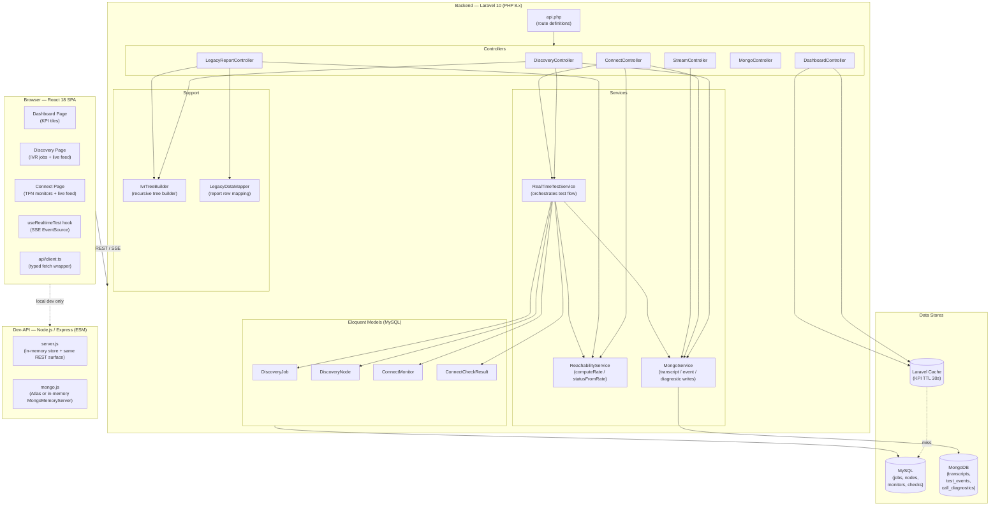
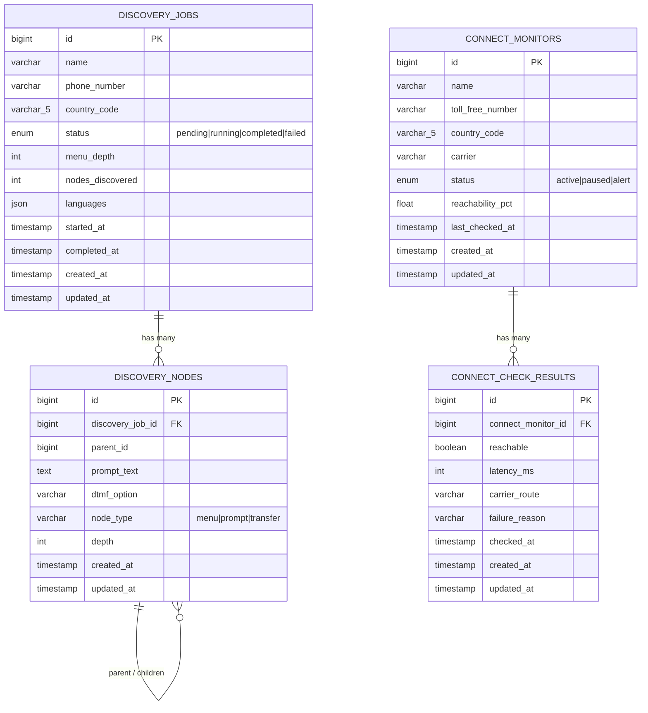
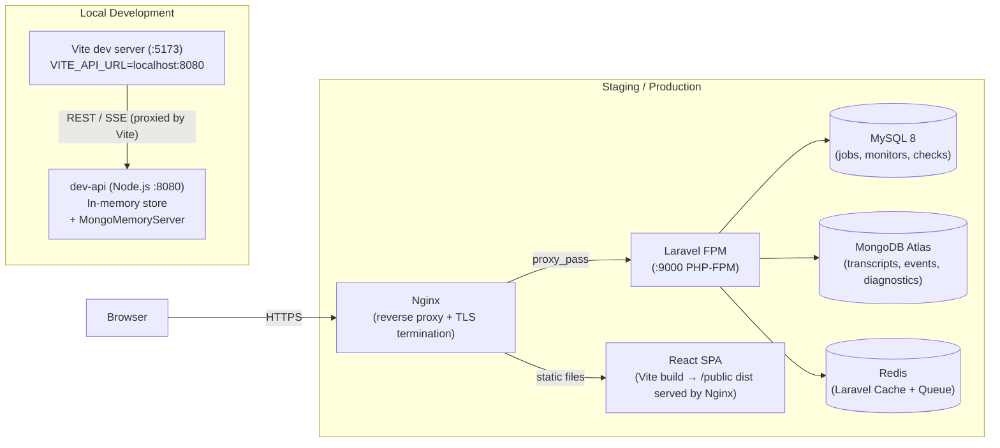
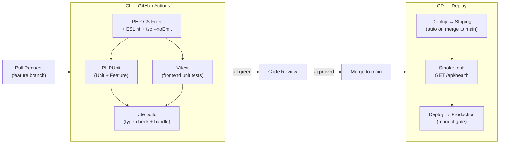
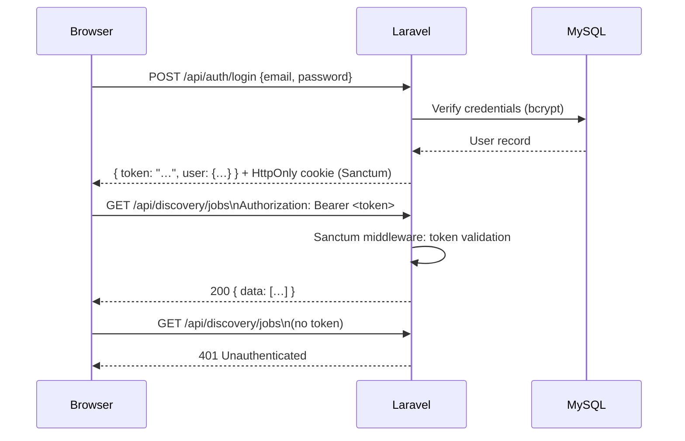

# Klearcom — Voice Observability Platform
## Design Document

---

## I. Executive Summary

**Klearcom** is a three-tier, web-based voice observability platform that enables enterprise operations teams to continuously monitor and analyse telephony infrastructure. It solves two distinct but complementary problems:

| Module | Problem Solved |
|---|---|
| **Connect** | Continuously probe Toll-Free Numbers (TFNs) across carriers and geographies; surface reachability degradation before customers notice it. |
| **Discovery** | Automatically traverse and map IVR (Interactive Voice Response) trees via scripted test calls; produce a navigable node graph of every prompt, DTMF branch, and transfer point. |

**Target audience:** Telecoms operations engineers, contact-centre platform teams, and QA leads who need programmatic visibility into the health and structure of carrier-hosted voice services.

**Value proposition:**
- Real-time streaming of test-call events to the browser (Server-Sent Events).
- Dual-store architecture: structured relational data for KPIs and time-series checks; MongoDB for unstructured call transcripts and diagnostics.
- Centralised reachability metric and IVR tree builder — single source of truth for all modules (post-refactor).

**Architecture style:** Modular monolith (Laravel REST API) + thin SPA (React) + Node.js dev-API proxy. All communication is HTTP/SSE; no message broker is currently wired to production.

---

## II. System Architecture

### High-Level Data-Flow Diagram



### Component Breakdown

#### Frontend — React 18 SPA (Vite + TypeScript)

| Component | Responsibility |
|---|---|
| `App.tsx` | Root layout: sidebar nav (Dashboard / Discovery / Connect), `<Routes>` |
| `DashboardPage` | Renders KPI tiles (availability %, operational counts) from `GET /dashboard/kpis` |
| `DiscoveryPage` | Job creation form, job list table, live SSE feed, IVR tree viewer, MongoDB transcripts panel |
| `ConnectPage` | TFN monitor creation, monitor list, live SSE feed, check history table, MongoDB transcripts panel |
| `useRealtimeTest` | Custom hook: POSTs to start endpoint → opens `EventSource` → accumulates events / progress / error state |
| `api/client.ts` | Typed `fetch` wrapper; throws on non-2xx and network errors; exposes `get / post / patch / delete` |
| `IvrTree` | Recursive component rendering a nested IVR node tree |
| `LiveTestFeed` | Progress bar + scrollable event log for SSE streams |
| `MongoStatus` | Sidebar widget: pings `/api/health` to show MongoDB connection status |
| `uiStore` | Zustand store holding `selectedDiscoveryId` and `selectedMonitorId` |

#### Backend — Laravel 10 (PHP 8.x)

| Controller | Route Prefix | Role |
|---|---|---|
| `DashboardController` | `/dashboard` | Aggregates KPI data with 30 s cache |
| `DiscoveryController` | `/discovery` | CRUD for jobs; triggers async test via `RealTimeTestService` |
| `ConnectController` | `/connect` | CRUD for monitors; triggers async test; reads check history |
| `StreamController` | (nested) | Delivers SSE events by polling MongoDB `test_events` collection |
| `MongoController` | `/mongodb` | Health probe, transcripts, diagnostics read-endpoints |
| `LegacyReportController` | `/legacy` | Carrier summary report and IVR depth report |

| Service | Role |
|---|---|
| `RealTimeTestService` | Orchestrates the full test lifecycle: writes step events to MongoDB, creates DB records, updates model state |
| `ReachabilityService` | Single source of truth for reachability % calculation and `active / alert` status derivation |
| `MongoService` | Thin wrapper over MongoDB PHP driver: insert/query for transcripts, test events, diagnostics |

| Support Class | Role |
|---|---|
| `IvrTreeBuilder` | Static utility: builds a recursive nested array from a flat `DiscoveryNode` collection |
| `LegacyDataMapper` | Maps raw arrays to report row / job context DTOs; uses direct array access (no `extract()`) |

#### Dev-API — Node.js / Express (ESM)

A local-only development server that mirrors the same REST surface as the Laravel backend. Uses an in-memory JavaScript object (`store.js`) as a relational substitute and either MongoDB Atlas (via `MONGODB_URI` env var) or `mongodb-memory-server` as the document store. Not deployed to production.

---

## III. Data Model

### Storage Strategy

| Concern | Store | Rationale |
|---|---|---|
| Jobs, monitors, check results | **MySQL** (Eloquent ORM) | Structured, relational, queryable for aggregations and time-series |
| Call transcripts, test events, diagnostics | **MongoDB** | Variable-schema event payloads; high write throughput; document per event |
| KPI aggregations | **Laravel Cache** (file/Redis) | Reduce repeated `COUNT`/`AVG` queries; 30 s TTL |

### MySQL — Relational Schema



**Recommended indexes (not yet in migrations):**
- `discovery_jobs(status)` — filters by running/completed in dashboard
- `connect_monitors(status)` — alert count in KPI query
- `connect_monitors(country_code)` — `DISTINCT` in KPI query
- `connect_check_results(connect_monitor_id, checked_at DESC)` — reachability window look-up
- `discovery_nodes(discovery_job_id, parent_id)` — tree build query

### MongoDB — Document Collections

#### `transcripts`
```jsonc
{
  "_id": "ObjectId",
  "module": "discovery | connect",
  "reference_id": 42,
  "payload": {
    "event": "prompt_detected",
    "transcript": "Welcome. Press 1 for accounts.",
    "session_id": "uuid-v4"
  },
  "created_at": "ISODate",
  "app": "klearcom"
}
// Index: { module: 1, reference_id: 1, created_at: -1 }
```

#### `test_events`
```jsonc
{
  "_id": "ObjectId",
  "session_id": "uuid-v4",
  "module": "discovery | connect",
  "reference_id": 42,
  "event": {
    "type": "step | status | complete",
    "event": "dtmf_sent",
    "message": "Sending DTMF: 1",
    "progress": 45,
    "reachable": true,
    "transcript": "..."
  },
  "created_at": "ISODate"
}
// Index: { session_id: 1, created_at: 1 }
```

#### `call_diagnostics`
```jsonc
{
  "_id": "ObjectId",
  "module": "discovery | connect",
  "reference_id": 42,
  "session_id": "uuid-v4",
  "mos_score": 4.2,
  "latency_ms": 115,
  "packet_loss_pct": 0,
  "created_at": "ISODate"
}
// Index: { module: 1, reference_id: 1 }
```

---

## IV. API Design / Interface

All endpoints share the prefix `/api`. No authentication middleware is currently applied (see Open Questions). The backend returns JSON with a consistent `{ "data": … }` envelope for collection and resource responses.

### Base URL
- **Production (Laravel):** `https://<host>/api`
- **Local dev (Node.js dev-API):** `http://localhost:8080/api`

### Health & MongoDB

| Method | Path | Description |
|---|---|---|
| `GET` | `/health` | Platform health + MongoDB ping |
| `GET` | `/mongodb/status` | MongoDB collection counts |
| `GET` | `/mongodb/transcripts?module=&reference_id=` | List call transcripts |
| `GET` | `/mongodb/diagnostics/{module}/{referenceId}` | List call diagnostics |

**`GET /health` — response**
```jsonc
{
  "status": "ok",
  "platform": "Klearcom",
  "version": "1.0.0",
  "mongodb": {
    "connected": true,
    "mode": "atlas",
    "database": "klearcom",
    "collections": { "transcripts": 12, "test_events": 48, "diagnostics": 6 }
  }
}
```

### Dashboard

| Method | Path | Description |
|---|---|---|
| `GET` | `/dashboard/kpis` | Aggregated KPI data (30 s cached) |

**`GET /dashboard/kpis` — response**
```jsonc
{
  "availability": {
    "ivr_availability_pct": 66.7,
    "number_reachability_pct": 90.2,
    "call_success_rate_pct": 94.2,
    "transfer_success_rate_pct": 97.8
  },
  "operational": {
    "active_discovery_jobs": 1,
    "active_connect_monitors": 2,
    "open_alerts": 1,
    "countries_monitored": 3
  },
  "modules": ["discovery", "connect"]
}
```

### Discovery Module

| Method | Path | Description |
|---|---|---|
| `GET` | `/discovery/jobs` | List all discovery jobs |
| `POST` | `/discovery/jobs` | Create a new job |
| `GET` | `/discovery/jobs/{id}` | Job detail + MongoDB transcripts + diagnostics |
| `GET` | `/discovery/jobs/{id}/tree` | Nested IVR node tree |
| `POST` | `/discovery/jobs/{id}/start` | Start a test run; returns `session_id` |
| `GET` | `/discovery/jobs/{id}/stream?session_id=` | SSE stream of test events |

**`POST /discovery/jobs` — request body**
```jsonc
{
  "name": "Bank IVR - US",
  "phone_number": "+18005551234",
  "country_code": "US",
  "languages": ["en"]
}
```

**`POST /discovery/jobs/{id}/start` — 200 response**
```jsonc
{
  "session_id": "550e8400-e29b-41d4-a716-446655440000",
  "message": "Discovery test started — connect to stream endpoint"
}
```

**`GET /discovery/jobs/{id}/tree` — response (abbreviated)**
```jsonc
{
  "job_id": 1,
  "job_name": "Bank IVR Discovery - US",
  "tree": [
    {
      "id": 1, "prompt_text": "Welcome…", "dtmf_option": null,
      "node_type": "menu", "depth": 0,
      "children": [
        { "id": 2, "prompt_text": "Accounts menu…", "dtmf_option": "1", "node_type": "menu", "depth": 1, "children": [] }
      ]
    }
  ]
}
```

### Connect Module

| Method | Path | Description |
|---|---|---|
| `GET` | `/connect/monitors` | List all TFN monitors |
| `POST` | `/connect/monitors` | Create a new monitor |
| `POST` | `/connect/monitors/bulk-import` | Batch-create monitors (max 100) |
| `GET` | `/connect/monitors/{id}` | Monitor detail + last 10 check results |
| `GET` | `/connect/monitors/{id}/checks` | Full check history with computed reachability |
| `POST` | `/connect/monitors/{id}/run-check` | Trigger a reachability test; returns `session_id` |
| `GET` | `/connect/monitors/{id}/stream?session_id=` | SSE stream of test events |

**`GET /connect/monitors/{id}/checks` — response (abbreviated)**
```jsonc
{
  "monitor": { "id": 1, "name": "US Sales TFN", "toll_free_number": "18005559999", "country_code": "US" },
  "data": [
    { "id": 1, "reachable": true, "latency_ms": 245, "carrier_route": "US-East -> Verizon SIP", "failure_reason": null, "checked_at": "2026-07-02T14:00:00Z" }
  ],
  "computed": { "reachability_pct": 85.0, "status": "alert" }
}
```

### SSE Stream Protocol

Both stream endpoints return `Content-Type: text/event-stream`. Each frame is a JSON-encoded `TestEvent`:

```
data: {"session_id":"…","module":"connect","event":{"type":"step","event":"carrier_selected","message":"Carrier route selected","progress":40},"created_at":"…"}

data: {"session_id":"…","module":"connect","event":{"type":"complete","status":"reachable","message":"TFN is reachable","progress":100,"reachable":true,"latency_ms":312},"created_at":"…"}
```

- `event.type` values: `status` (initial) → `step` (in-progress) → `complete` (terminal).
- `event.progress` (0–100) drives the frontend progress bar.
- Stream auto-terminates after 30 s (60 × 500 ms poll cycles) if `complete` is not received.

### Legacy Reports

| Method | Path | Description |
|---|---|---|
| `GET` | `/legacy/reports/carriers?country_code=&carrier=` | Carrier reachability summary per monitor |
| `GET` | `/legacy/reports/ivr/{jobId}` | IVR depth report: node count, max depth, transfer count |

### Error Response Format

```jsonc
// 422 Validation
{ "message": "The name field is required.", "errors": { "name": ["The name field is required."] } }
// 404
{ "message": "Not found" }
// 409
{ "message": "Job already running" }
```

---

## V. Infrastructure & DevOps

### Environment Overview



### Deployment Strategy

| Tier | Recommended Approach |
|---|---|
| Frontend | Build with `vite build`; serve static assets from Nginx or a CDN (Cloudflare / CloudFront). |
| Backend | Docker container running PHP 8.x + php-fpm; Nginx as reverse proxy. Alternatively, Laravel Forge / Vapor for managed deployments. |
| MySQL | Managed RDS (AWS) or Cloud SQL (GCP); automated daily snapshots. |
| MongoDB | MongoDB Atlas (already used in dev); M10+ cluster for production with Atlas Search and automated backups. |
| Cache / Queue | Redis (ElastiCache or Redis Cloud). Required if replacing SSE polling with Laravel Horizon + pub/sub. |

### Docker Compose (local full-stack)

```yaml
# Indicative — not currently committed to the repo
services:
  backend:
    build: ./backend
    environment:
      DB_CONNECTION: mysql
      DB_HOST: db
      MONGODB_URI: mongodb://mongo:27017
      CACHE_DRIVER: redis
      REDIS_HOST: redis
    depends_on: [db, mongo, redis]

  frontend:
    build: ./frontend
    environment:
      VITE_API_URL: http://backend/api
    ports: ["5173:80"]

  db:
    image: mysql:8.0
    volumes: [db_data:/var/lib/mysql]

  mongo:
    image: mongo:7
    volumes: [mongo_data:/data/db]

  redis:
    image: redis:7-alpine

volumes:
  db_data:
  mongo_data:
```

### CI/CD Pipeline Requirements



**Current test coverage gaps (from code analysis):**
- `ReachabilityService` — unit tests needed (happy path, zero-check edge case, alert threshold boundary).
- `IvrTreeBuilder` — unit tests needed (flat list, deep nesting, orphan nodes).
- Integration tests for SSE stream endpoints are absent.

**Required CI secrets:**
- `MONGODB_URI` (test Atlas cluster or in-memory via `mongodb-memory-server`)
- `DB_CONNECTION=sqlite` for in-memory SQLite during PHPUnit runs
- `VITE_API_URL` for frontend build validation

---

## VI. Security & Compliance

### Current State

> **⚠️ No authentication or authorisation layer exists.** All API endpoints are publicly accessible. This is the single highest-priority security gap before any production deployment.

### Authentication — Recommended Implementation

**Laravel Sanctum** (SPA token-based auth) is the idiomatic choice for this stack:



**Implementation checklist:**
- Add `users` table (migration) with `email`, `password` (bcrypt), `role` (`admin | operator | viewer`).
- Install `laravel/sanctum`; apply `auth:sanctum` middleware to all API route groups.
- Add `POST /api/auth/login`, `POST /api/auth/logout`, `GET /api/auth/me` endpoints.
- Frontend: store token in `sessionStorage` (not `localStorage` — XSS risk); attach via `Authorization: Bearer` header in `api/client.ts`.
- Add a `LoginPage.tsx` guarded route; redirect unauthenticated users before React Query fires.

### Authorisation (RBAC)

| Role | Permissions |
|---|---|
| `admin` | Full CRUD + bulk import + legacy reports |
| `operator` | Create/run tests; read all data |
| `viewer` | Read-only (dashboard, checks, transcripts) |

### Input Validation

| Layer | Status |
|---|---|
| Laravel controllers (`store`, `runCheck`) | ✅ `$request->validate()` rules in place post-refactor |
| Dev-API POST endpoints | ✅ Required-field checks + 422 responses added |
| Bulk-import batch cap (100 items) | ✅ Added in refactor |
| `extract()` on request data | ✅ Removed; replaced with explicit property access |

### Data Encryption & Privacy

| Concern | Recommendation |
|---|---|
| Transport | TLS 1.2+ enforced at Nginx; HSTS header (`Strict-Transport-Security`). |
| Secrets at rest | All credentials (DB passwords, MongoDB URI, API keys) stored in environment variables; never committed to git. Use `.env` + Laravel config caching in production. |
| MongoDB Atlas | Enable encryption-at-rest (AES-256) and TLS connections. Restrict Atlas IP access list to backend server IPs only. |
| MySQL | Enable SSL connections; use a dedicated DB user with least-privilege grants (`SELECT`, `INSERT`, `UPDATE` on `klearcom.*` only). |
| Call transcripts (PII) | Transcripts stored in MongoDB may contain caller speech. Consider field-level encryption or a data-retention TTL index (`expireAfterSeconds`) to auto-purge transcripts older than N days. |
| CORS | Currently `cors()` allows all origins (dev-API). Production Laravel config (`config/cors.php`) must restrict `allowed_origins` to the known frontend domain. |

### SSE Stream Security

- The `session_id` query parameter in the SSE URL is a UUID (v4, cryptographically random from `Str::uuid()`). This provides a reasonable access token for a single test session.
- After authentication is added, validate that `session_id` belongs to the authenticated user before opening the stream.
- Set `X-Accel-Buffering: no` (already present) to prevent Nginx proxy buffering breaking SSE.

### Dependency Management

- Pin all npm dependencies to exact versions (`package-lock.json`); run `npm audit` in CI.
- Use `composer.lock`; run `composer audit` in CI.
- PHP 8.x: avoid `extract()` on untrusted input (fixed in `LegacyDataMapper`).

---

## Open Questions

| # | Question | Impact | Suggested Owner |
|---|---|---|---|
| OQ-1 | **Authentication design:** Will Sanctum (SPA) suffice, or do we need OAuth 2.0 / OIDC for enterprise SSO (SAML, Azure AD)? | Architecture of auth layer | Product / Security |
| OQ-2 | **SSE vs WebSocket vs Redis pub/sub:** The current SSE implementation polls MongoDB every 500 ms. Under high concurrency (many simultaneous tests) this creates significant MongoDB read load. Should we introduce Laravel Reverb (WebSocket) or a Redis pub/sub channel? | Scalability, infrastructure cost | Engineering Lead |
| OQ-3 | **Real call execution:** `RealTimeTestService` currently simulates test steps with `usleep()` / `random_int()`. What telephony integration (Twilio, Bandwidth, internal SIP gateway) will execute actual test calls? | Core product functionality | Platform / Telecom team |
| OQ-4 | **`call_success_rate_pct` and `transfer_success_rate_pct`** are hard-coded to `94.2` and `97.8` in the dashboard. What is the data source and computation model for these metrics? | Data accuracy / KPI credibility | Product / Analytics |
| OQ-5 | **Data retention policy:** How long should call transcripts and `test_events` documents be retained in MongoDB? No TTL index exists today. | Storage cost, GDPR compliance | Legal / Engineering |
| OQ-6 | **Multi-tenancy:** Is Klearcom a single-tenant internal tool, or will it be offered as a multi-tenant SaaS? This has material impact on the data model (tenant isolation), RBAC design, and billing. | Architecture scope | Product |
| OQ-7 | **Pagination:** `GET /discovery/jobs` and `GET /connect/monitors` return all records. At what volume do we need cursor/offset pagination? | Performance | Engineering |
| OQ-8 | **Dev-API vs Laravel parity:** The Node.js dev-API is maintained in parallel with the Laravel backend. Long-term, should the dev-API be generated from an OpenAPI spec to guarantee parity, or deprecated once the Laravel backend can run locally with a single `docker compose up`? | Developer experience, maintenance cost | Engineering |
| OQ-9 | **Alerting / Notifications:** When a monitor's reachability drops below the 90 % threshold, is in-UI badge display sufficient, or do we need outbound alerting (email, PagerDuty, Slack webhook)? | Operational utility | Product / Ops |
| OQ-10 | **Mobile / responsive design:** Is the SPA required to function on mobile viewports, or is desktop-only acceptable? The current layout uses CSS Grid with no explicit responsive breakpoints. | Frontend scope | Design / Product |
