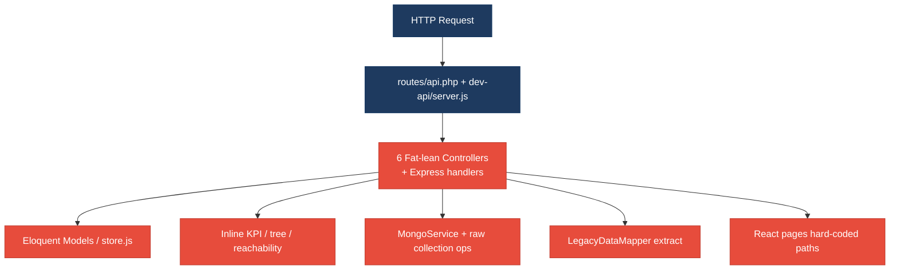
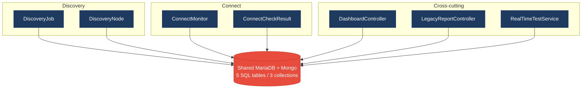
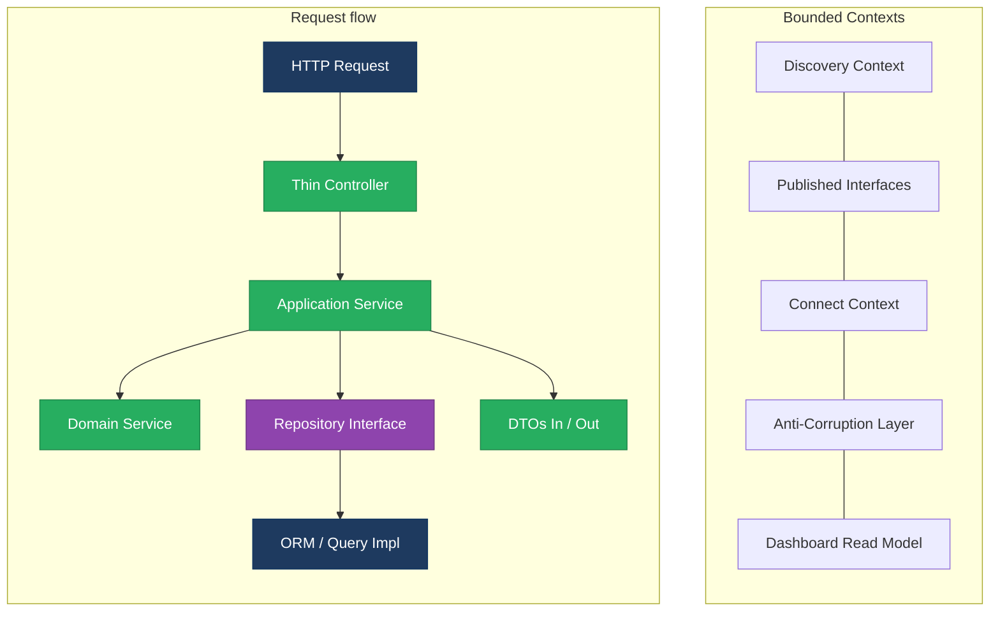
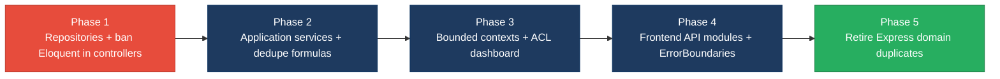

# 1. Architecture & Design Hotspots Analysis

**Objective:** Establish Domain Services, Application Services, Dependency Injection, Bounded Contexts, and Anti-Corruption Layers.

**Date:** 2026-07-24 | **Scope:** `shende-shweta/FSDKC` (branch `main`) — PHP 8.3 / Laravel 12 backend, Node/Express `dev-api`, React 19 + TypeScript + Vite frontend, MariaDB + MongoDB

## Executive Summary

> **Executive Summary**
>
> Klearcom is a multi-layer monolith (Laravel 12 API, parallel Express `dev-api`, React 19 SPA) with Discovery and Connect modules named in folders but not enforced as bounded contexts. The dominant risk is **change amplification from missing repository/service boundaries**: controllers and Express handlers call Eloquent models and an in-memory store directly, while KPI/tree/reachability formulas are duplicated across PHP, Node, and the UI. Layers covered: **backend** (Laravel `backend/app` ~25 PHP files + `dev-api/src` 6 JS files) and **frontend** (`frontend/src` ~15 TS/TSX/JSX files). No mobile/CLI layers. Highest-severity hotspots are missing repositories (H3), cross-domain dashboard/legacy coupling (H8/H9), and dual-stack duplicated domain logic (H10). Frontend is comparatively healthier on LOC but still hard-codes API paths in pages and retains legacy class/error-throw patterns (F5).

<div class="metric-grid">
<div class="metric-card"><div class="metric-number">6</div><div class="metric-label">Controllers / Handlers</div></div>
<div class="metric-card"><div class="metric-number">4</div><div class="metric-label">Models / Entities</div></div>
<div class="metric-card"><div class="metric-number">2</div><div class="metric-label">Service Classes Found</div></div>
<div class="metric-card"><div class="metric-number">0</div><div class="metric-label">Repository Classes Found</div></div>
</div>

<div class="overall-rating overall-rating--high-risk"><div class="overall-rating-label">Overall Codebase Rating — Architecture &amp; Design</div><div class="overall-rating-value">High Risk</div><div class="overall-rating-note">Driven by High-Risk Missing Repository Pattern (H3), Direct SQL/ORM in Controllers (H6), Domain Boundary Violations (H8), Shared Database Coupling (H9), and Dual-Stack Duplicated Domain Logic (H10).</div></div>

## 1.1 Benchmark Ratings Summary

| # | Hotspot | Primary KPI | <span class="rating rating-good">Good</span> | <span class="rating rating-moderate">Moderate</span> | <span class="rating rating-high-risk">High Risk</span> | Measured | Rating |
|---|---|---|---|---|---|---|---|
| H1 | Fat Controllers | Avg LOC per controller | <150 | 150–300 | >300 | ~81 LOC (6 Laravel API controllers) | <span class="rating rating-good">Good</span> |
| H2 | Missing Service Layer | Controllers accessing repos/models | <10 | 10–20 | >20 | 16 (4 Laravel + 12 Express handlers on `store`) | <span class="rating rating-moderate">Moderate</span> |
| H3 | Missing Repository Pattern | Direct DB access points | <10 | 10–20 | >20 | ~52 Eloquent/`store` access sites; 0 repositories | <span class="rating rating-high-risk">High Risk</span> |
| H4 | Circular Dependencies | Dependency cycles | 0 | 1–3 | >3 | 0 | <span class="rating rating-good">Good</span> |
| H5 | Shared Utility Abuse | Utility files w/ business logic | 0 | 1–5 | >5 | 2 (`LegacyDataMapper`, `store.js` `buildTree`) | <span class="rating rating-moderate">Moderate</span> |
| H6 | Direct SQL in Controllers | ORM compliance % | >90% | 60–90% | <60% | ~31% of MariaDB access outside controllers | <span class="rating rating-high-risk">High Risk</span> |
| H7 | God Classes | Classes >1000 LOC | 0 | 1–3 | >3 | 0 (largest ~280 LOC `server.js`) | <span class="rating rating-good">Good</span> |
| H8 | Domain Boundary Violations | Cross-domain access points | 0 | 1–5 | >5 | 8+ (Dashboard/Legacy/RealTime/dev-api cross Discovery+Connect) | <span class="rating rating-high-risk">High Risk</span> |
| H9 | Shared Database Coupling | Tables shared across domains | <10% | 10–30% | >30% | 100% of domain tables (4/4) read by cross-cutting code | <span class="rating rating-high-risk">High Risk</span> |
| H10 | Dual-Stack Duplicated Domain Logic (additional) | Duplicate formula/algorithm copies across stacks (Good 0 · Moderate 1–3 · High Risk >3) | 0 | 1–3 | >3 | 8 copies across 3 formula clusters | <span class="rating rating-high-risk">High Risk</span> |
| F1 | Business Logic in Components | Avg LOC per component | <150 | 150–300 | >300 | ~85 LOC across 9 components/pages | <span class="rating rating-good">Good</span> |
| F2 | Missing Frontend Service/Data Layer | Components w/ inline API calls | <10 | 10–20 | >20 | 6 pages/components with hard-coded paths | <span class="rating rating-good">Good</span> |
| F3 | God / Oversized Components | Components >400 LOC | 0 | 1–3 | >3 | 0 (largest `ConnectPage` ~222 LOC) | <span class="rating rating-good">Good</span> |
| F4 | Prop Drilling / Global State Abuse | Max prop-drilling depth | ≤2 | 3–4 | >4 | ≤2 levels; small Zustand `uiStore` | <span class="rating rating-good">Good</span> |
| F5 | Legacy / Inconsistent Component Patterns | Legacy-pattern components | 0 | 1–10 | >10 | 2 (`LegacyMonitorPoller` class + `LegacyDashboardWidget` throw) | <span class="rating rating-moderate">Moderate</span> |

## 1.2 Hotspot-by-Hotspot Evidence

### H1. Fat Controllers <span class="sev sev-medium">Medium</span>

**Benchmark:** `Avg LOC per controller = ~81` → falls in the **Good** band (Good <150 · Moderate 150–300 · High Risk >300).

**What to check:** Business logic inside controllers/handlers — controllers should only translate HTTP ↔ application calls.

**Evidence:** Controllers are under the LOC threshold but still embed domain algorithms (tree build, reachability, KPI aggregation). Six Laravel API controllers measured: Discovery (~103), Connect (~112), Dashboard (~43), LegacyReport (~105), Mongo (~45), Stream (~75).

Example — reachability math inside `ConnectController::checks`:

```57:84:backend/app/Http/Controllers/Api/ConnectController.php
        $recentChecks = ConnectCheckResult::where('connect_monitor_id', $id)
            ->orderByDesc('checked_at')
            ->limit(20)
            ->get();

        $successRate = $recentChecks->count() > 0
            ? ($recentChecks->where('reachable', true)->count() / $recentChecks->count()) * 100
            : 100;

        $computedStatus = $successRate < 90 ? 'alert' : 'active';
```

Example — recursive IVR tree builder private method on `DiscoveryController`:

```87:101:backend/app/Http/Controllers/Api/DiscoveryController.php
    private function buildTree($nodes, ?int $parentId = null): array
    {
        return $nodes
            ->where('parent_id', $parentId)
            ->map(fn (DiscoveryNode $node) => [
                'id' => $node->id,
                'prompt_text' => $node->prompt_text,
                // ...
                'children' => $this->buildTree($nodes, $node->id),
            ])
            ->values()
            ->all();
    }
```

Example — Express dashboard handler duplicates the same KPI workflow with no service:

```58:80:dev-api/src/server.js
app.get('/api/dashboard/kpis', async (_req, res) => {
  const discoveryTotal = store.discoveryJobs.length;
  const discoveryCompleted = store.discoveryJobs.filter((j) => j.status === 'completed').length;
  const avgReach = store.connectMonitors.reduce((s, m) => s + m.reachability_pct, 0) / store.connectMonitors.length;
  // ...
});
```

**Why it matters here:** Although average LOC is healthy, the same domain formulas live in HTTP adapters. Changing the alert threshold (`< 90`) or tree shape requires editing Laravel controllers, `RealTimeTestService`, and `dev-api` in lockstep — the first breakage is inconsistent dashboard vs Connect page status.

**Recommended approach:**
1. Extract `ReachabilityCalculator` from `ConnectController::checks` and `RealTimeTestService::runConnectTest`.
2. Move `buildTree` into a Discovery domain service shared by `DiscoveryController` and `LegacyReportController`.
3. Introduce `DashboardKpiService` used by both Laravel and (eventually) a thin Express façade or deprecate Express KPI duplication.

<!-- affected-files
search: (DiscoveryJob::|ConnectMonitor::|ConnectCheckResult::|DiscoveryNode::|buildTree|reachability|store\.(discoveryJobs|connectMonitors))
glob: backend/app/Http/Controllers/Api/**/*.php
issue: Business logic / ORM access in HTTP controllers
action: Extract Application/Domain services; keep controllers thin
-->

### H2. Missing Service Layer <span class="sev sev-high">High</span>

**Benchmark:** `Controllers/handlers directly accessing models/store = 16` → falls in the **Moderate** band (Good <10 · Moderate 10–20 · High Risk >20).

**What to check:** Business rules spread across controllers/utilities with no dedicated service tier for CRUD workflows.

**Evidence:** Only `MongoService` and `RealTimeTestService` exist under `backend/app/Services/`. CRUD and reporting bypass them.

```10:36:backend/app/Http/Controllers/Api/DashboardController.php
    public function kpis(): JsonResponse
    {
        $discoveryTotal = DiscoveryJob::count();
        $discoveryCompleted = DiscoveryJob::where('status', 'completed')->count();
        $connectMonitors = ConnectMonitor::count();
        $avgReachability = ConnectMonitor::avg('reachability_pct') ?? 0;
        $alerts = ConnectMonitor::where('status', 'alert')->count();
        // ...
    }
```

```18:48:backend/app/Http/Controllers/Api/LegacyReportController.php
    public function carrierSummary(Request $request): JsonResponse
    {
        $filters = $request->all();
        extract($filters);

        $monitors = ConnectMonitor::query()
            ->when(isset($country_code), fn ($q) => $q->where('country_code', $country_code))
            // ...
            ->get();
```

Express mirrors the gap — `POST /api/discovery/jobs` mutates `store` inline with no service module.

**Why it matters here:** HTTP, SSE start endpoints, and the Node local API cannot reuse one workflow. New CLI/job runners would copy controller logic again. `RealTimeTestService` proves DI works where applied — CRUD never adopted the same pattern.

**Recommended approach:**
1. Add `DiscoveryJobService`, `ConnectMonitorService`, `DashboardKpiService`.
2. Route `DiscoveryController`/`ConnectController`/`DashboardController` through those services only.
3. Align `dev-api` handlers to call shared pure functions or retire duplicated Express business paths.

<!-- affected-files
search: (DiscoveryJob::|ConnectMonitor::|store\.(discoveryJobs|connectMonitors|connectChecks))
glob: {backend/app/Http/Controllers/Api/**/*.php,dev-api/src/server.js}
issue: Handlers access persistence without application services
action: Introduce Application Services for Discovery, Connect, Dashboard
-->

### H3. Missing Repository Pattern <span class="sev sev-critical">Critical</span>

**Benchmark:** `Direct DB/ORM access points outside repositories = ~52` → falls in the **High Risk** band (Good <10 · Moderate 10–20 · High Risk >20).

**What to check:** Direct DB/ORM access scattered through the codebase; no `app/Repositories/` layer.

**Evidence:** Zero repository classes. Controllers and `RealTimeTestService` call Eloquent statically; Express uses a global `store` object.

```19:21:backend/app/Http/Controllers/Api/DiscoveryController.php
        $jobs = DiscoveryJob::orderByDesc('created_at')->get();
        return response()->json(['data' => $jobs]);
```

```117:125:backend/app/Services/RealTimeTestService.php
        $recent = ConnectCheckResult::where('connect_monitor_id', $monitorId)->orderByDesc('checked_at')->limit(20)->get();
        $rate = $recent->count() > 0 ? ($recent->where('reachable', true)->count() / $recent->count()) * 100 : 100;

        $monitor->update([
            'reachability_pct' => round($rate, 2),
            'status' => $rate < 90 ? 'alert' : 'active',
```

```88:102:dev-api/src/server.js
app.post('/api/discovery/jobs', (req, res) => {
  const job = {
    id: store.nextJobId++,
    name: req.body.name,
    // ...
  };
  store.discoveryJobs.unshift(job);
```

**Why it matters here:** Persistence is inseparable from workflows. Swapping MariaDB ↔ Atlas patterns or isolating tests requires rewriting every controller and `RealTimeTestService`. Schema renames (e.g. `reachability_pct`) ripple through HTTP, services, and Express simultaneously.

**Recommended approach:**
1. Create `DiscoveryJobRepository`, `DiscoveryNodeRepository`, `ConnectMonitorRepository`, `ConnectCheckResultRepository` interfaces + Eloquent implementations.
2. Inject repositories into application services; ban static Eloquent from controllers.
3. Behind `dev-api`, wrap `store` as an in-memory repository implementation of the same interfaces.

<!-- affected-files
search: (DiscoveryJob::|DiscoveryNode::|ConnectMonitor::|ConnectCheckResult::|store\.(discoveryJobs|discoveryNodes|connectMonitors|connectChecks))
glob: {backend/app/**/*.php,dev-api/src/**/*.js}
issue: Direct persistence access; no repository abstractions
action: Introduce repository interfaces and implementations; route all persistence through them
-->

### H4. Circular Dependencies <span class="sev sev-low">Low</span>

**Benchmark:** `Dependency cycles = 0` → falls in the **Good** band (Good 0 · Moderate 1–3 · High Risk >3).

**What to check:** Modules/packages importing each other.

**Evidence:** Not observed — dependency direction is Controllers → Services/Models, Services → Models/MongoService, frontend pages → api/hooks/store/components with no reverse imports. Module folders (`Modules/Discovery`, `Modules/Connect`) contain only `AGENTS.md` and do not participate in the import graph.

### H5. Shared Utility Abuse <span class="sev sev-medium">Medium</span>

**Benchmark:** `Utility files holding business logic = 2` → falls in the **Moderate** band (Good 0 · Moderate 1–5 · High Risk >5).

**What to check:** Large common/helpers/utils files holding business logic.

**Evidence:** No large `helpers/` dump, but two shared utility-style modules own domain mapping/tree logic:

```12:20:backend/app/Legacy/LegacyDataMapper.php
    public function mapReportRow(array $row): array
    {
        extract($row, EXTR_SKIP);

        return [
            'label' => $name ?? 'Unknown',
            'metric' => $reachability_pct ?? 0,
            'region' => $country_code ?? 'N/A',
```

```store.js buildTree` (dev-api) embeds Discovery IVR tree construction in a generic store helper used by HTTP routes.

**Why it matters here:** `LegacyDataMapper` + `extract()` becomes an unowned ACL substitute. Tree logic in `store.js` will keep diverging from PHP `buildTree` copies.

**Recommended approach:**
1. Replace `LegacyDataMapper` with an explicit DTO mapper / Anti-Corruption Layer without `extract()`.
2. Move `buildTree` into a Discovery domain module, not the generic store file.

<!-- affected-files
search: (extract\(|function buildTree|export function buildTree)
glob: {backend/app/Legacy/**/*.php,dev-api/src/store.js}
issue: Domain logic living in legacy/utility modules
action: Move to domain services; remove extract()-based mapping
-->

### H6. Direct SQL in Controllers <span class="sev sev-critical">Critical</span>

**Benchmark:** `ORM/repository compliance % ≈ 31%` → falls in the **High Risk** band (Good >90% · Moderate 60–90% · High Risk <60%).

**What to check:** Raw queries / ORM access embedded in controllers/handlers vs repositories.

**Evidence:** No raw `DB::select` strings found, but Eloquent query builders and direct Mongo collection access sit in HTTP handlers. ~22 Eloquent call sites in controllers vs ~10 in `RealTimeTestService` (~31% kept out of controllers). Express diagnostics hit Mongo from the route:

```44:52:dev-api/src/server.js
  const data = await getDb()
    .collection('call_diagnostics')
    .find({ module: req.params.module, reference_id: Number(req.params.referenceId) })
    .sort({ created_at: -1 })
    .limit(10)
    .toArray();
```

```24:36:backend/app/Http/Controllers/Api/LegacyReportController.php
        $monitors = ConnectMonitor::query()
            ->when(isset($country_code), fn ($q) => $q->where('country_code', $country_code))
            ->when(isset($carrier), fn ($q) => $q->where('carrier', $carrier))
            ->orderByDesc('reachability_pct')
            ->get();
```

**Why it matters here:** Persistence shape (filters, limits, joins) is wired to HTTP. Schema evolution cannot be confined to a repository; every controller method and Express route becomes a migration blast radius.

**Recommended approach:**
1. Move all Eloquent/`store`/Mongo reads from controllers into repositories.
2. Keep `MongoService` as the Mongo adapter behind a repository or port interface.
3. Delete inline `getDb().collection(...)` from Express routes.

<!-- affected-files
search: (::(query|where|count|avg|findOrFail|create|orderByDesc)|getDb\(\)|collection\()
glob: {backend/app/Http/Controllers/**/*.php,dev-api/src/server.js}
issue: Persistence queries embedded in HTTP layer
action: Move queries into repositories / Mongo adapters
-->

### H7. God Classes <span class="sev sev-low">Low</span>

**Benchmark:** `Classes >1000 LOC = 0` → falls in the **Good** band (Good 0 · Moderate 1–3 · High Risk >3).

**What to check:** Single classes/files handling many unrelated responsibilities at extreme size.

**Evidence:** Not observed — no class exceeds 1000 LOC. Largest backend handler file is `dev-api/src/server.js` (~280 LOC, multi-concern but under threshold). Largest frontend page is `ConnectPage.tsx` (~222 LOC).

### H8. Domain Boundary Violations <span class="sev sev-critical">Critical</span>

**Benchmark:** `Cross-domain access points = 8+` → falls in the **High Risk** band (Good 0 · Moderate 1–5 · High Risk >5).

**What to check:** Code in one business area directly reading/writing another area's data or models.

**Evidence:** `backend/app/Modules/{Discovery,Connect}` only ship `AGENTS.md` — real code is shared under `Http/Controllers` and `Models`. Cross-domain points include:

1. `DashboardController` — DiscoveryJob + ConnectMonitor
2. `LegacyReportController` — Connect + Discovery models in one controller
3. `RealTimeTestService` — both domains' tests and writes
4. `dev-api/src/server.js` dashboard + both route groups on one `store`
5. `dev-api/src/realtime.js` — both runners
6. Frontend `LegacyDashboardWidget` — KPIs + jobs + monitors
7. Frontend pages share one `uiStore` across domains (selection IDs)
8. Mongo collections keyed by `module` string rather than owned contexts

```10:18:backend/app/Http/Controllers/Api/DashboardController.php
        $discoveryTotal = DiscoveryJob::count();
        $discoveryCompleted = DiscoveryJob::where('status', 'completed')->count();
        $connectMonitors = ConnectMonitor::count();
        $avgReachability = ConnectMonitor::avg('reachability_pct') ?? 0;
```

```12:18:frontend/src/pages/LegacyDashboardWidget.tsx
    Promise.all([
      api.get<DashboardKpis>('/dashboard/kpis'),
      api.get<{ data: DiscoveryJob[] }>('/discovery/jobs'),
      api.get<{ data: ConnectMonitor[] }>('/connect/monitors'),
    ])
```

**Why it matters here:** Discovery and Connect cannot evolve or extract independently. A Connect schema change immediately threatens Dashboard KPIs and Legacy reports. Module folders give a false sense of isolation.

**Recommended approach:**
1. Move models/services under real `Modules/Discovery` and `Modules/Connect` packages with published interfaces.
2. Dashboard should consume read-model ports / ACL DTOs, not foreign Eloquent models.
3. Split `RealTimeTestService` into per-context runners.

<!-- affected-files
search: (DiscoveryJob|ConnectMonitor|discovery/jobs|connect/monitors)
glob: {backend/app/Http/Controllers/Api/DashboardController.php,backend/app/Http/Controllers/Api/LegacyReportController.php,backend/app/Services/RealTimeTestService.php,frontend/src/pages/LegacyDashboardWidget.tsx,dev-api/src/server.js}
issue: Cross-domain model/API access without bounded context boundaries
action: Enforce module ownership; introduce published interfaces / ACL for dashboard
-->

### H9. Shared Database Coupling <span class="sev sev-critical">Critical</span>

**Benchmark:** `Tables shared across domains = 100% (4/4 domain tables)` → falls in the **High Risk** band (Good <10% · Moderate 10–30% · High Risk >30%).

**What to check:** Multiple business domains reading/writing the same tables / shared DB without ownership.

**Evidence:** Single MariaDB schema in `docker/mariadb/init.sql` holds `discovery_jobs`, `discovery_nodes`, `connect_monitors`, `connect_check_results` (plus `users`). All four domain tables are read by cross-cutting Dashboard/Legacy/`RealTimeTestService`/Express store. MongoDB collections (`transcripts`, `test_events`, `call_diagnostics`) are shared with a free-form `module` field.

```sql
-- docker/mariadb/init.sql: discovery_* and connect_* in one database, no schema ownership
CREATE TABLE IF NOT EXISTS discovery_jobs ( ... );
CREATE TABLE IF NOT EXISTS connect_monitors ( ... );
```

**Why it matters here:** Schema changes and seed/migration strategy are global. There is no path to split Discovery vs Connect databases without rewriting every cross-reader first.

**Recommended approach:**
1. Declare table ownership per bounded context; forbid foreign context Eloquent models.
2. Expose cross-context data via application APIs / read models.
3. Partition Mongo collections or enforce module-owned database namespaces.

<!-- affected-files
search: (discovery_jobs|discovery_nodes|connect_monitors|connect_check_results|DiscoveryJob|ConnectMonitor)
glob: {docker/mariadb/init.sql,backend/app/**/*.php,dev-api/src/**/*.js}
issue: Shared MariaDB/Mongo with cross-domain table access
action: Domain-owned schemas + internal APIs / ACL between contexts
-->

### H10. Dual-Stack Duplicated Domain Logic (additional) <span class="sev sev-critical">Critical</span>

**Benchmark:** `Duplicate formula/algorithm copies = 8` → falls in the **High Risk** band (Good 0 · Moderate 1–3 · High Risk >3). KPI justification: each independent copy of the same business rule across Laravel/Node/UI increases drift risk; >3 copies is High Risk.

**What to check:** Same domain algorithms reimplemented in PHP and Node (and sometimes UI), without a single source of truth.

**Evidence:** Three clusters, eight copies:
- **buildTree:** `DiscoveryController`, `LegacyReportController`, `dev-api/src/store.js`
- **reachability %:** `ConnectController`, `RealTimeTestService`, `dev-api/src/realtime.js`
- **dashboard KPIs:** `DashboardController`, `dev-api/src/server.js`

```php
// LegacyReportController — copy of DiscoveryController::buildTree
private function buildTree($nodes, ?int $parentId = null): array { /* identical map/children recursion */ }
```

```143:151:dev-api/src/realtime.js
  const recent = store.connectChecks.filter((c) => c.connect_monitor_id === monitorId).slice(0, 20);
  const successRate = recent.length > 0
    ? (recent.filter((c) => c.reachable).length / recent.length) * 100
    : 100;
```

**Why it matters here:** Local `npm run dev` (Express) and Docker Laravel can disagree on alert thresholds and tree shape. Contributors fix one stack and ship regressions on the other.

**Recommended approach:**
1. Canonicalize formulas in shared domain packages (PHP first for Laravel; generate or port tested pure JS for `dev-api`, or drop duplicate Express business logic).
2. Add characterization tests for reachability and KPI math once, then delete copies.
3. Treat `dev-api` as an adapter over the same contracts, not a second domain implementation.

<!-- affected-files
search: (buildTree|successRate|reachability_pct|ivr_availability_pct)
glob: {backend/app/**/*.php,dev-api/src/**/*.js}
issue: Duplicated domain formulas across Laravel and Express
action: Single-source domain services; delete redundant copies
-->

### F1. Business Logic in Components <span class="sev sev-low">Low</span>

**Benchmark:** `Avg LOC per component ≈ 85` → falls in the **Good** band (Good <150 · Moderate 150–300 · High Risk >300).

**What to check:** Validation, calculations, data transformation, or workflow logic inside view components.

**Evidence:** Measured 9 UI units — ConnectPage ~222, DiscoveryPage ~176, DashboardPage ~95, LegacyDashboardWidget ~68, App ~45, LiveTestFeed ~55, IvrTree ~35, MongoStatus ~30, LegacyMonitorPoller ~45 (avg ~85). Pages orchestrate React Query + forms but heavy domain math stays on the server. Presentation-focused overall.

**Evidence:** Not observed as a size/KPI failure — pages are busy but under the 150 LOC average target. Residual workflow orchestration (invalidations, SSE start) lives in pages/hooks rather than pure view children.

### F2. Missing Frontend Service/Data Layer <span class="sev sev-medium">Medium</span>

**Benchmark:** `Components with inline API/data-access calls = 6` → falls in the **Good** band (Good <10 · Moderate 10–20 · High Risk >20).

**What to check:** `fetch`/HTTP URLs hard-coded in components instead of module API services.

**Evidence:** Shared `frontend/src/api/client.ts` exists, but no `discoveryApi`/`connectApi` modules — paths are inlined in six UI files:

```18:35:frontend/src/pages/DiscoveryPage.tsx
  const jobsQuery = useQuery({
    queryKey: ['discovery', 'jobs'],
    queryFn: () => api.get<{ data: DiscoveryJob[] }>('/discovery/jobs'),
    refetchInterval: isRunning ? 2000 : false,
  });
  // ...
  const transcriptsQuery = useQuery({
    queryFn: () => api.get<{ data: Transcript[] }>(`/mongodb/transcripts?module=discovery&reference_id=${selectedId}`),
```

```22:35:frontend/src/pages/ConnectPage.tsx
  const monitorsQuery = useQuery({
    queryFn: () => api.get<{ data: ConnectMonitor[] }>('/connect/monitors'),
  });
  const checksQuery = useQuery({
    queryFn: () => api.get<{ data: ConnectCheckResult[] }>(`/connect/monitors/${selectedId}/checks`),
```

Also: `DashboardPage.tsx`, `LegacyDashboardWidget.tsx`, `MongoStatus.tsx`, `LegacyMonitorPoller.jsx`.

**Why it matters here:** Endpoint renames require hunting page files. Count is still under Moderate threshold, so rated Good, but structure debt will grow as modules expand.

**Recommended approach:**
1. Add `frontend/src/api/discoveryApi.ts` and `connectApi.ts` wrapping paths.
2. Keep pages on React Query calling those modules only.

<!-- affected-files
search: api\.(get|post)\(
glob: frontend/src/**/*.{tsx,ts,jsx,js}
issue: Hard-coded API paths in UI components
action: Introduce per-module API modules; remove path strings from pages
-->

### F3. God / Oversized Components <span class="sev sev-low">Low</span>

**Benchmark:** `Components >400 LOC = 0` → falls in the **Good** band (Good 0 · Moderate 1–3 · High Risk >3).

**What to check:** Single components with huge render + many state vars + side effects.

**Evidence:** Not observed — largest is `ConnectPage.tsx` (~222 LOC) combining form, table, checks, transcripts, and live feed under the 400 LOC bar. Still a candidate to split for cohesion, but KPI is Good.

### F4. Prop Drilling / Global State Abuse <span class="sev sev-low">Low</span>

**Benchmark:** `Max prop-drilling depth ≤ 2` → falls in the **Good** band (Good ≤2 · Moderate 3–4 · High Risk >4).

**What to check:** Deep prop threading or one giant global store.

**Evidence:** Not observed as abuse — `uiStore` only holds two selection IDs; `LiveTestFeed` / `IvrTree` receive props one level deep from pages.

```1:18:frontend/src/store/uiStore.ts
export const useUiStore = create<UiState>((set) => ({
  selectedDiscoveryId: null,
  selectedMonitorId: null,
  setSelectedDiscoveryId: (id) => set({ selectedDiscoveryId: id }),
  setSelectedMonitorId: (id) => set({ selectedMonitorId: id }),
}));
```

### F5. Legacy / Inconsistent Component Patterns <span class="sev sev-medium">Medium</span>

**Benchmark:** `Legacy-pattern components = 2` → falls in the **Moderate** band (Good 0 · Moderate 1–10 · High Risk >10).

**What to check:** Mixed paradigms, missing error boundaries, deprecated lifecycle/APIs.

**Evidence:**
1. Class component `LegacyMonitorPoller.jsx` with intentional missing unmount cleanup.
2. `LegacyDashboardWidget` throws on error; `main.tsx` has no ErrorBoundary.
3. Mixed `.jsx` + `.tsx`; routes only in `App.tsx`.

```22:33:frontend/src/components/LegacyMonitorPoller.jsx
  componentDidMount() {
    this.intervalId = setInterval(() => {
      api.get(`/connect/monitors/${this.props.monitorId}/checks`)
        // ...
    }, 3000);
    // Intentionally no componentWillUnmount — interval leak
  }
```

```47:47:frontend/src/pages/LegacyDashboardWidget.tsx
  if (error) throw new Error(error); // Uncaught — no Error Boundary wraps this component
```

```14:22:frontend/src/main.tsx
createRoot(document.getElementById('root')!).render(
  <StrictMode>
    <QueryClientProvider client={queryClient}>
      <BrowserRouter>
        <App />
      </BrowserRouter>
    </QueryClientProvider>
  </StrictMode>,
);
```

**Why it matters here:** Interval leaks and uncaught throws will surface as blank screens / memory growth when legacy widgets are mounted. New contributors lack a single component convention.

**Recommended approach:**
1. Rewrite `LegacyMonitorPoller` as a hook-based function component with cleanup.
2. Add `ErrorBoundary` around routes in `App.tsx` / `main.tsx`.
3. Convert remaining JSX to TSX and document component conventions.

<!-- affected-files
search: (class Legacy|componentDidMount|throw new Error|ErrorBoundary)
glob: frontend/src/**/*.{tsx,ts,jsx,js}
issue: Legacy class components / missing error boundaries
action: Migrate to function components; add ErrorBoundary; unify TSX conventions
-->

## 1.3 Diagrams

### Current-state architecture (as-is)



### Clean reference path (target pattern found in codebase)


### Domain boundary map (business domains found vs. shared data)



### Target architecture (proposed)



### Improvement roadmap



## 1.4 Actions Required

| Hotspot | Action | Rating | Priority |
|---|---|---|---|
| H2 Missing Service Layer | Add Discovery/Connect/Dashboard application services; stop Eloquent/`store` use from controllers/handlers | <span class="rating rating-moderate">Moderate</span> | <span class="sev sev-high">High</span> |
| H3 Missing Repository Pattern | Introduce repository interfaces + Eloquent/in-memory implementations; route all persistence through them | <span class="rating rating-high-risk">High Risk</span> | <span class="sev sev-critical">Critical</span> |
| H5 Shared Utility Abuse | Replace `LegacyDataMapper` extract mapping; move `buildTree` out of `store.js` into Discovery domain | <span class="rating rating-moderate">Moderate</span> | <span class="sev sev-medium">Medium</span> |
| H6 Direct SQL in Controllers | Move Eloquent/Mongo queries out of HTTP layer into repositories/adapters | <span class="rating rating-high-risk">High Risk</span> | <span class="sev sev-critical">Critical</span> |
| H8 Domain Boundary Violations | Enforce real module packages; dashboard/legacy consume published interfaces only | <span class="rating rating-high-risk">High Risk</span> | <span class="sev sev-critical">Critical</span> |
| H9 Shared Database Coupling | Declare table ownership; cross-context access via APIs/ACL, not shared Eloquent models | <span class="rating rating-high-risk">High Risk</span> | <span class="sev sev-critical">Critical</span> |
| H10 Dual-Stack Duplicated Domain Logic | Canonicalize reachability/tree/KPI formulas; delete PHP/Node duplicate copies | <span class="rating rating-high-risk">High Risk</span> | <span class="sev sev-critical">Critical</span> |
| F5 Legacy / Inconsistent Component Patterns | Migrate class poller to hooks; add ErrorBoundary; unify TSX conventions | <span class="rating rating-moderate">Moderate</span> | <span class="sev sev-medium">Medium</span> |

## 1.5 Expected Outcomes

- Controllers and Express handlers become thin adapters; Discovery/Connect workflows are testable via application services without HTTP.
- Persistence is swappable (Eloquent ↔ in-memory ↔ alternate DB) behind repositories, enabling deterministic unit tests.
- Bounded contexts stop silent cross-domain breakage when Connect or Discovery schemas change.
- Single-source domain formulas eliminate Laravel vs `dev-api` drift on KPIs and reachability alerts.
- Frontend legacy patterns and missing boundaries stop uncaught UI failures and interval leaks as modules grow.
