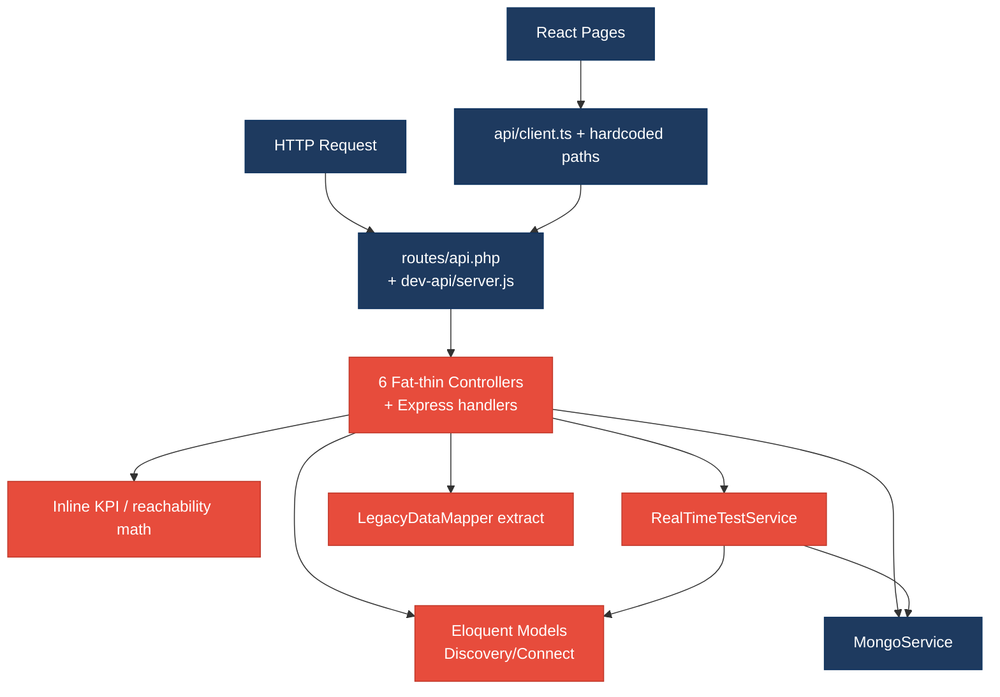
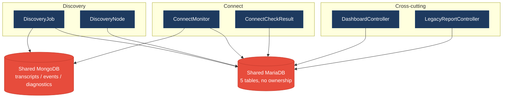
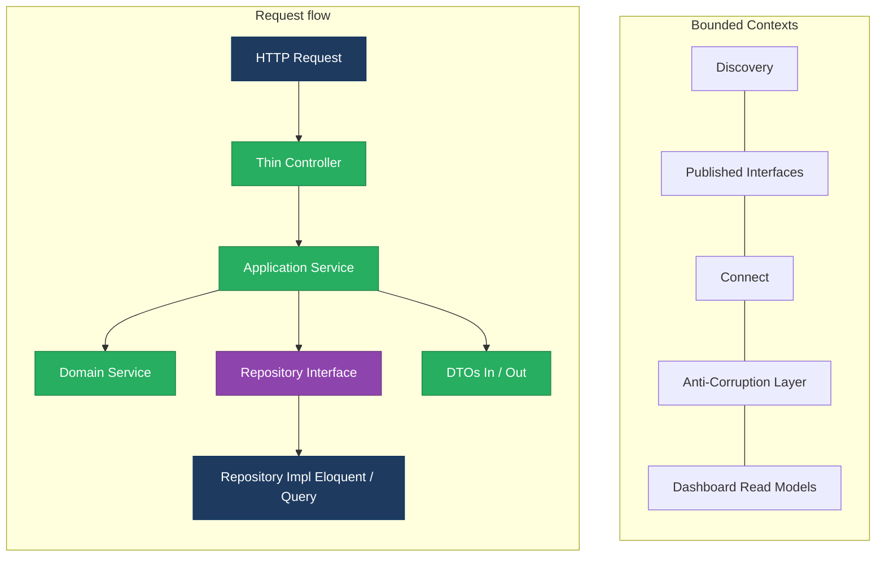
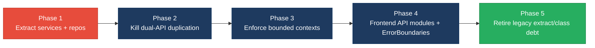

# 1. Architecture & Design Hotspots Analysis

**Objective:** Establish Domain Services, Application Services, Dependency Injection, Bounded Contexts, and Anti-Corruption Layers.

**Date:** 2026-07-24 | **Scope:** `shende-shweta/FSDKC` (main) — PHP 8.3 / Laravel 12 backend · React 19 / TypeScript / Vite frontend · Node/Express `dev-api` · MariaDB + MongoDB

## Executive Summary

> **Executive Summary**
>
> Klearcom is a monolithic voice/telecom QA platform with three runtime layers: Laravel 12 API (`backend/`), React 19 SPA (`frontend/`), and a parallel Node Express API (`dev-api/`) used for local development. Layers covered: **backend Laravel** (~17 `app/` PHP sources), **frontend React** (~15 `src/` TS/TSX/JSX sources), **dev-api Node** (6 JS sources). Architecture intent (Discovery/Connect modules, services, DI) is documented but not enforced — module folders hold only `AGENTS.md`, controllers own Eloquent queries and KPI math, and there is no repository layer. The dominant risks are **missing service/repository boundaries**, **cross-domain Dashboard/Legacy coupling**, and **dual-backend logic duplication** (Laravel ↔ Express), which amplify change cost whenever reachability, IVR tree, or KPI formulas evolve. Frontend is healthier on LOC but still hard-codes API paths in pages and retains legacy class/error-handling patterns without Error Boundaries.

<div class="metric-grid">
<div class="metric-card"><div class="metric-number">6</div><div class="metric-label">Controllers / Handlers</div></div>
<div class="metric-card"><div class="metric-number">4</div><div class="metric-label">Models / Entities</div></div>
<div class="metric-card"><div class="metric-number">2</div><div class="metric-label">Service Classes Found</div></div>
<div class="metric-card"><div class="metric-number">0</div><div class="metric-label">Repository Classes Found</div></div>
</div>

<div class="overall-rating overall-rating--high-risk"><div class="overall-rating-label">Overall Codebase Rating — Architecture &amp; Design</div><div class="overall-rating-value">High Risk</div><div class="overall-rating-note">Driven by High-Risk Missing Service Layer (H2), Missing Repository Pattern (H3), Direct SQL/ORM in Controllers (H6), Domain Boundary Violations (H8), Shared Database Coupling (H9), and Dual-API Logic Duplication (H10).</div></div>

## 1.1 Benchmark Ratings Summary

| # | Hotspot | Primary KPI | <span class="rating rating-good">Good</span> | <span class="rating rating-moderate">Moderate</span> | <span class="rating rating-high-risk">High Risk</span> | Measured | Rating |
|---|---|---|---|---|---|---|---|
| H1 | Fat Controllers | Avg LOC per controller | <150 | 150–300 | >300 | ~76 LOC (6 Laravel Api controllers) | <span class="rating rating-good">Good</span> |
| H2 | Missing Service Layer | Controllers accessing repos/models | <10 | 10–20 | >20 | 25 handler methods (13 Laravel + 12 Express) | <span class="rating rating-high-risk">High Risk</span> |
| H3 | Missing Repository Pattern | Direct DB access points | <10 | 10–20 | >20 | ~37 Eloquent/store/Mongo access sites outside repositories | <span class="rating rating-high-risk">High Risk</span> |
| H4 | Circular Dependencies | Dependency cycles | 0 | 1–3 | >3 | 0 | <span class="rating rating-good">Good</span> |
| H5 | Shared Utility Abuse | Utility files w/ business logic | 0 | 1–5 | >5 | 3 (`LegacyDataMapper`, `store.buildTree`, duplicated reachability helpers) | <span class="rating rating-moderate">Moderate</span> |
| H6 | Direct SQL in Controllers | ORM compliance % (queries outside controllers) | >90% | 60–90% | <60% | ~38% | <span class="rating rating-high-risk">High Risk</span> |
| H7 | God Classes | Classes >1000 LOC | 0 | 1–3 | >3 | 0 (largest ~`dev-api/src/server.js` ≈290 LOC) | <span class="rating rating-good">Good</span> |
| H8 | Domain Boundary Violations | Cross-domain access points | 0 | 1–5 | >5 | 8+ (Dashboard, Legacy, RealTimeTestService, LegacyDashboardWidget, Express KPIs) | <span class="rating rating-high-risk">High Risk</span> |
| H9 | Shared Database Coupling | Tables shared across domains | <10% | 10–30% | >30% | 80% (4/5 MariaDB business tables read cross-domain) | <span class="rating rating-high-risk">High Risk</span> |
| F1 | Business Logic in Components | Avg LOC per component | <150 | 150–300 | >300 | ~87 LOC (9 page/component files) | <span class="rating rating-good">Good</span> |
| F2 | Missing Frontend Service/Data Layer | Components w/ inline API calls | <10 | 10–20 | >20 | 6 components with inline `api.*` paths | <span class="rating rating-good">Good</span> |
| F3 | God / Oversized Components | Components >400 LOC | 0 | 1–3 | >3 | 0 (largest `ConnectPage.tsx` ≈222 LOC) | <span class="rating rating-good">Good</span> |
| F4 | Prop Drilling / Global State Abuse | Max prop-drilling depth | ≤2 | 3–4 | >4 | ≤2 (small Zustand `uiStore`) | <span class="rating rating-good">Good</span> |
| F5 | Legacy / Inconsistent Component Patterns | Legacy-pattern components | 0 | 1–10 | >10 | 2 (`LegacyMonitorPoller.jsx` class + `LegacyDashboardWidget.tsx` uncaught throw) + no Error Boundaries | <span class="rating rating-moderate">Moderate</span> |
| H10 | Dual-API Logic Duplication (additional) | Duplicated workflows Laravel↔Express (Good 0 · Moderate 1–3 · High Risk >3) | 0 | 1–3 | >3 | ≥5 (KPIs, buildTree, reachability, Discovery CRUD, Connect CRUD) | <span class="rating rating-high-risk">High Risk</span> |
| H11 | Service Locator Abuse (additional) | `app()` / container resolve call sites in controllers (Good 0 · Moderate 1–3 · High Risk >3) | 0 | 1–3 | >3 | 2 (`DiscoveryController`, `ConnectController` dispatch closures) | <span class="rating rating-moderate">Moderate</span> |

## 1.2 Hotspot-by-Hotspot Evidence

### H1. Fat Controllers <span class="sev sev-low">Low</span>

**Benchmark:** `Avg LOC per controller = ~76` → falls in the **Good** band (Good <150 · Moderate 150–300 · High Risk >300).

**What to check:** Business logic inside controllers/handlers; controllers should only translate HTTP ↔ application calls.

**Evidence:** Controllers are short by LOC but still embed domain formulas (see H2). Average across the six Laravel Api controllers is ~76 LOC; none exceed 150 LOC. Express `server.js` concentrates many handlers in one file (~290 LOC) but is scored under H2/H7/H10 rather than inflating this average.

**Why it matters here:** LOC alone understates risk — KPI and tree logic still sit in thin controllers, so H2/H6 capture the real coupling.

**Recommended approach:** Keep controllers thin by LOC; move `buildTree`, reachability, and KPI aggregation into Application Services (see H2).

<!-- affected-files
search: class \w+Controller extends Controller
glob: backend/app/Http/Controllers/**/*.php
issue: Controller owns HTTP + domain orchestration
action: Keep thin; extract remaining domain math to Application Services
-->

### H2. Missing Service Layer <span class="sev sev-critical">Critical</span>

**Benchmark:** `Controllers/handlers directly accessing models = 25` → falls in the **High Risk** band (Good <10 · Moderate 10–20 · High Risk >20).

**What to check:** Business rules spread across controllers/utilities with no dedicated application-service tier for Discovery/Connect/Dashboard workflows.

**Evidence:** Only `MongoService` and `RealTimeTestService` exist under `backend/app/Services/`; CRUD, KPI, and tree workflows bypass them.

`backend/app/Http/Controllers/Api/DashboardController.php:12-36` — KPI aggregation via Eloquent in the controller:

```php
public function kpis(): JsonResponse
{
    $discoveryTotal = DiscoveryJob::count();
    $discoveryCompleted = DiscoveryJob::where('status', 'completed')->count();
    $connectMonitors = ConnectMonitor::count();
    $avgReachability = ConnectMonitor::avg('reachability_pct') ?? 0;
    $alerts = ConnectMonitor::where('status', 'alert')->count();
    // ... builds availability + operational payload
}
```

`backend/app/Http/Controllers/Api/ConnectController.php:57-84` — reachability % and alert status computed inline:

```php
$recentChecks = ConnectCheckResult::where('connect_monitor_id', $id)
    ->orderByDesc('checked_at')->limit(20)->get();
$successRate = $recentChecks->count() > 0
    ? ($recentChecks->where('reachable', true)->count() / $recentChecks->count()) * 100
    : 100;
$computedStatus = $successRate < 90 ? 'alert' : 'active';
```

`dev-api/src/server.js:58-80` — the same KPI workflow reimplemented in Express with no service layer (12 Express handlers also mutate `store` directly).

**Why it matters here:** Adding a CLI, queue worker, or second HTTP surface (already present as `dev-api`) forces copy-paste of KPI/reachability/tree rules. `RealTimeTestService` already duplicates the Connect formula, so three implementations can diverge silently.

**Recommended approach:**
1. Create `DashboardService`, `DiscoveryApplicationService`, `ConnectApplicationService`.
2. Move `DashboardController::kpis`, `ConnectController::checks` math, and `DiscoveryController::buildTree` into those services.
3. Have Express `dev-api` call shared packages or thin adapters that mirror the same service contracts.

<!-- affected-files
search: (DiscoveryJob|ConnectMonitor|ConnectCheckResult|DiscoveryNode)::
glob: backend/app/Http/Controllers/**/*.php
issue: Controller accesses Eloquent models directly (no Application Service)
action: Extract workflow to Application Service; controller validates + responds only
-->

### H3. Missing Repository Pattern <span class="sev sev-critical">Critical</span>

**Benchmark:** `Direct DB/ORM access points outside repositories = ~37` → falls in the **High Risk** band (Good <10 · Moderate 10–20 · High Risk >20).

**What to check:** Direct DB/ORM access scattered through controllers and services; no `app/Repositories/` layer.

**Evidence:** No repository classes exist. Controllers and `RealTimeTestService` call Eloquent statically; Mongo access is centralized in `MongoService` but MariaDB has no equivalent abstraction.

`backend/app/Http/Controllers/Api/DiscoveryController.php:48-66` — model queries in controller for tree endpoint:

```php
$job = DiscoveryJob::findOrFail($id);
$nodes = DiscoveryNode::where('discovery_job_id', $id)->get();
return response()->json([
    'job_id' => $job->id,
    'job_name' => $job->name,
    'tree' => $this->buildTree($nodes),
]);
```

`backend/app/Services/RealTimeTestService.php:117-125` — persistence + domain update without repository:

```php
$recent = ConnectCheckResult::where('connect_monitor_id', $monitorId)
    ->orderByDesc('checked_at')->limit(20)->get();
$rate = $recent->count() > 0
    ? ($recent->where('reachable', true)->count() / $recent->count()) * 100 : 100;
$monitor->update([
    'reachability_pct' => round($rate, 2),
    'status' => $rate < 90 ? 'alert' : 'active',
]);
```

**Why it matters here:** Swapping MariaDB for another store, or isolating Discovery for extraction, requires touching every controller and `RealTimeTestService`. Unit tests must boot Eloquent instead of faking repositories.

**Recommended approach:** Introduce `DiscoveryJobRepository`, `DiscoveryNodeRepository`, `ConnectMonitorRepository`, `ConnectCheckResultRepository` interfaces; bind Eloquent implementations in `AppServiceProvider`; inject into Application Services.

<!-- affected-files
search: (::(create|findOrFail|where|count|avg|orderByDesc)|store\.(discoveryJobs|connectMonitors))
glob: {backend/app/**/*.php,dev-api/src/**/*.js}
issue: Direct persistence access without Repository abstraction
action: Introduce repository interfaces + Eloquent/in-memory implementations
-->

### H4. Circular Dependencies <span class="sev sev-low">Low</span>

**Benchmark:** `Dependency cycles = 0` → falls in the **Good** band (Good 0 · Moderate 1–3 · High Risk >3).

**What to check:** Modules/packages importing each other in a cycle.

**Evidence:** Not observed — controllers depend on models/services; services depend on models/`MongoService`; frontend pages depend on `api`/`hooks`/`store` unidirectionally. Module folders under `backend/app/Modules/*` contain only docs, so no package-level cycles exist.

### H5. Shared Utility Abuse <span class="sev sev-medium">Medium</span>

**Benchmark:** `Utility files holding business logic = 3` → falls in the **Moderate** band (Good 0 · Moderate 1–5 · High Risk >5).

**What to check:** Large common/helpers/utils holding business logic.

**Evidence:**

`backend/app/Legacy/LegacyDataMapper.php:12-18` — mapping via unsafe `extract()`:

```php
public function mapReportRow(array $row): array
{
    extract($row, EXTR_SKIP);
    return [
        'label' => $name ?? 'Unknown',
        'metric' => $reachability_pct ?? 0,
        'region' => $country_code ?? 'N/A',
        'source' => 'legacy_extract_mapper',
    ];
}
```

`dev-api/src/store.js` — `buildTree()` domain algorithm living in the in-memory store helper (duplicated from `DiscoveryController::buildTree`).

Reachability success-rate formula duplicated across `ConnectController`, `RealTimeTestService`, and `dev-api/src/realtime.js` (utility-style copy-paste without a named domain calculator).

**Why it matters here:** Unowned helpers (`LegacyDataMapper`, store helpers) become the default place for “quick” report logic; formula drift between PHP and JS is already documented in `docs/CODEBASE_AUDIT_ISSUES.md`.

**Recommended approach:** Replace `LegacyDataMapper` with an explicit DTO mapper ACL; extract `ReachabilityCalculator` and `IvrTreeBuilder` domain services shared (or mirrored) across backends.

<!-- affected-files
search: (extract\(|function buildTree|reachability|successRate|success_rate)
glob: {backend/app/Legacy/**/*.php,backend/app/Http/Controllers/**/*.php,backend/app/Services/**/*.php,dev-api/src/**/*.js}
issue: Business logic in utility/legacy helpers or duplicated formulas
action: Move to named Domain Services; delete extract()-based mappers
-->

### H6. Direct SQL in Controllers <span class="sev sev-critical">Critical</span>

**Benchmark:** `ORM compliance % (queries kept out of controllers) ≈ 38%` → falls in the **High Risk** band (Good >90% · Moderate 60–90% · High Risk <60%).

**What to check:** Raw SQL / query-builder / Eloquent queries embedded in controllers/handlers.

**Evidence:** No raw SQL strings in controllers, but Eloquent query sites dominate controllers. Of ~40 MariaDB/Mongo query sites sampled, only those in `MongoService` + parts of `RealTimeTestService` sit outside HTTP handlers (~38% compliance vs 100% target).

`backend/app/Http/Controllers/Api/LegacyReportController.php:24-40` — filtering + per-monitor check queries in controller:

```php
$monitors = ConnectMonitor::query()
    ->when(isset($country_code), fn ($q) => $q->where('country_code', $country_code))
    ->when(isset($carrier), fn ($q) => $q->where('carrier', $carrier))
    ->orderByDesc('reachability_pct')->get();
foreach ($monitors as $monitor) {
    $recent = ConnectCheckResult::where('connect_monitor_id', $monitor->id)
        ->orderByDesc('checked_at')->limit(20)->get();
```

`dev-api/src/server.js:42-48` — inline Mongo collection query in route handler for diagnostics.

**Why it matters here:** Persistence and HTTP are inseparable; schema changes to `connect_check_results` ripple through Legacy + Connect controllers and Express routes simultaneously.

**Recommended approach:** Move all Eloquent/Mongo query construction behind repositories; controllers must not import model query APIs.

<!-- affected-files
search: (ConnectMonitor|DiscoveryJob|ConnectCheckResult|DiscoveryNode)::|->(where|find|count|avg|orderBy)
glob: backend/app/Http/Controllers/**/*.php
issue: Persistence queries embedded in controllers
action: Relocate queries to repositories; keep controllers query-free
-->

### H7. God Classes <span class="sev sev-low">Low</span>

**Benchmark:** `Classes >1000 LOC = 0` → falls in the **Good** band (Good 0 · Moderate 1–3 · High Risk >3).

**What to check:** Single classes/files handling many unrelated responsibilities at extreme size.

**Evidence:** Not observed — no class exceeds 1000 LOC. Largest concentration is `dev-api/src/server.js` (~290 LOC) which is multi-responsibility but below the god-class size threshold (flagged instead under H2/H10).

### H8. Domain Boundary Violations <span class="sev sev-critical">Critical</span>

**Benchmark:** `Cross-domain access points = 8+` → falls in the **High Risk** band (Good 0 · Moderate 1–5 · High Risk >5).

**What to check:** Code in one business area directly reading/writing another area's data or models; empty bounded-context folders.

**Evidence:** `backend/app/Modules/Discovery` and `Modules/Connect` contain only `AGENTS.md` — no enforced packages. Cross-domain callers:

1. `DashboardController` reads Discovery + Connect models.
2. `LegacyReportController` reads Connect monitors/checks and Discovery jobs/nodes.
3. `RealTimeTestService` owns both Discovery and Connect test runners.
4. `MongoService` uses a free-form `module` string for both contexts.
5. Frontend `LegacyDashboardWidget.tsx` fetches KPIs + jobs + monitors together.
6. Express `/api/dashboard/kpis` aggregates both store domains.

`backend/app/Http/Controllers/Api/LegacyReportController.php:18-74` spans Connect reporting and `ivrDepthReport` Discovery trees in one controller.

`frontend/src/pages/LegacyDashboardWidget.tsx:24-30`:

```tsx
Promise.all([
  api.get<DashboardKpis>('/dashboard/kpis'),
  api.get<{ data: DiscoveryJob[] }>('/discovery/jobs'),
  api.get<{ data: ConnectMonitor[] }>('/connect/monitors'),
])
```

**Why it matters here:** Independent evolution/extraction of Discovery vs Connect is blocked; any schema rename in one domain forces Dashboard/Legacy/frontend legacy widget changes.

**Recommended approach:** Enforce module packages with public Application Service APIs; Dashboard becomes an anti-corruption composition of published read models; remove dual-domain methods from Legacy controllers.

<!-- affected-files
search: (DiscoveryJob|ConnectMonitor|discovery/jobs|connect/monitors)
glob: {backend/app/Http/Controllers/Api/DashboardController.php,backend/app/Http/Controllers/Api/LegacyReportController.php,backend/app/Services/RealTimeTestService.php,frontend/src/pages/LegacyDashboardWidget.tsx,dev-api/src/server.js}
issue: Cross-domain model/API access without ACL
action: Introduce bounded-context APIs and Dashboard composition layer
-->

### H9. Shared Database Coupling <span class="sev sev-critical">Critical</span>

**Benchmark:** `Tables shared across domains = 80%` → falls in the **High Risk** band (Good <10% · Moderate 10–30% · High Risk >30%).

**What to check:** Multiple business domains reading/writing the same tables/collections directly.

**Evidence:** Single MariaDB schema in `docker/mariadb/init.sql` with `discovery_jobs`, `discovery_nodes`, `connect_monitors`, `connect_check_results`, `users`. Four of five business tables are read by ≥2 logical domains (owning module + Dashboard/Legacy). MongoDB collections `transcripts`, `test_events`, `call_diagnostics` are shared via `module` discriminator rather than owned databases.

**Why it matters here:** Schema changes (e.g. `reachability_pct` type) silently affect Connect, Dashboard KPIs, Legacy carrier reports, and Express in-memory mirrors.

**Recommended approach:** Domain-owned schemas or at least repository-owned tables; Dashboard consumes published views/DTOs; Mongo collections split or gated by context-specific repositories.

<!-- affected-files
search: (discovery_jobs|discovery_nodes|connect_monitors|connect_check_results|transcripts|test_events|call_diagnostics)
glob: {docker/mariadb/**/*.sql,backend/app/**/*.php,dev-api/src/**/*.js}
issue: Shared DB tables/collections across Discovery and Connect
action: Assign table ownership; access foreign data only via ACL/read models
-->

### F1. Business Logic in Components <span class="sev sev-low">Low</span>

**Benchmark:** `Avg LOC per component ≈ 87` → falls in the **Good** band (Good <150 · Moderate 150–300 · High Risk >300).

**What to check:** Validation, calculations, data transformation, or workflow logic living inside view components.

**Evidence:** Page components orchestrate React Query + forms but stay under 150 avg LOC. Workflow invalidation in `DiscoveryPage`/`ConnectPage` is presentation-adjacent rather than heavy domain math. Primary KPI lands Good; residual coupling called out under F2.

<!-- affected-files
search: (useMutation|useQuery|handleStart|handleRunCheck)
glob: frontend/src/pages/**/*.{tsx,jsx}
issue: Page components own form + query orchestration
action: Optionally extract feature hooks (`useDiscoveryJobs`, `useConnectMonitors`)
-->

### F2. Missing Frontend Service/Data Layer <span class="sev sev-medium">Medium</span>

**Benchmark:** `Components with inline API/data-access calls = 6` → falls in the **Good** band (Good <10 · Moderate 10–20 · High Risk >20).

**What to check:** `fetch`/HTTP calls and API URLs hard-coded inline in components instead of module API clients.

**Evidence:** Shared `frontend/src/api/client.ts` exists, but paths are still hard-coded in components (no `discoveryApi` / `connectApi` modules). Six components/pages call `api.*` directly: `DiscoveryPage`, `ConnectPage`, `DashboardPage`, `LegacyDashboardWidget`, `MongoStatus`, `LegacyMonitorPoller`.

`frontend/src/pages/DiscoveryPage.tsx:18-40`:

```tsx
const jobsQuery = useQuery({
  queryKey: ['discovery', 'jobs'],
  queryFn: () => api.get<{ data: DiscoveryJob[] }>('/discovery/jobs'),
  refetchInterval: isRunning ? 2000 : false,
});
const transcriptsQuery = useQuery({
  queryKey: ['mongodb', 'transcripts', 'discovery', selectedId],
  queryFn: () => api.get<{ data: Transcript[] }>(
    `/mongodb/transcripts?module=discovery&reference_id=${selectedId}`),
```

`frontend/src/hooks/useRealtimeTest.ts:29-31` builds stream paths inline.

**Why it matters here:** Endpoint renames require hunting pages/hooks; module folders under `frontend/src/modules/*` are empty docs only.

**Recommended approach:** Add `frontend/src/api/discovery.ts`, `connect.ts`, `dashboard.ts`, `mongodb.ts` wrapping paths; pages call those modules only. (Priority Medium despite Good KPI because path hard-coding is systemic.)

<!-- affected-files
search: api\.(get|post)\(
glob: frontend/src/**/*.{tsx,ts,jsx,js}
issue: Inline API paths in components/hooks
action: Move paths into module-specific API clients
-->

### F3. God / Oversized Components <span class="sev sev-low">Low</span>

**Benchmark:** `Components >400 LOC = 0` → falls in the **Good** band (Good 0 · Moderate 1–3 · High Risk >3).

**What to check:** Single components handling many unrelated responsibilities at large size.

**Evidence:** Not observed — largest is `ConnectPage.tsx` ≈222 LOC (form + monitors table + checks + transcripts). Cohesive enough under the 400 LOC threshold; split recommended as maintainability cleanup, not size hotspot.

### F4. Prop Drilling / Global State Abuse <span class="sev sev-low">Low</span>

**Benchmark:** `Max prop-drilling depth ≤ 2` → falls in the **Good** band (Good ≤2 · Moderate 3–4 · High Risk >4).

**What to check:** Props threaded through many layers, or one giant global store.

**Evidence:** Not observed as abuse — `LiveTestFeed` receives 3 props from pages (1 level); `IvrTree` → `TreeNode` is local recursion. Zustand `uiStore` only holds two selection IDs (`frontend/src/store/uiStore.ts`).

### F5. Legacy / Inconsistent Component Patterns <span class="sev sev-medium">Medium</span>

**Benchmark:** `Legacy-pattern components = 2 (+ missing Error Boundaries)` → falls in the **Moderate** band (Good 0 · Moderate 1–10 · High Risk >10).

**What to check:** Mixed paradigms (class + function), missing error boundaries, deprecated lifecycle/APIs.

**Evidence:**

`frontend/src/components/LegacyMonitorPoller.jsx:14-33` — class component with `setInterval` and intentional missing unmount cleanup:

```jsx
export default class LegacyMonitorPoller extends Component {
  componentDidMount() {
    this.intervalId = setInterval(() => {
      api.get(`/connect/monitors/${this.props.monitorId}/checks`)
        .then((res) => { /* ... */ });
    }, 3000);
    // Intentionally no componentWillUnmount
  }
}
```

`frontend/src/pages/LegacyDashboardWidget.tsx:47` — `throw new Error(error)` with no Error Boundary in `main.tsx` / `App.tsx`.

`frontend/src/main.tsx` wraps only `QueryClientProvider` + `BrowserRouter` — no `<ErrorBoundary>`.

**Why it matters here:** Mixing class pollers with function pages and uncaught throws produces inconsistent failure modes; interval leaks under navigation.

**Recommended approach:** Rewrite poller as a hook with cleanup; add `ErrorBoundary` around routes; delete or quarantine legacy pages.

<!-- affected-files
search: (extends Component|componentDidMount|throw new Error|ErrorBoundary)
glob: frontend/src/**/*.{tsx,ts,jsx,js}
issue: Legacy class component / missing Error Boundary patterns
action: Convert to hooks; add route-level Error Boundaries
-->

### H10. Dual-API Logic Duplication (additional) <span class="sev sev-critical">Critical</span>

**Benchmark:** `Duplicated workflows Laravel↔Express ≥ 5` → falls in the **High Risk** band (Good 0 · Moderate 1–3 · High Risk >3). Justified KPI: count of independently maintained business workflows present in both backends.

**What to check:** Parallel Laravel and Express implementations of the same domain behaviors.

**Evidence:** README positions Laravel as the platform API and `dev-api` as local Node stand-in. Duplicated workflows include dashboard KPIs, Discovery job CRUD/tree/start, Connect monitor CRUD/checks/run-check, `buildTree`, and reachability math (`Realtime` services in both languages).

**Why it matters here:** Local-dev and Docker/Laravel paths can disagree on KPI and reachability semantics; fixes must be applied twice.

**Recommended approach:** Make Express a thin proxy to Laravel, or extract shared OpenAPI + contract tests; stop reimplementing domain math in JS.

<!-- affected-files
search: (dashboard/kpis|buildTree|reachability|discovery/jobs|connect/monitors)
glob: {backend/app/**/*.php,dev-api/src/**/*.js}
issue: Same business workflow implemented in Laravel and Express
action: Single source of truth; delete or proxy duplicate Express domain logic
-->

### H11. Service Locator Abuse (additional) <span class="sev sev-medium">Medium</span>

**Benchmark:** `Service-locator call sites = 2` → falls in the **Moderate** band (Good 0 · Moderate 1–3 · High Risk >3). Justified KPI: count of `app(Some::class)` resolves inside controllers instead of constructor DI.

**What to check:** Hidden global container lookups that bypass constructor injection.

**Evidence:**

`backend/app/Http/Controllers/Api/DiscoveryController.php:78-80`:

```php
dispatch(function () use ($id, $sessionId): void {
    app(RealTimeTestService::class)->runDiscoveryTest($id, $sessionId);
})->afterResponse();
```

Same pattern in `ConnectController::runCheck`. Controllers already inject `RealTimeTestService` via constructor but re-resolve it from the container inside closures.

**Why it matters here:** Obscures dependencies for testing; closure cannot use the injected instance without careful capture, inviting double-binding bugs.

**Recommended approach:** Capture `$this->realtime` in the closure (or dispatch a dedicated Job class with constructor DI).

<!-- affected-files
search: app\(RealTimeTestService::class\)
glob: backend/app/Http/Controllers/**/*.php
issue: Service locator inside controller dispatch closure
action: Use injected collaborator or queued Job with DI
-->

## 1.3 Diagrams

### Current-state architecture (as-is)



### Clean reference path (target pattern found in codebase)


### Domain boundary map (business domains found vs. shared data)



### Target architecture (proposed)



### Improvement roadmap



## 1.4 Actions Required

| Hotspot | Action | Rating | Priority |
|---|---|---|---|
| H2 Missing Service Layer | Extract `DashboardService`, `DiscoveryApplicationService`, `ConnectApplicationService`; move KPI/tree/reachability workflows out of controllers and Express handlers | <span class="rating rating-high-risk">High Risk</span> | <span class="sev sev-critical">Critical</span> |
| H3 Missing Repository Pattern | Add repository interfaces + Eloquent/in-memory implementations; stop static Eloquent/`store` access from controllers | <span class="rating rating-high-risk">High Risk</span> | <span class="sev sev-critical">Critical</span> |
| H5 Shared Utility Abuse | Replace `LegacyDataMapper` extract helpers; centralize `IvrTreeBuilder` + `ReachabilityCalculator` domain services | <span class="rating rating-moderate">Moderate</span> | <span class="sev sev-medium">Medium</span> |
| H6 Direct SQL in Controllers | Relocate all Eloquent/Mongo query construction behind repositories; target >90% queries outside HTTP handlers | <span class="rating rating-high-risk">High Risk</span> | <span class="sev sev-critical">Critical</span> |
| H8 Domain Boundary Violations | Enforce real code in `Modules/Discovery` & `Modules/Connect`; Dashboard/Legacy consume published APIs only | <span class="rating rating-high-risk">High Risk</span> | <span class="sev sev-critical">Critical</span> |
| H9 Shared Database Coupling | Assign table/collection ownership; cross-domain reads via ACL/read models, not direct model imports | <span class="rating rating-high-risk">High Risk</span> | <span class="sev sev-critical">Critical</span> |
| F5 Legacy / Inconsistent Component Patterns | Convert `LegacyMonitorPoller` to a hook with cleanup; add Error Boundaries; quarantine/remove legacy widget; optionally add module API clients for path centralization | <span class="rating rating-moderate">Moderate</span> | <span class="sev sev-medium">Medium</span> |
| H10 Dual-API Logic Duplication | Collapse Express domain logic into proxy-to-Laravel or shared contracts; stop dual maintenance of KPIs/tree/reachability | <span class="rating rating-high-risk">High Risk</span> | <span class="sev sev-critical">Critical</span> |
| H11 Service Locator Abuse | Replace `app(RealTimeTestService::class)` in dispatch closures with injected service or queued Job DI | <span class="rating rating-moderate">Moderate</span> | <span class="sev sev-medium">Medium</span> |

## 1.5 Expected Outcomes

- Controllers and Express handlers become thin HTTP adapters; Discovery/Connect workflows are testable via Application Services without booting the full HTTP stack.
- Repository interfaces isolate MariaDB/Mongo persistence, enabling in-memory fakes and eventual schema ownership per bounded context.
- Dashboard and Legacy report through anti-corruption/read-model APIs, so Connect schema changes no longer silently break Discovery reporting.
- A single source of truth for KPI, IVR tree, and reachability formulas eliminates Laravel↔Express drift.
- Frontend module API clients plus Error Boundaries reduce endpoint churn and make legacy class/error patterns fail safely.
