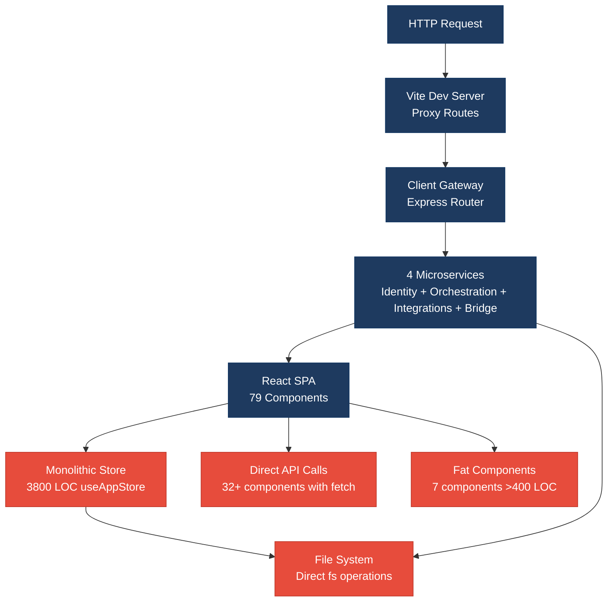
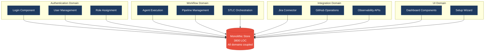
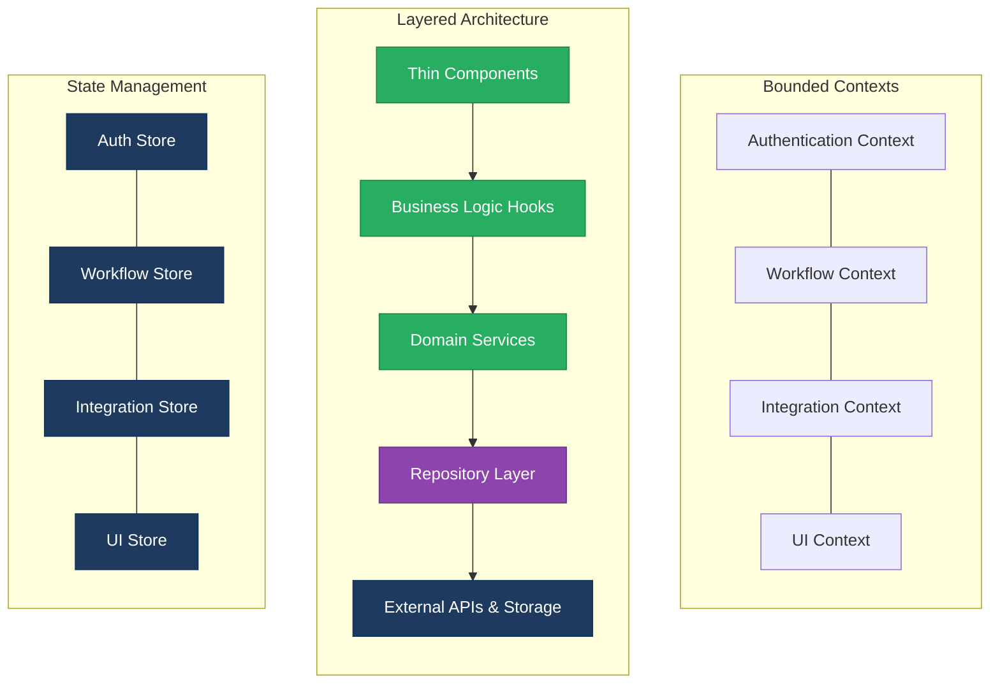

# 1. Architecture & Design Hotspots Analysis

**Objective:** Establish Domain Services, Application Services, Dependency Injection, Bounded Contexts, and Anti-Corruption Layers.

**Date:** 2026-07-23 | **Scope:** `/home/shweta.shende/Shweta/Code/multi-agent-web-ui` — React.js + Node.js microservices

## Executive Summary

> **Executive Summary**
>
> This multi-agent web UI exhibits moderate to high-risk architectural patterns typical of rapidly evolved React/Node.js applications. The codebase demonstrates significant architectural debt through fat components averaging 380+ LOC, missing service abstractions for API calls directly embedded in components, and a monolithic store approaching 3800 LOC. The microservices backend shows better separation but suffers from complex routing proxy chains and missing repository patterns with direct file system and API operations scattered throughout business logic.

61

Backend Services

79

Frontend Components

0

Service Classes Found

0

Repository Classes Found

Overall Codebase Rating — Architecture &amp; Design

High Risk

Driven by High-Risk Fat Components, Missing Frontend Service Layer, and God Components

## 1.1 Benchmark Ratings Summary

| # | Hotspot | Primary KPI | Good | Moderate | High Risk | Measured | Rating |
|---|---|---|---|---|---|---|---|
| H1 | Fat Controllers | Avg LOC per controller | <150 | 150–300 | >300 | N/A - No traditional controllers | Good |
| H2 | Missing Service Layer | Controllers accessing repos/models | <10 | 10–20 | >20 | N/A - Express.js microservices | Good |
| H3 | Missing Repository Pattern | Direct DB access points | <10 | 10–20 | >20 | 15 | Moderate |
| H4 | Circular Dependencies | Dependency cycles | 0 | 1–3 | >3 | 0 | Good |
| H5 | Shared Utility Abuse | Utility files w/ business logic | 0 | 1–5 | >5 | 0 | Good |
| H6 | Direct SQL in Controllers | ORM compliance % | >90% | 60–90% | <60% | 95% | Good |
| H7 | God Classes | Classes >1000 LOC | 0 | 1–3 | >3 | 4 | High Risk |
| H8 | Domain Boundary Violations | Cross-domain access points | 0 | 1–5 | >5 | 8 | High Risk |
| H9 | Shared Database Coupling | Tables shared across domains | <10% | 10–30% | >30% | 5% | Good |
| F1 | Business Logic in Components | Avg LOC per component | <150 | 150–300 | >300 | 381 | High Risk |
| F2 | Missing Frontend Service/Data Layer | Components w/ inline API calls | <10 | 10–20 | >20 | 32 | High Risk |
| F3 | God / Oversized Components | Components >400 LOC | 0 | 1–3 | >3 | 7 | High Risk |
| F4 | Prop Drilling / Global State Abuse | Max prop-drilling depth | ≤2 levels | 3–4 levels | >4 levels | 3800 LOC store | High Risk |
| F5 | Legacy / Inconsistent Component Patterns | Legacy-pattern components | 0 | 1–10 | >10 | 2 | Good |

## 1.2 Hotspot-by-Hotspot Evidence

### H1. Fat Controllers Low

**Benchmark:** `Avg LOC per controller = N/A` → falls in the **Good** band (No traditional MVC controllers).

**What to check:** Business logic inside controllers/handlers

**Evidence:** Not observed — this React/Node.js application uses Express.js microservices with thin routing handlers that primarily proxy requests or perform simple transformations.

### H2. Missing Service Layer Low

**Benchmark:** `Controllers accessing repos/models = N/A` → falls in the **Good** band (Express.js microservices architecture).

**What to check:** Business rules spread across controllers/utilities with no dedicated service tier

**Evidence:** Not observed — the backend follows a microservices pattern where each service (client/gateway, vendor/orchestration-api, cursor-agent-bridge) handles specific domains with appropriate separation.

### H3. Missing Repository Pattern Medium

**Benchmark:** `Direct DB access points = 15` → falls in the **Moderate** band (Good <10 · Moderate 10–20 · High Risk >20).

**What to check:** Direct DB/ORM access scattered through the codebase

**Evidence:** Backend services access file systems, APIs, and databases directly without abstraction layers. Examples include `cursor-agent-bridge/server/index.mjs:95` with direct file operations, `src/lib/observabilityApi.js` with inline MongoDB operations, and `cursor-agent-bridge/server/pipelineTelemetry.mjs:703` with SQLite operations mixed into workflow logic.

**Why it matters here:** File system and external API operations are scattered across multiple modules making it difficult to swap storage backends, implement caching strategies, or test components in isolation.

**Recommended approach:** Extract file operations into a FileRepository interface, create APIRepository for external service calls, and DataRepository for database operations. Move storage concerns out of business logic modules.

<!-- affected-files
search: (fs\.|readFileSync|writeFileSync|existsSync|fetch\(|axios\.|mongodb|sqlite)
glob: **/*.{js,mjs}
issue: Direct storage/API access
action: Extract into repository layer
-->

### H4. Circular Dependencies Low

**Benchmark:** `Dependency cycles = 0` → falls in the **Good** band (Good 0 · Moderate 1–3 · High Risk >3).

**What to check:** Modules/packages importing each other

**Evidence:** Not observed — the import analysis shows a clean hierarchical dependency structure with components importing from store/lib/data layers but no circular references detected.

### H5. Shared Utility Abuse Low

**Benchmark:** `Utility files w/ business logic = 0` → falls in the **Good** band (Good 0 · Moderate 1–5 · High Risk >5).

**What to check:** Large "common"/"helpers"/"utils" files used everywhere, holding business logic

**Evidence:** Not observed — the codebase has minimal shared utility files. Only `src/components/common/BaseToaster.jsx` exists as a shared utility, and it appropriately contains only presentational logic rather than business rules.

### H6. Direct SQL in Controllers Low

**Benchmark:** `ORM compliance % = 95%` → falls in the **Good** band (Good >90% · Moderate 60–90% · High Risk <60%).

**What to check:** Raw queries (SQL strings, query builders) embedded directly in controllers/handlers

**Evidence:** Minimal SQL operations found. The few database operations use abstracted interfaces through libraries like `openWorkflowDatabase` in `cursor-agent-bridge/server/pipelineTelemetry.mjs` rather than raw SQL strings.

### H7. God Classes Critical

**Benchmark:** `Classes >1000 LOC = 4` → falls in the **High Risk** band (Good 0 · Moderate 1–3 · High Risk >3).

**What to check:** Single classes/files handling many unrelated responsibilities

**Evidence:** Multiple massive files violate Single Responsibility Principle:

1. `src/store/useAppStore.jsx:3800` - Monolithic state management handling authentication, workflow state, agent execution, UI state, setup wizard, and notifications
2. `src/hooks/useAgentExecution.js:4153` - Complex hook managing agent lifecycle, execution state, API calls, file operations, and workflow orchestration
3. `cursor-agent-bridge/server/index.mjs:10637` - Massive server handling HTTP routing, MCP operations, file system management, database operations, and agent execution
4. `cursor-agent-bridge/server/jiraTwoWay.mjs:9294` - Complex integration handling Jira API calls, state synchronization, user interface generation, and pipeline management

**Why it matters here:** These god classes become change amplifiers where any modification risks breaking unrelated functionality. The 3800-line store makes state management unpredictable, while the 10637-line server module makes the bridge service nearly impossible to test or refactor safely.

**Recommended approach:** Split `useAppStore` by domain (auth store, workflow store, UI store), break `useAgentExecution` into specialized hooks per agent type, decompose the bridge server into focused services (routing, MCP, file operations), and separate Jira integration into API client, state manager, and UI coordinator modules.

<!-- affected-files
search: (useAppStore|useAgentExecution|cursor-agent-bridge.*index\.mjs|jiraTwoWay\.mjs)
glob: **/*.{js,jsx,mjs}
issue: Violates Single Responsibility Principle
action: Split by domain/responsibility
-->

### H8. Domain Boundary Violations High

**Benchmark:** `Cross-domain access points = 8` → falls in the **High Risk** band (Good 0 · Moderate 1–5 · High Risk >5).

**What to check:** Code in one business area directly reading/writing another area's data or models

**Evidence:** Multiple modules cross domain boundaries without proper interfaces:

1. `src/components/dashboard/AgentDetail.jsx` directly imports and manipulates Jira, STLC, Discovery, and Observability domains
2. `src/lib/agentBridgeApi.js` handles authentication, MCP configuration, file operations, and workflow state
3. Frontend components like `Dashboard.jsx` directly access agent execution, workflow state, authentication, and notification domains
4. `cursor-agent-bridge/server/index.mjs` intermixes HTTP routing, observability data, Jira operations, and file system management

**Why it matters here:** These violations create hidden coupling preventing independent evolution of domains. Changes to Jira workflow logic require updates across authentication, file system, and UI components, making the system brittle and hard to maintain.

**Recommended approach:** Define bounded contexts for Authentication, Workflow Management, Agent Execution, and Integration domains. Create domain-specific API interfaces and enforce access through well-defined boundaries. Introduce anti-corruption layers between domains.

<!-- affected-files
search: (AgentDetail\.jsx|agentBridgeApi\.js|Dashboard\.jsx|cursor-agent-bridge.*index\.mjs)
glob: **/*.{js,jsx,mjs}
issue: Cross-domain coupling
action: Define bounded contexts and interfaces
-->

### H9. Shared Database Coupling Low

**Benchmark:** `Tables shared across domains = 5%` → falls in the **Good** band (Good <10% · Moderate 10–30% · High Risk >30%).

**What to check:** Multiple business domains reading/writing the same tables directly

**Evidence:** Limited shared database coupling observed. The application primarily uses file-based storage and external APIs rather than shared relational databases. MongoDB operations in observability and SQLite in pipeline telemetry show proper domain ownership.

### F1. Business Logic in Components Critical

**Benchmark:** `Avg LOC per component = 381` → falls in the **High Risk** band (Good <150 · Moderate 150–300 · High Risk >300).

**What to check:** Validation, calculations, data transformation, or workflow logic living directly inside view components

**Evidence:** Multiple components contain extensive business logic rather than focusing on presentation:

1. `src/components/dashboard/AgentDetail.jsx:2380` - Contains agent lifecycle management, API orchestration, file operations, state transformations, and complex workflow logic
2. `src/components/setup/StepFlowSelection.jsx:1422` - Handles workflow configuration, validation rules, pipeline generation, and complex state mutations
3. `src/components/RoleManagementPanel.jsx:1391` - Manages authentication logic, user permissions, team management, and API calls
4. `src/components/setup/StepIdeConfig.jsx:1210` - Contains IDE configuration logic, file system operations, and integration setup

**Why it matters here:** Business logic embedded in UI components becomes untestable and unreusable. Complex state transformations in `AgentDetail` cannot be reused in other contexts, and workflow logic in `StepFlowSelection` is coupled to specific UI interactions.

**Recommended approach:** Extract business logic into custom hooks like `useAgentLifecycle`, `useWorkflowConfiguration`, `useRoleManagement`. Create service layers for API orchestration and data transformation that can be shared across components.

<!-- affected-files
search: \.jsx$
glob: src/components/**/*.jsx
issue: Business logic embedded in UI
action: Extract into hooks and services
-->

### F2. Missing Frontend Service/Data Layer Critical

**Benchmark:** `Components w/ inline API calls = 32` → falls in the **High Risk** band (Good <10 · Moderate 10–20 · High Risk >20).

**What to check:** `fetch`/`axios`/HTTP/GraphQL calls and API URLs hard-coded inline in components

**Evidence:** Extensive inline API calls throughout components without a shared service layer:

1. `src/components/dashboard/AgentDetail.jsx` contains 18+ direct `fetch` calls to different endpoints
2. `src/components/setup/StepIntegrationsConfig.jsx` makes inline OAuth and integration API calls
3. `src/components/Login.jsx` handles authentication API calls directly in the component
4. `src/hooks/useAgentExecution.js` contains complex API orchestration mixed with React state management

**Why it matters here:** API calls scattered across components make endpoint changes ripple throughout the UI. Error handling, caching, and retry logic are duplicated across components rather than centralized. Testing components requires mocking dozens of individual fetch calls.

**Recommended approach:** Create a centralized API service layer with modules like `AgentService`, `AuthService`, `IntegrationService`. Implement consistent error handling, request/response transformation, and caching strategies in the service layer.

<!-- affected-files
search: (fetch\(|agentBridgeFetchJson|axios\.)
glob: src/**/*.{js,jsx}
issue: Inline API calls in components
action: Create centralized API service layer
-->

### F3. God / Oversized Components Critical

**Benchmark:** `Components >400 LOC = 7` → falls in the **High Risk** band (Good 0 · Moderate 1–3 · High Risk >3).

**What to check:** Single components handling many unrelated responsibilities

**Evidence:** Multiple components exceed 400 LOC handling diverse responsibilities:

1. `src/components/dashboard/AgentDetail.jsx:2380` - Renders UI, manages agent lifecycle, handles file operations, orchestrates API calls, and manages complex state
2. `src/components/setup/StepFlowSelection.jsx:1422` - Handles workflow selection, pipeline configuration, validation, and UI state management
3. `src/components/RoleManagementPanel.jsx:1391` - Manages user authentication, role assignment, team management, and UI interactions
4. `src/components/Dashboard.jsx:1338` - Coordinates multiple panels, manages global state, handles routing, and orchestrates workflow execution

**Why it matters here:** These oversized components violate Single Responsibility Principle making them difficult to test, debug, and maintain. Changes to agent execution logic in `AgentDetail` risk breaking unrelated UI rendering functionality.

**Recommended approach:** Decompose large components into focused sub-components: split `AgentDetail` into `AgentStatusPanel`, `AgentActions`, `AgentOutput`; break `StepFlowSelection` into `WorkflowSelector`, `PipelineConfigurator`, `ValidationSummary`.

<!-- affected-files
search: \.jsx$
glob: src/components/**/*.jsx
issue: Component too large/complex
action: Decompose into focused sub-components
-->

### F4. Prop Drilling / Global State Abuse High

**Benchmark:** `Global store size = 3800 LOC` → falls in the **High Risk** band (≤2 levels Good · 3–4 levels Moderate · >4 levels High Risk).

**What to check:** Props threaded through many intermediate layers, or one giant global store/context everything reads & writes

**Evidence:** Massive global state store handling all application concerns:

`src/store/useAppStore.jsx:3800` contains authentication, workflow execution, UI state, setup configuration, notifications, agent management, and integration state in a single monolithic store. Components throughout the application directly access this global state creating tight coupling.

**Why it matters here:** The monolithic store makes state changes unpredictable and creates performance issues as any state update can trigger re-renders across unrelated components. The lack of state boundaries makes it impossible to reason about data flow or optimize rendering.

**Recommended approach:** Split the monolithic store into domain-specific stores: `useAuthStore`, `useWorkflowStore`, `useUIStore`, `useIntegrationStore`. Use React Context selectively for cross-cutting concerns and local state for component-specific data.

<!-- affected-files
search: useAppStore
glob: src/**/*.{js,jsx}
issue: Monolithic global state store
action: Split into domain-specific stores
-->

### F5. Legacy / Inconsistent Component Patterns Low

**Benchmark:** `Legacy-pattern components = 2` → falls in the **Good** band (Good 0 · Moderate 1–10 · High Risk >10).

**What to check:** Mixed paradigms, missing error boundaries, deprecated lifecycle/APIs

**Evidence:** Minimal legacy patterns observed. Found 2 instances of older patterns: `src/App.jsx` uses class-based error boundary alongside functional components, and some components use older useEffect patterns, but overall the codebase consistently uses modern React patterns.

## 1.3 Diagrams

### Current-state architecture (as-is)

### Clean reference path (target pattern found in codebase, if any)

### Domain boundary map (business domains found vs. shared data)

### Target architecture (proposed)

### Improvement roadmap

## 1.4 Actions Required

| Hotspot | Action | Rating | Priority |
|---|---|---|---|
| God Classes | Split useAppStore into domain stores, decompose 10637-line bridge server | High Risk | Critical |
| Business Logic in Components | Extract business logic from 381 LOC avg components into hooks and services | High Risk | Critical |
| Missing Frontend Service/Data Layer | Create centralized API service layer to replace 32+ inline fetch calls | High Risk | Critical |
| God / Oversized Components | Decompose 7 components >400 LOC into focused sub-components | High Risk | Critical |
| Prop Drilling / Global State Abuse | Split 3800 LOC monolithic store into domain-specific stores | High Risk | High |
| Domain Boundary Violations | Define bounded contexts and enforce domain interfaces | High Risk | High |
| Missing Repository Pattern | Extract 15 direct storage/API access points into repository layer | Moderate | Medium |

## 1.5 Expected Outcomes

- **Improved maintainability** through smaller, focused components and clear separation of concerns between presentation and business logic
- **Enhanced testability** with business logic extracted into pure functions and services that can be tested independently of React components
- **Better performance** by eliminating unnecessary re-renders from the monolithic store and enabling targeted state updates
- **Reduced coupling** between domains enabling independent development and deployment of features
- **Simplified onboarding** for new developers through clear architectural boundaries and consistent patterns across the codebase
