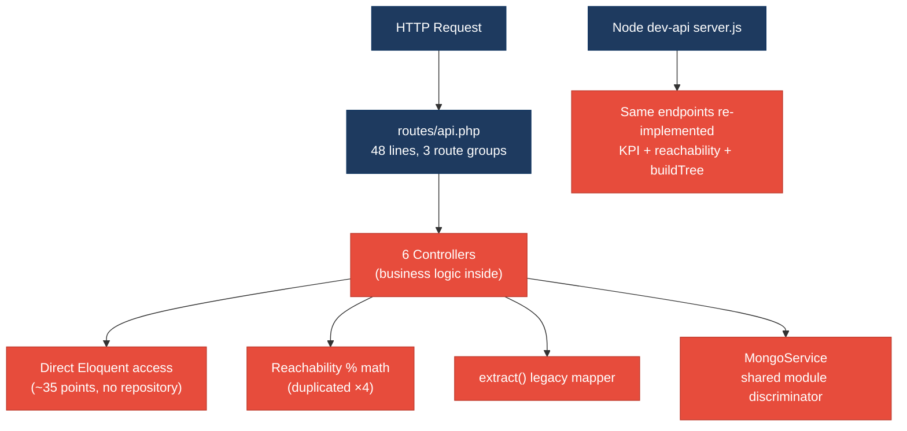
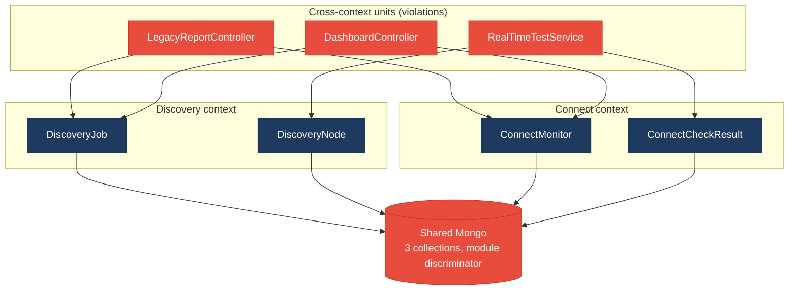
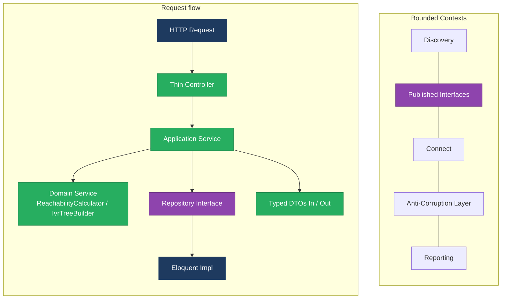
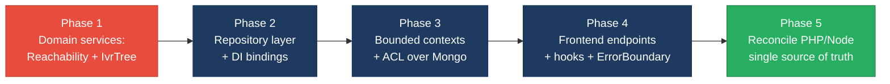

# 1. Architecture & Design Hotspots Analysis

**Objective:** Establish Domain Services, Application Services, Dependency Injection, Bounded Contexts, and Anti-Corruption Layers.

**Date:** 2026-07-23 | **Scope:** `shende-shweta/FSDKC` (Klearcom Voice Observability Platform) — PHP 8 / Laravel 11 backend, a parallel Node.js / Express `dev-api`, and a React 18 + TypeScript + Vite frontend (React Query, Zustand, React Router)

## Executive Summary

> **Executive Summary**
>
> Klearcom is a full-stack voice-observability platform with three code layers analyzed here: a Laravel API backend (7 PHP controllers, 4 Eloquent models, 2 services), a **second parallel backend** in Node/Express (`dev-api/`) that re-implements the same endpoints, and a React/TypeScript SPA (4 pages, 5 components). Architectural health is **High Risk**, driven by a total absence of a repository layer (every controller and service reaches straight into Eloquent), business logic embedded in controllers (KPI math, reachability %, full report generation), and the same domain rules duplicated across PHP and JavaScript. The dominant risk is **change amplification with divergence**: the reachability formula exists in four places (`ConnectController`, `LegacyReportController`, `RealTimeTestService`, and `dev-api/realtime.js`) and `buildTree` in three, so a single business-rule change must be made in multiple languages or the two backends silently disagree. Both Discovery and Connect domains share the same three MongoDB collections through a loose `module` string discriminator with no ownership boundary, and the frontend embeds API paths and data-orchestration logic directly in oversized page components with no service/endpoint layer. Layers covered: **Backend PHP** (18 files), **Backend Node** (6 files), **Frontend** (17 files). No domain has a bounded context, published interface, or anti-corruption layer today.

<div class="metric-grid">
<div class="metric-card"><div class="metric-number">6</div><div class="metric-label">Controllers / Handlers (PHP)</div></div>
<div class="metric-card"><div class="metric-number">4</div><div class="metric-label">Models / Entities</div></div>
<div class="metric-card"><div class="metric-number">2</div><div class="metric-label">Service Classes Found</div></div>
<div class="metric-card"><div class="metric-number">0</div><div class="metric-label">Repository Classes Found</div></div>
</div>

<div class="overall-rating overall-rating--high-risk"><div class="overall-rating-label">Overall Codebase Rating — Architecture &amp; Design</div><div class="overall-rating-value">High Risk</div><div class="overall-rating-note">Driven by High-Risk Missing Service Layer (H2), Missing Repository Pattern (H3), and Duplicated Cross-Stack Business Logic (H11); no domain has a bounded context or anti-corruption layer.</div></div>

## 1.1 Benchmark Ratings Summary

One row per hotspot. "Measured" is the real value found in `shende-shweta/FSDKC`; "Rating" is the band it falls into (worst KPI wins). This table is the source for the Overall Codebase Rating banner above.

| # | Hotspot | Primary KPI | <span class="rating rating-good">Good</span> | <span class="rating rating-moderate">Moderate</span> | <span class="rating rating-high-risk">High Risk</span> | Measured | Rating |
|---|---|---|---|---|---|---|---|
| H1 | Fat Controllers | Avg LOC per controller (+ business logic) | <150 | 150–300 | >300 | ~74 LOC avg PHP; Node `server.js` 276 LOC; business logic in 4 handlers | <span class="rating rating-moderate">Moderate</span> |
| H2 | Missing Service Layer | Controllers/handlers accessing models directly | <10 | 10–20 | >20 | ~24 direct model-access points across 4 PHP controllers + ~10 Node handlers | <span class="rating rating-high-risk">High Risk</span> |
| H3 | Missing Repository Pattern | Direct DB/ORM access points outside repositories | <10 | 10–20 | >20 | 0 repositories; ~35 Eloquent access points across controllers + services | <span class="rating rating-high-risk">High Risk</span> |
| H4 | Circular Dependencies | Dependency cycles | 0 | 1–3 | >3 | 0 observed | <span class="rating rating-good">Good</span> |
| H5 | Shared Utility Abuse | Utility/mapper files w/ business logic | 0 | 1–5 | >5 | 2 (`LegacyDataMapper`, `dev-api/store.js` `buildTree`) | <span class="rating rating-moderate">Moderate</span> |
| H6 | Direct SQL in Controllers | ORM/query-builder queries kept out of controllers | >90% | 60–90% | <60% | 0 raw SQL, but query-builder calls in 4 of 6 controllers (~60%) | <span class="rating rating-moderate">Moderate</span> |
| H7 | God Classes | Classes/files >1000 LOC | 0 | 1–3 | >3 | 0 (largest: `dev-api/server.js` 276 LOC) | <span class="rating rating-good">Good</span> |
| H8 | Domain Boundary Violations | Cross-domain access points | 0 | 1–5 | >5 | 4 files mix Discovery + Connect domains | <span class="rating rating-moderate">Moderate</span> |
| H9 | Shared Database Coupling | Data stores shared across domains | <10% | 10–30% | >30% | 3 Mongo collections shared by 2 domains via `module` discriminator (~37%) | <span class="rating rating-moderate">Moderate</span> |
| H10 | Anemic Domain Model *(additional)* | Models with domain behavior | >50% | 20–50% | <20% | 0 of 4 models hold any behavior (0%) | <span class="rating rating-moderate">Moderate</span> |
| H11 | Duplicated Cross-Stack Logic *(additional)* | Domain rules re-implemented across stacks | 0 | 1–2 | >2 | 3 rules duplicated PHP↔JS (`buildTree`, reachability %, KPI math) | <span class="rating rating-high-risk">High Risk</span> |
| F1 | Business Logic in Components | Avg LOC per component | <150 | 150–300 | >300 | ~81 LOC avg; `ConnectPage` 222, `DiscoveryPage` 176 embed orchestration | <span class="rating rating-moderate">Moderate</span> |
| F2 | Missing Frontend Service/Data Layer | Components w/ inline API calls | <10 | 10–20 | >20 | 6 components hard-code API paths; 0 endpoint/service modules | <span class="rating rating-moderate">Moderate</span> |
| F3 | God / Oversized Components | Components >400 LOC | 0 | 1–3 | >3 | 0 (largest: `ConnectPage.tsx` 222 LOC) | <span class="rating rating-good">Good</span> |
| F4 | Prop Drilling / Global State Abuse | Max prop-drilling depth | ≤2 | 3–4 | >4 | 2 levels max; `uiStore` holds 2 ids only | <span class="rating rating-good">Good</span> |
| F5 | Legacy / Inconsistent Component Patterns | Legacy-pattern components | 0 | 1–10 | >10 | 3 (class component w/ leak, uncaught throw, no error boundary) | <span class="rating rating-moderate">Moderate</span> |

Additional hotspots beyond the standard set: **H10 Anemic Domain Model** and **H11 Duplicated Cross-Stack Logic** were observed and are included above with full evidence subsections below.

## 1.2 Hotspot-by-Hotspot Evidence

### H1. Fat Controllers <span class="sev sev-high">High</span>

**Benchmark:** `Avg LOC per controller = ~74 (PHP), Node server.js = 276` → falls in the **Moderate** band (Good <150 · Moderate 150–300 · High Risk >300). Raw size is acceptable, but 4 of 6 PHP controllers embed non-trivial business logic, which is what pushes this to Moderate.

**What to check:** Business logic inside controllers/handlers rather than in application/domain services.

**Evidence:**

`backend/app/Http/Controllers/Api/LegacyReportController.php:19-53` — a controller action performs request-param extraction, DB querying, per-row success-rate math, and response mapping:

```php
public function carrierSummary(Request $request): JsonResponse
{
    $filters = $request->all();
    extract($filters);
    $monitors = ConnectMonitor::query()
        ->when(isset($country_code), fn ($q) => $q->where('country_code', $country_code))
        ->orderByDesc('reachability_pct')->get();
    foreach ($monitors as $monitor) {
        $recent = ConnectCheckResult::where('connect_monitor_id', $monitor->id)->limit(20)->get();
        $successRate = $recent->count() > 0
            ? ($recent->where('reachable', true)->count() / $recent->count()) * 100 : 100;
        // ... mapping ...
    }
}
```
This is a textbook fat controller — the entire report workflow (filter → query → compute → map) lives in the HTTP handler.

`backend/app/Http/Controllers/Api/DashboardController.php:12-36` — KPI aggregation math computed inline in the controller:

```php
public function kpis(): JsonResponse
{
    $discoveryTotal = DiscoveryJob::count();
    $discoveryCompleted = DiscoveryJob::where('status', 'completed')->count();
    $avgReachability = ConnectMonitor::avg('reachability_pct') ?? 0;
    // availability %, reachability %, alert counts all assembled here
}
```
Availability and reachability KPIs are business rules, not HTTP translation; they belong in a `DashboardService`.

`dev-api/src/server.js:58-80` — the Node backend concentrates the *same* KPI logic plus every Express route in one 276-line handler file with no service tier.

**Why it matters here:** Because these calculations live in controllers, they cannot be reused by CLI commands, queued jobs, or the SSE stream without copy-paste — which is exactly why the reachability formula already exists in four files (see H11). The next contributor adding a "weekly report" endpoint will duplicate `carrierSummary` rather than call a service, amplifying the divergence between the PHP and Node backends.

**Recommended approach:**
1. Introduce `App\Services\DashboardService`, `App\Services\ConnectService`, `App\Services\ReportService` and move the KPI/reachability/report workflows out of `DashboardController`, `ConnectController`, and `LegacyReportController`.
2. Reduce each controller action to: validate input → call one service method → return `JsonResponse`.
3. In `dev-api/`, extract the KPI block from `server.js` into a `services/dashboardService.js` shared by the routes.

<!-- affected-files
search: (\$request->all\(\)|extract\(|successRate|reachability_pct|->avg\(|->count\(\)|round\()
glob: backend/app/Http/Controllers/Api/*.php
issue: Business logic (KPI math, reachability %, report generation) embedded directly in the controller
action: Extract workflow into an Application Service; keep the controller thin (validate → call service → respond)
-->

### H2. Missing Service Layer <span class="sev sev-critical">Critical</span>

**Benchmark:** `Controllers/handlers accessing models directly = ~24 access points (4 PHP controllers + ~10 Node handlers)` → falls in the **High Risk** band (Good <10 · Moderate 10–20 · High Risk >20).

**What to check:** Business rules spread across controllers with no dedicated, reusable service tier.

**Evidence:**

`backend/app/Http/Controllers/Api/ConnectController.php:57-85` — `checks()` reaches directly into two Eloquent models and computes status inline:

```php
$checks = ConnectCheckResult::where('connect_monitor_id', $id)->orderByDesc('checked_at')->limit(50)->get();
$recentChecks = ConnectCheckResult::where('connect_monitor_id', $id)->limit(20)->get();
$successRate = $recentChecks->count() > 0
    ? ($recentChecks->where('reachable', true)->count() / $recentChecks->count()) * 100 : 100;
$computedStatus = $successRate < 90 ? 'alert' : 'active';
```
The `< 90 ? 'alert' : 'active'` rule is a domain decision made in the controller.

`backend/app/Http/Controllers/Api/DiscoveryController.php:19-46` — `index()` and `show()` call `DiscoveryJob::orderByDesc(...)` / `DiscoveryJob::with('nodes')->findOrFail(...)` directly; there is no `DiscoveryService`.

`backend/app/Http/Controllers/Api/DashboardController.php:14-18` — five separate model aggregations invoked straight from the controller.

Only 2 services exist (`MongoService`, `RealTimeTestService`) and they are used inconsistently — CRUD and reporting bypass them entirely. Across 4 PHP controllers there are ~24 direct model-access statements.

**Why it matters here:** Every entry point (HTTP controller, the `afterResponse` dispatched job in `ConnectController::runCheck`, the Node backend) re-derives the same rules independently. When the "alert threshold" changes from 90 % to another value, it must be edited in `ConnectController`, `RealTimeTestService`, and `dev-api/realtime.js` simultaneously — miss one and the dashboard, the live test, and the stored monitor status disagree.

**Recommended approach:**
1. Create `ConnectService::reachabilityFor($monitorId)` and `ConnectService::computeStatus($rate)` and have `ConnectController::checks()` and `RealTimeTestService::runConnectTest()` both call them.
2. Add `DiscoveryService` and `DashboardService`; controllers depend on them via constructor injection (the DI pattern already used for `MongoService`).
3. Forbid direct `Model::` access from `App\Http\Controllers` via an architecture test (e.g. Pest arch or PHPStan rule).

<!-- affected-files
search: (ConnectMonitor|ConnectCheckResult|DiscoveryJob|DiscoveryNode)::
glob: backend/app/Http/Controllers/**/*.php
issue: Controller accesses Eloquent models directly with no intervening service layer
action: Move data access + business rules into an Application Service and inject it into the controller
-->

### H3. Missing Repository Pattern <span class="sev sev-critical">Critical</span>

**Benchmark:** `Direct DB/ORM access points outside repositories = ~35; repositories = 0` → falls in the **High Risk** band (Good <10 · Moderate 10–20 · High Risk >20).

**What to check:** Direct DB/ORM access scattered through the codebase with no `app/Repositories/` abstraction.

**Evidence:**

There is **no `backend/app/Repositories/` directory** (confirmed absent). Eloquent access is scattered across controllers *and* services:

`backend/app/Services/RealTimeTestService.php:108-124` — the service itself performs raw model writes and re-queries for aggregation:

```php
ConnectCheckResult::create([...]);
$recent = ConnectCheckResult::where('connect_monitor_id', $monitorId)->orderByDesc('checked_at')->limit(20)->get();
$rate = $recent->count() > 0 ? ($recent->where('reachable', true)->count() / $recent->count()) * 100 : 100;
$monitor->update(['reachability_pct' => round($rate, 2), 'status' => $rate < 90 ? 'alert' : 'active', ...]);
```

`backend/app/Http/Controllers/Api/LegacyReportController.php:24-59` — `ConnectMonitor::query()`, `ConnectCheckResult::where(...)`, `DiscoveryNode::where(...)` all invoked directly inside the controller.

Persistence concerns (query construction, ordering, limits) leak into both the HTTP layer and the service layer, with ~35 Eloquent access points total and zero abstraction.

**Why it matters here:** There is no seam to test business logic without a live MariaDB, and no way to change the query strategy (e.g. add caching or swap the store) without touching every call site. This is the structural reason the backend tests (`ReachabilityCalculationTest`) re-implement the math instead of exercising real code.

**Recommended approach:**
1. Introduce `ConnectMonitorRepository`, `ConnectCheckResultRepository`, `DiscoveryJobRepository`, `DiscoveryNodeRepository` exposing intention-revealing methods (`recentChecks($id, $limit)`).
2. Bind interfaces → Eloquent implementations in `AppServiceProvider::register()` (currently empty) so DI supplies them.
3. Route all model access through repositories; controllers/services depend only on the interfaces.

<!-- affected-files
search: ::(where|create|find|findOrFail|query|count|avg|orderByDesc|distinct|with)\(
glob: backend/app/**/*.php
issue: Direct Eloquent/ORM access outside any repository layer
action: Move persistence into a Repository (interface + Eloquent impl) and depend on the interface via DI
-->

### H4. Circular Dependencies <span class="sev sev-low">Low</span>

**Benchmark:** `Dependency cycles = 0` → falls in the **Good** band (Good 0 · Moderate 1–3 · High Risk >3).

**What to check:** Modules/packages importing each other.

**Evidence:** Not observed — the dependency direction is consistently one-way (Controller → Service → Model; models relate via Eloquent relations only, e.g. `DiscoveryJob hasMany DiscoveryNode`). No module import cycle was found across the PHP, Node, or frontend layers.

### H5. Shared Utility Abuse <span class="sev sev-medium">Medium</span>

**Benchmark:** `Utility/mapper files holding business logic = 2` → falls in the **Moderate** band (Good 0 · Moderate 1–5 · High Risk >5).

**What to check:** Large "common"/"helpers"/"utils"/"mapper" files used everywhere and holding business logic.

**Evidence:**

`backend/app/Legacy/LegacyDataMapper.php:10-31` — a generic mapper using the unsafe `extract()` pattern to reshape arbitrary arrays into report/job rows:

```php
public function mapReportRow(array $row): array
{
    extract($row, EXTR_SKIP);
    return ['label' => $name ?? 'Unknown', 'metric' => $reachability_pct ?? 0, ...];
}
```
`extract()` pollutes local scope from array keys, making data flow untraceable and risky if request-derived keys collide — and `LegacyReportController` feeds it exactly that.

`dev-api/src/store.js:64-75` — the shared in-memory store module also carries a `buildTree()` algorithm, mixing data-holding with domain logic in a generic "store" util.

**Why it matters here:** These generic reshapers are unowned dumping grounds — `LegacyDataMapper` is the only place `extract()` survives despite `AGENTS.md` forbidding it, and any change to report shape ripples through both the mapper and its callers with no type safety.

**Recommended approach:**
1. Replace `LegacyDataMapper` with explicit, typed DTOs / value objects per domain (e.g. `CarrierReportRow`), eliminating `extract()`.
2. Move `buildTree` out of `dev-api/store.js` into a dedicated `ivrTree` domain module shared by the routes.

<!-- affected-files
search: extract\(
glob: backend/app/**/*.php
issue: Generic mapper/utility holds business logic and uses unsafe extract() scope pollution
action: Replace with typed DTOs/value objects owned by the relevant domain; remove extract()
-->

### H6. Direct SQL in Controllers <span class="sev sev-medium">Medium</span>

**Benchmark:** `Queries kept out of controllers ≈ 60%` → falls in the **Moderate** band (Good >90% · Moderate 60–90% · High Risk <60%). No *raw* SQL strings exist, but Eloquent query-builder calls are embedded directly in 4 of 6 controllers.

**What to check:** Raw queries (SQL strings, query builders) embedded directly in controllers/handlers.

**Evidence:**

`backend/app/Http/Controllers/Api/LegacyReportController.php:24-37` — query-builder chains constructed inline in the controller:

```php
$monitors = ConnectMonitor::query()
    ->when(isset($country_code), fn ($q) => $q->where('country_code', $country_code))
    ->when(isset($carrier), fn ($q) => $q->where('carrier', $carrier))
    ->orderByDesc('reachability_pct')->get();
```

`backend/app/Http/Controllers/Api/DashboardController.php:14-18` — `where('status','completed')`, `avg('reachability_pct')`, `distinct('country_code')` query construction in the handler.

No `DB::raw`, `DB::select`, or string SQL was found (a positive — no injection-prone raw queries), and schema DDL lives correctly in `docker/mariadb/init.sql`, not in code. The residual issue is query-builder logic in controllers, which overlaps with H3.

**Why it matters here:** Filtering/sorting semantics are trapped in the HTTP layer, so the identical "recent 20 checks" query is rebuilt in `ConnectController`, `LegacyReportController`, and `RealTimeTestService` instead of one repository method — the schema cannot evolve without editing every controller.

**Recommended approach:**
1. Move each query-builder chain into a repository method (`ConnectMonitorRepository::filtered($countryCode, $carrier)`).
2. Keep controllers free of `::query()`/`->where()` — enforce with a static-analysis rule.

<!-- affected-files
search: ->(where|when|orderByDesc|query|distinct|avg|count)\(
glob: backend/app/Http/Controllers/**/*.php
issue: Eloquent query-builder logic embedded directly in the controller
action: Relocate query construction into a repository method; controller calls the repository
-->

### H7. God Classes <span class="sev sev-low">Low</span>

**Benchmark:** `Classes/files >1000 LOC = 0` → falls in the **Good** band (Good 0 · Moderate 1–3 · High Risk >3).

**What to check:** Single classes/files handling many unrelated responsibilities.

**Evidence:** Not observed — no class exceeds 1000 LOC; the largest file is `dev-api/src/server.js` at 276 lines, followed by `MongoService.php` (165) and `RealTimeTestService.php` (141). `server.js` is a mild concentration point (all Express routes in one file) but is well below the God-class threshold and is called out under H1.

### H8. Domain Boundary Violations <span class="sev sev-medium">Medium</span>

**Benchmark:** `Cross-domain access points = 4` → falls in the **Moderate** band (Good 0 · Moderate 1–5 · High Risk >5).

**What to check:** Code in one business area directly reading/writing another area's data or models.

**Evidence:** Two business domains exist — **Discovery** (`DiscoveryJob`, `DiscoveryNode`) and **Connect** (`ConnectMonitor`, `ConnectCheckResult`) — but several units reach across both:

`backend/app/Http/Controllers/Api/LegacyReportController.php:6-10` imports and queries **both** domains:

```php
use App\Models\ConnectCheckResult;
use App\Models\ConnectMonitor;
use App\Models\DiscoveryJob;
use App\Models\DiscoveryNode;
```
`carrierSummary()` uses the Connect models while `ivrDepthReport()` uses the Discovery models — one class straddling two contexts.

`backend/app/Services/RealTimeTestService.php:5-8` writes to Discovery models (`DiscoveryNode::create`) *and* Connect models (`ConnectCheckResult::create`) in the same service. `DashboardController` reads both domains too. Total: 4 units mix domains.

**Why it matters here:** There are no published interfaces between Discovery and Connect, so the two features cannot be extracted, deployed, or owned independently — a change to `DiscoveryNode` can break `LegacyReportController::carrierSummary` reviews even though it is nominally a "carrier" report.

**Recommended approach:**
1. Split `RealTimeTestService` into `DiscoveryTestService` and `ConnectTestService`, each owning only its domain's models.
2. Split `LegacyReportController` into per-context report controllers/services.
3. Define bounded contexts (`app/Modules/Discovery`, `app/Modules/Connect` already exist as stubs) and enforce ownership.

<!-- affected-files
search: (ConnectMonitor|ConnectCheckResult).*(DiscoveryJob|DiscoveryNode)|use App\\Models\\(Connect|Discovery)
glob: backend/app/{Http/Controllers,Services}/**/*.php
issue: Single unit reads/writes across both the Discovery and Connect bounded contexts
action: Split by domain so each service/controller owns one context; communicate via published interfaces
-->

### H9. Shared Database Coupling <span class="sev sev-medium">Medium</span>

**Benchmark:** `Data stores shared across domains ≈ 37% (3 of 8)` → falls in the **Moderate** band (Good <10% · Moderate 10–30% · High Risk >30%). Rated Moderate rather than High because the coupling is a soft `module`-discriminator convention, not shared ownership of the same rows.

**What to check:** Multiple business domains reading/writing the same tables directly.

**Evidence:** The MariaDB tables are cleanly domain-owned (`discovery_jobs`/`discovery_nodes` vs `connect_monitors`/`connect_check_results`, per `docker/mariadb/init.sql`). However the **three MongoDB collections are shared by both domains** through a `module` string:

`backend/app/Services/MongoService.php:111-123` — the same collection serves every domain, keyed only by a free-text `module`:

```php
public function getTranscripts(string $module, int $referenceId): array
{
    $cursor = $this->transcripts->find(['module' => $module, 'reference_id' => $referenceId], ...);
}
```
`transcripts`, `test_events`, and `call_diagnostics` all mix Discovery and Connect records with no schema ownership; `dev-api/src/mongo.js` mirrors this.

**Why it matters here:** A change to the Connect event shape can silently corrupt Discovery reads because both write into `test_events` with no per-domain contract; `reference_id` is an untyped integer that could collide across domains.

**Recommended approach:**
1. Introduce per-domain collection ownership or a typed envelope (`{context, aggregateId}`) with an anti-corruption layer in `MongoService`.
2. Expose domain-specific read methods (`transcriptsForDiscovery`, `transcriptsForConnect`) instead of a shared `module` string.

<!-- affected-files
search: (transcripts|test_events|call_diagnostics|selectCollection|'module')
glob: backend/app/Services/**/*.php
issue: MongoDB collections shared across Discovery and Connect via an untyped `module` discriminator
action: Add per-domain ownership / typed envelope and an anti-corruption layer around Mongo access
-->

### H10. Anemic Domain Model <span class="sev sev-medium">Medium</span> *(additional)*

**Benchmark KPI:** share of domain models carrying behavior — Good >50% · Moderate 20–50% · High Risk <20%. `Measured = 0 of 4 models (0%)`, but rated **Moderate** (not High) because the models are small and the fix is incremental. This is an additional hotspot: all domain knowledge lives in controllers/services, leaving models as pure data bags.

**What to check:** Entities that hold only fields/relations while all behavior lives elsewhere.

**Evidence:** `backend/app/Models/DiscoveryJob.php:8-32` declares only `$fillable`, `$casts`, and a `nodes()` relation — no methods like `markCompleted()` or `recordDiscovery()`; the state transitions are performed in `RealTimeTestService` via `$job->update([...])`. All four models (`ConnectMonitor`, `ConnectCheckResult`, `DiscoveryJob`, `DiscoveryNode`) follow the same anemic shape.

**Why it matters here:** Invariants (e.g. "a job can only complete after running") are unenforced by the entity and re-checked ad hoc in `DiscoveryController::start` (`status === 'running'`), so any new caller can drive a model into an illegal state.

**Recommended approach:**
1. Move state transitions and derived values onto the models or dedicated domain services (`ConnectMonitor::applyCheckResult()`), guarded by invariants.
2. Have services orchestrate domain methods rather than mutate raw attributes.

<!-- affected-files
glob: backend/app/Models/*.php
issue: Anemic entity — only fields/casts/relations, no domain behavior or invariants
action: Add behavior + invariants to the model (or a domain service); stop mutating raw attributes from controllers/services
-->

### H11. Duplicated Cross-Stack Business Logic <span class="sev sev-critical">Critical</span> *(additional)*

**Benchmark KPI:** domain rules re-implemented across stacks — Good 0 · Moderate 1–2 · High Risk >2. `Measured = 3` (reachability %, `buildTree`, dashboard KPI math), each present in both PHP and JavaScript → **High Risk**. This additional hotspot is the single biggest driver of change amplification.

**What to check:** The same domain rule implemented independently in more than one place/language.

**Evidence:** The reachability success-rate formula appears **four times**:

- `backend/app/Http/Controllers/Api/ConnectController.php:72`
- `backend/app/Http/Controllers/Api/LegacyReportController.php:40`
- `backend/app/Services/RealTimeTestService.php:118`
- `dev-api/src/realtime.js:148`

```php
$successRate = ($recent->where('reachable', true)->count() / $recent->count()) * 100;   // PHP ×3
```
```js
const successRate = (recent.filter((c) => c.reachable).length / recent.length) * 100;    // JS ×1
```

`buildTree()` is copy-pasted across `DiscoveryController.php:87-101`, `LegacyReportController.php:78-92`, and `dev-api/src/store.js:64-75`; the dashboard KPI block is duplicated between `DashboardController.php:12-36` and `dev-api/src/server.js:58-80`.

**Why it matters here:** The Laravel API and the Node `dev-api` are two independent implementations of the *same* product. Every business-rule change (alert threshold, KPI rounding, tree shape) must be made in both languages or the two backends — and the pages that call them — silently diverge. This is the concrete "change amplification" risk noted in the summary.

**Recommended approach:**
1. Establish a single source of truth per rule: `ReachabilityCalculator` and `IvrTreeBuilder` domain services in PHP, consumed by all three PHP call sites.
2. Decide the role of `dev-api/` — if it is only a local mock, document it as non-authoritative; if it is a real backend, share rule definitions (e.g. via a contract/spec) so they cannot drift.

<!-- affected-files
search: (buildTree|where\('reachable', true\)|filter\(\(c\) => c\.reachable\)|ivr_availability_pct|number_reachability_pct)
glob: {backend/app,dev-api/src}/**/*.{php,js}
issue: Domain rule (reachability %, IVR tree build, or KPI math) duplicated across files/stacks
action: Consolidate into one domain service (source of truth) and call it from every site
-->

### F1. Business Logic in Components <span class="sev sev-medium">Medium</span>

**Benchmark:** `Avg LOC per component = ~81; ConnectPage 222, DiscoveryPage 176` → falls in the **Moderate** band (Good <150 · Moderate 150–300 · High Risk >300). Average is healthy, but the two primary pages exceed 150 LOC and embed data orchestration.

**What to check:** Validation, data orchestration, or workflow logic inside view components instead of hooks/services.

**Evidence:** `frontend/src/pages/ConnectPage.tsx:50-56` embeds a multi-step workflow (start check, then invalidate three query caches) directly in the component:

```tsx
const handleRunCheck = async (monitorId: number) => {
  setSelectedId(monitorId);
  await startConnectCheck(monitorId);
  queryClient.invalidateQueries({ queryKey: ['connect'] });
  queryClient.invalidateQueries({ queryKey: ['mongodb'] });
  queryClient.invalidateQueries({ queryKey: ['dashboard'] });
};
```
`frontend/src/pages/DiscoveryPage.tsx:46-52` contains a near-identical `handleStart` — the orchestration is duplicated, not shared.

**Why it matters here:** Test flows, cache-invalidation rules, and form state are welded to JSX, so they can't be unit-tested or reused, and the Discovery/Connect pages must be kept in sync by hand.

**Recommended approach:**
1. Move the start-test-then-invalidate workflow into the `useRealtimeTest` hook (or a `useConnectActions` hook) so both pages share one implementation.
2. Extract the "add monitor/job" form into a presentational child component with its own state.

<!-- affected-files
search: (useMutation|invalidateQueries|handleRunCheck|handleStart|useState\()
glob: frontend/src/pages/**/*.tsx
issue: Data-orchestration / workflow logic and form state embedded directly in the page component
action: Move orchestration into a custom hook/service; split forms into presentational child components
-->

### F2. Missing Frontend Service/Data Layer <span class="sev sev-medium">Medium</span>

**Benchmark:** `Components with inline API calls = 6; endpoint/service modules = 0` → rated **Moderate**. The raw count (6) sits in the Good band, but the complete absence of any endpoint/service abstraction (URL strings scattered across components and hooks) elevates it to Moderate.

**What to check:** `fetch`/HTTP calls and API URLs hard-coded inline in components instead of a shared client/service/data layer.

**Evidence:** A generic `frontend/src/api/client.ts` exists, but **paths** are hard-coded at every call site:

`frontend/src/pages/DiscoveryPage.tsx:20-33`:
```tsx
queryFn: () => api.get<{ data: DiscoveryJob[] }>('/discovery/jobs'),
queryFn: () => api.get<{ data: Transcript[] }>(`/mongodb/transcripts?module=discovery&reference_id=${selectedId}`),
```
`frontend/src/hooks/useRealtimeTest.ts:29-31` builds stream URLs inline. The same pattern recurs in `ConnectPage.tsx`, `LegacyDashboardWidget.tsx`, `DashboardPage.tsx`, and `MongoStatus.tsx` — 6 components in total, with no `endpoints.ts` or per-module API service.

**Why it matters here:** A single API path change (e.g. `/mongodb/transcripts`) requires grepping across pages, hooks, and widgets; there is no typed contract between the SPA and either backend.

**Recommended approach:**
1. Add `frontend/src/api/endpoints.ts` with path builders and `discoveryApi`/`connectApi` modules wrapping `client.ts`.
2. Have components/hooks call the module functions, never raw path strings.

<!-- affected-files
search: (api\.(get|post)\(|getStreamUrl\(|/discovery/|/connect/|/mongodb/)
glob: frontend/src/**/*.{tsx,ts,jsx}
issue: API URL paths hard-coded inline; no endpoint/service module
action: Introduce an endpoints module + per-domain API service and route all calls through it
-->

### F3. God / Oversized Components <span class="sev sev-low">Low</span>

**Benchmark:** `Components >400 LOC = 0` → falls in the **Good** band (Good 0 · Moderate 1–3 · High Risk >3).

**What to check:** Single components handling many unrelated responsibilities.

**Evidence:** Not observed at the God-component threshold — the largest is `ConnectPage.tsx` at 222 LOC, then `DiscoveryPage.tsx` at 176; none exceed 400. Their internal responsibility overload is captured under F1 instead.

### F4. Prop Drilling / Global State Abuse <span class="sev sev-low">Low</span>

**Benchmark:** `Max prop-drilling depth = 2; global store holds 2 ids` → falls in the **Good** band (Good ≤2 · Moderate 3–4 · High Risk >4).

**What to check:** Props threaded through many intermediate layers, or one giant global store everything reads/writes.

**Evidence:** Not observed — `frontend/src/store/uiStore.ts` is a minimal Zustand store holding only `selectedDiscoveryId`/`selectedMonitorId`. Props pass at most one level (e.g. `LiveTestFeed` receives `events`/`isRunning`/`progress` from its page). No deep prop chains or god-store.

### F5. Legacy / Inconsistent Component Patterns <span class="sev sev-medium">Medium</span>

**Benchmark:** `Legacy-pattern components = 3` → falls in the **Moderate** band (Good 0 · Moderate 1–10 · High Risk >10).

**What to check:** Mixed paradigms (class + function components), missing error boundaries, missing lifecycle cleanup.

**Evidence:** `frontend/src/components/LegacyMonitorPoller.jsx:17-33` is the only **class component** in an otherwise function-component codebase, and it starts a `setInterval` with **no `componentWillUnmount`** — a guaranteed interval leak:

```tsx
componentDidMount() {
  this.intervalId = setInterval(() => { api.get(...).then(...); }, 3000);
  // Intentionally no componentWillUnmount — EventSource/interval leak
}
```
It is also authored as `.jsx` yet contains TypeScript `interface` declarations (inconsistent typing convention). `frontend/src/pages/LegacyDashboardWidget.tsx:48` throws (`if (error) throw new Error(error)`) with **no error boundary** — `frontend/src/App.tsx` and `main.tsx` wrap nothing in an `<ErrorBoundary>`, so any thrown render error blanks the SPA.

**Why it matters here:** The mix of class/function paradigms, a leaking poller, and no error boundary mean a single failed poll or fetch can crash or slowly degrade the app, and new contributors have no consistent component convention to follow.

**Recommended approach:**
1. Rewrite `LegacyMonitorPoller` as a function component using `useEffect` with cleanup (or delete it — it is currently unreferenced by `App.tsx`).
2. Add `components/ErrorBoundary.tsx` and wrap `<Routes>`/`<App>` in `main.tsx`.
3. Standardize on `.tsx` function components across `frontend/src`.

<!-- affected-files
search: (extends Component|componentDidMount|componentWillUnmount|throw new Error\()
glob: frontend/src/**/*.{tsx,jsx}
issue: Legacy/inconsistent React pattern — class component, missing cleanup, or uncaught throw with no error boundary
action: Convert to a function component with useEffect cleanup and add an ErrorBoundary around routes
-->

## 1.3 Diagrams

### Current-state architecture (as-is)


### Clean reference path (target pattern found in codebase)

`StreamController` and `MongoController` are the closest existing examples of the target pattern — thin controllers that only inject and delegate to a service, with no business logic.

### Domain boundary map (business domains found vs. shared data)


### Target architecture (proposed)


### Improvement roadmap


## 1.4 Actions Required

| Hotspot | Action | Rating | Priority |
|---|---|---|---|
| H2 Missing Service Layer | Introduce `ConnectService`/`DiscoveryService`/`DashboardService`; controllers validate → call service → respond | <span class="rating rating-high-risk">High Risk</span> | <span class="sev sev-critical">Critical</span> |
| H3 Missing Repository Pattern | Add per-model repositories (interface + Eloquent impl), bind in `AppServiceProvider`, route all access through them | <span class="rating rating-high-risk">High Risk</span> | <span class="sev sev-critical">Critical</span> |
| H11 Duplicated Cross-Stack Logic | Consolidate reachability %, `buildTree`, and KPI math into single domain services; clarify `dev-api/` authority | <span class="rating rating-high-risk">High Risk</span> | <span class="sev sev-critical">Critical</span> |
| H1 Fat Controllers | Move KPI/reachability/report workflows out of controllers into application services | <span class="rating rating-moderate">Moderate</span> | <span class="sev sev-high">High</span> |
| H8 Domain Boundary Violations | Split `RealTimeTestService` and `LegacyReportController` by domain; define bounded contexts | <span class="rating rating-moderate">Moderate</span> | <span class="sev sev-high">High</span> |
| H9 Shared Database Coupling | Add per-domain Mongo ownership / typed envelope + anti-corruption layer in `MongoService` | <span class="rating rating-moderate">Moderate</span> | <span class="sev sev-medium">Medium</span> |
| H5 Shared Utility Abuse | Replace `LegacyDataMapper` (`extract()`) with typed DTOs; move `buildTree` out of `store.js` | <span class="rating rating-moderate">Moderate</span> | <span class="sev sev-medium">Medium</span> |
| H6 Direct SQL in Controllers | Relocate query-builder chains into repository methods | <span class="rating rating-moderate">Moderate</span> | <span class="sev sev-medium">Medium</span> |
| H10 Anemic Domain Model | Add behavior/invariants to models or domain services; stop mutating raw attributes | <span class="rating rating-moderate">Moderate</span> | <span class="sev sev-medium">Medium</span> |
| F1 Business Logic in Components | Move test-orchestration into shared hooks; split forms into presentational children | <span class="rating rating-moderate">Moderate</span> | <span class="sev sev-medium">Medium</span> |
| F2 Missing Frontend Service/Data Layer | Add `endpoints.ts` + per-domain API modules; remove inline path strings | <span class="rating rating-moderate">Moderate</span> | <span class="sev sev-medium">Medium</span> |
| F5 Legacy / Inconsistent Patterns | Convert `LegacyMonitorPoller` to a function component with cleanup; add `ErrorBoundary` | <span class="rating rating-moderate">Moderate</span> | <span class="sev sev-medium">Medium</span> |

## 1.5 Expected Outcomes

- **Single source of truth for domain rules** — reachability %, IVR tree building, and KPI math live in one service each, so the PHP and Node backends can no longer silently diverge and a rule change is a one-line edit.
- **Testable business logic** — a repository seam plus extracted services let reachability and KPI logic be unit-tested without a live MariaDB/MongoDB, fixing the non-deterministic `ReachabilityCalculationTest`.
- **Independent, extractable domains** — bounded contexts with published interfaces and an anti-corruption layer over the shared Mongo collections let Discovery and Connect evolve, deploy, and be owned separately.
- **Thin, reusable controllers** — HTTP handlers shrink to validate-and-delegate, so CLI commands, queued jobs, and the SSE stream reuse the same services instead of copy-pasting logic.
- **Resilient, consistent frontend** — a shared endpoints/service layer, extracted orchestration hooks, and an error boundary remove scattered URL strings, the interval leak, and whole-app crashes on a single failed fetch.
