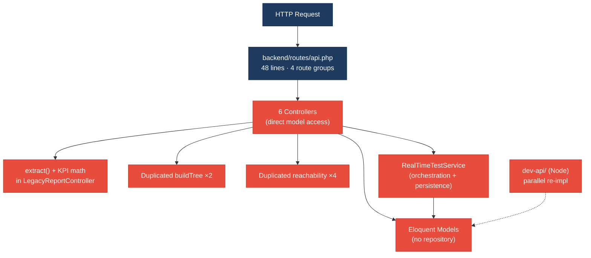
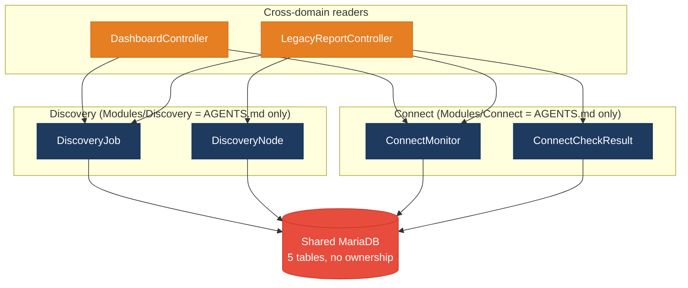
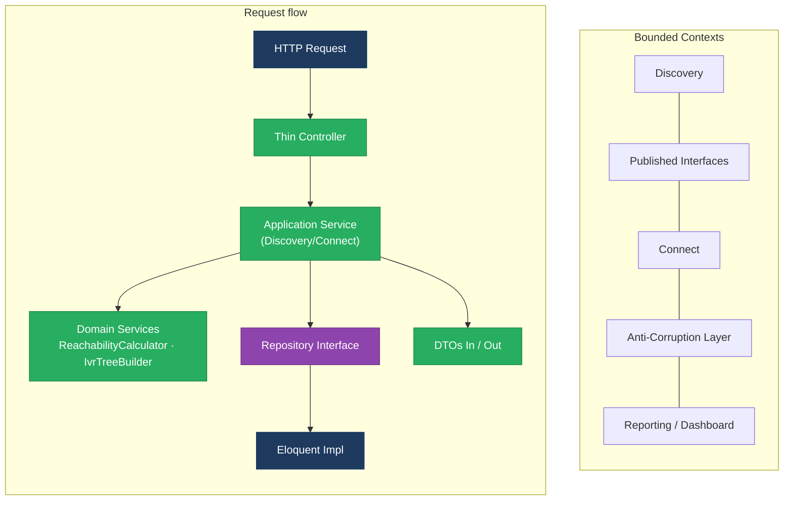
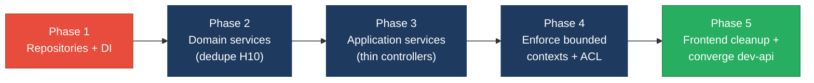

# 1. Architecture & Design Hotspots Analysis

**Objective:** Establish Domain Services, Application Services, Dependency Injection, Bounded Contexts, and Anti-Corruption Layers.

**Date:** 2026-08-07 12:02:17 IST | **Scope:** `FSDKC` (Klearcom monolith) — PHP 8.3 / Laravel 12 backend (`backend/`), React 19.2 + TypeScript + Vite frontend (`frontend/`), parallel Node/Express dev API (`dev-api/`), MariaDB 11 + MongoDB.

## Executive Summary

> **Executive Summary**
>
> The Klearcom monolith is a small, cleanly-structured codebase (no God classes, no raw SQL, no circular dependencies) whose architectural risk is concentrated in **missing middle tiers**: there is **no repository layer** (0 repository classes) and **no application-service layer** for the two product domains, so controllers and a shared `RealTimeTestService` reach directly into Eloquent models at 35+ call sites. The most damaging pattern is **duplicated domain logic** — the IVR `buildTree` recursion is copy-pasted across two controllers and the reachability-percentage formula is re-implemented in four places (`ConnectController`, `RealTimeTestService`, `LegacyReportController`, and the Node `dev-api/realtime.js`), so a single rule change must be edited in four files or silently diverge. **Bounded contexts are declared but unenforced**: `backend/app/Modules/Discovery` and `Modules/Connect` contain only `AGENTS.md`, while all real code lives in flat shared `App\Models`/`App\Http\Controllers` namespaces, and cross-domain readers (`DashboardController`, `LegacyReportController`) query both domains' tables directly with no anti-corruption layer. The frontend is healthier (Zustand + React Query, a shared transport client) but carries a class-component interval leak (`LegacyMonitorPoller`) and a boundary-less throwing widget (`LegacyDashboardWidget`). Both layers were covered: **6 backend controllers / 4 models / 2 services** and **10 frontend components + 1 hook**.

<div class="metric-grid">
<div class="metric-card"><div class="metric-number">6</div><div class="metric-label">Controllers / Handlers</div></div>
<div class="metric-card"><div class="metric-number">4</div><div class="metric-label">Models / Entities</div></div>
<div class="metric-card"><div class="metric-number">2</div><div class="metric-label">Service Classes Found</div></div>
<div class="metric-card"><div class="metric-number">0</div><div class="metric-label">Repository Classes Found</div></div>
</div>

<div class="overall-rating overall-rating--high-risk"><div class="overall-rating-label">Overall Codebase Rating — Architecture &amp; Design</div><div class="overall-rating-value">High Risk</div><div class="overall-rating-note">Driven by High-Risk Missing Service Layer (H2), Missing Repository Pattern (H3), and Duplicated Domain Logic (H10); no hotspot in this category reached God-class or raw-SQL severity.</div></div>

## 1.1 Benchmark Ratings Summary

One row per hotspot. "Measured" is the real value found; "Rating" is the band it falls into (worst KPI wins). This table is the source for the Overall Codebase Rating banner above.

| # | Hotspot | Primary KPI | <span class="rating rating-good">Good</span> | <span class="rating rating-moderate">Moderate</span> | <span class="rating rating-high-risk">High Risk</span> | Measured | Rating |
|---|---|---|---|---|---|---|---|
| H1 | Fat Controllers | Avg LOC per controller | <150 | 150–300 | >300 | 74 LOC avg; 2 controllers hold KPI/business logic | <span class="rating rating-moderate">Moderate</span> |
| H2 | Missing Service Layer | Controllers accessing repos/models | <10 | 10–20 | >20 | 25 direct model-access points; 0 app services for domains | <span class="rating rating-high-risk">High Risk</span> |
| H3 | Missing Repository Pattern | Direct DB access points | <10 | 10–20 | >20 | 0 repository classes; 35+ direct Eloquent access points | <span class="rating rating-high-risk">High Risk</span> |
| H4 | Circular Dependencies | Dependency cycles | 0 | 1–3 | >3 | 0 | <span class="rating rating-good">Good</span> |
| H5 | Shared Utility Abuse | Utility files w/ business logic | 0 | 1–5 | >5 | 1 (`LegacyDataMapper` extract-based mapper) | <span class="rating rating-moderate">Moderate</span> |
| H6 | Direct SQL in Controllers | ORM compliance % | >90% | 60–90% | <60% | 100% (no raw SQL / DB:: in controllers) | <span class="rating rating-good">Good</span> |
| H7 | God Classes | Classes >1000 LOC | 0 | 1–3 | >3 | 0 (largest 165 LOC) | <span class="rating rating-good">Good</span> |
| H8 | Domain Boundary Violations | Cross-domain access points | 0 | 1–5 | >5 | 3 (Dashboard, LegacyReport, RealTimeTestService); Modules/ empty | <span class="rating rating-moderate">Moderate</span> |
| H9 | Shared Database Coupling | Tables shared across domains | <10% | 10–30% | >30% | Cross-domain reads of 4/5 tables via reporting/dashboard, no ownership/ACL | <span class="rating rating-moderate">Moderate</span> |
| H10 | Duplicated Domain Logic *(additional)* | Duplicated logic algorithms across layers | 0 | 1–2 | >2 | 2 algorithms across 6 sites (`buildTree` ×2, reachability ×4) | <span class="rating rating-high-risk">High Risk</span> |
| H11 | Dual Parallel Backends *(additional)* | Parallel implementations of one API surface | 0 | 1 | >1 | 1 (Laravel `backend/` + Node `dev-api/` reimplement Discovery/Connect/Dashboard) | <span class="rating rating-moderate">Moderate</span> |
| F1 | Business Logic in Components | Avg LOC per component | <150 | 150–300 | >300 | 81 LOC avg; ConnectPage 222 & DiscoveryPage 176 exceed 150 with inline orchestration | <span class="rating rating-moderate">Moderate</span> |
| F2 | Missing Frontend Service/Data Layer | Components w/ inline API calls | <10 | 10–20 | >20 | 6 (thin transport client exists; no per-domain service) | <span class="rating rating-good">Good</span> |
| F3 | God / Oversized Components | Components >400 LOC | 0 | 1–3 | >3 | 0 (largest 222 LOC) | <span class="rating rating-good">Good</span> |
| F4 | Prop Drilling / Global State Abuse | Max prop-drilling depth | ≤2 | 3–4 | >4 | ≤1 level; small Zustand store (2 fields) | <span class="rating rating-good">Good</span> |
| F5 | Legacy / Inconsistent Component Patterns | Legacy-pattern components | 0 | 1–10 | >10 | 2 (`LegacyMonitorPoller` class+leak+.jsx/TS mismatch; boundary-less `LegacyDashboardWidget`) | <span class="rating rating-moderate">Moderate</span> |

Frontend layer detected (React 19.2 / TypeScript) — F1–F5 measured from real frontend files. H10–H11 are additional hotspots found beyond the standard set.

## 1.2 Hotspot-by-Hotspot Evidence

### H1. Fat Controllers <span class="sev sev-high">High</span>

**Benchmark:** `Avg LOC per controller = 74` → LOC alone falls in the **Good** band, but a second KPI — *controllers embedding domain/KPI logic = 2* — pulls the rating to the **Moderate** band (Good 0 · Moderate 1–5 · High Risk >5). Worst KPI wins.

**What to check:** Business logic (KPI math, filtering, mapping) living inside controllers instead of application services.

**Evidence:**

`backend/app/Http/Controllers/Api/LegacyReportController.php:19-53` — the controller performs request-filter `extract()`, builds a query, loops monitors, and computes the reachability percentage and report rows itself:

```php
public function carrierSummary(Request $request): JsonResponse
{
    $filters = $request->all();
    extract($filters);                       // dynamic vars from request
    $monitors = ConnectMonitor::query()
        ->when(isset($country_code), fn ($q) => $q->where('country_code', $country_code))
        ->when(isset($carrier), fn ($q) => $q->where('carrier', $carrier))
        ->orderByDesc('reachability_pct')->get();
    foreach ($monitors as $monitor) {
        $recent = ConnectCheckResult::where('connect_monitor_id', $monitor->id)
            ->orderByDesc('checked_at')->limit(20)->get();
        $successRate = $recent->count() > 0
            ? ($recent->where('reachable', true)->count() / $recent->count()) * 100 : 100;
        // ...maps rows inline
    }
}
```
This is HTTP handling, persistence, and business math in one method — the class docblock even labels itself "Fat controller".

`backend/app/Http/Controllers/Api/ConnectController.php:65-84` — `checks()` re-computes the reachability percentage and derives a status inline (a "Duplicate reachability calculation block" per its own comment):

```php
$successRate = $recentChecks->count() > 0
    ? ($recentChecks->where('reachable', true)->count() / $recentChecks->count()) * 100 : 100;
$computedStatus = $successRate < 90 ? 'alert' : 'active';
```

**Why it matters here:** The reachability rule ("alert below 90%") is now a controller responsibility, so the same business rule must be kept in sync with `RealTimeTestService::runConnectTest` and `LegacyReportController`. A product decision to change the threshold or the "last 20 checks" window forces edits across HTTP handlers that were never meant to own domain rules, and none of it is unit-testable without a full HTTP request.

**Recommended approach:**
1. Extract a `ReachabilityCalculator` domain service holding the single formula + threshold, and inject it into `ConnectController`, `RealTimeTestService`, and `LegacyReportController`.
2. Move `carrierSummary`'s query+loop+map into a `CarrierSummaryService` (application service) returning a DTO; leave the controller to translate HTTP ↔ service call.
3. Delete the `extract($filters)` call in favour of an explicit `CarrierSummaryFilter` value object validated by a FormRequest.

<!-- affected-files
search: extract\(|successRate|reachability_pct|computedStatus
glob: backend/app/Http/Controllers/**/*.php
issue: Business/KPI logic embedded in controller
action: Extract into application/domain service; keep controller thin
-->

### H2. Missing Service Layer <span class="sev sev-critical">Critical</span>

**Benchmark:** `Controllers directly accessing models = 25 access points` → falls in the **High Risk** band (Good <10 · Moderate 10–20 · High Risk >20). Zero application services exist for the Discovery/Connect domains.

**What to check:** Controllers orchestrating Eloquent models directly with no dedicated per-domain application-service tier. (The two classes in `App\Services` are infrastructure — Mongo access and a simulated test runner — not domain application services.)

**Evidence:**

`backend/app/Http/Controllers/Api/DashboardController.php:14-33` — the KPI endpoint issues eight model queries and does all availability math inline, with no `DashboardService`:

```php
$discoveryTotal     = DiscoveryJob::count();
$discoveryCompleted = DiscoveryJob::where('status', 'completed')->count();
$connectMonitors    = ConnectMonitor::count();
$avgReachability    = ConnectMonitor::avg('reachability_pct') ?? 0;
$alerts             = ConnectMonitor::where('status', 'alert')->count();
```

`backend/app/Http/Controllers/Api/DiscoveryController.php:19-58` — every action (`index`, `store`, `show`, `tree`, `start`) reaches straight into `DiscoveryJob`/`DiscoveryNode` static query methods; there is no `DiscoveryService` mediating the workflow.

**Why it matters here:** The two entry points that already exist (HTTP controllers and the queued `dispatch(...)->afterResponse()` job in `DiscoveryController::start`) both need the same "run a discovery job" workflow, so logic is being duplicated between the controller and `RealTimeTestService`. When a third entry point appears (a CLI `artisan` command or a webhook), the orchestration has nowhere to live and will be copy-pasted a third time.

**Recommended approach:**
1. Introduce `DiscoveryService` and `ConnectService` application services exposing intent methods (`createJob`, `startDiscovery`, `runCheck`, `carrierSummary`) and inject them via the constructor (DI is already used for `MongoService`).
2. Move all `DiscoveryJob::`/`ConnectMonitor::` orchestration out of the six controllers into those services; controllers keep only validation + response shaping.
3. Route the `DashboardController` KPI math into a `DashboardService` so the identical Node `dev-api` KPI logic can eventually converge on one contract.

<!-- affected-files
search: (DiscoveryJob|DiscoveryNode|ConnectMonitor|ConnectCheckResult)::
glob: backend/app/Http/Controllers/**/*.php
issue: Controller accesses domain models directly (no application service)
action: Move orchestration into a per-domain application service
-->

### H3. Missing Repository Pattern <span class="sev sev-critical">Critical</span>

**Benchmark:** `Repository classes = 0; direct ORM access points = 35+` → falls in the **High Risk** band (Good <10 · Moderate 10–20 · High Risk >20). 100% of persistence is via inline Eloquent calls scattered across controllers and services.

**What to check:** Direct ORM/data-access calls outside any repository abstraction.

**Evidence:**

`backend/app/Services/RealTimeTestService.php:108-124` — persistence writes and the reachability read/aggregate are interleaved with simulation logic inside the service:

```php
ConnectCheckResult::create([
    'connect_monitor_id' => $monitorId, 'reachable' => $reachable,
    'latency_ms' => $latency, 'carrier_route' => /* ... */, 'checked_at' => now(),
]);
$recent = ConnectCheckResult::where('connect_monitor_id', $monitorId)
    ->orderByDesc('checked_at')->limit(20)->get();
$monitor->update(['reachability_pct' => round($rate, 2), 'status' => $rate < 90 ? 'alert' : 'active']);
```

`backend/app/Http/Controllers/Api/LegacyReportController.php:34-37` and `ConnectController.php:60-69` — the identical `ConnectCheckResult::where(...)->orderByDesc('checked_at')->limit(20)->get()` query appears in three files, none behind a repository.

**Why it matters here:** The "recent 20 checks" access pattern is a de-facto query object that has been hand-copied into a controller, a service, and a legacy report. Any change to how recency is defined (add a time window, filter out timeouts) requires finding all three; and because there is no seam, none of these classes can be unit-tested without hitting MariaDB. The README also notes schema is applied by manual SQL, so there is no migration layer to lean on when the schema shifts.

**Recommended approach:**
1. Add `ConnectMonitorRepository` and `DiscoveryJobRepository` (interface + Eloquent implementation), bind them in `AppServiceProvider::register` (currently empty).
2. Expose the shared queries as named methods (`recentChecks(int $monitorId, int $limit = 20)`), and replace the three inline copies with a single repository call.
3. Inject repositories into the new application services from H2 so controllers never touch Eloquent.

<!-- affected-files
search: (DiscoveryJob|DiscoveryNode|ConnectMonitor|ConnectCheckResult)::(where|create|find|findOrFail|query|count|avg|distinct|orderByDesc|with)
glob: backend/app/**/*.php
issue: Direct Eloquent/ORM access outside any repository
action: Move data access behind a repository interface
-->

### H5. Shared Utility Abuse <span class="sev sev-medium">Medium</span>

**Benchmark:** `Utility files holding business logic = 1` → falls in the **Moderate** band (Good 0 · Moderate 1–5 · High Risk >5).

**What to check:** Generic "mapper"/"helper" utilities that carry domain logic and unsafe dynamic patterns.

**Evidence:**

`backend/app/Legacy/LegacyDataMapper.php:10-31` — a shared mapper used by `LegacyReportController` that relies on `extract()` to hydrate business fields (violating the repo's own "No `extract()`" convention in `AGENTS.md`):

```php
public function mapReportRow(array $row): array
{
    extract($row, EXTR_SKIP);           // dynamic, order-dependent, unsafe
    return ['label' => $name ?? 'Unknown', 'metric' => $reachability_pct ?? 0,
            'region' => $country_code ?? 'N/A', 'source' => 'legacy_extract_mapper'];
}
```

**Why it matters here:** `mapReportRow` silently maps report semantics from whatever keys happen to be in the array, so a caller that renames `reachability_pct` gets a silent `0` metric rather than an error. Because it is a generic shared "mapper" rather than a typed domain object, changes ripple to every report that uses it with no compiler help.

**Recommended approach:**
1. Replace `LegacyDataMapper` with an explicit `CarrierReportRow` DTO (typed constructor / named properties) — no `extract()`.
2. Move any real domain mapping into the `CarrierSummaryService` from H1 so the "utility" disappears rather than accreting more logic.

<!-- affected-files
search: extract\(
glob: backend/app/**/*.php
issue: Shared utility uses unsafe extract() and holds domain mapping logic
action: Replace with typed DTO / domain object; remove extract()
-->

### H8. Domain Boundary Violations <span class="sev sev-high">High</span>

**Benchmark:** `Cross-domain access points = 3` → falls in the **Moderate** band (Good 0 · Moderate 1–5 · High Risk >5). Compounded by declared-but-empty bounded contexts.

**What to check:** Code in one product area reading another area's models, and whether the declared module boundaries are enforced.

**Evidence:**

`backend/app/Modules/Discovery/` and `backend/app/Modules/Connect/` contain **only `AGENTS.md`** — the bounded contexts are documented but hold no code; every model and controller instead lives in flat `App\Models` / `App\Http\Controllers\Api`, so nothing enforces ownership.

`backend/app/Http/Controllers/Api/LegacyReportController.php:6-10` — a single controller imports and queries **both** domains:

```php
use App\Models\ConnectCheckResult;   // Connect domain
use App\Models\ConnectMonitor;       // Connect domain
use App\Models\DiscoveryJob;         // Discovery domain
use App\Models\DiscoveryNode;        // Discovery domain
```
The same cross-domain reach appears in `DashboardController` (Discovery + Connect) and `RealTimeTestService` (runs both `runDiscoveryTest` and `runConnectTest`).

**Why it matters here:** The `Modules/*/AGENTS.md` files promise a Discovery↔Connect boundary that the code ignores, so a future extraction of "Connect" into its own service is blocked by three classes that read across the line. A schema or model change in Discovery can break the Connect-owned reporting path with no compile-time signal.

**Recommended approach:**
1. Physically move models/controllers into `App\Modules\Discovery` and `App\Modules\Connect`, matching the declared boundaries.
2. Replace the cross-domain reads in `DashboardController`/`LegacyReportController` with calls to each module's published application service (H2) rather than the other module's Eloquent models.
3. Introduce an anti-corruption layer (a read-model / DTO) for the dashboard so it consumes each context's summary instead of its raw tables.

<!-- affected-files
search: use App\\Models\\(Discovery|Connect)
glob: backend/app/**/*.php
issue: Class reaches across Discovery/Connect domain boundary
action: Route cross-domain reads through published module services/DTOs
-->

### H9. Shared Database Coupling <span class="sev sev-medium">Medium</span>

**Benchmark:** Cross-domain reads span **4 of 5** business tables through the dashboard/reporting path with no ownership layer or ACL → rated **Moderate** (no cross-domain *writes* were found, which keeps it out of High Risk).

**What to check:** Multiple domains reading/writing the same tables directly with no data-ownership boundary.

**Evidence:**

`docker/mariadb/init.sql` defines five tables (`users`, `discovery_jobs`, `discovery_nodes`, `connect_monitors`, `connect_check_results`) with no schema-level separation. `DashboardController::kpis` (`backend/app/Http/Controllers/Api/DashboardController.php:14-33`) reads `discovery_jobs` **and** `connect_monitors` directly, and `LegacyReportController` reads all four business tables — both bypass any domain API.

**Why it matters here:** Because the dashboard and legacy report read both domains' tables directly, a column rename in `connect_check_results` (owned by Connect) silently breaks the reporting/dashboard read paths. There is no internal API or ACL to absorb such changes, so schema evolution in one domain is a cross-team break.

**Recommended approach:**
1. Give each context a summary/query service and have the dashboard consume those instead of raw tables.
2. Introduce read-model DTOs (anti-corruption layer) so downstream readers depend on a stable contract, not physical columns.

<!-- affected-files
search: (DiscoveryJob|DiscoveryNode|ConnectMonitor|ConnectCheckResult)::
glob: backend/app/Http/Controllers/Api/{Dashboard,LegacyReport}Controller.php
issue: Cross-domain direct table reads with no data-ownership boundary
action: Consume per-domain summary services/DTOs instead of raw models
-->

### H10. Duplicated Domain Logic *(additional)* <span class="sev sev-high">High</span>

**KPI & thresholds:** *distinct domain algorithms duplicated across ≥2 files* — Good 0 · Moderate 1–2 · High Risk >2. **Measured = 2 algorithms across 6 sites** → the reachability formula alone spans four sites, so **High Risk**.

**What to check:** Copy-pasted domain algorithms that must change together.

**Evidence:**

`backend/app/Http/Controllers/Api/DiscoveryController.php:87-100` and `backend/app/Http/Controllers/Api/LegacyReportController.php:78-92` contain a **byte-identical** recursive `buildTree($nodes, $parentId)` — the latter's docblock admits "Duplicate of DiscoveryController::buildTree — copy-paste debt".

The reachability percentage formula `reachable.count / total * 100` is re-implemented in **four** places: `ConnectController.php:71`, `RealTimeTestService.php:118`, `LegacyReportController.php:39`, and the Node `dev-api/src/realtime.js` (mirror). Each also re-hardcodes the `< 90 → alert` threshold.

**Why it matters here:** These two algorithms *are* the product's core semantics (IVR tree shape, TFN reachability). With the logic forked six ways, the four reachability copies can drift subtly (e.g. `checks()` fixes the window at last-20 while callers elsewhere vary), and a threshold change is a six-file edit that a reviewer cannot see is incomplete.

**Recommended approach:**
1. Extract `IvrTreeBuilder` (one recursion) and inject it where the tree is built.
2. Extract `ReachabilityCalculator` (formula + threshold) and replace all four PHP copies; mirror the same contract in `dev-api` or delete the duplicate backend (see H11).

<!-- affected-files
search: buildTree|reachable', true\)->count\(\)|reachability_pct|successRate
glob: backend/app/**/*.php
issue: Duplicated domain algorithm (buildTree / reachability formula)
action: Extract into a single shared domain service and reuse
-->

### H11. Dual Parallel Backends *(additional)* <span class="sev sev-medium">Medium</span>

**KPI & thresholds:** *parallel implementations of the same API surface* — Good 0 · Moderate 1 · High Risk >1. **Measured = 1** (Laravel `backend/` vs Node `dev-api/`) → **Moderate**.

**What to check:** The same domain endpoints implemented twice in different stacks with no shared contract.

**Evidence:**

`dev-api/src/server.js` re-implements the Discovery, Connect, Dashboard, and Mongo endpoints (`/api/dashboard/kpis`, `/api/discovery/jobs`, `/api/connect/monitors/...`) that already exist in `backend/routes/api.php` + the Laravel controllers, backed by its own `store.js`, `realtime.js`, and `mongo.js`. The reachability/KPI logic exists in *both* stacks.

**Why it matters here:** The dev API is a convenience for local runs, but it is a second source of truth for the platform's business rules. Any fix applied to the Laravel `RealTimeTestService` (e.g. the reachability threshold) must be duplicated in `dev-api/src/realtime.js` or the two environments behave differently — exactly the divergence already visible in H10.

**Recommended approach:**
1. Treat one stack as canonical; make `dev-api` a thin fixture/mock that serves canned data rather than re-implementing domain math.
2. If both must exist, define the API contract once (OpenAPI) and generate/validate both ends against it.

<!-- affected-files
search: app\.(get|post)\(
glob: dev-api/src/server.js
issue: Parallel re-implementation of the Laravel API surface & domain logic
action: Reduce to a fixture/mock or converge on one shared contract
-->

### F1. Business Logic in Components *(frontend)* <span class="sev sev-medium">Medium</span>

**Benchmark:** `Avg LOC per component = 81` (Good band on average) but `ConnectPage = 222` and `DiscoveryPage = 176` exceed the 150-LOC presentation target and embed multi-query + mutation + cache-invalidation orchestration → rated **Moderate**.

**What to check:** Data orchestration / workflow logic living inside view components instead of hooks or a data layer.

**Evidence:**

`frontend/src/pages/ConnectPage.tsx:50-61` — the component owns the "run check then invalidate three query trees" workflow:

```tsx
const handleRunCheck = async (monitorId: number) => {
  setSelectedId(monitorId);
  await startConnectCheck(monitorId);
  queryClient.invalidateQueries({ queryKey: ['connect'] });
  queryClient.invalidateQueries({ queryKey: ['mongodb'] });
  queryClient.invalidateQueries({ queryKey: ['dashboard'] });
};
```
`frontend/src/pages/DiscoveryPage.tsx:46-52` is the same handler duplicated for the Discovery domain.

**Why it matters here:** The three-key invalidation contract is copy-pasted across both pages; add a fourth cache key and you must remember both. The 222-line `ConnectPage` mixes form state, three queries, a mutation, and table rendering, making the presentation hard to test or reuse.

**Recommended approach:**
1. Move the "run test + invalidate" workflow into the existing `useRealtimeTest` hook (or a `useRunCheck` mutation hook) so both pages call one function.
2. Split the monitor table and transcript panel into presentational child components.

<!-- affected-files
search: invalidateQueries|useMutation|useState\(
glob: frontend/src/pages/**/*.tsx
issue: Data-orchestration/workflow logic inline in page component
action: Extract into hooks / presentational child components
-->

### F5. Legacy / Inconsistent Component Patterns *(frontend)* <span class="sev sev-high">High</span>

**Benchmark:** `Legacy-pattern components = 2` → falls in the **Moderate** band (Good 0 · Moderate 1–10 · High Risk >10).

**What to check:** Class components, lifecycle leaks, missing error boundaries, and file/paradigm inconsistency against the repo's "functional components only" convention.

**Evidence:**

`frontend/src/components/LegacyMonitorPoller.jsx:17-33` — a **class component** (violating the `AGENTS.md` "Functional React components only" rule) that starts a 3s `setInterval` with **no `componentWillUnmount`**, leaking the timer; the file is `.jsx` yet contains TypeScript `interface` syntax, so it cannot actually compile as authored:

```jsx
componentDidMount() {
  this.intervalId = setInterval(() => { /* poll */ }, 3000);
  // Intentionally no componentWillUnmount — EventSource/interval leak
}
```

`frontend/src/pages/LegacyDashboardWidget.tsx:48` — a function component that manually fetches in `useEffect` (instead of React Query like the rest of the app) and **throws during render with no Error Boundary** anywhere in `App.tsx`:

```tsx
if (error) throw new Error(error); // Uncaught — no Error Boundary wraps this component
```

**Why it matters here:** The poller's leaked interval keeps hitting `/connect/monitors/{id}/checks` after unmount, and the widget's uncaught throw will blank the whole SPA because `App.tsx` mounts routes with no boundary. Both also diverge from the established React Query + functional-component pattern, so contributors face two contradictory data-fetching styles.

**Recommended approach:**
1. Rewrite `LegacyMonitorPoller` as a functional component using `useEffect` cleanup (or fold it into `useRealtimeTest`); rename to `.tsx`.
2. Convert `LegacyDashboardWidget` to `useQuery` and wrap the router in an `ErrorBoundary` in `App.tsx`.

<!-- affected-files
search: class .*extends Component|componentDidMount|throw new Error
glob: frontend/src/**/*.{tsx,jsx}
issue: Legacy class component / lifecycle leak / missing error boundary
action: Convert to functional + hooks with cleanup; add ErrorBoundary
-->

**Not observed (rated Good):** H4 — no dependency cycles between controllers/services/models. H6 — no raw SQL / `DB::` in controllers (100% Eloquent). H7 — largest class is 165 LOC, none >1000. F2 — a shared transport client (`frontend/src/api/client.ts`) exists and only 6 components inline endpoints (<10 threshold), though no per-domain frontend service exists. F3 — largest component is 222 LOC (<400). F4 — Zustand store holds 2 fields and prop depth is ≤1.

## 1.3 Diagrams

### Current-state architecture (as-is)


### Clean reference path (target pattern already partly present)


### Domain boundary map (declared contexts vs. shared data)


### Target architecture (proposed)


### Improvement roadmap


## 1.4 Actions Required

| Hotspot | Action | Rating | Priority |
|---|---|---|---|
| H2 Missing Service Layer | Introduce `DiscoveryService`/`ConnectService`/`DashboardService`; move model orchestration out of controllers | <span class="rating rating-high-risk">High Risk</span> | <span class="sev sev-critical">Critical</span> |
| H3 Missing Repository Pattern | Add repository interfaces + Eloquent impls; bind in `AppServiceProvider`; remove 35+ inline ORM calls | <span class="rating rating-high-risk">High Risk</span> | <span class="sev sev-critical">Critical</span> |
| H10 Duplicated Domain Logic | Extract `IvrTreeBuilder` + `ReachabilityCalculator`; replace `buildTree` ×2 and reachability ×4 | <span class="rating rating-high-risk">High Risk</span> | <span class="sev sev-high">High</span> |
| H1 Fat Controllers | Move `carrierSummary`/`checks` KPI math into services; drop `extract()` | <span class="rating rating-moderate">Moderate</span> | <span class="sev sev-high">High</span> |
| H8 Domain Boundary Violations | Populate empty `Modules/*`; route cross-domain reads through published services/DTOs | <span class="rating rating-moderate">Moderate</span> | <span class="sev sev-high">High</span> |
| F5 Legacy Component Patterns | Rewrite `LegacyMonitorPoller` functional w/ cleanup; add `ErrorBoundary`; convert widget to React Query | <span class="rating rating-moderate">Moderate</span> | <span class="sev sev-high">High</span> |
| H5 Shared Utility Abuse | Replace `LegacyDataMapper`/`extract()` with typed DTOs | <span class="rating rating-moderate">Moderate</span> | <span class="sev sev-medium">Medium</span> |
| H9 Shared Database Coupling | Add per-domain summary services + read-model DTOs (ACL) for dashboard/reporting | <span class="rating rating-moderate">Moderate</span> | <span class="sev sev-medium">Medium</span> |
| H11 Dual Parallel Backends | Reduce `dev-api` to a fixture/mock or converge both on one OpenAPI contract | <span class="rating rating-moderate">Moderate</span> | <span class="sev sev-medium">Medium</span> |
| F1 Business Logic in Components | Move "run test + invalidate" workflow into a hook; split `ConnectPage`/`DiscoveryPage` | <span class="rating rating-moderate">Moderate</span> | <span class="sev sev-medium">Medium</span> |

## 1.5 Expected Outcomes

- **Testable domain logic** — a `ReachabilityCalculator` and `IvrTreeBuilder` plus repository interfaces make the core rules unit-testable without MariaDB, and eliminate the 6-site duplication that currently causes silent drift.
- **Thin, single-responsibility controllers** — controllers translate HTTP ↔ application-service calls only, so the KPI/reachability rules live in one owned place instead of being copy-pasted across HTTP handlers.
- **Enforced bounded contexts** — moving code into the declared `Modules/Discovery` and `Modules/Connect` and routing cross-domain reads through published DTOs makes "extract Connect into its own service" a realistic future step and stops Discovery schema changes from breaking Connect reporting.
- **One source of truth** — collapsing the reachability/KPI logic (and optionally the Laravel/Node dual backend) onto a shared contract removes environment-to-environment divergence.
- **Resilient frontend** — a functional poller with cleanup and a top-level `ErrorBoundary` remove the interval leak and the whole-SPA blank-out risk, while consolidating on React Query gives one consistent data-fetching pattern.
