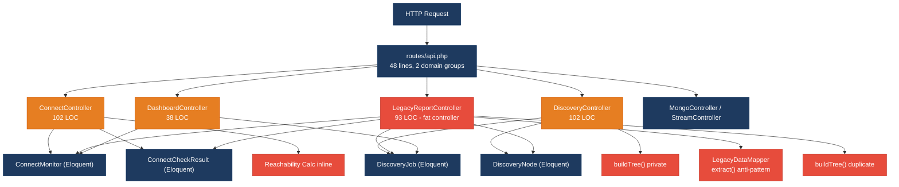
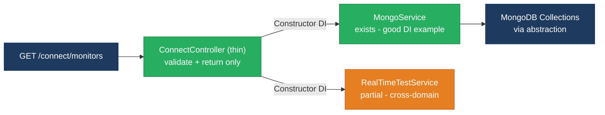
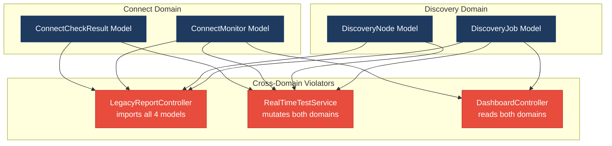
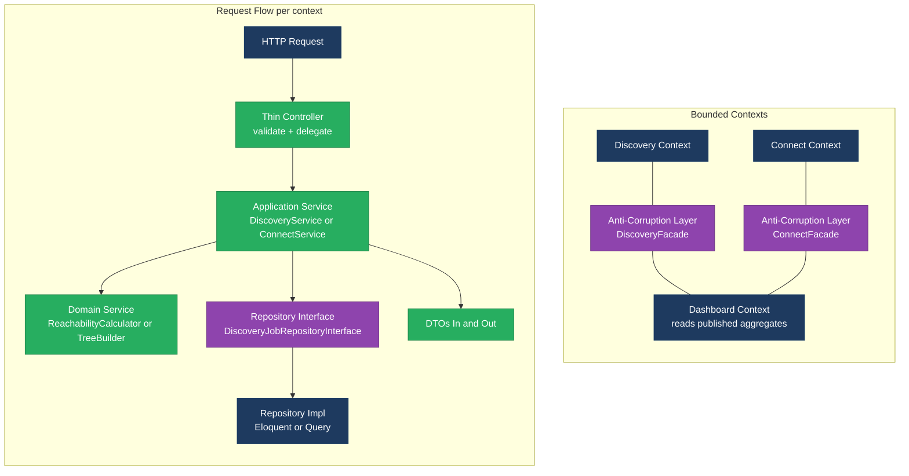
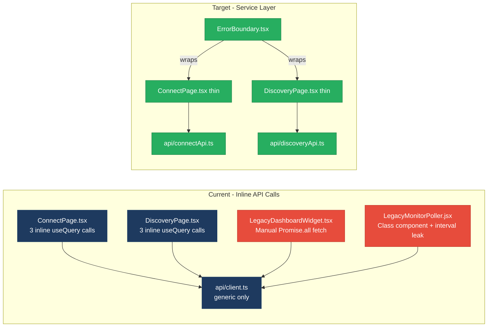
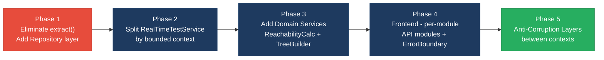

# 1. Architecture & Design Hotspots Analysis

**Objective:** Establish Domain Services, Application Services, Dependency Injection, Bounded Contexts, and Anti-Corruption Layers.

**Date:** 2026-08-11 15:56:05 IST | **Scope:** `.discovery-src/` — PHP 8.3 / Laravel 12 (backend) + React 19 / TypeScript / Vite (frontend) + Node.js / Express (dev-api)

## Executive Summary

> **Executive Summary**
>
> The Klearcom platform is a monorepo combining a Laravel 12 PHP backend, a React 19 TypeScript SPA frontend, and a Node.js/Express dev-API shim — all serving a voice observability product with two business domains: **Discovery** (IVR mapping) and **Connect** (TFN reachability monitoring). The overall architecture is immature: controllers perform direct Eloquent ORM access, embed business logic (reachability calculations, IVR tree building), and duplicate code across files, while no Repository layer exists. The most severe hotspots are a fat `LegacyReportController` combining DB queries, KPI math, and response formatting; a `buildTree()` function copy-pasted verbatim into two controllers; and a reachability formula that appears three times (two PHP controllers, one service). On the frontend, `LegacyMonitorPoller.jsx` is a class component with an interval memory leak, and `LegacyDashboardWidget.tsx` mixes multi-domain data fetching with rendering, bypassing the TanStack Query pattern used elsewhere. The dominant systemic risk is **change amplification**: any change to the reachability threshold (currently hardcoded at 90 %) or IVR tree shape must be applied in multiple controllers, a service, and a Node.js route handler — with no test coverage to catch a missed update.

<div class="metric-grid">
<div class="metric-card"><div class="metric-number">6</div><div class="metric-label">Controllers / Handlers</div></div>
<div class="metric-card"><div class="metric-number">4</div><div class="metric-label">Models / Entities</div></div>
<div class="metric-card"><div class="metric-number">2</div><div class="metric-label">Service Classes Found</div></div>
<div class="metric-card"><div class="metric-number">0</div><div class="metric-label">Repository Classes Found</div></div>
</div>

<div class="overall-rating overall-rating--high-risk"><div class="overall-rating-label">Overall Codebase Rating — Architecture &amp; Design</div><div class="overall-rating-value">High Risk</div><div class="overall-rating-note">Driven by High-Risk Missing Repository Pattern (H3), High-Risk Domain Boundary Violations (H8), and High-Risk Duplicate Business Logic (H10).</div></div>

## 1.1 Benchmark Ratings Summary

One row per hotspot. "Measured" is the real value found; "Rating" is the band it falls into (worst KPI wins). This table is the source for the Overall Codebase Rating banner above.

| # | Hotspot | Primary KPI | <span class="rating rating-good">Good</span> | <span class="rating rating-moderate">Moderate</span> | <span class="rating rating-high-risk">High Risk</span> | Measured | Rating |
|---|---|---|---|---|---|---|---|
| H1 | Fat Controllers | Avg LOC per controller | <150 | 150–300 | >300 | ~74 LOC avg (446 total / 6) | <span class="rating rating-good">Good</span> |
| H2 | Missing Service Layer | Controllers accessing repos/models directly | <10 | 10–20 | >20 | 13 direct Eloquent model calls across 4 controllers | <span class="rating rating-moderate">Moderate</span> |
| H3 | Missing Repository Pattern | Direct DB access points outside repositories | <10 | 10–20 | >20 | 0 repositories; 23+ Eloquent static calls scattered across controllers and service | <span class="rating rating-high-risk">High Risk</span> |
| H4 | Circular Dependencies | Dependency cycles | 0 | 1–3 | >3 | 0 — dependencies flow one-way (Controller to Service to Model) | <span class="rating rating-good">Good</span> |
| H5 | Shared Utility Abuse | Utility files with business logic | 0 | 1–5 | >5 | 1 (LegacyDataMapper using unsafe extract()) | <span class="rating rating-moderate">Moderate</span> |
| H6 | Direct SQL in Controllers | ORM compliance % | >90% | 60–90% | <60% | 100% — all queries use Eloquent; zero raw DB:: calls | <span class="rating rating-good">Good</span> |
| H7 | God Classes | Classes/files >1000 LOC | 0 | 1–3 | >3 | 0 — largest file is MongoService at 165 LOC | <span class="rating rating-good">Good</span> |
| H8 | Domain Boundary Violations | Cross-domain access points | 0 | 1–5 | >5 | 6 cross-domain accesses: LegacyReportController reads both Discovery and Connect models; RealTimeTestService writes both domains; DashboardController reads both | <span class="rating rating-high-risk">High Risk</span> |
| H9 | Shared Database Coupling | Tables shared across domains | <10% | 10–30% | >30% | 0% — MariaDB tables are per-domain; MongoDB uses a module field discriminator | <span class="rating rating-good">Good</span> |
| F1 | Business Logic in Components | Avg LOC per component | <150 | 150–300 | >300 | ~120 LOC avg across 7 components/pages | <span class="rating rating-good">Good</span> |
| F2 | Missing Frontend Service/Data Layer | Components with inline API calls | <10 | 10–20 | >20 | 6 components/pages with direct api.get/post calls | <span class="rating rating-moderate">Moderate</span> |
| F3 | God / Oversized Components | Components >400 LOC | 0 | 1–3 | >3 | 0 — ConnectPage.tsx is largest at 222 LOC | <span class="rating rating-good">Good</span> |
| F4 | Prop Drilling / Global State Abuse | Max prop-drilling depth | ≤2 | 3–4 | >4 | 1 level; Zustand uiStore holds only 2 IDs | <span class="rating rating-good">Good</span> |
| F5 | Legacy / Inconsistent Component Patterns | Legacy-pattern components | 0 | 1–10 | >10 | 2 (LegacyMonitorPoller.jsx class component with interval leak; LegacyDashboardWidget.tsx uses manual fetch instead of React Query) | <span class="rating rating-moderate">Moderate</span> |
| H10 | Duplicate Business Logic (additional) | Occurrences of same algorithm copy-pasted | 0 | 1–2 | >2 | 3 duplicates: buildTree() in 2 PHP controllers + 1 JS file; reachability formula in 2 controllers + 1 service | <span class="rating rating-high-risk">High Risk</span> |

## 1.2 Hotspot-by-Hotspot Evidence

### H2. Missing Service Layer <span class="sev sev-high">High</span>

**Benchmark:** `Controllers directly accessing Eloquent models = 13 call sites across 4 controllers` — falls in the **Moderate** band (Good <10 · Moderate 10–20 · High Risk >20).

**What to check:** Business rules spread across controllers with no dedicated service tier; logic is duplicated and impossible to reuse across entry points.

**Evidence:**

`backend/app/Http/Controllers/Api/DashboardController.php:13–17`
```php
$discoveryTotal = DiscoveryJob::count();
$discoveryCompleted = DiscoveryJob::where('status', 'completed')->count();
$connectMonitors = ConnectMonitor::count();
$avgReachability = ConnectMonitor::avg('reachability_pct') ?? 0;
$alerts = ConnectMonitor::where('status', 'alert')->count();
```
KPI aggregation (IVR availability %, reachability averages, alert counts) is computed directly in the controller action via chained Eloquent static calls, with no service class owning this logic.

`backend/app/Http/Controllers/Api/ConnectController.php:65–75`
```php
// Duplicate reachability calculation block (also in RealTimeTestService / dev-api realtime.js)
$recentChecks = ConnectCheckResult::where('connect_monitor_id', $id)
    ->orderByDesc('checked_at')
    ->limit(20)
    ->get();

$successRate = $recentChecks->count() > 0
    ? ($recentChecks->where('reachable', true)->count() / $recentChecks->count()) * 100
    : 100;

$computedStatus = $successRate < 90 ? 'alert' : 'active';
```
The reachability calculation and status derivation live in the controller; the identical formula also appears in `RealTimeTestService::runConnectTest()` line 118 and in `dev-api/src/realtime.js`.

**Why it matters here:** When the reachability threshold (currently 90 %) changes, it must be updated in `ConnectController.php`, `LegacyReportController.php`, `RealTimeTestService.php`, and the dev-api Node.js server — four places with no test coverage to verify consistency. Any new entry point (CLI command, scheduled job, webhook) would have to either copy the formula again or silently omit it.

**Recommended approach:**
1. Create `app/Services/ConnectService.php` with `computeReachability(int $monitorId): array` centralizing the 90 % threshold and status derivation.
2. Create `app/Services/DashboardService.php` with `getKpis(): array` that owns the five Eloquent aggregate queries currently in `DashboardController::kpis()`.
3. Thin `ConnectController::checks()` and `DashboardController::kpis()` to single-line service delegation.
4. Move the reachability formula out of `dev-api/src/realtime.js` into a shared module so the Node shim stays consistent.

<!-- affected-files
search: (ConnectMonitor|DiscoveryJob|ConnectCheckResult|DiscoveryNode)::(where|find|count|avg|orderBy|limit|get|create|update|findOrFail)
glob: backend/app/Http/Controllers/**/*.php
issue: Direct Eloquent model access in controller — missing service layer
action: Extract to dedicated Application Service; controller should delegate
-->

---

### H3. Missing Repository Pattern <span class="sev sev-critical">Critical</span>

**Benchmark:** `Direct DB access points outside repositories = 23+` — falls in the **High Risk** band (Good <10 · Moderate 10–20 · High Risk >20).

**What to check:** Direct ORM access scattered through the codebase; persistence concerns leak into business logic.

**Evidence:**

`backend/app/Services/RealTimeTestService.php:24–72` (Discovery domain)
```php
$job = DiscoveryJob::findOrFail($jobId);
$job->update(['status' => 'running', 'started_at' => now()]);
...
$node = DiscoveryNode::create([...]);
$nodeCount = DiscoveryNode::where('discovery_job_id', $jobId)->count();
$job->update(['status' => 'completed', 'completed_at' => now(), 'nodes_discovered' => $nodeCount, ...]);
```
The service directly calls Eloquent static methods (`DiscoveryJob::findOrFail`, `DiscoveryNode::create`, `DiscoveryNode::where(...)->count()`) with no repository abstraction. Testing this service requires a live database.

`backend/app/Services/RealTimeTestService.php:83–125` (Connect domain)
```php
$monitor = ConnectMonitor::findOrFail($monitorId);
ConnectCheckResult::create([...]);
$recent = ConnectCheckResult::where('connect_monitor_id', $monitorId)->orderByDesc('checked_at')->limit(20)->get();
$monitor->update([...]);
```
The same service also directly manipulates the Connect domain's Eloquent models — coupling discovery orchestration logic to both persistence layers simultaneously.

**Why it matters here:** `RealTimeTestService` is the most business-critical class in the codebase (it drives actual IVR traversal and TFN checks), yet it cannot be tested without a MariaDB connection. Adding a new IVR result storage backend (e.g. ClickHouse for analytics) would require touching service logic rather than swapping a repository implementation.

**Recommended approach:**
1. Create `app/Repositories/DiscoveryJobRepository.php` and `app/Repositories/ConnectMonitorRepository.php` implementing `find()`, `save()`, `updateStatus()`, and domain-specific query methods.
2. Bind repository interfaces in `AppServiceProvider` so constructors receive contracts, not concretions.
3. Update `RealTimeTestService` to accept `DiscoveryJobRepositoryInterface` and `ConnectMonitorRepositoryInterface` through constructor injection.
4. Introduce `app/Repositories/ConnectCheckResultRepository.php` with `findRecentByMonitor(int $id, int $limit)` encapsulating the repeated limit-20 pattern.

<!-- affected-files
search: ::(findOrFail|find|where|create|update|count|avg|get|limit|orderByDesc|orderBy)\(
glob: backend/app/**/*.php
issue: Direct Eloquent static call — no repository abstraction
action: Introduce repository interface; inject via constructor DI
-->

---

### H5. Shared Utility Abuse <span class="sev sev-medium">Medium</span>

**Benchmark:** `Utility files with business logic = 1` — falls in the **Moderate** band (Good 0 · Moderate 1–5 · High Risk >5).

**What to check:** Large "helpers" files holding business logic, used as an unowned dumping ground.

**Evidence:**

`backend/app/Legacy/LegacyDataMapper.php:10–20`
```php
public function mapReportRow(array $row): array
{
    extract($row, EXTR_SKIP);

    return [
        'label' => $name ?? 'Unknown',
        'metric' => $reachability_pct ?? 0,
        'region' => $country_code ?? 'N/A',
        'source' => 'legacy_extract_mapper',
    ];
}
```
The class uses PHP's `extract()` built-in — a known anti-pattern that pollutes variable scope with arbitrary keys. AGENTS.md in the Discovery module explicitly forbids it, yet the class uses it twice.

`backend/app/Http/Controllers/Api/LegacyReportController.php:21–22`
```php
$filters = $request->all();
extract($filters);
```
Raw query-string parameters are passed directly into `extract()`, making all incoming keys become local variables. A request with a key named `monitors` or `mapper` could shadow local variables.

**Why it matters here:** The `AGENTS.md` already flags `extract()` as forbidden but it has not been remediated. The mapper is instantiated with `new LegacyDataMapper()` in the controller, bypassing the DI container, meaning it cannot be mocked or swapped in tests.

**Recommended approach:**
1. Delete `LegacyDataMapper.php` and replace both `extract()` calls with explicit array destructuring or named getter calls.
2. Move the report-row shaping into a DTO or a `ReportRowTransformer` value object with explicit typed properties.
3. Validate incoming filter parameters in `LegacyReportController::carrierSummary()` with a Laravel Form Request before passing to any mapper.

<!-- affected-files
search: extract\(
glob: backend/app/**/*.php
issue: Unsafe extract() — scope pollution and potential variable injection
action: Replace with explicit destructuring; add Form Request validation
-->

---

### H8. Domain Boundary Violations <span class="sev sev-critical">Critical</span>

**Benchmark:** `Cross-domain access points = 6` — falls in the **High Risk** band (Good 0 · Moderate 1–5 · High Risk >5).

**What to check:** Code in one business area directly reading/writing another area's data or models.

**Evidence:**

`backend/app/Http/Controllers/Api/LegacyReportController.php:7–10`
```php
use App\Models\ConnectCheckResult;
use App\Models\ConnectMonitor;
use App\Models\DiscoveryJob;
use App\Models\DiscoveryNode;
```
`LegacyReportController::ivrDepthReport()` (lines 56–75) directly queries `DiscoveryJob` and `DiscoveryNode`, which belong to the Discovery domain, from what is effectively a Connect reporting context. It then builds the IVR tree using a private method duplicated from `DiscoveryController`.

`backend/app/Services/RealTimeTestService.php:5–8`
```php
use App\Models\ConnectCheckResult;
use App\Models\ConnectMonitor;
use App\Models\DiscoveryJob;
use App\Models\DiscoveryNode;
```
A single service (`RealTimeTestService`) directly mutates models from both the Discovery domain and the Connect domain. It acts as a god orchestrator with no bounded-context separation.

`backend/app/Http/Controllers/Api/DashboardController.php:6–7`
```php
use App\Models\ConnectMonitor;
use App\Models\DiscoveryJob;
```
The Dashboard controller queries both domains directly rather than consuming published aggregates from each domain's own service.

**Why it matters here:** When the Connect schema changes (e.g. renaming `reachability_pct` to `uptime_pct`), three files outside the Connect context must be updated: `LegacyReportController`, `RealTimeTestService`, and `DashboardController`. Extracting either module to a microservice in the future would require untangling these cross-domain imports across all three files.

**Recommended approach:**
1. Create `DiscoveryService` and `ConnectService` that each own their domain's models; expose only DTOs across the boundary.
2. Replace the cross-domain imports in `LegacyReportController` with a call to `DiscoveryService::getIvrDepthReport(int $jobId)`.
3. Replace `DashboardController`'s direct queries with `DashboardService::getKpis()` that reads aggregates from `ConnectService` and `DiscoveryService`.
4. Split `RealTimeTestService` into `DiscoveryTestOrchestrator` and `ConnectTestOrchestrator`, each importing only its own domain's models.

<!-- affected-files
search: use App.Models.(ConnectMonitor|ConnectCheckResult|DiscoveryJob|DiscoveryNode)
glob: backend/app/Http/Controllers/**/*.php
issue: Cross-domain model import — domain boundary violation
action: Route through domain service; expose DTO instead of direct model access
-->

---

### H10. Duplicate Business Logic (additional) <span class="sev sev-critical">Critical</span>

**Benchmark:** `Copy-pasted algorithm occurrences = 3 distinct duplicates` — falls in the **High Risk** band (Good 0 · Moderate 1–2 · High Risk >2).

**What to check:** Same algorithm or formula implemented verbatim in multiple files with no shared extraction.

**Evidence:**

`backend/app/Http/Controllers/Api/DiscoveryController.php:87–101` vs `backend/app/Http/Controllers/Api/LegacyReportController.php:78–91` — identical `buildTree()`:
```php
private function buildTree($nodes, ?int $parentId = null): array
{
    return $nodes
        ->where('parent_id', $parentId)
        ->map(fn (DiscoveryNode $node) => [
            'id' => $node->id,
            'prompt_text' => $node->prompt_text,
            'dtmf_option' => $node->dtmf_option,
            'node_type' => $node->node_type,
            'depth' => $node->depth,
            'children' => $this->buildTree($nodes, $node->id),
        ])
        ->values()
        ->all();
}
```
`LegacyReportController.php` line 77 even carries the comment `/** Duplicate of DiscoveryController::buildTree — copy-paste debt */`.

Reachability formula in `ConnectController.php:71–73` vs `RealTimeTestService.php:118`:
```php
// ConnectController.php:71
$successRate = $recentChecks->count() > 0
    ? ($recentChecks->where('reachable', true)->count() / $recentChecks->count()) * 100
    : 100;

// RealTimeTestService.php:118
$rate = $recent->count() > 0 ? ($recent->where('reachable', true)->count() / $recent->count()) * 100 : 100;
```
Identical formula, different variable names, same hardcoded 90 % alert threshold logic.

**Why it matters here:** The `buildTree()` duplication means any change to IVR tree shape must be applied in two PHP controllers and `dev-api/src/store.js`. The reachability formula duplication means the 90 % alert threshold is a magic number in at least 3 locations. A product decision to change it to 95 % could silently be missed in one location.

**Recommended approach:**
1. Extract `buildTree()` into `app/Services/DiscoveryService.php` as a public method and remove both private copies.
2. Extract the reachability formula into `app/Services/ConnectService.php::computeReachability(Collection $checks): float`.
3. Update `dev-api/src/store.js`'s `buildTree()` to call a shared utility, or document in AGENTS.md that the dev shim mirrors PHP as an acknowledged maintenance item.

<!-- affected-files
search: buildTree|successRate|reachability.*count.*100
glob: backend/app/**/*.php
issue: Duplicated business algorithm — copy-paste debt
action: Extract to DiscoveryService::buildTree() or ConnectService::computeReachability()
-->

---

### F2. Missing Frontend Service/Data Layer <span class="sev sev-medium">Medium</span>

**Benchmark:** `Components with inline API calls = 6` — falls in the **Moderate** band (Good <10 · Moderate 10–20 · High Risk >20).

**What to check:** `fetch`/HTTP calls hard-coded inline in components instead of a shared data layer.

**Evidence:**

`frontend/src/pages/LegacyDashboardWidget.tsx:19–24`
```tsx
Promise.all([
  api.get<DashboardKpis>('/dashboard/kpis'),
  api.get<{ data: DiscoveryJob[] }>('/discovery/jobs'),
  api.get<{ data: ConnectMonitor[] }>('/connect/monitors'),
])
```
This component bypasses TanStack Query (used in all other pages) and hard-codes three different API paths inline, duplicating paths already used in `DashboardPage.tsx`, `DiscoveryPage.tsx`, and `ConnectPage.tsx`.

`frontend/src/pages/ConnectPage.tsx:22–39` — Three separate `useQuery` calls with inline path strings:
```tsx
queryFn: () => api.get<{ data: ConnectMonitor[] }>('/connect/monitors'),
...
queryFn: () => api.get<{ data: ConnectCheckResult[] }>(`/connect/monitors/${selectedId}/checks`),
...
queryFn: () => api.get<{ data: Transcript[] }>(`/mongodb/transcripts?module=connect&reference_id=${selectedId}`),
```
API paths are string literals embedded in page components with no per-module API module centralizing the endpoint definitions.

**Why it matters here:** When the API route for monitor checks changes, the string must be updated in `ConnectPage.tsx`, `LegacyDashboardWidget.tsx`, and `useRealtimeTest.ts` independently. The absence of typed per-module API functions means TypeScript cannot catch a mistyped path at compile time.

**Recommended approach:**
1. Create `frontend/src/api/connectApi.ts` and `frontend/src/api/discoveryApi.ts` exporting typed functions (`getMonitors()`, `getChecks(id: number)`, etc.).
2. Move all endpoint path strings into these modules; update `ConnectPage.tsx`, `DiscoveryPage.tsx`, and `LegacyDashboardWidget.tsx` to import from the API modules.
3. Migrate `LegacyDashboardWidget.tsx` to use `useQuery` hooks from TanStack Query to match the rest of the app.

<!-- affected-files
search: api\.(get|post)\(
glob: frontend/src/**/*.{tsx,ts,jsx}
issue: Inline API path string in component — missing per-module API service layer
action: Extract to frontend/src/api/connectApi.ts or discoveryApi.ts
-->

---

### F5. Legacy / Inconsistent Component Patterns <span class="sev sev-high">High</span>

**Benchmark:** `Legacy-pattern components = 2` — falls in the **Moderate** band (Good 0 · Moderate 1–10 · High Risk >10).

**What to check:** Mixed paradigms (class + function components), missing error boundaries, deprecated lifecycle APIs.

**Evidence:**

`frontend/src/components/LegacyMonitorPoller.jsx:17–33`
```jsx
export default class LegacyMonitorPoller extends Component<Props, State> {
  intervalId: ReturnType<typeof setInterval> | null = null;

  componentDidMount() {
    this.intervalId = setInterval(() => {
      api.get<{ computed?: { reachability_pct: number } }>(`/connect/monitors/${this.props.monitorId}/checks`)
        .then((res) => { ... })
    }, 3000);
    // Intentionally no componentWillUnmount — EventSource/interval leak for audit finding
  }
  ...
}
```
A React class component starts a `setInterval` in `componentDidMount` but provides no `componentWillUnmount`. Every mount leaks an interval timer. The file is `.jsx` while all other frontend files are `.tsx`, adding type unsafety.

`frontend/src/pages/LegacyDashboardWidget.tsx:47`
```tsx
if (error) throw new Error(error); // Uncaught — no Error Boundary wraps this component
```
This component throws on fetch failure, but `App.tsx` and `main.tsx` contain no `<ErrorBoundary>` wrapper. The thrown error will crash the entire application with an unhandled exception.

**Why it matters here:** In React 19, class components are second-class citizens — concurrent mode features are not available in them. `LegacyMonitorPoller` will silently leak memory on every navigation away from any page that mounts it. The missing error boundary means a single failed API call in `LegacyDashboardWidget` blanks the entire application for the end user.

**Recommended approach:**
1. Convert `LegacyMonitorPoller.jsx` to a function component using `useEffect` with a proper cleanup returning `() => clearInterval(intervalId)`.
2. Rename to `.tsx` and add TypeScript types.
3. Add `frontend/src/components/ErrorBoundary.tsx` and wrap `<Routes>` in `App.tsx` with it.
4. Replace the `throw new Error(error)` pattern in `LegacyDashboardWidget.tsx` with conditional error rendering.

<!-- affected-files
search: class.*extends Component|componentDidMount|throw new Error
glob: frontend/src/**/*.{tsx,ts,jsx}
issue: Legacy class component or missing error boundary
action: Convert to function component with useEffect cleanup; add ErrorBoundary wrapper
-->

---

**Not observed (rated Good):** H1 — average controller LOC is ~74, well within the Good threshold. H4 — inspected all `use App\` statements; dependency graph is strictly one-way (Controller to Service to Model), no cycles. H6 — grepped for `DB::` throughout the entire backend; zero raw SQL calls found, all queries go through Eloquent ORM. H7 — largest PHP file is `MongoService.php` at 165 LOC; no file exceeds 300 LOC. H9 — MariaDB tables are partitioned by domain; MongoDB uses a `module` discriminator field by design. F1 — average frontend component is ~120 LOC; no component exceeds 300 LOC. F3 — no component exceeds 400 LOC. F4 — prop depth is maximum 1 level; Zustand `uiStore` holds only 2 IDs, no god store.

## 1.3 Diagrams

### Current-state architecture (as-is)



### Clean reference path (target pattern found in codebase)



### Domain boundary map (current violations)



### Target architecture (proposed)



### Frontend architecture (current vs target)



### Improvement roadmap



## 1.4 Actions Required

| Hotspot | Action | Rating | Priority |
|---|---|---|---|
| H3 Missing Repository Pattern | Create `app/Repositories/DiscoveryJobRepository.php` and `app/Repositories/ConnectMonitorRepository.php`; bind interfaces in `AppServiceProvider`; update `RealTimeTestService` to inject repositories via constructor DI | <span class="rating rating-high-risk">High Risk</span> | <span class="sev sev-critical">Critical</span> |
| H8 Domain Boundary Violations | Split `RealTimeTestService` into `DiscoveryTestOrchestrator` and `ConnectTestOrchestrator`; route cross-domain reads in `LegacyReportController` through `DiscoveryService`; create `DashboardService` consuming service-level aggregates | <span class="rating rating-high-risk">High Risk</span> | <span class="sev sev-critical">Critical</span> |
| H10 Duplicate Business Logic | Extract `buildTree()` into `DiscoveryService`; extract reachability formula into `ConnectService::computeReachability()`; delete both private controller copies | <span class="rating rating-high-risk">High Risk</span> | <span class="sev sev-critical">Critical</span> |
| H2 Missing Service Layer | Create `ConnectService` and `DashboardService`; thin `ConnectController::checks()` and `DashboardController::kpis()` to single-line service delegation | <span class="rating rating-moderate">Moderate</span> | <span class="sev sev-high">High</span> |
| H5 Shared Utility Abuse | Delete `LegacyDataMapper.php` and replace both `extract()` calls with explicit destructuring; add Form Request validation for `carrierSummary` filters | <span class="rating rating-moderate">Moderate</span> | <span class="sev sev-high">High</span> |
| F5 Legacy Component Patterns | Convert `LegacyMonitorPoller.jsx` to TypeScript function component with `useEffect` cleanup; add `ErrorBoundary.tsx`; wrap `<Routes>` in `App.tsx` | <span class="rating rating-moderate">Moderate</span> | <span class="sev sev-high">High</span> |
| F2 Missing Frontend Service Layer | Create `frontend/src/api/connectApi.ts` and `frontend/src/api/discoveryApi.ts`; migrate `LegacyDashboardWidget.tsx` to `useQuery` hooks; centralize all endpoint path strings | <span class="rating rating-moderate">Moderate</span> | <span class="sev sev-medium">Medium</span> |

## 1.5 Expected Outcomes

- **Testability:** Introducing Repository interfaces allows `RealTimeTestService`, `ConnectController`, and `DashboardController` to be unit-tested with in-memory fakes instead of live databases; coverage of the reachability formula and IVR tree builder becomes straightforward.
- **Change isolation:** Splitting `RealTimeTestService` by bounded context means a schema change in the Discovery domain does not require touching any Connect file, reducing the blast radius of routine feature work.
- **Single source of truth:** Extracting `buildTree()` and the reachability formula into dedicated service methods eliminates three-location duplication; the 90 % alert threshold becomes a named constant changed in exactly one place.
- **Frontend reliability:** Adding `ErrorBoundary.tsx` and fixing the `LegacyMonitorPoller` interval leak prevents full-page crashes on API failure and stops memory accumulation during navigation.
- **Architectural readiness:** Bounded-context separation with Anti-Corruption Layers between Discovery and Connect prepares the platform for eventual microservice extraction — either module can be independently deployed once its data access is fully encapsulated behind a service interface.
