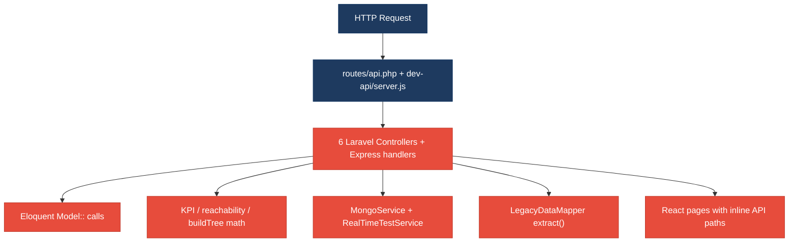
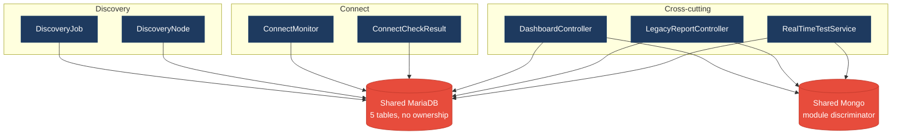
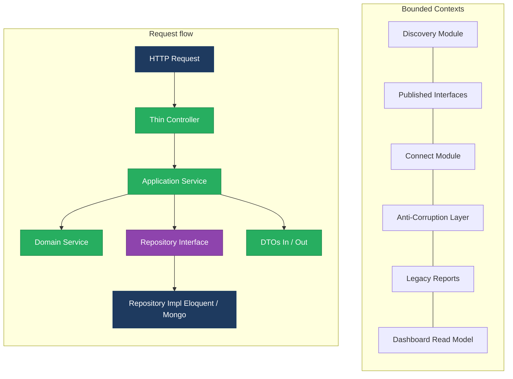
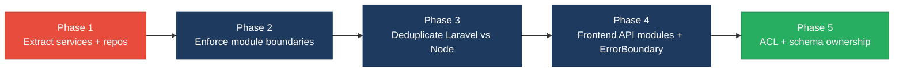

# 1. Architecture & Design Hotspots Analysis

**Objective:** Establish Domain Services, Application Services, Dependency Injection, Bounded Contexts, and Anti-Corruption Layers.

**Date:** 2026-07-24 | **Scope:** `shende-shweta/FSDKC` (main) — PHP 8.3 / Laravel 12 backend, React 19 + TypeScript + Vite frontend, Node/Express `dev-api`, MariaDB + MongoDB

## Executive Summary

> **Executive Summary**
>
> Klearcom is a multi-layer Voice/Telecom QA monolith (Laravel 12 API, React 19 SPA, Node Express `dev-api`) with nominal Discovery/Connect module folders that contain only `AGENTS.md` stubs — real logic lives in fat HTTP handlers and two shared services. Controllers and Express routes call Eloquent/in-memory stores directly (no repository layer), duplicate reachability/`buildTree`/KPI math across PHP and Node, and cross-read both domains from Dashboard and Legacy report paths. The React layer has a thin `api/client.ts` but hard-codes module paths inside page components, mixes a legacy class poller with modern hooks, and lacks error boundaries. Dominant risk is change amplification and hidden coupling: a reachability formula or IVR tree shape change requires coordinated edits in Laravel controllers, `RealTimeTestService`, `dev-api`, and both SPA pages.

<div class="metric-grid">
<div class="metric-card"><div class="metric-number">6</div><div class="metric-label">Controllers / Handlers</div></div>
<div class="metric-card"><div class="metric-number">4</div><div class="metric-label">Models / Entities</div></div>
<div class="metric-card"><div class="metric-number">2</div><div class="metric-label">Service Classes Found</div></div>
<div class="metric-card"><div class="metric-number">0</div><div class="metric-label">Repository Classes Found</div></div>
</div>

**Layers covered:** Backend Laravel (`backend/app`, 6 Api controllers, 4 models, 2 services, Legacy mapper) · Frontend React SPA (`frontend/src`, 9 components/pages + hooks/store/api) · Node `dev-api` (6 source modules, parallel API surface). File counts measured via GitHub contents API on `main`.

<div class="overall-rating overall-rating--high-risk"><div class="overall-rating-label">Overall Codebase Rating — Architecture &amp; Design</div><div class="overall-rating-value">High Risk</div><div class="overall-rating-note">Driven by High-Risk Missing Service/Repository layers (H2/H3), Direct SQL/ORM in controllers (H6), Domain boundary &amp; shared-DB coupling (H8/H9), and dual-stack logic duplication (H10).</div></div>

## 1.1 Benchmark Ratings Summary

| # | Hotspot | Primary KPI | <span class="rating rating-good">Good</span> | <span class="rating rating-moderate">Moderate</span> | <span class="rating rating-high-risk">High Risk</span> | Measured | Rating |
|---|---|---|---|---|---|---|---|
| H1 | Fat Controllers | Avg LOC per controller | <150 | 150–300 | >300 | 62 LOC | <span class="rating rating-good">Good</span> |
| H2 | Missing Service Layer | Controllers accessing repos/models | <10 | 10–20 | >20 | 25 Eloquent access points | <span class="rating rating-high-risk">High Risk</span> |
| H3 | Missing Repository Pattern | Direct DB access points | <10 | 10–20 | >20 | 35+ (0 repositories) | <span class="rating rating-high-risk">High Risk</span> |
| H4 | Circular Dependencies | Dependency cycles | 0 | 1–3 | >3 | 0 | <span class="rating rating-good">Good</span> |
| H5 | Shared Utility Abuse | Utility files w/ business logic | 0 | 1–5 | >5 | 2 | <span class="rating rating-moderate">Moderate</span> |
| H6 | Direct SQL in Controllers | ORM compliance % | >90% | 60–90% | <60% | ~29% kept out of controllers | <span class="rating rating-high-risk">High Risk</span> |
| H7 | God Classes | Classes >1000 LOC | 0 | 1–3 | >3 | 0 (largest server.js 276 lines) | <span class="rating rating-good">Good</span> |
| H8 | Domain Boundary Violations | Cross-domain access points | 0 | 1–5 | >5 | 8 | <span class="rating rating-high-risk">High Risk</span> |
| H9 | Shared Database Coupling | Tables shared across domains | <10% | 10–30% | >30% | 80% (4/5 tables cross-read) | <span class="rating rating-high-risk">High Risk</span> |
| F1 | Business Logic in Components | Avg LOC per component | <150 | 150–300 | >300 | 74 LOC | <span class="rating rating-good">Good</span> |
| F2 | Missing Frontend Service/Data Layer | Components w/ inline API calls | <10 | 10–20 | >20 | 6 | <span class="rating rating-good">Good</span> |
| F3 | God / Oversized Components | Components >400 LOC | 0 | 1–3 | >3 | 0 (ConnectPage 222, DiscoveryPage 176) | <span class="rating rating-good">Good</span> |
| F4 | Prop Drilling / Global State Abuse | Max prop-drilling depth | ≤2 | 3–4 | >4 | 2 levels; focused Zustand store | <span class="rating rating-good">Good</span> |
| F5 | Legacy / Inconsistent Component Patterns | Legacy-pattern components | 0 | 1–10 | >10 | 2 | <span class="rating rating-moderate">Moderate</span> |
| H10 | Dual-stack domain duplication (additional) | Duplicated workflows across Laravel ↔ Node (target 0) | 0 | 1–3 | >3 | 5 duplicated workflows | <span class="rating rating-high-risk">High Risk</span> |
| H11 | Empty bounded-context shells (additional) | Module dirs with zero impl classes (target 0) | 0 | 1–2 | >2 | 2 empty module shells | <span class="rating rating-moderate">Moderate</span> |

## 1.2 Hotspot-by-Hotspot Evidence

### H1. Fat Controllers <span class="sev sev-low">Low</span>

**Benchmark:** `Avg LOC per controller = 62` → falls in the **Good** band (Good <150 · Moderate 150–300 · High Risk >300).

**What to check:** Business logic inside controllers/handlers; controllers should only translate HTTP ↔ application calls.

**Evidence:** Controllers are compact by LOC (ConnectController 82, DiscoveryController 85, LegacyReportController 76, DashboardController 34, MongoController 35, StreamController 59; average 62) but still embed domain math and tree building (see H2). Express `dev-api/src/server.js` is a single 276-line handler file (224 LOC) consolidating all routes — size Moderate for one file, but counted separately from the Laravel average.

**Evidence:** Not observed as High Risk on the primary LOC KPI — controllers stay under 150 LOC; residual fat is qualitative (business rules) and scored under H2/H6.

### H2. Missing Service Layer <span class="sev sev-critical">Critical</span>

**Benchmark:** `Controllers accessing repos/models = 25 Eloquent access points` → falls in the **High Risk** band (Good <10 · Moderate 10–20 · High Risk >20).

**What to check:** Business rules spread across controllers/utilities with no dedicated application/domain service tier for CRUD and KPIs.

**Evidence:** At least 25 Eloquent/model touchpoints across four controllers; `Modules/Discovery` and `Modules/Connect` hold no service classes. Partial services (`MongoService`, `RealTimeTestService`) cover streaming/tests only.

Example — Dashboard KPI aggregation entirely in the controller:

```12:36:backend/app/Http/Controllers/Api/DashboardController.php
    public function kpis(): JsonResponse
    {
        $discoveryTotal = DiscoveryJob::count();
        $discoveryCompleted = DiscoveryJob::where('status', 'completed')->count();
        $connectMonitors = ConnectMonitor::count();
        $avgReachability = ConnectMonitor::avg('reachability_pct') ?? 0;
        $alerts = ConnectMonitor::where('status', 'alert')->count();
        // ... availability + operational payloads ...
    }
```

Example — reachability success-rate math inlined in `ConnectController::checks`:

```57:84:backend/app/Http/Controllers/Api/ConnectController.php
        $recentChecks = ConnectCheckResult::where('connect_monitor_id', $id)
            ->orderByDesc('checked_at')
            ->limit(20)
            ->get();

        $successRate = $recentChecks->count() > 0
            ? ($recentChecks->where('reachable', true)->count() / $recentChecks->count()) * 100
            : 100;

        $computedStatus = $successRate < 90 ? 'alert' : 'active';
```

Example — Express dashboard duplicates the same KPI rules with no service:

```58:80:dev-api/src/server.js
app.get('/api/dashboard/kpis', async (_req, res) => {
  const discoveryTotal = store.discoveryJobs.length;
  const discoveryCompleted = store.discoveryJobs.filter((j) => j.status === 'completed').length;
  const avgReach = store.connectMonitors.reduce((s, m) => s + m.reachability_pct, 0) / store.connectMonitors.length;
  // ...
});
```

**Why it matters here:** KPI and reachability formulas are copied into Laravel controllers, `RealTimeTestService`, and `dev-api`. Shipping a new alert threshold (e.g. 90% → 95%) requires multi-stack edits and risks Dashboard vs Connect vs live-test disagreement. New CLI/job entry points cannot reuse workflows without re-copying controller code.

**Recommended approach:**
1. Extract `DashboardService::kpis()`, `ConnectService::computeReachability()`, `DiscoveryService::buildTree()` under `app/Modules/{Connect,Discovery}/Services/`.
2. Thin controllers to validate + delegate (mirror `MongoController` which already mostly delegates to `MongoService`).
3. Port the same service contracts into `dev-api` modules or retire Express business logic once Laravel is primary.

<!-- affected-files
search: (DiscoveryJob|ConnectMonitor|ConnectCheckResult|DiscoveryNode)::
glob: backend/app/Http/Controllers/**/*.php
issue: Controller reaches Eloquent models directly (missing application service)
action: Move workflow/KPI/query orchestration into Module Application Services; keep controller HTTP-only
-->

### H3. Missing Repository Pattern <span class="sev sev-critical">Critical</span>

**Benchmark:** `Direct DB access points outside repositories = 35+` → falls in the **High Risk** band (Good <10 · Moderate 10–20 · High Risk >20).

**What to check:** Direct DB/ORM access scattered through the codebase; target 100% access via repositories.

**Evidence:** No `app/Repositories/` (or module-level repository) directory exists. Controllers and `RealTimeTestService` call Eloquent; `MongoService` talks to Mongo collections directly (acceptable as a persistence adapter, but MariaDB has no equivalent).

```88:96:backend/app/Services/RealTimeTestService.php
        $nodeCount = DiscoveryNode::where('discovery_job_id', $jobId)->count();
        $job->update([
            'status' => 'completed',
            'completed_at' => now(),
            'nodes_discovered' => $nodeCount,
            'menu_depth' => DiscoveryNode::where('discovery_job_id', $jobId)->max('depth') ?? 0,
        ]);
```

```18:27:backend/app/Http/Controllers/Api/DiscoveryController.php
    public function index(): JsonResponse
    {
        $jobs = DiscoveryJob::orderByDesc('created_at')->get();

        return response()->json(['data' => $jobs]);
    }
```

**Why it matters here:** Persistence concerns (ordering, eager loads, Mongo collection names) leak into HTTP and test-runner code, blocking unit tests without a DB and blocking MariaDB↔store swaps already mirrored by `dev-api/src/store.js`.

**Recommended approach:**
1. Add `DiscoveryJobRepository` / `ConnectMonitorRepository` interfaces bound in a provider.
2. Keep `MongoService` as the Mongo adapter behind a `TranscriptRepository` / `TestEventRepository` interface.
3. Stop calling `Model::` from controllers; inject repositories into application services only.

<!-- affected-files
search: (DiscoveryJob|ConnectMonitor|ConnectCheckResult|DiscoveryNode)::
glob: backend/app/**/*.php
issue: Direct Eloquent access with no Repository abstraction
action: Introduce repository interfaces/implementations; route all MariaDB access through them
-->

### H4. Circular Dependencies <span class="sev sev-low">Low</span>

**Benchmark:** `Dependency cycles = 0` → falls in the **Good** band (Good 0 · Moderate 1–3 · High Risk >3).

**What to check:** Modules/packages importing each other.

**Evidence:** Not observed — Laravel controllers depend on Services/Models one-way; Models do not import Controllers; frontend pages → hooks → `api/client` is acyclic; `RealTimeTestService` → `MongoService` only.

### H5. Shared Utility Abuse <span class="sev sev-medium">Medium</span>

**Benchmark:** `Utility files w/ business logic = 2` → falls in the **Moderate** band (Good 0 · Moderate 1–5 · High Risk >5).

**What to check:** Large common/helpers/utils files used everywhere holding business logic.

**Evidence:**

1. `LegacyDataMapper` uses `extract()` to map report rows — unowned legacy utility with domain field knowledge:

```12:20:backend/app/Legacy/LegacyDataMapper.php
    public function mapReportRow(array $row): array
    {
        extract($row, EXTR_SKIP);

        return [
            'label' => $name ?? 'Unknown',
            'metric' => $reachability_pct ?? 0,
            'region' => $country_code ?? 'N/A',
            'source' => 'legacy_extract_mapper',
        ];
    }
```

2. `dev-api/src/store.js` `buildTree()` is a shared domain algorithm living in a generic store module (duplicated in PHP controllers).

**Why it matters here:** Legacy extract mapping and tree-building utilities become dumping grounds; AGENTS.md already forbids `extract()` but production code still uses it, training contributors to add more “quick” helpers instead of domain services.

**Recommended approach:** Replace `LegacyDataMapper` with explicit DTOs; move `buildTree` into `DiscoveryTreeBuilder` domain service shared conceptually across stacks.

<!-- affected-files
search: (extract\(|function buildTree)
glob: {backend/app/Legacy/**/*.php,dev-api/src/**/*.js}
issue: Shared utility/helper holding domain mapping or tree logic
action: Replace with domain-specific services/DTOs; remove extract()
-->

### H6. Direct SQL in Controllers <span class="sev sev-critical">Critical</span>

**Benchmark:** `ORM/repository compliance % ≈ 29%` → falls in the **High Risk** band (Good >90% · Moderate 60–90% · High Risk <60%).

**What to check:** Raw queries / query builders / Eloquent embedded directly in controllers; share of queries kept out of controllers.

**Evidence:** Controllers own the majority of Eloquent queries (~25); services hold ~10; repositories hold 0 → ~29% of MariaDB access is outside controllers. No raw `DB::select` strings found, but Eloquent query building in HTTP layer is the compliance failure mode for this stack.

```21:28:backend/app/Http/Controllers/Api/LegacyReportController.php
        $monitors = ConnectMonitor::query()
            ->when(isset($country_code), fn ($q) => $q->where('country_code', $country_code))
            ->when(isset($carrier), fn ($q) => $q->where('carrier', $carrier))
            ->orderByDesc('reachability_pct')
            ->get();
```

```64:68:backend/app/Http/Controllers/Api/DiscoveryController.php
        $job = DiscoveryJob::findOrFail($id);
        $nodes = DiscoveryNode::where('discovery_job_id', $id)->get();

        return response()->json([
```

**Why it matters here:** Schema renames (e.g. `reachability_pct`) and filter semantics change in Legacy reports force controller edits and risk breaking Dashboard KPIs that query the same columns differently.

**Recommended approach:** Move all Eloquent builders into repositories; controllers call services that return DTOs only.

<!-- affected-files
search: ::(query|where|findOrFail|orderByDesc|count|avg|create|with)\(
glob: backend/app/Http/Controllers/**/*.php
issue: Eloquent/query access embedded in HTTP controllers
action: Relocate queries to repositories invoked by application services
-->

### H7. God Classes <span class="sev sev-low">Low</span>

**Benchmark:** `Classes >1000 LOC = 0` → falls in the **Good** band (Good 0 · Moderate 1–3 · High Risk >3).

**What to check:** Single classes/files handling many unrelated responsibilities at extreme size.

**Evidence:** Not observed — largest files are `dev-api/src/server.js` (276 lines), `ConnectPage.tsx` (222), `RealTimeTestService.php` (141). Size is Fine; responsibility sprawl is captured under H2/H8/H10 instead.

### H8. Domain Boundary Violations <span class="sev sev-critical">Critical</span>

**Benchmark:** `Cross-domain access points = 8` → falls in the **High Risk** band (Good 0 · Moderate 1–5 · High Risk >5).

**What to check:** Code in one business area directly reading/writing another area's data or models.

**Evidence:** Eight measured cross-domain points:
1. `DashboardController` reads Discovery + Connect models
2. `LegacyReportController::carrierSummary` (Connect) and `ivrDepthReport` (Discovery) in one controller
3. `RealTimeTestService` owns both `runDiscoveryTest` and `runConnectTest`
4. `MongoService` parameterized by free-form `module` string spanning domains
5. `LegacyReportController` duplicates Discovery `buildTree`
6. Frontend `LegacyDashboardWidget` fetches KPIs + discovery jobs + connect monitors together
7. Express `server.js` single process owns both route prefixes with shared `store`
8. Empty `app/Modules/*` shells do not enforce ownership — all models live in global `App\Models`

```10:16:backend/app/Http/Controllers/Api/DashboardController.php
use App\Models\ConnectMonitor;
use App\Models\DiscoveryJob;
use Illuminate\Http\JsonResponse;

class DashboardController extends Controller
```

**Why it matters here:** Discovery IVR schema changes and Connect monitor KPIs collide in Dashboard/Legacy/Realtime paths, blocking independent extraction of either module despite the folder names suggesting bounded contexts.

**Recommended approach:** Place models/services under `Modules/Discovery` and `Modules/Connect`; expose read models/APIs for Dashboard; split `RealTimeTestService` per context; introduce ACL for Legacy reports.

<!-- affected-files
search: (DiscoveryJob|DiscoveryNode|ConnectMonitor|ConnectCheckResult)
glob: backend/app/Http/Controllers/Api/{DashboardController,LegacyReportController}.php
issue: Cross-domain model access outside owning bounded context
action: Enforce module ownership; Dashboard/Legacy consume published read APIs or ACL DTOs
-->

### H9. Shared Database Coupling <span class="sev sev-critical">Critical</span>

**Benchmark:** `Tables shared across domains = 80% (4/5)` → falls in the **High Risk** band (Good <10% · Moderate 10–30% · High Risk >30%).

**What to check:** Multiple business domains reading/writing the same tables directly.

**Evidence:** `docker/mariadb/init.sql` defines 5 tables (`users`, `discovery_jobs`, `discovery_nodes`, `connect_monitors`, `connect_check_results`). All four domain tables are queried by both owning controllers and cross-cutting Dashboard/Legacy/Realtime code — 4/5 = 80%. Mongo collections (`transcripts`, `test_events`, `call_diagnostics`) are similarly shared via `module` discriminator rather than separate databases.

**Why it matters here:** A Connect column change silently breaks Legacy carrier reports and Dashboard operational KPIs; there is no schema ownership or anti-corruption boundary between domains.

**Recommended approach:** Document table ownership per module; Dashboard reads via domain services; consider separate Mongo DBs or collection prefixes per context; eventually split schemas if modules extract.

<!-- affected-files
search: CREATE TABLE
glob: docker/mariadb/init.sql
issue: Single shared schema with cross-domain table access
action: Declare ownership per table; route cross-domain reads through services/ACL
-->

### F1. Business Logic in Components <span class="sev sev-low">Low</span>

**Benchmark:** `Avg LOC per component = 74` → falls in the **Good** band (Good <150 · Moderate 150–300 · High Risk >300).

**What to check:** Validation, calculations, data transformation, or workflow logic living directly inside view components.

**Evidence:** Nine measured UI units average 74 LOC. `ConnectPage` (208) and `DiscoveryPage` (162) concentrate form + table + transcript orchestration but stay presentation-heavy (React Query + hooks). No heavy scoring math in components.

**Evidence:** Not observed as High Risk on avg-LOC KPI — residual workflow duplication between pages is noted under F2/F5 recommendations.

### F2. Missing Frontend Service/Data Layer <span class="sev sev-low">Low</span>

**Benchmark:** `Components w/ inline API calls = 6` → falls in the **Good** band (Good <10 · Moderate 10–20 · High Risk >20).

**What to check:** `fetch`/HTTP/GraphQL calls and API URLs hard-coded inline in components instead of a shared client/service/data layer.

**Evidence:** A shared `api/client.ts` exists (good), but six UI units still embed path strings rather than module API facades: `ConnectPage`, `DiscoveryPage`, `DashboardPage`, `LegacyDashboardWidget`, `MongoStatus`, `LegacyMonitorPoller` (+ hook `useRealtimeTest` builds stream paths).

```14:16:frontend/src/pages/DiscoveryPage.tsx
  const jobsQuery = useQuery({
    queryKey: ['discovery', 'jobs'],
    queryFn: () => api.get<{ data: DiscoveryJob[] }>('/discovery/jobs'),
```

```25:27:frontend/src/pages/ConnectPage.tsx
  const monitorsQuery = useQuery({
    queryKey: ['connect', 'monitors'],
    queryFn: () => api.get<{ data: ConnectMonitor[] }>('/connect/monitors'),
```

```16:18:frontend/src/pages/LegacyDashboardWidget.tsx
    Promise.all([
      api.get<DashboardKpis>('/dashboard/kpis'),
      api.get<{ data: DiscoveryJob[] }>('/discovery/jobs'),
      api.get<{ data: ConnectMonitor[] }>('/connect/monitors'),
```

**Why it matters here:** Path renames and response-shape changes require editing every page; there is no `discoveryApi`/`connectApi` to share invalidation keys with `useRealtimeTest`.

**Recommended approach:** Add `frontend/src/api/discovery.ts`, `connect.ts`, `dashboard.ts` exporting typed functions + query keys; pages import those only.

<!-- affected-files
search: api\.(get|post)<
glob: frontend/src/**/*.{tsx,ts,jsx,js}
issue: Hard-coded API paths inside components/hooks
action: Move calls into module API modules; components consume typed facades only
-->

### F3. God / Oversized Components <span class="sev sev-low">Low</span>

**Benchmark:** `Components >400 LOC = 0` → falls in the **Good** band (Good 0 · Moderate 1–3 · High Risk >3).

**What to check:** Single components handling many unrelated responsibilities at extreme size.

**Evidence:** Not observed — largest are `ConnectPage.tsx` (222 lines) and `DiscoveryPage.tsx` (176). They are multi-section but under the 400 LOC god-component threshold.

### F4. Prop Drilling / Global State Abuse <span class="sev sev-low">Low</span>

**Benchmark:** `Max prop-drilling depth = 2` → falls in the **Good** band (Good ≤2 · Moderate 3–4 · High Risk >4).

**What to check:** Props threaded through many intermediate layers, or one giant global store.

**Evidence:** Not observed as abuse — `uiStore` only tracks `selectedDiscoveryId` / `selectedMonitorId`; `LiveTestFeed` and `IvrTree` receive props one level deep from pages.

```10:18:frontend/src/store/uiStore.ts
export const useUiStore = create<UiState>((set) => ({
  selectedDiscoveryId: null,
  selectedMonitorId: null,
  setSelectedDiscoveryId: (id) => set({ selectedDiscoveryId: id }),
  setSelectedMonitorId: (id) => set({ selectedMonitorId: id }),
}));
```

### F5. Legacy / Inconsistent Component Patterns <span class="sev sev-medium">Medium</span>

**Benchmark:** `Legacy-pattern components = 2` → falls in the **Moderate** band (Good 0 · Moderate 1–10 · High Risk >10).

**What to check:** Mixed paradigms (class + function), missing error boundaries, deprecated lifecycle/APIs, inconsistent conventions.

**Evidence:**

1. `LegacyMonitorPoller.jsx` — class component with intentional missing unmount cleanup:

```22:33:frontend/src/components/LegacyMonitorPoller.jsx
  componentDidMount() {
    this.intervalId = setInterval(() => {
      api.get<{ computed?: { reachability_pct: number } }>(`/connect/monitors/${this.props.monitorId}/checks`)
        .then((res) => {
          const pct = res.computed?.reachability_pct ?? null;
          this.setState({ reachability: pct, error: null });
          if (pct != null) this.props.onUpdate?.(pct);
        })
        .catch((err: Error) => this.setState({ error: err.message }));
    }, 3000);
    // Intentionally no componentWillUnmount — EventSource/interval leak for audit finding
  }
```

2. `LegacyDashboardWidget.tsx` throws on error while `main.tsx`/`App.tsx` provide no Error Boundary:

```47:47:frontend/src/pages/LegacyDashboardWidget.tsx
  if (error) throw new Error(error); // Uncaught — no Error Boundary wraps this component
```

Also mixes `.jsx` and `.tsx` in `components/`.

**Why it matters here:** Interval leaks and uncaught throws will surface as flaky SPA sessions when legacy widgets are wired into Dashboard; new contributors lack a single component convention.

**Recommended approach:** Convert poller to a hook with cleanup; add `ErrorBoundary` in `main.tsx`; standardize on `.tsx` function components.

<!-- affected-files
search: (extends Component|componentDidMount|throw new Error)
glob: frontend/src/**/*.{tsx,jsx,js,ts}
issue: Legacy class component / missing error boundary pattern
action: Migrate to hooks; wrap App in ErrorBoundary; unify TSX conventions
-->

### H10. Dual-stack domain duplication (additional) <span class="sev sev-critical">Critical</span>

**Benchmark:** `Duplicated workflows across Laravel ↔ Node = 5` → falls in the **High Risk** band (Good 0 · Moderate 1–3 · High Risk >3). KPI: count of domain algorithms implemented in both stacks (target 0).

**What to check:** Same business workflows maintained twice (Laravel + Express) without a single source of truth.

**Evidence:** Five duplicated workflows observed: (1) Dashboard KPI math, (2) `buildTree` (PHP ×2 + JS), (3) reachability success-rate formula (ConnectController + RealTimeTestService + realtime.js), (4) Discovery start/session flow, (5) Connect run-check/session flow. Local `npm run dev` uses Express while Docker uses Laravel — behavioral drift is likely.

**Why it matters here:** Teams will “fix” bugs in whichever stack they run locally and ship regressions to the other; Discovery/Connect extraction cannot choose one runtime without rewriting.

**Recommended approach:** Designate Laravel as system of record; shrink `dev-api` to a thin proxy or delete duplicated domain code; share OpenAPI contract tests.

<!-- affected-files
search: (buildTree|reachability|ivr_availability|runDiscoveryTest|runConnectTest)
glob: {backend/app/**/*.php,dev-api/src/**/*.js}
issue: Domain workflow duplicated across Laravel and Node stacks
action: Consolidate domain logic into one stack; keep the other as proxy or remove
-->

### H11. Empty bounded-context shells (additional) <span class="sev sev-medium">Medium</span>

**Benchmark:** `Module dirs with zero impl classes = 2` → falls in the **Moderate** band (Good 0 · Moderate 1–2 · High Risk >2). KPI: module packages that document a context but ship no code (target 0).

**What to check:** Whether `Modules/Discovery` and `Modules/Connect` actually encapsulate domain code.

**Evidence:** Both `backend/app/Modules/Discovery` and `backend/app/Modules/Connect` (and frontend `src/modules/*`) contain only `AGENTS.md`. All models remain in `App\Models`; controllers remain in `Http\Controllers\Api`.

**Why it matters here:** Documentation implies modularity that the compiler does not enforce — contributors continue dumping into global namespaces, accelerating H8/H9.

**Recommended approach:** Move controllers/models/services into module namespaces; autoload PSR-4 per module; fail CI if cross-module model imports appear outside ACL.

<!-- affected-files
search: .
glob: {backend/app/Modules/**/*,frontend/src/modules/**/*}
issue: Bounded-context module folder is documentation-only
action: Relocate owning domain classes into module packages; enforce import boundaries
-->

## 1.3 Diagrams

### Current-state architecture (as-is)



### Clean reference path (target pattern found in codebase)

`MongoController` already mostly delegates to an injected service — the closest clean path:


### Domain boundary map (business domains found vs. shared data)



### Target architecture (proposed)



### Improvement roadmap



## 1.4 Actions Required

| Hotspot | Action | Rating | Priority |
|---|---|---|---|
| H2 Missing Service Layer | Extract Dashboard/Discovery/Connect application services; thin controllers to HTTP only | <span class="rating rating-high-risk">High Risk</span> | <span class="sev sev-critical">Critical</span> |
| H3 Missing Repository Pattern | Add MariaDB repository interfaces/impls; stop Eloquent from controllers/services entrypoints | <span class="rating rating-high-risk">High Risk</span> | <span class="sev sev-critical">Critical</span> |
| H5 Shared Utility Abuse | Replace `LegacyDataMapper` extract() with DTOs; move `buildTree` into Discovery domain service | <span class="rating rating-moderate">Moderate</span> | <span class="sev sev-medium">Medium</span> |
| H6 Direct SQL in Controllers | Relocate all Eloquent builders out of controllers into repositories via services | <span class="rating rating-high-risk">High Risk</span> | <span class="sev sev-critical">Critical</span> |
| H8 Domain Boundary Violations | Enforce Discovery/Connect ownership; Dashboard/Legacy consume published APIs/ACL | <span class="rating rating-high-risk">High Risk</span> | <span class="sev sev-critical">Critical</span> |
| H9 Shared Database Coupling | Declare per-table ownership; eliminate cross-domain Model:: reads | <span class="rating rating-high-risk">High Risk</span> | <span class="sev sev-critical">Critical</span> |
| F5 Legacy Component Patterns | Migrate class poller to hooks; add ErrorBoundary; standardize TSX | <span class="rating rating-moderate">Moderate</span> | <span class="sev sev-medium">Medium</span> |
| H10 Dual-stack duplication | Consolidate domain logic onto Laravel; shrink/proxy `dev-api` | <span class="rating rating-high-risk">High Risk</span> | <span class="sev sev-critical">Critical</span> |
| H11 Empty module shells | Relocate domain classes into `Modules/*` packages; enforce import boundaries | <span class="rating rating-moderate">Moderate</span> | <span class="sev sev-medium">Medium</span> |

## 1.5 Expected Outcomes

- Controllers and Express handlers become thin HTTP adapters; KPI/reachability/tree workflows live once in application/domain services and are unit-testable without a database.
- Repository interfaces isolate MariaDB/Mongo persistence, enabling deterministic tests and safer schema evolution.
- Discovery and Connect evolve as real bounded contexts with owned models/tables and anti-corruption edges for Dashboard/Legacy.
- Dual-stack drift disappears when Node stops re-implementing domain rules; frontend module API facades + ErrorBoundary reduce path churn and uncaught UI failures.
- Empty module folders become enforceable packages, preparing the monolith for independent extraction of Discovery or Connect.
