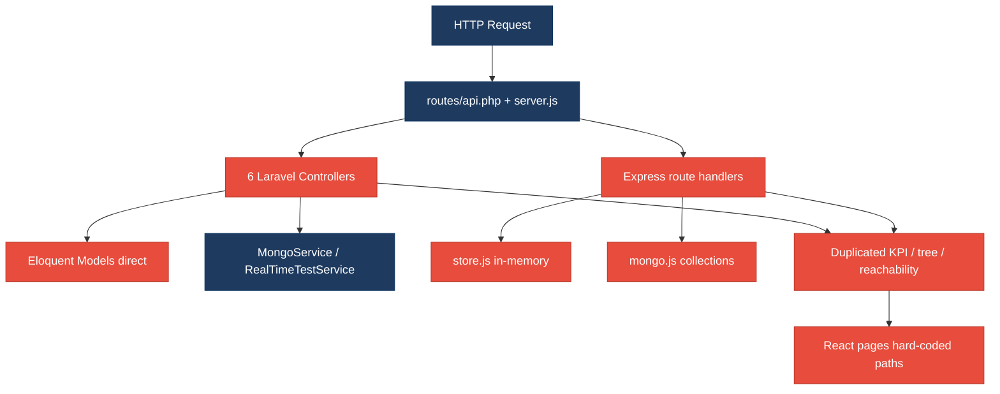
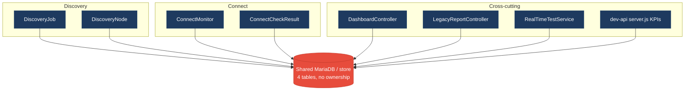
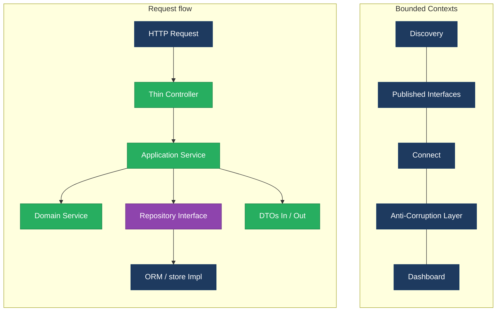
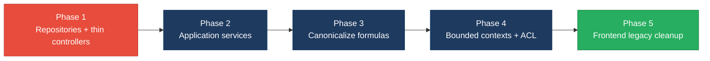

# 1. Architecture & Design Hotspots Analysis

**Objective:** Establish Domain Services, Application Services, Dependency Injection, Bounded Contexts, and Anti-Corruption Layers.

**Date:** 2026-07-24 | **Scope:** `shende-shweta/FSDKC` (main @ `481814f`) — Laravel 12 (PHP 8.3) + Express `dev-api` + React 19 / Vite SPA

## Executive Summary

> **Executive Summary**
>
> Klearcom is a multi-layer monolith (Laravel 12 API, parallel Express `dev-api`, React 19 SPA) with Discovery and Connect modules named in folders but not enforced as bounded contexts — `backend/app/Modules/{Discovery,Connect}` and `frontend/src/modules/*` contain only `AGENTS.md` stubs. The dominant risk is **change amplification from missing repository/service boundaries**: controllers and Express handlers call Eloquent models and an in-memory `store` directly, while KPI/tree/reachability formulas are duplicated across PHP, Node, and the UI. Layers covered: **backend** (Laravel `backend/app` ~25 PHP files + `dev-api/src` 6 JS files) and **frontend** (`frontend/src` ~15 TS/TSX/JSX files). No mobile/CLI layers. Highest-severity hotspots are missing repositories (H3), cross-domain dashboard/legacy coupling (H8/H9), and dual-stack duplicated domain logic (H10). Frontend is comparatively healthier on LOC but still hard-codes API paths in pages and retains legacy class/error-throw patterns (F5).

<div class="metric-grid">
<div class="metric-card"><div class="metric-number">6</div><div class="metric-label">Controllers / Handlers</div></div>
<div class="metric-card"><div class="metric-number">4</div><div class="metric-label">Models / Entities</div></div>
<div class="metric-card"><div class="metric-number">2</div><div class="metric-label">Service Classes Found</div></div>
<div class="metric-card"><div class="metric-number">0</div><div class="metric-label">Repository Classes Found</div></div>
</div>

<div class="overall-rating overall-rating--high-risk"><div class="overall-rating-label">Overall Codebase Rating — Architecture &amp; Design</div><div class="overall-rating-value">High Risk</div><div class="overall-rating-note">Driven by High-Risk Missing Repository Pattern (H3), Direct SQL/ORM in Controllers (H6), Domain Boundary Violations (H8), Shared Database Coupling (H9), and Dual-Stack Duplicated Domain Logic (H10).</div></div>

## 1.1 Benchmark Ratings Summary

| # | Hotspot | Primary KPI | <span class="rating rating-good">Good</span> | <span class="rating rating-moderate">Moderate</span> | <span class="rating rating-high-risk">High Risk</span> | Measured | Rating |
|---|---|---|---|---|---|---|---|
| H1 | Fat Controllers | Avg LOC per controller | <150 | 150–300 | >300 | ~83 LOC (6 Laravel API controllers) | <span class="rating rating-good">Good</span> |
| H2 | Missing Service Layer | Controllers accessing repos/models | <10 | 10–20 | >20 | 16 (4 Laravel + 12 Express handlers on `store`) | <span class="rating rating-moderate">Moderate</span> |
| H3 | Missing Repository Pattern | Direct DB access points | <10 | 10–20 | >20 | ~52 Eloquent/`store` access sites; 0 repositories | <span class="rating rating-high-risk">High Risk</span> |
| H4 | Circular Dependencies | Dependency cycles | 0 | 1–3 | >3 | 0 | <span class="rating rating-good">Good</span> |
| H5 | Shared Utility Abuse | Utility files w/ business logic | 0 | 1–5 | >5 | 2 (`LegacyDataMapper`, `store.js` `buildTree`) | <span class="rating rating-moderate">Moderate</span> |
| H6 | Direct SQL in Controllers | ORM compliance % | >90% | 60–90% | <60% | ~31% of MariaDB access outside controllers | <span class="rating rating-high-risk">High Risk</span> |
| H7 | God Classes | Classes >1000 LOC | 0 | 1–3 | >3 | 0 (largest ~280 LOC `server.js`) | <span class="rating rating-good">Good</span> |
| H8 | Domain Boundary Violations | Cross-domain access points | 0 | 1–5 | >5 | 8+ (Dashboard/Legacy/RealTime/dev-api cross Discovery+Connect) | <span class="rating rating-high-risk">High Risk</span> |
| H9 | Shared Database Coupling | Tables shared across domains | <10% | 10–30% | >30% | 100% of domain tables (4/4) read by cross-cutting code | <span class="rating rating-high-risk">High Risk</span> |
| H10 | Dual-Stack Duplicated Domain Logic (additional) | Duplicate formula/algorithm copies across stacks (Good 0 · Moderate 1–3 · High Risk >3) | 0 | 1–3 | >3 | 8 copies across 3 formula clusters | <span class="rating rating-high-risk">High Risk</span> |
| F1 | Business Logic in Components | Avg LOC per component | <150 | 150–300 | >300 | ~95 LOC across 9 components/pages | <span class="rating rating-good">Good</span> |
| F2 | Missing Frontend Service/Data Layer | Components w/ inline API calls | <10 | 10–20 | >20 | 6 pages/components with hard-coded paths via shared `api` client | <span class="rating rating-good">Good</span> |
| F3 | God / Oversized Components | Components >400 LOC | 0 | 1–3 | >3 | 0 (largest `ConnectPage` ~222 LOC) | <span class="rating rating-good">Good</span> |
| F4 | Prop Drilling / Global State Abuse | Max prop-drilling depth | ≤2 | 3–4 | >4 | ≤2 levels; small Zustand `uiStore` | <span class="rating rating-good">Good</span> |
| F5 | Legacy / Inconsistent Component Patterns | Legacy-pattern components | 0 | 1–10 | >10 | 2 (`LegacyMonitorPoller` class + `LegacyDashboardWidget` throw) | <span class="rating rating-moderate">Moderate</span> |

## 1.2 Hotspot-by-Hotspot Evidence

### H1. Fat Controllers <span class="sev sev-low">Low</span>

**Benchmark:** `Avg LOC per controller = ~83` → falls in the **Good** band (Good <150 · Moderate 150–300 · High Risk >300).

**What to check:** Business logic inside controllers/handlers; controllers should only translate HTTP ↔ application calls.

**Evidence:** Not observed as High Risk — six Laravel API controllers average ~83 LOC (largest `ConnectController` / `DiscoveryController` ~115 LOC). Controllers still hold Eloquent/query logic (see H2/H3/H6), but absolute size is within the Good band.

### H2. Missing Service Layer <span class="sev sev-high">High</span>

**Benchmark:** `Controllers/handlers directly accessing models/store = 16` → falls in the **Moderate** band (Good <10 · Moderate 10–20 · High Risk >20).

**What to check:** Business rules spread across controllers/utilities with no dedicated application-service tier for Discovery/Connect/Dashboard workflows.

**Evidence:** Controllers call Eloquent models directly instead of application services. Only `MongoService` and `RealTimeTestService` exist; CRUD/KPI workflows live in HTTP handlers.

`backend/app/Http/Controllers/Api/DiscoveryController.php:20-38` — create/list jobs via Eloquent in the controller:

```php
public function index(): JsonResponse
{
    $jobs = DiscoveryJob::orderByDesc('created_at')->get();
    return response()->json(['data' => $jobs]);
}

public function store(Request $request): JsonResponse
{
    $validated = $request->validate([/* ... */]);
    $job = DiscoveryJob::create([
        ...$validated,
        'status' => 'pending',
        'languages' => $validated['languages'] ?? ['en'],
    ]);
```

`dev-api/src/server.js:118-145` — Express handlers mutate `store` inline with no service layer:

```javascript
app.get('/api/discovery/jobs', (_req, res) => {
  res.json({ data: store.discoveryJobs });
});

app.post('/api/discovery/jobs', (req, res) => {
  const job = {
    id: store.nextJobId++,
    name: req.body.name,
    // ...
  };
  store.discoveryJobs.unshift(job);
  res.status(201).json({ data: job });
});
```

**Why it matters here:** Adding a CLI, queue worker, or second transport requires copying the same create/list/start logic from both Laravel controllers and `server.js`. Discovery/Connect workflows cannot be unit-tested without HTTP.

**Recommended approach:**
1. Add `DiscoveryApplicationService`, `ConnectApplicationService`, and `DashboardKpiService` under `backend/app/Modules/{Discovery,Connect}` (and mirror ports for `dev-api`).
2. Move `DiscoveryController::store/start/tree` and `ConnectController::checks/runCheck` into those services.
3. Keep controllers as thin JSON adapters that call services via constructor DI.

<!-- affected-files
search: (DiscoveryJob|ConnectMonitor|ConnectCheckResult|DiscoveryNode)::
glob: backend/app/Http/Controllers/**/*.php
issue: Controller bypasses application service — direct Eloquent use
action: Extract workflow into module Application Service; leave controller as HTTP adapter
-->

### H3. Missing Repository Pattern <span class="sev sev-critical">Critical</span>

**Benchmark:** `Direct DB/ORM access points outside repositories = ~52; repositories = 0` → falls in the **High Risk** band (Good <10 · Moderate 10–20 · High Risk >20).

**What to check:** Direct DB/ORM access scattered through controllers and services instead of a repository abstraction.

**Evidence:** Zero repository interfaces/implementations. Eloquent and in-memory store are used from HTTP and domain-ish services alike.

`backend/app/Http/Controllers/Api/ConnectController.php:55-78` — nested Eloquent queries + domain math in controller:

```php
$checks = ConnectCheckResult::where('connect_monitor_id', $id)
    ->orderByDesc('checked_at')
    ->limit(50)
    ->get();

$recentChecks = ConnectCheckResult::where('connect_monitor_id', $id)
    ->orderByDesc('checked_at')
    ->limit(20)
    ->get();

$successRate = $recentChecks->count() > 0
    ? ($recentChecks->where('reachable', true)->count() / $recentChecks->count()) * 100
    : 100;
```

`backend/app/Services/RealTimeTestService.php:140-155` — persistence + reachability update without a repository:

```php
ConnectCheckResult::create([/* ... */]);
$recent = ConnectCheckResult::where('connect_monitor_id', $monitorId)
    ->orderByDesc('checked_at')->limit(20)->get();
$rate = $recent->count() > 0
    ? ($recent->where('reachable', true)->count() / $recent->count()) * 100
    : 100;
$monitor->update([
    'reachability_pct' => round($rate, 2),
    'status' => $rate < 90 ? 'alert' : 'active',
]);
```

**Why it matters here:** Laravel MariaDB and Express in-memory `store` diverge silently. Swapping persistence or writing deterministic unit tests requires touching every controller/handler.

**Recommended approach:**
1. Introduce `DiscoveryJobRepository`, `DiscoveryNodeRepository`, `ConnectMonitorRepository`, `ConnectCheckRepository` interfaces.
2. Implement Eloquent adapters for Laravel and in-memory adapters wrapping `store` for `dev-api`.
3. Route all `::create` / `::where` / `store.*` mutations through repositories.

<!-- affected-files
search: (::(create|where|findOrFail|orderByDesc|count|avg)|store\.(discovery|connect))
glob: {backend/app,dev-api/src}/**/*.{php,js}
issue: Direct persistence access — no repository layer
action: Introduce repository interface + Eloquent/in-memory impl; inject into services
-->

### H4. Circular Dependencies <span class="sev sev-low">Low</span>

**Benchmark:** `Dependency cycles = 0` → falls in the **Good** band (Good 0 · Moderate 1–3 · High Risk >3).

**What to check:** Modules/packages importing each other.

**Evidence:** Not observed — Laravel namespaces are acyclic (`Controllers` → `Models`/`Services`; `Services` → `Models`/`MongoService`). Express modules form a DAG (`server` → `store`/`realtime`/`mongo`). No mutual imports detected.

### H5. Shared Utility Abuse <span class="sev sev-medium">Medium</span>

**Benchmark:** `Utility files holding business logic = 2` → falls in the **Moderate** band (Good 0 · Moderate 1–5 · High Risk >5).

**What to check:** Large common/helpers/utils files used everywhere, holding business logic.

**Evidence:**

`backend/app/Legacy/LegacyDataMapper.php:12-24` — domain report mapping via unsafe `extract()`:

```php
public function mapReportRow(array $row): array
{
    extract($row, EXTR_SKIP);
    return [
        'label' => $name ?? 'Unknown',
        'metric' => $reachability_pct ?? 0,
        'region' => $country_code ?? 'N/A',
        'source' => 'legacy_extract_mapper',
    ];
}
```

`dev-api/src/store.js:95-108` — IVR tree algorithm living in the persistence dump:

```javascript
export function buildTree(nodes, parentId = null) {
  return nodes
    .filter((n) => n.parent_id === parentId)
    .map((n) => ({
      id: n.id,
      prompt_text: n.prompt_text,
      children: buildTree(nodes, n.id),
    }));
}
```

**Why it matters here:** Report-shape and tree-shape rules are owned by “legacy” and “store” dump files, so Discovery domain changes require editing unrelated utilities.

**Recommended approach:**
1. Replace `LegacyDataMapper` with explicit DTOs / Connect report mapper in the Connect module.
2. Move `buildTree` into a shared Discovery domain library (PHP + TS/JS single algorithm source).
3. Keep `store.js` as data only.

<!-- affected-files
search: (extract\(|function buildTree|mapReportRow)
glob: {backend/app/Legacy,dev-api/src}/**/*.{php,js}
issue: Business logic in shared utility / store helper
action: Move mapping/tree logic into Discovery/Connect domain services
-->

### H6. Direct SQL in Controllers <span class="sev sev-critical">Critical</span>

**Benchmark:** `ORM compliance % (queries outside controllers) ≈ 31%` → falls in the **High Risk** band (Good >90% · Moderate 60–90% · High Risk <60%).

**What to check:** Raw queries / ORM access embedded directly in controllers/handlers.

**Evidence:** Majority of MariaDB Eloquent access is in controllers; Express handlers query Mongo collections inline.

`backend/app/Http/Controllers/Api/DashboardController.php:12-35` — KPI aggregation queries in controller:

```php
$discoveryTotal = DiscoveryJob::count();
$discoveryCompleted = DiscoveryJob::where('status', 'completed')->count();
$connectMonitors = ConnectMonitor::count();
$avgReachability = ConnectMonitor::avg('reachability_pct') ?? 0;
$alerts = ConnectMonitor::where('status', 'alert')->count();
```

`dev-api/src/server.js:48-58` — raw Mongo collection query in route handler:

```javascript
app.get('/api/mongodb/diagnostics/:module/:referenceId', async (req, res) => {
  const { getDb } = await import('./mongo.js');
  const data = await getDb()
    .collection('call_diagnostics')
    .find({ module: req.params.module, reference_id: Number(req.params.referenceId) })
    .sort({ created_at: -1 })
    .limit(10)
    .toArray();
```

**Why it matters here:** Schema renames (e.g. `reachability_pct`, `call_diagnostics`) force coordinated edits across Laravel controllers and Express routes; no single persistence boundary exists.

**Recommended approach:**
1. Move all Eloquent queries out of `*Controller` into repositories (H3).
2. Move Mongo collection access fully behind `MongoService` / a diagnostics repository (remove inline `getDb()` in `server.js`).
3. Controllers may only call services.

<!-- affected-files
search: (::(count|where|avg|orderByDesc|create|findOrFail)|collection\()
glob: {backend/app/Http/Controllers,dev-api/src/server.js}/**/*
issue: Persistence queries in HTTP layer
action: Relocate queries to repositories/adapters; keep handlers thin
-->

### H7. God Classes <span class="sev sev-low">Low</span>

**Benchmark:** `Classes/files >1000 LOC = 0` → falls in the **Good** band (Good 0 · Moderate 1–3 · High Risk >3).

**What to check:** Single classes/files handling many unrelated responsibilities at extreme size.

**Evidence:** Not observed — largest file is `dev-api/src/server.js` (~280 LOC) which is a multi-route handler but under the 1000 LOC threshold. No PHP class exceeds ~200 LOC.

### H8. Domain Boundary Violations <span class="sev sev-critical">Critical</span>

**Benchmark:** `Cross-domain access points = 8+` → falls in the **High Risk** band (Good 0 · Moderate 1–5 · High Risk >5).

**What to check:** Code in one business area directly reading/writing another area's data or models; module folders without enforcement.

**Evidence:** Module packages are stubs (`AGENTS.md` only). Dashboard, Legacy, RealTime, and Express KPI routes freely touch both Discovery and Connect models.

`backend/app/Http/Controllers/Api/DashboardController.php:12-40` — Dashboard owns both domains' tables:

```php
$discoveryTotal = DiscoveryJob::count();
// ...
$avgReachability = ConnectMonitor::avg('reachability_pct') ?? 0;
'active_discovery_jobs' => DiscoveryJob::where('status', 'running')->count(),
'active_connect_monitors' => ConnectMonitor::where('status', 'active')->count(),
```

`backend/app/Http/Controllers/Api/LegacyReportController.php:70-95` — Legacy report builds Discovery trees and Connect carrier rows in one controller:

```php
public function ivrDepthReport(int $jobId): JsonResponse
{
    $job = DiscoveryJob::findOrFail($jobId);
    $nodes = DiscoveryNode::where('discovery_job_id', $jobId)->get();
    $tree = $this->buildTree($nodes);
```

**Why it matters here:** A Connect schema change breaks Dashboard KPIs and Legacy carrier reports without any published interface. Module folders give a false sense of isolation.

**Recommended approach:**
1. Populate `Modules/Discovery` and `Modules/Connect` with real services + published read models.
2. Dashboard consumes `DiscoveryKpiPort` / `ConnectKpiPort` only.
3. Delete or ACL-wrap `LegacyReportController` so it cannot import both model sets.

<!-- affected-files
search: (use App\\Models\\(Discovery|Connect)|store\.(discovery|connect))
glob: {backend/app/Http/Controllers/Api/{Dashboard,LegacyReport}Controller.php,backend/app/Services/RealTimeTestService.php,dev-api/src/server.js}
issue: Cross-domain model access without published interface
action: Introduce bounded-context ports; dashboard/legacy consume ACL/read models only
-->

### H9. Shared Database Coupling <span class="sev sev-critical">Critical</span>

**Benchmark:** `Tables shared across domains = 100% (4/4)` → falls in the **High Risk** band (Good <10% · Moderate 10–30% · High Risk >30%).

**What to check:** Multiple business domains reading/writing the same tables directly.

**Evidence:** Four domain tables (`discovery_jobs`, `discovery_nodes`, `connect_monitors`, `connect_check_results`) are all read by at least one cross-cutting surface (Dashboard, Legacy, RealTimeTestService, or Express dashboard).

Cross-cutting readers:
- `DashboardController` → DiscoveryJob + ConnectMonitor
- `LegacyReportController` → all four model types
- `RealTimeTestService` → all four model types
- `dev-api/src/server.js` dashboard KPIs → `store.discoveryJobs` + `store.connectMonitors`

**Why it matters here:** There is no table ownership. A Discovery migration that renames `status` values breaks Dashboard KPIs and Express KPI parity at once.

**Recommended approach:**
1. Declare ownership: Discovery owns jobs/nodes; Connect owns monitors/checks.
2. Cross-context reads only via application APIs or ACL-projected DTOs.
3. Stop importing foreign Eloquent models outside owning modules.

<!-- affected-files
search: (DiscoveryJob|DiscoveryNode|ConnectMonitor|ConnectCheckResult|store\.(discoveryJobs|connectMonitors))
glob: {backend/app,dev-api/src}/**/*.{php,js}
issue: Shared table access across domains
action: Enforce table ownership; replace cross-domain Eloquent with published APIs/ACL
-->

### H10. Dual-Stack Duplicated Domain Logic (additional) <span class="sev sev-critical">Critical</span>

**Benchmark:** `Duplicate formula/algorithm copies = 8 across 3 clusters` → falls in the **High Risk** band (Good 0 · Moderate 1–3 · High Risk >3). KPI thresholds: Good 0 · Moderate 1–3 · High Risk >3 copies of the same domain formula across stacks.

**What to check:** Same business formula implemented independently in Laravel, Express, and/or frontend.

**Evidence — three formula clusters, eight copies:**

1. **IVR `buildTree`** (3): `DiscoveryController`, `LegacyReportController`, `store.js`
2. **Reachability % / alert threshold `< 90`** (3): `ConnectController::checks`, `RealTimeTestService::runConnectTest`, `realtime.js` `runConnectTest`
3. **Dashboard KPI availability math + hard-coded 94.2 / 97.8** (2): `DashboardController`, `server.js` `/api/dashboard/kpis`

`backend/app/Http/Controllers/Api/ConnectController.php:70-78` vs `dev-api/src/realtime.js:175-185`:

```php
$successRate = $recentChecks->count() > 0
    ? ($recentChecks->where('reachable', true)->count() / $recentChecks->count()) * 100
    : 100;
$computedStatus = $successRate < 90 ? 'alert' : 'active';
```

```javascript
const successRate = recent.length > 0
  ? (recent.filter((c) => c.reachable).length / recent.length) * 100
  : 100;
monitor.status = successRate < 90 ? 'alert' : 'active';
```

**Why it matters here:** Changing the alert threshold or KPI definition requires coordinated edits in PHP and Node; drift already exists in step lists between `RealTimeTestService` and `realtime.js`.

**Recommended approach:**
1. Canonicalize formulas in one domain package (PHP as source of truth for Laravel; shared JSON/spec or isomorphic TS for FE/dev-api).
2. Delete duplicate `buildTree` and reachability blocks.
3. Serve KPIs from one backend only; remove hard-coded rates or compute them once.

<!-- affected-files
search: (buildTree|reachability|successRate|ivr_availability_pct|94\.2|97\.8)
glob: {backend/app,dev-api/src,frontend/src}/**/*.{php,js,tsx,ts}
issue: Duplicated domain formulas across Laravel/Express/UI
action: Canonicalize algorithm; delete duplicate copies; single API for KPIs
-->

### F1. Business Logic in Components <span class="sev sev-low">Low</span>

**Benchmark:** `Avg LOC per component ≈ 95` → falls in the **Good** band (Good <150 · Moderate 150–300 · High Risk >300).

**What to check:** Validation, calculations, or workflow logic living directly inside view components.

**Evidence:** Not observed at High Risk — pages are mostly presentation + React Query wiring. Measured avg across 9 page/component files ≈ 95 LOC (ConnectPage ~222, DiscoveryPage ~180, DashboardPage ~95, others smaller). Domain math stays on the backend (duplicated there — H10).

### F2. Missing Frontend Service/Data Layer <span class="sev sev-low">Low</span>

**Benchmark:** `Components with inline API path calls = 6` → falls in the **Good** band (Good <10 · Moderate 10–20 · High Risk >20).

**What to check:** `fetch`/HTTP calls and API URLs hard-coded inline in components instead of a shared client/service layer.

**Evidence:** A shared `api` client exists (`frontend/src/api/client.ts`), so raw `fetch` is not scattered. Six consumers still hard-code path strings:

- `DashboardPage.tsx` → `'/dashboard/kpis'`
- `DiscoveryPage.tsx` → `'/discovery/jobs'`, tree, transcripts
- `ConnectPage.tsx` → monitors/checks/transcripts
- `LegacyDashboardWidget.tsx` → three endpoints
- `LegacyMonitorPoller.jsx` → checks poll
- `useRealtimeTest.ts` → stream/start paths

`frontend/src/pages/DiscoveryPage.tsx:18-30`:

```tsx
const jobsQuery = useQuery({
  queryKey: ['discovery', 'jobs'],
  queryFn: () => api.get<{ data: DiscoveryJob[] }>('/discovery/jobs'),
});
```

Within Good band due to shared client; recommend typed resource modules (`discoveryApi.listJobs()`) as hygiene.

<!-- affected-files
search: api\.(get|post)\(
glob: frontend/src/**/*.{tsx,ts,jsx,js}
issue: Hard-coded API paths in pages/components
action: Add typed resource modules on top of api client; pages call modules only
-->

### F3. God / Oversized Components <span class="sev sev-low">Low</span>

**Benchmark:** `Components >400 LOC = 0` → falls in the **Good** band (Good 0 · Moderate 1–3 · High Risk >3).

**What to check:** Single components handling many unrelated responsibilities at extreme size.

**Evidence:** Not observed — largest is `ConnectPage.tsx` (~222 LOC) combining form, list, checks, and transcripts but under 400 LOC.

### F4. Prop Drilling / Global State Abuse <span class="sev sev-low">Low</span>

**Benchmark:** `Max prop-drilling depth ≤ 2; uiStore is small` → falls in the **Good** band (Good ≤2 · Moderate 3–4 · High Risk >4).

**What to check:** Props threaded through many intermediate layers, or one giant global store.

**Evidence:** Not observed — `frontend/src/store/uiStore.ts` holds only selected Discovery/Connect IDs; components receive shallow props (`LiveTestFeed`, `IvrTree`). No deep drilling.

### F5. Legacy / Inconsistent Component Patterns <span class="sev sev-medium">Medium</span>

**Benchmark:** `Legacy-pattern components = 2` → falls in the **Moderate** band (Good 0 · Moderate 1–10 · High Risk >10).

**What to check:** Mixed paradigms, missing error boundaries, deprecated lifecycle/APIs, inconsistent conventions.

**Evidence:**

`frontend/src/components/LegacyMonitorPoller.jsx:20-35` — class component with intentional missing unmount cleanup (interval leak):

```jsx
export default class LegacyMonitorPoller extends Component {
  componentDidMount() {
    this.intervalId = setInterval(() => {
      api.get(`/connect/monitors/${this.props.monitorId}/checks`)
        .then(/* ... */);
    }, 3000);
    // Intentionally no componentWillUnmount — interval leak
  }
}
```

`frontend/src/pages/LegacyDashboardWidget.tsx:48-50` — throw without ErrorBoundary:

```tsx
if (loading) return <div className="empty">Loading legacy widget…</div>;
if (error) throw new Error(error); // Uncaught — no Error Boundary wraps this component
```

**Why it matters here:** Mixed class/function and throw-on-error patterns will crash the SPA and leak intervals as more legacy widgets are added.

**Recommended approach:**
1. Rewrite `LegacyMonitorPoller` as a hook (`useMonitorPoll`) with cleanup.
2. Add a React ErrorBoundary around dashboard widgets; replace `throw` with inline error UI.
3. Standardize on function components + TSX only (retire `.jsx` class components).

<!-- affected-files
search: (extends Component|throw new Error|componentDidMount)
glob: frontend/src/**/*.{tsx,jsx,ts,js}
issue: Legacy class / uncaught throw patterns
action: Migrate to hooks; add ErrorBoundary; unify TSX conventions
-->

## 1.3 Diagrams

### Current-state architecture (as-is)


### Clean reference path (target pattern found in codebase)


### Domain boundary map (business domains found vs. shared data)


### Target architecture (proposed)


### Improvement roadmap


## 1.4 Actions Required

| Hotspot | Action | Rating | Priority |
|---|---|---|---|
| H2 Missing Service Layer | Add Discovery/Connect/Dashboard application services; stop Eloquent/`store` use from controllers/handlers | <span class="rating rating-moderate">Moderate</span> | <span class="sev sev-high">High</span> |
| H3 Missing Repository Pattern | Introduce repository interfaces + Eloquent/in-memory implementations; route all persistence through them | <span class="rating rating-high-risk">High Risk</span> | <span class="sev sev-critical">Critical</span> |
| H5 Shared Utility Abuse | Replace `LegacyDataMapper` extract mapping; move `buildTree` out of `store.js` into Discovery domain | <span class="rating rating-moderate">Moderate</span> | <span class="sev sev-medium">Medium</span> |
| H6 Direct SQL in Controllers | Move Eloquent/Mongo queries out of HTTP layer into repositories/adapters | <span class="rating rating-high-risk">High Risk</span> | <span class="sev sev-critical">Critical</span> |
| H8 Domain Boundary Violations | Enforce real module packages; dashboard/legacy consume published interfaces only | <span class="rating rating-high-risk">High Risk</span> | <span class="sev sev-critical">Critical</span> |
| H9 Shared Database Coupling | Declare table ownership; cross-context access via APIs/ACL, not shared Eloquent models | <span class="rating rating-high-risk">High Risk</span> | <span class="sev sev-critical">Critical</span> |
| H10 Dual-Stack Duplicated Domain Logic | Canonicalize reachability/tree/KPI formulas; delete PHP/Node duplicate copies | <span class="rating rating-high-risk">High Risk</span> | <span class="sev sev-critical">Critical</span> |
| F5 Legacy / Inconsistent Component Patterns | Migrate class poller to hooks; add ErrorBoundary; unify TSX conventions | <span class="rating rating-moderate">Moderate</span> | <span class="sev sev-medium">Medium</span> |

## 1.5 Expected Outcomes

- Controllers and Express handlers become thin adapters; Discovery/Connect workflows are testable via application services without HTTP.
- Persistence is swappable (Eloquent ↔ in-memory ↔ alternate DB) behind repositories, enabling deterministic unit tests.
- Bounded contexts stop silent cross-domain breakage when Connect or Discovery schemas change.
- Single-source domain formulas eliminate Laravel vs `dev-api` drift on KPIs and reachability alerts.
- Frontend legacy patterns and missing boundaries stop uncaught UI failures and interval leaks as modules grow.
