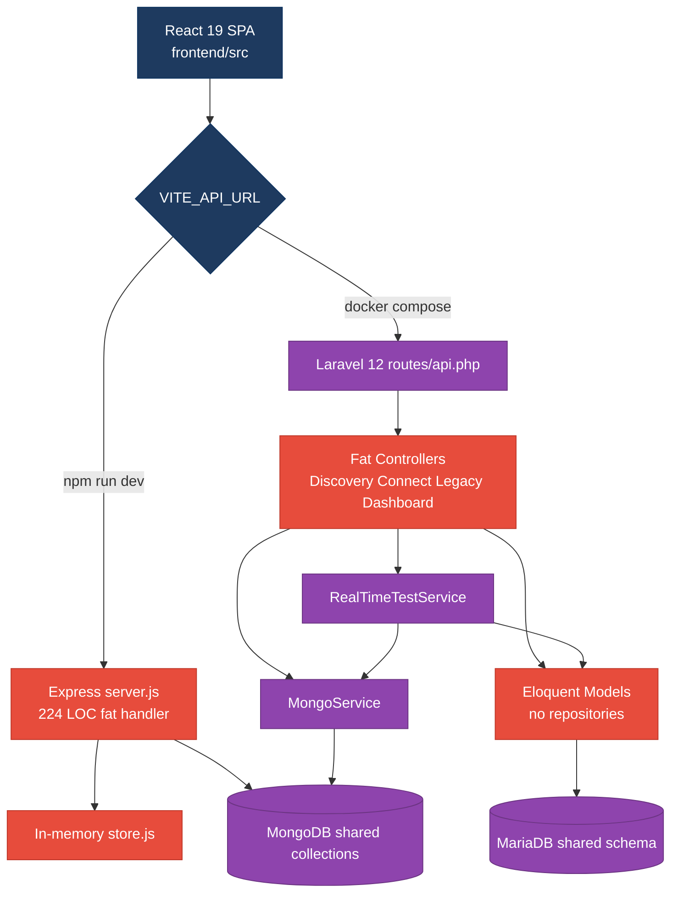
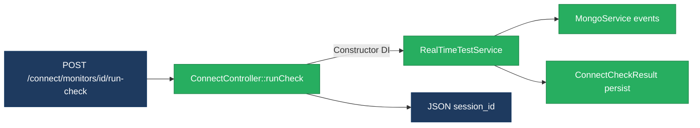
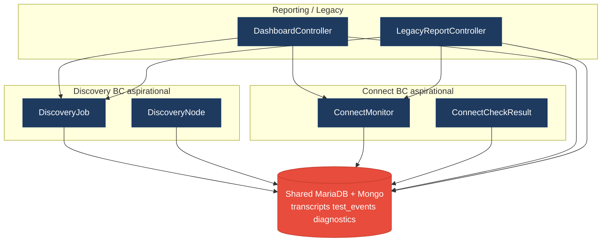
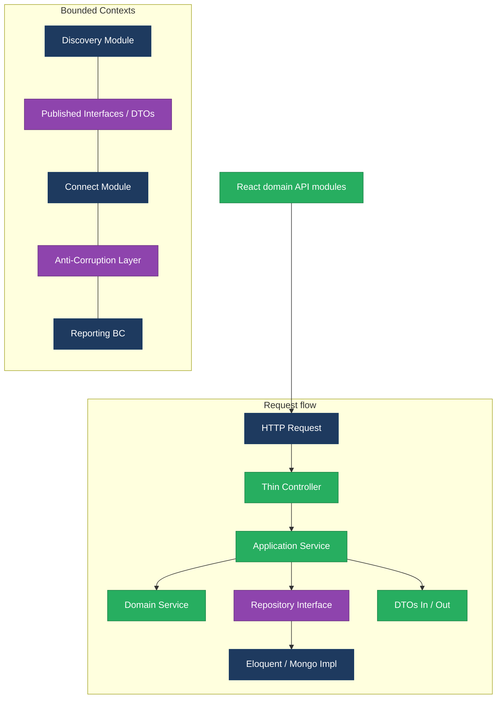
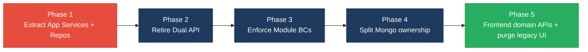

# 1. Architecture & Design Hotspots Analysis

**Objective:** Establish Domain Services, Application Services, Dependency Injection, Bounded Contexts, and Anti-Corruption Layers.

**Date:** 2026-07-24 | **Scope:** `shende-shweta/FSDKC` (main) — PHP 8.3 / Laravel 12 backend · React 19 / TypeScript / Vite frontend · Node/Express `dev-api` · MariaDB + MongoDB

## Executive Summary

> **Executive Summary**
>
> Klearcom is a modular monolith (Discovery IVR + Connect TFN) with a thin Laravel 12 API, a React 19 SPA, and a parallel Express `dev-api` that re-implements the same workflows. Controllers are short by LOC but fat by responsibility: Eloquent and KPI math live in HTTP handlers, Modules folders are documentation stubs only, and there are zero repository classes. The dominant risk is change amplification from duplicated business logic across Laravel, Express, and the SPA, plus shared Mongo collections and cross-domain dashboard/legacy reports that erase bounded-context ownership. Frontend has a usable `api/client` and React Query, but legacy class/widget patterns and hard-coded endpoint strings in pages still couple UI to backend shapes.

<div class="metric-grid">
<div class="metric-card"><div class="metric-number">7</div><div class="metric-label">Controllers / Handlers</div></div>
<div class="metric-card"><div class="metric-number">4</div><div class="metric-label">Models / Entities</div></div>
<div class="metric-card"><div class="metric-number">2</div><div class="metric-label">Service Classes Found</div></div>
<div class="metric-card"><div class="metric-number">0</div><div class="metric-label">Repository Classes Found</div></div>
</div>

**Layers covered:** Backend Laravel (`backend/app/**`, 6 API controllers + 2 services + 4 models + Legacy mapper) · Frontend React (`frontend/src/**`, 9 page/component files + api/hooks/store) · Dev API Express (`dev-api/src/**`, 6 modules). File counts analyzed: ~18 backend PHP application files, ~15 frontend TS/TSX/JSX source files, ~6 Node API source files.

<div class="overall-rating overall-rating--high-risk"><div class="overall-rating-label">Overall Codebase Rating — Architecture &amp; Design</div><div class="overall-rating-value">High Risk</div><div class="overall-rating-note">Driven by High-Risk Missing Service/Repository layers (H2/H3), Domain Boundary Violations (H8), Shared DB Coupling (H9), and Dual-API duplication (H10).</div></div>

## 1.1 Benchmark Ratings Summary

| # | Hotspot | Primary KPI | <span class="rating rating-good">Good</span> | <span class="rating rating-moderate">Moderate</span> | <span class="rating rating-high-risk">High Risk</span> | Measured | Rating |
|---|---|---|---|---|---|---|---|
| H1 | Fat Controllers | Avg LOC per controller | <150 | 150–300 | >300 | 62 LOC (Laravel avg); Express `server.js` 224 LOC | <span class="rating rating-moderate">Moderate</span> |
| H2 | Missing Service Layer | Controllers accessing repos/models | <10 | 10–20 | >20 | 25 handler methods with direct model/store access | <span class="rating rating-high-risk">High Risk</span> |
| H3 | Missing Repository Pattern | Direct DB access points | <10 | 10–20 | >20 | 35+ Eloquent/store/Mongo access points; 0 repositories | <span class="rating rating-high-risk">High Risk</span> |
| H4 | Circular Dependencies | Dependency cycles | 0 | 1–3 | >3 | 0 | <span class="rating rating-good">Good</span> |
| H5 | Shared Utility Abuse | Utility files w/ business logic | 0 | 1–5 | >5 | 2 (`LegacyDataMapper`, shared `buildTree` helpers) | <span class="rating rating-moderate">Moderate</span> |
| H6 | Direct SQL in Controllers | ORM/repository compliance % | >90% | 60–90% | <60% | ~38% of queries outside controllers | <span class="rating rating-high-risk">High Risk</span> |
| H7 | God Classes | Classes >1000 LOC | 0 | 1–3 | >3 | 0 (largest `server.js` 224 LOC) | <span class="rating rating-good">Good</span> |
| H8 | Domain Boundary Violations | Cross-domain access points | 0 | 1–5 | >5 | 8 cross-domain access points | <span class="rating rating-high-risk">High Risk</span> |
| H9 | Shared Database Coupling | Tables shared across domains | <10% | 10–30% | >30% | 37.5% (3/8 stores shared via Mongo `module`) | <span class="rating rating-high-risk">High Risk</span> |
| H10 | Dual API Duplication (additional) | Duplicated workflows across Laravel ↔ Express | 0 | 1–3 | >3 | 5+ workflows duplicated | <span class="rating rating-high-risk">High Risk</span> |
| F1 | Business Logic in Components | Avg LOC per component | <150 | 150–300 | >300 | 74 LOC avg | <span class="rating rating-good">Good</span> |
| F2 | Missing Frontend Service/Data Layer | Components w/ inline API calls | <10 | 10–20 | >20 | 6 components with hard-coded paths | <span class="rating rating-good">Good</span> |
| F3 | God / Oversized Components | Components >400 LOC | 0 | 1–3 | >3 | 0 (largest ConnectPage 208 LOC) | <span class="rating rating-good">Good</span> |
| F4 | Prop Drilling / Global State Abuse | Max prop-drilling depth | ≤2 | 3–4 | >4 | 2 levels; small Zustand UI store | <span class="rating rating-good">Good</span> |
| F5 | Legacy / Inconsistent Component Patterns | Legacy-pattern components | 0 | 1–10 | >10 | 2 (`LegacyMonitorPoller`, `LegacyDashboardWidget`) | <span class="rating rating-moderate">Moderate</span> |

**H10 KPI thresholds (additional):** duplicated domain workflows across parallel stacks — Good = 0 · Moderate = 1–3 · High Risk = >3.

## 1.2 Hotspot-by-Hotspot Evidence

### H1. Fat Controllers <span class="sev sev-high">High</span>

**Benchmark:** `Avg LOC per controller = 62 (Laravel)` · worst file `dev-api/src/server.js = 224 LOC` → falls in the **Moderate** band (Good <150 · Moderate 150–300 · High Risk >300; worst-wins via Express handler size + business logic density).

**What to check:** Business logic inside controllers/handlers — validation, KPI math, tree building, reachability formulas — instead of Application/Domain Services.

**Evidence:** Six Laravel API controllers average ~62 LOC, but several embed domain rules. Express packs the entire HTTP surface into one file.

`backend/app/Http/Controllers/Api/ConnectController.php:65-88` — reachability KPI computed inside the handler:

```php
$recentChecks = ConnectCheckResult::where('connect_monitor_id', $id)
    ->orderByDesc('checked_at')
    ->limit(20)
    ->get();

$successRate = $recentChecks->count() > 0
    ? ($recentChecks->where('reachable', true)->count() / $recentChecks->count()) * 100
    : 100;

$computedStatus = $successRate < 90 ? 'alert' : 'active';
```

This qualifies because alert thresholds and success-rate math are domain rules, not HTTP mapping.

`backend/app/Http/Controllers/Api/LegacyReportController.php:1-20` — explicitly documents itself as a fat controller and owns carrier filtering, KPI math, and tree building:

```php
/**
 * Fat controller — business logic, DB queries, and KPI math live here (anti-pattern).
 */
class LegacyReportController extends Controller
{
    public function carrierSummary(Request $request): JsonResponse
    {
        $filters = $request->all();
        extract($filters);
```

`dev-api/src/server.js` (224 LOC) — every Discovery/Connect/Dashboard route, SSE streaming, and KPI aggregation live in one Express handler module (duplicate of Laravel controllers).

**Why it matters here:** Reachability logic is already duplicated in `RealTimeTestService` and `dev-api/src/realtime.js`. Changing the 90% alert threshold requires coordinated edits across Laravel controllers, Laravel services, and Express — the first regression will be inconsistent dashboard vs. check-history status.

**Recommended approach:**
1. Extract `ReachabilityCalculator` / `ConnectApplicationService` from `ConnectController::checks` and `RealTimeTestService::runConnectTest`.
2. Move `buildTree` + IVR depth stats from `DiscoveryController` / `LegacyReportController` into a `DiscoveryTreeService`.
3. Split `dev-api/src/server.js` into route modules that call shared application services (or retire Express once Laravel is the single API).

<!-- affected-files
search: (ConnectMonitor::|DiscoveryJob::|ConnectCheckResult::|DiscoveryNode::|extract\(|buildTree|reachability|successRate)
glob: backend/app/Http/Controllers/**/*.php
issue: Fat controller / business logic in HTTP layer
action: Extract Application/Domain Services; keep controllers as HTTP adapters
-->

<!-- affected-files
search: app\.(get|post)\('/api/
glob: dev-api/src/server.js
issue: Monolithic Express handler with domain logic
action: Split routes; delegate to application services aligned with Laravel
-->

### H2. Missing Service Layer <span class="sev sev-critical">Critical</span>

**Benchmark:** `Controllers/handlers directly accessing models/store = 25` → falls in the **High Risk** band (Good <10 · Moderate 10–20 · High Risk >20).

**What to check:** Business rules spread across controllers/utilities with no dedicated application-service tier reusable from HTTP, CLI, and jobs.

**Evidence:** Only two services exist (`MongoService`, `RealTimeTestService`); CRUD and reporting bypass them.

`backend/app/Http/Controllers/Api/DashboardController.php:12-36` — KPI workflow entirely in the controller with direct Eloquent:

```php
public function kpis(): JsonResponse
{
    $discoveryTotal = DiscoveryJob::count();
    $discoveryCompleted = DiscoveryJob::where('status', 'completed')->count();
    $connectMonitors = ConnectMonitor::count();
    $avgReachability = ConnectMonitor::avg('reachability_pct') ?? 0;
    $alerts = ConnectMonitor::where('status', 'alert')->count();
```

`backend/app/Http/Controllers/Api/DiscoveryController.php:24-45` — create-job workflow is controller-owned:

```php
$job = DiscoveryJob::create([
    ...$validated,
    'status' => 'pending',
    'languages' => $validated['languages'] ?? ['en'],
]);
```

`dev-api/src/server.js` dashboard + discovery POST handlers mutate `store` arrays inline (same workflows, second stack). Across both stacks, **25** handler methods touch models/store directly (13 Laravel + 12 Express).

**Why it matters here:** `npm run dev` runs Express while Docker runs Laravel — the same UI hits different service implementations. Without an Application Service contract, CLI seeders, SSE jobs, and HTTP will keep drifting.

**Recommended approach:**
1. Introduce `DashboardKpiService`, `DiscoveryJobService`, `ConnectMonitorService`.
2. Thin controllers to validate → service → JSON resource.
3. Point Express (if kept) at the same service contracts via HTTP to Laravel or a shared package.

<!-- affected-files
search: (DiscoveryJob::|ConnectMonitor::|ConnectCheckResult::|DiscoveryNode::)
glob: backend/app/Http/Controllers/**/*.php
issue: Controller bypasses Application Service layer
action: Move workflows into Application Services; inject via constructor DI
-->

<!-- affected-files
search: store\.(discoveryJobs|connectMonitors|connectChecks|discoveryNodes)
glob: dev-api/src/**/*.js
issue: Express handlers mutate in-memory store directly
action: Introduce service layer mirroring Laravel application services
-->

### H3. Missing Repository Pattern <span class="sev sev-critical">Critical</span>

**Benchmark:** `Direct DB/ORM access points outside repositories = 35+; Repository classes = 0` → falls in the **High Risk** band (Good <10 · Moderate 10–20 · High Risk >20).

**What to check:** Direct Eloquent / collection / in-memory store access scattered through controllers and services with no repository abstraction.

**Evidence:** No `*Repository` classes under `backend/app`. Models are queried from controllers and `RealTimeTestService`. Mongo access is concentrated in `MongoService` (closest thing to a repository) but Eloquent has no counterpart.

`backend/app/Services/RealTimeTestService.php:100-120` — persistence mixed into test orchestration:

```php
ConnectCheckResult::create([
    'connect_monitor_id' => $monitorId,
    'reachable' => $reachable,
    'latency_ms' => $latency,
    ...
]);

$recent = ConnectCheckResult::where('connect_monitor_id', $monitorId)
    ->orderByDesc('checked_at')->limit(20)->get();
```

`backend/app/Http/Controllers/Api/LegacyReportController.php:28-45` — nested Eloquent loops (N+1 style) in the controller:

```php
foreach ($monitors as $monitor) {
    $recent = ConnectCheckResult::where('connect_monitor_id', $monitor->id)
        ->orderByDesc('checked_at')
        ->limit(20)
        ->get();
```

**Why it matters here:** Schema lives in manual `docker/mariadb/init.sql`. Without repositories, swapping in-memory `dev-api` store for MariaDB (or testing without DB) requires rewriting every controller and service call site.

**Recommended approach:**
1. Add `DiscoveryJobRepository`, `ConnectMonitorRepository`, `ConnectCheckResultRepository` interfaces + Eloquent implementations.
2. Keep `MongoService` as the Mongo repository (or rename to `TranscriptRepository` / `TestEventRepository`).
3. Bind interfaces in `AppServiceProvider`.

<!-- affected-files
search: (::create\(|::where\(|::findOrFail\(|::orderByDesc\(|::count\(|::avg\()
glob: backend/app/**/*.php
issue: Direct Eloquent access; no Repository layer
action: Introduce repository interfaces and move all Eloquent behind them
-->

### H4. Circular Dependencies <span class="sev sev-low">Low</span>

**Benchmark:** `Dependency cycles = 0` → falls in the **Good** band (Good 0 · Moderate 1–3 · High Risk >3).

**What to check:** Modules/packages importing each other in a cycle.

**Evidence:** Not observed — `backend/app/Modules/Discovery` and `Modules/Connect` contain only `AGENTS.md` (no PHP packages to cycle). Laravel controllers → services → models is a one-way graph. Frontend imports are acyclic (pages → components/hooks/api).

### H5. Shared Utility Abuse <span class="sev sev-medium">Medium</span>

**Benchmark:** `Utility files holding business logic = 2` → falls in the **Moderate** band (Good 0 · Moderate 1–5 · High Risk >5).

**What to check:** Large common/helpers/utils holding business logic used everywhere.

**Evidence:**

`backend/app/Legacy/LegacyDataMapper.php:10-24` — domain report shaping via unsafe `extract()`:

```php
public function mapReportRow(array $row): array
{
    extract($row, EXTR_SKIP);

    return [
        'label' => $name ?? 'Unknown',
        'metric' => $reachability_pct ?? 0,
        'region' => $country_code ?? 'N/A',
        'source' => 'legacy_extract_mapper',
    ];
}
```

`buildTree` is copy-pasted in `DiscoveryController`, `LegacyReportController`, and `dev-api/src/store.js` — a shared “utility” of domain tree logic with no single owner.

**Why it matters here:** `LegacyReportController` instantiates `new LegacyDataMapper()` (no DI). Tree shape changes for the SPA `IvrTree` require three backend edits plus the Express store.

**Recommended approach:** Replace `LegacyDataMapper` with typed DTOs; centralize `IvrTreeBuilder` as a Discovery domain service; delete duplicate methods.

<!-- affected-files
search: (extract\(|function buildTree|LegacyDataMapper)
glob: backend/app/**/*.{php}
issue: Shared/legacy utility holding domain mapping logic
action: Move to domain-specific services/DTOs; remove extract()
-->

<!-- affected-files
search: export function buildTree
glob: dev-api/src/**/*.js
issue: Shared buildTree utility duplicates Discovery domain logic
action: Align with single Discovery tree service / shared contract
-->

### H6. Direct SQL in Controllers <span class="sev sev-critical">Critical</span>

**Benchmark:** `ORM/repository compliance ≈ 38%` (queries kept out of controllers) → falls in the **High Risk** band (Good >90% · Moderate 60–90% · High Risk <60%). No raw SQL strings observed; Eloquent/Mongo/in-memory access still sits in handlers.

**What to check:** Raw queries or ORM calls embedded in controllers/handlers instead of repositories.

**Evidence:** Controllers issue the majority of Eloquent queries. Example from `ConnectController::index/store/show/checks` — all direct model access. `DashboardController` issues 6+ aggregate queries. Express `server.js` diagnostics route hits Mongo collections inline:

```javascript
const data = await getDb()
  .collection('call_diagnostics')
  .find({ module: req.params.module, reference_id: Number(req.params.referenceId) })
```

Counted ~40 distinct query call sites; ~15 live in `MongoService`/`RealTimeTestService` → ~38% compliance.

**Why it matters here:** Manual schema in `init.sql` means column renames (e.g. `reachability_pct`) touch every controller query site and the Express store shape simultaneously.

**Recommended approach:** Move all reads/writes behind repositories; ban Eloquent facades in `Http/Controllers` via PHPCS/PHPStan rules.

<!-- affected-files
search: (DB::|::where\(|::create\(|::findOrFail\(|::orderByDesc\(|collection\()
glob: backend/app/Http/Controllers/**/*.php
issue: Persistence calls in controllers (low repository compliance)
action: Relocate queries to repositories; controllers consume services only
-->

<!-- affected-files
search: (store\.|getDb\(\)|collection\()
glob: dev-api/src/server.js
issue: Direct store/Mongo access in Express routes
action: Encapsulate behind repository/data-access modules
-->

### H7. God Classes <span class="sev sev-low">Low</span>

**Benchmark:** `Classes/files >1000 LOC = 0` → falls in the **Good** band (Good 0 · Moderate 1–3 · High Risk >3).

**What to check:** Single classes/files handling many unrelated responsibilities at extreme size.

**Evidence:** Not observed — largest application files are `dev-api/src/server.js` (224 LOC), `MongoService` (132 LOC), `ConnectPage` (208 LOC). Size is healthy; cohesion issues are covered under H1/H2/H10 rather than raw LOC.

### H8. Domain Boundary Violations <span class="sev sev-critical">Critical</span>

**Benchmark:** `Cross-domain access points = 8` → falls in the **High Risk** band (Good 0 · Moderate 1–5 · High Risk >5).

**What to check:** Code in one business area directly reading/writing another area's data or models; empty module boundaries.

**Evidence:** Declared modules exist but hold no code:

- `backend/app/Modules/Discovery/AGENTS.md` only
- `backend/app/Modules/Connect/AGENTS.md` only
- Same pattern under `frontend/src/modules/*`

Cross-domain access points measured:
1. `DashboardController` → `DiscoveryJob` + `ConnectMonitor`
2. `LegacyReportController` → Connect + Discovery models
3. `RealTimeTestService` → both domains
4. `MongoService` → shared collections keyed by `module` string
5. `LegacyDashboardWidget` → `/discovery/jobs` + `/connect/monitors` + KPIs
6. Express `server.js` dashboard KPI mixes both stores
7. `StreamController` shared SSE for both domains
8. Frontend pages share one `api/client` with no module ACL

`backend/app/Http/Controllers/Api/DashboardController.php` mixes Discovery and Connect aggregates in one response. `LegacyReportController` owns both carrier (Connect) and IVR depth (Discovery) reports.

**Why it matters here:** The README presents Discovery and Connect as extractable modules, but runtime code has no ownership boundary — extracting Connect would drag Dashboard, Legacy reports, Mongo helpers, and RealTimeTestService with it.

**Recommended approach:**
1. Move controllers/services/models under real `Modules/Discovery` and `Modules/Connect` namespaces.
2. Dashboard becomes a separate Reporting context that consumes published read models/DTOs only.
3. Add Anti-Corruption mapping for legacy report endpoints.

<!-- affected-files
search: (DiscoveryJob|ConnectMonitor|DiscoveryNode|ConnectCheckResult)
glob: backend/app/Http/Controllers/Api/{Dashboard,LegacyReport}Controller.php
issue: Cross-domain model access outside owning context
action: Introduce Reporting BC + published interfaces; stop direct foreign-model use
-->

<!-- affected-files
search: (discovery/jobs|connect/monitors|dashboard/kpis)
glob: frontend/src/pages/LegacyDashboardWidget.tsx
issue: Frontend widget spans Discovery + Connect + Dashboard domains
action: Split into module-scoped containers or consume Reporting API only
-->

### H9. Shared Database Coupling <span class="sev sev-critical">Critical</span>

**Benchmark:** `Tables/collections shared across domains = 37.5% (3 of 8)` → falls in the **High Risk** band (Good <10% · Moderate 10–30% · High Risk >30%).

**What to check:** Multiple business domains reading/writing the same tables/collections directly.

**Evidence:** MariaDB tables in `docker/mariadb/init.sql` are domain-split (`discovery_*` vs `connect_*`), but Mongo collections `transcripts`, `test_events`, and `call_diagnostics` are shared by both modules via a `module` discriminator — written from `MongoService` and `dev-api/src/mongo.js` / `realtime.js`.

```php
// MongoService — single collection for all modules
$this->transcripts->insertOne([
    'module' => $module,
    'reference_id' => $referenceId,
    'payload' => $payload,
```

Relational schema is one shared database with no schema ownership or separate credentials per domain.

**Why it matters here:** Index/TTL changes for Connect diagnostics risk Discovery transcript performance. There is no ACL when Discovery code reads Connect-shaped Mongo documents.

**Recommended approach:** Per-context Mongo collections (or DB names); Reporting reads via ACL/DTO; eventually separate MariaDB schemas or databases per BC.

<!-- affected-files
search: (transcripts|test_events|call_diagnostics|selectCollection|collection\()
glob: backend/app/Services/MongoService.php
issue: Shared Mongo collections across Discovery and Connect
action: Split collections per bounded context; add ACL for cross-read
-->

<!-- affected-files
search: (transcripts|test_events|call_diagnostics)
glob: dev-api/src/mongo.js
issue: Shared Mongo collections in Express data layer
action: Mirror per-context collection ownership
-->

### H10. Dual API Duplication (additional) <span class="sev sev-critical">Critical</span>

**Benchmark:** `Duplicated workflows across Laravel ↔ Express = 5+` → falls in the **High Risk** band (Good 0 · Moderate 1–3 · High Risk >3).

**What to check:** Parallel stacks implementing the same domain workflows without a single source of truth or ACL.

**Evidence:** README advertises Laravel for Docker and Express for `npm run dev`. Duplicated workflows observed:
1. Discovery test orchestration — `RealTimeTestService::runDiscoveryTest` ↔ `realtime.js::runDiscoveryTest`
2. Connect reachability test — `runConnectTest` in both stacks
3. Dashboard KPI formula — `DashboardController` ↔ `server.js` `/api/dashboard/kpis`
4. IVR `buildTree` — PHP controllers ↔ `store.js`
5. Reachability % / alert threshold — Controllers + both realtime modules

Frontend `VITE_API_URL` defaults to `http://localhost:8080/api` (Express), so local UI never exercises Laravel application services.

**Why it matters here:** This is the primary change-amplification hotspot — every domain fix ships twice or ships inconsistently.

**Recommended approach:** Pick one API runtime for local+prod (prefer Laravel); make Express a thin proxy or delete it; share OpenAPI contract with the SPA.

<!-- affected-files
search: (runDiscoveryTest|runConnectTest|reachability|buildTree|dashboard/kpis)
glob: {backend/app/**/*.php,dev-api/src/**/*.js}
issue: Dual-stack duplication of domain workflows
action: Consolidate to single application service API; retire or proxy Express
-->

### F1. Business Logic in Components <span class="sev sev-low">Low</span>

**Benchmark:** `Avg LOC per component = 74` → falls in the **Good** band (Good <150 · Moderate 150–300 · High Risk >300).

**What to check:** Validation, calculations, data transformation, or workflow logic inside view components.

**Evidence:** Pages are presentation + React Query orchestration. Heaviest files: `ConnectPage` 208 LOC, `DiscoveryPage` 162 LOC — still under 300 and mostly JSX. Domain KPI math is server-side. Residual workflow (invalidate queries after tests) lives in page handlers, acceptable for current size.

**Evidence:** Not observed as High Risk — components stay presentation-focused; avg 74 LOC across 9 UI files.

### F2. Missing Frontend Service/Data Layer <span class="sev sev-medium">Medium</span>

**Benchmark:** `Components with inline API/data-access calls = 6` → falls in the **Good** band (Good <10 · Moderate 10–20 · High Risk >20). Priority Medium because paths are hard-coded despite a shared client.

**What to check:** `fetch`/HTTP calls and API URLs hard-coded inline in components instead of domain API modules.

**Evidence:** Shared `frontend/src/api/client.ts` exists (good), but pages embed path strings:

`frontend/src/pages/ConnectPage.tsx:28-45`:

```tsx
const monitorsQuery = useQuery({
  queryKey: ['connect', 'monitors'],
  queryFn: () => api.get<{ data: ConnectMonitor[] }>('/connect/monitors'),
```

Same pattern in `DiscoveryPage`, `DashboardPage`, `LegacyDashboardWidget`, `LegacyMonitorPoller`, `MongoStatus` (6 components). No `discoveryApi.ts` / `connectApi.ts` facade.

**Why it matters here:** Endpoint renames (or Laravel vs Express path drift) require edits in every page. The shared client only centralizes `fetch`, not resource contracts.

**Recommended approach:** Add `frontend/src/api/discovery.ts`, `connect.ts`, `dashboard.ts` wrapping paths + types; pages call those only.

<!-- affected-files
search: api\.(get|post)<
glob: frontend/src/**/*.{tsx,ts,jsx,js}
issue: Inline API path strings in components/hooks
action: Introduce domain API modules; keep client.ts as transport only
-->

### F3. God / Oversized Components <span class="sev sev-low">Low</span>

**Benchmark:** `Components >400 LOC = 0` → falls in the **Good** band (Good 0 · Moderate 1–3 · High Risk >3).

**What to check:** Single components with huge render + many state vars + side effects.

**Evidence:** Not observed — largest is `ConnectPage` at 208 LOC. `LegacyDashboardWidget` is multi-concern but small (59 LOC).

### F4. Prop Drilling / Global State Abuse <span class="sev sev-low">Low</span>

**Benchmark:** `Max prop-drilling depth = 2; Zustand store fields = 2 selection IDs` → falls in the **Good** band (Good ≤2 · Moderate 3–4 · High Risk >4).

**What to check:** Props threaded through many layers, or one giant global store.

**Evidence:** Not observed as abusive — `uiStore` only holds `selectedDiscoveryId` / `selectedMonitorId`. `LiveTestFeed` receives `events/isRunning/progress` one level deep. Server state is in React Query (appropriate).

### F5. Legacy / Inconsistent Component Patterns <span class="sev sev-medium">Medium</span>

**Benchmark:** `Legacy-pattern components = 2` → falls in the **Moderate** band (Good 0 · Moderate 1–10 · High Risk >10).

**What to check:** Mixed paradigms (class + function), missing error boundaries, deprecated lifecycle/APIs.

**Evidence:**

`frontend/src/components/LegacyMonitorPoller.jsx` — class component with intentional missing unmount cleanup (interval leak):

```jsx
componentDidMount() {
  this.intervalId = setInterval(() => {
    api.get<{ computed?: { reachability_pct: number } }>(`/connect/monitors/${this.props.monitorId}/checks`)
```

`frontend/src/pages/LegacyDashboardWidget.tsx:48` — throws on error with no Error Boundary in `App.tsx`:

```tsx
if (error) throw new Error(error); // Uncaught — no Error Boundary wraps this component
```

Also mixed `.jsx` / `.tsx` extensions and unused legacy widget not routed from `App.tsx` (dead but still in tree).

**Why it matters here:** New contributors copying `LegacyMonitorPoller` reintroduce class components and leaky intervals alongside the modern hooks pattern in `useRealtimeTest`.

**Recommended approach:** Rewrite poller as a hook; add a React Error Boundary around routes; delete or quarantine unused legacy widgets.

<!-- affected-files
search: (extends Component|componentDidMount|throw new Error)
glob: frontend/src/**/*.{tsx,jsx,js,ts}
issue: Legacy class component / missing Error Boundary patterns
action: Convert to function components + hooks; add Error Boundaries
-->

## 1.3 Diagrams

### Current-state architecture (as-is)



### Clean reference path (target pattern found in codebase)



Thin DI path exists for test start (`ConnectController` / `DiscoveryController` → `RealTimeTestService`); CRUD/report paths do not follow it.

### Domain boundary map (business domains found vs. shared data)



### Target architecture (proposed)



### Improvement roadmap



## 1.4 Actions Required

| Hotspot | Action | Rating | Priority |
|---|---|---|---|
| H1 Fat Controllers | Extract reachability/tree/KPI logic from `ConnectController`, `LegacyReportController`, and Express `server.js` into Application Services | <span class="rating rating-moderate">Moderate</span> | <span class="sev sev-high">High</span> |
| H2 Missing Service Layer | Create `DiscoveryJobService`, `ConnectMonitorService`, `DashboardKpiService`; stop Eloquent/store use in handlers | <span class="rating rating-high-risk">High Risk</span> | <span class="sev sev-critical">Critical</span> |
| H3 Missing Repository Pattern | Add repository interfaces for Eloquent models; bind in `AppServiceProvider`; keep Mongo behind repository APIs | <span class="rating rating-high-risk">High Risk</span> | <span class="sev sev-critical">Critical</span> |
| H5 Shared Utility Abuse | Replace `LegacyDataMapper` extract() with DTOs; single `IvrTreeBuilder` domain service | <span class="rating rating-moderate">Moderate</span> | <span class="sev sev-medium">Medium</span> |
| H6 Direct SQL in Controllers | Enforce repository-only persistence; remove Eloquent from `Http/Controllers` and Mongo from Express routes | <span class="rating rating-high-risk">High Risk</span> | <span class="sev sev-critical">Critical</span> |
| H8 Domain Boundary Violations | Populate real `Modules/Discovery` & `Modules/Connect`; move Reporting behind published DTOs/ACL | <span class="rating rating-high-risk">High Risk</span> | <span class="sev sev-critical">Critical</span> |
| H9 Shared Database Coupling | Split Mongo collections per BC; document MariaDB ownership; ban cross-module writes | <span class="rating rating-high-risk">High Risk</span> | <span class="sev sev-critical">Critical</span> |
| H10 Dual API Duplication | Consolidate on Laravel as single API; proxy or delete Express `dev-api` duplication | <span class="rating rating-high-risk">High Risk</span> | <span class="sev sev-critical">Critical</span> |
| F5 Legacy Component Patterns | Convert `LegacyMonitorPoller` to hooks; add Error Boundaries; remove unused legacy widget | <span class="rating rating-moderate">Moderate</span> | <span class="sev sev-medium">Medium</span> |

## 1.5 Expected Outcomes

- Controllers become thin HTTP adapters; Application/Domain Services own workflows and are reusable from jobs/CLI.
- Repository interfaces enable testing without MariaDB/Mongo and isolate schema churn to one layer.
- Real bounded contexts (Discovery, Connect, Reporting) stop silent cross-module coupling and support future extraction.
- Eliminating the dual Laravel/Express stack removes the largest source of divergent business rules.
- Frontend domain API modules plus purged legacy components keep the SPA aligned with a single backend contract.
