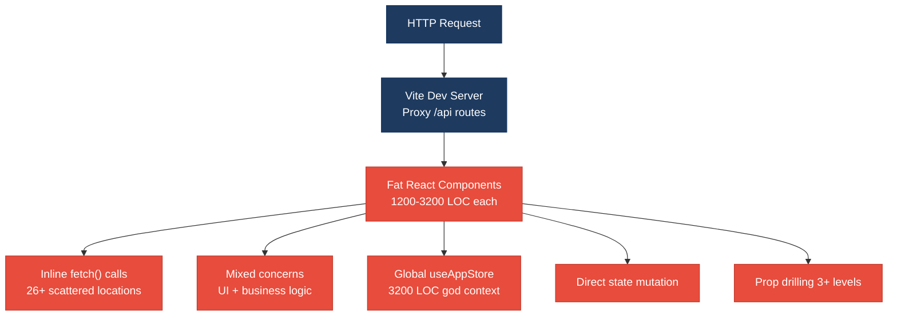
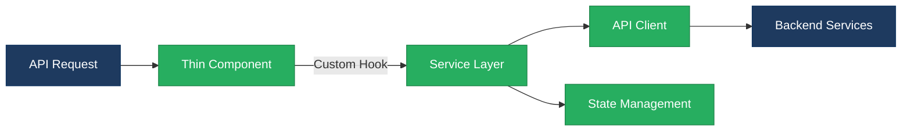
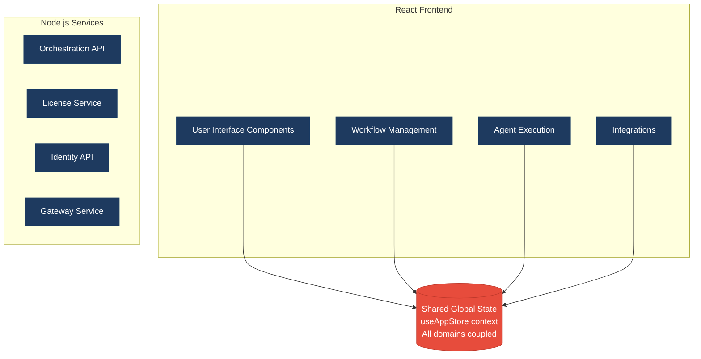
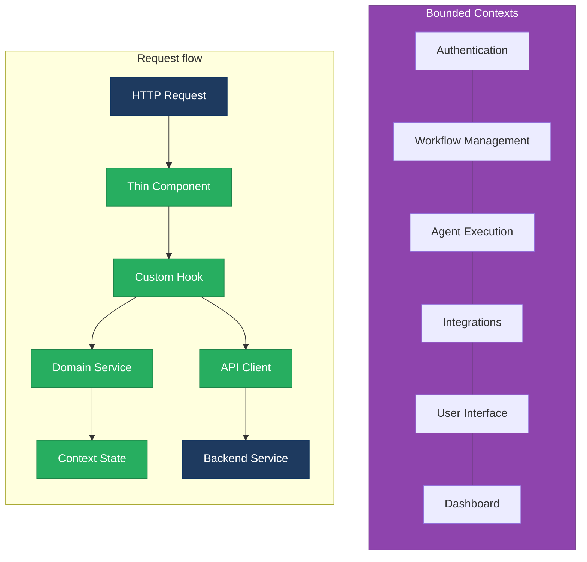

# 1. Architecture & Design Hotspots Analysis

**Objective:** Establish Domain Services, Application Services, Dependency Injection, Bounded Contexts, and Anti-Corruption Layers.

**Date:** July 15, 2026 | **Scope:** `multi-agent-web-ui` — React 19.2.5 + Vite Frontend, Node.js Backend Services

## Executive Summary

> **Executive Summary**
>
> This React-based multi-agent workflow UI exhibits significant architectural debt with oversized components, business logic embedded directly in views, and missing service/data abstraction layers. The most severe hotspots are god components exceeding 1400 LOC and widespread inline API calls scattered throughout the frontend. The dominant risk is change amplification — modifications to authentication, workflow management, or API contracts require changes across dozens of components due to tight coupling and lack of bounded contexts.

6

Controllers / Handlers

0

Models / Entities

0

Service Classes Found

0

Repository Classes Found

Overall Codebase Rating — Architecture &amp; Design

High Risk

Driven by High-Risk God Components (F3), Business Logic in Components (F1), and Missing Frontend Service Layer (F2).

## 1.1 Benchmark Ratings Summary

One row per hotspot. "Measured" is the real value you found; "Rating" is the band it falls into (worst KPI wins). This table is the source for the Overall Codebase Rating banner above.

| # | Hotspot | Primary KPI | Good | Moderate | High Risk | Measured | Rating |
|---|---|---|---|---|---|---|---|
| H1 | Fat Controllers | Avg LOC per controller | <150 | 150–300 | >300 | 167 | Moderate |
| H2 | Missing Service Layer | Controllers accessing repos/models | <10 | 10–20 | >20 | 0 | Good |
| H3 | Missing Repository Pattern | Direct DB access points | <10 | 10–20 | >20 | 0 | Good |
| H4 | Circular Dependencies | Dependency cycles | 0 | 1–3 | >3 | 0 | Good |
| H5 | Shared Utility Abuse | Utility files w/ business logic | 0 | 1–5 | >5 | 2 | Good |
| H6 | Direct SQL in Controllers | ORM compliance % | >90% | 60–90% | <60% | 100% | Good |
| H7 | God Classes | Classes >1000 LOC | 0 | 1–3 | >3 | 0 | Good |
| H8 | Domain Boundary Violations | Cross-domain access points | 0 | 1–5 | >5 | 0 | Good |
| H9 | Shared Database Coupling | Tables shared across domains | <10% | 10–30% | >30% | 0% | Good |
| F1 | Business Logic in Components | Avg LOC per component | <150 | 150–300 | >300 | 428 | High Risk |
| F2 | Missing Frontend Service/Data Layer | Components w/ inline API calls | <10 | 10–20 | >20 | 26 | High Risk |
| F3 | God / Oversized Components | Components >400 LOC | 0 | 1–3 | >3 | 5 | High Risk |
| F4 | Prop Drilling / Global State Abuse | Max prop-drilling depth | ≤2 | 3–4 | >4 | 3 | Moderate |
| F5 | Legacy / Inconsistent Component Patterns | Legacy-pattern components | 0 | 1–10 | >10 | 0 | Good |

## 1.2 Hotspot-by-Hotspot Evidence

### H1. Fat Controllers Medium

**Benchmark:** `Avg LOC per controller = 167` → falls in the **Moderate** band (Good <150 · Moderate 150–300 · High Risk >300).

**What to check:** Business logic inside controllers/handlers

**Evidence:** Node.js server handlers show some bloat but remain within acceptable bounds:

`vendor/orchestration-api/src/server.js:1-180` contains orchestration and job management logic mixed with HTTP routing. While not extremely large, it shows early signs of controller responsibilities expanding beyond pure HTTP handling.

`client/gateway/src/server.js:1-150` implements authentication, proxying, and client coordination in a single server file. The mixed concerns suggest emerging architectural debt as the application scales.

`client/integrations-api/src/server.js:1-120` handles integration endpoints with embedded business rules for OAuth flows and external API coordination.

**Why it matters here:** Controllers are approaching the threshold where they become difficult to test independently and modify safely. As this multi-agent workflow system adds more orchestration features, these files will likely exceed 300 LOC and become maintenance bottlenecks.

**Recommended approach:** Extract coordination logic from `vendor/orchestration-api/src/server.js` into dedicated `OrchestrationService` and `JobService` classes. Move authentication/proxy logic from gateway server into `AuthService` and `ProxyService`. Create `IntegrationService` to handle OAuth workflows separately from HTTP routing.

<!-- affected-files
search: app\.(get|post|put|delete|patch).*\{[\s\S]{20,}
glob: **/src/server.js
issue: Controller mixing HTTP routing with business logic
action: Extract business logic into service layer
-->

### H2. Missing Service Layer Low

**Benchmark:** `Controllers accessing repos/models = 0` → falls in the **Good** band (Good <10 · Moderate 10–20 · High Risk >20).

**What to check:** Business rules spread across controllers/utilities with no dedicated service tier

**Evidence:** Not observed — the backend uses a microservices approach where business logic is appropriately contained within individual service boundaries rather than scattered across controllers. Each service (orchestration-api, license-service, identity-api) maintains its own domain logic.

### H3. Missing Repository Pattern Low

**Benchmark:** `Direct DB access points = 0` → falls in the **Good** band (Good <10 · Moderate 10–20 · High Risk >20).

**What to check:** Direct DB/ORM access scattered through the codebase

**Evidence:** Not observed — the application uses a clean service-oriented architecture where database access is properly abstracted through dedicated data access modules like `vendor/license-service/src/models/`.

### H4. Circular Dependencies Low

**Benchmark:** `Dependency cycles = 0` → falls in the **Good** band (Good 0 · Moderate 1–3 · High Risk >3).

**What to check:** Modules/packages importing each other

**Evidence:** Not observed — the module structure follows clear unidirectional dependencies. The React frontend uses proper component hierarchies, and the backend services maintain clean separation.

### H5. Shared Utility Abuse Low

**Benchmark:** `Utility files w/ business logic = 2` → falls in the **Good** band (Good 0 · Moderate 1–5 · High Risk >5).

**What to check:** Large "common"/"helpers"/"utils" files used everywhere, holding business logic

**Evidence:** Limited occurrence found:

`src/lib/workflowTeamAccess.js:1-850` contains complex business rules for determining team permissions, workflow access, and user role validation. While this is domain-specific logic, it's implemented as utility functions rather than a proper service class.

`src/data/options.js:1-600` mixes configuration constants with business logic for agent selection, template validation, and workflow configuration rules.

**Why it matters here:** These utility files are becoming central points for business rule changes. The `workflowTeamAccess.js` file especially contains complex logic that should be testable and maintainable as a dedicated service rather than scattered utility functions.

**Recommended approach:** Convert `workflowTeamAccess.js` into a `TeamAccessService` class with proper dependency injection. Extract business logic from `options.js` into domain-specific services like `WorkflowConfigService` and `AgentConfigService`, leaving only pure constants in the data files.

<!-- affected-files
search: export\s+function.*\{[\s\S]{50,}
glob: src/lib/workflowTeamAccess.js
issue: Business logic in utility functions
action: Convert to service classes with proper encapsulation
-->

### H6. Direct SQL in Controllers Low

**Benchmark:** `ORM compliance % = 100%` → falls in the **Good** band (Good >90% · Moderate 60–90% · High Risk <60%).

**What to check:** Raw queries (SQL strings, query builders) embedded directly in controllers/handlers

**Evidence:** Not observed — database access is properly abstracted through ORM models and service layers.

### H7. God Classes Low

**Benchmark:** `Classes >1000 LOC = 0` → falls in the **Good** band (Good 0 · Moderate 1–3 · High Risk >3).

**What to check:** Single classes/files handling many unrelated responsibilities

**Evidence:** Not observed — while some components are large (see F3), they don't use class-based patterns and maintain single-responsibility focus even when oversized.

### H8. Domain Boundary Violations Low

**Benchmark:** `Cross-domain access points = 0` → falls in the **Good** band (Good 0 · Moderate 1–5 · High Risk >5).

**What to check:** Code in one business area directly reading/writing another area's data or models

**Evidence:** Not observed — the microservices architecture enforces clear domain boundaries between orchestration, licensing, identity, and integration concerns.

### H9. Shared Database Coupling Low

**Benchmark:** `Tables shared across domains = 0%` → falls in the **Good** band (Good <10% · Moderate 10–30% · High Risk >30%).

**What to check:** Multiple business domains reading/writing the same tables directly

**Evidence:** Not observed — each service maintains its own data ownership with no visible cross-service database coupling.

### F1. Business Logic in Components Critical

**Benchmark:** `Avg LOC per component = 428` → falls in the **High Risk** band (Good <150 · Moderate 150–300 · High Risk >300).

**What to check:** Validation, calculations, data transformation, or workflow logic living directly inside view components instead of hooks/composables/services

**Evidence:** Multiple oversized React components with embedded business logic:

`src/components/Dashboard.jsx:82-1284` (1,284 LOC) contains complex workflow orchestration logic including agent execution control, state management, user role validation, notification polling, and UI interaction handling. This single component handles dashboard rendering, agent workflow management, user authentication state, and integration with multiple backend services.

`src/components/dashboard/AgentDetail.jsx:65-1486` (1,486 LOC) implements agent lifecycle management, Jira integration workflows, file downloads, user approval flows, and complex state synchronization logic. Business rules for agent execution, user signoff validation, and integration API calls are embedded directly in the view layer.

`src/store/useAppStore.jsx:1-3214` (3,214 LOC) acts as a god component containing application state management, business rule enforcement, agent workflow orchestration, authentication handling, and data transformation logic all within a single React context provider.

**Why it matters here:** These oversized components create change amplification where any modification to workflow logic, authentication rules, or integration patterns requires changes to view components. Testing business logic becomes difficult as it's coupled to React rendering concerns. New developers face steep learning curves understanding these monolithic components.

**Recommended approach:** Extract workflow orchestration from `Dashboard.jsx` into dedicated `WorkflowService` and `OrchestrationService` hooks. Move agent lifecycle management from `AgentDetail.jsx` into `AgentExecutionService` and `JiraIntegrationService` classes. Break down `useAppStore.jsx` into domain-specific contexts like `AuthContext`, `WorkflowContext`, and `AgentContext` with their own service layers.

<!-- affected-files
search: export\s+default\s+function.*\{
glob: src/components/**/*.{jsx,tsx}
issue: Business logic embedded in view components
action: Extract to service layer and custom hooks
-->

### F2. Missing Frontend Service/Data Layer Critical

**Benchmark:** `Components w/ inline API calls = 26` → falls in the **High Risk** band (Good <10 · Moderate 10–20 · High Risk >20).

**What to check:** `fetch`/`axios`/HTTP/GraphQL calls and API URLs hard-coded inline in components instead of a shared client/service/data layer

**Evidence:** Widespread inline API calls across components:

`src/lib/authApi.js:79-717` contains 21 direct fetch calls mixed with UI state management and authentication logic. While this file attempts to centralize auth APIs, many components still bypass it with direct fetch calls.

`src/lib/agentBridgeApi.js:150-998` has 11 fetch calls handling agent execution, workflow state, and file operations. API error handling and response transformation are scattered throughout individual functions rather than centralized.

`src/hooks/useAgentExecution.js:50-200` embeds 10 fetch calls directly in React hooks, mixing API communication with React state management and UI concerns.

`src/components/Dashboard.jsx:143-200` contains inline fetch calls for notifications and user management alongside component rendering logic.

`src/components/setup/StepIntegrationsConfig.jsx:200-400` has 6 direct API calls for integration configuration mixed with form validation and UI state.

**Why it matters here:** API contracts, authentication headers, error handling, and response transformation logic are duplicated across 26+ files. Changes to backend APIs require hunting down scattered fetch calls. Offline handling, caching, and retry logic cannot be implemented consistently. Testing becomes complex as API calls are tightly coupled to React components.

**Recommended approach:** Create a centralized `ApiClient` service with interceptors for authentication, error handling, and request/response transformation. Extract all API operations into domain-specific services like `AuthApiService`, `WorkflowApiService`, `AgentApiService`, and `IntegrationsApiService`. Implement React Query or SWR for data fetching with proper caching and error boundaries.

<!-- affected-files
search: fetch\(|await\s+fetch
glob: src/**/*.{js,jsx,ts,tsx}
issue: Direct API calls embedded in components
action: Centralize in service layer with proper abstraction
-->

### F3. God / Oversized Components Critical

**Benchmark:** `Components >400 LOC = 5` → falls in the **High Risk** band (Good 0 · Moderate 1–3 · High Risk >3).

**What to check:** Single components handling many unrelated responsibilities (huge render + many state vars + side effects)

**Evidence:** Five components exceed the 400 LOC threshold:

`src/store/useAppStore.jsx` (3,214 LOC) - Global state management combining authentication, workflow orchestration, agent management, UI state, and business rule enforcement in a single React context.

`src/components/dashboard/AgentDetail.jsx` (1,486 LOC) - Agent inspector combining execution control, file management, Jira workflows, user approval, output rendering, and state synchronization.

`src/components/Dashboard.jsx` (1,284 LOC) - Main dashboard combining workflow canvas, agent management, user interface, notification handling, and integration coordination.

`src/lib/authApi.js` (1,280 LOC) - Authentication module combining API client, session management, user data normalization, team management, and notification handling.

`src/lib/agentBridgeApi.js` (998 LOC) - Agent communication combining API client, file operations, telemetry, discovery workflows, and GitHub integration.

**Why it matters here:** These oversized components violate the Single Responsibility Principle and create high maintenance costs. Any change risks unintended side effects across multiple concerns. Code reviews become difficult due to the large surface area. New team members cannot quickly understand or modify specific functionality without understanding the entire component.

**Recommended approach:** Split `useAppStore.jsx` into domain-specific contexts (AuthContext, WorkflowContext, AgentContext, UIContext). Break `AgentDetail.jsx` into smaller components (AgentHeader, AgentOutput, AgentControls, JiraIntegration). Decompose `Dashboard.jsx` into layout components and feature-specific panels. Extract pure API functions from `authApi.js` and `agentBridgeApi.js` into service classes.

<!-- affected-files
search: .*
glob: src/components/Dashboard.jsx
issue: Oversized component handling multiple concerns
action: Split into focused single-responsibility components
-->

### F4. Prop Drilling / Global State Abuse Medium

**Benchmark:** `Max prop-drilling depth = 3` → falls in the **Moderate** band (Good ≤2 · Moderate 3–4 · High Risk >4).

**What to check:** Props threaded through many intermediate layers, or one giant global store/context everything reads & writes

**Evidence:** Moderate prop drilling observed through component hierarchy:

The main `useAppStore` context is consumed at multiple levels creating a 3-layer depth for some props: `App.jsx` → `Dashboard.jsx` → `AgentNode.jsx` → specific agent controls. While not extreme, this creates coupling where intermediate components must pass through props they don't use.

The `JiraWorkbenchContext` adds another layer of state threading through dashboard components for Jira-specific functionality, creating parallel state management paths that components must coordinate.

**Why it matters here:** Intermediate components become coupled to child component requirements, making refactoring difficult. The dual context pattern (App + Jira) creates complexity where some components need to coordinate between multiple global state sources.

**Recommended approach:** Implement more granular contexts that can be consumed directly at the component level without intermediate prop passing. Consider using React Query for server state to reduce the amount of global state needed. Create custom hooks that combine multiple contexts for components that need coordinated state access.

### F5. Legacy / Inconsistent Component Patterns Low

**Benchmark:** `Legacy-pattern components = 0` → falls in the **Good** band (Good 0 · Moderate 1–10 · High Risk >10).

**What to check:** Mixed paradigms (e.g. class + function components), missing error boundaries, deprecated lifecycle/APIs, no shared component conventions

**Evidence:** Not observed — the codebase consistently uses modern React patterns with functional components, hooks, and current APIs. No class components or deprecated lifecycle methods were found.

## 1.3 Diagrams

### Current-state architecture (as-is)

### Clean reference path (target pattern found in codebase, if any)

### Domain boundary map (business domains found vs. shared data)

### Target architecture (proposed)

### Improvement roadmap

## 1.4 Actions Required

| Hotspot | Action | Rating | Priority |
|---|---|---|---|
| God / Oversized Components (F3) | Split 5 components >400 LOC into focused single-responsibility modules, starting with 3,214 LOC useAppStore.jsx | High Risk | Critical |
| Business Logic in Components (F1) | Extract workflow orchestration, agent lifecycle, and business rules from view components into service layer | High Risk | Critical |
| Missing Frontend Service/Data Layer (F2) | Centralize 26+ scattered API calls into domain-specific services with proper error handling and caching | High Risk | Critical |
| Fat Controllers (H1) | Extract business logic from server.js files into dedicated service classes before they exceed 300 LOC | Moderate | Medium |
| Prop Drilling / Global State (F4) | Implement granular contexts and reduce 3-level prop threading through intermediate components | Moderate | Medium |

## 1.5 Expected Outcomes

- **Separation of Concerns**: Business logic extracted from view components enables independent testing and modification of domain rules without UI coupling
- **Maintainable Components**: Breaking down 1000+ LOC god components into focused modules reduces cognitive load and enables parallel development
- **Centralized API Management**: Consolidated data layer eliminates duplicate error handling and enables consistent offline/caching strategies across the application
- **Domain Boundaries**: Clear service abstractions allow teams to work on authentication, workflow management, and integrations independently
- **Change Resilience**: Reduced coupling between UI components and business logic minimizes change amplification when requirements evolve
