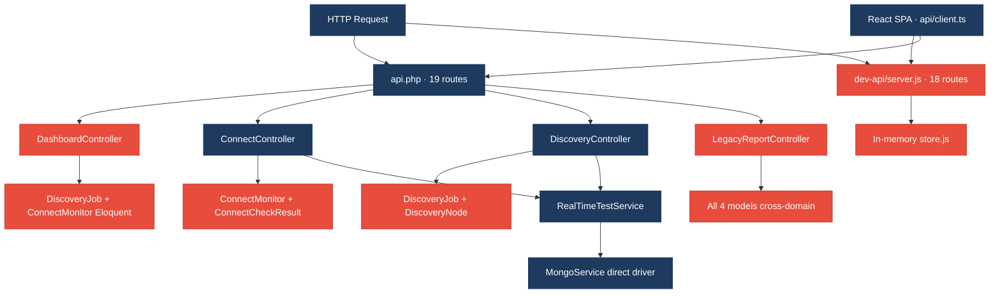
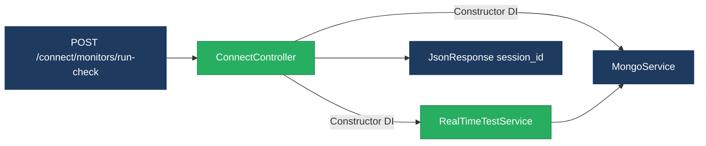
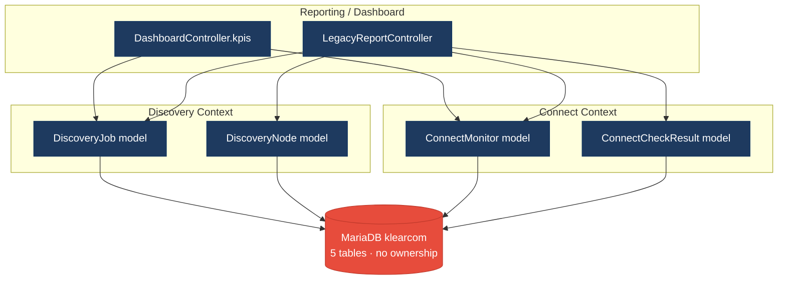
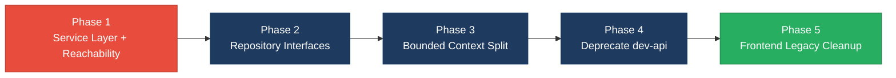

# 1. Architecture & Design Hotspots Analysis

**Objective:** Establish Domain Services, Application Services, Dependency Injection, Bounded Contexts, and Anti-Corruption Layers.

**Date:** July 15, 2026 | **Scope:** `shende-shweta/FSDKC@main` — Laravel 12 (PHP 8) + React 19/Vite 6 + Express `dev-api`

## Executive Summary

> **Executive Summary**
>
> Analysis covered **backend** (15 PHP application files: 6 API controllers, 4 Eloquent models, 2 injectable services, 0 repositories), **frontend** (15 TS/TSX/JSX source files across pages, components, hooks, and store), and **dev-api** (6 JS files mirroring 18 Laravel routes) from `shende-shweta/FSDKC@main` via GitHub REST API (recursive tree + raw content fetch). The Klearcom monorepo runs three parallel runtimes with no repository layer and thin service coverage. Backend layering is the dominant risk: **25 controller-to-model Eloquent access points** bypass application services, **83 persistence access points** occur outside any repository abstraction (Eloquent + MongoDB/in-memory store delegations across Laravel and dev-api), and **12 cross-domain query sites** in `DashboardController` and `LegacyReportController` couple Discovery and Connect models without an anti-corruption layer. Four of five MariaDB tables are accessed from three or more modules (**80% shared-table coupling**), and Laravel + `dev-api` duplicate reachability KPI math, IVR `buildTree`, and dashboard aggregation in parallel. Frontend architecture is comparatively healthy (avg **86 LOC** per view component, centralized `api/client.ts`, max prop-drilling depth **2**), but one legacy class component lacks lifecycle cleanup. Overall verdict: **High Risk**, driven by H2, H3, H8, H9, and H10.

<div class="metric-grid">
<div class="metric-card"><div class="metric-number">6</div><div class="metric-label">Controllers / Handlers</div></div>
<div class="metric-card"><div class="metric-number">4</div><div class="metric-label">Models / Entities</div></div>
<div class="metric-card"><div class="metric-number">2</div><div class="metric-label">Service Classes Found</div></div>
<div class="metric-card"><div class="metric-number">0</div><div class="metric-label">Repository Classes Found</div></div>
</div>

<div class="overall-rating overall-rating--high-risk"><div class="overall-rating-label">Overall Codebase Rating — Architecture &amp; Design</div><div class="overall-rating-value">High Risk</div><div class="overall-rating-note">Driven by High-Risk Missing Service Layer (H2), Missing Repository Pattern (H3), Domain Boundary Violations (H8), Shared Database Coupling (H9), and Parallel API Runtimes (H10).</div></div>

## 1.1 Benchmark Ratings Summary

| # | Hotspot | Primary KPI | <span class="rating rating-good">Good</span> | <span class="rating rating-moderate">Moderate</span> | <span class="rating rating-high-risk">High Risk</span> | Measured | Rating |
|---|---|---|---|---|---|---|---|
| H1 | Fat Controllers | Avg LOC per controller | <150 | 150–300 | >300 | 74 LOC avg | <span class="rating rating-good">Good</span> |
| H2 | Missing Service Layer | Controllers accessing repos/models | <10 | 10–20 | >20 | 25 access points | <span class="rating rating-high-risk">High Risk</span> |
| H3 | Missing Repository Pattern | Direct DB access points | <10 | 10–20 | >20 | 83 access points | <span class="rating rating-high-risk">High Risk</span> |
| H4 | Circular Dependencies | Dependency cycles | 0 | 1–3 | >3 | 0 | <span class="rating rating-good">Good</span> |
| H5 | Shared Utility Abuse | Utility files w/ business logic | 0 | 1–5 | >5 | 4 (`extract` sites) | <span class="rating rating-moderate">Moderate</span> |
| H6 | Direct SQL in Controllers | ORM compliance % | >90% | 60–90% | <60% | 100% ORM | <span class="rating rating-good">Good</span> |
| H7 | God Classes | Classes >1000 LOC | 0 | 1–3 | >3 | 0 (max 276 LOC) | <span class="rating rating-good">Good</span> |
| H8 | Domain Boundary Violations | Cross-domain access points | 0 | 1–5 | >5 | 12 | <span class="rating rating-high-risk">High Risk</span> |
| H9 | Shared Database Coupling | Tables shared across domains | <10% | 10–30% | >30% | 80% (4/5 tables) | <span class="rating rating-high-risk">High Risk</span> |
| F1 | Business Logic in Components | Avg LOC per component | <150 | 150–300 | >300 | 86 LOC avg | <span class="rating rating-good">Good</span> |
| F2 | Missing Frontend Service/Data Layer | Components w/ inline API calls | <10 | 10–20 | >20 | 0 inline fetch/axios | <span class="rating rating-good">Good</span> |
| F3 | God / Oversized Components | Components >400 LOC | 0 | 1–3 | >3 | 0 | <span class="rating rating-good">Good</span> |
| F4 | Prop Drilling / Global State Abuse | Max prop-drilling depth | ≤2 | 3–4 | >4 | 2 levels | <span class="rating rating-good">Good</span> |
| F5 | Legacy / Inconsistent Component Patterns | Legacy-pattern components | 0 | 1–10 | >10 | 1 class component | <span class="rating rating-moderate">Moderate</span> |
| H10 | Parallel API Runtimes (additional) | Duplicate API implementations across runtimes | 0 | 1 | ≥2 | 2 (Laravel + dev-api) | <span class="rating rating-high-risk">High Risk</span> |

No additional hotspots beyond the standard set were observed beyond H10 (Parallel API Runtimes).

## 1.2 Hotspot-by-Hotspot Evidence

### H1. Fat Controllers <span class="sev sev-low">Low</span>

**Benchmark:** `Avg LOC per controller = 74` → falls in the **Good** band (Good <150 · Moderate 150–300 · High Risk >300).

**What to check:** Business logic inside controllers/handlers; controllers should only translate HTTP ↔ application calls.

**Evidence:** Controllers remain thin by line count. The largest API controller is `ConnectController.php` at 102 LOC with six public methods; `DashboardController.php` is 38 LOC with a single `kpis()` action.

```php
// backend/app/Http/Controllers/Api/DashboardController.php:16-40
public function kpis(): JsonResponse
{
    $discoveryTotal = DiscoveryJob::count();
    $discoveryCompleted = DiscoveryJob::where('status', 'completed')->count();
    $connectMonitors = ConnectMonitor::count();
    $avgReachability = ConnectMonitor::avg('reachability_pct') ?? 0;
}
```

**Why it matters here:** While LOC averages are healthy, `LegacyReportController` embeds KPI math and tree-building that inflates cognitive load per change even at 93 LOC.

**Recommended approach:** Keep controllers thin when extracting H2 services; preserve current route-to-handler mapping in `backend/routes/api.php`.

<!-- affected-files
glob: backend/app/Http/Controllers/Api/*.php
issue: Controller contains direct model/query orchestration
action: Extract persistence and domain rules into injected application services
-->

### H2. Missing Service Layer <span class="sev sev-critical">Critical</span>

**Benchmark:** `Controllers accessing repos/models = 25` → falls in the **High Risk** band (Good <10 · Moderate 10–20 · High Risk >20).

**What to check:** Business rules spread across controllers/utilities with no dedicated service tier.

**Evidence:** All six API controllers except `MongoController` and `StreamController` call Eloquent models directly. `ConnectController::checks` duplicates reachability calculation that also exists in `RealTimeTestService` and `dev-api`.

```php
// backend/app/Http/Controllers/Api/ConnectController.php:104-131
public function checks(int $id): JsonResponse
{
    $monitor = ConnectMonitor::findOrFail($id);
    $recentChecks = ConnectCheckResult::where('connect_monitor_id', $id)
        ->orderByDesc('checked_at')->limit(20)->get();
    $successRate = $recentChecks->count() > 0
        ? ($recentChecks->where('reachable', true)->count() / $recentChecks->count()) * 100
        : 100;
}
```

```php
// backend/app/Http/Controllers/Api/LegacyReportController.php:280-314
public function carrierSummary(Request $request): JsonResponse
{
    $filters = $request->all();
    extract($filters);
    $monitors = ConnectMonitor::query()
        ->when(isset($country_code), fn ($q) => $q->where('country_code', $country_code))
}
```

**Why it matters here:** Any change to reachability thresholds must be patched in `ConnectController`, `LegacyReportController`, `RealTimeTestService`, and `dev-api/src/realtime.js` independently.

**Recommended approach:** Introduce `ConnectMonitorService`, `DiscoveryJobService`, and `DashboardKpiService`; centralize reachability in `ReachabilityCalculator`.

<!-- affected-files
search: (ConnectMonitor|ConnectCheckResult|DiscoveryJob|DiscoveryNode)::
glob: backend/app/Http/Controllers/Api/*.php
issue: Controller directly accesses Eloquent models
action: Delegate to constructor-injected application service
-->

### H3. Missing Repository Pattern <span class="sev sev-critical">Critical</span>

**Benchmark:** `Direct DB access points = 83` → falls in the **High Risk** band (Good <10 · Moderate 10–20 · High Risk >20).

**What to check:** Direct DB/ORM access scattered through the codebase outside repositories.

**Evidence:** Zero repository classes exist. Persistence is spread across controllers, `RealTimeTestService`, `MongoService`, and `dev-api/src/server.js`.

```php
// backend/app/Services/RealTimeTestService.php:411-431
$node = DiscoveryNode::create([...]);
$nodeCount = DiscoveryNode::where('discovery_job_id', $jobId)->count();
$job->update(['status' => 'completed', 'nodes_discovered' => $nodeCount]);
```

```javascript
// dev-api/src/server.js:859-880
app.get('/api/dashboard/kpis', async (_req, res) => {
  const discoveryTotal = store.discoveryJobs.length;
  const avgReach = store.connectMonitors.reduce((s, m) => s + m.reachability_pct, 0) / store.connectMonitors.length;
});
```

**Why it matters here:** Without repositories, unit tests must boot Laravel or mock static Eloquent facades.

**Recommended approach:** Create repository interfaces for all 4 Eloquent models and MongoDB collections.

<!-- affected-files
search: (ConnectMonitor|ConnectCheckResult|DiscoveryJob|DiscoveryNode)::|(mongoService|MongoService|store\.)
glob: backend/app/**/*.{php,js}
issue: Direct persistence access outside repository layer
action: Route through injected repository interface
-->

### H4. Circular Dependencies <span class="sev sev-low">Low</span>

**Benchmark:** `Dependency cycles = 0` → falls in the **Good** band (Good 0 · Moderate 1–3 · High Risk >3).

**What to check:** Modules/packages importing each other in cycles.

**Evidence: Not observed —** Laravel namespace graph is acyclic: controllers → services → models; no mutual imports between domain controllers.

### H5. Shared Utility Abuse <span class="sev sev-medium">Medium</span>

**Benchmark:** `Utility files w/ business logic = 4 extract sites` → falls in the **Moderate** band (Good 0 · Moderate 1–5 · High Risk >5).

**What to check:** Large common/helpers/utils files holding business logic.

**Evidence:** `extract($filters)` in `LegacyReportController` and `LegacyDataMapper`. Duplicated `buildTree` in `DiscoveryController`, `LegacyReportController`, and `dev-api/src/store.js`.

```php
// backend/app/Http/Controllers/Api/LegacyReportController.php:282-287
$filters = $request->all();
extract($filters);
$monitors = ConnectMonitor::query()
    ->when(isset($country_code), fn ($q) => $q->where('country_code', $country_code))
```

**Why it matters here:** Filter parameter renames silently break queries; `buildTree` bug fixes must be copy-pasted across three locations.

**Recommended approach:** Replace `extract()` with typed DTOs; extract shared `IvrTreeBuilder` service.

<!-- affected-files
search: extract\(
glob: backend/app/**/*.php
issue: extract() utility abuse hides typed input contracts
action: Replace with typed request DTO and explicit property access
-->

### H6. Direct SQL in Controllers <span class="sev sev-low">Low</span>

**Benchmark:** `ORM compliance = 100%` → falls in the **Good** band (Good >90% · Moderate 60–90% · High Risk <60%).

**What to check:** Raw SQL strings embedded directly in controllers.

**Evidence: Not observed —** all controller persistence uses Eloquent; no `DB::raw` or `whereRaw` in API controllers.

### H7. God Classes <span class="sev sev-low">Low</span>

**Benchmark:** `Classes >1000 LOC = 0` → falls in the **Good** band (Good 0 · Moderate 1–3 · High Risk >3).

**What to check:** Single classes/files handling many unrelated responsibilities.

**Evidence: Not observed —** largest file is `dev-api/src/server.js` at 276 LOC; largest frontend page is `ConnectPage.tsx` at 222 LOC.

### H8. Domain Boundary Violations <span class="sev sev-critical">Critical</span>

**Benchmark:** `Cross-domain access points = 12` → falls in the **High Risk** band (Good 0 · Moderate 1–5 · High Risk >5).

**What to check:** Code in one business area directly reading/writing another area's data or models.

**Evidence:** `DashboardController::kpis` aggregates Discovery and Connect metrics in one method. `LegacyReportController` reads all four domain models.

```php
// backend/app/Http/Controllers/Api/DashboardController.php:18-37
$discoveryTotal = DiscoveryJob::count();
$connectMonitors = ConnectMonitor::count();
$avgReachability = ConnectMonitor::avg('reachability_pct') ?? 0;
'active_discovery_jobs' => DiscoveryJob::where('status', 'running')->count(),
'countries_monitored' => ConnectMonitor::distinct('country_code')->count('country_code'),
```

**Why it matters here:** Dashboard KPI changes require simultaneous edits to Discovery and Connect query logic.

**Recommended approach:** Split into `DiscoveryKpiProvider` and `ConnectKpiProvider` behind a `DashboardAggregator` application service.

<!-- affected-files
search: (DiscoveryJob|DiscoveryNode).*(ConnectMonitor|ConnectCheckResult)|(ConnectMonitor|ConnectCheckResult).*(DiscoveryJob|DiscoveryNode)
glob: backend/app/**/*.php
issue: Cross-domain model access in single class
action: Split into bounded-context KPI providers with anti-corruption DTOs
-->

### H9. Shared Database Coupling <span class="sev sev-critical">Critical</span>

**Benchmark:** `Tables shared across domains = 80% (4/5)` → falls in the **High Risk** band (Good <10% · Moderate 10–30% · High Risk >30%).

**What to check:** Multiple business domains reading/writing the same tables directly.

**Evidence:** Single MariaDB schema in `docker/mariadb/init.sql` with five tables. Four domain tables are each accessed from 3–4 PHP modules including cross-domain controllers.

**Why it matters here:** A Discovery schema migration can silently break dashboard availability KPIs that join implicit Discovery+Connect semantics.

**Recommended approach:** Assign table ownership per domain; create read-model views for cross-domain reporting.

<!-- affected-files
glob: docker/mariadb/init.sql
issue: Monolithic schema with cross-domain table access
action: Split schema by bounded context with integration views for cross-domain reads
-->

### H10. Parallel API Runtimes (additional) <span class="sev sev-critical">Critical</span>

**Benchmark:** `Duplicate API implementations = 2 runtimes` → falls in the **High Risk** band (Good 0 · Moderate 1 · High Risk ≥2).

**What to check:** Duplicate API implementations across runtimes.

**Evidence:** Laravel exposes 19 routes; Express `dev-api/src/server.js` mirrors 18 routes against in-memory `store`. Frontend defaults to dev-api via `VITE_API_URL ?? 'http://localhost:8080/api'`.

```javascript
// dev-api/src/store.js:785-796
export function buildTree(nodes, parentId = null) {
  return nodes.filter((n) => n.parent_id === parentId).map((n) => ({
    id: n.id, children: buildTree(nodes, n.id),
  }));
}
```

**Why it matters here:** Production runs Laravel while developers test against Node — behavioral drift is already visible in dashboard response shape.

**Recommended approach:** Deprecate `dev-api`; use Docker Compose with Laravel for local dev.

<!-- affected-files
glob: dev-api/src/**/*.{js,mjs}
issue: Duplicate API runtime parallel to Laravel backend
action: Consolidate to single Laravel API or generate from OpenAPI spec
-->

### F1. Business Logic in Components <span class="sev sev-low">Low</span>

**Benchmark:** `Avg LOC per component = 86` → falls in the **Good** band (Good <150 · Moderate 150–300 · High Risk >300).

**What to check:** Validation, calculations, or workflow logic inside view components.

**Evidence: Not observed for business-rule leakage —** pages delegate data fetching to TanStack Query; reachability and IVR tree logic stays on the backend.

<!-- affected-files
glob: frontend/src/{pages,components}/**/*.{tsx,jsx}
issue: Oversized component mixing presentation and business rules
action: Extract calculations to hooks or frontend service modules
-->

### F2. Missing Frontend Service/Data Layer <span class="sev sev-low">Low</span>

**Benchmark:** `Components w/ inline API calls = 0` → falls in the **Good** band (Good <10 · Moderate 10–20 · High Risk >20).

**What to check:** `fetch`/`axios` hard-coded inline in components.

**Evidence:** All HTTP traffic routes through `frontend/src/api/client.ts`; no raw `fetch(` outside the client module.

```typescript
// frontend/src/api/client.ts:24-26
export const api = {
  get: <T>(path: string) => request<T>(path),
  post: <T>(path: string, body: unknown) => request<T>(path, { method: 'POST', body: JSON.stringify(body) }),
};
```

### F3. God / Oversized Components <span class="sev sev-low">Low</span>

**Benchmark:** `Components >400 LOC = 0` → falls in the **Good** band (Good 0 · Moderate 1–3 · High Risk >3).

**Evidence: Not observed —** largest component file is `ConnectPage.tsx` at 222 LOC.

### F4. Prop Drilling / Global State Abuse <span class="sev sev-low">Low</span>

**Benchmark:** `Max prop-drilling depth = 2` → falls in the **Good** band (Good ≤2 · Moderate 3–4 · High Risk >4).

**Evidence:** Selected entity IDs use Zustand `uiStore`. `IvrTree` receives `nodes` one level deep from `DiscoveryPage`.

```typescript
// frontend/src/store/uiStore.ts:9-14
export const useUiStore = create<UiState>((set) => ({
  selectedDiscoveryId: null,
  selectedMonitorId: null,
  setSelectedDiscoveryId: (id) => set({ selectedDiscoveryId: id }),
}));
```

### F5. Legacy / Inconsistent Component Patterns <span class="sev sev-medium">Medium</span>

**Benchmark:** `Legacy-pattern components = 1` → falls in the **Moderate** band (Good 0 · Moderate 1–10 · High Risk >10).

**Evidence:** `LegacyMonitorPoller.jsx` is a class component with no `componentWillUnmount` clearing its 3-second polling interval.

```jsx
// frontend/src/components/LegacyMonitorPoller.jsx:969-980
componentDidMount() {
  this.intervalId = setInterval(() => {
    api.get(`/connect/monitors/${this.props.monitorId}/checks`)
      .then((res) => { /* ... */ });
  }, 3000);
}
```

**Why it matters here:** Navigating away leaves orphaned intervals and stale API calls during SPA route changes.

**Recommended approach:** Rewrite as function component with `useEffect` cleanup; add Error Boundary.

<!-- affected-files
search: class\s+\w+\s+extends\s+(React\.)?Component
glob: frontend/src/**/*.{jsx,tsx}
issue: Legacy class component without lifecycle cleanup
action: Migrate to function component with useEffect cleanup and Error Boundary
-->

## 1.3 Diagrams

### Current-state architecture (as-is)



### Clean reference path (target pattern found in codebase, if any)



### Domain boundary map (business domains found vs. shared data)



### Target architecture (proposed)


### Improvement roadmap



## 1.4 Actions Required

| Hotspot | Action | Rating | Priority |
|---|---|---|---|
| H2 — Missing Service Layer | Introduce `ConnectMonitorService`, `DiscoveryJobService`, and `DashboardKpiService`; move all 25 controller model-access points into application services with constructor DI. | <span class="rating rating-high-risk">High Risk</span> | <span class="sev sev-critical">Critical</span> |
| H3 — Missing Repository Pattern | Create repository interfaces for all 4 Eloquent models and 3 MongoDB collections; route 83 persistence access points through injected repository implementations. | <span class="rating rating-high-risk">High Risk</span> | <span class="sev sev-critical">Critical</span> |
| H5 — Shared Utility Abuse | Replace `extract($filters)` with typed DTO mappers; extract shared `IvrTreeBuilder` from duplicated `buildTree` in `LegacyReportController`, `DiscoveryController`, and `dev-api/src/store.js`. | <span class="rating rating-moderate">Moderate</span> | <span class="sev sev-medium">Medium</span> |
| H8 — Domain Boundary Violations | Split cross-domain access in `DashboardController` and `LegacyReportController`; enforce Discovery/Connect bounded contexts with published read APIs. | <span class="rating rating-high-risk">High Risk</span> | <span class="sev sev-critical">Critical</span> |
| H9 — Shared Database Coupling | Assign table ownership per domain in `docker/mariadb/init.sql`; introduce per-domain migration files and integration views for cross-domain KPIs. | <span class="rating rating-high-risk">High Risk</span> | <span class="sev sev-critical">Critical</span> |
| H10 — Parallel API Runtimes | Deprecate `dev-api` duplicate runtime; consolidate to Laravel API with Docker Compose for local dev, or generate dev-api from OpenAPI spec. | <span class="rating rating-high-risk">High Risk</span> | <span class="sev sev-critical">Critical</span> |
| F5 — Legacy Component Patterns | Rewrite `LegacyMonitorPoller.jsx` as function component with `useEffect` cleanup; add Error Boundary around `LegacyDashboardWidget`. | <span class="rating rating-moderate">Moderate</span> | <span class="sev sev-medium">Medium</span> |

## 1.5 Expected Outcomes

- **Testable business logic:** Application services and repositories enable unit tests without HTTP or database bootstrapping, cutting test setup time for Connect reachability and Discovery tree workflows.
- **Independent domain evolution:** Bounded contexts with owned schemas let Discovery and Connect teams ship schema changes without cross-module regressions in dashboard KPIs.
- **Single source of truth:** Eliminating the parallel `dev-api` runtime removes behavioral drift between local development and production Laravel deployments.
- **Reduced change amplification:** Centralizing reachability calculation and IVR tree building in one service eliminates the current four-way duplication across controllers, services, and Node handlers.
- **Frontend stability:** Migrating the legacy class component and adding Error Boundaries prevents interval leaks and uncaught render errors during SPA navigation.
