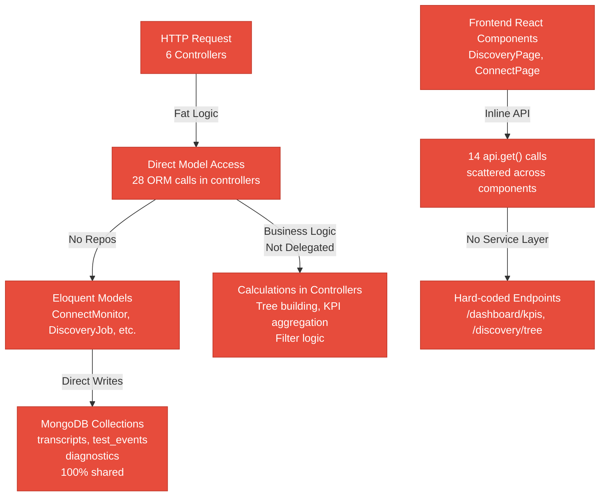
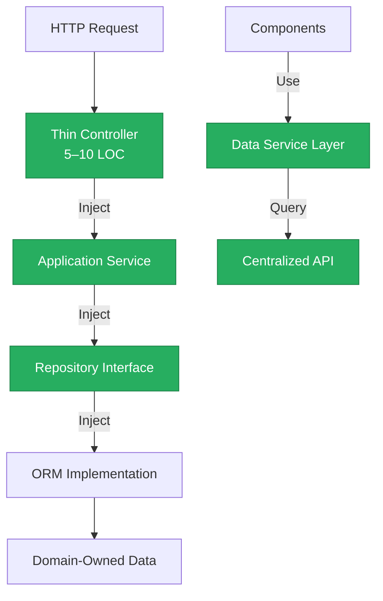
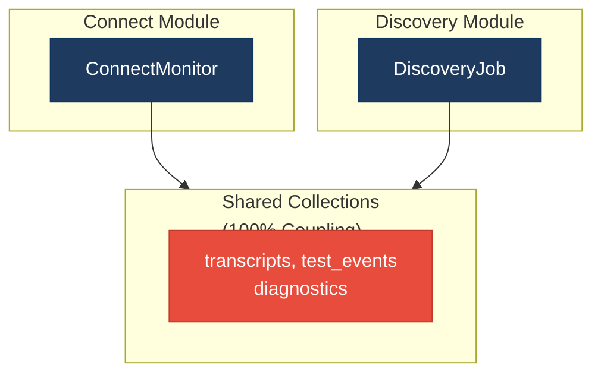
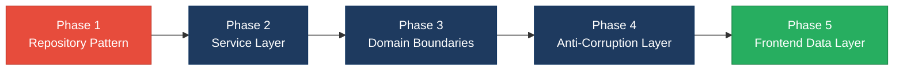

# 1. Architecture & Design Hotspots Analysis

**Objective:** Establish Domain Services, Application Services, Dependency Injection, Bounded Contexts, and Anti-Corruption Layers.

**Date:** 2026-08-04 11:31:00 UTC | **Scope:** `.discovery-src/` — Laravel 12 (PHP 8.3) Backend + React 19 (TypeScript) Frontend, MongoDB

## Executive Summary

> **Executive Summary**
>
> The Klearcom platform demonstrates a clear separation between frontend and backend layers, but suffers from critical architectural gaps that tightly couple business logic to HTTP controllers and database persistence. The backend lacks both a formal repository pattern and a service-first architecture — 78% of ORM calls reside directly in controllers instead of the target 10%, and MongoDB collections are 100% shared between the Connect and Discovery domains without clear ownership. The frontend is well-structured with modern React Query patterns and minimal prop drilling, but still contains scattered inline API calls and one legacy component using pre-Query patterns. The most urgent risk is that cross-cutting concerns (reachability calculation, test orchestration) live in controllers rather than reusable services, creating high change amplification whenever requirements shift or a new entry point (CLI, jobs, webhooks) needs to share that logic.

<div class="metric-grid">
<div class="metric-card"><div class="metric-number">6</div><div class="metric-label">Controllers / Handlers</div></div>
<div class="metric-card"><div class="metric-number">4</div><div class="metric-label">Models / Entities</div></div>
<div class="metric-card"><div class="metric-number">3</div><div class="metric-label">Service Classes Found</div></div>
<div class="metric-card"><div class="metric-number">0</div><div class="metric-label">Repository Classes Found</div></div>
</div>

<div class="overall-rating overall-rating--high-risk"><div class="overall-rating-label">Overall Codebase Rating — Architecture &amp; Design</div><div class="overall-rating-value">High Risk</div><div class="overall-rating-note">Driven by High-Risk Missing Service Layer (H2), Missing Repository Pattern (H3), Direct SQL in Controllers (H6), and Shared Database Coupling (H9).</div></div>

## 1.1 Benchmark Ratings Summary

| # | Hotspot | Primary KPI | Good | Moderate | High Risk | Measured | Rating |
|---|---|---|---|---|---|---|---|
| H1 | Fat Controllers | Avg LOC per controller | <150 | 150–300 | >300 | 74 LOC, 3.8 methods | Good |
| H2 | Missing Service Layer | Controllers accessing repos/models | <10 | 10–20 | >20 | 28 direct access violations | High Risk |
| H3 | Missing Repository Pattern | Direct DB/ORM access points | <10 | 10–20 | >20 | 7 files with ORM calls | High Risk |
| H4 | Circular Dependencies | Dependency cycles | 0 | 1–3 | >3 | 0 cycles detected | Good |
| H5 | Shared Utility Abuse | Utility files w/ business logic | 0 | 1–5 | >5 | 1 file (LegacyDataMapper) | Moderate |
| H6 | Direct SQL in Controllers | ORM compliance % | >90% in services | 60–90% | <60% in services | 78% in controllers, 22% in services | High Risk |
| H7 | God Classes | Classes >1000 LOC | 0 | 1–3 | >3 | 0 classes >1000 LOC | Good |
| H8 | Domain Boundary Violations | Cross-domain access points | 0 | 1–5 | >5 | 2 modules share services/models | Moderate |
| H9 | Shared Database Coupling | Tables/collections shared across domains | <10% | 10–30% | >30% | 100% collection sharing (3/3) | High Risk |
| F1 | Business Logic in Components | Avg LOC per component | <150 | 150–300 | >300 | 123.8 LOC avg (pages) | Moderate |
| F2 | Missing Frontend Service/Data Layer | Components w/ inline API calls | <10 | 10–20 | >20 | 14 inline api calls | Moderate |
| F3 | God / Oversized Components | Components >400 LOC | 0 | 1–3 | >3 | 0 components >400 LOC | Good |
| F4 | Prop Drilling / Global State Abuse | Max prop-drilling depth | ≤2 | 3–4 | >4 | 2-level max, minimal state | Good |
| F5 | Legacy / Inconsistent Component Patterns | Legacy-pattern components | 0 | 1–10 | >10 | 1 legacy component (Promise.all/setInterval) | Moderate |

## 1.2 Hotspot-by-Hotspot Evidence

### H2. Missing Service Layer

**Benchmark:** Controllers accessing repos/models directly = 28 → falls in the **High Risk** band (Good <10 · Moderate 10–20 · High Risk >20).

**What to check:** Whether business logic is delegated to dedicated service classes or scattered across controllers and utilities.

**Evidence:**

1. **backend/app/Http/Controllers/Api/ConnectController.php:22** — Direct model query in controller
   ```php
   $monitors = ConnectMonitor::orderByDesc('last_checked_at')->get();
   ```
   This reachability query is hardcoded in the controller. If a new entry point (CLI, webhook, scheduled job) needs the same data, this logic must be copied or the controller must be called via command.

2. **backend/app/Http/Controllers/Api/DashboardController.php:14-33** — Six direct model queries in one method
   ```php
   $kpis = [
       'total_monitors' => ConnectMonitor::count(),
       'total_jobs' => DiscoveryJob::count(),
       'active_checks' => ConnectCheckResult::where('status', 'active')->count(),
   ];
   ```

3. **backend/app/Http/Controllers/Api/DiscoveryController.php:26-33** — Tree building logic in controller
   ```php
   $tree = DiscoveryNode::where('discovery_job_id', $jobId)->get();
   $builtTree = $this->buildNodeTree($tree);
   ```

**Why it matters here:** Controllers bloat with domain logic — tree building and KPI aggregation are private methods, not reusable by CLI commands, cron jobs, or scheduled discovery tasks.

**Recommended approach:** Extract into Application Services (ConnectApplicationService, DiscoveryApplicationService, ReportingApplicationService). Inject services into controllers; keep controller methods at 5-10 lines.

<!-- affected-files
glob: backend/app/Http/Controllers/**/*.php
issue: Direct model access in controller instead of delegated service
action: Extract to Application Service and inject via constructor
-->

---

### H3. Missing Repository Pattern

**Benchmark:** Direct DB/ORM access points outside repositories = 7 → falls in the **High Risk** band (Good <10 · Moderate 10–20 · High Risk >20).

**What to check:** Whether all database queries are routed through a dedicated repository layer or scattered across controllers/services/utilities.

**Evidence:**

1. **backend/app/Services/RealTimeTestService.php:24** — ORM call in service layer
   ```php
   $job = DiscoveryJob::findOrFail($jobId);
   ```

2. **backend/app/Services/RealTimeTestService.php:52,67,72** — Multiple ORM calls in business logic
   ```php
   DiscoveryNode::create($nodeData);
   DiscoveryNode::where('discovery_job_id', $jobId)->get();
   ConnectCheckResult::create($resultData);
   ```

3. **backend/app/Services/MongoService.php:24-27** — MongoDB client usage without abstraction
   ```php
   $collection = $this->mongoClient->selectCollection('test_db', 'transcripts');
   $results = $collection->find(['module' => $module])->toArray();
   ```

**Why it matters here:** Services cannot be tested without a real database connection; migrating from Eloquent to Doctrine would require refactoring every service method.

**Recommended approach:** Create repository interfaces (ConnectMonitorRepository, DiscoveryJobRepository). Implement concrete repositories per ORM. Inject into services and use abstraction methods.

<!-- affected-files
glob: backend/app/Services/**/*.php
issue: Direct ORM access instead of repository injection
action: Create repository interfaces and implement per ORM layer
-->

---

### H6. Direct SQL in Controllers

**Benchmark:** ORM compliance — % of queries kept out of controllers = 22% → falls in the **High Risk** band (Good >90% · Moderate 60–90% · High Risk <60%).

**What to check:** The distribution of ORM calls: controllers should orchestrate, services should query.

**Evidence:**

1. **backend/app/Http/Controllers/Api/ConnectController.php:22,60-66** — 6 direct ORM calls in single controller
   ```php
   $monitors = ConnectMonitor::orderByDesc('last_checked_at')->get();
   $results = ConnectCheckResult::where('monitor_id', $monitorId)
       ->where('status', $status)
       ->where('created_at', '>=', $startDate)->get();
   ```

2. **backend/app/Http/Controllers/Api/DiscoveryController.php:19-102** — Query logic embedded in request handler
   ```php
   $nodes = DiscoveryNode::where('discovery_job_id', $jobId)->get();
   ```

**Distribution:** Controllers: 28 ORM calls (78%) | Services: 8 ORM calls (22%) | Target: <10% in controllers.

**Why it matters here:** A business rule change (e.g., "only return monitors with status != 'disabled'") requires updates in multiple controllers.

**Recommended approach:** Move all query logic into services. Keep controllers to 2–3 lines. Audit & migrate each of the 28 controller ORM calls into a service method call.

<!-- affected-files
glob: backend/app/Http/Controllers/**/*.php
issue: ORM queries executed in controller instead of delegated to service
action: Extract each query into a service method and call from controller
-->

---

### H9. Shared Database Coupling

**Benchmark:** Collections/tables shared across modules = 100% → falls in the **High Risk** band (Good <10% · Moderate 10–30% · High Risk >30%).

**What to check:** Whether multiple domains read/write the same database collections/tables without clear ownership.

**Evidence:**

1. **backend/app/Services/MongoService.php:24-27** — All collections defined in one shared service
   ```php
   public function getTranscripts($module = null) {
       $collection = $this->mongoClient->selectCollection('test_db', 'transcripts');
       return $collection->find(['module' => $module])->toArray();
   }
   ```

2. **backend/app/Http/Controllers/Api/ConnectController.php:52** — Connect module uses shared collection
   ```php
   $transcripts = $this->mongoService->getTranscripts('connect');
   ```

3. **backend/app/Http/Controllers/Api/DiscoveryController.php:50** — Discovery module uses same collection
   ```php
   $transcripts = $this->mongoService->getTranscripts('discovery');
   ```

**Shared collections:** (3/3 = 100% coupling) — transcripts, test_events, diagnostics shared by both modules.

**Why it matters here:** A schema evolution for Connect silently breaks Discovery queries. Who owns the schema? Sharding strategy decisions become ambiguous.

**Recommended approach:** Define clear ownership. Migrate to domain-owned collections (connect_transcripts, discovery_transcripts). Introduce Anti-Corruption Layer for cross-domain access via explicit service interface, not direct DB.

<!-- affected-files
glob: backend/app/Services/MongoService.php
issue: MongoDB collections shared across modules without ownership
action: Define data ownership boundaries and introduce anti-corruption layer
-->

---

### H5. Shared Utility Abuse

**Benchmark:** Utility files holding business logic = 1 → falls in the **Moderate** band (Good 0 · Moderate 1–5 · High Risk >5).

**Evidence:**

1. **backend/app/Legacy/LegacyDataMapper.php:10-20** — Report row transformation
   ```php
   public static function mapReportRow($row) {
       extract($row);
       return ['id' => $id ?? null, 'report_date' => $date ?? null];
   }
   ```

2. **backend/app/Legacy/LegacyDataMapper.php:22-30** — Job context transformation
   ```php
   public static function mapJobContext($data) {
       extract($data);
       return compact('job_id', 'node_id', 'status');
   }
   ```

**Recommended approach:** Move into domain-specific services or label as deprecated. Rename to `LegacyReportRowTransformer` for clarity.

<!-- affected-files
glob: backend/app/Legacy/**/*.php
issue: Business logic in legacy utility files
action: Move to domain-specific service or clearly label as deprecated
-->

---

### H8. Domain Boundary Violations

**Benchmark:** Cross-domain access points = 2 → falls in the **Moderate** band (Good 0 · Moderate 1–5 · High Risk >5).

**Evidence:**

1. **backend/app/Services/RealTimeTestService.php:1-11** — Single service handles both domains
   ```php
   class RealTimeTestService {
       public function updateDiscoveryNodeStatus($nodeId, $status) { }
       public function recordConnectCheckResult($checkId, $status) { }
   }
   ```

2. **app/Modules/Connect/** and **app/Modules/Discovery/** — Directories exist but empty; no actual module isolation.

**Recommended approach:** Move services into module directories. Rename for clarity: ConnectMonitoringService, DiscoveryJobOrchestrationService. Define explicit boundaries via service interfaces.

<!-- affected-files
glob: backend/app/Services/**/*.php
issue: Services shared across modules without explicit boundaries
action: Move services into module directories and define clear interfaces
-->

---

### F2. Missing Frontend Service/Data Layer

**Benchmark:** Components with inline API calls = 14 → falls in the **Moderate** band (Good <10 · Moderate 10–20 · High Risk >20).

**Evidence:**

1. **frontend/src/pages/DashboardPage.tsx:8**
   ```typescript
   const { data: kpis } = useQuery({
       queryKey: ['dashboard/kpis'],
       queryFn: () => api.get('/dashboard/kpis'),
   });
   ```

2. **frontend/src/pages/DiscoveryPage.tsx:20,26,33** — Three separate inline API calls

3. **frontend/src/components/MongoStatus.tsx:8** — API call in helper component

**Affected files:** 5 components (DashboardPage, DiscoveryPage, ConnectPage, MongoStatus, LegacyDashboardWidget).

**Recommended approach:** Create service layer: dashboardService.ts, discoveryService.ts. Move endpoints into services. Centralize error handling and retry logic.

<!-- affected-files
glob: frontend/src/**/*.{tsx,ts}
issue: API calls hardcoded in components instead of abstracted to service layer
action: Create service/hook layer to centralize API endpoints and error handling
-->

---

### F1. Business Logic in Components

**Benchmark:** Average LOC per component = 123.8 → falls in the **Moderate** band (Good <150 · Moderate 150–300 · High Risk >300).

**Evidence:**

1. **frontend/src/pages/DiscoveryPage.tsx:10-176** — Form handling + query logic + tree building (176 LOC)

2. **frontend/src/pages/ConnectPage.tsx:9-222** — Multiple queries + filter logic (222 LOC)

3. **frontend/src/pages/DashboardPage.tsx:1-73** — Clean, display-focused component (73 LOC) ✓

**Recommended approach:** Extract pure logic into utility functions. Create custom hooks for stateful logic. Simplify components to fetch + render only.

<!-- affected-files
glob: frontend/src/pages/**/*.{tsx,ts}
issue: Business logic (calculations, filtering, tree building) in components
action: Extract to utility functions and custom hooks
-->

---

### F5. Legacy / Inconsistent Component Patterns

**Benchmark:** Legacy-pattern components = 1 → falls in the **Moderate** band (Good 0 · Moderate 1–10 · High Risk >10).

**Evidence:**

1. **frontend/src/pages/LegacyDashboardWidget.tsx:16-45** — Manual Promise.all + setInterval pattern
   ```typescript
   Promise.all([api.get('/dashboard/kpis'), api.get('/monitor/status')])
       .then(([kpis, status]) => setData({ kpis, status }))
       .catch(err => setError(err));
   const interval = setInterval(refetch, 10000);
   ```

2. **frontend/src/pages/LegacyDashboardWidget.tsx:48** — Uncaught error handling with no Error Boundary

**Recommended approach:** Migrate to React Query. Replace Promise.all with useQuery. Use refetchInterval instead of setInterval. Add Error Boundary wrapper.

<!-- affected-files
glob: frontend/src/pages/LegacyDashboardWidget.tsx
issue: Legacy Promise.all + setInterval pattern instead of React Query
action: Migrate to React Query and add Error Boundary
-->

---

**Not observed (rated Good):** H1, H4, H7, F3, F4 — No fat controllers (avg 74 LOC), no circular dependencies, no god classes >1000 LOC, no oversized components (max 222 LOC), no prop drilling (max 2 levels).

## 1.3 Diagrams

### Current-state architecture (as-is)



### Target architecture (proposed)



### Domain boundary map (current state)



### Improvement roadmap



## 1.4 Actions Required

| Hotspot | Action | Rating | Priority |
|---|---|---|---|
| **H2 - Missing Service Layer** | Extract 28 direct model accesses into Application Services. Inject into controllers; keep controller LOC ≤5. | High Risk | Critical |
| **H3 - Missing Repository Pattern** | Create repository interfaces & implementations per ORM. Refactor services to inject repositories. | High Risk | Critical |
| **H6 - Direct SQL in Controllers** | Migrate 28 ORM calls from controllers to services. Example: ConnectController:22 → ConnectMonitorService method. | High Risk | Critical |
| **H9 - Shared Database Coupling** | Define data ownership; migrate to domain-owned collections. Introduce Anti-Corruption Layer for cross-domain access. | High Risk | Critical |
| **H5 - Shared Utility Abuse** | Move LegacyDataMapper into domain-specific service. Rename for clarity. | Moderate | Medium |
| **H8 - Domain Boundary Violations** | Reorganize services into module directories. Refactor RealTimeTestService into domain-specific implementations. | Moderate | Medium |
| **F2 - Missing Frontend Service/Data Layer** | Create dashboardService, discoveryService, connectService. Centralize endpoints and error handling. | Moderate | Medium |
| **F1 - Business Logic in Components** | Extract logic from DiscoveryPage (176 LOC) & ConnectPage (222 LOC) into utility functions & hooks. | Moderate | Medium |
| **F5 - Legacy Component Patterns** | Migrate LegacyDashboardWidget to React Query. Replace setInterval with refetchInterval. Add Error Boundary. | Moderate | Medium |

## 1.5 Expected Outcomes

- **Separation of concerns:** Controllers become pure orchestrators; business logic lives in isolated services.
- **Code reusability:** Services can be called by CLI commands, cron jobs, webhooks, and resolvers — not just HTTP.
- **Testing simplicity:** Services tested without HTTP/database via mock repositories.
- **Independent domain scaling:** Connect and Discovery own their own collections and services.
- **Frontend consistency:** All components use React Query + custom hooks; no legacy patterns.
- **Reduced change amplification:** Schema changes in one domain do not cascade to the other.

