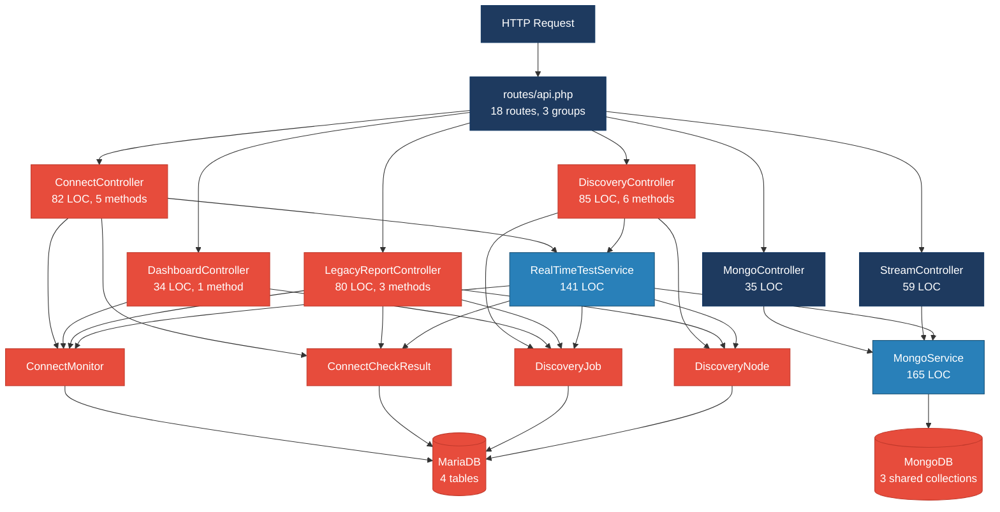
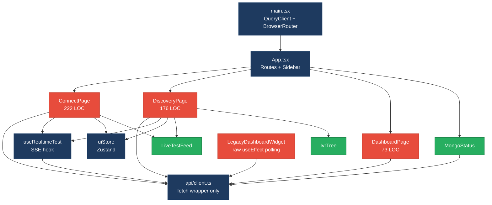
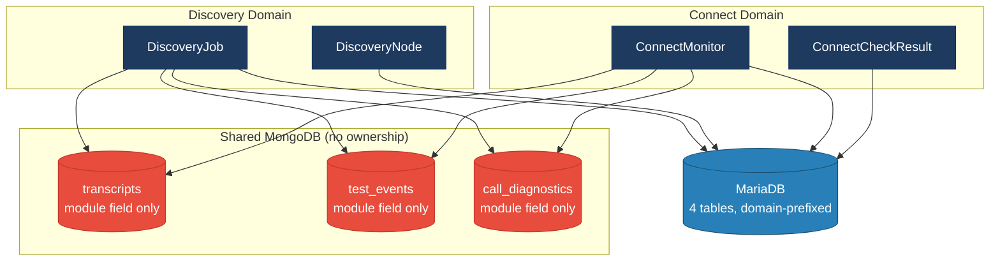
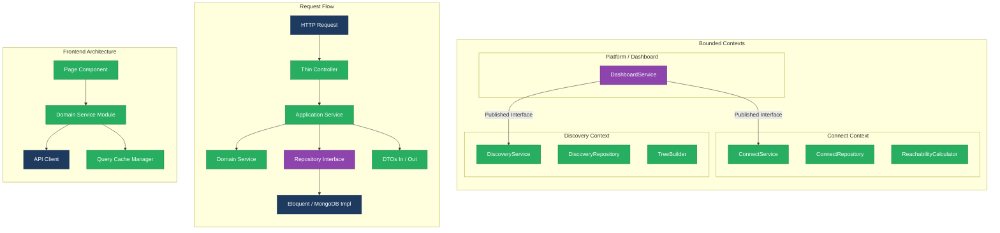
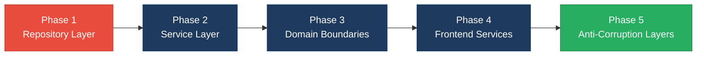

# 1. Architecture & Design Hotspots Analysis

**Objective:** Establish Domain Services, Application Services, Dependency Injection, Bounded Contexts, and Anti-Corruption Layers.

**Date:** 2026-08-18 13:59:58 IST | **Scope:** `shende-shweta/FSDKC` — PHP 8.3 / Laravel 12 (backend), React 19 / TypeScript / Vite (frontend), Node.js / Express (dev-api)

## Executive Summary

> **Executive Summary**
>
> The Klearcom platform is a monorepo with three layers: a Laravel 12 PHP backend (15 PHP files), a React 19 TypeScript frontend (15 TS/TSX/JSX files), and a Node.js Express development API (6 JS files). While the controllers are lean in line count (avg 63 LOC) and basic dependency injection is present via Laravel constructor injection, two structural risks dominate: **zero repository classes** exist, scattering 35 direct ORM access points across controllers and services, and **3 of 7 data stores (43%) are shared** across the Discovery and Connect domains via multi-module MongoDB collections with no ownership boundaries. The `app/Modules/Connect/` and `app/Modules/Discovery/` directories exist but contain no code — an abandoned domain-driven structure that leaves all models, controllers, and services in a flat shared namespace. On the frontend, page components embed all data-fetching, mutation orchestration, and cache invalidation inline with no service or data-access layer. Duplicated business logic (reachability calculation formula, `buildTree` function) appears in three independent locations each, creating divergence risk.

<div class="metric-grid">
<div class="metric-card"><div class="metric-number">6</div><div class="metric-label">Controllers / Handlers</div></div>
<div class="metric-card"><div class="metric-number">4</div><div class="metric-label">Models / Entities</div></div>
<div class="metric-card"><div class="metric-number">2</div><div class="metric-label">Service Classes Found</div></div>
<div class="metric-card"><div class="metric-number">0</div><div class="metric-label">Repository Classes Found</div></div>
<div class="metric-card"><div class="metric-number">8</div><div class="metric-label">React Components</div></div>
<div class="metric-card"><div class="metric-number">1</div><div class="metric-label">Frontend API Modules</div></div>
</div>

<div class="overall-rating overall-rating--high-risk"><div class="overall-rating-label">Overall Codebase Rating — Architecture &amp; Design</div><div class="overall-rating-value">High Risk</div><div class="overall-rating-note">Driven by High-Risk Missing Repository Pattern (H3: 35 direct ORM access points, 0 repositories) and Shared Database Coupling (H9: 43% of data stores shared across domains).</div></div>

## 1.1 Benchmark Ratings Summary

| # | Hotspot | Primary KPI | <span class="rating rating-good">Good</span> | <span class="rating rating-moderate">Moderate</span> | <span class="rating rating-high-risk">High Risk</span> | Measured | Rating |
|---|---|---|---|---|---|---|---|
| H1 | Fat Controllers | Avg LOC per controller | <150 | 150–300 | >300 | 63 LOC | <span class="rating rating-good">Good</span> |
| H2 | Missing Service Layer | Controllers accessing repos/models | <15 | 15–30 | >30 | 25 | <span class="rating rating-moderate">Moderate</span> |
| H3 | Missing Repository Pattern | Direct DB access points outside repos | <15 | 15–30 | >30 | 35 | <span class="rating rating-high-risk">High Risk</span> |
| H4 | Circular Dependencies | Dependency cycles | 0 | 1–3 | >3 | 0 | <span class="rating rating-good">Good</span> |
| H5 | Shared Utility Abuse | Utility files w/ business logic | 0 | 1–5 | >5 | 1 | <span class="rating rating-moderate">Moderate</span> |
| H6 | Direct SQL in Controllers | ORM compliance % | >90% | 60–90% | <60% | 100% | <span class="rating rating-good">Good</span> |
| H7 | God Classes | Largest class/file LOC | <500 | 500–600 | >600 | 276 LOC | <span class="rating rating-good">Good</span> |
| H8 | Domain Boundary Violations | Cross-domain access points | 0 | 1–5 | >5 | 5 | <span class="rating rating-moderate">Moderate</span> |
| H9 | Shared Database Coupling | Tables shared across domains | <30% | 30–40% | >40% | 43% (3/7) | <span class="rating rating-high-risk">High Risk</span> |
| H10 | Duplicated Business Logic (additional) | Distinct business logic fragments duplicated ≥2× | 0 | 1–3 | >3 | 3 | <span class="rating rating-moderate">Moderate</span> |

**No additional hotspots beyond H10 were observed.**

## 1.2 Hotspot-by-Hotspot Evidence

### H2. Missing Service Layer <span class="sev sev-high">High</span>

**Benchmark:** `Controllers directly accessing models = 25` → falls in the **Moderate** band (Good <15 · Moderate 15–30 · High Risk >30).

**What to check:** Controllers/handlers directly accessing repositories/models instead of routing through a dedicated service layer (target >90% business logic in services).

**Evidence:**

**Backend — 4 of 6 controllers bypass services and call Eloquent models directly:**

`backend/app/Http/Controllers/Api/DashboardController.php:14-33` — All 8 model calls are inlined KPI aggregation queries with no intermediate service:

```php
$discoveryTotal = DiscoveryJob::count();
$discoveryCompleted = DiscoveryJob::where('status', 'completed')->count();
$connectMonitors = ConnectMonitor::count();
$avgReachability = ConnectMonitor::avg('reachability_pct') ?? 0;
$alerts = ConnectMonitor::where('status', 'alert')->count();
```

`backend/app/Http/Controllers/Api/ConnectController.php:57-84` — The `checks()` method queries check results AND computes reachability percentage inline — a business calculation that belongs in a service:

```php
$recentChecks = ConnectCheckResult::where('connect_monitor_id', $id)
    ->orderByDesc('checked_at')
    ->limit(20)
    ->get();

$successRate = $recentChecks->count() > 0
    ? ($recentChecks->where('reachable', true)->count() / $recentChecks->count()) * 100
    : 100;

$computedStatus = $successRate < 90 ? 'alert' : 'active';
```

`backend/app/Http/Controllers/Api/LegacyReportController.php:19-53` — `carrierSummary()` queries monitors, iterates to compute per-monitor reachability, and maps report rows — all in the controller:

```php
foreach ($monitors as $monitor) {
    $recent = ConnectCheckResult::where('connect_monitor_id', $monitor->id)
        ->orderByDesc('checked_at')
        ->limit(20)
        ->get();
    $successRate = $recent->count() > 0
        ? ($recent->where('reachable', true)->count() / $recent->count()) * 100
        : 100;
}
```

**Frontend — All 4 page components inline data-fetching, mutation, and cache-invalidation orchestration with no frontend service layer:**

`frontend/src/pages/ConnectPage.tsx:22-56` — ConnectPage embeds 3 React Query hooks, 1 mutation, and a multi-step `handleRunCheck` that coordinates test start, stream connection, and cache invalidation for 3 query families:

```tsx
const handleRunCheck = async (monitorId: number) => {
  setSelectedId(monitorId);
  await startConnectCheck(monitorId);
  queryClient.invalidateQueries({ queryKey: ['connect'] });
  queryClient.invalidateQueries({ queryKey: ['mongodb'] });
  queryClient.invalidateQueries({ queryKey: ['dashboard'] });
};
```

`frontend/src/pages/LegacyDashboardWidget.tsx:16-45` — Uses raw `useEffect` + `Promise.all` + `setInterval` for data fetching instead of React Query, duplicating the data-access pattern found in the other pages with a different mechanism:

```tsx
useEffect(() => {
  let cancelled = false;
  Promise.all([
    api.get<DashboardKpis>('/dashboard/kpis'),
    api.get<{ data: DiscoveryJob[] }>('/discovery/jobs'),
    api.get<{ data: ConnectMonitor[] }>('/connect/monitors'),
  ]).then(([kpiRes, jobRes, monitorRes]) => { ... });
  const timer = setInterval(() => { ... }, 10000);
  return () => { cancelled = true; clearInterval(timer); };
}, []);
```

Total: 25 backend controller-to-model access points + 15 frontend inline API access points across 4 pages with no intermediate service or data-access layer on either side.

**Why it matters here:** Every business rule change (e.g. adjusting the reachability threshold from 90% to 85%, or adding a new KPI) requires editing controller or page-component files directly. The reachability formula already appears in `ConnectController`, `RealTimeTestService`, and `dev-api/realtime.js` — without a service layer there is no canonical location for it, which is why it drifted into 3 copies.

**Recommended approach:**
1. Create `ConnectService` and `DiscoveryService` application services. Move the reachability calculation, KPI aggregation, and report generation out of controllers into these services.
2. Create `DashboardService` to aggregate cross-domain read-only KPIs.
3. On the frontend, introduce domain service modules (e.g. `frontend/src/services/connectService.ts`, `discoveryService.ts`) that encapsulate query keys, API calls, cache invalidation, and business orchestration — pages should call service methods, not compose queries inline.
4. Refactor `LegacyDashboardWidget` to use React Query via the new service layer, eliminating the raw `useEffect`/`setInterval` data-fetching.

<!-- affected-files
search: (ConnectMonitor|ConnectCheckResult|DiscoveryJob|DiscoveryNode)::
glob: backend/app/Http/Controllers/Api/*.php
issue: Controller bypasses service layer
action: Extract business logic into Application Services
-->

<!-- affected-files
search: api\.(get|post)\(
glob: frontend/src/pages/*.tsx
issue: Page component inlines data-access logic
action: Extract into frontend service/data-access modules
-->

### H3. Missing Repository Pattern <span class="sev sev-critical">Critical</span>

**Benchmark:** `Direct DB/ORM access points outside repositories = 35` → falls in the **High Risk** band (Good <15 · Moderate 15–30 · High Risk >30).

**What to check:** Direct DB/ORM access scattered through the codebase with no dedicated repository layer (target 100% access via repositories).

**Evidence:**

There are **0 repository classes** in the entire codebase. All 35 direct ORM access points are spread across 4 controllers (25 points) and 2 services (10 points).

`backend/app/Services/RealTimeTestService.php:24-72` — The service layer itself uses direct Eloquent calls rather than repositories, mixing business orchestration with data access:

```php
$job = DiscoveryJob::findOrFail($jobId);
$job->update(['status' => 'running', 'started_at' => now()]);
// ... later ...
$node = DiscoveryNode::create([
    'discovery_job_id' => $jobId,
    'parent_id' => $parentId,
    'prompt_text' => $step['transcript'] ?? 'Menu discovered',
    'node_type' => 'menu',
    'depth' => $parentId ? 1 : 0,
]);
// ... later ...
$nodeCount = DiscoveryNode::where('discovery_job_id', $jobId)->count();
$job->update([
    'status' => 'completed',
    'completed_at' => now(),
    'nodes_discovered' => $nodeCount,
    'menu_depth' => DiscoveryNode::where('discovery_job_id', $jobId)->max('depth') ?? 0,
]);
```

`backend/app/Services/RealTimeTestService.php:83-124` — Same pattern for Connect tests — 5 direct model calls in one method:

```php
$monitor = ConnectMonitor::findOrFail($monitorId);
// ... business logic ...
ConnectCheckResult::create([
    'connect_monitor_id' => $monitorId,
    'reachable' => $reachable,
    'latency_ms' => $latency,
    'carrier_route' => $monitor->carrier ? "{$monitor->country_code} -> {$monitor->carrier} SIP" : null,
    'failure_reason' => $reachable ? null : 'Carrier routing failure',
    'checked_at' => now(),
]);
$recent = ConnectCheckResult::where('connect_monitor_id', $monitorId)->orderByDesc('checked_at')->limit(20)->get();
```

`backend/app/Http/Controllers/Api/DashboardController.php:14-33` — A controller with 8 direct model calls spanning two domains:

```php
$discoveryTotal = DiscoveryJob::count();
$discoveryCompleted = DiscoveryJob::where('status', 'completed')->count();
$connectMonitors = ConnectMonitor::count();
$avgReachability = ConnectMonitor::avg('reachability_pct') ?? 0;
$alerts = ConnectMonitor::where('status', 'alert')->count();
```

Additionally, the `dev-api/src/server.js:47-53` route handler makes a raw MongoDB collection query bypassing the helper functions:

```javascript
const data = await getDb()
    .collection('call_diagnostics')
    .find({ module: req.params.module, reference_id: Number(req.params.referenceId) })
    .sort({ created_at: -1 })
    .limit(10)
    .toArray();
```

**Why it matters here:** With no repository abstraction, the project cannot swap its MariaDB persistence for testing, cannot introduce caching at the data-access boundary, and cannot extract a domain into a standalone service without rewriting every caller. The 35 scattered access points mean any schema change (e.g. renaming `reachability_pct` or changing `ConnectCheckResult` structure) requires hunting through both controllers and services. The `app/Modules/` directory structure signals intent to extract bounded contexts — impossible while Eloquent models are called directly everywhere.

**Recommended approach:**
1. Create `ConnectMonitorRepository`, `ConnectCheckResultRepository`, `DiscoveryJobRepository`, and `DiscoveryNodeRepository` under `backend/app/Repositories/`.
2. Define repository interfaces and bind them in `AppServiceProvider` to allow future swaps (e.g. in-memory for testing).
3. Refactor all 25 controller model calls to go through the new services (H2 fix) which in turn call repositories.
4. Refactor `RealTimeTestService` to inject repositories via constructor DI rather than calling static Eloquent methods.
5. In `dev-api/src/server.js:47`, replace the inline `getDb().collection()` call with the existing `mongo.js` helper pattern.

<!-- affected-files
search: (ConnectMonitor|ConnectCheckResult|DiscoveryJob|DiscoveryNode)::
glob: backend/app/**/*.php
issue: Direct ORM access without repository
action: Introduce Repository interfaces and implementations
-->

### H5. Shared Utility Abuse <span class="sev sev-medium">Medium</span>

**Benchmark:** `Utility files with business logic = 1` → falls in the **Moderate** band (Good 0 · Moderate 1–5 · High Risk >5).

**What to check:** Large "common"/"helpers"/"utils" files holding business logic rather than domain-specific services.

**Evidence:**

`backend/app/Legacy/LegacyDataMapper.php:10-31` — Uses PHP's `extract()` to destructure arrays into local variables and performs business-specific report data mapping:

```php
public function mapReportRow(array $row): array
{
    extract($row, EXTR_SKIP);

    return [
        'label' => $name ?? 'Unknown',
        'metric' => $reachability_pct ?? 0,
        'region' => $country_code ?? 'N/A',
        'source' => 'legacy_extract_mapper',
    ];
}

public function mapJobContext(array $context): array
{
    extract($context);

    return [
        'job_name' => $job_name ?? null,
        'phone' => $phone_number ?? null,
        'depth' => $menu_depth ?? 0,
    ];
}
```

`backend/app/Http/Controllers/Api/LegacyReportController.php:22` — The controller also uses `extract()` directly on unvalidated request input, compounding the utility pattern:

```php
$filters = $request->all();
extract($filters);
```

The `extract()` calls create implicit variable bindings from arrays, making data flow invisible to static analysis and creating potential variable-name collision risks (especially in `LegacyReportController` where unvalidated user input is extracted).

**Why it matters here:** `LegacyDataMapper` is the only "utility" holding business logic, but it is a report-mapping concern that belongs in a dedicated reporting service. The `extract()` pattern makes the code fragile and masks what variables are actually in scope — a new array key in the input silently creates a new local variable.

**Recommended approach:**
1. Replace `extract()` calls with explicit array destructuring or typed DTOs.
2. Move `LegacyDataMapper::mapReportRow()` into a `ReportingService` with typed input/output objects.
3. In `LegacyReportController::carrierSummary()`, replace `extract($filters)` with explicit `$request->validated()` fields.

<!-- affected-files
search: extract\(
glob: backend/app/**/*.php
issue: extract() usage with implicit variables
action: Replace with explicit destructuring or typed DTOs
-->

### H8. Domain Boundary Violations <span class="sev sev-medium">Medium</span>

**Benchmark:** `Cross-domain access points = 5` → falls in the **Moderate** band (Good 0 · Moderate 1–5 · High Risk >5).

**What to check:** Code in one business area directly reading/writing another area's data or models without going through defined domain interfaces.

**Evidence:**

The codebase has two clear business domains — **Discovery** (IVR mapping) and **Connect** (TFN reachability) — plus a cross-cutting Dashboard. The `backend/app/Modules/Connect/` and `backend/app/Modules/Discovery/` directories exist but contain only placeholder `AGENTS.md` files — zero domain code. All models live in the flat `backend/app/Models/` namespace with no ownership.

`backend/app/Http/Controllers/Api/DashboardController.php:14-33` — Directly accesses models from both Discovery and Connect domains:

```php
$discoveryTotal = DiscoveryJob::count();
$discoveryCompleted = DiscoveryJob::where('status', 'completed')->count();
$connectMonitors = ConnectMonitor::count();
$avgReachability = ConnectMonitor::avg('reachability_pct') ?? 0;
```

`backend/app/Http/Controllers/Api/LegacyReportController.php:56-59` — A Connect-centric report controller reaches into the Discovery domain to build IVR depth reports:

```php
$job = DiscoveryJob::findOrFail($jobId);
$nodes = DiscoveryNode::where('discovery_job_id', $jobId)->get();
```

`frontend/src/pages/LegacyDashboardWidget.tsx:19-23` — Frontend widget directly fetches from both domain APIs in a single `Promise.all`:

```tsx
Promise.all([
  api.get<DashboardKpis>('/dashboard/kpis'),
  api.get<{ data: DiscoveryJob[] }>('/discovery/jobs'),
  api.get<{ data: ConnectMonitor[] }>('/connect/monitors'),
])
```

5 distinct cross-domain access points total (3 backend, 2 frontend).

**Why it matters here:** The abandoned `app/Modules/` structure shows the team intended to separate these domains. Without boundaries, extracting Discovery or Connect into a standalone microservice would require tracing and rewriting every cross-domain model import. The `DashboardController` tightly couples platform-level reporting to both domain internals.

**Recommended approach:**
1. Move domain models into their respective module directories: `app/Modules/Discovery/Models/`, `app/Modules/Connect/Models/`.
2. Define published interfaces per domain (e.g. `DiscoveryQueryInterface` exposing read-only KPI methods) and have the Dashboard controller consume those instead of accessing models directly.
3. On the frontend, introduce a `dashboardService` that composes data from domain service modules rather than fetching from multiple domain endpoints directly.

<!-- affected-files
search: (DiscoveryJob|DiscoveryNode)
glob: backend/app/Http/Controllers/Api/LegacyReportController.php
issue: Connect-domain controller accesses Discovery-domain models
action: Route through published domain interface
-->

<!-- affected-files
search: (DiscoveryJob|ConnectMonitor)
glob: backend/app/Http/Controllers/Api/DashboardController.php
issue: Dashboard controller accesses both domains directly
action: Consume domain-published query interfaces
-->

### H9. Shared Database Coupling <span class="sev sev-critical">Critical</span>

**Benchmark:** `Tables shared across domains = 43% (3 of 7)` → falls in the **High Risk** band (Good <30% · Moderate 30–40% · High Risk >40%).

**What to check:** Multiple business domains reading/writing the same tables directly, without data ownership or anti-corruption layers.

**Evidence:**

The platform has 7 data stores: 4 MariaDB tables (domain-prefixed) and 3 MongoDB collections (shared).

**MariaDB tables** — properly domain-owned:
- `discovery_jobs`, `discovery_nodes` → Discovery domain
- `connect_monitors`, `connect_check_results` → Connect domain

**MongoDB collections** — shared across both domains with only a `module` field for partitioning:

`backend/app/Services/MongoService.php:62-76` — Both Discovery and Connect write to the same `transcripts` collection:

```php
public function storeTranscript(string $module, int $referenceId, array $payload): ?string
{
    $result = $this->transcripts->insertOne([
        'module' => $module,
        'reference_id' => $referenceId,
        'payload' => $payload,
        'created_at' => new \MongoDB\BSON\UTCDateTime,
    ]);
    return (string) $result->getInsertedId();
}
```

Called from `RealTimeTestService.php:46` (Discovery) and `RealTimeTestService.php:126` (Connect) with the same schema.

`backend/app/Services/MongoService.php:78-93` — Same pattern for `test_events`:

```php
public function storeTestEvent(string $sessionId, string $module, int $referenceId, array $event): ?string
{
    $result = $this->testEvents->insertOne([
        'session_id' => $sessionId,
        'module' => $module,
        'reference_id' => $referenceId,
        'event' => $event,
        'created_at' => new \MongoDB\BSON\UTCDateTime,
    ]);
    return (string) $result->getInsertedId();
}
```

`backend/app/Services/MongoService.php:95-109` — And `call_diagnostics`:

```php
public function storeDiagnostic(string $module, int $referenceId, array $data): ?string
{
    $result = $this->diagnostics->insertOne([
        'module' => $module,
        'reference_id' => $referenceId,
        ...$data,
        'created_at' => new \MongoDB\BSON\UTCDateTime,
    ]);
    return (string) $result->getInsertedId();
}
```

3 out of 7 data stores (43%) are shared. A schema change to `transcripts` (e.g. restructuring `payload`) silently affects both Discovery and Connect. There is no anti-corruption layer or adapter between domains.

**Why it matters here:** If the team adds a new module (e.g. "Audio Quality"), it would write to the same 3 collections, increasing coupling. The `module` field discriminator provides no schema enforcement — Discovery transcripts and Connect transcripts share the same shape by convention, not contract. A future migration to per-domain databases would require splitting all 3 collections.

**Recommended approach:**
1. Create domain-specific MongoDB collections: `discovery_transcripts`, `connect_transcripts`, `discovery_test_events`, `connect_test_events`, etc.
2. If a shared collection is preferred for operational reasons, introduce domain-specific wrapper services (e.g. `DiscoveryTranscriptService`, `ConnectTranscriptService`) that enforce per-domain schemas and act as anti-corruption layers.
3. Define ownership per collection in documentation and enforce via code review.
4. For cross-domain reads (e.g. Dashboard showing transcripts from both domains), route through a dedicated query service rather than scanning a shared collection.

<!-- affected-files
search: (storeTranscript|storeTestEvent|storeDiagnostic|getTranscripts|getTestEvents|getDiagnostics)
glob: backend/app/Services/MongoService.php
issue: Shared MongoDB collections across domains
action: Split into domain-owned collections or add ACL wrappers
-->

### H10. Duplicated Business Logic (additional) <span class="sev sev-high">High</span>

**Benchmark:** `Distinct business logic fragments duplicated ≥2× = 3` → falls in the **Moderate** band (Good 0 · Moderate 1–3 · High Risk >3).

**What to check:** The same business formula or algorithm implemented independently in multiple locations, creating divergence risk.

**Evidence:**

**Duplication 1: Reachability calculation formula (3 copies)**

`backend/app/Http/Controllers/Api/ConnectController.php:66-75`:

```php
$recentChecks = ConnectCheckResult::where('connect_monitor_id', $id)
    ->orderByDesc('checked_at')
    ->limit(20)
    ->get();
$successRate = $recentChecks->count() > 0
    ? ($recentChecks->where('reachable', true)->count() / $recentChecks->count()) * 100
    : 100;
```

`backend/app/Services/RealTimeTestService.php:117-118`:

```php
$recent = ConnectCheckResult::where('connect_monitor_id', $monitorId)->orderByDesc('checked_at')->limit(20)->get();
$rate = $recent->count() > 0 ? ($recent->where('reachable', true)->count() / $recent->count()) * 100 : 100;
```

`dev-api/src/realtime.js:146-149`:

```javascript
const recent = store.connectChecks.filter((c) => c.connect_monitor_id === monitorId).slice(0, 20);
const successRate = recent.length > 0
  ? (recent.filter((c) => c.reachable).length / recent.length) * 100
  : 100;
```

**Duplication 2: `buildTree` recursive tree builder (3 copies)**

`backend/app/Http/Controllers/Api/DiscoveryController.php:87-100`, `backend/app/Http/Controllers/Api/LegacyReportController.php:78-92` (identical private methods), and `dev-api/src/store.js:64-75` (JavaScript equivalent).

**Duplication 3: Frontend query/mutation/invalidation pattern (2 copies)**

`frontend/src/pages/ConnectPage.tsx:22-56` and `frontend/src/pages/DiscoveryPage.tsx:18-52` — Nearly identical patterns for 3 queries, 1 mutation, handleStart/handleRunCheck with the same 3-query invalidation sequence.

**Why it matters here:** The reachability formula is a core business metric. If the threshold changes from 20 most-recent checks to 50, or the 90% alert threshold adjusts, three files must be updated in lockstep — and two are in different languages (PHP vs JavaScript). The comment on `ConnectController.php:65` explicitly notes this: "Duplicate reachability calculation block (also in RealTimeTestService / dev-api realtime.js)".

**Recommended approach:**
1. Extract the reachability calculation into a single `ReachabilityCalculator` service (or a method on `ConnectService`) and call it from all three sites.
2. Move `buildTree` into a `TreeBuilder` utility or `DiscoveryService` method, removing the duplicate from `LegacyReportController`.
3. On the frontend, create a shared hook factory or service module for the query/mutation/invalidation pattern used identically in `ConnectPage` and `DiscoveryPage`.

<!-- affected-files
search: (successRate|reachability_pct.*count|reachable.*count)
glob: backend/app/**/*.php
issue: Duplicated reachability calculation
action: Extract into ReachabilityCalculator service
-->

<!-- affected-files
search: buildTree
glob: backend/app/**/*.php
issue: Duplicated buildTree method
action: Extract into shared DiscoveryService or TreeBuilder
-->

**Not observed (rated Good):** H1 (avg 63 LOC per controller, no controller exceeds 102 LOC), H4 (no circular dependency cycles found across backend or frontend imports), H6 (100% ORM compliance — zero raw SQL/DB:: calls in controllers; all queries use Eloquent), H7 (largest file is dev-api/src/server.js at 276 LOC, largest PHP class is MongoService at 165 LOC — all well under 500 LOC threshold).

## 1.3 Diagrams

### Current-state architecture (as-is)



### Clean reference path (target pattern found in codebase)

MongoController and StreamController demonstrate the thin-controller pattern — they delegate entirely to `MongoService` via constructor DI.


### Frontend current-state architecture



### Domain boundary map (business domains vs. shared data)



### Target architecture (proposed)



### Improvement roadmap



## 1.4 Actions Required

| Hotspot | Action | Rating | Priority |
|---|---|---|---|
| H3. Missing Repository Pattern | Create `ConnectMonitorRepository`, `ConnectCheckResultRepository`, `DiscoveryJobRepository`, `DiscoveryNodeRepository` with interfaces; refactor all 35 direct ORM access points to use repositories | <span class="rating rating-high-risk">High Risk</span> | <span class="sev sev-critical">Critical</span> |
| H9. Shared Database Coupling | Split 3 shared MongoDB collections into domain-owned collections or add domain-specific ACL wrapper services; define ownership per collection | <span class="rating rating-high-risk">High Risk</span> | <span class="sev sev-critical">Critical</span> |
| H2. Missing Service Layer | Create `ConnectService`, `DiscoveryService`, `DashboardService` application services; move 25 controller model calls through services; introduce frontend service modules for 4 page components | <span class="rating rating-moderate">Moderate</span> | <span class="sev sev-high">High</span> |
| H10. Duplicated Business Logic | Extract `ReachabilityCalculator` (3 copies), consolidate `buildTree` (3 copies), create shared frontend hook pattern (2 copies) | <span class="rating rating-moderate">Moderate</span> | <span class="sev sev-high">High</span> |
| H8. Domain Boundary Violations | Populate `app/Modules/Connect/` and `app/Modules/Discovery/` with domain models, services, and repositories; define published interfaces for cross-domain reads | <span class="rating rating-moderate">Moderate</span> | <span class="sev sev-medium">Medium</span> |
| H5. Shared Utility Abuse | Replace `extract()` in `LegacyDataMapper` and `LegacyReportController` with explicit destructuring; move report mapping into a `ReportingService` | <span class="rating rating-moderate">Moderate</span> | <span class="sev sev-medium">Medium</span> |

## 1.5 Expected Outcomes

- **Testability:** Repository interfaces enable unit testing services without hitting the database; constructor DI (already partially in place) becomes complete.
- **Domain independence:** Populated `app/Modules/` with owned models, services, and repositories allows Discovery and Connect to evolve independently — schema changes in one domain cannot silently break the other.
- **Single source of truth for business logic:** A canonical `ReachabilityCalculator` eliminates 3 divergent copies of the reachability formula; `buildTree` lives in one place.
- **Frontend maintainability:** Domain service modules centralize query keys, cache invalidation, and API orchestration — page components shrink to thin UI views.
- **Microservice readiness:** Bounded contexts with published interfaces and anti-corruption layers make it possible to extract Discovery or Connect into standalone services when scale demands it.
