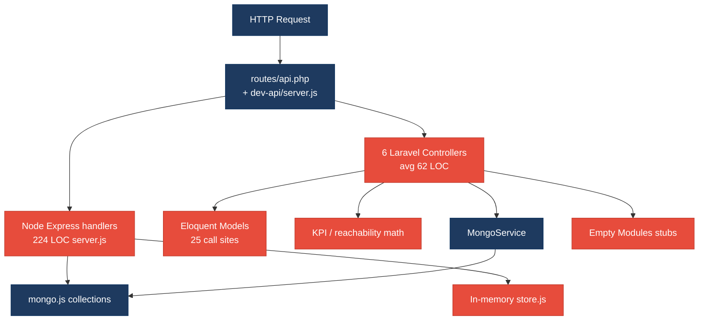
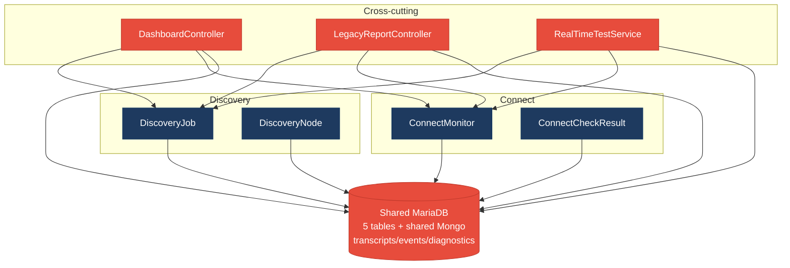
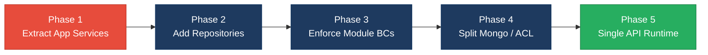

# 1. Architecture & Design Hotspots Analysis

**Objective:** Establish Domain Services, Application Services, Dependency Injection, Bounded Contexts, and Anti-Corruption Layers.

**Date:** 2026-07-24 | **Scope:** `shende-shweta/FSDKC` (main) — PHP 8.3 / Laravel 12 backend, React 19 + TypeScript + Vite frontend, Node/Express `dev-api`, MariaDB + MongoDB

## Executive Summary

> **Executive Summary**
>
> Klearcom is a modular monolith for Discovery (IVR) and Connect (TFN) with three runtime layers: Laravel 12 API (`backend/`), React 19 SPA (`frontend/`), and a parallel Node Express `dev-api` used for local development. Layers covered: **backend** (~20 PHP application files under `backend/app/` plus routes), **frontend** (~14 TS/JSX source files under `frontend/src/`), and **dev-api** (6 JS modules). The dominant risk is **missing application/repository boundaries**: controllers and Express handlers own Eloquent/in-memory store access (25 Eloquent call sites in controllers alone), while declared `app/Modules/{Discovery,Connect}` folders contain only `AGENTS.md` stubs. Cross-domain coupling through `DashboardController`, `LegacyReportController`, `RealTimeTestService`, and shared Mongo collections amplifies change cost. Frontend is comparatively healthier (shared `api/client.ts`, React Query) but still carries legacy class/unbounded widgets without error boundaries.

<div class="metric-grid">
<div class="metric-card"><div class="metric-number">6</div><div class="metric-label">Controllers / Handlers</div></div>
<div class="metric-card"><div class="metric-number">4</div><div class="metric-label">Models / Entities</div></div>
<div class="metric-card"><div class="metric-number">2</div><div class="metric-label">Service Classes Found</div></div>
<div class="metric-card"><div class="metric-number">0</div><div class="metric-label">Repository Classes Found</div></div>
</div>

<div class="overall-rating overall-rating--high-risk"><div class="overall-rating-label">Overall Codebase Rating — Architecture &amp; Design</div><div class="overall-rating-value">High Risk</div><div class="overall-rating-note">Driven by High-Risk Missing Service Layer (H2), Missing Repository Pattern (H3), Direct SQL/ORM in Controllers (H6), Domain Boundary Violations (H8), Shared Database Coupling (H9), and Dual-Runtime Drift (H10).</div></div>

## 1.1 Benchmark Ratings Summary

| # | Hotspot | Primary KPI | <span class="rating rating-good">Good</span> | <span class="rating rating-moderate">Moderate</span> | <span class="rating rating-high-risk">High Risk</span> | Measured | Rating |
|---|---|---|---|---|---|---|---|
| H1 | Fat Controllers | Avg LOC per controller | <150 | 150–300 | >300 | 62 LOC | <span class="rating rating-good">Good</span> |
| H2 | Missing Service Layer | Controllers accessing repos/models | <10 | 10–20 | >20 | 25 Eloquent sites in 4 controllers | <span class="rating rating-high-risk">High Risk</span> |
| H3 | Missing Repository Pattern | Direct DB access points | <10 | 10–20 | >20 | 32+ (0 repositories) | <span class="rating rating-high-risk">High Risk</span> |
| H4 | Circular Dependencies | Dependency cycles | 0 | 1–3 | >3 | 0 | <span class="rating rating-good">Good</span> |
| H5 | Shared Utility Abuse | Utility files w/ business logic | 0 | 1–5 | >5 | 2 (`LegacyDataMapper`, `store.buildTree`) | <span class="rating rating-moderate">Moderate</span> |
| H6 | Direct SQL in Controllers | ORM compliance % | >90% | 60–90% | <60% | ~22% (7/32 Eloquent sites in services) | <span class="rating rating-high-risk">High Risk</span> |
| H7 | God Classes | Classes >1000 LOC | 0 | 1–3 | >3 | 0 (largest: `server.js` 224 LOC) | <span class="rating rating-good">Good</span> |
| H8 | Domain Boundary Violations | Cross-domain access points | 0 | 1–5 | >5 | 8+ | <span class="rating rating-high-risk">High Risk</span> |
| H9 | Shared Database Coupling | Tables shared across domains | <10% | 10–30% | >30% | ~38% (3/8 stores shared via Mongo) | <span class="rating rating-high-risk">High Risk</span> |
| H10 | Dual-Runtime Drift (additional) | Parallel domain impls Laravel vs Node | 0 | 1–2 | >2 | 4+ duplicated flows | <span class="rating rating-high-risk">High Risk</span> |
| F1 | Business Logic in Components | Avg LOC per component | <150 | 150–300 | >300 | 74 LOC | <span class="rating rating-good">Good</span> |
| F2 | Missing Frontend Service/Data Layer | Components w/ inline API calls | <10 | 10–20 | >20 | 6 components + 1 hook | <span class="rating rating-good">Good</span> |
| F3 | God / Oversized Components | Components >400 LOC | 0 | 1–3 | >3 | 0 (max `ConnectPage` 208 LOC) | <span class="rating rating-good">Good</span> |
| F4 | Prop Drilling / Global State Abuse | Max prop-drilling depth | ≤2 | 3–4 | >4 | ≤2 (`uiStore` focused) | <span class="rating rating-good">Good</span> |
| F5 | Legacy / Inconsistent Component Patterns | Legacy-pattern components | 0 | 1–10 | >10 | 2 | <span class="rating rating-moderate">Moderate</span> |

Additional hotspot **H10 Dual-Runtime Drift** was observed (Laravel ↔ Node parallel implementations). No further hotspots beyond H1–H9 + H10 + F1–F5 were observed.

## 1.2 Hotspot-by-Hotspot Evidence

### H1. Fat Controllers <span class="sev sev-low">Low</span>

**Benchmark:** `Avg LOC per controller = 62` → falls in the **Good** band (Good <150 · Moderate 150–300 · High Risk >300).

**What to check:** Business logic inside controllers/handlers; controllers should only translate HTTP ↔ application calls.

**Evidence:** Not observed at the LOC KPI — six Laravel API controllers average 62 LOC (range 34–85). Controllers do embed workflow/KPI math (see H2), but they do not exceed the size thresholds for this hotspot.

### H2. Missing Service Layer <span class="sev sev-critical">Critical</span>

**Benchmark:** `Controllers accessing repos/models = 25 Eloquent sites across 4 controllers` → falls in the **High Risk** band (Good <10 · Moderate 10–20 · High Risk >20).

**What to check:** Business rules spread across controllers/utilities with no dedicated application-service tier for CRUD/KPI/tree workflows.

**Evidence:** Four of six Laravel controllers call Eloquent models directly (25 call sites). `MongoController` and `StreamController` correctly delegate to `MongoService`, but Discovery/Connect/Dashboard/Legacy do not.

Example — KPI aggregation and hardcoded metrics live in `DashboardController`:

```12:36:backend/app/Http/Controllers/Api/DashboardController.php
    public function kpis(): JsonResponse
    {
        $discoveryTotal = DiscoveryJob::count();
        $discoveryCompleted = DiscoveryJob::where('status', 'completed')->count();
        $connectMonitors = ConnectMonitor::count();
        $avgReachability = ConnectMonitor::avg('reachability_pct') ?? 0;
        $alerts = ConnectMonitor::where('status', 'alert')->count();

        return response()->json([
            'availability' => [
                'ivr_availability_pct' => $discoveryTotal > 0
                    ? round(($discoveryCompleted / $discoveryTotal) * 100, 1)
                    : 0,
                'number_reachability_pct' => round((float) $avgReachability, 1),
                'call_success_rate_pct' => 94.2,
                'transfer_success_rate_pct' => 97.8,
            ],
```

Example — reachability business rule duplicated inside `ConnectController::checks` (also in `RealTimeTestService` and `dev-api/src/realtime.js`):

```58:78:backend/app/Http/Controllers/Api/ConnectController.php
        $recentChecks = ConnectCheckResult::where('connect_monitor_id', $id)
            ->orderByDesc('checked_at')
            ->limit(20)
            ->get();

        $successRate = $recentChecks->count() > 0
            ? ($recentChecks->where('reachable', true)->count() / $recentChecks->count()) * 100
            : 100;

        $computedStatus = $successRate < 90 ? 'alert' : 'active';
```

Example — fat legacy report controller (explicitly annotated) mixes filters, N+1 queries, and KPI math:

```14:42:backend/app/Http/Controllers/Api/LegacyReportController.php
class LegacyReportController extends Controller
{
    public function carrierSummary(Request $request): JsonResponse
    {
        $filters = $request->all();
        extract($filters);

        $monitors = ConnectMonitor::query()
            ->when(isset($country_code), fn ($q) => $q->where('country_code', $country_code))
            ->when(isset($carrier), fn ($q) => $q->where('carrier', $carrier))
            ->orderByDesc('reachability_pct')
            ->get();
```

Node `dev-api/src/server.js` (224 LOC) mirrors the same pattern: every Express handler mutates `store` inline with no service layer.

**Why it matters here:** Reachability threshold (`< 90 → alert`), IVR tree building, and dashboard KPIs cannot be reused safely across Laravel, Node, CLI, or jobs without copy-paste. Adding a third entry point (queue worker, webhook) would force rewriting the same formulas already split across `ConnectController`, `RealTimeTestService`, and `realtime.js`.

**Recommended approach:**
1. Introduce `ConnectApplicationService` / `DiscoveryApplicationService` / `DashboardKpiService` under `backend/app/Modules/{Connect,Discovery}/Services/`.
2. Move reachability formula into a single `ReachabilityCalculator` domain service; delete duplicates in `ConnectController::checks` and keep one call from `RealTimeTestService`.
3. Thin controllers to validate → call service → return JSON (pattern already present in `MongoController`).
4. Align `dev-api` handlers to call shared domain packages or delete the parallel implementation once Laravel is the single API.

<!-- affected-files
search: (ConnectMonitor|ConnectCheckResult|DiscoveryJob|DiscoveryNode)::
glob: backend/app/Http/Controllers/**/*.php
issue: Controller directly accesses Eloquent models (missing application service)
action: Extract workflow into Module Application Service; keep controller as HTTP adapter
-->

### H3. Missing Repository Pattern <span class="sev sev-critical">Critical</span>

**Benchmark:** `Direct DB access points = 32+ (0 repository classes)` → falls in the **High Risk** band (Good <10 · Moderate 10–20 · High Risk >20).

**What to check:** Direct DB/ORM access scattered through the codebase instead of repository abstractions.

**Evidence:** Zero `*Repository` classes exist. Controllers (25) + `RealTimeTestService` (7) = 32 Eloquent access points. Mongo access is centralized in `MongoService` (positive) but still concrete `MongoDB\Client` with no interface.

```18:28:backend/app/Services/MongoService.php
    public function __construct()
    {
        $uri = config('database.mongodb.uri');

        if ($uri) {
            $this->client = new Client($uri);
            $db = $this->client->selectDatabase('klearcom');
            $this->transcripts = $db->selectCollection('transcripts');
            $this->testEvents = $db->selectCollection('test_events');
            $this->diagnostics = $db->selectCollection('call_diagnostics');
        }
    }
```

`dev-api` uses a global mutable `store` object as a pseudo-DB with no abstraction boundary:

```1:5:dev-api/src/store.js
/** In-memory relational store (MariaDB equivalent for local dev) */

export const store = {
  discoveryJobs: [
```

**Why it matters here:** Persistence cannot be swapped or faked cleanly in PHPUnit without hitting Eloquent/Mongo. Schema changes to `connect_check_results` ripple into controllers, `RealTimeTestService`, and Node `store.js` simultaneously.

**Recommended approach:**
1. Add `ConnectMonitorRepository` / `DiscoveryJobRepository` interfaces bound in `AppServiceProvider`.
2. Move all Eloquent queries out of controllers into repositories; inject repositories into application services.
3. Extract `TranscriptRepository` / `TestEventRepository` interfaces from `MongoService`.
4. Have `dev-api` implement the same repository contracts against `store`/Mongo for parity.

<!-- affected-files
search: (ConnectMonitor|ConnectCheckResult|DiscoveryJob|DiscoveryNode)::
glob: backend/app/**/*.php
issue: Direct Eloquent access with no repository layer
action: Introduce repository interface + Eloquent implementation; inject via DI
-->

### H4. Circular Dependencies <span class="sev sev-low">Low</span>

**Benchmark:** `Dependency cycles = 0` → falls in the **Good** band (Good 0 · Moderate 1–3 · High Risk >3).

**What to check:** Modules/packages importing each other.

**Evidence:** Not observed — dependency direction is Controllers → Services → Models / Mongo client. `RealTimeTestService` depends on `MongoService` one-way; no reverse import. Frontend modules do not form circular import graphs among the small `src/` tree.

### H5. Shared Utility Abuse <span class="sev sev-medium">Medium</span>

**Benchmark:** `Utility files w/ business logic = 2` → falls in the **Moderate** band (Good 0 · Moderate 1–5 · High Risk >5).

**What to check:** Large common/helpers/utils files holding business logic.

**Evidence:**
1. `LegacyDataMapper` uses `extract()` to map domain report rows — a shared legacy helper with business field mapping.
2. `store.js` `buildTree` encodes IVR tree domain rules; the same algorithm is copy-pasted into `DiscoveryController` and `LegacyReportController`.

```8:20:backend/app/Legacy/LegacyDataMapper.php
    public function mapReportRow(array $row): array
    {
        extract($row, EXTR_SKIP);

        return [
            'label' => $name ?? 'Unknown',
            'metric' => $reachability_pct ?? 0,
            'region' => $country_code ?? 'N/A',
            'source' => 'legacy_extract_mapper',
        ];
    }
```

```74:88:backend/app/Http/Controllers/Api/DiscoveryController.php
    private function buildTree($nodes, ?int $parentId = null): array
    {
        return $nodes
            ->where('parent_id', $parentId)
            ->map(fn (DiscoveryNode $node) => [
                'id' => $node->id,
                'prompt_text' => $node->prompt_text,
                ...
                'children' => $this->buildTree($nodes, $node->id),
            ])
```

**Why it matters here:** Tree shape and report column semantics drift independently across PHP and Node. The `extract()` mapper is already flagged in module `AGENTS.md` as tech debt.

**Recommended approach:** Create `IvrTreeBuilder` domain service; delete private `buildTree` duplicates; replace `LegacyDataMapper` with explicit DTO mapping (no `extract`).

<!-- affected-files
search: (function buildTree|private function buildTree|extract\()
glob: **/*.{php,js}
issue: Shared/duplicated utility holding domain tree or extract mapping logic
action: Move into domain-specific service; remove extract() and duplicate buildTree
-->

### H6. Direct SQL in Controllers <span class="sev sev-high">High</span>

**Benchmark:** `ORM/repository compliance = ~22%` → falls in the **High Risk** band (Good >90% · Moderate 60–90% · High Risk <60%).

**What to check:** Raw queries or ORM access embedded directly in controllers/handlers (target: 100% via repositories).

**Evidence:** No raw `DB::select` / SQL strings in Laravel controllers, but **Eloquent query builders are embedded in controllers**. Only 7 of 32 Eloquent sites live in `RealTimeTestService`; ~78% remain in HTTP controllers. Node diagnostics route hits Mongo collections inline:

```46:55:dev-api/src/server.js
app.get('/api/mongodb/diagnostics/:module/:referenceId', async (req, res) => {
  const { getDb } = await import('./mongo.js');
  const data = await getDb()
    .collection('call_diagnostics')
    .find({ module: req.params.module, reference_id: Number(req.params.referenceId) })
    .sort({ created_at: -1 })
    .limit(10)
    .toArray();
```

**Why it matters here:** Persistence is inseparable from HTTP handling for Discovery/Connect list/detail/check endpoints, blocking schema evolution and unit testing without full framework boot.

**Recommended approach:** Same as H3 — move every Eloquent/Mongo query out of controllers into repositories; leave controllers calling application services only.

<!-- affected-files
search: (::(where|query|count|avg|create|findOrFail|orderByDesc|with)\(|->collection\()
glob: backend/app/Http/Controllers/**/*.php
issue: ORM/query access inside HTTP controllers
action: Relocate queries to repositories; controller calls application service only
-->

### H7. God Classes <span class="sev sev-low">Low</span>

**Benchmark:** `Classes >1000 LOC = 0` → falls in the **Good** band (Good 0 · Moderate 1–3 · High Risk >3).

**What to check:** Single classes/files handling many unrelated responsibilities at extreme size.

**Evidence:** Not observed — largest application files are `dev-api/src/server.js` (224 LOC), `ConnectPage.tsx` (208 LOC), `RealTimeTestService.php` (119 LOC). None approach 1000 LOC. Note: `server.js` and `RealTimeTestService` still mix multiple domain responsibilities (see H8/H10) despite modest size.

### H8. Domain Boundary Violations <span class="sev sev-critical">Critical</span>

**Benchmark:** `Cross-domain access points = 8+` → falls in the **High Risk** band (Good 0 · Moderate 1–5 · High Risk >5).

**What to check:** Code in one business area directly reading/writing another area's data or models; empty modular boundaries.

**Evidence:** Declared modules are stubs — `backend/app/Modules/Discovery/` and `Connect/` contain only `AGENTS.md`. Models for both domains live in shared `App\Models`. Cross-domain readers:

| Access point | Domains touched |
|---|---|
| `DashboardController` | Discovery + Connect |
| `LegacyReportController` | Discovery + Connect |
| `RealTimeTestService` | Discovery + Connect |
| `MongoService` (module string) | Discovery + Connect |
| `LegacyDashboardWidget.tsx` | Discovery + Connect APIs |
| Shared `App\Models\*` | Both |
| Shared Mongo collections | Both |
| Empty `Modules/*` folders | Ownership not enforced |

```12:16:backend/app/Http/Controllers/Api/DashboardController.php
use App\Models\ConnectMonitor;
use App\Models\DiscoveryJob;
use Illuminate\Http\JsonResponse;
```

Frontend legacy widget pulls both domains in one component:

```24:31:frontend/src/pages/LegacyDashboardWidget.tsx
    Promise.all([
      api.get<DashboardKpis>('/dashboard/kpis'),
      api.get<{ data: DiscoveryJob[] }>('/discovery/jobs'),
      api.get<{ data: ConnectMonitor[] }>('/connect/monitors'),
    ])
```

**Why it matters here:** Discovery and Connect cannot be extracted or versioned independently. Any change to shared Mongo document shape or dashboard KPI formulas forces coordinated edits across both product areas and both runtimes.

**Recommended approach:**
1. Move models/controllers/services into real `Modules/Discovery` and `Modules/Connect` namespaces with published interfaces.
2. Dashboard should call each module's query API / application service — never import foreign models.
3. Treat `LegacyReportController` as an ACL over module APIs, then retire it.
4. Enforce module ownership in `AGENTS.md` + CI path guards.

<!-- affected-files
search: (use App\\Models\\(Connect|Discovery)|/discovery/|/connect/)
glob: backend/app/Http/Controllers/**/*.php
issue: Cross-domain model access / empty module boundary
action: Relocate into bounded context modules; access foreign domain via published interface only
-->

### H9. Shared Database Coupling <span class="sev sev-high">High</span>

**Benchmark:** `Tables/collections shared across domains ≈ 38% (3 of 8 stores)` → falls in the **High Risk** band (Good <10% · Moderate 10–30% · High Risk >30%).

**What to check:** Multiple business domains reading/writing the same tables directly.

**Evidence:** MariaDB tables in `docker/mariadb/init.sql` are mostly domain-prefixed (`discovery_*`, `connect_*`) — good ownership signal. MongoDB collections `transcripts`, `test_events`, and `call_diagnostics` are **shared** and discriminated only by a `module` string field written by both domains via `MongoService` / `dev-api/src/mongo.js`.

```5:8:docker/mariadb/init.sql
CREATE TABLE IF NOT EXISTS discovery_jobs (
...
CREATE TABLE IF NOT EXISTS connect_monitors (
```

Shared Mongo write path:

```71:82:backend/app/Services/MongoService.php
    public function storeTranscript(string $module, int $referenceId, array $payload): ?string
    {
        ...
        $result = $this->transcripts->insertOne([
            'module' => $module,
            'reference_id' => $referenceId,
```

**Why it matters here:** A Connect schema change to transcript payload silently affects Discovery consumers (`DiscoveryPage` Mongo transcripts section). Index and retention policies cannot be tuned per domain.

**Recommended approach:** Split Mongo collections (`discovery_transcripts` / `connect_transcripts`) or introduce per-module databases; expose transcript access only through each module's ACL.

<!-- affected-files
search: (transcripts|test_events|call_diagnostics|storeTranscript|storeTestEvent|storeDiagnostic)
glob: **/*.{php,js,ts,tsx}
issue: Shared Mongo collections coupled across Discovery and Connect
action: Split collections or wrap behind per-module repository/ACL
-->

### H10. Dual-Runtime Drift (additional) <span class="sev sev-critical">Critical</span>

**Benchmark:** `Parallel domain implementations = 4+` → falls in the **High Risk** band (Good 0 · Moderate 1–2 · High Risk >2). KPI: count of independently maintained Laravel vs Node implementations of the same domain workflow.

**What to check:** Laravel backend and Node `dev-api` reimplement Discovery/Connect/Dashboard/realtime flows with duplicated rules.

**Evidence:** Same routes and business rules exist in both stacks:
- Discovery job CRUD + start + tree — `DiscoveryController` ↔ `server.js`
- Connect monitor CRUD + run-check — `ConnectController` ↔ `server.js`
- Dashboard KPIs (including hardcoded 94.2 / 97.8) — both
- Realtime step machines — `RealTimeTestService.php` ↔ `realtime.js`

```118:126:dev-api/src/server.js
    availability: {
      ivr_availability_pct: discoveryTotal > 0 ? Math.round((discoveryCompleted / discoveryTotal) * 1000) / 10 : 0,
      number_reachability_pct: Math.round(avgReach * 10) / 10,
      call_success_rate_pct: 94.2,
      transfer_success_rate_pct: 97.8,
    },
```

**Why it matters here:** Local `npm run dev` exercises Node while Docker exercises Laravel — bugs fixed in one runtime remain in the other. Frontend defaults to `http://localhost:8080/api` (`dev-api`), so most developer testing never hits Laravel controllers.

**Recommended approach:** Designate one API runtime as source of truth; make the other a thin proxy or delete it; share domain packages if both must remain.

<!-- affected-files
search: (call_success_rate_pct|runDiscoveryTest|runConnectTest|reachability)
glob: {backend/app/**/*.php,dev-api/src/**/*.js}
issue: Duplicated domain workflow across Laravel and Node runtimes
action: Consolidate to single API implementation; extract shared domain package if dual runtime required
-->

### F1. Business Logic in Components <span class="sev sev-low">Low</span>

**Benchmark:** `Avg LOC per component = 74` → falls in the **Good** band (Good <150 · Moderate 150–300 · High Risk >300).

**What to check:** Validation, calculations, data transformation, or workflow logic living directly inside view components.

**Evidence:** Not observed at the avg-LOC KPI. Nine UI components/pages average 74 LOC. `ConnectPage` (208) and `DiscoveryPage` (162) are presentation-heavy with React Query wiring; workflow for SSE lives in `useRealtimeTest` hook (good separation). No significant client-side business calculations found beyond display formatting.

### F2. Missing Frontend Service/Data Layer <span class="sev sev-low">Low</span>

**Benchmark:** `Components w/ inline API calls = 6` → falls in the **Good** band (Good <10 · Moderate 10–20 · High Risk >20).

**What to check:** `fetch`/HTTP calls and API URLs hard-coded inline instead of a shared client/service layer.

**Evidence:** A shared `frontend/src/api/client.ts` exists and is used everywhere — positive. Six components/pages still embed resource paths (`/connect/monitors`, `/discovery/jobs`, …) rather than domain service modules, but count stays under the Moderate threshold. Hook `useRealtimeTest` also calls `api.post` for start endpoints.

```1:8:frontend/src/api/client.ts
const API_BASE = import.meta.env.VITE_API_URL ?? 'http://localhost:8080/api';

export function getStreamUrl(path: string): string {
  const base = API_BASE.replace(/\/api\/?$/, '');
  return `${base}/api${path.startsWith('/') ? path : `/${path}`}`;
}
```

<!-- affected-files
search: api\.(get|post)<
glob: frontend/src/**/*.{tsx,ts,jsx,js}
issue: Resource URLs embedded in UI components (acceptable count; optional domain services)
action: Optionally introduce connectApi/discoveryApi modules wrapping path strings
-->

### F3. God / Oversized Components <span class="sev sev-low">Low</span>

**Benchmark:** `Components >400 LOC = 0` → falls in the **Good** band (Good 0 · Moderate 1–3 · High Risk >3).

**What to check:** Single components handling many unrelated responsibilities at extreme size.

**Evidence:** Not observed — largest is `ConnectPage.tsx` at 208 LOC (form + table + transcripts). Still cohesive enough; no file exceeds 400 LOC.

### F4. Prop Drilling / Global State Abuse <span class="sev sev-low">Low</span>

**Benchmark:** `Max prop-drilling depth = ≤2` → falls in the **Good** band (Good ≤2 · Moderate 3–4 · High Risk >4).

**What to check:** Props threaded through many intermediate layers, or one giant global store.

**Evidence:** Not observed as abuse. `uiStore` holds only two selection IDs. Page → `LiveTestFeed` is one prop hop; `IvrTree` → recursive `TreeNode` is structural, not drilling. React Query owns server state.

```1:16:frontend/src/store/uiStore.ts
import { create } from 'zustand';

interface UiState {
  selectedDiscoveryId: number | null;
  selectedMonitorId: number | null;
  setSelectedDiscoveryId: (id: number | null) => void;
  setSelectedMonitorId: (id: number | null) => void;
}
```

### F5. Legacy / Inconsistent Component Patterns <span class="sev sev-medium">Medium</span>

**Benchmark:** `Legacy-pattern components = 2` → falls in the **Moderate** band (Good 0 · Moderate 1–10 · High Risk >10).

**What to check:** Mixed paradigms (class + function), missing error boundaries, deprecated lifecycle/APIs, inconsistent conventions.

**Evidence:**
1. `LegacyMonitorPoller.jsx` — class component with intentional missing `componentWillUnmount` (interval leak), TypeScript interfaces inside a `.jsx` file.
2. `LegacyDashboardWidget.tsx` — manual `useEffect`/`setInterval` instead of React Query; `throw new Error` with **no Error Boundary** in `App.tsx`/`main.tsx`.
3. Frontend `modules/Discovery` and `modules/Connect` folders contain only `AGENTS.md` (mirrors backend empty modules).
4. Mixed `.tsx` / `.jsx` extensions.

```20:33:frontend/src/components/LegacyMonitorPoller.jsx
  componentDidMount() {
    this.intervalId = setInterval(() => {
      api.get<{ computed?: { reachability_pct: number } }>(`/connect/monitors/${this.props.monitorId}/checks`)
        .then((res) => {
          const pct = res.computed?.reachability_pct ?? null;
          this.setState({ reachability: pct, error: null });
          if (pct != null) this.props.onUpdate?.(pct);
        })
        .catch((err: Error) => this.setState({ error: err.message }));
    }, 3000);
    // Intentionally no componentWillUnmount — EventSource/interval leak for audit finding
  }
```

```48:49:frontend/src/pages/LegacyDashboardWidget.tsx
  if (loading) return <div className="empty">Loading legacy widget…</div>;
  if (error) throw new Error(error); // Uncaught — no Error Boundary wraps this component
```

**Why it matters here:** New contributors copy the class-poller or throw-without-boundary patterns. Runtime crashes on API failure have no recovery UI. Module folders falsely suggest feature ownership that pages do not use.

**Recommended approach:** Delete or rewrite legacy components as function components + React Query; add a root Error Boundary in `main.tsx`; move page code under `frontend/src/modules/{Discovery,Connect}/` to match docs.

<!-- affected-files
search: (extends Component|componentDidMount|throw new Error|Legacy)
glob: frontend/src/**/*.{tsx,ts,jsx,js}
issue: Legacy class component / missing error boundary / inconsistent module layout
action: Migrate to function components + React Query; add ErrorBoundary; colocate under modules/
-->

## 1.3 Diagrams

### Current-state architecture (as-is)



### Clean reference path (target pattern found in codebase)


### Domain boundary map (business domains found vs. shared data)



### Target architecture (proposed)


### Improvement roadmap



## 1.4 Actions Required

| Hotspot | Action | Rating | Priority |
|---|---|---|---|
| H2 Missing Service Layer | Extract Discovery/Connect/Dashboard application services; centralize reachability + tree builders; thin controllers to HTTP adapters | <span class="rating rating-high-risk">High Risk</span> | <span class="sev sev-critical">Critical</span> |
| H3 Missing Repository Pattern | Introduce repository interfaces for Eloquent models and Mongo collections; bind in `AppServiceProvider`; zero direct ORM in controllers | <span class="rating rating-high-risk">High Risk</span> | <span class="sev sev-critical">Critical</span> |
| H5 Shared Utility Abuse | Replace `LegacyDataMapper` extract mapping and duplicate `buildTree` with domain services (`IvrTreeBuilder`, explicit DTOs) | <span class="rating rating-moderate">Moderate</span> | <span class="sev sev-medium">Medium</span> |
| H6 Direct SQL/ORM in Controllers | Move all Eloquent/Mongo queries out of controllers (incl. Node diagnostics route) behind repositories | <span class="rating rating-high-risk">High Risk</span> | <span class="sev sev-high">High</span> |
| H8 Domain Boundary Violations | Populate `Modules/{Discovery,Connect}` with real code; ban cross-model imports; dashboard via published interfaces only | <span class="rating rating-high-risk">High Risk</span> | <span class="sev sev-critical">Critical</span> |
| H9 Shared Database Coupling | Split shared Mongo collections per domain or wrap with per-module ACLs; keep MariaDB table ownership | <span class="rating rating-high-risk">High Risk</span> | <span class="sev sev-high">High</span> |
| H10 Dual-Runtime Drift | Consolidate Laravel vs Node `dev-api` duplicated flows into one source of truth | <span class="rating rating-high-risk">High Risk</span> | <span class="sev sev-critical">Critical</span> |
| F5 Legacy Component Patterns | Remove/rewrite `LegacyMonitorPoller` + `LegacyDashboardWidget`; add root Error Boundary; colocate under `frontend/src/modules/` | <span class="rating rating-moderate">Moderate</span> | <span class="sev sev-medium">Medium</span> |

## 1.5 Expected Outcomes

- Controllers become thin HTTP adapters; Discovery/Connect workflows are unit-testable via application and domain services without booting Laravel HTTP kernel.
- Repository interfaces enable swapping MariaDB/Mongo implementations and aligning `dev-api` with the same contracts.
- Bounded contexts with published interfaces stop silent cross-domain regressions when IVR or TFN schemas change.
- Split or ACL-wrapped Mongo collections let each module evolve retention, indexes, and payload shapes independently.
- A single API runtime eliminates Laravel/Node drift so frontend testing matches production Docker behavior.
