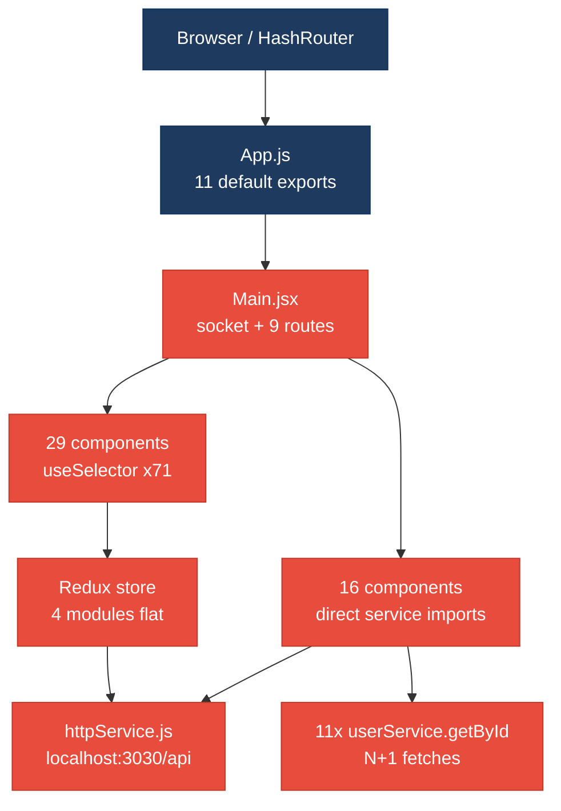
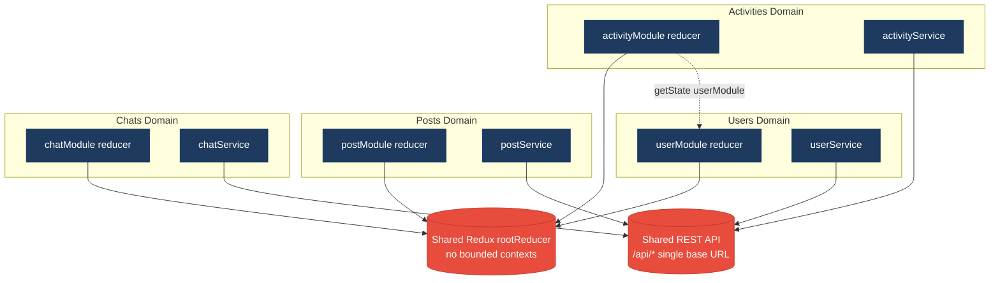
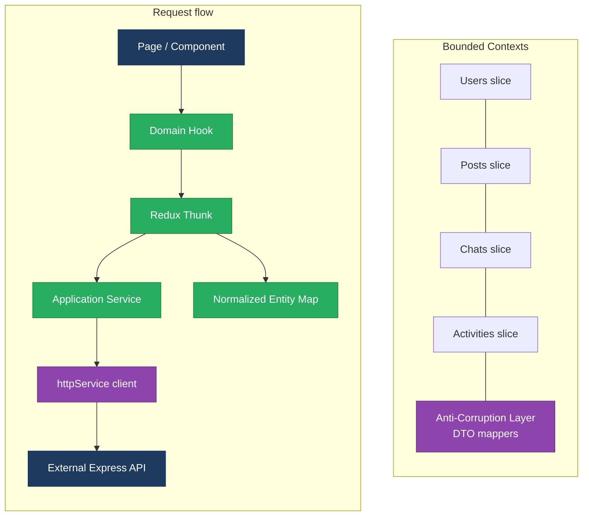
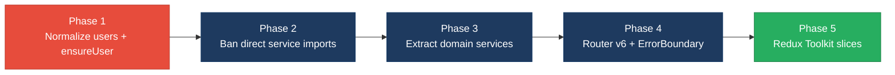

# 1. Architecture & Design Hotspots Analysis

**Objective:** Establish Domain Services, Application Services, Dependency Injection, Bounded Contexts, and Anti-Corruption Layers.

**Date:** Wednesday, July 15, 2026 | **Scope:** `target/` — React 18 (CRA) SPA + Redux frontend; external Node/Express REST API (not in repo)

## Executive Summary

> **Executive Summary**
>
> TARGET_WORKSPACE is a **frontend-only** discovery scope: the primary application is `social-media-react` (React 18, Redux, React Router v5, Axios) with **88** JavaScript/JSX source files across **57** page/component modules; a secondary CRA scaffold `workbench-demo` contributes **8** source files. **No server-side controllers, models, or repositories exist in this workspace** — persistence is delegated to an external Express API at `localhost:3030/api/`. Architecture is **Moderate-to-High Risk** on the frontend: a partial service layer (`src/services/`) is routinely bypassed by **16** components that import services directly, **11** components each re-fetch users via `userService.getById` (N+1 pattern), and **11** files use inconsistent `export default` vs named-export conventions. Backend hotspots H1–H9 are **Not observed** (no server layer present). Overall rating is **High Risk**, driven by **F5** (legacy/inconsistent component patterns) and **H10** (duplicate cross-component data-fetch coupling).

<div class="metric-grid">
<div class="metric-card"><div class="metric-number">0</div><div class="metric-label">Controllers / Handlers</div></div>
<div class="metric-card"><div class="metric-number">4</div><div class="metric-label">Models / Entities</div></div>
<div class="metric-card"><div class="metric-number">11</div><div class="metric-label">Service Classes Found</div></div>
<div class="metric-card"><div class="metric-number">0</div><div class="metric-label">Repository Classes Found</div></div>
</div>

<div class="overall-rating overall-rating--high-risk"><div class="overall-rating-label">Overall Codebase Rating — Architecture &amp; Design</div><div class="overall-rating-value">High Risk</div><div class="overall-rating-note">Driven by High-Risk F5 (legacy/inconsistent component patterns) and H10 (duplicate user-fetch coupling across 11 components).</div></div>

## 1.1 Benchmark Ratings Summary

| # | Hotspot | Primary KPI | <span class="rating rating-good">Good</span> | <span class="rating rating-moderate">Moderate</span> | <span class="rating rating-high-risk">High Risk</span> | Measured | Rating |
|---|---|---|---|---|---|---|---|
| H1 | Fat Controllers | Avg LOC per controller | <150 | 150–300 | >300 | N/A (0 controllers) | <span class="rating rating-good">Good</span> |
| H2 | Missing Service Layer | Controllers accessing repos/models | <10 | 10–20 | >20 | N/A (0 controllers) | <span class="rating rating-good">Good</span> |
| H3 | Missing Repository Pattern | Direct DB access points | <10 | 10–20 | >20 | 0 | <span class="rating rating-good">Good</span> |
| H4 | Circular Dependencies | Dependency cycles | 0 | 1–3 | >3 | 0 detected | <span class="rating rating-good">Good</span> |
| H5 | Shared Utility Abuse | Utility files w/ business logic | 0 | 1–5 | >5 | 0 | <span class="rating rating-good">Good</span> |
| H6 | Direct SQL in Controllers | ORM compliance % | >90% | 60–90% | <60% | N/A (no SQL layer) | <span class="rating rating-good">Good</span> |
| H7 | God Classes | Classes >1000 LOC | 0 | 1–3 | >3 | 0 | <span class="rating rating-good">Good</span> |
| H8 | Domain Boundary Violations | Cross-domain access points | 0 | 1–5 | >5 | N/A (no backend domains) | <span class="rating rating-good">Good</span> |
| H9 | Shared Database Coupling | Tables shared across domains | <10% | 10–30% | >30% | N/A (external API) | <span class="rating rating-good">Good</span> |
| F1 | Business Logic in Components | Avg LOC per component | <150 | 150–300 | >300 | 80 avg (max 250) | <span class="rating rating-good">Good</span> |
| F2 | Missing Frontend Service/Data Layer | Components w/ inline API calls | <10 | 10–20 | >20 | 16 | <span class="rating rating-moderate">Moderate</span> |
| F3 | God / Oversized Components | Components >400 LOC | 0 | 1–3 | >3 | 0 | <span class="rating rating-good">Good</span> |
| F4 | Prop Drilling / Global State Abuse | Max prop-drilling depth | ≤2 | 3–4 | >4 | 3 levels | <span class="rating rating-moderate">Moderate</span> |
| F5 | Legacy / Inconsistent Component Patterns | Legacy-pattern components | 0 | 1–10 | >10 | 11 default-export files | <span class="rating rating-high-risk">High Risk</span> |
| H10 | Duplicate User-Fetch Coupling (additional) | `userService.getById` call sites in UI | <5 | 5–10 | >10 | 11 | <span class="rating rating-high-risk">High Risk</span> |

## 1.2 Hotspot-by-Hotspot Evidence

### H1. Fat Controllers <span class="sev sev-low">Low</span>

**Benchmark:** `Avg LOC per controller = N/A (0 files)` → falls in the **Good** band (Good <150 · Moderate 150–300 · High Risk >300).

**What to check:** Business logic inside controllers/handlers; controllers should only translate HTTP ↔ application calls.

**Evidence:** Not observed — no server-side controllers, route handlers, or API modules exist under `target/`; the React SPA calls an external Express backend via `httpService.js`.

### H2. Missing Service Layer <span class="sev sev-low">Low</span>

**Benchmark:** `Controllers accessing repos/models = 0` → falls in the **Good** band (Good <10 · Moderate 10–20 · High Risk >20).

**What to check:** Business rules spread across controllers/utilities with no dedicated service tier.

**Evidence:** Not observed — no backend entry points in TARGET_WORKSPACE. Frontend analogue is covered under **F2**.

### H3. Missing Repository Pattern <span class="sev sev-low">Low</span>

**Benchmark:** `Direct DB access points = 0` → falls in the **Good** band (Good <10 · Moderate 10–20 · High Risk >20).

**What to check:** Direct DB/ORM access scattered through the codebase.

**Evidence:** Not observed — no ORM, query builder, or raw SQL in this workspace; all persistence goes through Axios in `src/services/`.

### H4. Circular Dependencies <span class="sev sev-low">Low</span>

**Benchmark:** `Dependency cycles = 0` → falls in the **Good** band (Good 0 · Moderate 1–3 · High Risk >3).

**What to check:** Modules/packages importing each other in cycles.

**Evidence:** Not observed — static import graph across 88 `src/` files has 137 edges; no circular import cycles were detected via dependency graph scan.

### H5. Shared Utility Abuse <span class="sev sev-low">Low</span>

**Benchmark:** `Utility files w/ business logic = 0` → falls in the **Good** band (Good 0 · Moderate 1–5 · High Risk >5).

**What to check:** Large common/helper files holding business logic.

**Evidence:** Not observed — `utilService.js` (119 LOC) contains only generic helpers (`makeId`, `debounce`, storage wrappers); no domain workflows.

### H6. Direct SQL in Controllers <span class="sev sev-low">Low</span>

**Benchmark:** `ORM compliance = N/A` → falls in the **Good** band (Good >90% · Moderate 60–90% · High Risk <60%).

**What to check:** Raw queries embedded directly in controllers/handlers.

**Evidence:** Not observed — no SQL strings or query builders anywhere in TARGET_WORKSPACE.

### H7. God Classes <span class="sev sev-low">Low</span>

**Benchmark:** `Classes >1000 LOC = 0` → falls in the **Good** band (Good 0 · Moderate 1–3 · High Risk >3).

**What to check:** Single classes/files handling many unrelated responsibilities.

**Evidence:** Not observed — largest source file is `Message.jsx` at 250 LOC; no file exceeds 1000 LOC.

### H8. Domain Boundary Violations <span class="sev sev-low">Low</span>

**Benchmark:** `Cross-domain access points = N/A` → falls in the **Good** band (Good 0 · Moderate 1–5 · High Risk >5).

**What to check:** Code in one business area directly reading/writing another area's data or models.

**Evidence:** Not observed at the backend layer. Frontend cross-module Redux reads (e.g. `activityAction.js` reading `userModule`) are noted under **H10** and the domain diagram in §1.3.

### H9. Shared Database Coupling <span class="sev sev-low">Low</span>

**Benchmark:** `Tables shared across domains = N/A` → falls in the **Good** band (Good <10% · Moderate 10–30% · High Risk >30%).

**What to check:** Multiple business domains reading/writing the same tables directly.

**Evidence:** Not observed — database schema is not in this repo. All four frontend domains (users, posts, chats, activities) share one external REST API base URL (`httpService.js`), which is an integration coupling risk but not measurable as table overlap.

### F1. Business Logic in Components <span class="sev sev-medium">Medium</span>

**Benchmark:** `Avg LOC per component = 80` (57 files, 4540 LOC total; max 250) → falls in the **Good** band (Good <150 · Moderate 150–300 · High Risk >300).

**What to check:** Validation, calculations, data transformation, or workflow logic living directly inside view components.

**Evidence:**

`target/social-media-react/src/pages/Profile.jsx:60-99` — `connectProfile` mutates bidirectional connection arrays, deep-clones users, and dispatches two `updateUser` actions inline instead of delegating to a connection service.

```javascript
const connectProfile = async () => {
  if (isConnected === true) {
    const connectionToRemve = JSON.parse(JSON.stringify(user))
    const loggedInUserToUpdate = JSON.parse(JSON.stringify(loggedInUser))
    loggedInUserToUpdate.connections =
      loggedInUserToUpdate.connections.filter(
        (connection) => connection.userId !== connectionToRemve._id
      )
    connectionToRemve.connections = connectionToRemve.connections.filter(
      (connection) => connection.userId !== loggedInUserToUpdate._id
    )
    dispatch(updateUser(loggedInUserToUpdate))
    dispatch(updateUser(connectionToRemve))
```

This is a multi-entity workflow with graph-mutation rules embedded in a page component.

`target/social-media-react/src/cmps/comments/CommentPreview.jsx:38-55` — like-toggle logic builds reaction arrays and calls `onSaveComment` from the view layer.

```javascript
const onLikeComment = () => {
  const commentToSave = { ...comment }
  const isAlreadyLike = commentToSave.reactions.some(
    (reaction) => reaction.userId === loggedInUser._id
  )
  if (isAlreadyLike) {
    commentToSave.reactions = commentToSave.reactions.filter(
      (reaction) => reaction.userId !== loggedInUser._id
    )
  } else if (!isAlreadyLike) {
    commentToSave.reactions.push({
      userId: loggedInUser._id,
      fullname: loggedInUser.fullname,
      reaction: 'like',
    })
  }
  onSaveComment(commentToSave)
}
```

Reaction-toggle business rules are duplicated in `PostPreview.jsx` (lines 65–92) with the same pattern.

**Why it matters here:** Connection and reaction workflows are copy-pasted across `Profile`, `PostPreview`, and `CommentPreview`. Any rule change (e.g. mutual-connection validation) requires editing multiple unrelated UI files and risks inconsistent behavior between feed posts and profile connections.

**Recommended approach:**
1. Extract `ConnectionService.connect/disconnect(loggedInUser, targetUser)` from `Profile.jsx`.
2. Extract `ReactionService.toggleLike(entity, loggedInUser)` shared by posts and comments.
3. Move reply creation in `CommentPreview` (lines 61–78) into `commentService.addReply`.

<!-- affected-files
search: JSON\.parse\(JSON\.stringify|reactions\.(some|filter|push)
glob: target/social-media-react/src/**/*.{jsx,js}
issue: Business workflow logic embedded in view components
action: Extract to domain hooks or application services (ConnectionService, ReactionService)
-->

### F2. Missing Frontend Service/Data Layer <span class="sev sev-high">High</span>

**Benchmark:** `Components w/ inline API/data-access calls = 16` → falls in the **Moderate** band (Good <10 · Moderate 10–20 · High Risk >20).

**What to check:** `fetch`/`axios`/HTTP calls and API URLs hard-coded inline in components instead of a shared client/service/data layer.

**Evidence:**

`target/social-media-react/src/pages/Profile.jsx:6,44-46` — page imports `userService` and calls `getById` directly, bypassing Redux thunks used elsewhere.

```javascript
import { userService } from '../services/user/userService'
// ...
const loadUser = async () => {
  const user = await userService.getById(params.userId)
  setUser(() => user)
}
```

`target/social-media-react/src/cmps/notifications/NotificaitonPreview.jsx:3-6,31-53` — notification component imports both `userService` and `postService`, performing up to three API calls per activity render.

```javascript
import { userService } from '../../services/user/userService'
import { postService } from '../../services/posts/postService'
// ...
const user = await userService.getById(userId)
// ...
const post = await postService.getById(activity.postId)
```

Across `src/cmps` and `src/pages`, **16 files** import from `services/` directly while Redux actions in `src/store/actions/` already wrap the same services — a split-brain data-access pattern.

**Why it matters here:** Components that bypass thunks do not benefit from centralized loading/error state, cache invalidation, or socket-sync logic wired in `postActions.js` and `Main.jsx`. Adding a new API endpoint requires hunting through both action files and scattered component imports.

**Recommended approach:**
1. Add `loadUserById(userId)` thunk to `userActions.js`; replace direct calls in `Profile.jsx`, `Message.jsx`, and preview components.
2. Add `loadPostForActivity(postId)` thunk or selector-backed cache in `postActions.js` for `NotificaitonPreview.jsx`.
3. Enforce lint rule: components may only import from `store/actions`, never from `services/` directly.

<!-- affected-files
search: from ['\"].*services/
glob: target/social-media-react/src/{cmps,pages}/**/*.{jsx,js}
issue: Components bypass Redux action/service layer with direct service imports
action: Route data access through Redux thunks or dedicated hooks; ban direct service imports in views
-->

### F3. God / Oversized Components <span class="sev sev-low">Low</span>

**Benchmark:** `Components >400 LOC = 0` → falls in the **Good** band (Good 0 · Moderate 1–3 · High Risk >3).

**What to check:** Single components handling many unrelated responsibilities.

**Evidence:** Not observed — largest components are `Message.jsx` (250 LOC), `CreatePostModal.jsx` (229 LOC), and `Signup.jsx` (220 LOC); all under the 400 LOC threshold.

### F4. Prop Drilling / Global State Abuse <span class="sev sev-medium">Medium</span>

**Benchmark:** `Max prop-drilling depth = 3 levels` → falls in the **Moderate** band (Good ≤2 · Moderate 3–4 · High Risk >4).

**What to check:** Props threaded through many intermediate layers, or one giant global store everything reads & writes.

**Evidence:**

`target/social-media-react/src/cmps/posts/AddPost.jsx:63-68` — `loggedInUser`, `onAddPost`, and modal toggles drilled into `CreatePostModal` (depth 2).

```javascript
<CreatePostModal
  isShowCreatePost={isShowCreatePost}
  toggleShowCreatePost={toggleShowCreatePost}
  onAddPost={onAddPost}
  loggedInUser={loggedInUser}
/>
```

`target/social-media-react/src/cmps/posts/post-preview/PostPreview.jsx:110-137` — six discrete post fields drilled into `PostBody`; `loggedInUser` drilled into `PostActions`; comments subtree adds a third hop (`PostPreview` → `Comments` → `CommentPreview`).

```javascript
<PostBody
  body={post.body}
  imgUrl={post.imgBodyUrl}
  videoUrl={post.videoBodyUrl}
  link={post.link}
  title={post.title}
  toggleShowImgPreview={toggleShowImgPreview}
/>
<PostActions
  post={post}
  onToggleShowComment={onToggleShowComment}
  onLikePost={onLikePost}
  loggedInUser={loggedInUser}
  onSharePost={onSharePost}
/>
```

Global state: **4 Redux modules** (`postModule`, `userModule`, `chatModule`, `activityModule`) are read from **29 files** via `useSelector` (71 total selector calls), with no slice isolation or context boundaries.

**Why it matters here:** Deep prop chains on post previews force every intermediate component to re-render when callbacks change; the monolithic Redux root means activity, chat, and post reducers are reachable from any component, amplifying coupling.

**Recommended approach:**
1. Pass whole `post` object to `PostBody` instead of six individual props.
2. Introduce `useLoggedInUser()` context hook to eliminate `loggedInUser` prop drilling.
3. Consider Redux Toolkit slices with colocated selectors per domain.

<!-- affected-files
search: loggedInUser=\{loggedInUser\}
glob: target/social-media-react/src/**/*.{jsx,js}
issue: loggedInUser and post fields drilled through component trees
action: Introduce context hooks or pass composite objects; colocate selectors
-->

### F5. Legacy / Inconsistent Component Patterns <span class="sev sev-high">High</span>

**Benchmark:** `Legacy-pattern components = 11 default-export files` → falls in the **High Risk** band (Good 0 · Moderate 1–10 · High Risk >10).

**What to check:** Mixed paradigms, missing error boundaries, deprecated lifecycle/APIs, no shared component conventions.

**Evidence:**

`target/social-media-react/src/App.js:13,36` — root app uses `export default` while **73** other modules use named exports (`export const` / `export function`), creating inconsistent import styles.

```javascript
const App = () => { /* ... */ }
export default App
```

`target/social-media-react/src/pages/Main.jsx:148-158` — nine routes use React Router v5 `component={Feed}` render-prop pattern (deprecated in v6), mixing `lazy()` imports with legacy `PrivateRoute component=` API.

```javascript
<PrivateRoute path="/main/feed" component={Feed} />
<PrivateRoute path="/main/post/:userId/:postId" component={SpecificPost} />
<PrivateRoute path="/main/profile/:userId" component={Profile} />
```

`target/social-media-react/src/hooks/useFormRegister.js.js` — double `.js` extension and inconsistent hook naming vs `useForm.js` / `useEffectUpdate.js`.

**Why it matters here:** Mixed export conventions force developers to guess import style per file; Router v5 `component=` props block migration to React Router v6 `element=` without touching every route in `Main.jsx` and `App.js`. No `ErrorBoundary` components exist anywhere in `src/`.

**Recommended approach:**
1. Standardize on named exports; convert 11 `export default` pages (`Profile`, `Feed`, `App`, etc.) to named exports.
2. Plan React Router v6 migration starting with `Main.jsx` route table.
3. Add a top-level `ErrorBoundary` wrapping `<Suspense>` in `Main.jsx`.
4. Rename `useFormRegister.js.js` → `useFormRegister.js`.

<!-- affected-files
search: ^export default
glob: target/social-media-react/src/**/*.{jsx,js}
issue: Inconsistent default vs named export pattern
action: Standardize on named exports and shared component conventions
-->

### H10. Duplicate User-Fetch Coupling (additional) <span class="sev sev-critical">Critical</span>

**Benchmark:** `userService.getById call sites in UI = 11` → falls in the **High Risk** band (Good <5 · Moderate 5–10 · High Risk >10).

**What to check:** Feature-envy pattern where many unrelated components independently fetch the same entity type without shared cache or selector.

**Evidence:**

`target/social-media-react/src/cmps/posts/post-preview/PostPreview.jsx:41-44` — every post card fetches its author on mount.

```javascript
const loadUserPost = async (id) => {
  if (!post) return
  const userPost = await userService.getById(id)
  setUserPost(() => userPost)
}
```

`target/social-media-react/src/cmps/LikePreview.jsx:11-13` — like list items each fire independent `getById` calls.

```javascript
const userPost = await userService.getById(id)
```

The same `userService.getById` pattern appears in **11 components** (`Profile`, `Message`, `PostPreview`, `CommentPreview`, `ReplyPreview`, `LikePreview`, `ThreadMsgPreview`, `NotificaitonPreview`, `MyConnectionPreview`, `ImgPreview`, plus `PrivateRoute` reading session). A feed with 20 posts can trigger 20+ redundant user API calls.

**Why it matters here:** N+1 user fetches inflate API load and cause waterfall rendering (post shell renders before author name loads). Normalizing users into the Redux `userModule` entity map would let `PostPreview` select by `post.userId` without network round-trips.

**Recommended approach:**
1. Add `usersById` normalized map to `userReducer`.
2. Create `ensureUser(userId)` thunk with in-flight deduplication.
3. Replace all 11 component-level `getById` calls with `useSelector(state => state.userModule.usersById[id])` + dispatch `ensureUser` when missing.

<!-- affected-files
search: userService\.getById
glob: target/social-media-react/src/**/*.{jsx,js}
issue: Duplicate per-component userService.getById fetches (N+1 API pattern)
action: Normalize users in Redux; add ensureUser thunk with request deduplication
-->

## 1.3 Diagrams

### Current-state architecture (as-is)


### Clean reference path (target pattern found in codebase, if any)


### Domain boundary map (business domains found vs. shared data)


### Target architecture (proposed)


### Improvement roadmap


## 1.4 Actions Required

| Hotspot | Action | Rating | Priority |
|---|---|---|---|
| H10 | Add `usersById` entity map and `ensureUser` thunk; replace 11 component-level `userService.getById` calls with selector + deduplicated fetch | <span class="rating rating-high-risk">High Risk</span> | <span class="sev sev-critical">Critical</span> |
| F5 | Standardize named exports across 11 default-export files; add `ErrorBoundary`; plan React Router v6 migration | <span class="rating rating-high-risk">High Risk</span> | <span class="sev sev-high">High</span> |
| F2 | Route all component data access through Redux thunks; add ESLint rule banning `services/` imports in `cmps/` and `pages/` | <span class="rating rating-moderate">Moderate</span> | <span class="sev sev-high">High</span> |
| F4 | Introduce `useLoggedInUser` context; pass composite `post` object to children; reduce 3-level prop chains | <span class="rating rating-moderate">Moderate</span> | <span class="sev sev-medium">Medium</span> |

## 1.5 Expected Outcomes

- Eliminating N+1 user fetches will cut API traffic on feed/notifications pages by an order of magnitude and remove per-card loading flicker.
- Enforcing thunk-only data access creates a single place for loading states, error handling, and socket invalidation.
- Extracting connection and reaction workflows into shared services removes duplicated business rules across `Profile`, `PostPreview`, and `CommentPreview`.
- Standardizing exports and migrating to React Router v6 reduces onboarding friction and enables modern data-router patterns.
- Redux Toolkit slices with normalized entities establish bounded contexts that prepare the app for feature-level code splitting or micro-frontend extraction.
