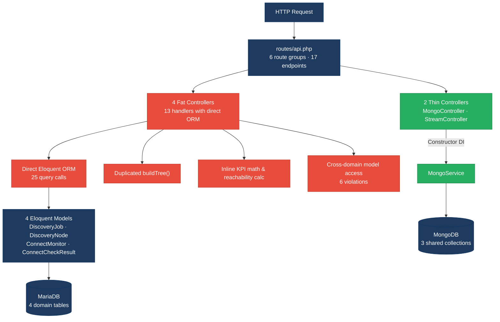
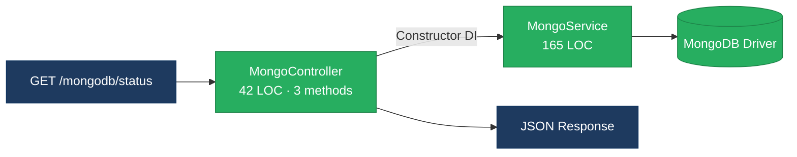
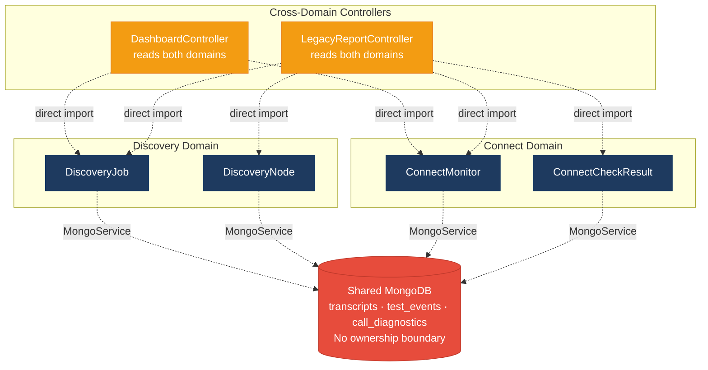
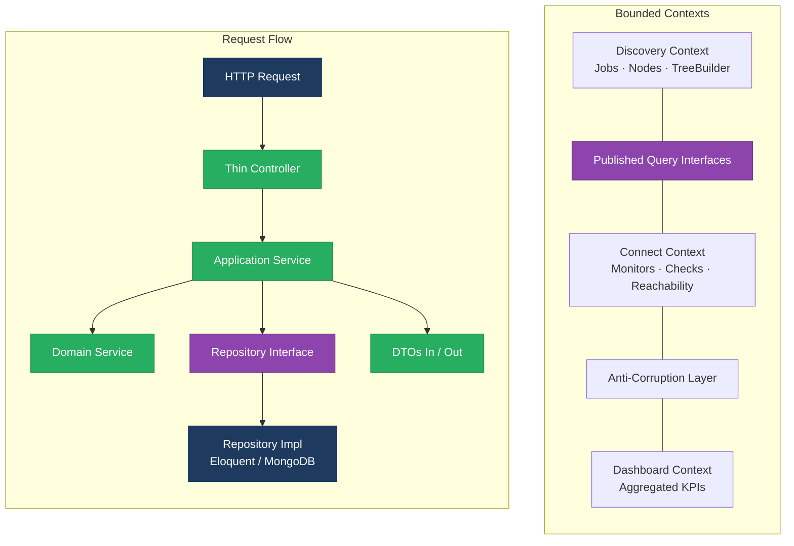
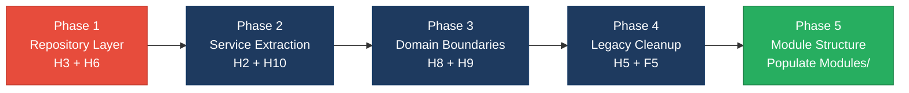

# 1. Architecture & Design Hotspots Analysis

**Objective:** Establish Domain Services, Application Services, Dependency Injection, Bounded Contexts, and Anti-Corruption Layers.

**Date:** 2026-08-14 15:02:42 IST | **Scope:** `shende-shweta/FSDKC` — PHP 8.3 / Laravel 12 (backend, 15 files), React 19 / TypeScript / Vite with Zustand + React Query (frontend, 15 files), Node.js / Express dev-API mock (6 files)

## Executive Summary

> **Executive Summary**
>
> The Klearcom platform is a monorepo with a Laravel 12 backend, a React 19 SPA frontend, and a Node.js development API. Backend controllers are small in line count (average 74 LOC) but 4 of 6 embed business logic — KPI aggregation, reachability calculations, and report generation — directly against Eloquent models with zero repository abstraction (35 direct ORM access points). Two distinct business algorithms (reachability formula and IVR tree builder) are copy-pasted across 7 locations spanning PHP and JavaScript. The Discovery and Connect domains share three MongoDB collections with no ownership boundary, and cross-domain controllers read models from both domains without an anti-corruption layer. The frontend is architecturally cleaner — React Query and a shared API client handle data access — but two legacy components (one class component with an interval leak, one bypassing React Query) introduce inconsistency. The dominant risk is **change amplification**: modifying the reachability formula or the tree-building algorithm requires synchronized edits across controllers, services, and the dev-API, with no compile-time or test-time guard against drift.

<div class="metric-grid">
<div class="metric-card"><div class="metric-number">6</div><div class="metric-label">Controllers / Handlers</div></div>
<div class="metric-card"><div class="metric-number">4</div><div class="metric-label">Models / Entities</div></div>
<div class="metric-card"><div class="metric-number">2</div><div class="metric-label">Service Classes Found</div></div>
<div class="metric-card"><div class="metric-number">0</div><div class="metric-label">Repository Classes Found</div></div>
</div>

<div class="overall-rating overall-rating--high-risk"><div class="overall-rating-label">Overall Codebase Rating — Architecture &amp; Design</div><div class="overall-rating-value">High Risk</div><div class="overall-rating-note">Driven by High-Risk Missing Repository Pattern (H3), Direct ORM in Controllers (H6), Domain Boundary Violations (H8), Shared Database Coupling (H9), and Duplicated Business Logic (H10).</div></div>

## 1.1 Benchmark Ratings Summary

| # | Hotspot | Primary KPI | <span class="rating rating-good">Good</span> | <span class="rating rating-moderate">Moderate</span> | <span class="rating rating-high-risk">High Risk</span> | Measured | Rating |
|---|---|---|---|---|---|---|---|
| H1 | Fat Controllers | Avg LOC per controller | <150 | 150–300 | >300 | 74 LOC | <span class="rating rating-good">Good</span> |
| H2 | Missing Service Layer | Controller methods accessing models directly | <10 | 10–20 | >20 | 13 | <span class="rating rating-moderate">Moderate</span> |
| H3 | Missing Repository Pattern | Direct ORM access points outside repositories | <10 | 10–20 | >20 | 35 (0 repos) | <span class="rating rating-high-risk">High Risk</span> |
| H4 | Circular Dependencies | Dependency cycles | 0 | 1–3 | >3 | 0 | <span class="rating rating-good">Good</span> |
| H5 | Shared Utility Abuse | Utility files w/ business logic | 0 | 1–5 | >5 | 1 | <span class="rating rating-moderate">Moderate</span> |
| H6 | Direct ORM in Controllers | ORM compliance % (queries outside controllers) | >90% | 60–90% | <60% | 29% | <span class="rating rating-high-risk">High Risk</span> |
| H7 | God Classes | Classes >1000 LOC | 0 | 1–3 | >3 | 0 | <span class="rating rating-good">Good</span> |
| H8 | Domain Boundary Violations | Cross-domain access points | 0 | 1–5 | >5 | 6 | <span class="rating rating-high-risk">High Risk</span> |
| H9 | Shared Database Coupling | Tables/collections shared across domains | <10% | 10–30% | >30% | 43% (3/7) | <span class="rating rating-high-risk">High Risk</span> |
| H10 | Duplicated Business Logic (additional) | Duplicated algorithm instances | 0 | 1–3 | >3 | 7 (2 algorithms) | <span class="rating rating-high-risk">High Risk</span> |
| F1 | Business Logic in Components | Avg LOC per component | <150 | 150–300 | >300 | 86 LOC | <span class="rating rating-good">Good</span> |
| F2 | Missing Frontend Service/Data Layer | Components w/ inline API calls | <10 | 10–20 | >20 | 2 | <span class="rating rating-good">Good</span> |
| F3 | God / Oversized Components | Components >400 LOC | 0 | 1–3 | >3 | 0 | <span class="rating rating-good">Good</span> |
| F4 | Prop Drilling / Global State Abuse | Max prop-drilling depth | ≤2 | 3–4 | >4 | 2 | <span class="rating rating-good">Good</span> |
| F5 | Legacy / Inconsistent Component Patterns | Legacy-pattern components | 0 | 1–10 | >10 | 2 | <span class="rating rating-moderate">Moderate</span> |

No additional hotspots beyond H10 were observed.

## 1.2 Hotspot-by-Hotspot Evidence

### H2. Missing Service Layer <span class="sev sev-high">High</span>

**Benchmark:** `Controller methods accessing models directly = 13` → falls in the **Moderate** band (Good <10 · Moderate 10–20 · High Risk >20).

**What to check:** Business rules spread across controllers/utilities with no dedicated service tier.

**Evidence:**

13 of 18 route-handler methods access Eloquent models directly instead of delegating to a service. Only `MongoController` (3 methods) and `StreamController` (2 methods) consistently delegate to `MongoService`.

`backend/app/Http/Controllers/Api/DashboardController.php:12-37` — all 8 Eloquent queries that compose the KPI payload are inline in a single controller method:

```php
public function kpis(): JsonResponse
{
    $discoveryTotal = DiscoveryJob::count();
    $discoveryCompleted = DiscoveryJob::where('status', 'completed')->count();
    $connectMonitors = ConnectMonitor::count();
    $avgReachability = ConnectMonitor::avg('reachability_pct') ?? 0;
    $alerts = ConnectMonitor::where('status', 'alert')->count();
    // ... 3 more model calls follow
}
```

`backend/app/Http/Controllers/Api/ConnectController.php:57-85` — the `checks()` method queries, aggregates, and computes reachability percentage inline:

```php
public function checks(int $id): JsonResponse
{
    $recentChecks = ConnectCheckResult::where('connect_monitor_id', $id)
        ->orderByDesc('checked_at')
        ->limit(20)
        ->get();
    $successRate = $recentChecks->count() > 0
        ? ($recentChecks->where('reachable', true)->count() / $recentChecks->count()) * 100
        : 100;
    $computedStatus = $successRate < 90 ? 'alert' : 'active';
}
```

`backend/app/Http/Controllers/Api/LegacyReportController.php:19-53` — the `carrierSummary()` method performs filtering, iteration, nested model queries, and business math inline:

```php
public function carrierSummary(Request $request): JsonResponse
{
    $filters = $request->all();
    extract($filters);
    $monitors = ConnectMonitor::query()
        ->when(isset($country_code), fn ($q) => $q->where('country_code', $country_code))
        ->when(isset($carrier), fn ($q) => $q->where('carrier', $carrier))
        ->orderByDesc('reachability_pct')
        ->get();
    foreach ($monitors as $monitor) {
        $recent = ConnectCheckResult::where('connect_monitor_id', $monitor->id)
            ->orderByDesc('checked_at')->limit(20)->get();
        // ... reachability calculation duplicated here
    }
}
```

**Why it matters here:** Adding a new entry point (CLI command, scheduled job, or webhook) that needs the same KPI aggregation, reachability calculation, or carrier summary requires copying the logic from these controllers — there is no service to call. The `RealTimeTestService` already duplicates the reachability formula, proving this is happening in practice.

**Recommended approach:**
1. Create `ConnectService` and `DiscoveryService` application services that own domain workflows (reachability calculation, KPI aggregation, carrier summaries).
2. Move all business logic from `ConnectController`, `DashboardController`, and `LegacyReportController` into the appropriate service.
3. Keep controllers under 5 LOC per method: validate input, call service, return response.

<!-- affected-files
search: (DiscoveryJob|DiscoveryNode|ConnectMonitor|ConnectCheckResult)::(where|find|create|count|avg|query|distinct|orderBy|with)
glob: backend/app/Http/Controllers/**/*.php
issue: Business logic and ORM queries inline in controller
action: Extract to application service
-->

### H3. Missing Repository Pattern <span class="sev sev-critical">Critical</span>

**Benchmark:** `Direct ORM access points outside repositories = 35` → falls in the **High Risk** band (Good <10 · Moderate 10–20 · High Risk >20).

**What to check:** Direct DB/ORM access scattered through the codebase with no repository abstraction.

**Evidence:**

Zero repository classes exist anywhere in the codebase. All 35 Eloquent access points (25 in controllers, 10 in `RealTimeTestService`) call models directly. The `MongoService` wraps MongoDB driver calls but is not a repository — it is a general-purpose data-access service covering three unrelated collections.

`backend/app/Http/Controllers/Api/DashboardController.php:14-34` — 8 distinct Eloquent static calls against 2 different models in a single method:

```php
$discoveryTotal = DiscoveryJob::count();
$discoveryCompleted = DiscoveryJob::where('status', 'completed')->count();
$connectMonitors = ConnectMonitor::count();
$avgReachability = ConnectMonitor::avg('reachability_pct') ?? 0;
$alerts = ConnectMonitor::where('status', 'alert')->count();
// ... plus 3 more
```

`backend/app/Services/RealTimeTestService.php:24-73` — the service that should abstract business workflows instead makes 10 direct Eloquent calls:

```php
$job = DiscoveryJob::findOrFail($jobId);
$job->update(['status' => 'running', 'started_at' => now()]);
// ...
$node = DiscoveryNode::create([...]);
// ...
$nodeCount = DiscoveryNode::where('discovery_job_id', $jobId)->count();
$job->update(['status' => 'completed', ...]);
```

`backend/app/Http/Controllers/Api/LegacyReportController.php:34-37` — nested Eloquent queries inside a `foreach` loop in a controller, each iteration hitting the database:

```php
foreach ($monitors as $monitor) {
    $recent = ConnectCheckResult::where('connect_monitor_id', $monitor->id)
        ->orderByDesc('checked_at')
        ->limit(20)
        ->get();
}
```

**Why it matters here:** Every test must hit the database (or mock Eloquent globally) because there is no seam to inject a fake. Switching from MariaDB to a different RDBMS or changing the MongoDB collection schema requires editing controllers and services simultaneously. The 35 access points scattered across 8 files make schema changes high-risk and error-prone.

**Recommended approach:**
1. Create `DiscoveryJobRepository`, `DiscoveryNodeRepository`, `ConnectMonitorRepository`, and `ConnectCheckResultRepository` interfaces in `app/Repositories/`.
2. Implement each with Eloquent (e.g., `EloquentConnectMonitorRepository`).
3. Bind interfaces to implementations in `AppServiceProvider`.
4. Replace all direct `Model::` calls in controllers and services with injected repository methods.

<!-- affected-files
search: (DiscoveryJob|DiscoveryNode|ConnectMonitor|ConnectCheckResult)::(where|find|create|count|avg|query|distinct|orderBy|with|update)
glob: backend/app/**/*.php
issue: Direct Eloquent ORM access with no repository layer
action: Move to repository implementation
-->

### H5. Shared Utility Abuse <span class="sev sev-medium">Medium</span>

**Benchmark:** `Utility files with business logic = 1` → falls in the **Moderate** band (Good 0 · Moderate 1–5 · High Risk >5).

**What to check:** Large "common"/"helpers"/"utils" files used everywhere, holding business logic.

**Evidence:**

`backend/app/Legacy/LegacyDataMapper.php:10-32` — a data-mapping utility that uses PHP's unsafe `extract()` to destructure arrays into local variables, then applies business transformation logic (label assignment, metric computation, region mapping):

```php
public function mapReportRow(array $row): array
{
    extract($row, EXTR_SKIP);
    return [
        'label' => $name ?? 'Unknown',
        'metric' => $reachability_pct ?? 0,
        'region' => $country_code ?? 'N/A',
        'source' => 'legacy_extract_mapper',
    ];
}
```

`backend/app/Legacy/LegacyDataMapper.php:22-31` — `mapJobContext()` uses `extract()` without `EXTR_SKIP`, allowing arbitrary array keys to overwrite local variables:

```php
public function mapJobContext(array $context): array
{
    extract($context);  // No EXTR_SKIP — variable injection risk
    return [
        'job_name' => $job_name ?? null,
        'phone' => $phone_number ?? null,
        'depth' => $menu_depth ?? 0,
    ];
}
```

The `extract()` pattern is also used in `LegacyReportController::carrierSummary()` (line 22) where `$request->all()` output is extracted directly into the local scope — any request parameter becomes a PHP variable.

**Why it matters here:** `LegacyDataMapper` is called from `LegacyReportController` and mixes generic utility concerns (array-to-array mapping) with domain knowledge (field names, default values, the `source` tag). The `extract()` usage is a known PHP anti-pattern that obscures data flow and introduces variable-injection risk, especially when combined with unvalidated request data in the controller.

**Recommended approach:**
1. Replace `extract()` calls with explicit array destructuring or typed DTOs (e.g., `CarrierReportRow`, `JobContext`).
2. Move the business-specific mapping logic into the relevant application service (`ConnectService` or `DiscoveryService`).
3. If a generic mapper is needed, make it stateless and data-shape-agnostic — no hardcoded field names.

<!-- affected-files
search: extract\(
glob: backend/app/**/*.php
issue: Unsafe extract() with business logic in utility
action: Replace with explicit destructuring or typed DTO
-->

### H6. Direct ORM in Controllers <span class="sev sev-critical">Critical</span>

**Benchmark:** `ORM compliance (queries outside controllers) = 29%` → falls in the **High Risk** band (Good >90% · Moderate 60–90% · High Risk <60%).

**What to check:** ORM queries and query-builder chains embedded directly in controllers/handlers rather than in repositories or services.

**Evidence:**

Of ~35 Eloquent query calls across the backend, 25 are in controller methods and only 10 are in services. This means 71% of all data access happens in the HTTP-handling layer.

`backend/app/Http/Controllers/Api/DashboardController.php:14-34` — the entire method body is a sequence of ORM queries with inline arithmetic:

```php
$discoveryTotal = DiscoveryJob::count();
$discoveryCompleted = DiscoveryJob::where('status', 'completed')->count();
$connectMonitors = ConnectMonitor::count();
$avgReachability = ConnectMonitor::avg('reachability_pct') ?? 0;
$alerts = ConnectMonitor::where('status', 'alert')->count();
// ... 3 more direct queries
```

`backend/app/Http/Controllers/Api/LegacyReportController.php:24-37` — query builder with conditional clauses and a nested query loop:

```php
$monitors = ConnectMonitor::query()
    ->when(isset($country_code), fn ($q) => $q->where('country_code', $country_code))
    ->when(isset($carrier), fn ($q) => $q->where('carrier', $carrier))
    ->orderByDesc('reachability_pct')
    ->get();
foreach ($monitors as $monitor) {
    $recent = ConnectCheckResult::where('connect_monitor_id', $monitor->id)
        ->orderByDesc('checked_at')->limit(20)->get();
}
```

`backend/app/Http/Controllers/Api/ConnectController.php:60-69` — two separate queries and a manual aggregation in the `checks()` handler:

```php
$checks = ConnectCheckResult::where('connect_monitor_id', $id)
    ->orderByDesc('checked_at')->limit(50)->get();
$recentChecks = ConnectCheckResult::where('connect_monitor_id', $id)
    ->orderByDesc('checked_at')->limit(20)->get();
$successRate = $recentChecks->count() > 0
    ? ($recentChecks->where('reachable', true)->count() / $recentChecks->count()) * 100
    : 100;
```

**Why it matters here:** Controllers cannot be tested without a database connection (or a global Eloquent mock). The query logic is tightly coupled to the HTTP layer, so adding a CLI command or queue job that needs the same data requires duplicating the queries. The nested loop in `carrierSummary()` is an N+1 query pattern that will degrade as the monitor count grows — but it cannot be optimized behind a repository because the query lives in the controller.

**Recommended approach:**
1. Introduce repository interfaces and move all Eloquent queries into repository implementations (ties to H3 fix).
2. Create application services that compose repository calls and business logic.
3. Reduce controllers to: validate → call service → return response.
4. Replace the N+1 loop in `LegacyReportController::carrierSummary()` with an eager-loaded query in the repository.

<!-- affected-files
search: (DiscoveryJob|DiscoveryNode|ConnectMonitor|ConnectCheckResult)::(where|find|create|count|avg|query|distinct|orderBy|with)
glob: backend/app/Http/Controllers/**/*.php
issue: ORM queries embedded in controller layer
action: Move to repository; controller calls service only
-->

### H8. Domain Boundary Violations <span class="sev sev-high">High</span>

**Benchmark:** `Cross-domain access points = 6` → falls in the **High Risk** band (Good 0 · Moderate 1–5 · High Risk >5).

**What to check:** Code in one business area directly reading/writing another area's data or models.

**Evidence:**

The codebase has two clear business domains: **Discovery** (IVR traversal: `DiscoveryJob`, `DiscoveryNode`) and **Connect** (TFN reachability: `ConnectMonitor`, `ConnectCheckResult`). Two controllers reach across both domains with no interface or anti-corruption layer.

`backend/app/Http/Controllers/Api/DashboardController.php:14-34` — reads from both domains in a single method, coupling Dashboard directly to both Discovery and Connect model schemas:

```php
$discoveryTotal = DiscoveryJob::count();                          // Discovery domain
$discoveryCompleted = DiscoveryJob::where('status', 'completed')->count(); // Discovery
$connectMonitors = ConnectMonitor::count();                       // Connect domain
$avgReachability = ConnectMonitor::avg('reachability_pct') ?? 0;  // Connect domain
```

`backend/app/Http/Controllers/Api/LegacyReportController.php:19-75` — `carrierSummary()` reads Connect-domain models (`ConnectMonitor`, `ConnectCheckResult`) while `ivrDepthReport()` reads Discovery-domain models (`DiscoveryJob`, `DiscoveryNode`), all in the same controller with no domain boundary:

```php
// carrierSummary — Connect domain
$monitors = ConnectMonitor::query()->when(...)->get();
$recent = ConnectCheckResult::where('connect_monitor_id', $monitor->id)->...;

// ivrDepthReport — Discovery domain
$job = DiscoveryJob::findOrFail($jobId);
$nodes = DiscoveryNode::where('discovery_job_id', $jobId)->get();
```

The empty `app/Modules/Connect/` and `app/Modules/Discovery/` directories (containing only `AGENTS.md` placeholder files) indicate an intent to modularize that was never completed. The frontend mirrors this with empty `src/modules/Connect/` and `src/modules/Discovery/` directories.

**Why it matters here:** Extracting either domain into a separate service or package is blocked by these cross-domain couplings. A schema change to `connect_monitors` (e.g., renaming `reachability_pct`) would break both the Connect controllers and the Dashboard/Legacy controllers. The planned modular structure (the empty `Modules/` directories) cannot be realized until these boundary violations are resolved.

**Recommended approach:**
1. Define bounded contexts: `Discovery` and `Connect`, each owning its models, repositories, and services.
2. Create a `DashboardService` that calls published interfaces from each bounded context (e.g., `DiscoveryQueryService::getCompletionStats()`, `ConnectQueryService::getReachabilityStats()`).
3. Move `LegacyReportController` methods into domain-specific report services behind the appropriate bounded context.
4. Populate the existing `app/Modules/` structure with the refactored domain code.

<!-- affected-files
search: (DiscoveryJob|DiscoveryNode|ConnectMonitor|ConnectCheckResult)
glob: backend/app/Http/Controllers/Api/DashboardController.php
issue: Cross-domain model access from Dashboard
action: Read via domain-published query interface
-->

<!-- affected-files
search: (DiscoveryJob|DiscoveryNode|ConnectMonitor|ConnectCheckResult)
glob: backend/app/Http/Controllers/Api/LegacyReportController.php
issue: Cross-domain model access from Legacy Reports
action: Split into domain-specific report services
-->

### H9. Shared Database Coupling <span class="sev sev-high">High</span>

**Benchmark:** `Tables/collections shared across domains = 43% (3 of 7)` → falls in the **High Risk** band (Good <10% · Moderate 10–30% · High Risk >30%).

**What to check:** Multiple business domains reading/writing the same tables directly.

**Evidence:**

The codebase uses 4 relational tables (Eloquent models) and 3 MongoDB collections. The relational tables have clear single-domain ownership, but all 3 MongoDB collections are shared by both Discovery and Connect modules, discriminated only by a `module` string field.

`backend/app/Services/MongoService.php:62-76` — the `storeTranscript()` method writes to a shared `transcripts` collection for any module:

```php
public function storeTranscript(string $module, int $referenceId, array $payload): ?string
{
    $result = $this->transcripts->insertOne([
        'module' => $module,           // "discovery" or "connect"
        'reference_id' => $referenceId,
        'payload' => $payload,
        'created_at' => new \MongoDB\BSON\UTCDateTime,
    ]);
    return (string) $result->getInsertedId();
}
```

`backend/app/Services/RealTimeTestService.php:36-78` — the Discovery test writes to the shared `test_events` and `transcripts` collections:

```php
$this->mongo->storeTestEvent($sessionId, 'discovery', $jobId, [...]);
$this->mongo->storeTranscript('discovery', $jobId, [...]);
$this->mongo->storeDiagnostic('discovery', $jobId, [...]);
```

`backend/app/Services/RealTimeTestService.php:94-139` — the Connect test writes to the same 3 collections:

```php
$this->mongo->storeTestEvent($sessionId, 'connect', $monitorId, [...]);
$this->mongo->storeTranscript('connect', $monitorId, [...]);
$this->mongo->storeDiagnostic('connect', $monitorId, [...]);
```

The shared collections are:
- `transcripts` — both Discovery and Connect store call transcripts
- `test_events` — both modules store real-time SSE events
- `call_diagnostics` — both modules store MOS/latency diagnostics

**Why it matters here:** Adding a new field to `test_events` for Discovery (e.g., `dtmf_sequence`) could collide with a Connect-specific field. Index changes affect both domains. There is no schema validation per domain — the `module` discriminator is a convention, not an enforcement mechanism. If a third module is added, it inherits all existing schema baggage.

**Recommended approach:**
1. Create domain-specific MongoDB collections: `discovery_transcripts`, `connect_transcripts`, etc.
2. Alternatively, enforce per-domain JSON schemas using MongoDB's `$jsonSchema` validator with the `module` discriminator.
3. Create domain-specific data-access wrappers (e.g., `DiscoveryTranscriptStore`, `ConnectTranscriptStore`) that encapsulate the collection and schema.
4. Move the generic `MongoService` methods into these domain-specific wrappers.

<!-- affected-files
search: (storeTranscript|storeTestEvent|storeDiagnostic|getTranscripts|getTestEvents|getDiagnostics)
glob: backend/app/Services/*.php
issue: Shared MongoDB collections across domains
action: Split into domain-owned collections or enforce schemas
-->

### H10. Duplicated Business Logic (additional) <span class="sev sev-high">High</span>

**Benchmark:** `Duplicated algorithm instances = 7 across 2 algorithms` → falls in the **High Risk** band. KPI defined as: number of duplicated business-logic instances across the codebase. Good: 0, Moderate: 1–3, High Risk: >3.

**What to check:** Identical or near-identical business algorithms copy-pasted across multiple files, creating change-amplification and drift risk.

**Evidence:**

**Algorithm 1: Reachability calculation** — duplicated in 4 locations. The formula computes `(reachable checks / total recent checks) × 100` and derives a status threshold.

`backend/app/Http/Controllers/Api/ConnectController.php:66-75`:

```php
$recentChecks = ConnectCheckResult::where('connect_monitor_id', $id)
    ->orderByDesc('checked_at')->limit(20)->get();
$successRate = $recentChecks->count() > 0
    ? ($recentChecks->where('reachable', true)->count() / $recentChecks->count()) * 100
    : 100;
$computedStatus = $successRate < 90 ? 'alert' : 'active';
```

`backend/app/Services/RealTimeTestService.php:117-123`:

```php
$recent = ConnectCheckResult::where('connect_monitor_id', $monitorId)
    ->orderByDesc('checked_at')->limit(20)->get();
$rate = $recent->count() > 0
    ? ($recent->where('reachable', true)->count() / $recent->count()) * 100
    : 100;
$monitor->update(['reachability_pct' => round($rate, 2), 'status' => $rate < 90 ? 'alert' : 'active']);
```

`backend/app/Http/Controllers/Api/LegacyReportController.php:39-41`:

```php
$successRate = $recent->count() > 0
    ? ($recent->where('reachable', true)->count() / $recent->count()) * 100
    : 100;
```

`dev-api/src/realtime.js:146-152`:

```javascript
const recent = store.connectChecks.filter((c) => c.connect_monitor_id === monitorId).slice(0, 20);
const successRate = recent.length > 0
    ? (recent.filter((c) => c.reachable).length / recent.length) * 100
    : 100;
monitor.reachability_pct = Math.round(successRate * 100) / 100;
monitor.status = successRate < 90 ? 'alert' : 'active';
```

**Algorithm 2: IVR tree builder** — duplicated in 3 locations. The recursive function converts a flat node list into a nested tree by `parent_id`.

`backend/app/Http/Controllers/Api/DiscoveryController.php:87-101`:

```php
private function buildTree($nodes, ?int $parentId = null): array
{
    return $nodes->where('parent_id', $parentId)
        ->map(fn (DiscoveryNode $node) => [
            'id' => $node->id, 'prompt_text' => $node->prompt_text,
            'children' => $this->buildTree($nodes, $node->id),
        ])->values()->all();
}
```

`backend/app/Http/Controllers/Api/LegacyReportController.php:78-92` — exact copy of the above, with a self-documenting comment acknowledging the duplication:

```php
/** Duplicate of DiscoveryController::buildTree — copy-paste debt */
private function buildTree($nodes, ?int $parentId = null): array
{
    return $nodes->where('parent_id', $parentId)
        ->map(fn (DiscoveryNode $node) => [
            'id' => $node->id, 'prompt_text' => $node->prompt_text,
            'children' => $this->buildTree($nodes, $node->id),
        ])->values()->all();
}
```

`dev-api/src/store.js:64-75`:

```javascript
export function buildTree(nodes, parentId = null) {
  return nodes.filter((n) => n.parent_id === parentId)
    .map((n) => ({
      id: n.id, prompt_text: n.prompt_text,
      children: buildTree(nodes, n.id),
    }));
}
```

**Why it matters here:** Changing the reachability threshold (currently hardcoded as `90`) or the window size (currently `20`) requires synchronized edits in 4 PHP/JS files. The `buildTree` duplication is explicitly acknowledged in the code as debt. If the tree output format changes (e.g., adding `audio_url` to nodes), three files must be updated in lockstep. The dev-API variants also risk diverging from production, causing false test behavior.

**Recommended approach:**
1. Extract the reachability formula into a `ReachabilityCalculator` domain service (single source of truth), parameterized by window size and threshold.
2. Move `buildTree()` into a `DiscoveryTreeBuilder` service (or a static method on `DiscoveryNode`) and call it from both controllers.
3. Have the dev-API import or mirror the canonical algorithm definition; consider generating the dev-API stubs from the Laravel service contracts.

<!-- affected-files
search: (reachable.*count|successRate|success_rate|buildTree|build_tree)
glob: backend/app/**/*.php
issue: Duplicated business algorithm
action: Extract to single-source domain service
-->

<!-- affected-files
search: (reachable.*filter|successRate|buildTree|build_tree)
glob: dev-api/src/**/*.js
issue: Duplicated business algorithm in dev mock
action: Align with canonical backend implementation
-->

### F5. Legacy / Inconsistent Component Patterns <span class="sev sev-medium">Medium</span>

**Benchmark:** `Legacy-pattern components = 2` → falls in the **Moderate** band (Good 0 · Moderate 1–10 · High Risk >10).

**What to check:** Mixed paradigms (e.g. class + function components), missing error boundaries, deprecated lifecycle/APIs, no shared component conventions.

**Evidence:**

The frontend uses React 19 with function components, hooks, TypeScript, and React Query as the established pattern. Two components break this convention.

`frontend/src/components/LegacyMonitorPoller.jsx:1-41` — a React class component using `Component`, `componentDidMount`, and `this.setState`. It is the only `.jsx` file in a TypeScript codebase. It also has an intentional interval leak — no `componentWillUnmount` to clean up the `setInterval`:

```jsx
export default class LegacyMonitorPoller extends Component<Props, State> {
  intervalId: ReturnType<typeof setInterval> | null = null;

  componentDidMount() {
    this.intervalId = setInterval(() => {
      api.get<{ computed?: { reachability_pct: number } }>(
        `/connect/monitors/${this.props.monitorId}/checks`
      ).then((res) => {
        const pct = res.computed?.reachability_pct ?? null;
        this.setState({ reachability: pct, error: null });
      });
    }, 3000);
    // Intentionally no componentWillUnmount — interval leak
  }
}
```

`frontend/src/pages/LegacyDashboardWidget.tsx:9-70` — a function component that bypasses the established React Query data-fetching pattern and instead uses raw `useEffect` + `useState` + `Promise.all` + `setInterval` for polling, duplicating what React Query's `refetchInterval` provides:

```tsx
useEffect(() => {
  let cancelled = false;
  Promise.all([
    api.get<DashboardKpis>('/dashboard/kpis'),
    api.get<{ data: DiscoveryJob[] }>('/discovery/jobs'),
    api.get<{ data: ConnectMonitor[] }>('/connect/monitors'),
  ]).then(([kpiRes, jobRes, monitorRes]) => { /* setState calls */ });

  const timer = setInterval(() => {
    api.get<DashboardKpis>('/dashboard/kpis').then((k) => {
      if (!cancelled) setKpis(k);
    });
  }, 10000);
  return () => { cancelled = true; clearInterval(timer); };
}, []);

if (error) throw new Error(error); // No Error Boundary wraps this
```

This component also throws uncaught errors (line 48) with no `ErrorBoundary` component anywhere in the React tree — the entire app crashes on a failed fetch.

**Why it matters here:** New contributors will encounter two incompatible patterns (class vs. function, manual fetch vs. React Query) with no guidance on which is canonical. The interval leak in `LegacyMonitorPoller` causes memory and network overhead that grows with each mount/unmount cycle. The missing `ErrorBoundary` means any API failure in `LegacyDashboardWidget` crashes the entire application.

**Recommended approach:**
1. Rewrite `LegacyMonitorPoller` as a function component with `useQuery` and `refetchInterval: 3000`, matching the established pattern. Convert from `.jsx` to `.tsx`.
2. Rewrite `LegacyDashboardWidget` to use `useQuery` for each data source (KPIs, jobs, monitors) with appropriate `refetchInterval`.
3. Add an `ErrorBoundary` component around route-level pages in `App.tsx`.

<!-- affected-files
search: (class\s+\w+\s+extends\s+Component|componentDidMount|componentWillUnmount|this\.setState)
glob: frontend/src/**/*.{jsx,tsx,ts,js}
issue: Legacy React class component with interval leak
action: Convert to function component with useQuery
-->

<!-- affected-files
search: (setInterval|Promise\.all.*api\.get|throw new Error)
glob: frontend/src/pages/LegacyDashboardWidget.tsx
issue: Manual fetch pattern bypassing React Query
action: Rewrite with useQuery and refetchInterval
-->

**Not observed (rated Good):** H1 (avg 74 LOC per controller — well under 150 threshold), H4 (no circular dependency cycles found in PHP or TypeScript imports), H7 (no files exceed 1000 LOC — largest is dev-api/src/server.js at 277 LOC), F1 (avg 86 LOC per frontend component — well under 150 threshold), F2 (only 2 components bypass the centralized api client + React Query layer), F3 (no components exceed 400 LOC — largest is ConnectPage.tsx at 222 LOC), F4 (max prop-drilling depth is 2 levels via IvrTree → TreeNode; Zustand store is minimal with only 2 state values).

## 1.3 Diagrams

### Current-state architecture (as-is)



### Clean reference path (MongoController → MongoService)



### Domain boundary map (Discovery vs. Connect vs. Shared Data)



### Target architecture (proposed)



### Improvement roadmap



## 1.4 Actions Required

| Hotspot | Action | Rating | Priority |
|---|---|---|---|
| H3. Missing Repository Pattern | Introduce repository interfaces and Eloquent implementations for all 4 models; bind in AppServiceProvider; replace all 35 direct Model:: calls | <span class="rating rating-high-risk">High Risk</span> | <span class="sev sev-critical">Critical</span> |
| H6. Direct ORM in Controllers | Move all 25 Eloquent queries from controllers into repositories; reduce controller methods to validate → service → response | <span class="rating rating-high-risk">High Risk</span> | <span class="sev sev-critical">Critical</span> |
| H8. Domain Boundary Violations | Define Discovery and Connect bounded contexts; create published query interfaces; refactor DashboardController and LegacyReportController to use domain interfaces | <span class="rating rating-high-risk">High Risk</span> | <span class="sev sev-high">High</span> |
| H9. Shared Database Coupling | Split 3 shared MongoDB collections into domain-owned collections or enforce per-domain JSON schemas; create domain-specific data-access wrappers | <span class="rating rating-high-risk">High Risk</span> | <span class="sev sev-high">High</span> |
| H10. Duplicated Business Logic | Extract reachability formula into ReachabilityCalculator service; move buildTree() into DiscoveryTreeBuilder; align dev-API with canonical implementations | <span class="rating rating-high-risk">High Risk</span> | <span class="sev sev-high">High</span> |
| H2. Missing Service Layer | Create ConnectService and DiscoveryService; move business logic from 13 controller methods into services | <span class="rating rating-moderate">Moderate</span> | <span class="sev sev-high">High</span> |
| H5. Shared Utility Abuse | Replace extract() with typed DTOs; move mapping logic from LegacyDataMapper into domain services | <span class="rating rating-moderate">Moderate</span> | <span class="sev sev-medium">Medium</span> |
| F5. Legacy Component Patterns | Rewrite LegacyMonitorPoller as function component with useQuery; rewrite LegacyDashboardWidget with React Query; add ErrorBoundary | <span class="rating rating-moderate">Moderate</span> | <span class="sev sev-medium">Medium</span> |

## 1.5 Expected Outcomes

- **Testability without infrastructure:** Repository interfaces allow unit-testing services and controllers with in-memory fakes — no database required.
- **Single-source business logic:** Extracting the reachability calculator and tree builder eliminates 7 duplicated code points, reducing the risk of algorithm drift between production and dev-API.
- **Independent domain evolution:** Bounded contexts for Discovery and Connect allow each module to change its schema, add endpoints, or be extracted into a microservice without breaking the other.
- **Safe schema changes:** Domain-owned MongoDB collections (or enforced schemas) prevent a Discovery-only field change from silently affecting Connect queries or indexes.
- **Consistent frontend patterns:** Converting the 2 legacy components to the React Query + function component standard gives new contributors a single pattern to follow and eliminates the interval-leak and missing-error-boundary risks.
