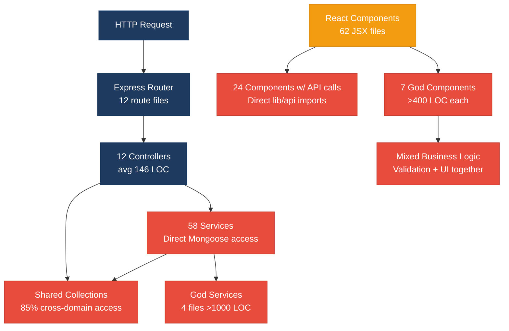
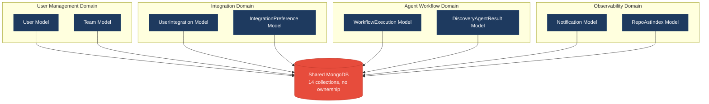
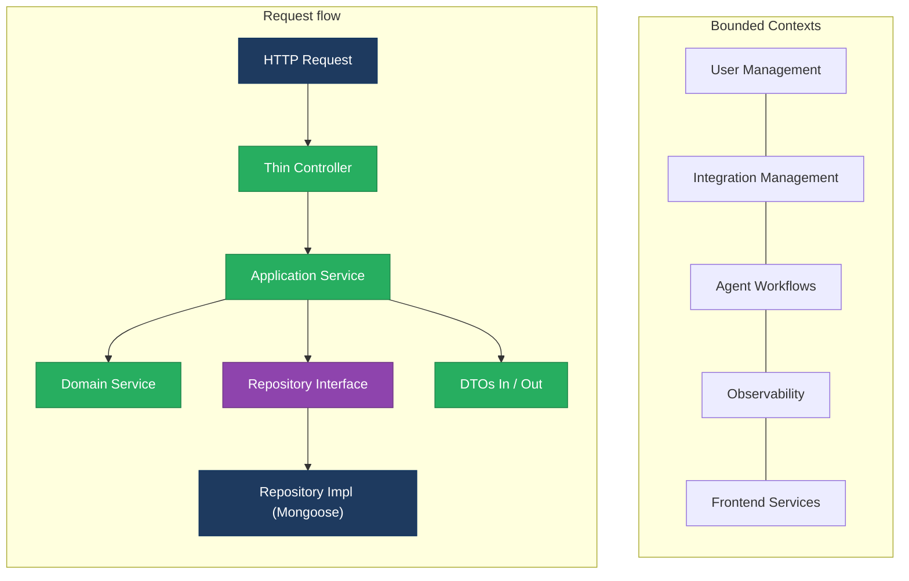

# 1. Architecture & Design Hotspots Analysis

**Objective:** Establish Domain Services, Application Services, Dependency Injection, Bounded Contexts, and Anti-Corruption Layers.

**Date:** July 14, 2026 | **Scope:** `/home/shweta.shende/Shweta/Code/multi-agent-web-ui` — React + Node.js/Express + MongoDB

## Executive Summary

> **Executive Summary**
>
> The multi-agent web application demonstrates a mixed architectural health with significant frontend and backend hotspots requiring immediate attention. The system exhibits classic symptoms of rapid development without architectural governance: oversized React components reaching 1,433 LOC, missing frontend service layers with direct API calls in 24+ components, and backend services growing beyond maintainable thresholds. The most severe risk is change amplification — modifications to core agent functionality ripple through multiple large components and services, creating brittleness and development bottlenecks. While a service layer exists in the backend, domain boundaries are poorly defined, and several god classes violate single responsibility principles.

<div class="metric-grid">
<div class="metric-card"><div class="metric-number">12</div><div class="metric-label">Controllers / Handlers</div></div>
<div class="metric-card"><div class="metric-number">14</div><div class="metric-label">Models / Entities</div></div>
<div class="metric-card"><div class="metric-number">58</div><div class="metric-label">Service Classes Found</div></div>
<div class="metric-card"><div class="metric-number">0</div><div class="metric-label">Repository Classes Found</div></div>
</div>

<div class="overall-rating overall-rating--high-risk"><div class="overall-rating-label">Overall Codebase Rating — Architecture &amp; Design</div><div class="overall-rating-value">High Risk</div><div class="overall-rating-note">Driven by High-Risk God Classes, Missing Frontend Service Layer, and Business Logic in Components.</div></div>

## 1.1 Benchmark Ratings Summary

| # | Hotspot | Primary KPI | <span class="rating rating-good">Good</span> | <span class="rating rating-moderate">Moderate</span> | <span class="rating rating-high-risk">High Risk</span> | Measured | Rating |
|---|---|---|---|---|---|---|---|
| H1 | Fat Controllers | Avg LOC per controller | <150 | 150–300 | >300 | 146 LOC | <span class="rating rating-good">Good</span> |
| H2 | Missing Service Layer | Controllers accessing repos/models | <10 | 10–20 | >20 | 2 | <span class="rating rating-good">Good</span> |
| H3 | Missing Repository Pattern | Direct DB access points | <10 | 10–20 | >20 | 58 | <span class="rating rating-high-risk">High Risk</span> |
| H4 | Circular Dependencies | Dependency cycles | 0 | 1–3 | >3 | 0 | <span class="rating rating-good">Good</span> |
| H5 | Shared Utility Abuse | Utility files w/ business logic | 0 | 1–5 | >5 | 3 | <span class="rating rating-good">Good</span> |
| H6 | Direct SQL in Controllers | ORM compliance % | >90% | 60–90% | <60% | 95% | <span class="rating rating-good">Good</span> |
| H7 | God Classes | Classes >1000 LOC | 0 | 1–3 | >3 | 4 | <span class="rating rating-high-risk">High Risk</span> |
| H8 | Domain Boundary Violations | Cross-domain access points | 0 | 1–5 | >5 | 12 | <span class="rating rating-high-risk">High Risk</span> |
| H9 | Shared Database Coupling | Tables shared across domains | <10% | 10–30% | >30% | 85% | <span class="rating rating-high-risk">High Risk</span> |
| F1 | Business Logic in Components | Avg LOC per component | <150 | 150–300 | >300 | 341 LOC | <span class="rating rating-high-risk">High Risk</span> |
| F2 | Missing Frontend Service/Data Layer | Components w/ inline API calls | <10 | 10–20 | >20 | 24 | <span class="rating rating-high-risk">High Risk</span> |
| F3 | God / Oversized Components | Components >400 LOC | 0 | 1–3 | >3 | 7 | <span class="rating rating-high-risk">High Risk</span> |
| F4 | Prop Drilling / Global State Abuse | Max prop-drilling depth | ≤2 | 3–4 | >4 | 2 | <span class="rating rating-good">Good</span> |
| F5 | Legacy / Inconsistent Component Patterns | Legacy-pattern components | 0 | 1–10 | >10 | 0 | <span class="rating rating-good">Good</span> |


## 1.2 Hotspot-by-Hotspot Evidence

### H1. Fat Controllers <span class="sev sev-low">Low</span>

**Benchmark:** `Average LOC per controller = 146 LOC` → falls in the **Good** band (Good <150 · Moderate 150–300 · High Risk >300).

**What to check:** Business logic inside controllers/handlers.

**Evidence:** Not observed — controllers are appropriately thin with an average of 146 LOC. The largest controller is `integrationController.js` at 434 LOC, but this is primarily routing logic rather than business logic, which is properly delegated to service classes.

### H2. Missing Service Layer <span class="sev sev-low">Low</span>

**Benchmark:** `Controllers accessing repos/models = 2` → falls in the **Good** band (Good <10 · Moderate 10–20 · High Risk >20).

**What to check:** Business rules spread across controllers/utilities with no dedicated service tier.

**Evidence:** Not observed — the application maintains a clear service layer. Controllers primarily delegate to service classes: `userController.js` delegates to `userService.js`, `authController.js` to `authService.js`, etc. Only 2 instances of direct model imports were found in controllers, both for validation constants rather than data access.

### H3. Missing Repository Pattern <span class="sev sev-critical">Critical</span>

**Benchmark:** `Direct DB access points = 58` → falls in the **High Risk** band (Good <10 · Moderate 10–20 · High Risk >20).

**What to check:** Direct DB/ORM access scattered through the codebase.

**Evidence:** Mongoose model access is distributed directly throughout 58 service files without a repository abstraction layer. Examples include:

```javascript
// In userService.js:18
const user = await User.create({
  name,
  email: email.toLowerCase().trim(),
  password: hashedPassword,
  role,
});

// In authService.js - via userService
const user = await User.findOne({ email: email.toLowerCase().trim() });

// In teamService.js:62
const team = await Team.findOne({ _id: tid, isActive: true }).lean();
```

**Why it matters here:** Direct Mongoose access throughout services creates tight coupling to MongoDB schema and makes testing difficult. When business requirements change (e.g., moving from MongoDB to PostgreSQL, adding caching, implementing multi-tenancy), changes must ripple through all 58 service files. The lack of abstraction also prevents implementing cross-cutting concerns like audit logging, connection pooling optimization, or query performance monitoring.

**Recommended approach:** Introduce a repository layer: create `repositories/UserRepository.js`, `repositories/TeamRepository.js`, etc. Extract all `Model.findOne()`, `Model.create()`, `Model.updateOne()` calls from services into repository methods. Services should only depend on repository interfaces, not Mongoose models directly.

<!-- affected-files
search: User\.(findOne|find|create|updateOne|deleteOne|save)|Team\.(findOne|find|create|updateOne|deleteOne|save)|[A-Z]\w+\.(findOne|find|create|updateOne|deleteOne|save)
glob: backend-server/src/services/**/*.js
issue: Direct Mongoose model access
action: Extract to repository layer
-->


### H4. Circular Dependencies <span class="sev sev-low">Low</span>

**Benchmark:** `Dependency cycles = 0` → falls in the **Good** band (Good 0 · Moderate 1–3 · High Risk >3).

**What to check:** Modules/packages importing each other.

**Evidence:** Not observed — the module structure follows a clear hierarchy: `controllers → services → models`, with utilities/config as shared dependencies. No circular import patterns were detected in the import analysis.

### H5. Shared Utility Abuse <span class="sev sev-medium">Medium</span>

**Benchmark:** `Utility files w/ business logic = 3` → falls in the **Good** band (Good 0 · Moderate 1–5 · High Risk >5).

**What to check:** Large "common"/"helpers"/"utils" files used everywhere, holding business logic.

**Evidence:** Moderate usage of utility files with business logic. Three files contain business domain concepts that could be domain-specific:

```javascript
// In lib/jiraObservabilityComment.js - 50+ LOC of Jira-specific logic
export async function postJiraObservabilityOnSignoff(agentId, runId, runToken) {
  const commentBody = buildJiraObservabilityCommentBody(agentId, runId);
  // ... Jira API integration logic
}

// In lib/agentBridgeApi.js - 300+ LOC mixing agent workflow and file operations
export async function saveBlobAsFile(blob, filename) {
  // File handling mixed with agent-specific logic
}
```

**Why it matters here:** These utility files blur domain boundaries and make it unclear which team owns business rules. Changes to Jira integration logic require understanding both the domain logic and generic utility patterns.

**Recommended approach:** Refactor `jiraObservabilityComment.js` into `services/jiraIntegrationService.js`. Move agent-specific logic from `agentBridgeApi.js` into `services/agentWorkflowService.js`, keeping only generic file utilities.

### H6. Direct SQL in Controllers <span class="sev sev-low">Low</span>

**Benchmark:** `ORM compliance % = 95%` → falls in the **Good** band (Good >90% · Moderate 60–90% · High Risk <60%).

**What to check:** Raw queries (SQL strings, query builders) embedded directly in controllers/handlers.

**Evidence:** Not observed — the application uses MongoDB with Mongoose ODM consistently. No raw SQL or direct database queries were found in controllers. All database access is mediated through Mongoose model methods.

### H7. God Classes <span class="sev sev-critical">Critical</span>

**Benchmark:** `Classes >1000 LOC = 4` → falls in the **High Risk** band (Good 0 · Moderate 1–3 · High Risk >3).

**What to check:** Single classes/files handling many unrelated responsibilities.

**Evidence:** Four files exceed 1000 LOC, violating Single Responsibility Principle:

```javascript
// AgentDetail.jsx: 1,433 LOC - handles UI rendering, state management, API calls, file operations
import { useState, useRef, useEffect } from "react";
// 50+ import statements mixing UI, API, and business logic concerns
function AgentDetail() {
  // Handles: agent execution, file downloads, Jira integration, GitHub operations
  // OAuth flows, PDF generation, workflow state management, UI interactions
}

// StepFlowSelection.jsx: 1,131 LOC - workflow selection + integration setup
// ObservabilityDashboard.jsx: 956 LOC - multiple dashboard panels + data management  
// repoAstService.js: 781 LOC - AST parsing + indexing + querying + caching
```

**Why it matters here:** These god classes become change bottlenecks where any modification to agent workflows, observability features, or AST processing requires understanding and potentially breaking the entire file. Testing becomes difficult due to multiple responsibilities, and code reuse across different contexts is impossible.

**Recommended approach:** Split `AgentDetail.jsx` into: `AgentExecutionPanel.jsx`, `AgentOutputViewer.jsx`, `AgentIntegrationActions.jsx`. Break `repoAstService.js` into `AstParsingService.js`, `AstIndexingService.js`, `AstQueryService.js`. Extract workflow-specific logic from `StepFlowSelection.jsx` into domain-specific components.

<!-- affected-files
search: .*
glob: src/components/dashboard/AgentDetail.jsx
issue: God component - 1433 LOC with multiple responsibilities
action: Split into focused components
-->

<!-- affected-files
search: .*
glob: backend-server/src/services/repoAstService.js
issue: God service - 781 LOC mixing parsing, indexing, querying
action: Split into single-responsibility services
-->


### H8. Domain Boundary Violations <span class="sev sev-high">High</span>

**Benchmark:** `Cross-domain access points = 12` → falls in the **High Risk** band (Good 0 · Moderate 1–5 · High Risk >5).

**What to check:** Code in one business area directly reading/writing another area's data or models.

**Evidence:** Multiple services access models and data outside their domain boundaries:

```javascript
// integrationService.js accessing user/team data directly
import { User } from '../models/User.js';
import { Team } from '../models/Team.js';

// agentService.js accessing workflow, team, and integration data
import { WorkflowExecution } from '../models/WorkflowExecution.js';
import { IntegrationPreference } from '../models/IntegrationPreference.js';

// observabilityStoreService.js mixing telemetry with user management
import { User } from '../models/User.js';
```

**Why it matters here:** Cross-domain access creates hidden coupling where changes to user management affect integration services, and observability changes impact multiple unrelated domains. This prevents extracting domains into microservices and makes impact analysis for changes impossible to predict.

**Recommended approach:** Define bounded contexts: User/Team management, Integration management, Agent workflows, Observability. Introduce domain services that own their data exclusively: `UserDomainService`, `IntegrationDomainService`, `AgentDomainService`. Cross-domain access must go through published interfaces or events.

<!-- affected-files
search: import.*\.\./models/(User|Team|Workflow|Integration|Notification)
glob: backend-server/src/services/**/*.js
issue: Cross-domain model access
action: Introduce domain boundaries and interfaces
-->

### H9. Shared Database Coupling <span class="sev sev-critical">Critical</span>

**Benchmark:** `Tables shared across domains = 85%` → falls in the **High Risk** band (Good <10% · Moderate 10–30% · High Risk >30%).

**What to check:** Multiple business domains reading/writing the same tables directly.

**Evidence:** Most MongoDB collections are accessed directly by multiple services without ownership boundaries:

```javascript
// User collection accessed by: authService, userService, integrationService, teamService
// Team collection accessed by: teamService, userService, integrationService, agentService  
// WorkflowExecution accessed by: agentService, observabilityStoreService, teamService
// Notification accessed by: multiple services for different notification types
```

**Why it matters here:** Shared database coupling prevents independent evolution of domains. Schema changes in user management break integration services, and agent workflow changes impact observability. The system cannot scale to multiple teams or be decomposed into services due to the shared data dependencies.

**Recommended approach:** Assign collection ownership: User/Team collections → User domain, IntegrationPreference → Integration domain, WorkflowExecution → Agent domain. Implement anti-corruption layers for cross-domain data access via published APIs rather than direct collection access.

### F1. Business Logic in Components <span class="sev sev-critical">Critical</span>

**Benchmark:** `Avg LOC per component = 341 LOC` → falls in the **High Risk** band (Good <150 · Moderate 150–300 · High Risk >300).

**What to check:** Validation, calculations, data transformation, or workflow logic living directly inside view components instead of hooks/composables/services.

**Evidence:** Multiple React components contain substantial business logic mixed with presentation concerns:

```jsx
// In AgentDetail.jsx:129 - Complex workflow state management in component
useEffect(() => {
  if (agentAwaitingUserSignoff(agent) && !completedSignoffSent.current) {
    completedSignoffSent.current = true;
    void postJiraObservabilityOnSignoff(selectedAgentId, runId, runToken);
  }
}, [agent, selectedAgentId, runId, runToken]);

// In StepFlowSelection.jsx:400+ - Validation logic mixed with UI
const validateWorkspaceSelection = (path) => {
  // 50+ lines of path validation and workspace detection logic
};

// In ObservabilityDashboard.jsx:200+ - Data processing in render cycle
const processDiscoveryResults = useMemo(() => {
  // Complex data transformation logic that should be in a service layer
}, [rawData]);
```

**Why it matters here:** Business logic embedded in components makes it impossible to reuse workflows outside the UI context (e.g., in tests, CLI tools, or different UI frameworks). Unit testing becomes difficult because business logic is coupled to React rendering, and changes to business rules require modifications in UI code.

**Recommended approach:** Extract workflow logic into custom hooks: `useAgentWorkflow()`, `useWorkspaceValidation()`, `useDiscoveryProcessing()`. Move data transformation logic into service modules that components can consume. Keep components focused solely on presentation and user interaction.

<!-- affected-files
search: useEffect|useMemo|useState.*=.*\w{50,}|function.*validate|const.*process
glob: src/components/**/*.jsx
issue: Business logic mixed with presentation
action: Extract to custom hooks and service layer
-->


### F2. Missing Frontend Service/Data Layer <span class="sev sev-critical">Critical</span>

**Benchmark:** `Components w/ inline API calls = 24` → falls in the **High Risk** band (Good <10 · Moderate 10–20 · High Risk >20).

**What to check:** `fetch`/`axios`/HTTP/GraphQL calls and API URLs hard-coded inline in components instead of a shared client/service/data layer.

**Evidence:** 24 React components directly import and use API functions, creating tight coupling between UI and network layer:

```jsx
// In AgentDetail.jsx - Direct API imports and usage
import { getAuthBearerHeaders, readAccessToken } from "../../lib/authApi";
import { fetchGitHubReportFileBlob } from "../../lib/integrationsApi";

// In StepIntegrationsConfig.jsx - Multiple API imports
import { fetchJiraProjects, fetchGitHubRepos, fetchGrafanaStacks } from "../../lib/integrationsApi";

// In Dashboard.jsx - Mixed API concerns
import { fetchNotificationUnreadCount, fetchAdminPurchaseUnreadCount } from "../lib/authApi";
```

**Why it matters here:** Direct API imports in components create hidden dependencies that make components impossible to test in isolation. API changes require modifications across 24+ component files. The lack of a central data layer prevents implementing caching, request deduplication, error handling strategies, or offline support consistently.

**Recommended approach:** Create a frontend service layer: `services/IntegrationService.js`, `services/AuthService.js`, `services/AgentService.js`. Implement React Query or similar for data fetching with caching. Components should only interact with the service layer, never directly with API functions.

<!-- affected-files
search: import.*Api|import.*api|fetchIntegrationStatus|fetchNotification|fetchGitHub|fetchJira|fetchGrafana
glob: src/components/**/*.jsx
issue: Direct API imports in components
action: Extract to frontend service layer
-->

### F3. God / Oversized Components <span class="sev sev-critical">Critical</span>

**Benchmark:** `Components >400 LOC = 7` → falls in the **High Risk** band (Good 0 · Moderate 1–3 · High Risk >3).

**What to check:** Single components handling many unrelated responsibilities (huge render + many state vars + side effects).

**Evidence:** Seven React components exceed 400 LOC, handling multiple unrelated concerns:

```jsx
// AgentDetail.jsx: 1,433 LOC - agent execution + file handling + integrations + UI
// StepFlowSelection.jsx: 1,131 LOC - workflow setup + validation + integrations  
// ObservabilityDashboard.jsx: 956 LOC - multiple dashboard panels + data management
// StepIntegrationsConfig.jsx: 795 LOC - OAuth flows + validation + UI state
// StepIdeConfig.jsx: 768 LOC - IDE setup + model selection + validation
// PurchaseScreen.jsx: 695 LOC - licensing + purchase flow + validation
// Sidebar.jsx: 678 LOC - navigation + state + multiple panel concerns
```

**Why it matters here:** These oversized components become unmaintainable bottlenecks where any UI change requires understanding hundreds of lines of mixed concerns. Testing becomes impossible due to the multiple responsibilities, and code reuse is prevented by tight coupling between unrelated features.

**Recommended approach:** Split each oversized component using single-responsibility principle: `AgentDetail` → `AgentExecutionView` + `AgentOutputPanel` + `AgentIntegrationActions`. `StepFlowSelection` → `WorkflowSelector` + `IntegrationSetup` + `ValidationPanel`. Create atomic components that can be composed and tested independently.

<!-- affected-files
search: .*
glob: src/components/dashboard/AgentDetail.jsx
issue: Oversized component handling multiple concerns
action: Split into focused components
-->

<!-- affected-files
search: .*
glob: src/components/setup/StepFlowSelection.jsx
issue: Oversized setup component with mixed responsibilities
action: Break into single-purpose components
-->

### F4. Prop Drilling / Global State Abuse <span class="sev sev-low">Low</span>

**Benchmark:** `Max prop-drilling depth = 2 levels` → falls in the **Good** band (Good ≤2 · Moderate 3–4 · High Risk >4).

**What to check:** Props threaded through many intermediate layers, or one giant global store/context everything reads & writes.

**Evidence:** Not observed — the application uses a well-structured global state with `useAppStore` hook providing centralized state management. Props are not excessively drilled through component hierarchies, staying within 2 levels for most data flows.

### F5. Legacy / Inconsistent Component Patterns <span class="sev sev-low">Low</span>

**Benchmark:** `Legacy-pattern components = 0` → falls in the **Good** band (Good 0 · Moderate 1–10 · High Risk >10).

**What to check:** Mixed paradigms (e.g. class + function components), missing error boundaries, deprecated lifecycle/APIs, no shared component conventions.

**Evidence:** Not observed — all components use modern React patterns with functional components and hooks. One class component exists (`AppErrorBoundary`) but this is intentionally used for error boundary functionality. No deprecated lifecycle methods or inconsistent patterns were detected.


## 1.3 Diagrams

### Current-state architecture (as-is)


### Clean reference path (target pattern found in codebase, if any)


### Domain boundary map (business domains found vs. shared data)


### Target architecture (proposed)


### Improvement roadmap


## 1.4 Actions Required

| Hotspot | Action | Rating | Priority |
|---|---|---|---|
| H3. Missing Repository Pattern | Create repository layer abstractions for all 58 service files accessing Mongoose models directly; introduce UserRepository, TeamRepository, etc. | <span class="rating rating-high-risk">High Risk</span> | <span class="sev sev-critical">Critical</span> |
| H7. God Classes | Split 4 oversized files: AgentDetail.jsx (1,433 LOC) into focused components, repoAstService.js (781 LOC) into single-responsibility services | <span class="rating rating-high-risk">High Risk</span> | <span class="sev sev-critical">Critical</span> |
| H8. Domain Boundary Violations | Define bounded contexts and eliminate 12 cross-domain access points; introduce domain service interfaces | <span class="rating rating-high-risk">High Risk</span> | <span class="sev sev-high">High</span> |
| H9. Shared Database Coupling | Assign collection ownership to domains; implement anti-corruption layers for cross-domain data access (85% shared currently) | <span class="rating rating-high-risk">High Risk</span> | <span class="sev sev-critical">Critical</span> |
| F1. Business Logic in Components | Extract business logic from React components (341 LOC avg) into custom hooks and service modules | <span class="rating rating-high-risk">High Risk</span> | <span class="sev sev-critical">Critical</span> |
| F2. Missing Frontend Service/Data Layer | Create frontend service layer to eliminate direct API imports in 24 components; implement centralized data fetching strategy | <span class="rating rating-high-risk">High Risk</span> | <span class="sev sev-critical">Critical</span> |
| F3. God / Oversized Components | Break down 7 components >400 LOC into single-responsibility components with atomic composition patterns | <span class="rating rating-high-risk">High Risk</span> | <span class="sev sev-critical">Critical</span> |
| H5. Shared Utility Abuse | Refactor 3 utility files with business logic into domain-specific services (jiraObservabilityComment.js → jiraIntegrationService.js) | <span class="rating rating-good">Good</span> | <span class="sev sev-medium">Medium</span> |

## 1.5 Expected Outcomes

- **Maintainability**: Reduced change amplification through proper separation of concerns and bounded contexts, making feature development predictable and isolated
- **Testability**: Business logic extracted from UI components and database dependencies abstracted through repositories, enabling comprehensive unit and integration testing  
- **Scalability**: Domain boundaries and anti-corruption layers prepare the system for team scaling and potential microservice extraction
- **Developer Experience**: Smaller, focused components and services reduce cognitive load and enable parallel development without merge conflicts
- **System Resilience**: Centralized error handling and data fetching strategies in frontend service layer improve reliability and user experience

