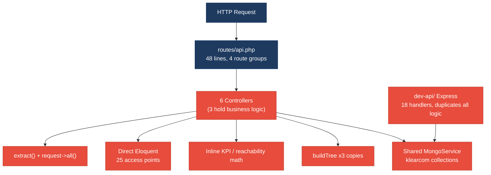
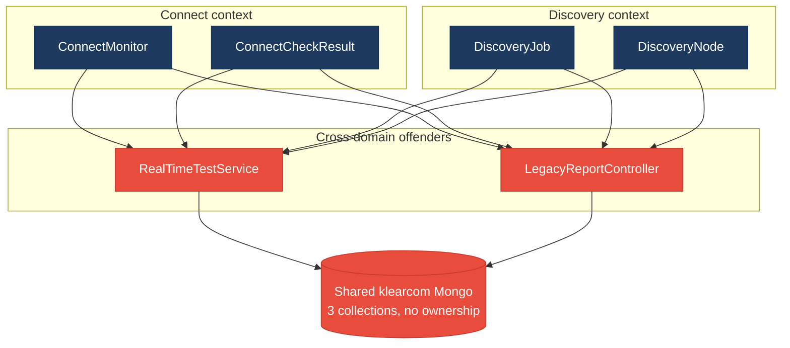
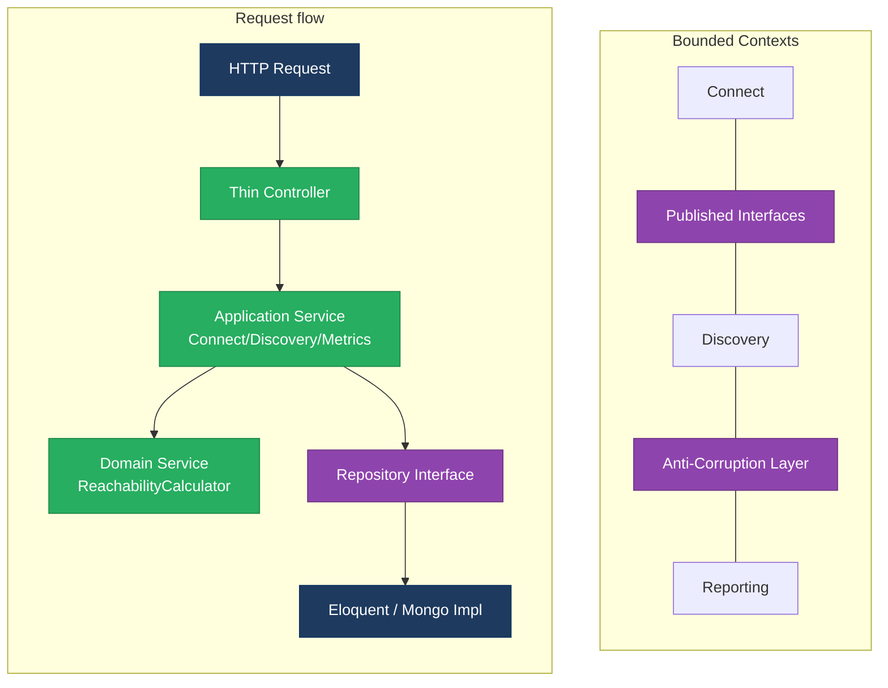
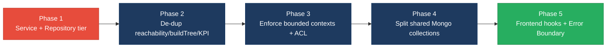

# 1. Architecture & Design Hotspots Analysis

**Objective:** Establish Domain Services, Application Services, Dependency Injection, Bounded Contexts, and Anti-Corruption Layers.

**Date:** 2026-07-24 | **Scope:** `shende-shweta/FSDKC` (branch `main`) — PHP/Laravel API (`backend/`), React 18 + TypeScript SPA (`frontend/`, Vite + React Query + Zustand), and a parallel Node/Express mock API (`dev-api/`)

## Executive Summary

> **Executive Summary**
>
> FSDKC is a compact but structurally revealing "Klearcom" voice-observability platform spanning three layers: a PHP/Laravel 11 API (`backend/` — 6 controllers, 2 services, 4 Eloquent models), a React/TypeScript SPA (`frontend/` — 4 pages, 4 components, 1 hook, 1 Zustand store), and a full parallel Node/Express backend (`dev-api/` — 18 route handlers) that re-implements the entire server surface. Absolute file sizes are small, so no God Class (>1000 LOC) or oversized-component (>400 LOC) threshold is breached, but the design-level hotspots are severe: there is **no repository layer at all** (0 repository classes against 36 direct Eloquent access points, 25 of them inside controllers) and **no application-service tier for read paths**, so `DashboardController`, `ConnectController::checks`, and `LegacyReportController` carry KPI math, `extract()`-based mapping, and cross-domain queries directly. The dominant risk is **change amplification through duplication and shared data**: the reachability success-rate formula is copy-pasted across `ConnectController:72`, `RealTimeTestService:118`, `LegacyReportController:40`, and `dev-api/realtime.js:148`; `buildTree` exists verbatim in three files; and both the Laravel and Express backends read/write the *same* `klearcom` MongoDB collections with no ownership boundary. The Connect and Discovery bounded contexts declared in the module `AGENTS.md` files are violated by `RealTimeTestService`, `LegacyReportController`, `DashboardController`, and the shared `MongoService`, all of which touch both domains at once. Layers covered: **backend** (13 PHP files), **frontend** (11 TS/TSX/JSX files), and a **second backend** (6 JS files). The overall verdict is **High Risk**, driven by the missing service/repository tiers (H2, H3), shared-database coupling (H9), and a fully duplicated parallel backend (H10).

<div class="metric-grid">
<div class="metric-card"><div class="metric-number">24</div><div class="metric-label">Controllers / Handlers (6 Laravel + 18 Express)</div></div>
<div class="metric-card"><div class="metric-number">4</div><div class="metric-label">Models / Entities</div></div>
<div class="metric-card"><div class="metric-number">2</div><div class="metric-label">Service Classes Found</div></div>
<div class="metric-card"><div class="metric-number">0</div><div class="metric-label">Repository Classes Found</div></div>
</div>

<div class="overall-rating overall-rating--high-risk"><div class="overall-rating-label">Overall Codebase Rating — Architecture &amp; Design</div><div class="overall-rating-value">High Risk</div><div class="overall-rating-note">Driven by High-Risk Missing Service Layer (H2), Missing Repository Pattern (H3), Shared Database Coupling (H9), and a fully Duplicated Parallel Backend (H10).</div></div>

## 1.1 Benchmark Ratings Summary

One row per hotspot. "Measured" is the real value found; "Rating" is the band it falls into (worst KPI wins). This table is the source for the Overall Codebase Rating banner above.

| # | Hotspot | Primary KPI | <span class="rating rating-good">Good</span> | <span class="rating rating-moderate">Moderate</span> | <span class="rating rating-high-risk">High Risk</span> | Measured | Rating |
|---|---|---|---|---|---|---|---|
| H1 | Fat Controllers | Avg LOC per controller (+ business logic) | <150 | 150–300 | >300 | 63 LOC avg, but 3/6 embed business logic | <span class="rating rating-moderate">Moderate</span> |
| H2 | Missing Service Layer | Controllers accessing repos/models | <10 | 10–20 | >20 | 25 direct model access points | <span class="rating rating-high-risk">High Risk</span> |
| H3 | Missing Repository Pattern | Direct DB/ORM access points | <10 | 10–20 | >20 | 36 access points, 0 repositories | <span class="rating rating-high-risk">High Risk</span> |
| H4 | Circular Dependencies | Dependency cycles | 0 | 1–3 | >3 | 0 | <span class="rating rating-good">Good</span> |
| H5 | Shared Utility Abuse | Utility files w/ business logic | 0 | 1–5 | >5 | 2 (`LegacyDataMapper`, `dev-api/store.js`) | <span class="rating rating-moderate">Moderate</span> |
| H6 | Direct SQL in Controllers | ORM/query-builder compliance % | >90% | 60–90% | <60% | ~85% (query builders in 2 controllers, no raw SQL) | <span class="rating rating-moderate">Moderate</span> |
| H7 | God Classes | Classes >1000 LOC | 0 | 1–3 | >3 | 0 (largest 231 LOC) | <span class="rating rating-good">Good</span> |
| H8 | Domain Boundary Violations | Cross-domain access points | 0 | 1–5 | >5 | 4 (RealTimeTestService, LegacyReport, Dashboard, MongoService) | <span class="rating rating-moderate">Moderate</span> |
| H9 | Shared Database Coupling | Data stores shared across domains | <10% | 10–30% | >30% | ~37% (3/8 stores shared, 2 backends) | <span class="rating rating-high-risk">High Risk</span> |
| H10 | Duplicated Parallel Backend *(additional)* | Business algorithms duplicated across backends | 0 | 1–2 | >2 | 3 (reachability ×4, buildTree ×3, KPI math ×2) | <span class="rating rating-high-risk">High Risk</span> |
| F1 | Business Logic in Components | Avg LOC per component (worst-wins on max) | <150 | 150–300 | >300 | avg 79 LOC; largest ConnectPage 208 LOC w/ orchestration | <span class="rating rating-moderate">Moderate</span> |
| F2 | Missing Frontend Service/Data Layer | Components w/ inline API calls | <10 | 10–20 | >20 | 7 files build endpoints inline (under threshold) | <span class="rating rating-good">Good</span> |
| F3 | God / Oversized Components | Components >400 LOC | 0 | 1–3 | >3 | 0 (largest 208 LOC) | <span class="rating rating-good">Good</span> |
| F4 | Prop Drilling / Global State Abuse | Max prop-drilling depth | ≤2 | 3–4 | >4 | ≤2 levels (Zustand + React Query) | <span class="rating rating-good">Good</span> |
| F5 | Legacy / Inconsistent Component Patterns | Legacy-pattern components | 0 | 1–10 | >10 | 2 (class component w/ interval leak; no Error Boundary) | <span class="rating rating-moderate">Moderate</span> |

No additional hotspots beyond the standard set and H10 were observed.

## 1.2 Hotspot-by-Hotspot Evidence

### H1. Fat Controllers <span class="sev sev-high">High</span>

**Benchmark:** `Avg LOC per controller = 63` (largest 85) → LOC lands in the **Good** band, but 3 of 6 controllers embed business logic, so the "minimal business logic" target pushes this to **Moderate** (Good <150 · Moderate 150–300 · High Risk >300).

**What to check:** Business logic (KPI math, reachability formulas, `extract()` mapping, tree building) living inside controllers instead of application/domain services.

**Evidence:**

`backend/app/Http/Controllers/Api/LegacyReportController.php:19-53` — the controller itself is documented as an anti-pattern; it queries, loops, computes reachability, and maps rows inline:

```php
public function carrierSummary(Request $request): JsonResponse
{
    $filters = $request->all();
    extract($filters);                       // dynamic vars from request
    $monitors = ConnectMonitor::query()
        ->when(isset($country_code), fn ($q) => $q->where('country_code', $country_code))
        ->when(isset($carrier), fn ($q) => $q->where('carrier', $carrier))
        ->orderByDesc('reachability_pct')->get();
    foreach ($monitors as $monitor) {
        $recent = ConnectCheckResult::where('connect_monitor_id', $monitor->id)
            ->orderByDesc('checked_at')->limit(20)->get();
        $successRate = $recent->count() > 0
            ? ($recent->where('reachable', true)->count() / $recent->count()) * 100 : 100;  // KPI math in controller
```

`backend/app/Http/Controllers/Api/DashboardController.php:12-34` — every KPI is computed inline from five separate model aggregations, with two magic numbers (`94.2`, `97.8`) hard-coded:

```php
$avgReachability = ConnectMonitor::avg('reachability_pct') ?? 0;
$alerts = ConnectMonitor::where('status', 'alert')->count();
return response()->json(['availability' => [
    'ivr_availability_pct' => $discoveryTotal > 0 ? round(($discoveryCompleted / $discoveryTotal) * 100, 1) : 0,
    'call_success_rate_pct' => 94.2, 'transfer_success_rate_pct' => 97.8, ...
```

`backend/app/Http/Controllers/Api/ConnectController.php:65-84` — an explicitly-labelled "Duplicate reachability calculation block" runs the success-rate math and status derivation inside the HTTP handler.

**Why it matters here:** The KPI and reachability logic is untestable without booting HTTP, and because the same math is duplicated (see H10) a single rule change (e.g. the 90% alert threshold) must be edited in `ConnectController`, `RealTimeTestService`, and `LegacyReportController` together. The next contributor adding a "carrier failure rate" KPI has no service to extend and will copy the pattern again, deepening the debt.

**Recommended approach:**
1. Create `App\Services\DashboardMetricsService` and move the five aggregations + magic numbers out of `DashboardController::kpis`.
2. Extract the reachability success-rate formula into a `ReachabilityCalculator` domain service and call it from all three controllers.
3. Introduce `ConnectService`/`DiscoveryService` application services; controllers become 5–10 line HTTP↔service translators.

<!-- affected-files
search: (extract\(|\* 100|buildTree|successRate|94\.2|97\.8)
glob: backend/app/Http/Controllers/**/*.php
issue: Business logic (KPI math / reachability / extract mapping) embedded in controller
action: Extract into Application/Domain Services; keep controller thin
-->

### H2. Missing Service Layer <span class="sev sev-critical">Critical</span>

**Benchmark:** `Controllers directly accessing models = 25` → falls in the **High Risk** band (Good <10 · Moderate 10–20 · High Risk >20).

**What to check:** Controllers reaching straight into Eloquent models/queries instead of delegating to a service tier that owns the workflow.

**Evidence:** 25 direct `Model::` access points across the 6 controllers (Connect 7, Dashboard 8, Discovery 6, LegacyReport 4). Only *write* paths (`start`, `runCheck`) delegate to `RealTimeTestService`; every read path queries models directly.

`backend/app/Http/Controllers/Api/ConnectController.php:57-73`:

```php
public function checks(int $id): JsonResponse
{
    $monitor = ConnectMonitor::findOrFail($id);
    $checks = ConnectCheckResult::where('connect_monitor_id', $id)->orderByDesc('checked_at')->limit(50)->get();
    $recentChecks = ConnectCheckResult::where('connect_monitor_id', $id)->orderByDesc('checked_at')->limit(20)->get();
    $successRate = $recentChecks->count() > 0
        ? ($recentChecks->where('reachable', true)->count() / $recentChecks->count()) * 100 : 100;
```

`backend/app/Http/Controllers/Api/DashboardController.php:14-18` — eight model aggregations with no service between HTTP and persistence.

**Why it matters here:** With no service layer, the identical "recent 20 checks → success rate" workflow cannot be reused by a CLI command, a scheduled job, or the Express backend — it is re-typed each place, which is exactly why H10 exists. Any change to how a "check" is counted forces edits in every controller that touches `ConnectCheckResult`.

**Recommended approach:**
1. Introduce `ConnectService`, `DiscoveryService`, and `DashboardMetricsService`; move all read-path model queries into them.
2. Inject them via constructor DI (the pattern `ConnectController` already uses for `MongoService`/`RealTimeTestService`).
3. Reduce each controller action to request-validation + a single service call.

<!-- affected-files
search: (ConnectMonitor|ConnectCheckResult|DiscoveryJob|DiscoveryNode)::
glob: backend/app/Http/Controllers/**/*.php
issue: Controller accesses Eloquent models directly with no service layer
action: Move query/workflow into an Application Service and inject it
-->

### H3. Missing Repository Pattern <span class="sev sev-critical">Critical</span>

**Benchmark:** `Direct DB/ORM access points = 36` across the backend, `0` repository classes → **High Risk** (Good <10 · Moderate 10–20 · High Risk >20).

**What to check:** Persistence expressed as scattered Eloquent calls with no repository abstraction; `AppServiceProvider` binding nothing.

**Evidence:** 36 `Model::` access points spread across controllers *and* `RealTimeTestService`, plus raw MongoDB collection access in `MongoService`. `backend/app/Providers/AppServiceProvider.php:9-17` registers **nothing** — both `register()` and `boot()` are empty stubs, so there is no seam to bind repository interfaces:

```php
public function register(): void { /* empty */ }
public function boot(): void { /* empty */ }
```

`backend/app/Services/RealTimeTestService.php:117-124` — even the service writes directly through the model and re-queries the "recent 20":

```php
$recent = ConnectCheckResult::where('connect_monitor_id', $monitorId)->orderByDesc('checked_at')->limit(20)->get();
$rate = $recent->count() > 0 ? ($recent->where('reachable', true)->count() / $recent->count()) * 100 : 100;
$monitor->update(['reachability_pct' => round($rate, 2), 'status' => $rate < 90 ? 'alert' : 'active', ...]);
```

**Why it matters here:** The `klearcom` platform uses two persistence engines (MariaDB via Eloquent, MongoDB via the raw driver). With no repository seam, unit tests must hit a live database, and a future move (e.g. sharding `connect_check_results` or swapping Mongo for another document store) means touching every controller and service. `A grep for "repository" returns nothing.`

**Recommended approach:**
1. Define `ConnectCheckRepositoryInterface` / `DiscoveryNodeRepositoryInterface` with an Eloquent implementation; encapsulate the recurring "recent 20 checks" query as one method.
2. Bind interfaces → implementations in `AppServiceProvider::register()`.
3. Wrap `MongoService`'s collection access behind a `TranscriptRepository` so the document store is swappable.

<!-- affected-files
search: (ConnectMonitor|ConnectCheckResult|DiscoveryJob|DiscoveryNode)::|->update\(|selectCollection\(
glob: backend/app/**/*.php
issue: Direct ORM/DB access with no repository abstraction
action: Introduce repository interfaces + Eloquent/Mongo implementations bound in AppServiceProvider
-->

### H4. Circular Dependencies <span class="sev sev-low">Low</span>

**Benchmark:** `Dependency cycles = 0` → **Good** band.

**What to check:** Modules/namespaces importing each other in a cycle.

**Evidence:** Not observed — dependencies flow one way (Controllers → Services → Models/MongoService); `RealTimeTestService` depends on `MongoService` but not vice-versa, and no model imports a controller or service.

### H5. Shared Utility Abuse <span class="sev sev-medium">Medium</span>

**Benchmark:** `Utility files holding business logic = 2` → **Moderate** band (Good 0 · Moderate 1–5 · High Risk >5).

**What to check:** Generic "helper"/"mapper"/"store" files that quietly own business logic.

**Evidence:**

`backend/app/Legacy/LegacyDataMapper.php:10-31` — a "mapper" that uses unsafe `extract()` to turn arbitrary arrays into report/job rows, embedding label/metric defaulting rules:

```php
public function mapReportRow(array $row): array
{
    extract($row, EXTR_SKIP);
    return ['label' => $name ?? 'Unknown', 'metric' => $reachability_pct ?? 0,
            'region' => $country_code ?? 'N/A', 'source' => 'legacy_extract_mapper'];
}
```

`dev-api/src/store.js:64-75` — the "in-memory store" utility also owns the `buildTree` IVR algorithm (business logic) in addition to seed data.

**Why it matters here:** `LegacyDataMapper` is the report row's real contract, but hides it behind `extract()`, so a renamed field silently becomes `Unknown`/`0` with no error. `store.js` mixes fixtures with an algorithm, so a tree-shape change and a seed-data change collide in the same file.

**Recommended approach:**
1. Replace `LegacyDataMapper::mapReportRow` with an explicit `ReportRow` DTO / typed array — no `extract()`.
2. Move `buildTree` out of `store.js` into a shared `ivr-tree.js` module consumed by both the Express routes and any future service.

<!-- affected-files
search: extract\(
glob: backend/app/Legacy/**/*.php
issue: Utility/mapper hides business rules behind unsafe extract()
action: Replace with explicit DTOs / typed mapping
-->

### H6. Direct SQL in Controllers <span class="sev sev-medium">Medium</span>

**Benchmark:** `ORM compliance ≈ 85%` — no raw SQL strings anywhere, but Eloquent query-builder chains are embedded in 2 controllers → **Moderate** band (Good >90% · Moderate 60–90% · High Risk <60%).

**What to check:** Raw SQL or query-builder chains constructed inside controllers rather than repositories.

**Evidence:** No `DB::raw`/`DB::select`/raw SQL exists (good). However `LegacyReportController.php:24-37` builds a conditional `ConnectMonitor::query()->when(...)->when(...)->orderByDesc()` filter and a nested `ConnectCheckResult::where(...)->limit(20)` inside the loop, and `ConnectController.php:60-69` builds two ordered/limited queries in the handler.

**Why it matters here:** These query builders are the schema contract expressed in the HTTP layer; a column rename (`checked_at`, `reachability_pct`) breaks the controller directly and cannot be caught by a repository-level test. Because the same "recent 20 ordered by checked_at" builder appears in three places, a schema change is a three-file edit.

**Recommended approach:**
1. Move the `carrierSummary` filter builder into a `ConnectMonitorRepository::filter(array $criteria)` method.
2. Encapsulate the "recent N checks" builder as `ConnectCheckRepository::recentFor(int $monitorId, int $limit)`.

<!-- affected-files
search: ->(where|orderByDesc|when|limit|query)\(
glob: backend/app/Http/Controllers/**/*.php
issue: Eloquent query-builder chain constructed inside controller
action: Move query construction into a repository method
-->

### H7. God Classes <span class="sev sev-low">Low</span>

**Benchmark:** `Classes >1000 LOC = 0` (largest file `dev-api/src/server.js` at 231 non-blank LOC; largest PHP class `MongoService` at 132) → **Good** band.

**What to check:** Single classes/files owning many unrelated responsibilities and exceeding 1000 LOC.

**Evidence:** Not observed — no class or file exceeds 300 LOC. `server.js` (231 LOC) concentrates all 18 Express routes but stays well under the God-Class threshold; noted instead under H10 as the duplicated backend.

### H8. Domain Boundary Violations <span class="sev sev-high">High</span>

**Benchmark:** `Cross-domain access points = 4` → **Moderate** band (Good 0 · Moderate 1–5 · High Risk >5).

**What to check:** Code in one bounded context directly reading/writing another context's models. The `AGENTS.md` files declare two contexts — **Connect** (`connect_monitors`, `connect_check_results`) and **Discovery** (`discovery_jobs`, `discovery_nodes`).

**Evidence:**

`backend/app/Services/RealTimeTestService.php:5-8` imports and mutates **both** domains' models in one class:

```php
use App\Models\ConnectCheckResult; use App\Models\ConnectMonitor;
use App\Models\DiscoveryJob;       use App\Models\DiscoveryNode;
```

`backend/app/Http/Controllers/Api/LegacyReportController.php:7-10` likewise imports all four models and queries Connect + Discovery in the same controller. `DashboardController.php:6-7` reads `ConnectMonitor` and `DiscoveryJob` together; `MongoService` stores transcripts for both `'connect'` and `'discovery'` modules.

**Why it matters here:** The two contexts are explicitly documented as independent capabilities, yet `RealTimeTestService` is a single class both domains depend on — extracting Discovery into its own service is impossible without splitting this class and untangling the shared `MongoService`. A change to `ConnectCheckResult` risks the Discovery test path in the same file.

**Recommended approach:**
1. Split `RealTimeTestService` into `ConnectTestService` and `DiscoveryTestService`, each owning only its context's models.
2. Give the Dashboard a read-only `MetricsFacade` that consumes each context through a published interface rather than raw models.

<!-- affected-files
search: use App\\Models\\(ConnectMonitor|ConnectCheckResult)
glob: backend/app/**/*.php
issue: File couples the Connect and Discovery bounded contexts in one class
action: Split per bounded context; consume the other domain via a published interface
-->

### H9. Shared Database Coupling <span class="sev sev-high">High</span>

**Benchmark:** `Data stores shared across domains ≈ 37%` (3 of 8 stores) → **High Risk** band (Good <10% · Moderate 10–30% · High Risk >30%).

**What to check:** Multiple domains (and here, multiple *backends*) reading/writing the same tables/collections with no ownership.

**Evidence:** The MariaDB tables are cleanly domain-owned (`discovery_*` vs `connect_*`, per `docker/mariadb/init.sql`). But the three MongoDB collections are shared across both contexts via a `module` discriminator, and **both backends connect to the same `klearcom` database**:

`backend/app/Services/MongoService.php:24-27` and `dev-api/src/mongo.js:43-46` both open `klearcom` and the same three collections:

```php
$db = $this->client->selectDatabase('klearcom');
$this->transcripts = $db->selectCollection('transcripts');
$this->testEvents  = $db->selectCollection('test_events');
$this->diagnostics = $db->selectCollection('call_diagnostics');
```

`docker/mongodb/init.js:3-38` seeds `transcripts` with both `module: 'discovery'` and `module: 'connect'` documents into one collection.

**Why it matters here:** A schema/index change to `transcripts` (owned by nobody) simultaneously affects Connect reachability transcripts, Discovery IVR transcripts, the Laravel `MongoService`, and the Express `mongo.js` — four consumers, zero ownership. The two backends can silently diverge on document shape while writing to the same store.

**Recommended approach:**
1. Give each context its own collections (`connect_transcripts`, `discovery_transcripts`) or enforce ownership through a `TranscriptRepository` per domain.
2. Put an Anti-Corruption Layer in front of the shared `klearcom` DB so the Express dev-api cannot write shapes the Laravel side does not expect.
3. Adopt versioned migrations for the Mongo collection contracts.

<!-- affected-files
search: selectCollection\(|collection\('(transcripts|test_events|call_diagnostics)'\)
glob: backend/app/Services/**/*.php
issue: Domain-agnostic access to shared klearcom Mongo collections
action: Introduce per-domain ownership / repository + ACL over the shared DB
-->

<!-- affected-files
search: collection\('(transcripts|test_events|call_diagnostics)'\)|db\('klearcom'\)|selectDatabase\('klearcom'\)
glob: dev-api/src/**/*.js
issue: Second backend writes the same shared klearcom collections with no contract
action: Route through an Anti-Corruption Layer / shared contract with the Laravel backend
-->

### H10. Duplicated Parallel Backend <span class="sev sev-high">High</span> *(additional)*

**KPI & thresholds:** *Core business algorithms duplicated across the two backends* — Good `0` · Moderate `1–2` · High Risk `>2`. **Measured = 3** (reachability formula, `buildTree`, dashboard KPI math), so **High Risk**. This additional hotspot captures that `dev-api/` is not a thin mock but a full re-implementation of `backend/`.

**What to check:** The same domain logic maintained in two codebases that must stay in lock-step.

**Evidence:** Three algorithms are duplicated verbatim across backends:

- **Reachability success-rate** — 4 copies: `ConnectController.php:72`, `RealTimeTestService.php:118`, `LegacyReportController.php:40`, `dev-api/realtime.js:148`.
- **`buildTree`** — 3 copies: `DiscoveryController.php:87`, `LegacyReportController.php:78` (comment: "Duplicate of DiscoveryController::buildTree — copy-paste debt"), `dev-api/store.js:64`.
- **Dashboard KPI math** — 2 copies: `DashboardController.php:22` and `dev-api/server.js:66`.

`dev-api/src/realtime.js:104-153` re-implements the entire `RealTimeTestService::runConnectTest` workflow (steps, reachable roll, check insert, status derivation) in JavaScript.

**Why it matters here:** Every business-rule change now requires a synchronized edit in PHP *and* JS or the dev environment silently diverges from production — the 90% alert threshold, the "recent 20" window, and the IVR tree shape all live in ≥2 languages. There is no contract test guaranteeing parity.

**Recommended approach:**
1. Consolidate each algorithm into a single owner (PHP domain service) and make `dev-api/` a thin fixture layer, or generate both from a shared spec.
2. Add a cross-backend contract test asserting `/api/dashboard/kpis` and `/tree` responses match between the two servers.

<!-- affected-files
search: where\('reachable', true\)|filter\(\(c\) => c\.reachable\)|function buildTree|buildTree\(nodes|ivr_availability_pct
glob: {backend/app,dev-api/src}/**/*.{php,js}
issue: Business algorithm duplicated across the Laravel and Express backends
action: Consolidate into a single source of truth; add a cross-backend contract test
-->

### F1. Business Logic in Components <span class="sev sev-medium">Medium</span>

**Benchmark:** `Avg LOC per component = 79`; largest `ConnectPage.tsx` = 208 LOC → the max lands in the **Moderate** band (Good <150 · Moderate 150–300 · High Risk >300); worst-wins → **Moderate**.

**What to check:** Validation, data composition, and workflow orchestration living directly in view components instead of hooks/services.

**Evidence:**

`frontend/src/pages/ConnectPage.tsx:50-56` — the view orchestrates a multi-cache invalidation fan-out after a test run:

```tsx
const handleRunCheck = async (monitorId: number) => {
  setSelectedId(monitorId);
  await startConnectCheck(monitorId);
  queryClient.invalidateQueries({ queryKey: ['connect'] });
  queryClient.invalidateQueries({ queryKey: ['mongodb'] });
  queryClient.invalidateQueries({ queryKey: ['dashboard'] });
};
```

`frontend/src/pages/LegacyDashboardWidget.tsx:16-45` — a single component composes three endpoints via `Promise.all`, manages `loading`/`error`/three data slices in local state, and runs its own 10-second polling interval.

**Why it matters here:** The post-run cache-invalidation rule is business knowledge ("a connect test invalidates connect, mongodb, and dashboard views") embedded in a button handler; the same rule is re-implemented in `DiscoveryPage`. As KPIs are added, each page grows another invalidation list, and the widget's manual `Promise.all`+interval duplicates what React Query already provides elsewhere.

**Recommended approach:**
1. Move the post-run invalidation into a `useConnectTest` hook so the view calls one function.
2. Rebuild `LegacyDashboardWidget` on `useQuery` (as `DashboardPage` already does) to drop the manual fetch/interval/error plumbing.

<!-- affected-files
search: invalidateQueries|Promise\.all|setInterval\(
glob: frontend/src/pages/**/*.tsx
issue: Orchestration/data-composition logic embedded in a view component
action: Extract into a hook; use React Query cache instead of manual state
-->

### F2. Missing Frontend Service/Data Layer <span class="sev sev-low">Low</span>

**Benchmark:** `Components building endpoints inline = 7` → under the threshold, **Good** band (Good <10 · Moderate 10–20 · High Risk >20).

**What to check:** `fetch`/`axios`/HTTP calls and API URLs hard-coded in components instead of a shared typed service.

**Evidence:** A shared `api` client exists (`frontend/src/api/client.ts`), which keeps this in the Good band. However it is a 26-line generic wrapper, not a typed per-domain service: 7 files still hard-code REST paths and build query strings inline — e.g. `ConnectPage.tsx:37` `` `/mongodb/transcripts?module=connect&reference_id=${selectedId}` `` and `useRealtimeTest.ts:29-31` constructs stream paths inline. Rated **Good** by count, but flagged as a design nuance (no per-domain endpoint module) rather than an action item.

<!-- affected-files
search: api\.(get|post)\(|getStreamUrl\(|new EventSource\(
glob: frontend/src/**/*.{ts,tsx,jsx}
issue: REST path/query-string hard-coded inline instead of a typed per-domain service
action: (Optional) centralize endpoints in a typed connect/discovery service module
-->

### F3. God / Oversized Components <span class="sev sev-low">Low</span>

**Benchmark:** `Components >400 LOC = 0` (largest `ConnectPage.tsx` at 208 LOC) → **Good** band.

**What to check:** Single components with huge render trees, many state vars, and many side effects.

**Evidence:** Not observed — no component exceeds 400 LOC; `ConnectPage` (208) and `DiscoveryPage` (162) are the largest and remain single-responsibility pages.

### F4. Prop Drilling / Global State Abuse <span class="sev sev-low">Low</span>

**Benchmark:** `Max prop-drilling depth ≤2` → **Good** band.

**What to check:** Props threaded through many intermediate layers, or one giant global store everything reads/writes.

**Evidence:** Not observed — global UI state is a minimal 15-line Zustand store (`uiStore.ts`, two selected-id fields) and server state is held by React Query. Props go at most one level (e.g. `App → LiveTestFeed`); no oversized context or global store.

### F5. Legacy / Inconsistent Component Patterns <span class="sev sev-medium">Medium</span>

**Benchmark:** `Legacy/deprecated-pattern components = 2` → **Moderate** band (Good 0 · Moderate 1–10 · High Risk >10).

**What to check:** Mixed paradigms (class + function components), missing error boundaries, interval/subscription leaks.

**Evidence:**

`frontend/src/components/LegacyMonitorPoller.jsx:17-33` — the app's only class component, with TypeScript interfaces inside a `.jsx` file (paradigm/extension mismatch) and an intentional `setInterval` leak (no `componentWillUnmount`):

```jsx
componentDidMount() {
  this.intervalId = setInterval(() => {
    api.get(`/connect/monitors/${this.props.monitorId}/checks`)...
  }, 3000);
  // Intentionally no componentWillUnmount — EventSource/interval leak for audit finding
}
```

`frontend/src/pages/LegacyDashboardWidget.tsx:48` throws inside render (`if (error) throw new Error(error);`) while **no Error Boundary exists anywhere** — `App.tsx:30-36` wraps `<Routes>` in no boundary, so this crash unmounts the whole SPA. (`grep` for `componentDidCatch`/`ErrorBoundary` returns nothing.)

**Why it matters here:** The rest of the app is function components + hooks + React Query; `LegacyMonitorPoller` is an inconsistent island that leaks a timer every mount, and the missing Error Boundary means one failed fetch in the legacy widget takes down Dashboard, Discovery, and Connect together.

**Recommended approach:**
1. Convert `LegacyMonitorPoller` to a function component with `useEffect` cleanup (or reuse `useRealtimeTest`), and rename to `.tsx`.
2. Add a top-level `<ErrorBoundary>` in `App.tsx` around `<Routes>`.
3. Standardize all data access on React Query to remove the manual-fetch widgets.

<!-- affected-files
search: extends Component|componentDidMount|setInterval\(|throw new Error
glob: frontend/src/**/*.{jsx,tsx}
issue: Legacy class component / interval leak / missing Error Boundary
action: Convert to function component with cleanup; add an Error Boundary; standardize on React Query
-->

## 1.3 Diagrams

### Current-state architecture (as-is)


### Clean reference path (target pattern already present)


### Domain boundary map (business domains vs. shared data)


### Target architecture (proposed)


### Improvement roadmap


## 1.4 Actions Required

| Hotspot | Action | Rating | Priority |
|---|---|---|---|
| H2 Missing Service Layer | Introduce `ConnectService`/`DiscoveryService`/`DashboardMetricsService`; move all controller model queries into them | <span class="rating rating-high-risk">High Risk</span> | <span class="sev sev-critical">Critical</span> |
| H3 Missing Repository Pattern | Add repository interfaces + Eloquent/Mongo impls bound in `AppServiceProvider`; encapsulate the "recent 20 checks" query | <span class="rating rating-high-risk">High Risk</span> | <span class="sev sev-critical">Critical</span> |
| H9 Shared Database Coupling | Give each context its own Mongo collections; add an ACL over the dev-api; adopt versioned collection contracts | <span class="rating rating-high-risk">High Risk</span> | <span class="sev sev-high">High</span> |
| H10 Duplicated Parallel Backend | Consolidate reachability/`buildTree`/KPI math into single shared services; add a cross-backend contract test | <span class="rating rating-high-risk">High Risk</span> | <span class="sev sev-high">High</span> |
| H1 Fat Controllers | Extract KPI/reachability/mapping logic out of `Dashboard`/`Legacy`/`Connect` controllers into services | <span class="rating rating-moderate">Moderate</span> | <span class="sev sev-high">High</span> |
| H8 Domain Boundary Violations | Split `RealTimeTestService` into `Connect`/`Discovery` test services; consume cross-domain via published interfaces | <span class="rating rating-moderate">Moderate</span> | <span class="sev sev-high">High</span> |
| H5 Shared Utility Abuse | Replace `LegacyDataMapper` `extract()` with DTOs; extract `buildTree` from `store.js` | <span class="rating rating-moderate">Moderate</span> | <span class="sev sev-medium">Medium</span> |
| H6 Direct SQL in Controllers | Move `LegacyReportController`/`ConnectController` query builders into repositories | <span class="rating rating-moderate">Moderate</span> | <span class="sev sev-medium">Medium</span> |
| F1 Business Logic in Components | Move post-run invalidation into a `useConnectTest` hook; rebuild `LegacyDashboardWidget` on React Query | <span class="rating rating-moderate">Moderate</span> | <span class="sev sev-medium">Medium</span> |
| F5 Legacy / Inconsistent Component Patterns | Convert `LegacyMonitorPoller` to a function component with cleanup; add an Error Boundary in `App.tsx` | <span class="rating rating-moderate">Moderate</span> | <span class="sev sev-medium">Medium</span> |

## 1.5 Expected Outcomes

- **Testable business rules:** reachability, IVR-tree, and KPI logic move into services/repositories that can be unit-tested without booting HTTP or a datastore, extending the coverage that today stops at `ReachabilityCalculationTest`.
- **Single source of truth:** consolidating the duplicated reachability (×4), `buildTree` (×3), and KPI (×2) algorithms (H1/H5/H10) turns a rule change into a one-file edit and eliminates dashboard-vs-report and prod-vs-dev divergence.
- **Independently evolvable domains:** enforcing the Connect and Discovery bounded contexts and giving each its own data ownership (H8/H9) makes either domain extractable into its own service without untangling `RealTimeTestService` or shared Mongo collections.
- **Swappable persistence:** a repository tier bound in `AppServiceProvider` (H3) decouples business logic from Eloquent/Mongo, enabling schema changes and datastore swaps behind stable interfaces.
- **Resilient frontend:** extracting orchestration into hooks and adding a top-level Error Boundary (F1/F5) stops the interval leak in `LegacyMonitorPoller` and prevents a single failed fetch from crashing the entire SPA.
