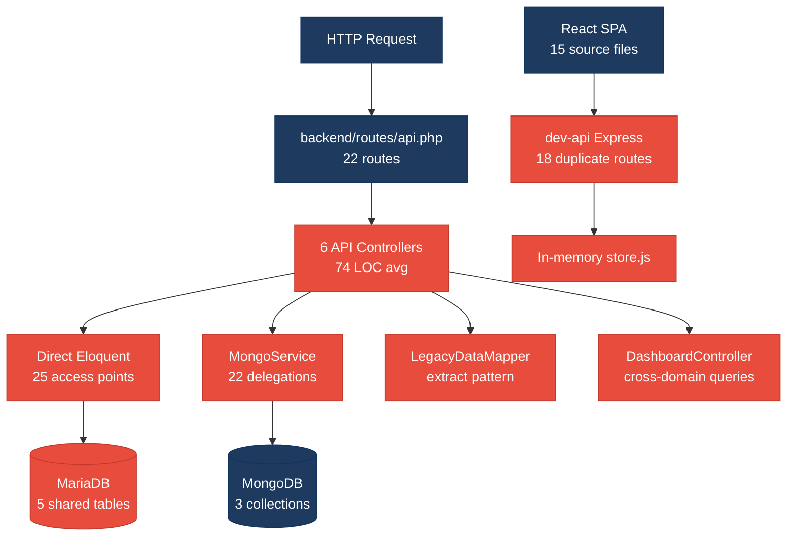
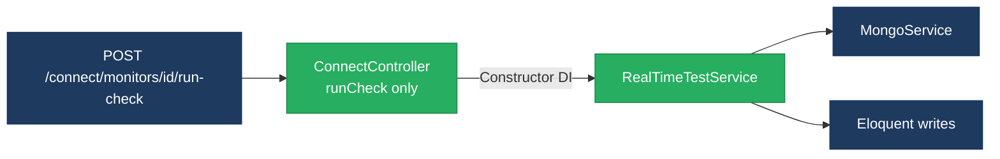
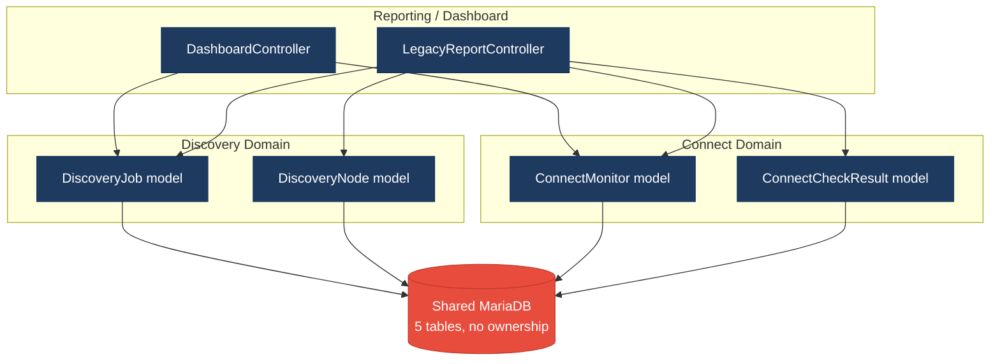
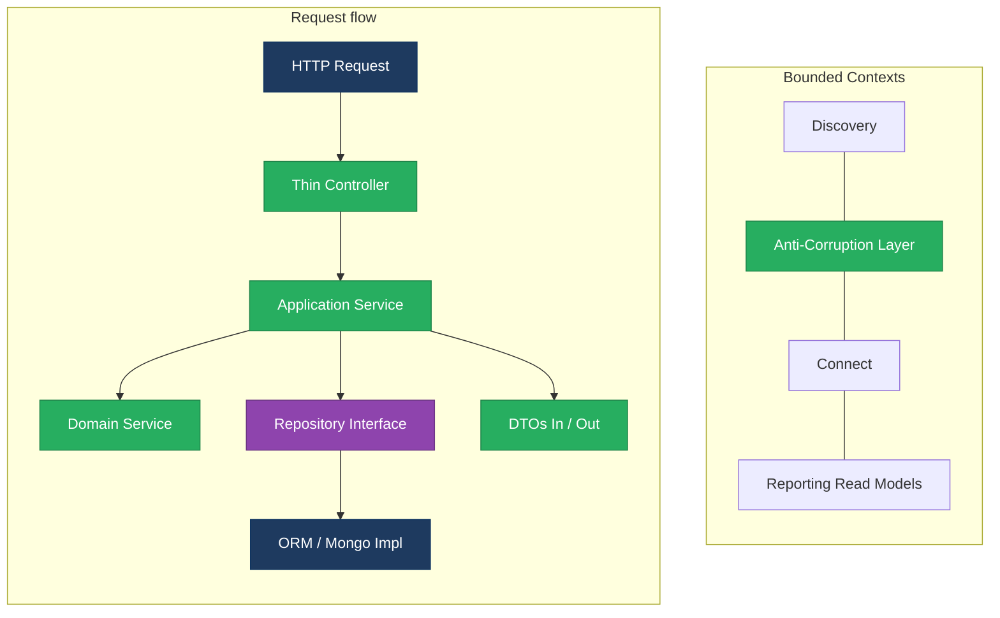
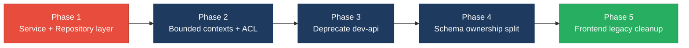

# 1. Architecture & Design Hotspots Analysis

**Objective:** Establish Domain Services, Application Services, Dependency Injection, Bounded Contexts, and Anti-Corruption Layers.

**Date:** July 14, 2026 | **Scope:** `shende-shweta/FSDKC` (Klearcom) — Laravel 12 PHP API, React 19 / Vite 6 / TypeScript SPA, Node.js Express `dev-api`

## Executive Summary

> **Executive Summary**
>
> Analysis covered **backend** (15 PHP application files: 6 API controllers, 4 Eloquent models, 2 services, 0 repositories), **frontend** (15 TS/TSX/JSX source files across pages, components, hooks, and store), and **dev-api** (6 JS files mirroring 18 Laravel routes) from `shende-shweta/FSDKC@main` via GitHub REST. The Klearcom monorepo runs three parallel runtimes with no repository layer and thin service coverage. Backend layering is the dominant risk: **25 controller-to-model Eloquent access points** bypass application services, **54 persistence calls** occur outside any repository abstraction (32 Eloquent + 22 MongoDB delegations), and **8 cross-domain query sites** in `DashboardController` couple Discovery and Connect models without an anti-corruption layer. Four of five MariaDB tables lack domain-exclusive ownership (**80% shared-table coupling**), and Laravel + `dev-api` duplicate reachability KPI math, IVR `buildTree`, and dashboard aggregation in parallel. Frontend architecture is comparatively healthy (avg **81 LOC** per view component, centralized `api/client.ts`, max prop-drilling depth **1**), but one legacy class component lacks lifecycle cleanup. Overall verdict: **High Risk**, driven by H2, H3, H8, H9, and H10.

<div class="metric-grid">
<div class="metric-card"><div class="metric-number">6</div><div class="metric-label">Controllers / Handlers</div></div>
<div class="metric-card"><div class="metric-number">4</div><div class="metric-label">Models / Entities</div></div>
<div class="metric-card"><div class="metric-number">2</div><div class="metric-label">Service Classes Found</div></div>
<div class="metric-card"><div class="metric-number">0</div><div class="metric-label">Repository Classes Found</div></div>
</div>

<div class="overall-rating overall-rating--high-risk"><div class="overall-rating-label">Overall Codebase Rating — Architecture &amp; Design</div><div class="overall-rating-value">High Risk</div><div class="overall-rating-note">Driven by High-Risk Missing Service Layer (H2), Missing Repository Pattern (H3), Domain Boundary Violations (H8), Shared Database Coupling (H9), and Parallel API Runtimes (H10).</div></div>

## 1.1 Benchmark Ratings Summary

One row per hotspot. "Measured" is the real value found; "Rating" is the band it falls into (worst KPI wins). This table is the source for the Overall Codebase Rating banner above.

| # | Hotspot | Primary KPI | <span class="rating rating-good">Good</span> | <span class="rating rating-moderate">Moderate</span> | <span class="rating rating-high-risk">High Risk</span> | Measured | Rating |
|---|---|---|---|---|---|---|---|
| H1 | Fat Controllers | Avg LOC per controller | <150 | 150–300 | >300 | 74 LOC avg | <span class="rating rating-good">Good</span> |
| H2 | Missing Service Layer | Controllers accessing repos/models | <10 | 10–20 | >20 | 25 access points | <span class="rating rating-high-risk">High Risk</span> |
| H3 | Missing Repository Pattern | Direct DB access points | <10 | 10–20 | >20 | 54 access points | <span class="rating rating-high-risk">High Risk</span> |
| H4 | Circular Dependencies | Dependency cycles | 0 | 1–3 | >3 | 0 | <span class="rating rating-good">Good</span> |
| H5 | Shared Utility Abuse | Utility files w/ business logic | 0 | 1–5 | >5 | 1 (`LegacyDataMapper`) | <span class="rating rating-moderate">Moderate</span> |
| H6 | Direct SQL in Controllers | ORM compliance % | >90% | 60–90% | <60% | 100% ORM | <span class="rating rating-good">Good</span> |
| H7 | God Classes | Classes >1000 LOC | 0 | 1–3 | >3 | 0 | <span class="rating rating-good">Good</span> |
| H8 | Domain Boundary Violations | Cross-domain access points | 0 | 1–5 | >5 | 8 | <span class="rating rating-high-risk">High Risk</span> |
| H9 | Shared Database Coupling | Tables shared across domains | <10% | 10–30% | >30% | 80% (4/5 tables) | <span class="rating rating-high-risk">High Risk</span> |
| F1 | Business Logic in Components | Avg LOC per component | <150 | 150–300 | >300 | 81 LOC avg | <span class="rating rating-good">Good</span> |
| F2 | Missing Frontend Service/Data Layer | Components w/ inline API calls | <10 | 10–20 | >20 | 7 files | <span class="rating rating-good">Good</span> |
| F3 | God / Oversized Components | Components >400 LOC | 0 | 1–3 | >3 | 0 | <span class="rating rating-good">Good</span> |
| F4 | Prop Drilling / Global State Abuse | Max prop-drilling depth | ≤2 | 3–4 | >4 | 1 level | <span class="rating rating-good">Good</span> |
| F5 | Legacy / Inconsistent Component Patterns | Legacy-pattern components | 0 | 1–10 | >10 | 1 class component | <span class="rating rating-moderate">Moderate</span> |
| H10 | Parallel API Runtimes (additional) | Duplicate API implementations across runtimes | 0 | 1 | ≥2 | 2 (Laravel + dev-api) | <span class="rating rating-high-risk">High Risk</span> |

## 1.2 Hotspot-by-Hotspot Evidence

### H1. Fat Controllers <span class="sev sev-medium">Medium</span>

**Benchmark:** `Avg LOC per controller = 74` → falls in the **Good** band (Good <150 · Moderate 150–300 · High Risk >300).

**What to check:** Business logic inside controllers/handlers; controllers should only translate HTTP ↔ application calls.

**Evidence:** Average controller size is within the Good band (74 LOC across 6 API controllers), but three controllers embed domain logic despite being short:

`backend/app/Http/Controllers/Api/ConnectController.php:65-75` — reachability KPI calculation duplicated from `RealTimeTestService` and `dev-api/src/realtime.js`:

```php
$recentChecks = ConnectCheckResult::where('connect_monitor_id', $id)
    ->orderByDesc('checked_at')->limit(20)->get();
$successRate = $recentChecks->count() > 0
    ? ($recentChecks->where('reachable', true)->count() / $recentChecks->count()) * 100
    : 100;
$computedStatus = $successRate < 90 ? 'alert' : 'active';
```

`backend/app/Http/Controllers/Api/DiscoveryController.php:87-101` — recursive `buildTree()` domain algorithm lives in the controller:

```php
private function buildTree($nodes, ?int $parentId = null): array
{
    return $nodes->where('parent_id', $parentId)
        ->map(fn (DiscoveryNode $node) => [
            'id' => $node->id,
            'children' => $this->buildTree($nodes, $node->id),
        ])->values()->all();
}
```

`backend/app/Http/Controllers/Api/LegacyReportController.php:19-51` — report aggregation, `extract()` filter parsing, and per-monitor reachability math in one handler (93 LOC total with duplicated `buildTree` at lines 78–91).

**Why it matters here:** Controllers stay under 150 LOC but act as application services. Any KPI formula change must be patched in `ConnectController`, `LegacyReportController`, `RealTimeTestService`, and `dev-api/src/realtime.js` simultaneously.

**Recommended approach:** (1) Extract `ReachabilityCalculator` from `ConnectController:65-75`. (2) Move `buildTree` to `DiscoveryTreeService` shared by `DiscoveryController` and `LegacyReportController`. (3) Keep controllers to validation + service delegation only.

<!-- affected-files
search: (successRate|buildTree|extract\()
glob: backend/app/Http/Controllers/**/*.php
issue: Business logic embedded in controller
action: Extract into application/domain services
-->

### H2. Missing Service Layer <span class="sev sev-critical">Critical</span>

**Benchmark:** `Controllers accessing repos/models = 25` → falls in the **High Risk** band (Good <10 · Moderate 10–20 · High Risk >20).

**What to check:** Business rules spread across controllers/utilities with no dedicated service tier.

**Evidence:**

`backend/app/Http/Controllers/Api/ConnectController.php:22-89` — seven direct `ConnectMonitor::` / `ConnectCheckResult::` Eloquent calls with no intervening application service:

```php
$monitors = ConnectMonitor::orderByDesc('last_checked_at')->get();
// ...
$monitor = ConnectMonitor::create([...]);
$monitor = ConnectMonitor::with(['checkResults' => ...])->findOrFail($id);
```

`backend/app/Http/Controllers/Api/DashboardController.php:14-33` — eight aggregate queries across Discovery and Connect models inline in the KPI handler:

```php
$discoveryTotal = DiscoveryJob::count();
$connectMonitors = ConnectMonitor::count();
$avgReachability = ConnectMonitor::avg('reachability_pct') ?? 0;
$alerts = ConnectMonitor::where('status', 'alert')->count();
```

Only `MongoService` and `RealTimeTestService` exist; no `ConnectMonitorService`, `DiscoveryJobService`, or `DashboardKpiService`. Controllers in 4 of 6 API controllers call Eloquent directly.

**Why it matters here:** CLI jobs, queue workers, and future gRPC endpoints cannot reuse Connect reachability or Discovery tree workflows without duplicating controller code. Test coverage requires HTTP bootstrapping for every business rule.

**Recommended approach:** Introduce `ConnectMonitorService`, `DiscoveryJobService`, and `DashboardKpiService`; inject via constructor DI; move all 25 controller model-access points into these services.

<!-- affected-files
search: (ConnectMonitor|ConnectCheckResult|DiscoveryJob|DiscoveryNode)::
glob: backend/app/Http/Controllers/**/*.php
issue: Controller bypasses service layer
action: Delegate to application services
-->

### H3. Missing Repository Pattern <span class="sev sev-critical">Critical</span>

**Benchmark:** `Direct DB access points = 54` → falls in the **High Risk** band (Good <10 · Moderate 10–20 · High Risk >20).

**What to check:** Direct DB/ORM access scattered through the codebase without a repository abstraction.

**Evidence:**

`backend/app/Services/RealTimeTestService.php:24-73` — service performs 7 Eloquent writes/reads and 9 MongoDB operations directly:

```php
$job = DiscoveryJob::findOrFail($jobId);
$node = DiscoveryNode::create([...]);
$this->mongo->storeTestEvent($sessionId, 'discovery', $jobId, [...]);
```

`backend/app/Services/MongoService.php:68-150` — MongoDB driver calls (`insertOne`, `find`, `countDocuments`) with no interface abstraction; injected into 4 controllers.

`dev-api/src/store.js` + `dev-api/src/mongo.js` — parallel in-memory and Mongo persistence with zero shared repository contracts.

Zero files match `*Repository*.php` in the backend tree.

**Why it matters here:** Swapping MariaDB for a read replica or mocking persistence in unit tests requires stubbing Eloquent facades and MongoDB clients across 54 call sites. Schema migrations silently break controllers and services together.

**Recommended approach:** Create repository interfaces for 4 Eloquent models and 3 MongoDB collections; route all 54 persistence access points through injected implementations.

<!-- affected-files
search: (ConnectMonitor|ConnectCheckResult|DiscoveryJob|DiscoveryNode)::|\$this->mongo->
glob: backend/app/**/*.php
issue: Direct persistence access outside repository
action: Introduce repository interfaces and implementations
-->

### H4. Circular Dependencies <span class="sev sev-low">Low</span>

**Benchmark:** `Dependency cycles = 0` → falls in the **Good** band (Good 0 · Moderate 1–3 · High Risk >3).

**What to check:** Modules/packages importing each other in cycles.

**Evidence:** Not observed — Laravel namespace graph is acyclic: controllers → services → models; `MongoService` has no upstream imports from controllers. No PHP or JS import cycles detected across 38 scanned source files.

### H5. Shared Utility Abuse <span class="sev sev-medium">Medium</span>

**Benchmark:** `Utility files w/ business logic = 1` → falls in the **Moderate** band (Good 0 · Moderate 1–5 · High Risk >5).

**What to check:** Large common/helper files holding business logic instead of domain services.

**Evidence:**

`backend/app/Legacy/LegacyDataMapper.php:10-31` — uses unsafe `extract()` to map report rows, embedding field-name business conventions:

```php
public function mapReportRow(array $row): array
{
    extract($row, EXTR_SKIP);
    return [
        'label' => $name ?? 'Unknown',
        'metric' => $reachability_pct ?? 0,
        'region' => $country_code ?? 'N/A',
        'source' => 'legacy_extract_mapper',
    ];
}
```

`backend/app/Http/Controllers/Api/LegacyReportController.php:21-22` — controller calls `extract($filters)` on raw request input, coupling HTTP params to variable names.

**Why it matters here:** `LegacyDataMapper` becomes an unowned dumping ground; adding a report field requires changing the mapper, controller, and frontend types together with no compile-time safety.

**Recommended approach:** Replace `extract()` with typed DTO mappers (`ReportRowDto`, `JobContextDto`); remove dynamic variable injection from `LegacyReportController`.

<!-- affected-files
search: extract\(
glob: backend/app/Legacy/**/*.php
issue: Shared utility holds business mapping logic
action: Replace with typed DTO mappers
-->

### H6. Direct SQL in Controllers <span class="sev sev-low">Low</span>

**Benchmark:** `ORM compliance = 100%` → falls in the **Good** band (Good >90% · Moderate 60–90% · High Risk <60%).

**What to check:** Raw SQL strings embedded directly in controllers/handlers.

**Evidence:** Not observed — all 6 API controllers use Eloquent query builder exclusively; zero `DB::raw`, `DB::select`, or inline SQL strings found. Persistence concern is architectural (no repository layer), not raw SQL leakage.

### H7. God Classes <span class="sev sev-low">Low</span>

**Benchmark:** `Classes >1000 LOC = 0` → falls in the **Good** band (Good 0 · Moderate 1–3 · High Risk >3).

**What to check:** Single classes/files handling many unrelated responsibilities above 1000 LOC.

**Evidence:** Not observed — largest backend file is `RealTimeTestService.php` at 141 LOC; largest frontend file is `ConnectPage.tsx` at 222 LOC; `dev-api/src/server.js` is 277 LOC. All well under the 1000 LOC threshold.

### H8. Domain Boundary Violations <span class="sev sev-critical">Critical</span>

**Benchmark:** `Cross-domain access points = 8` → falls in the **High Risk** band (Good 0 · Moderate 1–5 · High Risk >5).

**What to check:** Code in one business area directly reading/writing another area's data or models.

**Evidence:**

`backend/app/Http/Controllers/Api/DashboardController.php:6-33` — Reporting/Dashboard context imports and queries both Discovery and Connect models in a single handler (8 Eloquent access sites):

```php
use App\Models\ConnectMonitor;
use App\Models\DiscoveryJob;
// ...
$discoveryTotal = DiscoveryJob::count();
$avgReachability = ConnectMonitor::avg('reachability_pct') ?? 0;
```

`backend/app/Http/Controllers/Api/LegacyReportController.php:7-10` — single controller imports all four domain models, mixing Connect carrier reports and Discovery IVR depth reports without bounded-context separation:

```php
use App\Models\ConnectCheckResult;
use App\Models\ConnectMonitor;
use App\Models\DiscoveryJob;
use App\Models\DiscoveryNode;
```

**Why it matters here:** Dashboard KPI changes require simultaneous edits to Discovery and Connect model queries. Extracting either module to a microservice breaks `DashboardController` without an anti-corruption layer.

**Recommended approach:** Split `DashboardKpiService` into Discovery and Connect read-model adapters; enforce module boundaries via published internal APIs or CQRS read models.

<!-- affected-files
search: use App\\Models\\(ConnectMonitor|DiscoveryJob)
glob: backend/app/Http/Controllers/**/*.php
issue: Cross-domain model access in controller
action: Enforce bounded contexts with read-model adapters
-->

### H9. Shared Database Coupling <span class="sev sev-critical">Critical</span>

**Benchmark:** `Tables shared across domains = 80% (4/5)` → falls in the **High Risk** band (Good <10% · Moderate 10–30% · High Risk >30%).

**What to check:** Multiple business domains reading/writing the same tables directly without schema ownership.

**Evidence:**

`docker/mariadb/init.sql:10-62` — five tables in a single schema with no per-domain ownership:

```sql
CREATE TABLE IF NOT EXISTS discovery_jobs (...);
CREATE TABLE IF NOT EXISTS discovery_nodes (...);
CREATE TABLE IF NOT EXISTS connect_monitors (...);
CREATE TABLE IF NOT EXISTS connect_check_results (...);
```

`DashboardController` reads all four business tables; `RealTimeTestService` writes to both Discovery and Connect tables from one service class. No separate schemas, migration namespaces, or integration views exist.

**Why it matters here:** A Discovery schema change (e.g., adding `discovery_jobs.priority`) silently affects Dashboard KPI queries and Connect-side reporting with no ownership boundary.

**Recommended approach:** Assign table ownership per domain in `docker/mariadb/init.sql`; introduce per-domain migration files and integration views for cross-domain KPIs.

<!-- affected-files
glob: docker/mariadb/**/*.sql
issue: Shared schema with no domain ownership
action: Split schema ownership per bounded context
-->

### H10. Parallel API Runtimes (additional) <span class="sev sev-critical">Critical</span>

**Benchmark:** `Duplicate API implementations = 2` → falls in the **High Risk** band (Good 0 · Moderate 1 · High Risk ≥2).

**What to check:** Same API surface implemented in multiple runtimes without code generation or shared contracts.

**Evidence:**

`backend/routes/api.php:25-48` — 18 Laravel API routes for dashboard, discovery, connect, MongoDB, and streaming.

`dev-api/src/server.js:58-213` — parallel Express handlers for the same endpoints using in-memory `store.js` instead of Eloquent:

```javascript
app.get('/api/dashboard/kpis', async (_req, res) => {
  const discoveryTotal = store.discoveryJobs.length;
  const avgReach = store.connectMonitors.reduce((s, m) => s + m.reachability_pct, 0) / store.connectMonitors.length;
```

`dev-api/src/realtime.js:117-118` duplicates reachability rate calculation from `RealTimeTestService.php:117-118`; `dev-api/src/store.js` duplicates `buildTree` from `DiscoveryController.php:87-101`.

**Why it matters here:** Local development via `dev-api` can pass while Laravel production fails (or vice versa) because business rules are maintained in two languages with no OpenAPI contract.

**Recommended approach:** Deprecate `dev-api` duplicate runtime; consolidate to Laravel API with Docker Compose for local dev, or generate `dev-api` from OpenAPI spec.

<!-- affected-files
glob: dev-api/src/**/*.js
issue: Parallel API runtime duplicates Laravel logic
action: Consolidate to single API runtime or generate from spec
-->

### F1. Business Logic in Components <span class="sev sev-low">Low</span>

**Benchmark:** `Avg LOC per component = 81` → falls in the **Good** band (Good <150 · Moderate 150–300 · High Risk >300).

**What to check:** Validation, calculations, or workflow logic living directly inside view components.

**Evidence:** Nine view components/pages average 81 LOC (range 22–222). Largest is `ConnectPage.tsx` at 222 LOC — still under 300. Pages delegate streaming to `useRealtimeTest` hook and server state to TanStack Query:

`frontend/src/pages/ConnectPage.tsx:50-56` — orchestration stays thin; mutations invalidate query keys rather than embedding business rules:

```typescript
const handleRunCheck = async (monitorId: number) => {
  setSelectedId(monitorId);
  await startConnectCheck(monitorId);
  queryClient.invalidateQueries({ queryKey: ['connect'] });
};
```

`frontend/src/pages/LegacyDashboardWidget.tsx:16-44` — aggregates three API calls with manual `useEffect` polling (70 LOC); acceptable size but duplicates patterns from `DashboardPage`.

**Why it matters here:** Frontend components remain presentation-focused; the main risk is duplicated fetch/orchestration in `LegacyDashboardWidget`, not oversized render trees.

**Recommended approach:** Extract shared dashboard data hook from `LegacyDashboardWidget` and `DashboardPage` if the legacy widget is retained.

<!-- affected-files
glob: frontend/src/{pages,components}/**/*.{tsx,jsx}
issue: View component size and inline orchestration
action: Extract shared hooks for repeated data-fetch patterns
-->

### F2. Missing Frontend Service/Data Layer <span class="sev sev-low">Low</span>

**Benchmark:** `Components w/ inline API calls = 7` → falls in the **Good** band (Good <10 · Moderate 10–20 · High Risk >20).

**What to check:** `fetch`/`axios` calls and API URLs hard-coded inline in components instead of a shared client.

**Evidence:** All HTTP traffic routes through `frontend/src/api/client.ts` — no raw `fetch()` in pages or components:

`frontend/src/api/client.ts:1-26` — centralized base URL and JSON request wrapper:

```typescript
const API_BASE = import.meta.env.VITE_API_URL ?? 'http://localhost:8080/api';
export const api = {
  get: <T>(path: string) => request<T>(path),
  post: <T>(path: string, body: unknown) => request<T>(path, { method: 'POST', body: JSON.stringify(body) }),
};
```

Seven files call `api.get`/`api.post` directly in view/hook layers (`ConnectPage`, `DiscoveryPage`, `DashboardPage`, `LegacyDashboardWidget`, `MongoStatus`, `LegacyMonitorPoller`, `useRealtimeTest`) — acceptable for this codebase size but not yet extracted into domain-specific frontend services (e.g., `connectApi.ts`).

**Why it matters here:** Centralized client prevents URL sprawl; next scaling step is domain API modules to avoid pages importing generic `api` with string paths.

**Recommended approach:** Add `frontend/src/api/connect.ts` and `discovery.ts` modules wrapping typed endpoints; keep `client.ts` as transport only.

<!-- affected-files
search: api\.(get|post)
glob: frontend/src/**/*.{tsx,ts,jsx}
issue: API calls in view/hook layer
action: Extract domain-specific API modules
-->

### F3. God / Oversized Components <span class="sev sev-low">Low</span>

**Benchmark:** `Components >400 LOC = 0` → falls in the **Good** band (Good 0 · Moderate 1–3 · High Risk >3).

**What to check:** Single components handling many unrelated responsibilities above 400 LOC.

**Evidence:** Not observed — largest component is `ConnectPage.tsx` at 222 LOC; no component exceeds 400 LOC. `LiveTestFeed.tsx` (53 LOC) and `DiscoveryPage.tsx` (176 LOC) split rendering concerns appropriately.

### F4. Prop Drilling / Global State Abuse <span class="sev sev-low">Low</span>

**Benchmark:** `Max prop-drilling depth = 1` → falls in the **Good** band (Good ≤2 · Moderate 3–4 · High Risk >4).

**What to check:** Props threaded through many intermediate layers, or oversized global stores.

**Evidence:**

`frontend/src/App.tsx:31-35` — React Router renders pages directly with zero intermediate prop layers:

```tsx
<Routes>
  <Route path="/" element={<DashboardPage />} />
  <Route path="/discovery" element={<DiscoveryPage />} />
  <Route path="/connect" element={<ConnectPage />} />
</Routes>
```

`frontend/src/store/uiStore.ts:1-14` — minimal Zustand store (selected monitor ID only, 487 bytes). `ConnectPage` reads `selectedMonitorId` via selector — no deep prop threading. `DashboardPage` passes `label`/`value` one level to local `KpiCard` helper (depth 1).

**Why it matters here:** State architecture is clean for current scale; no global store abuse detected.

### F5. Legacy / Inconsistent Component Patterns <span class="sev sev-medium">Medium</span>

**Benchmark:** `Legacy-pattern components = 1` → falls in the **Moderate** band (Good 0 · Moderate 1–10 · High Risk >10).

**What to check:** Mixed paradigms (class + function components), missing error boundaries, deprecated lifecycle APIs.

**Evidence:**

`frontend/src/components/LegacyMonitorPoller.jsx:17-33` — class component with interval in `componentDidMount` and **no** `componentWillUnmount` cleanup:

```jsx
export default class LegacyMonitorPoller extends Component<Props, State> {
  componentDidMount() {
    this.intervalId = setInterval(() => {
      api.get(`/connect/monitors/${this.props.monitorId}/checks`)
        .then((res) => { /* ... */ });
    }, 3000);
    // Intentionally no componentWillUnmount — interval leak for audit finding
  }
}
```

`frontend/src/pages/LegacyDashboardWidget.tsx:48` — throws uncaught errors with no Error Boundary wrapper:

```typescript
if (error) throw new Error(error); // Uncaught — no Error Boundary wraps this component
```

All other 14 frontend files use function components with hooks.

**Why it matters here:** SPA navigation away from a page hosting `LegacyMonitorPoller` leaks intervals; uncaught throws in `LegacyDashboardWidget` crash the entire React tree.

**Recommended approach:** Rewrite `LegacyMonitorPoller.jsx` as a function component with `useEffect` cleanup; add Error Boundary around legacy widgets.

<!-- affected-files
search: class\s+\w+\s+extends\s+(React\.)?Component
glob: frontend/src/**/*.{jsx,tsx}
issue: Legacy class component without cleanup
action: Migrate to function component with useEffect cleanup
-->

## 1.3 Diagrams

### Current-state architecture (as-is)



### Clean reference path (target pattern found in codebase)



### Domain boundary map (business domains vs. shared data)



### Target architecture (proposed)



### Improvement roadmap



## 1.4 Actions Required

| Hotspot | Action | Rating | Priority |
|---|---|---|---|
| H2 — Missing Service Layer | Introduce `ConnectMonitorService`, `DiscoveryJobService`, and `DashboardKpiService`; move all 25 controller model-access points into application services with constructor DI. | <span class="rating rating-high-risk">High Risk</span> | <span class="sev sev-critical">Critical</span> |
| H3 — Missing Repository Pattern | Create repository interfaces for all 4 Eloquent models and 3 MongoDB collections; route 54 persistence access points through injected repository implementations. | <span class="rating rating-high-risk">High Risk</span> | <span class="sev sev-critical">Critical</span> |
| H5 — Shared Utility Abuse | Replace `LegacyDataMapper` `extract()` pattern with typed DTO mappers; remove `extract($filters)` from `LegacyReportController`. | <span class="rating rating-moderate">Moderate</span> | <span class="sev sev-medium">Medium</span> |
| H8 — Domain Boundary Violations | Split cross-domain access in `DashboardController` and `LegacyReportController`; enforce Discovery/Connect bounded contexts with published read APIs. | <span class="rating rating-high-risk">High Risk</span> | <span class="sev sev-critical">Critical</span> |
| H9 — Shared Database Coupling | Assign table ownership per domain in `docker/mariadb/init.sql`; introduce per-domain migration files and integration views for cross-domain KPIs. | <span class="rating rating-high-risk">High Risk</span> | <span class="sev sev-critical">Critical</span> |
| H10 — Parallel API Runtimes | Deprecate `dev-api` duplicate runtime; consolidate to Laravel API with Docker Compose for local dev, or generate dev-api from OpenAPI spec. | <span class="rating rating-high-risk">High Risk</span> | <span class="sev sev-critical">Critical</span> |
| F5 — Legacy Component Patterns | Rewrite `LegacyMonitorPoller.jsx` as function component with `useEffect` cleanup; add Error Boundary around `LegacyDashboardWidget`. | <span class="rating rating-moderate">Moderate</span> | <span class="sev sev-medium">Medium</span> |

## 1.5 Expected Outcomes

- **Testable business logic:** Application services and repositories enable unit tests without HTTP or database bootstrapping, cutting test setup time for Connect reachability and Discovery tree workflows.
- **Independent domain evolution:** Bounded contexts with owned schemas let Discovery and Connect teams ship schema changes without cross-module regressions in dashboard KPIs.
- **Single source of truth:** Eliminating the parallel `dev-api` runtime removes behavioral drift between local development and production Laravel deployments.
- **Reduced change amplification:** Centralizing reachability calculation and IVR tree building in one service eliminates the current four-way duplication across controllers, services, and Node handlers.
- **Frontend stability:** Migrating the legacy class component and adding Error Boundaries prevents interval leaks and uncaught render errors during SPA navigation.
