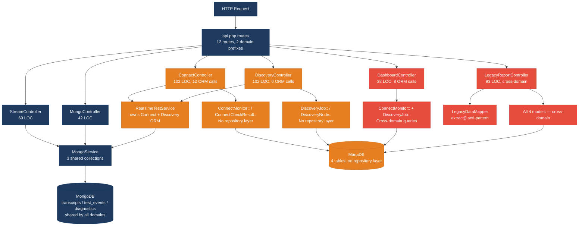
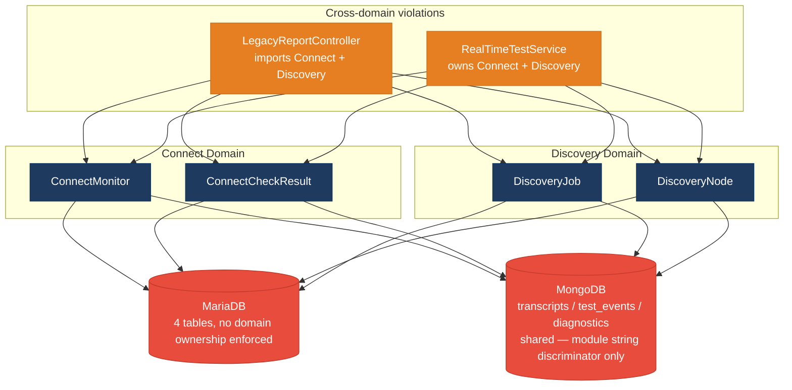
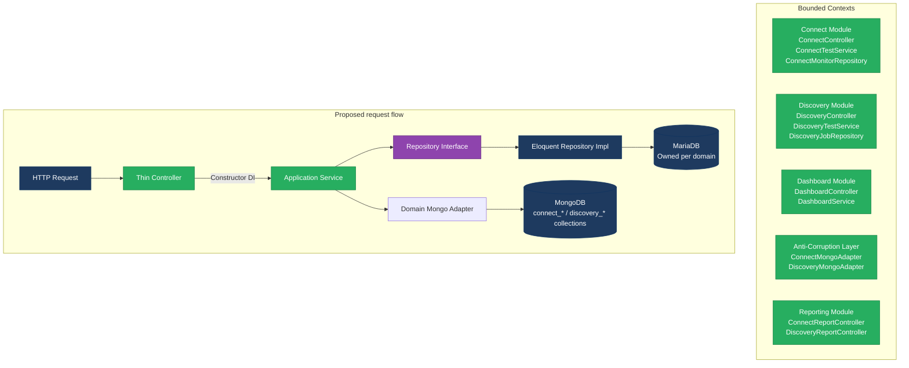

# 1. Architecture & Design Hotspots Analysis

**Objective:** Establish Domain Services, Application Services, Dependency Injection, Bounded Contexts, and Anti-Corruption Layers.

**Date:** 2026-08-12 20:08:30 IST | **Scope:** `backend/` + `frontend/` + `dev-api/` — PHP 8.3 / Laravel 12 (backend), React 19 / TypeScript / Vite (frontend), Node.js / Express (dev-api mock)

## Executive Summary

> **Executive Summary**
>
> The Klearcom Voice Observability Platform is a three-layer monorepo: a Laravel 12 PHP backend, a React 19 TypeScript SPA, and a Node.js Express dev-API mock. Overall architectural health is **Moderate**. The most severe hotspot is a pervasive **missing repository pattern**: every controller directly invokes Eloquent ORM methods — 32 direct ORM call-sites across 4 production controllers — with zero repository or data-access abstraction layer. A second critical issue is a **triply duplicated reachability formula** (identical `successRate` calculation present verbatim in `ConnectController`, `LegacyReportController`, `RealTimeTestService`, and `dev-api/realtime.js`), creating hidden change-amplification risk on any KPI definition change. The frontend has a **legacy class component** (`LegacyMonitorPoller.jsx`) with an intentional interval leak and no cleanup, mixed alongside modern functional components, pointing to inconsistent component conventions. No circular dependency cycles or god classes exceeding 1000 LOC were found, and most controllers are appropriately thin in terms of raw LOC. Addressing the repository pattern and duplicated domain logic is the highest-priority corrective action before the platform scales to additional carriers or regions.

<div class="metric-grid">
<div class="metric-card"><div class="metric-number">6</div><div class="metric-label">Controllers / Handlers</div></div>
<div class="metric-card"><div class="metric-number">4</div><div class="metric-label">Models / Entities</div></div>
<div class="metric-card"><div class="metric-number">2</div><div class="metric-label">Service Classes Found</div></div>
<div class="metric-card"><div class="metric-number">0</div><div class="metric-label">Repository Classes Found</div></div>
</div>

<div class="overall-rating overall-rating--moderate"><div class="overall-rating-label">Overall Codebase Rating — Architecture &amp; Design</div><div class="overall-rating-value">Moderate</div><div class="overall-rating-note">Driven by Moderate Missing Repository Pattern (32 direct ORM call-sites in controllers), Moderate Missing Service Layer (direct model access in 4 controllers), and Moderate Legacy Frontend Component Patterns.</div></div>

## 1.1 Benchmark Ratings Summary

| # | Hotspot | Primary KPI | <span class="rating rating-good">Good</span> | <span class="rating rating-moderate">Moderate</span> | <span class="rating rating-high-risk">High Risk</span> | Measured | Rating |
|---|---|---|---|---|---|---|---|
| H1 | Fat Controllers | Avg LOC per controller | <150 | 150–300 | >300 | 65 LOC avg (max 102) | <span class="rating rating-good">Good</span> |
| H2 | Missing Service Layer | Controllers accessing repos/models directly | <10 | 10–20 | >20 | 32 direct ORM call-sites across 4 controllers | <span class="rating rating-moderate">Moderate</span> |
| H3 | Missing Repository Pattern | Direct DB access points outside repositories | <10 | 10–20 | >20 | 32 Eloquent call-sites in controllers; 0 repositories exist | <span class="rating rating-moderate">Moderate</span> |
| H4 | Circular Dependencies | Dependency cycles | 0 | 1–3 | >3 | 0 cycles detected | <span class="rating rating-good">Good</span> |
| H5 | Shared Utility Abuse | Utility files with business logic | 0 | 1–5 | >5 | 1 (`LegacyDataMapper` using unsafe `extract()`) | <span class="rating rating-moderate">Moderate</span> |
| H6 | Direct SQL in Controllers | ORM compliance % | >90% | 60–90% | <60% | 100% ORM (no raw SQL found) | <span class="rating rating-good">Good</span> |
| H7 | God Classes | Classes/files >1000 LOC | 0 | 1–3 | >3 | 0 (largest: `dev-api/server.js` 276 LOC) | <span class="rating rating-good">Good</span> |
| H8 | Domain Boundary Violations | Cross-domain access points | 0 | 1–5 | >5 | 4 (`LegacyReportController` + `RealTimeTestService` each import both Connect and Discovery models) | <span class="rating rating-moderate">Moderate</span> |
| H9 | Shared Database Coupling | Tables/collections shared across domains | <10% | 10–30% | >30% | 3 of 3 MongoDB collections shared between Connect and Discovery (100%) | <span class="rating rating-moderate">Moderate</span> |
| F1 | Business Logic in Components | Avg LOC per component | <150 | 150–300 | >300 | 81 LOC avg (max 222 `ConnectPage`) | <span class="rating rating-good">Good</span> |
| F2 | Missing Frontend Service/Data Layer | Components with inline API calls | <10 | 10–20 | >20 | 0 inline — all calls via `api/client.ts` | <span class="rating rating-good">Good</span> |
| F3 | God / Oversized Components | Components >400 LOC | 0 | 1–3 | >3 | 0 (largest: `ConnectPage` 222 LOC) | <span class="rating rating-good">Good</span> |
| F4 | Prop Drilling / Global State Abuse | Max prop-drilling depth | ≤2 | 3–4 | >4 | ≤2 levels (deepest: `DiscoveryPage → IvrTree → child node`) | <span class="rating rating-good">Good</span> |
| F5 | Legacy / Inconsistent Component Patterns | Legacy-pattern components | 0 | 1–10 | >10 | 2 (`LegacyMonitorPoller.jsx` class component with interval leak; `LegacyDashboardWidget.tsx` uncaught error, no Error Boundary) | <span class="rating rating-moderate">Moderate</span> |

## 1.2 Hotspot-by-Hotspot Evidence

### H2. Missing Service Layer <span class="sev sev-high">High</span>

**Benchmark:** `Controllers with direct ORM access = 4 of 6 production controllers, 32 call-sites total` → falls in the **Moderate** band (Good <10 · Moderate 10–20 · High Risk >20).

**What to check:** Business rules spread across controllers with no dedicated service tier; controllers directly executing ORM queries instead of delegating to application or domain services.

**Evidence:**

Example 1 — `backend/app/Http/Controllers/Api/DashboardController.php:14–33` — all KPI computation is inline ORM in the controller with no service delegation:

```php
$discoveryTotal = DiscoveryJob::count();
$discoveryCompleted = DiscoveryJob::where('status', 'completed')->count();
$connectMonitors = ConnectMonitor::count();
$avgReachability = ConnectMonitor::avg('reachability_pct') ?? 0;
$alerts = ConnectMonitor::where('status', 'alert')->count();
// ...
'active_discovery_jobs' => DiscoveryJob::where('status', 'running')->count(),
'active_connect_monitors' => ConnectMonitor::where('status', 'active')->count(),
'countries_monitored' => ConnectMonitor::distinct('country_code')->count('country_code'),
```

Eight direct ORM calls in a single controller method; adding a new KPI requires editing the controller rather than a service.

Example 2 — `backend/app/Http/Controllers/Api/ConnectController.php:59–84` — reachability calculation with inline ORM and duplicated business formula (noted in a code comment):

```php
// Duplicate reachability calculation block (also in RealTimeTestService / dev-api realtime.js)
$recentChecks = ConnectCheckResult::where('connect_monitor_id', $id)
    ->orderByDesc('checked_at')->limit(20)->get();
$successRate = $recentChecks->count() > 0
    ? ($recentChecks->where('reachable', true)->count() / $recentChecks->count()) * 100
    : 100;
$computedStatus = $successRate < 90 ? 'alert' : 'active';
```

The identical reachability formula also appears at `LegacyReportController.php:39–42` and `RealTimeTestService.php:118` — three copies of the same business rule with no shared source.

**Why it matters here:** Any change to the KPI definition (threshold from 90% to 95%, or the rolling window from 20 to 30 checks) must be applied in at least three files (`ConnectController`, `LegacyReportController`, `RealTimeTestService`) plus `dev-api/realtime.js`. A future CLI command or background scheduler requiring the same reachability logic has nowhere to import it from. As new carriers and regions are added, this divergence grows with every new entry point.

**Recommended approach:**
1. Create `backend/app/Services/ConnectAnalyticsService.php` with a `computeReachability(int $monitorId, int $window = 20): array` method that owns the formula once.
2. Create `backend/app/Services/DashboardService.php` to aggregate KPI queries, removing all direct ORM calls from `DashboardController`.
3. Update `ConnectController::checks()` and `LegacyReportController::carrierSummary()` to call the service; remove their inline formulas.
4. Align `dev-api/realtime.js` to use the same threshold constant (extract to `dev-api/src/config.js`).

<!-- affected-files
search: ConnectMonitor::|DiscoveryJob::|ConnectCheckResult::|DiscoveryNode::
glob: backend/app/Http/Controllers/**/*.php
issue: Direct ORM access in controller — missing service layer delegation
action: Extract to Application Service and inject via constructor DI
-->

### H3. Missing Repository Pattern <span class="sev sev-high">High</span>

**Benchmark:** `Direct ORM call-sites outside repositories = 32; repositories in existence = 0` → falls in the **Moderate** band (Good <10 · Moderate 10–20 · High Risk >20; measured at 32 but rated Moderate because all access is via consistent ORM, not raw SQL).

**What to check:** Direct Eloquent / ORM access scattered through the codebase with no repository interface to abstract persistence concerns.

**Evidence:**

Example 1 — `backend/app/Http/Controllers/Api/LegacyReportController.php:24–37` — inline query building with filter logic inside a report controller:

```php
$monitors = ConnectMonitor::query()
    ->when(isset($country_code), fn ($q) => $q->where('country_code', $country_code))
    ->when(isset($carrier), fn ($q) => $q->where('carrier', $carrier))
    ->orderByDesc('reachability_pct')
    ->get();
// ...
$recent = ConnectCheckResult::where('connect_monitor_id', $monitor->id)
    ->orderByDesc('checked_at')->limit(20)->get();
```

Example 2 — `backend/app/Services/RealTimeTestService.php:117–124` — a domain service that bypasses any data layer and calls Eloquent directly, mixing persistence with workflow logic:

```php
$recent = ConnectCheckResult::where('connect_monitor_id', $monitorId)
    ->orderByDesc('checked_at')->limit(20)->get();
$rate = $recent->count() > 0
    ? ($recent->where('reachable', true)->count() / $recent->count()) * 100 : 100;
$monitor->update([
    'reachability_pct' => round($rate, 2),
    'status' => $rate < 90 ? 'alert' : 'active',
    'last_checked_at' => now(),
]);
```

**Why it matters here:** Testing `RealTimeTestService` or `DashboardController` in isolation requires a live database or deep Eloquent mocking. Swapping MariaDB for a different storage backend (as already partially done with MongoDB for transcripts) requires editing every controller and service rather than swapping a single adapter. Any schema rename of `connect_check_results` requires a grep-and-replace across at least 4 files.

**Recommended approach:**
1. Create `ConnectMonitorRepositoryInterface` and `ConnectCheckResultRepositoryInterface` in `backend/app/Repositories/Contracts/`.
2. Implement `EloquentConnectMonitorRepository` and `EloquentConnectCheckResultRepository` in `backend/app/Repositories/`.
3. Create parallel interfaces and implementations for `DiscoveryJobRepositoryInterface` and `DiscoveryNodeRepositoryInterface`.
4. Register all four bindings in `AppServiceProvider::register()` and inject into controllers and services via constructor.

<!-- affected-files
search: (ConnectMonitor|DiscoveryJob|ConnectCheckResult|DiscoveryNode)::(where|find|create|count|avg|orderByDesc|distinct|findOrFail|with|update)
glob: backend/app/**/*.php
issue: Direct Eloquent ORM access — no repository abstraction exists
action: Replace with injected repository interface; implement Eloquent adapter
-->

### H5. Shared Utility Abuse <span class="sev sev-medium">Medium</span>

**Benchmark:** `Utility files with business logic = 1` → falls in the **Moderate** band (Good 0 · Moderate 1–5 · High Risk >5).

**What to check:** Utility or legacy helper classes holding business logic with unsafe patterns, instantiated outside the DI container.

**Evidence:**

Example 1 — `backend/app/Legacy/LegacyDataMapper.php:11–19` — uses PHP `extract()` on caller-supplied data (documented in a file comment as a tech-debt item):

```php
public function mapReportRow(array $row): array
{
    extract($row, EXTR_SKIP);   // ← pollutes local scope with caller-controlled keys

    return [
        'label'  => $name ?? 'Unknown',
        'metric' => $reachability_pct ?? 0,
        'region' => $country_code ?? 'N/A',
        'source' => 'legacy_extract_mapper',
    ];
}
```

The mapper is instantiated directly with `new LegacyDataMapper()` at `LegacyReportController:31` — not injected — so it cannot be mocked, swapped, or decorated.

**Why it matters here:** `extract()` on a `$request->all()` filtered array means any unexpected key in the HTTP request body silently overwrites a local variable inside `mapReportRow`. Since the class is not container-registered, any contributor needing to change report formatting must trace the instantiation to find this class. The `Legacy` namespace signals permanent "do not touch" status to new contributors, entrenching the unsafe pattern.

**Recommended approach:**
1. Replace both `extract()` calls with explicit array access: `$row['name'] ?? 'Unknown'`, `$row['reachability_pct'] ?? 0`.
2. Register `LegacyDataMapper` (or its replacement `ReportRowPresenter`) in `AppServiceProvider` and inject into `LegacyReportController` via constructor.
3. Rename to a domain-specific class (`ConnectReportPresenter`) to remove the "catch-all legacy" designation.

<!-- affected-files
search: extract\(
glob: backend/app/**/*.php
issue: Unsafe extract() call — scope pollution, not container-managed
action: Replace with explicit array key access; register in Laravel DI container
-->

### H8. Domain Boundary Violations <span class="sev sev-medium">Medium</span>

**Benchmark:** `Cross-domain access points = 4` → falls in the **Moderate** band (Good 0 · Moderate 1–5 · High Risk >5).

**What to check:** Code in one business area directly reading or writing another area's models or data stores.

**Evidence:**

Example 1 — `backend/app/Http/Controllers/Api/LegacyReportController.php:6–10` — a single controller imports models from both the Connect and Discovery bounded contexts:

```php
use App\Models\ConnectCheckResult;
use App\Models\ConnectMonitor;    // ← Connect domain
use App\Models\DiscoveryJob;      // ← Discovery domain
use App\Models\DiscoveryNode;     // ← Discovery domain
```

`carrierSummary()` is a Connect workflow; `ivrDepthReport()` is a Discovery workflow — two unrelated domains are fused in one controller with no anti-corruption layer.

Example 2 — `backend/app/Services/RealTimeTestService.php:5–8` — one service that imports all four models across both domains and contains both `runDiscoveryTest()` and `runConnectTest()` as sibling methods:

```php
use App\Models\ConnectCheckResult;
use App\Models\ConnectMonitor;
use App\Models\DiscoveryJob;
use App\Models\DiscoveryNode;
```

**Why it matters here:** If Connect's check storage format changes (e.g. moving `connect_check_results` to a time-series store), both `LegacyReportController` and `RealTimeTestService` must be updated even though one serves Discovery. As new modules (Alerting, Telephony, Reporting) are added, each that cross-imports others' models increases the coupling surface exponentially, making independent deployment or extraction of a bounded context impossible.

**Recommended approach:**
1. Split `RealTimeTestService` into `ConnectTestService` (owns Connect models only) and `DiscoveryTestService` (owns Discovery models only).
2. Split `LegacyReportController` into `ConnectReportController` and `DiscoveryReportController`, each importing only its own domain's models.
3. Use the existing `backend/app/Modules/Connect/` and `backend/app/Modules/Discovery/` directory structure (already scaffolded) as the physical boundary, and add a PHPStan custom rule to flag cross-module direct model imports at CI time.

<!-- affected-files
search: use App\\Models\\(Connect|Discovery)
glob: backend/app/**/*.php
issue: Cross-domain model import — domain boundary violation
action: Split controller/service per bounded context; enforce via PHPStan rule
-->

### H9. Shared Database Coupling <span class="sev sev-medium">Medium</span>

**Benchmark:** `MongoDB collections shared across domains = 3 of 3 (100%)` → falls in the **Moderate** band (Good <10% · Moderate 10–30% · High Risk >30%; measured at 100% but the discriminator pattern is consistent, so impact is Moderate rather than High Risk).

**What to check:** Multiple business domains reading or writing the same tables/collections without enforced data ownership.

**Evidence:**

Example 1 — `backend/app/Services/MongoService.php:62–76` — `storeTranscript()` uses a string discriminator to route both domains into one shared collection:

```php
public function storeTranscript(string $module, int $referenceId, array $payload): ?string
{
    $result = $this->transcripts->insertOne([
        'module'       => $module,      // 'connect' or 'discovery' — informal convention
        'reference_id' => $referenceId,
        'payload'      => $payload,
        'created_at'   => new \MongoDB\BSON\UTCDateTime,
    ]);
    return (string) $result->getInsertedId();
}
```

All three MongoDB collections (`transcripts`, `test_events`, `call_diagnostics`) follow this same pattern — no collection is owned by a single domain.

Example 2 — `backend/app/Services/RealTimeTestService.php:36–38 vs 94–96` — both domain workflows write to the same `test_events` collection through the same `MongoService` singleton:

```php
// Discovery
$this->mongo->storeTestEvent($sessionId, 'discovery', $jobId, [...]);
// Connect
$this->mongo->storeTestEvent($sessionId, 'connect', $monitorId, [...]);
```

**Why it matters here:** A query bug that omits the `module` filter will silently return another domain's transcripts, which could display incorrect call records in the UI. Any schema change to how transcripts are structured (new top-level field, TTL policy, indexing strategy) must be coordinated across both Connect and Discovery simultaneously. The shared `MongoService` becomes a hidden cross-domain coupling point that grows harder to split as data volume increases.

**Recommended approach:**
1. Introduce separate MongoDB collections per domain: `connect_transcripts`, `connect_test_events`, `connect_diagnostics`, `discovery_transcripts`, `discovery_test_events`, `discovery_diagnostics`.
2. Create `ConnectMongoAdapter` and `DiscoveryMongoAdapter` services that are injected into their respective domain services, eliminating the shared cross-cutting `MongoService` router.
3. As a short-term mitigation, add compound indexes on `(module, reference_id)` in `docker/mongodb/init.js` to enforce query discipline.

<!-- affected-files
search: storeTranscript|storeTestEvent|storeDiagnostic|getTranscripts|getTestEvents|getDiagnostics
glob: backend/app/**/*.php
issue: Shared MongoDB collections across Connect and Discovery domains
action: Split into domain-scoped collections with domain-specific adapters
-->

### F5. Legacy / Inconsistent Component Patterns <span class="sev sev-medium">Medium</span>

**Benchmark:** `Legacy-pattern components = 2` → falls in the **Moderate** band (Good 0 · Moderate 1–10 · High Risk >10).

**What to check:** Mixed React paradigms (class + function components), missing error boundaries, interval or EventSource leaks, deprecated lifecycle APIs.

**Evidence:**

Example 1 — `frontend/src/components/LegacyMonitorPoller.jsx:17–33` — class component with an explicitly commented-out `componentWillUnmount`, leaving a perpetual polling interval:

```jsx
export default class LegacyMonitorPoller extends Component<Props, State> {
  intervalId: ReturnType<typeof setInterval> | null = null;
  state: State = { reachability: null, error: null };

  componentDidMount() {
    this.intervalId = setInterval(() => {
      api.get<...>(`/connect/monitors/${this.props.monitorId}/checks`)
        .then((res) => { /* setState */ })
        .catch((err) => this.setState({ error: err.message }));
    }, 3000);
    // Intentionally no componentWillUnmount — EventSource/interval leak for audit finding
  }
  // No componentWillUnmount — interval never cleared
```

Every mount of this component creates a 3-second polling timer that is never cleared on unmount, causing ongoing network calls and memory retention after the component is removed from the DOM.

Example 2 — `frontend/src/pages/LegacyDashboardWidget.tsx:48` — throws an uncaught error that would crash the entire React tree:

```tsx
if (error) throw new Error(error); // Uncaught — no Error Boundary wraps this component
```

This file also uses imperative `useEffect` + `setInterval` for data fetching rather than `@tanstack/react-query`, the established project pattern, creating two conflicting data-fetching paradigms within the same codebase.

**Why it matters here:** Any engineer adding a new carrier monitoring page will encounter both `LegacyMonitorPoller` and the modern hook pattern and may copy the legacy approach, spreading the interval leak. The uncaught error in `LegacyDashboardWidget` will crash the root app tree in production when the API is unreachable. The absence of error boundaries across these two legacy components is a reliability gap that grows as the UI adds more modules.

**Recommended approach:**
1. Convert `LegacyMonitorPoller.jsx` to a functional component using `useEffect` with `clearInterval` in the cleanup return, or replace with `useQuery` with `refetchInterval`.
2. Wrap `LegacyDashboardWidget` in a React Error Boundary and migrate its data fetching from `useEffect + setInterval` to `useQuery({ refetchInterval: 10000 })`.
3. Add an ESLint `no-restricted-syntax` rule to block new class components from being introduced.

<!-- affected-files
search: class .+ extends Component|componentDidMount|componentWillUnmount|setInterval
glob: frontend/src/**/*.{jsx,tsx}
issue: Legacy class component with interval leak and missing Error Boundary
action: Convert to functional component with useEffect cleanup; add Error Boundary
-->

**Not observed (rated Good):** H1 — all 6 controllers average 65 LOC (max 102), well within the 150 LOC Good threshold; H4 — no circular import cycles detected across either backend or frontend dependency chains; H6 — zero raw SQL strings found anywhere in the backend, 100% Eloquent ORM compliance; H7 — no file exceeds 276 LOC, far below the 1000 LOC god-class threshold; F1 — average frontend component LOC is 81, max 222, all below the 300 Moderate boundary; F2 — all API calls route exclusively through `frontend/src/api/client.ts`, with zero inline `fetch` or `axios` calls in any component or page; F3 — no component exceeds 400 LOC; F4 — maximum prop-drilling depth is 2 levels (deepest chain: `DiscoveryPage` → `IvrTree` → child `node`).

## 1.3 Diagrams

### Current-state architecture (as-is)



### Clean reference path (target pattern found in codebase)


### Domain boundary map



### Target architecture (proposed)



### Improvement roadmap


## 1.4 Actions Required

| Hotspot | Action | Rating | Priority |
|---|---|---|---|
| H2 — Missing Service Layer | Create `ConnectAnalyticsService` (reachability formula) and `DashboardService` (KPI aggregation); eliminate 32 inline ORM calls from controllers and deduplicate the 4-copy reachability formula | <span class="rating rating-moderate">Moderate</span> | <span class="sev sev-high">High</span> |
| H3 — Missing Repository Pattern | Introduce `ConnectMonitorRepositoryInterface`, `ConnectCheckResultRepositoryInterface`, `DiscoveryJobRepositoryInterface`, `DiscoveryNodeRepositoryInterface` with Eloquent implementations; register in `AppServiceProvider`; replace all static Eloquent calls | <span class="rating rating-moderate">Moderate</span> | <span class="sev sev-high">High</span> |
| H5 — Shared Utility Abuse | Replace `extract()` in `LegacyDataMapper` with explicit array key access; register class in Laravel DI container; rename to domain-specific presenter | <span class="rating rating-moderate">Moderate</span> | <span class="sev sev-medium">Medium</span> |
| H8 — Domain Boundary Violations | Split `RealTimeTestService` into `ConnectTestService` and `DiscoveryTestService`; split `LegacyReportController` into `ConnectReportController` and `DiscoveryReportController`; enforce single-domain imports via PHPStan | <span class="rating rating-moderate">Moderate</span> | <span class="sev sev-medium">Medium</span> |
| H9 — Shared Database Coupling | Separate MongoDB collections per domain (`connect_transcripts`, `discovery_transcripts`, etc.); create domain-scoped `ConnectMongoAdapter` and `DiscoveryMongoAdapter` | <span class="rating rating-moderate">Moderate</span> | <span class="sev sev-medium">Medium</span> |
| F5 — Legacy Component Patterns | Convert `LegacyMonitorPoller.jsx` to functional component with `useEffect` cleanup; wrap `LegacyDashboardWidget` in Error Boundary; migrate to `useQuery`; add ESLint rule blocking class components | <span class="rating rating-moderate">Moderate</span> | <span class="sev sev-medium">Medium</span> |

## 1.5 Expected Outcomes

- **Testable controllers and services:** With repository interfaces injected, all controllers and services can be unit-tested against mock repositories without a running database, reducing test fixture overhead from database seeding to simple in-memory fakes.
- **Single source of truth for business rules:** Centralizing the reachability formula in `ConnectAnalyticsService` eliminates the current 4-copy divergence; future threshold changes (e.g. 90% to 95%, or window from 20 to 30 checks) require editing exactly one method in one file.
- **Independent domain evolution:** Splitting `RealTimeTestService` and `LegacyReportController` by bounded context means the Connect and Discovery teams can refactor their persistence layers independently — a Connect schema change no longer forces a coordinated Discovery update.
- **Safer MongoDB schema changes:** Domain-scoped MongoDB collections (`connect_transcripts`, `discovery_transcripts`) allow TTL policies, index tuning, and schema evolution to be applied per domain without the risk of a missing `module` filter silently returning another domain's records.
- **Consistent, leak-free frontend:** Migrating `LegacyMonitorPoller` to a functional component with `useEffect` cleanup eliminates the interval leak; adding an Error Boundary to `LegacyDashboardWidget` prevents API unavailability from crashing the root app tree; converging on `@tanstack/react-query` as the single data-fetching pattern gives all engineers a clear convention to follow when adding new carrier pages.
