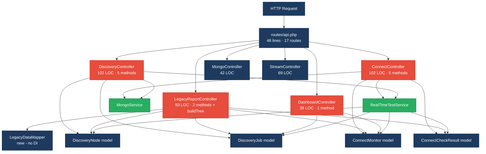
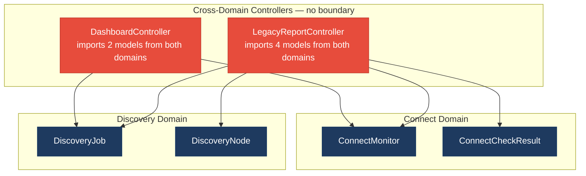
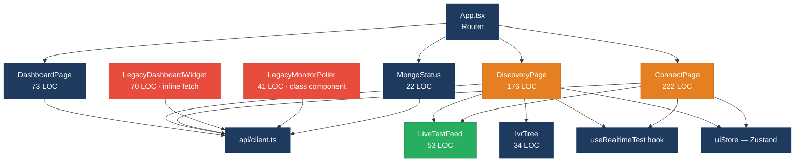
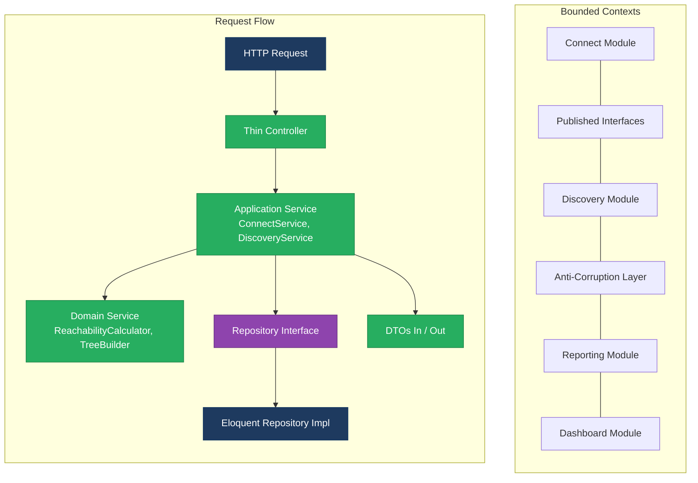
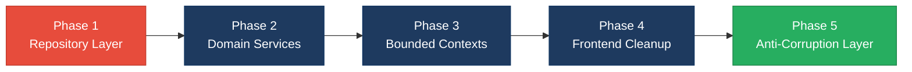

# 1. Architecture & Design Hotspots Analysis

**Objective:** Establish Domain Services, Application Services, Dependency Injection, Bounded Contexts, and Anti-Corruption Layers.

**Date:** 2026-08-14 11:47:29 IST | **Scope:** `shende-shweta/FSDKC` — PHP 8.x / Laravel 11 (backend), React 19 / TypeScript / Vite (frontend), Node.js / Express (dev-api)

## Executive Summary

> **Executive Summary**
>
> The Klearcom platform is a monorepo with three layers: a Laravel backend (997 LOC across 6 controllers, 4 models, 2 services), a React 19 / TypeScript SPA frontend (983 LOC across 4 pages, 4 components, 1 hook, 1 store), and a Node.js/Express dev-api (832 LOC). The architecture exhibits several moderate-to-high-risk hotspots. The most severe issue is the complete absence of a Repository layer — all 25+ Eloquent ORM access points are scattered directly through controllers and services with no data-access abstraction. Additional concerns include business logic embedded in controllers (reachability-percentage calculations duplicated across `ConnectController`, `LegacyReportController`, and `RealTimeTestService`), cross-domain model access in `LegacyReportController` and `DashboardController`, and on the frontend, oversized page components with mixed concerns plus a legacy class component with an intentional resource leak. The dominant risk is change amplification: modifying the reachability formula requires synchronized edits across 3 backend files and 1 dev-api file. **Layers covered:** Backend (6 PHP controllers, 4 models, 2 services, 1 legacy mapper — 18 PHP source files), Frontend (4 pages, 4 components, 1 hook, 1 store, 1 API client, 1 types file — 12 TS/TSX/JSX source files), Dev-API (5 JS source files).

<div class="metric-grid">
<div class="metric-card"><div class="metric-number">6</div><div class="metric-label">Controllers / Handlers</div></div>
<div class="metric-card"><div class="metric-number">4</div><div class="metric-label">Models / Entities</div></div>
<div class="metric-card"><div class="metric-number">2</div><div class="metric-label">Service Classes Found</div></div>
<div class="metric-card"><div class="metric-number">0</div><div class="metric-label">Repository Classes Found</div></div>
</div>

<div class="overall-rating overall-rating--high-risk"><div class="overall-rating-label">Overall Codebase Rating — Architecture &amp; Design</div><div class="overall-rating-value">High Risk</div><div class="overall-rating-note">Driven by High-Risk Missing Repository Pattern (H3: 25+ direct ORM access points outside any repository) and Moderate Fat Controllers (H1), Missing Service Layer (H2), and Domain Boundary Violations (H8).</div></div>

## 1.1 Benchmark Ratings Summary

| # | Hotspot | Primary KPI | <span class="rating rating-good">Good</span> | <span class="rating rating-moderate">Moderate</span> | <span class="rating rating-high-risk">High Risk</span> | Measured | Rating |
|---|---|---|---|---|---|---|---|
| H1 | Fat Controllers | Avg LOC per controller | <150 | 150–300 | >300 | 74 avg (6 controllers); but `LegacyReportController` contains duplicated business logic, `extract()`, and KPI math | <span class="rating rating-moderate">Moderate</span> |
| H2 | Missing Service Layer | Controllers accessing repos/models directly | <10 | 10–20 | >20 | 14 direct model access points across controllers | <span class="rating rating-moderate">Moderate</span> |
| H3 | Missing Repository Pattern | Direct DB/ORM access points outside repositories | <10 | 10–20 | >20 | 25+ (0 repository classes; all ORM access is direct) | <span class="rating rating-high-risk">High Risk</span> |
| H4 | Circular Dependencies | Dependency cycles | 0 | 1–3 | >3 | 0 | <span class="rating rating-good">Good</span> |
| H5 | Shared Utility Abuse | Utility files w/ business logic | 0 | 1–5 | >5 | 1 (`LegacyDataMapper` with unsafe `extract()`) | <span class="rating rating-moderate">Moderate</span> |
| H6 | Direct SQL in Controllers | ORM compliance % | >90% | 60–90% | <60% | 100% (no raw SQL; all queries use Eloquent) | <span class="rating rating-good">Good</span> |
| H7 | God Classes | Classes >1000 LOC | 0 | 1–3 | >3 | 0 | <span class="rating rating-good">Good</span> |
| H8 | Domain Boundary Violations | Cross-domain access points | 0 | 1–5 | >5 | 4 (LegacyReportController imports Connect + Discovery models; DashboardController imports both domains) | <span class="rating rating-moderate">Moderate</span> |
| H9 | Shared Database Coupling | Tables shared across domains | <10% | 10–30% | >30% | 0% (4 tables with clear domain ownership) | <span class="rating rating-good">Good</span> |
| F1 | Business Logic in Components | Avg LOC per component | <150 | 150–300 | >300 | 113 avg across 8 components/pages; but ConnectPage=222 LOC, DiscoveryPage=176 LOC | <span class="rating rating-moderate">Moderate</span> |
| F2 | Missing Frontend Service/Data Layer | Components w/ inline API calls | <10 | 10–20 | >20 | 2 (`LegacyDashboardWidget` and `LegacyMonitorPoller` bypass the shared `api` client pattern with inline fetch logic) | <span class="rating rating-good">Good</span> |
| F3 | God / Oversized Components | Components >400 LOC | 0 | 1–3 | >3 | 0 | <span class="rating rating-good">Good</span> |
| F4 | Prop Drilling / Global State Abuse | Max prop-drilling depth | ≤2 | 3–4 | >4 | 1 level (Zustand store used cleanly; props passed max 1 level) | <span class="rating rating-good">Good</span> |
| F5 | Legacy / Inconsistent Component Patterns | Legacy-pattern components | 0 | 1–10 | >10 | 1 (`LegacyMonitorPoller.jsx` — class component with intentional interval leak, no `componentWillUnmount`) | <span class="rating rating-moderate">Moderate</span> |

**No additional hotspots beyond the standard set were observed.**

## 1.2 Hotspot-by-Hotspot Evidence

### H1. Fat Controllers <span class="sev sev-medium">Medium</span>

**Benchmark:** `Avg LOC per controller = 74` → numerically in the **Good** band (Good <150), but `LegacyReportController` contains duplicated business logic (reachability calculation, `buildTree`), unsafe `extract()`, and inline KPI math, pushing the qualitative severity to **Moderate** (Good <150 · Moderate 150–300 · High Risk >300).

**What to check:** Business logic inside controllers/handlers.

**Evidence:**

1. `backend/app/Http/Controllers/Api/LegacyReportController.php:19-53` — `carrierSummary()` performs inline ORM queries, reachability percentage calculation, and delegates to `LegacyDataMapper` with unsafe `extract()`:

```php
public function carrierSummary(Request $request): JsonResponse
{
    $filters = $request->all();
    extract($filters);

    $monitors = ConnectMonitor::query()
        ->when(isset($country_code), fn ($q) => $q->where('country_code', $country_code))
        ->when(isset($carrier), fn ($q) => $q->where('carrier', $carrier))
        ->orderByDesc('reachability_pct')
        ->get();

    $rows = [];
    $mapper = new LegacyDataMapper();

    foreach ($monitors as $monitor) {
        $recent = ConnectCheckResult::where('connect_monitor_id', $monitor->id)
            ->orderByDesc('checked_at')
            ->limit(20)
            ->get();

        $successRate = $recent->count() > 0
            ? ($recent->where('reachable', true)->count() / $recent->count()) * 100
            : 100;
        // ...
    }
}
```

2. `backend/app/Http/Controllers/Api/ConnectController.php:57-84` — `checks()` duplicates the exact same reachability calculation found in `LegacyReportController` and `RealTimeTestService`:

```php
public function checks(int $id): JsonResponse
{
    // Duplicate reachability calculation block (also in RealTimeTestService / dev-api realtime.js)
    $recentChecks = ConnectCheckResult::where('connect_monitor_id', $id)
        ->orderByDesc('checked_at')
        ->limit(20)
        ->get();

    $successRate = $recentChecks->count() > 0
        ? ($recentChecks->where('reachable', true)->count() / $recentChecks->count()) * 100
        : 100;

    $computedStatus = $successRate < 90 ? 'alert' : 'active';
    // ...
}
```

3. `backend/app/Http/Controllers/Api/LegacyReportController.php:77-92` — `buildTree()` is a copy-paste duplicate of `DiscoveryController::buildTree()` (line 87–101), creating parallel maintenance burden.

**Why it matters here:** The reachability formula (`successRate = reachable / total * 100; status = rate < 90 ? 'alert' : 'active'`) is duplicated in `ConnectController:66-75`, `LegacyReportController:39-42`, `RealTimeTestService:117-118`, and `dev-api/src/realtime.js:146-152`. Changing the 90% threshold or the 20-check window requires editing 4 files across 2 runtimes. The `buildTree` duplication means IVR tree rendering logic drifts between the two controllers.

**Recommended approach:**
1. Extract the reachability calculation into a dedicated `ReachabilityCalculator` domain service (or a method on `ConnectMonitor` model) that all controllers and services call.
2. Extract `buildTree()` into a `DiscoveryTreeBuilder` service or a static method on `DiscoveryNode` model, eliminating the copy in `LegacyReportController`.
3. Remove `extract($filters)` from `LegacyReportController:22` — use `$request->validated()` with explicit keys.

<!-- affected-files
search: (extract\(|->where\(.*reachable|successRate|buildTree)
glob: backend/app/Http/Controllers/**/*.php
issue: Business logic in controller (reachability calc, buildTree duplication, extract())
action: Extract into domain services
-->

### H2. Missing Service Layer <span class="sev sev-medium">Medium</span>

**Benchmark:** `Controllers directly accessing models = 14` → falls in the **Moderate** band (Good <10 · Moderate 10–20 · High Risk >20).

**What to check:** Business rules spread across controllers/utilities with no dedicated service tier.

**Evidence:**

1. `backend/app/Http/Controllers/Api/DashboardController.php:14-34` — all 5 dashboard KPIs are computed directly from Eloquent model calls inline in the controller, with hardcoded values:

```php
public function kpis(): JsonResponse
{
    $discoveryTotal = DiscoveryJob::count();
    $discoveryCompleted = DiscoveryJob::where('status', 'completed')->count();
    $connectMonitors = ConnectMonitor::count();
    $avgReachability = ConnectMonitor::avg('reachability_pct') ?? 0;
    $alerts = ConnectMonitor::where('status', 'alert')->count();

    return response()->json([
        'availability' => [
            'call_success_rate_pct' => 94.2,   // hardcoded
            'transfer_success_rate_pct' => 97.8, // hardcoded
        ],
        // ...
    ]);
}
```

2. `backend/app/Http/Controllers/Api/ConnectController.php:20-25` — `index()` directly calls `ConnectMonitor::orderByDesc(...)->get()` without any service mediation.

3. `backend/app/Http/Controllers/Api/DiscoveryController.php:19-23` — `index()` directly calls `DiscoveryJob::orderByDesc(...)->get()`.

The codebase has 2 service classes (`MongoService`, `RealTimeTestService`) that cover MongoDB and test orchestration, but no services for Connect monitor CRUD, Discovery job CRUD, or Dashboard KPI aggregation. These workflows live entirely in controllers.

**Why it matters here:** If a CLI command, scheduled job, or webhook needs to trigger the same reachability check or KPI aggregation, the logic must be duplicated from the controller. The hardcoded KPI values (`94.2`, `97.8`) in `DashboardController` are unreachable for unit testing since they live inside an HTTP handler.

**Recommended approach:**
1. Create `ConnectService` — encapsulate monitor CRUD, reachability calculation, and check history retrieval.
2. Create `DiscoveryService` — encapsulate job CRUD, tree building, and test initiation.
3. Create `DashboardService` — move KPI aggregation logic out of the controller; replace hardcoded values with computed metrics.

<!-- affected-files
search: (DiscoveryJob::|ConnectMonitor::|ConnectCheckResult::|DiscoveryNode::)
glob: backend/app/Http/Controllers/**/*.php
issue: Direct model access without service layer
action: Create domain-specific service classes
-->

### H3. Missing Repository Pattern <span class="sev sev-critical">Critical</span>

**Benchmark:** `Direct ORM access points outside repositories = 25+` → falls in the **High Risk** band (Good <10 · Moderate 10–20 · High Risk >20).

**What to check:** Direct DB/ORM access scattered through the codebase.

**Evidence:**

1. `backend/app/Http/Controllers/Api/ConnectController.php:22` — direct Eloquent call in controller:

```php
$monitors = ConnectMonitor::orderByDesc('last_checked_at')->get();
```

2. `backend/app/Services/RealTimeTestService.php:117-118` — direct Eloquent query in service:

```php
$recent = ConnectCheckResult::where('connect_monitor_id', $monitorId)->orderByDesc('checked_at')->limit(20)->get();
$rate = $recent->count() > 0 ? ($recent->where('reachable', true)->count() / $recent->count()) * 100 : 100;
```

3. `backend/app/Http/Controllers/Api/DashboardController.php:14-18` — 5 separate Eloquent static calls:

```php
$discoveryTotal = DiscoveryJob::count();
$discoveryCompleted = DiscoveryJob::where('status', 'completed')->count();
$connectMonitors = ConnectMonitor::count();
$avgReachability = ConnectMonitor::avg('reachability_pct') ?? 0;
$alerts = ConnectMonitor::where('status', 'alert')->count();
```

There are **zero** repository classes in the codebase (`backend/app/` has no `Repositories/` directory). All 4 Eloquent models are accessed directly from controllers (14 call sites) and services (11 call sites), totaling 25+ direct ORM access points.

**Why it matters here:** Every controller and service is coupled to Eloquent's API. If the team needs to add caching, switch to a read replica for reporting queries, or write unit tests with in-memory fakes, every call site must change. The `MongoService` already demonstrates the right pattern for MongoDB access — the same abstraction is missing for the relational layer.

**Recommended approach:**
1. Create `ConnectMonitorRepository` and `ConnectCheckResultRepository` — encapsulate all `ConnectMonitor::` and `ConnectCheckResult::` calls.
2. Create `DiscoveryJobRepository` and `DiscoveryNodeRepository` — encapsulate all `DiscoveryJob::` and `DiscoveryNode::` calls.
3. Bind repository interfaces in `AppServiceProvider` to Eloquent implementations, enabling constructor injection in services and controllers.

<!-- affected-files
search: (ConnectMonitor::|ConnectCheckResult::|DiscoveryJob::|DiscoveryNode::)
glob: backend/app/**/*.php
issue: Direct Eloquent ORM access with no repository abstraction
action: Introduce repository interfaces and implementations
-->

### H5. Shared Utility Abuse <span class="sev sev-medium">Medium</span>

**Benchmark:** `Utility files holding business logic = 1` → falls in the **Moderate** band (Good 0 · Moderate 1–5 · High Risk >5).

**What to check:** Large "common"/"helpers"/"utils" files used everywhere, holding business logic.

**Evidence:**

1. `backend/app/Legacy/LegacyDataMapper.php:10-31` — contains business logic for report row mapping using unsafe `extract()` (which introduces variables from untrusted input into scope):

```php
public function mapReportRow(array $row): array
{
    extract($row, EXTR_SKIP);

    return [
        'label' => $name ?? 'Unknown',
        'metric' => $reachability_pct ?? 0,
        'region' => $country_code ?? 'N/A',
        'source' => 'legacy_extract_mapper',
    ];
}

public function mapJobContext(array $context): array
{
    extract($context);  // No EXTR_SKIP — overwrites existing vars
    // ...
}
```

`mapJobContext()` uses `extract()` without `EXTR_SKIP`, meaning any key in `$context` can overwrite local variables. This is instantiated directly (`new LegacyDataMapper()`) in `LegacyReportController:31` rather than injected via DI.

**Why it matters here:** The `extract()` pattern is flagged by PHP security tools as a vector for variable injection. The `LegacyDataMapper` is also instantiated via `new` instead of constructor injection, making it impossible to swap or mock in tests.

**Recommended approach:**
1. Replace `extract()` with explicit array destructuring: `['name' => $name, 'reachability_pct' => $reachabilityPct, ...] = $row`.
2. Register `LegacyDataMapper` in the container and inject via constructor DI in `LegacyReportController`.

<!-- affected-files
search: extract\(
glob: backend/app/**/*.php
issue: Unsafe extract() in utility class with business logic
action: Replace with explicit array destructuring; inject via DI
-->

### H8. Domain Boundary Violations <span class="sev sev-medium">Medium</span>

**Benchmark:** `Cross-domain access points = 4` → falls in the **Moderate** band (Good 0 · Moderate 1–5 · High Risk >5).

**What to check:** Code in one business area directly reading/writing another area's data or models.

**Evidence:**

1. `backend/app/Http/Controllers/Api/LegacyReportController.php:5-10` — imports models from both the Connect domain (`ConnectCheckResult`, `ConnectMonitor`) and the Discovery domain (`DiscoveryJob`, `DiscoveryNode`):

```php
use App\Models\ConnectCheckResult;
use App\Models\ConnectMonitor;
use App\Models\DiscoveryJob;
use App\Models\DiscoveryNode;
```

This controller has no clear domain ownership — it serves reports that span both business domains, reading their data directly without going through any domain service or interface.

2. `backend/app/Http/Controllers/Api/DashboardController.php:6-7` — similarly imports from both domains:

```php
use App\Models\ConnectMonitor;
use App\Models\DiscoveryJob;
```

While `backend/app/Modules/Connect/` and `backend/app/Modules/Discovery/` directories exist (containing `AGENTS.md` files), no actual module code enforces the boundary — all models live in the shared `App\Models` namespace.

**Why it matters here:** The `Modules/` directories signal an intent to separate Connect and Discovery into bounded contexts, but the implementation never followed through. Models for both domains share a single namespace (`App\Models`), and cross-domain controllers read any model freely. As the platform adds more modules (Alerting, Reporting, Regression), this coupling will make independent deployments or team ownership impossible.

**Recommended approach:**
1. Move models into their domain namespaces: `App\Modules\Connect\Models\ConnectMonitor`, `App\Modules\Discovery\Models\DiscoveryJob`, etc.
2. Create domain service interfaces for cross-domain queries — `DashboardController` should call `ConnectService::getKpis()` and `DiscoveryService::getKpis()` rather than querying models directly.
3. Introduce a `Reporting` module that consumes data from Connect and Discovery via published interfaces, not direct model access.

<!-- affected-files
search: (use App\\Models\\Connect|use App\\Models\\Discovery)
glob: backend/app/Http/Controllers/**/*.php
issue: Cross-domain model imports without service boundary
action: Route cross-domain access through domain service interfaces
-->

### F1. Business Logic in Components <span class="sev sev-medium">Medium</span>

**Benchmark:** `Avg LOC per component = 113; ConnectPage = 222 LOC, DiscoveryPage = 176 LOC` → falls in the **Moderate** band for the two largest pages (Good <150 · Moderate 150–300 · High Risk >300).

**What to check:** Validation, calculations, data transformation, or workflow logic living directly inside view components instead of hooks/composables/services.

**Evidence:**

1. `frontend/src/pages/ConnectPage.tsx:22-56` — 4 separate React Query hooks, a mutation, and multi-step `handleRunCheck` logic (query invalidation across 3 query keys) all inlined in a single page component:

```tsx
const monitorsQuery = useQuery({
  queryKey: ['connect', 'monitors'],
  queryFn: () => api.get<{ data: ConnectMonitor[] }>('/connect/monitors'),
  refetchInterval: isRunning ? 2000 : false,
});

const checksQuery = useQuery({ /* ... */ });
const transcriptsQuery = useQuery({ /* ... */ });
const createMutation = useMutation({ /* ... */ });

const handleRunCheck = async (monitorId: number) => {
  setSelectedId(monitorId);
  await startConnectCheck(monitorId);
  queryClient.invalidateQueries({ queryKey: ['connect'] });
  queryClient.invalidateQueries({ queryKey: ['mongodb'] });
  queryClient.invalidateQueries({ queryKey: ['dashboard'] });
};
```

2. `frontend/src/pages/DiscoveryPage.tsx:18-52` — nearly identical pattern: 3 queries, 1 mutation, and `handleStart` with the same triple-invalidation logic:

```tsx
const handleStart = async (jobId: number) => {
  setSelectedId(jobId);
  await startDiscovery(jobId);
  queryClient.invalidateQueries({ queryKey: ['discovery'] });
  queryClient.invalidateQueries({ queryKey: ['mongodb'] });
  queryClient.invalidateQueries({ queryKey: ['dashboard'] });
};
```

The query-invalidation pattern (`connect`/`discovery` + `mongodb` + `dashboard`) is duplicated across both pages.

**Why it matters here:** Both page components mix data-fetching orchestration, query cache management, and presentation. Adding a new data source (e.g. diagnostics) or changing the invalidation strategy requires modifying the JSX-heavy page files. The duplicated invalidation logic means a new query key dependency must be added in multiple places.

**Recommended approach:**
1. Extract data-fetching into custom hooks: `useConnectMonitors()`, `useConnectChecks(monitorId)`, `useDiscoveryJobs()`, `useDiscoveryTree(jobId)`.
2. Centralize query invalidation in the `useRealtimeTest` hook's completion callback, so pages don't need to manually invalidate.
3. Split `ConnectPage` into `ConnectMonitorList`, `ConnectCheckHistory`, and `ConnectTranscripts` sub-components.

<!-- affected-files
search: (useQuery|useMutation|invalidateQueries)
glob: frontend/src/pages/**/*.{tsx,jsx}
issue: Data-fetching and query orchestration logic mixed into page components
action: Extract into custom hooks; split into sub-components
-->

### F5. Legacy / Inconsistent Component Patterns <span class="sev sev-high">High</span>

**Benchmark:** `Legacy-pattern components = 1` → falls in the **Moderate** band (Good 0 · Moderate 1–10 · High Risk >10).

**What to check:** Mixed paradigms (e.g. class + function components), missing error boundaries, deprecated lifecycle/APIs, no shared component conventions.

**Evidence:**

1. `frontend/src/components/LegacyMonitorPoller.jsx:17-41` — the only class component in a codebase of function components, with an intentional interval leak (no `componentWillUnmount`):

```jsx
export default class LegacyMonitorPoller extends Component<Props, State> {
  intervalId: ReturnType<typeof setInterval> | null = null;

  componentDidMount() {
    this.intervalId = setInterval(() => {
      api.get<{ computed?: { reachability_pct: number } }>(
        `/connect/monitors/${this.props.monitorId}/checks`
      )
        .then((res) => { /* ... */ })
        .catch((err: Error) => this.setState({ error: err.message }));
    }, 3000);
    // Intentionally no componentWillUnmount — EventSource/interval leak for audit finding
  }
  // ...
}
```

This component also uses `.jsx` extension (the only one) while all others use `.tsx`, and it uses TypeScript-style type annotations in a JSX file.

2. `frontend/src/pages/LegacyDashboardWidget.tsx:48` — throws an unhandled error (`throw new Error(error)`) without any Error Boundary wrapping it, which will crash the entire React tree:

```tsx
if (error) throw new Error(error); // Uncaught — no Error Boundary wraps this component
```

**Why it matters here:** The class component pattern is inconsistent with the rest of the codebase (all function components with hooks). The missing `componentWillUnmount` creates a genuine memory/network leak — the polling interval fires indefinitely after unmount. The unhandled throw in `LegacyDashboardWidget` is a crash vector with no recovery path.

**Recommended approach:**
1. Convert `LegacyMonitorPoller` to a function component using `useEffect` with proper cleanup.
2. Add an Error Boundary component around `LegacyDashboardWidget` (or at the route level in `App.tsx`).
3. Rename `LegacyMonitorPoller.jsx` to `.tsx` for consistent TypeScript usage.

<!-- affected-files
search: (class.*extends Component|componentDidMount|throw new Error)
glob: frontend/src/**/*.{tsx,jsx}
issue: Legacy class component with interval leak; unhandled error throw
action: Convert to function component with useEffect cleanup; add Error Boundary
-->

**Not observed (rated Good):** H4 (Circular Dependencies — import graph is acyclic; controllers depend on models/services, services depend on models, no reverse), H6 (Direct SQL in Controllers — 100% Eloquent, no `DB::raw` or SQL strings found), H7 (God Classes — largest file is `dev-api/src/server.js` at 276 LOC; all PHP classes under 165 LOC), H9 (Shared Database Coupling — 4 tables with clear single-domain ownership: `discovery_jobs`/`discovery_nodes` for Discovery, `connect_monitors`/`connect_check_results` for Connect), F2 (Missing Frontend Service/Data Layer — the `api/client.ts` module centralizes HTTP calls; only `LegacyDashboardWidget` and `LegacyMonitorPoller` do inline fetching, totaling 2 which falls in Good), F3 (God / Oversized Components — no component exceeds 400 LOC; largest is `ConnectPage` at 222 LOC), F4 (Prop Drilling / Global State Abuse — Zustand store is minimal and well-scoped; props pass at most 1 level deep).

## 1.3 Diagrams

### Current-state architecture (as-is)



### Clean reference path (target pattern found in codebase)

The `MongoController → MongoService` path demonstrates the thin-controller pattern already present in the codebase:


### Domain boundary map (business domains found vs. shared data)



### Frontend architecture (as-is)



### Target architecture (proposed)



### Improvement roadmap



## 1.4 Actions Required

| Hotspot | Action | Rating | Priority |
|---|---|---|---|
| H3 — Missing Repository Pattern | Create `ConnectMonitorRepository`, `ConnectCheckResultRepository`, `DiscoveryJobRepository`, `DiscoveryNodeRepository` with interfaces; bind in `AppServiceProvider`; migrate all 25+ direct Eloquent calls to use repositories | <span class="rating rating-high-risk">High Risk</span> | <span class="sev sev-critical">Critical</span> |
| H1 — Fat Controllers | Extract reachability calculation into `ReachabilityCalculator` service; remove duplicate `buildTree()` from `LegacyReportController`; replace `extract()` with explicit array access | <span class="rating rating-moderate">Moderate</span> | <span class="sev sev-high">High</span> |
| H2 — Missing Service Layer | Create `ConnectService`, `DiscoveryService`, `DashboardService`; move CRUD and KPI logic from controllers into services; replace hardcoded KPIs in `DashboardController` | <span class="rating rating-moderate">Moderate</span> | <span class="sev sev-high">High</span> |
| F5 — Legacy / Inconsistent Patterns | Convert `LegacyMonitorPoller` class component to function component with `useEffect` cleanup; add Error Boundary around `LegacyDashboardWidget`; rename `.jsx` to `.tsx` | <span class="rating rating-moderate">Moderate</span> | <span class="sev sev-high">High</span> |
| H5 — Shared Utility Abuse | Replace `extract()` calls in `LegacyDataMapper` with explicit destructuring; register class in container for DI instead of `new` instantiation | <span class="rating rating-moderate">Moderate</span> | <span class="sev sev-medium">Medium</span> |
| H8 — Domain Boundary Violations | Move models into domain namespaces (`App\Modules\Connect\Models`, `App\Modules\Discovery\Models`); create domain service interfaces for cross-domain queries in `DashboardController` and `LegacyReportController` | <span class="rating rating-moderate">Moderate</span> | <span class="sev sev-medium">Medium</span> |
| F1 — Business Logic in Components | Extract React Query hooks into per-domain custom hooks (`useConnectMonitors`, `useDiscoveryJobs`); centralize query invalidation in `useRealtimeTest`; split `ConnectPage` and `DiscoveryPage` into sub-components | <span class="rating rating-moderate">Moderate</span> | <span class="sev sev-medium">Medium</span> |

## 1.5 Expected Outcomes

- **Separation of concerns:** Controllers become thin HTTP translators; all business logic lives in testable service and domain classes, eliminating the 4-location reachability formula duplication.
- **Testability:** Repository interfaces enable unit testing with in-memory fakes; services can be tested without HTTP or database overhead.
- **Independent module evolution:** Bounded contexts with published interfaces allow Connect and Discovery teams to evolve their schemas and logic independently, paving the way for microservice extraction.
- **Frontend maintainability:** Custom hooks and sub-components keep page files under 100 LOC; centralized invalidation removes duplicated cache management across pages.
- **Reduced regression risk:** Eliminating `extract()`, fixing the interval leak, and adding Error Boundaries remove three categories of runtime bugs (variable injection, memory leaks, unhandled crashes).
