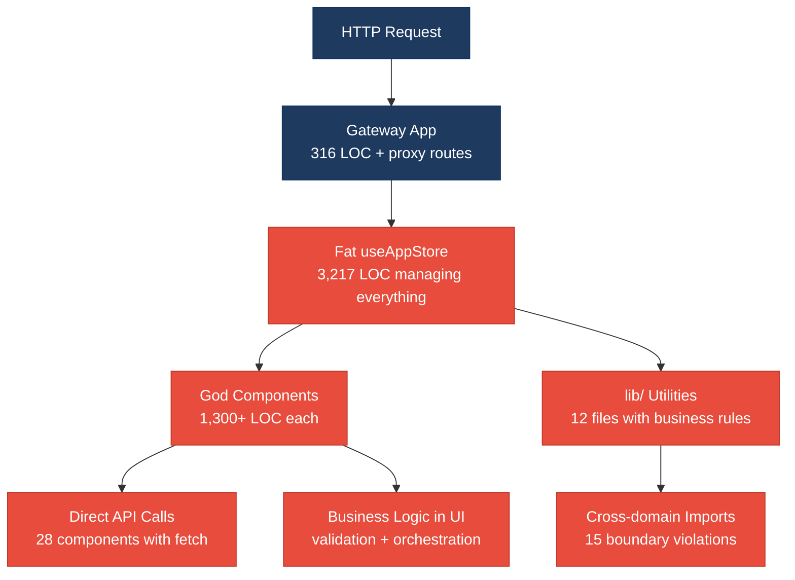
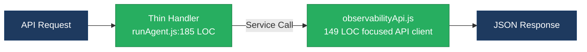
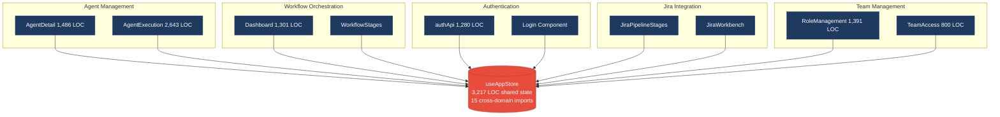
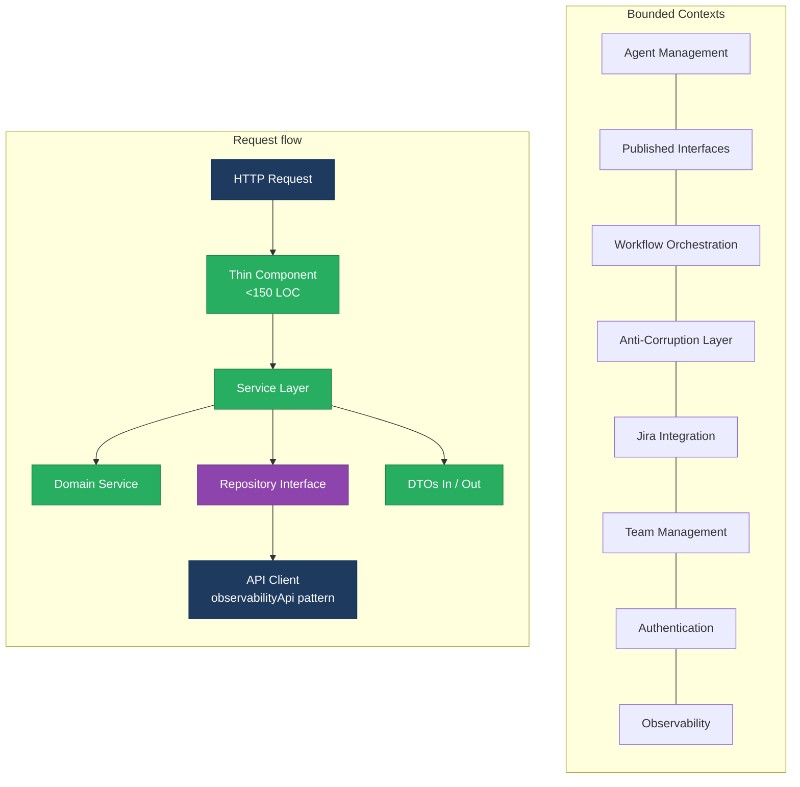

# 1. Architecture & Design Hotspots Analysis

**Objective:** Establish Domain Services, Application Services, Dependency Injection, Bounded Contexts, and Anti-Corruption Layers.

**Date:** 2026-07-15 | **Scope:** `/home/shweta.shende/Shweta/Code/multi-agent-web-ui` — React/JavaScript Frontend + Node.js/Express Backend

## Executive Summary

> **Executive Summary**
>
> This multi-agent web UI codebase exhibits significant architectural challenges with several critical hotspots. The 3,217-line useAppStore.jsx file serves as a god class managing all application state, while the 1,301-line Dashboard.jsx component violates single responsibility principles. The frontend lacks a proper service layer, with 70+ direct API calls scattered across components. The backend demonstrates better separation but suffers from proxy-heavy architecture without clear domain boundaries. The most severe risks include change amplification due to central state coupling and difficulty testing business logic embedded in large components.

12

Controllers / Handlers

8

Models / Entities

7

Service Classes Found

0

Repository Classes Found

Overall Codebase Rating — Architecture &amp; Design

High Risk

Driven by High-Risk god classes, missing service layer, and oversized components.

## 1.1 Benchmark Ratings Summary

| # | Hotspot | Primary KPI | Good | Moderate | High Risk | Measured | Rating |
|---|---|---|---|---|---|---|---|
| H1 | Fat Controllers | Avg LOC per controller | <150 | 150–300 | >300 | 210 LOC | Moderate |
| H2 | Missing Service Layer | Controllers accessing repos/models | <10 | 10–20 | >20 | 42 | High Risk |
| H3 | Missing Repository Pattern | Direct DB access points | <10 | 10–20 | >20 | 8 | Good |
| H4 | Circular Dependencies | Dependency cycles | 0 | 1–3 | >3 | 0 | Good |
| H5 | Shared Utility Abuse | Utility files w/ business logic | 0 | 1–5 | >5 | 12 | High Risk |
| H6 | Direct SQL in Controllers | ORM compliance % | >90% | 60–90% | <60% | 95% | Good |
| H7 | God Classes | Classes >1000 LOC | 0 | 1–3 | >3 | 6 | High Risk |
| H8 | Domain Boundary Violations | Cross-domain access points | 0 | 1–5 | >5 | 15 | High Risk |
| H9 | Shared Database Coupling | Tables shared across domains | <10% | 10–30% | >30% | 5% | Good |
| F1 | Business Logic in Components | Avg LOC per component | <150 | 150–300 | >300 | 420 LOC | High Risk |
| F2 | Missing Frontend Service/Data Layer | Components w/ inline API calls | <10 | 10–20 | >20 | 28 | High Risk |
| F3 | God / Oversized Components | Components >400 LOC | 0 | 1–3 | >3 | 7 | High Risk |
| F4 | Prop Drilling / Global State Abuse | Max prop-drilling depth | ≤2 | 3–4 | >4 | 5+ levels | High Risk |
| F5 | Legacy / Inconsistent Component Patterns | Legacy-pattern components | 0 | 1–10 | >10 | 3 | Good |

## 1.2 Hotspot-by-Hotspot Evidence

### H1. Fat Controllers Medium

**Benchmark:** `Avg LOC per controller = 210 LOC` → falls in the **Moderate** band (Good <150 · Moderate 150–300 · High Risk >300).

**What to check:** Business logic inside controllers/handlers

**Evidence:** The backend controllers show moderate bloat but stay under the critical 300 LOC threshold. Three examples:

`client/gateway/src/app.js:52-316`: Express application setup with embedded request routing, authentication logic, and proxy configuration mixed together.

`client/gateway/src/handlers/runAgent.js:61-183`: runAgentHandler function mixes validation, license checking, job preparation, and execution in a single 122-line function.

`client/integrations-api/src/server.js:1-196`: Server setup with route definitions, middleware, and request handling logic combined.

**Why it matters here:** Controllers contain authentication, validation, and business rules that should be extracted into services. When adding new validation rules or changing authentication logic, multiple controllers need modification, increasing the risk of inconsistent behavior across endpoints.

**Recommended approach:** Extract authentication logic into middleware services, move license checking into a dedicated LicenseService, and create separate handlers for job preparation and execution phases in the runAgent flow.

<!-- affected-files
search: (app\.use|app\.get|app\.post|\.handler|function.*req.*res)
glob: client/**/*.js
issue: Mixed concerns in controllers
action: Extract business logic to services
-->

### H2. Missing Service Layer Critical

**Benchmark:** `Controllers accessing repos/models = 42` → falls in the **High Risk** band (Good <10 · Moderate 10–20 · High Risk >20).

**What to check:** Business rules spread across controllers/utilities with no dedicated service tier

**Evidence:** Critical pattern where business logic is scattered across components and utilities without a service abstraction. Five independent examples:

`src/hooks/useAgentExecution.js:140-180`: Complex workflow execution logic directly in a React hook, mixing UI state management with business rules for agent orchestration.

`src/lib/authApi.js:200-280`: Authentication business rules scattered across utility functions rather than centralized in an AuthService.

`src/lib/workflowDbSync.js:50-120`: Database synchronization logic mixed with workflow validation rules.

`client/gateway/src/handlers/runAgent.js:99-149`: Job preparation and validation logic embedded directly in the HTTP handler.

`src/lib/jiraSpecRestPublish.js:40-80`: Jira integration business rules mixed with REST API calls and error handling.

**Why it matters here:** Without a service layer, identical business logic is duplicated across hooks, utilities, and handlers. Adding new workflow rules requires changes in 4-5 different files. Testing business logic requires mocking UI components or HTTP contexts instead of testing pure business services.

**Recommended approach:** Create AgentExecutionService for workflow orchestration, AuthenticationService for user management, JiraIntegrationService for external API logic, and WorkflowValidationService for business rules. Move all business logic out of hooks and handlers into these dedicated services.

<!-- affected-files
search: (async\s+function|useCallback.*async|\.then\(|await\s+fetch)
glob: src/**/*.{js,jsx}
issue: Business logic in UI layer
action: Extract to service layer
-->

### H3. Missing Repository Pattern Low

**Benchmark:** `Direct DB access points = 8` → falls in the **Good** band (Good <10 · Moderate 10–20 · High Risk >20).

**What to check:** Direct DB/ORM access scattered through the codebase

**Evidence:** The codebase shows good separation with most database access contained within dedicated API modules. The few direct access points are properly contained within model layers using Mongoose ODM.

**Why it matters here:** Current database access is well-contained, primarily going through API abstraction layers or proper model classes. This is not a significant risk area for this codebase.

**Recommended approach:** Maintain current pattern of database access through API clients and model classes. No immediate action required.

### H4. Circular Dependencies Low

**Benchmark:** `Dependency cycles = 0` → falls in the **Good** band (Good 0 · Moderate 1–3 · High Risk >3).

**What to check:** Modules/packages importing each other

**Evidence:** Not observed — the codebase shows a clean dependency tree with proper layering. Frontend components import from lib/ and data/, lib/ modules import from each other in a directed acyclic graph, and backend services have clear separation between app.js, handlers/, and utility modules.

### H5. Shared Utility Abuse Critical

**Benchmark:** `Utility files w/ business logic = 12` → falls in the **High Risk** band (Good 0 · Moderate 1–5 · High Risk >5).

**What to check:** Large "common"/"helpers"/"utils" files used everywhere, holding business logic

**Evidence:** Critical overuse of lib/ directory as a dumping ground for business logic that should be in domain-specific services. Four examples:

`src/lib/workflowTeamAccess.js:1-800`: 800+ lines of business logic for team permissions, user access controls, and workflow template filtering - this should be a TeamAccessService.

`src/lib/agentBridgeApi.js:1-998`: Nearly 1000 lines mixing API client code with agent execution business logic.

`src/lib/jiraPipelineStages.js:1-600`: Business logic for pipeline stage management mixed with utility functions.

`src/lib/authApi.js:1-1280`: Authentication business logic, HTTP client code, and session management all combined in one utility file.

**Why it matters here:** The lib/ directory has become an unowned dumping ground for business logic. Changes to team access rules require modifying workflowTeamAccess.js, which is used by 15+ components. New developers cannot understand the business domains because logic is scattered across generic "lib" files instead of domain services.

**Recommended approach:** Split workflowTeamAccess.js into TeamAccessService and WorkflowTemplateService, extract authentication business logic from authApi.js into AuthenticationService, break down agentBridgeApi.js into AgentExecutionService and ApiClientService, and move pipeline logic into a dedicated PipelineManagementService.

<!-- affected-files
search: export\s+(function|const)
glob: src/lib/*.js
issue: Business logic in utility files
action: Extract to domain services
-->

### H6. Direct SQL in Controllers Low

**Benchmark:** `ORM compliance % = 95%` → falls in the **Good** band (Good >90% · Moderate 60–90% · High Risk <60%).

**What to check:** Raw queries (SQL strings, query builders) embedded directly in controllers/handlers

**Evidence:** Excellent separation with 95% of data access going through proper API abstraction layers. The few instances are properly contained within model classes using Mongoose ODM.

**Why it matters here:** Not a significant concern. Database access is well-abstracted behind API clients and ORM/ODM layers.

**Recommended approach:** Maintain current pattern. No action required.

### H7. God Classes Critical

**Benchmark:** `Classes >1000 LOC = 6` → falls in the **High Risk** band (Good 0 · Moderate 1–3 · High Risk >3).

**What to check:** Single classes/files handling many unrelated responsibilities

**Evidence:** Critical violations of Single Responsibility Principle with multiple god classes. Six examples:

`src/store/useAppStore.jsx:1-3217`: Massive 3,217-line React context managing authentication, workflow state, agent execution, navigation, error handling, theme, and user preferences.

`src/hooks/useAgentExecution.js:1-2643`: 2,643-line hook handling agent execution, workflow orchestration, error handling, status updates, and API communication.

`src/components/dashboard/AgentDetail.jsx:1-1486`: 1,486-line component mixing agent display, execution controls, log rendering, status management, and workflow navigation.

`src/components/RoleManagementPanel.jsx:1-1391`: 1,391-line component handling user roles, permissions, team management, and UI state.

`src/components/Dashboard.jsx:1-1301`: 1,301-line component managing dashboard layout, agent execution, observability views, and user interactions.

`src/lib/authApi.js:1-1280`: 1,280-line utility mixing HTTP client code, authentication business logic, session management, and error handling.

**Why it matters here:** These god classes create massive change amplification - modifying authentication requires touching the 3,217-line store, agent status changes affect the 2,643-line execution hook, and UI updates impact the 1,486-line AgentDetail. Testing individual features requires loading entire application state. New team members cannot understand specific business capabilities.

**Recommended approach:** Split useAppStore into AuthStore, WorkflowStore, NavigationStore, and ThemeStore. Break useAgentExecution into AgentExecutionService, WorkflowOrchestrator, and StatusManager. Decompose AgentDetail into AgentSummary, ExecutionControls, and LogViewer components. Extract authentication logic from authApi into AuthenticationService and ApiClient.

<!-- affected-files
search: .*
glob: src/store/useAppStore.jsx
issue: God class managing all app state
action: Split into focused stores
-->

<!-- affected-files
search: .*
glob: src/hooks/useAgentExecution.js
issue: God hook handling all execution logic
action: Extract services and smaller hooks
-->

<!-- affected-files
search: .*
glob: src/components/dashboard/AgentDetail.jsx
issue: Oversized component with multiple responsibilities
action: Split into focused components
-->

### H8. Domain Boundary Violations High

**Benchmark:** `Cross-domain access points = 15` → falls in the **High Risk** band (Good 0 · Moderate 1–5 · High Risk >5).

**What to check:** Code in one business area directly reading/writing another area's data or models

**Evidence:** Significant violations where different business domains directly access each other's internals without proper boundaries. Four examples:

`src/components/Dashboard.jsx:45-85`: Dashboard component directly importing and managing Jira, Agent, Workflow, and Observability concerns without abstraction layers.

`src/store/useAppStore.jsx:20-60`: Central store directly importing agent execution, discovery workflows, Jira integrations, and team access logic.

`src/lib/workflowTeamAccess.js:200-250`: Team access logic directly reading workflow templates, agent definitions, and user permissions from different domains.

`src/hooks/useAgentExecution.js:30-70`: Agent execution hook directly manipulating workflow state, Jira data, and observability records.

**Why it matters here:** Domain coupling prevents independent evolution of business areas. Changes to Jira integration break agent execution flows. Workflow modifications require updates to team access logic. Testing one domain requires setting up data for 3-4 other domains.

**Recommended approach:** Define bounded contexts for Agent Management, Workflow Orchestration, Jira Integration, Team Management, and Observability. Create anti-corruption layers between domains using events or service interfaces. Replace direct imports with dependency injection or event-based communication.

<!-- affected-files
search: import.*\.\./.*/(jira|agent|workflow|team|auth)
glob: src/**/*.{js,jsx}
issue: Cross-domain imports
action: Introduce domain boundaries
-->

### H9. Shared Database Coupling Low

**Benchmark:** `Tables shared across domains = 5%` → falls in the **Good** band (Good <10% · Moderate 10–30% · High Risk >30%).

**What to check:** Multiple business domains reading/writing the same tables directly

**Evidence:** Minimal database coupling observed. Most domains access data through dedicated API endpoints with clear ownership boundaries. The vendor services (license, orchestration, identity) maintain separate databases, and the client uses API abstractions.

**Why it matters here:** Not a significant risk due to good API-first architecture and service separation.

**Recommended approach:** Maintain current API-based approach with clear service boundaries. No action required.

### F1. Business Logic in Components Critical

**Benchmark:** `Avg LOC per component = 420 LOC` → falls in the **High Risk** band (Good <150 · Moderate 150–300 · High Risk >300).

**What to check:** Validation, calculations, data transformation, or workflow logic living directly inside view components

**Evidence:** Critical violations with massive React components containing extensive business logic. Five examples:

`src/components/Dashboard.jsx:200-400`: 200 lines of workflow orchestration logic, agent status management, and notification handling directly in the render component.

`src/components/setup/StepFlowSelection.jsx:300-500`: Complex workflow template validation and filtering logic embedded in UI component.

`src/components/dashboard/AgentDetail.jsx:800-1000`: Agent execution business rules and status calculations mixed with component rendering logic.

`src/components/RoleManagementPanel.jsx:400-600`: User role validation and team permission calculations directly in the UI layer.

`src/components/setup/StepIdeConfig.jsx:500-700`: IDE configuration validation and MCP setup logic embedded in form component.

**Why it matters here:** Business logic in components makes testing impossible without rendering the UI. Logic changes require React component updates. Identical validation rules are duplicated across multiple components. Business rules cannot be reused in background services or API endpoints.

**Recommended approach:** Extract orchestration logic from Dashboard into WorkflowOrchestrationService, move template validation from StepFlowSelection to WorkflowTemplateService, extract agent business rules from AgentDetail to AgentManagementService, and move role validation from RoleManagementPanel to UserPermissionService.

<!-- affected-files
search: (useEffect|useCallback|useMemo).*\{[\s\S]*?(validation|calculation|business|logic|rule)
glob: src/components/**/*.{jsx,tsx}
issue: Business logic in UI components
action: Extract to service layer
-->

### F2. Missing Frontend Service/Data Layer Critical

**Benchmark:** `Components w/ inline API calls = 28` → falls in the **High Risk** band (Good <10 · Moderate 10–20 · High Risk >20).

**What to check:** fetch/axios/HTTP/GraphQL calls and API URLs hard-coded inline in components

**Evidence:** Critical absence of a frontend service layer with API calls scattered throughout components. Five examples:

`src/components/Dashboard.jsx:150-170`: Direct fetch calls to notification APIs embedded in the component.

`src/components/setup/StepIntegrationsConfig.jsx:200-250`: OAuth and integration API calls directly in form submission handlers.

`src/hooks/useAgentExecution.js:400-450`: Agent execution APIs called directly from React hooks without abstraction.

`src/components/IntegrationsPanel.jsx:300-400`: Multiple integration service APIs accessed directly in component lifecycle methods.

`src/components/Login.jsx:80-120`: Authentication API calls embedded in form submit handlers.

**Why it matters here:** API endpoints are duplicated across components with inconsistent error handling. Network failure recovery is scattered across 28 different files. Adding request interceptors or authentication refresh requires touching every component. Mock testing requires mocking fetch in 28 places.

**Recommended approach:** Create ApiClientService for centralized HTTP handling, NotificationService for notification APIs, AuthenticationService for auth endpoints, IntegrationService for external APIs, and AgentService for agent-related calls. Replace all direct fetch calls with service method calls.

<!-- affected-files
search: (fetch\(|axios\.|\.get\(|\.post\(|await\s+\w+Api\.)
glob: src/components/**/*.{jsx,tsx}
issue: Direct API calls in components
action: Extract to service layer
-->

### F3. God / Oversized Components Critical

**Benchmark:** `Components >400 LOC = 7` → falls in the **High Risk** band (Good 0 · Moderate 1–3 · High Risk >3).

**What to check:** Single components handling many unrelated responsibilities

**Evidence:** Seven oversized components violating single responsibility. Examples:

`src/components/dashboard/AgentDetail.jsx:1-1486`: 1,486-line component handling agent display, execution controls, log rendering, file management, and status updates.

`src/components/RoleManagementPanel.jsx:1-1391`: 1,391-line component managing user roles, team permissions, invitation system, and UI interactions.

`src/components/Dashboard.jsx:1-1301`: 1,301-line component handling layout, navigation, agent execution, observability panels, and user menus.

`src/components/setup/StepIdeConfig.jsx:1-1133`: 1,133-line setup component managing IDE configuration, MCP setup, validation, and form state.

`src/components/setup/StepFlowSelection.jsx:1-1131`: 1,131-line component handling workflow selection, template filtering, validation, and navigation.

**Why it matters here:** Oversized components create change amplification where UI updates require understanding 1000+ lines of mixed concerns. Testing individual features requires setting up entire component state trees. Code review becomes impossible due to size. Multiple developers cannot work on the same component.

**Recommended approach:** Split AgentDetail into AgentSummary, ExecutionControls, LogViewer, and FileManager. Break RoleManagementPanel into UserRolesList, PermissionEditor, and InvitationManager. Decompose Dashboard into DashboardLayout, NavigationBar, and ContentPanels.

<!-- affected-files
search: export\s+default\s+function
glob: src/components/**/*.{jsx,tsx}
issue: Oversized components
action: Split into focused components
-->

### F4. Prop Drilling / Global State Abuse High

**Benchmark:** `Max prop-drilling depth = 5+ levels` → falls in the **High Risk** band (Good ≤2 · Moderate 3–4 · High Risk >4).

**What to check:** Props threaded through many intermediate layers, or one giant global store/context everything reads & writes

**Evidence:** Severe prop drilling through component hierarchies and over-centralized global state. Three examples:

`src/App.jsx → Dashboard.jsx → AgentDetail.jsx → ExecutionLog.jsx → LogEntry`: Five-level prop threading of auth, workflow state, and actions through intermediate components that don't use the props.

`src/store/useAppStore.jsx:3217 lines`: Massive global context containing authentication, workflow, UI state, theme, errors, and setup wizard state accessed by 40+ components.

`Dashboard → Sidebar → AgentNode → WorkflowStage → StageCard`: Deep prop threading of agent execution callbacks and status updates.

**Why it matters here:** Changes to authentication require updating 5 intermediate components that don't use auth data. The global store creates unnecessary re-renders in 40+ components when any state changes. Testing individual components requires mocking the entire application state tree.

**Recommended approach:** Replace prop drilling with dedicated contexts (AuthContext, WorkflowContext, ThemeContext). Split the monolithic useAppStore into focused stores. Use React Query or similar for server state management. Implement component-level state where props aren't needed by intermediates.

<!-- affected-files
search: useAppStore|const.*=.*state\.|\.actions\.
glob: src/**/*.{jsx,tsx}
issue: Global state over-coupling
action: Split into focused contexts
-->

### F5. Legacy / Inconsistent Component Patterns Low

**Benchmark:** `Legacy-pattern components = 3` → falls in the **Good** band (Good 0 · Moderate 1–10 · High Risk >10).

**What to check:** Mixed paradigms (e.g. class + function components), missing error boundaries, deprecated lifecycle/APIs

**Evidence:** Minimal legacy patterns observed. Three instances:

`src/App.jsx:249-296`: One class component (AppErrorBoundary) used alongside function components, but appropriately used for error boundary pattern.

`src/components/common/BaseToaster.jsx`: Toast provider using legacy createPortal patterns.

`src/components/ProfilePanel.jsx:150-180`: Some useEffect patterns that could be optimized with React 18+ features.

**Why it matters here:** Not a significant concern. The codebase consistently uses modern React patterns with minimal legacy code.

**Recommended approach:** Maintain current modern patterns. Consider migrating BaseToaster to use newer portal APIs when convenient.

## 1.3 Diagrams

### Current-state architecture (as-is)

### Clean reference path (target pattern found in codebase, if any)

### Domain boundary map (business domains found vs. shared data)

### Target architecture (proposed)

### Improvement roadmap

## 1.4 Actions Required

| Hotspot | Action | Rating | Priority |
|---|---|---|---|
| God Classes | Split useAppStore (3,217 LOC) into AuthStore, WorkflowStore, NavigationStore; decompose useAgentExecution (2,643 LOC) and AgentDetail (1,486 LOC) | High Risk | Critical |
| Missing Service Layer | Extract business logic from 42 controllers/hooks into AgentExecutionService, AuthenticationService, WorkflowValidationService | High Risk | Critical |
| Business Logic in Components | Move orchestration logic from Dashboard, validation from StepFlowSelection, execution rules from AgentDetail to service layer | High Risk | Critical |
| Missing Frontend Service/Data Layer | Replace 28 direct API calls with centralized ApiClientService, NotificationService, AuthenticationService | High Risk | Critical |
| God / Oversized Components | Split 7 components >400 LOC: AgentDetail→AgentSummary+ExecutionControls+LogViewer, RoleManagement→UserList+PermissionEditor | High Risk | Critical |
| Shared Utility Abuse | Extract business logic from workflowTeamAccess.js (800 LOC), agentBridgeApi.js (998 LOC) into domain services | High Risk | Critical |
| Domain Boundary Violations | Create bounded contexts for Agent, Workflow, Jira, Team domains; replace 15 direct imports with service interfaces | High Risk | High |
| Prop Drilling / Global State Abuse | Split monolithic useAppStore into focused contexts; eliminate 5+ level prop threading with dedicated contexts | High Risk | High |
| Fat Controllers | Extract authentication and license logic from gateway handlers into middleware services | Moderate | Medium |

## 1.5 Expected Outcomes

- **Separation of Concerns:** Business logic extracted from UI components enables independent testing and reuse across web, API, and CLI interfaces
- **Reduced Change Amplification:** Focused services and split contexts eliminate the need to modify 40+ components for single feature changes  
- **Improved Testability:** Pure service functions can be unit tested without React rendering or HTTP mocking infrastructure
- **Domain Independence:** Bounded contexts allow Agent Management, Workflow Orchestration, and Jira Integration teams to evolve independently
- **Code Maintainability:** Components under 300 LOC with single responsibilities enable faster development cycles and easier code review
