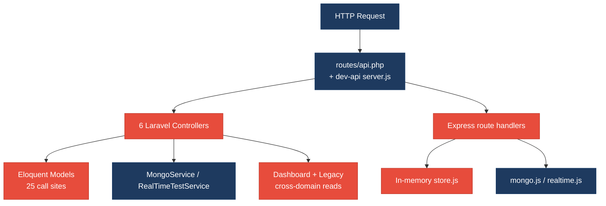
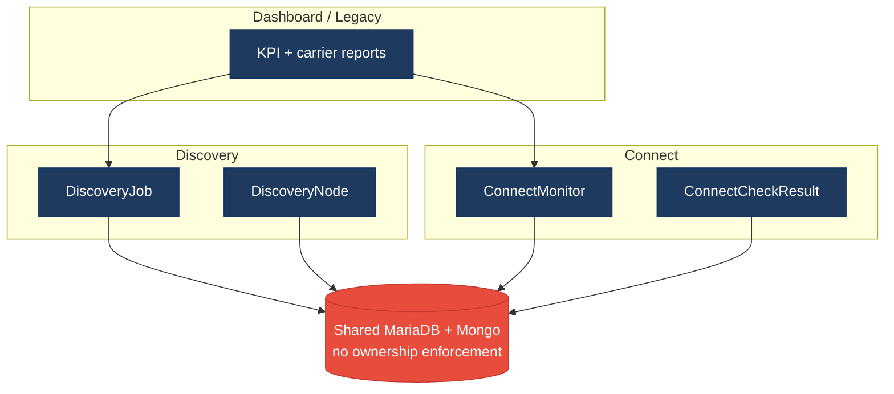
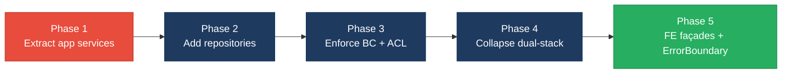

# 1. Architecture & Design Hotspots Analysis

**Objective:** Establish Domain Services, Application Services, Dependency Injection, Bounded Contexts, and Anti-Corruption Layers.

**Date:** 2026-07-24 | **Scope:** `shende-shweta/FSDKC` (main) — Laravel 12 (PHP 8.3) + React 19/Vite SPA + Node Express `dev-api`

## Executive Summary

> **Executive Summary**
>
> Klearcom is a multi-layer Voice/Telecom QA monolith (Laravel 12 API, React 19 SPA, Node Express `dev-api`) with nominal Discovery/Connect module folders that contain only `AGENTS.md` stubs — real logic lives in fat HTTP handlers and two shared services. Controllers and Express routes call Eloquent/in-memory stores directly (no repository layer), duplicate reachability/`buildTree`/KPI math across PHP and Node, and cross-read both domains from Dashboard and Legacy report paths. Layers covered: backend PHP (~20 app sources, 6 API controllers, 4 models, 2 services, 0 repositories), React frontend (~15 TS/TSX/JSX sources), and Node `dev-api` (6 JS modules). Dominant risk is change amplification and hidden coupling: a reachability formula or IVR tree shape change requires coordinated edits in Laravel controllers, `RealTimeTestService`, `dev-api`, and both SPA pages.

<div class="metric-grid">
<div class="metric-card"><div class="metric-number">6</div><div class="metric-label">Controllers / Handlers</div></div>
<div class="metric-card"><div class="metric-number">4</div><div class="metric-label">Models / Entities</div></div>
<div class="metric-card"><div class="metric-number">2</div><div class="metric-label">Service Classes Found</div></div>
<div class="metric-card"><div class="metric-number">0</div><div class="metric-label">Repository Classes Found</div></div>
</div>

<div class="overall-rating overall-rating--high-risk"><div class="overall-rating-label">Overall Codebase Rating — Architecture &amp; Design</div><div class="overall-rating-value">High Risk</div><div class="overall-rating-note">Driven by High-Risk Missing Service/Repository layers (H2/H3), Direct SQL/ORM in controllers (H6), Domain boundary &amp; shared-DB coupling (H8/H9), and dual-stack logic duplication (H10).</div></div>

## 1.1 Benchmark Ratings Summary

| # | Hotspot | Primary KPI | <span class="rating rating-good">Good</span> | <span class="rating rating-moderate">Moderate</span> | <span class="rating rating-high-risk">High Risk</span> | Measured | Rating |
|---|---|---|---|---|---|---|---|
| H1 | Fat Controllers | Avg LOC per controller | <150 | 150–300 | >300 | 61 LOC | <span class="rating rating-good">Good</span> |
| H2 | Missing Service Layer | Controllers accessing repos/models | <10 | 10–20 | >20 | 25 Eloquent access points | <span class="rating rating-high-risk">High Risk</span> |
| H3 | Missing Repository Pattern | Direct DB access points | <10 | 10–20 | >20 | 32+ (0 repositories) | <span class="rating rating-high-risk">High Risk</span> |
| H4 | Circular Dependencies | Dependency cycles | 0 | 1–3 | >3 | 0 | <span class="rating rating-good">Good</span> |
| H5 | Shared Utility Abuse | Utility files w/ business logic | 0 | 1–5 | >5 | 2 | <span class="rating rating-moderate">Moderate</span> |
| H6 | Direct SQL in Controllers | ORM compliance % | >90% | 60–90% | <60% | ~22% kept out of controllers | <span class="rating rating-high-risk">High Risk</span> |
| H7 | God Classes | Classes >1000 LOC | 0 | 1–3 | >3 | 0 (largest server.js 224 LOC) | <span class="rating rating-good">Good</span> |
| H8 | Domain Boundary Violations | Cross-domain access points | 0 | 1–5 | >5 | 8 | <span class="rating rating-high-risk">High Risk</span> |
| H9 | Shared Database Coupling | Tables shared across domains | <10% | 10–30% | >30% | 80% (4/5 tables cross-read) | <span class="rating rating-high-risk">High Risk</span> |
| F1 | Business Logic in Components | Avg LOC per component | <150 | 150–300 | >300 | 74 LOC | <span class="rating rating-good">Good</span> |
| F2 | Missing Frontend Service/Data Layer | Components w/ inline API calls | <10 | 10–20 | >20 | 6 | <span class="rating rating-good">Good</span> |
| F3 | God / Oversized Components | Components >400 LOC | 0 | 1–3 | >3 | 0 (ConnectPage 208, DiscoveryPage 162) | <span class="rating rating-good">Good</span> |
| F4 | Prop Drilling / Global State Abuse | Max prop-drilling depth | ≤2 | 3–4 | >4 | 2 levels; focused Zustand store | <span class="rating rating-good">Good</span> |
| F5 | Legacy / Inconsistent Component Patterns | Legacy-pattern components | 0 | 1–10 | >10 | 2 | <span class="rating rating-moderate">Moderate</span> |
| H10 | Dual-stack domain duplication (additional) | Duplicated workflows across Laravel ↔ Node (target 0) | 0 | 1–3 | >3 | 5 duplicated workflows | <span class="rating rating-high-risk">High Risk</span> |
| H11 | Empty bounded-context shells (additional) | Module dirs with zero impl classes (target 0) | 0 | 1–2 | >2 | 2 empty backend module shells (+2 FE stubs) | <span class="rating rating-moderate">Moderate</span> |

## 1.2 Hotspot-by-Hotspot Evidence

### H1. Fat Controllers <span class="sev sev-low">Low</span>

**Benchmark:** `Avg LOC per controller = 61` → falls in the **Good** band (Good <150 · Moderate 150–300 · High Risk >300).

**What to check:** Business logic inside controllers/handlers; controllers should only translate HTTP ↔ application calls.

**Evidence:** Not observed as a size problem — six API controllers average 61 LOC (ConnectController 81, DiscoveryController 84, LegacyReportController 75, StreamController 58, MongoController 34, DashboardController 33). Controllers are short but still embed Eloquent and domain math (see H2/H6).

### H2. Missing Service Layer <span class="sev sev-critical">Critical</span>

**Benchmark:** `Controllers accessing repos/models = 25 Eloquent access points` → falls in the **High Risk** band (Good <10 · Moderate 10–20 · High Risk >20).

**What to check:** Business rules spread across controllers/utilities with no dedicated application-service tier for Discovery/Connect/Dashboard workflows.

**Evidence:** 25 Eloquent static call sites across four controllers (Stream/Mongo have none). Examples:

`backend/app/Http/Controllers/Api/DashboardController.php:12-35` — KPI aggregation queries both domains inline:

```php
$discoveryTotal = DiscoveryJob::count();
$discoveryCompleted = DiscoveryJob::where('status', 'completed')->count();
$connectMonitors = ConnectMonitor::count();
$avgReachability = ConnectMonitor::avg('reachability_pct') ?? 0;
$alerts = ConnectMonitor::where('status', 'alert')->count();
```

`backend/app/Http/Controllers/Api/ConnectController.php:65-88` — reachability formula computed in the controller:

```php
$recentChecks = ConnectCheckResult::where('connect_monitor_id', $id)
    ->orderByDesc('checked_at')
    ->limit(20)
    ->get();
$successRate = $recentChecks->count() > 0
    ? ($recentChecks->where('reachable', true)->count() / $recentChecks->count()) * 100
    : 100;
$computedStatus = $successRate < 90 ? 'alert' : 'active';
```

Only two shared services exist (`MongoService`, `RealTimeTestService`); there are no Discovery/Connect/Dashboard application services.

**Why it matters here:** Reachability threshold (`< 90`) and KPI formulas cannot be reused from CLI/jobs without copying controller code; `dev-api` already reimplemented the same math, so Laravel and Node drift independently.

**Recommended approach:** Extract `DashboardKpiService`, `ConnectReachabilityService`, and `DiscoveryTreeService`; thin controllers to validate + delegate; unit-test formulas without HTTP.

<!-- affected-files
search: (ConnectMonitor|ConnectCheckResult|DiscoveryJob|DiscoveryNode)::
glob: backend/app/Http/Controllers/**/*.php
issue: Controller accesses Eloquent models directly
action: Move workflow/queries into application services + repositories
-->

### H3. Missing Repository Pattern <span class="sev sev-critical">Critical</span>

**Benchmark:** `Direct DB access points outside repositories = 32+ (0 repository classes)` → falls in the **High Risk** band (Good <10 · Moderate 10–20 · High Risk >20).

**What to check:** Direct DB/ORM access scattered through the codebase; persistence concerns leak into business logic.

**Evidence:** Zero classes named `*Repository*`. Controllers hold 25 Eloquent sites; `RealTimeTestService` adds 7 more (`DiscoveryJob::findOrFail`, `DiscoveryNode::create`, `ConnectCheckResult::create`, etc.). Express `dev-api/src/server.js` mutates `store.*` arrays directly with no data-access abstraction.

```php
// RealTimeTestService.php — persistence mixed with test orchestration
$node = DiscoveryNode::create([
    'discovery_job_id' => $jobId,
    'parent_id' => $parentId,
    'prompt_text' => $step['transcript'] ?? 'Menu discovered',
    'node_type' => 'menu',
    'depth' => $parentId ? 1 : 0,
]);
```

**Why it matters here:** MariaDB/Eloquent and the in-memory `store` cannot be swapped or faked cleanly; schema changes require hunting every `::where`/`store.connectMonitors` call site.

**Recommended approach:** Introduce `ConnectMonitorRepository` / `DiscoveryJobRepository` interfaces with Eloquent + in-memory impls; stop calling models from controllers and from `RealTimeTestService` entrypoints.

<!-- affected-files
search: (ConnectMonitor|ConnectCheckResult|DiscoveryJob|DiscoveryNode)::
glob: backend/app/**/*.php
issue: Direct Eloquent access with no repository layer
action: Introduce repository interfaces/impls; inject into services
-->

### H4. Circular Dependencies <span class="sev sev-low">Low</span>

**Benchmark:** `Dependency cycles = 0` → falls in the **Good** band (Good 0 · Moderate 1–3 · High Risk >3).

**What to check:** Modules/packages importing each other.

**Evidence:** Not observed — Laravel DI is one-way (controllers → services → models/Mongo). No PHP/JS import cycles detected among app packages.

### H5. Shared Utility Abuse <span class="sev sev-medium">Medium</span>

**Benchmark:** `Utility files w/ business logic = 2` → falls in the **Moderate** band (Good 0 · Moderate 1–5 · High Risk >5).

**What to check:** Large common/helpers/utils holding business logic.

**Evidence:**

1. `backend/app/Legacy/LegacyDataMapper.php` — domain mapping via unsafe `extract()`:

```php
public function mapReportRow(array $row): array
{
    extract($row, EXTR_SKIP);
    return [
        'label' => $name ?? 'Unknown',
        'metric' => $reachability_pct ?? 0,
        'region' => $country_code ?? 'N/A',
        'source' => 'legacy_extract_mapper',
    ];
}
```

2. `buildTree` duplicated as private methods in `DiscoveryController` / `LegacyReportController` and as `export function buildTree` in `dev-api/src/store.js` — unowned tree-domain logic living in “helpers.”

**Why it matters here:** Report row shape and IVR tree structure change in three places; `extract()` hides required fields from static analysis.

**Recommended approach:** Replace mapper with typed DTOs; move `buildTree` into a Discovery domain service shared (or proxied) by Laravel; delete Node copy once `dev-api` proxies.

<!-- affected-files
search: (extract\(|function buildTree|private function buildTree)
glob: {backend/app/**/*.php,dev-api/src/**/*.js}
issue: Shared utility / duplicated domain helper
action: Replace extract mapper with DTOs; centralize buildTree in Discovery domain service
-->

### H6. Direct SQL in Controllers <span class="sev sev-critical">Critical</span>

**Benchmark:** `ORM compliance % ≈ 22% kept out of controllers` → falls in the **High Risk** band (Good >90% · Moderate 60–90% · High Risk <60%).

**What to check:** Raw queries / query builders embedded directly in controllers/handlers.

**Evidence:** Of 32 Eloquent call sites measured in PHP app code, 25 (78%) sit in controllers. `LegacyReportController::carrierSummary` builds dynamic filters and N+1 check queries in the HTTP layer:

```php
$monitors = ConnectMonitor::query()
    ->when(isset($country_code), fn ($q) => $q->where('country_code', $country_code))
    ->when(isset($carrier), fn ($q) => $q->where('carrier', $carrier))
    ->orderByDesc('reachability_pct')
    ->get();
foreach ($monitors as $monitor) {
    $recent = ConnectCheckResult::where('connect_monitor_id', $monitor->id)
        ->orderByDesc('checked_at')->limit(20)->get();
```

Express handlers mirror this with direct `store` reads/writes for every route.

**Why it matters here:** Persistence is inseparable from HTTP; PHPUnit/Jest cannot exercise carrier reports without bootstrapping full request stacks.

**Recommended approach:** Relocate all Eloquent builders into repositories; controllers only call services that return DTOs/JSON resources.

<!-- affected-files
search: ::(query|where|orderByDesc|create|findOrFail|count|avg|with)\(
glob: backend/app/Http/Controllers/**/*.php
issue: ORM/query builders in controllers
action: Move queries into repositories invoked via application services
-->

### H7. God Classes <span class="sev sev-low">Low</span>

**Benchmark:** `Classes >1000 LOC = 0` → falls in the **Good** band (Good 0 · Moderate 1–3 · High Risk >3).

**What to check:** Single classes/files handling many unrelated responsibilities at extreme size.

**Evidence:** Not observed — largest measured server file is `dev-api/src/server.js` at 224 LOC; `RealTimeTestService` is 118 LOC; no file exceeds 1000 LOC. Responsibility sprawl exists (H2/H10) without god-class size.

### H8. Domain Boundary Violations <span class="sev sev-critical">Critical</span>

**Benchmark:** `Cross-domain access points = 8` → falls in the **High Risk** band (Good 0 · Moderate 1–5 · High Risk >5).

**What to check:** Code in one business area directly reading/writing another area's data or models.

**Evidence:** Eight cross-domain access points:

| # | Location | Violation |
|---|---|---|
| 1–5 | `DashboardController::kpis` | Reads DiscoveryJob + ConnectMonitor for aggregated KPIs |
| 6–7 | `LegacyReportController` | Connect carrier report + Discovery IVR depth in one controller |
| 8 | `RealTimeTestService` | Single class owns both `runDiscoveryTest` and `runConnectTest` |

```php
// DashboardController — both bounded contexts queried together
'active_discovery_jobs' => DiscoveryJob::where('status', 'running')->count(),
'active_connect_monitors' => ConnectMonitor::where('status', 'active')->count(),
```

Module folders `backend/app/Modules/{Discovery,Connect}` contain only `AGENTS.md` — no ownership enforcement.

**Why it matters here:** Dashboard/Legacy become the integration hub; Discovery schema changes silently break KPI and report endpoints.

**Recommended approach:** Publish read models/APIs per context; Dashboard/Legacy consume ACL façades; split RealTimeTestService into per-module services under `Modules/*`.

<!-- affected-files
search: (DiscoveryJob|ConnectMonitor|DiscoveryNode|ConnectCheckResult)::
glob: backend/app/Http/Controllers/Api/{Dashboard,LegacyReport}Controller.php
issue: Cross-domain model access from Dashboard/Legacy
action: Route through published context APIs / anti-corruption layer
-->

### H9. Shared Database Coupling <span class="sev sev-critical">Critical</span>

**Benchmark:** `Tables shared across domains = 80% (4/5 tables cross-read)` → falls in the **High Risk** band (Good <10% · Moderate 10–30% · High Risk >30%).

**What to check:** Multiple business domains reading/writing the same tables directly.

**Evidence:** Relational tables/collections in play: `discovery_jobs`, `discovery_nodes`, `connect_monitors`, `connect_check_results`, plus Mongo transcripts/diagnostics/events. Four of five relational entities are read outside their owning module (Dashboard, Legacy, RealTimeTestService). Mongo collections are keyed by free-form `module` string (`'discovery'|'connect'`) with no ownership boundary.

**Why it matters here:** Adding a column to `connect_monitors` for Connect alone still risks Dashboard KPI and Legacy report breakage; Node `store` mirrors the same shared bag.

**Recommended approach:** Declare table ownership (Discovery owns jobs/nodes; Connect owns monitors/checks); Dashboard reads only via published views/APIs; stop cross-module `Model::` imports.

<!-- affected-files
search: (DiscoveryJob|DiscoveryNode|ConnectMonitor|ConnectCheckResult)
glob: backend/app/**/*.php
issue: Shared-table coupling across domains
action: Enforce per-table ownership; eliminate unauthorized Model imports
-->

### F1. Business Logic in Components <span class="sev sev-low">Low</span>

**Benchmark:** `Avg LOC per component = 74` → falls in the **Good** band (Good <150 · Moderate 150–300 · High Risk >300).

**What to check:** Validation, calculations, workflow logic living inside view components.

**Evidence:** Nine UI units average 74 LOC (ConnectPage 208, DiscoveryPage 162, DashboardPage 66, others smaller). Pages are presentation-heavy with React Query; domain math stays on the server. Not observed as a High-Risk size/logic problem.

### F2. Missing Frontend Service/Data Layer <span class="sev sev-low">Low</span>

**Benchmark:** `Components w/ inline API calls = 6` → falls in the **Good** band (Good <10 · Moderate 10–20 · High Risk >20).

**What to check:** `fetch`/HTTP calls and API URLs hard-coded inline in components.

**Evidence:** Thin shared client exists (`frontend/src/api/client.ts`), but six UI files hard-code module paths via `api.get`/`api.post`: ConnectPage, DiscoveryPage, DashboardPage, LegacyDashboardWidget, MongoStatus, LegacyMonitorPoller. Count stays in Good band; still recommend module façades to reduce path churn.

```tsx
// ConnectPage.tsx — path literals in the page
queryFn: () => api.get<{ data: ConnectMonitor[] }>('/connect/monitors'),
```

<!-- affected-files
search: api\.(get|post)\(
glob: frontend/src/**/*.{tsx,ts,jsx,js}
issue: Hard-coded API paths in UI modules
action: Add Discovery/Connect API façades; keep pages on typed clients
-->

### F3. God / Oversized Components <span class="sev sev-low">Low</span>

**Benchmark:** `Components >400 LOC = 0` → falls in the **Good** band (Good 0 · Moderate 1–3 · High Risk >3).

**What to check:** Single components handling many unrelated responsibilities at extreme size.

**Evidence:** Not observed — largest is ConnectPage at 208 LOC (<400). Pages combine form + table + feed but stay under the size threshold.

### F4. Prop Drilling / Global State Abuse <span class="sev sev-low">Low</span>

**Benchmark:** `Max prop-drilling depth = 2; focused Zustand store` → falls in the **Good** band (Good ≤2 · Moderate 3–4 · High Risk >4).

**What to check:** Props threaded through many layers, or one giant global store.

**Evidence:** Not observed as abuse — `uiStore` holds only selected Discovery/Connect IDs; children like `LiveTestFeed` / `IvrTree` take shallow props (≤2 levels). React Query owns server cache.

### F5. Legacy / Inconsistent Component Patterns <span class="sev sev-medium">Medium</span>

**Benchmark:** `Legacy-pattern components = 2` → falls in the **Moderate** band (Good 0 · Moderate 1–10 · High Risk >10).

**What to check:** Mixed paradigms, missing error boundaries, deprecated lifecycle/APIs.

**Evidence:**

1. `frontend/src/components/LegacyMonitorPoller.jsx` — class component with intentional missing `componentWillUnmount` (interval leak):

```jsx
export default class LegacyMonitorPoller extends Component {
  componentDidMount() {
    this.intervalId = setInterval(() => {
      api.get(`/connect/monitors/${this.props.monitorId}/checks`)
        .then((res) => { /* ... */ });
    }, 3000);
    // Intentionally no componentWillUnmount
  }
}
```

2. `frontend/src/pages/LegacyDashboardWidget.tsx` — parallel legacy widget path alongside modern pages; no React ErrorBoundary in `App.tsx`/`main.tsx`.

**Why it matters here:** Class + hook mix raises onboarding cost; missing ErrorBoundary lets SSE/poll failures blank the whole SPA shell.

**Recommended approach:** Rewrite poller as a hook with cleanup; add `<ErrorBoundary>`; standardize on TSX function components.

<!-- affected-files
search: (extends Component|componentDidMount|Legacy)
glob: frontend/src/**/*.{tsx,ts,jsx,js}
issue: Legacy class component / inconsistent UI patterns
action: Migrate to hooks; add ErrorBoundary; standardize TSX
-->

### H10. Dual-stack domain duplication (additional) <span class="sev sev-critical">Critical</span>

**Benchmark:** `Duplicated workflows across Laravel ↔ Node = 5` → falls in the **High Risk** band (KPI: Good 0 · Moderate 1–3 · High Risk >3).

**What to check:** Same business workflows implemented twice (Laravel + Express) without a single source of truth.

**Evidence:** Five duplicated workflows: (1) dashboard KPI math, (2) discovery job CRUD/start, (3) connect monitor CRUD/run-check, (4) reachability success-rate formula, (5) IVR `buildTree` + SSE streaming. Compare `DashboardController::kpis` vs `server.js` `/api/dashboard/kpis`, and `RealTimeTestService::runConnectTest` vs `realtime.js` `runConnectTest`.

**Why it matters here:** Feature parity requires editing PHP and Node; frontend points at `VITE_API_URL` (often `dev-api`), so production Laravel can silently diverge.

**Recommended approach:** Make Laravel the system of record; shrink `dev-api` to a thin proxy/SSE shim or delete duplicated routes.

<!-- affected-files
search: (reachability|buildTree|dashboard/kpis|runConnectTest|runDiscoveryTest)
glob: {backend/app/**/*.{php},dev-api/src/**/*.js}
issue: Dual-stack duplicated domain workflow
action: Consolidate onto Laravel; proxy or remove Node reimplementation
-->

### H11. Empty bounded-context shells (additional) <span class="sev sev-medium">Medium</span>

**Benchmark:** `Module dirs with zero impl classes = 2` (backend Discovery + Connect; FE mirrors as stubs) → falls in the **Moderate** band (KPI: Good 0 · Moderate 1–2 · High Risk >2).

**What to check:** Declared module packages that hold no implementation — false bounded-context signal.

**Evidence:** `backend/app/Modules/Discovery/` and `.../Connect/` each contain only `AGENTS.md`. Frontend `frontend/src/modules/{Discovery,Connect}/` likewise only `AGENTS.md`. Real code lives under shared `Http/Controllers`, `Models`, `Services`, and `pages/`.

**Why it matters here:** New contributors place code in the wrong layer; import boundaries cannot be enforced because packages are empty.

**Recommended approach:** Relocate controllers/services/models into `Modules/{Discovery,Connect}` packages; add PHPStan/Deptrac rules; wire FE modules to real API façades.

<!-- affected-files
glob: {backend/app/Modules/**/*,frontend/src/modules/**/*}
issue: Empty bounded-context module shell
action: Move domain classes into Modules packages; enforce import boundaries
-->

## 1.3 Diagrams

### Current-state architecture (as-is)



### Clean reference path (target pattern found in codebase)


### Domain boundary map (business domains found vs. shared data)



### Target architecture (proposed)


### Improvement roadmap



## 1.4 Actions Required

| Hotspot | Action | Rating | Priority |
|---|---|---|---|
| H2 Missing Service Layer | Extract Dashboard/Discovery/Connect application services; thin controllers to HTTP only | <span class="rating rating-high-risk">High Risk</span> | <span class="sev sev-critical">Critical</span> |
| H3 Missing Repository Pattern | Add MariaDB repository interfaces/impls; stop Eloquent from controllers/services entrypoints | <span class="rating rating-high-risk">High Risk</span> | <span class="sev sev-critical">Critical</span> |
| H5 Shared Utility Abuse | Replace `LegacyDataMapper` extract() with DTOs; move `buildTree` into Discovery domain service | <span class="rating rating-moderate">Moderate</span> | <span class="sev sev-medium">Medium</span> |
| H6 Direct SQL in Controllers | Relocate all Eloquent builders out of controllers into repositories via services | <span class="rating rating-high-risk">High Risk</span> | <span class="sev sev-critical">Critical</span> |
| H8 Domain Boundary Violations | Enforce Discovery/Connect ownership; Dashboard/Legacy consume published APIs/ACL | <span class="rating rating-high-risk">High Risk</span> | <span class="sev sev-critical">Critical</span> |
| H9 Shared Database Coupling | Declare per-table ownership; eliminate cross-domain Model:: reads | <span class="rating rating-high-risk">High Risk</span> | <span class="sev sev-critical">Critical</span> |
| F5 Legacy Component Patterns | Migrate class poller to hooks; add ErrorBoundary; standardize TSX | <span class="rating rating-moderate">Moderate</span> | <span class="sev sev-medium">Medium</span> |
| H10 Dual-stack duplication | Consolidate domain logic onto Laravel; shrink/proxy `dev-api` | <span class="rating rating-high-risk">High Risk</span> | <span class="sev sev-critical">Critical</span> |
| H11 Empty module shells | Relocate domain classes into `Modules/*` packages; enforce import boundaries | <span class="rating rating-moderate">Moderate</span> | <span class="sev sev-medium">Medium</span> |

## 1.5 Expected Outcomes

- Controllers and Express handlers become thin HTTP adapters; KPI/reachability/tree workflows live once in application/domain services and are unit-testable without a database.
- Repository interfaces isolate MariaDB/Mongo persistence, enabling deterministic tests and safer schema evolution.
- Discovery and Connect evolve as real bounded contexts with owned models/tables and anti-corruption edges for Dashboard/Legacy.
- Dual-stack drift disappears when Node stops re-implementing domain rules; frontend module API façades + ErrorBoundary reduce path churn and uncaught UI failures.
- Empty module folders become enforceable packages, preparing the monolith for independent extraction of Discovery or Connect.
