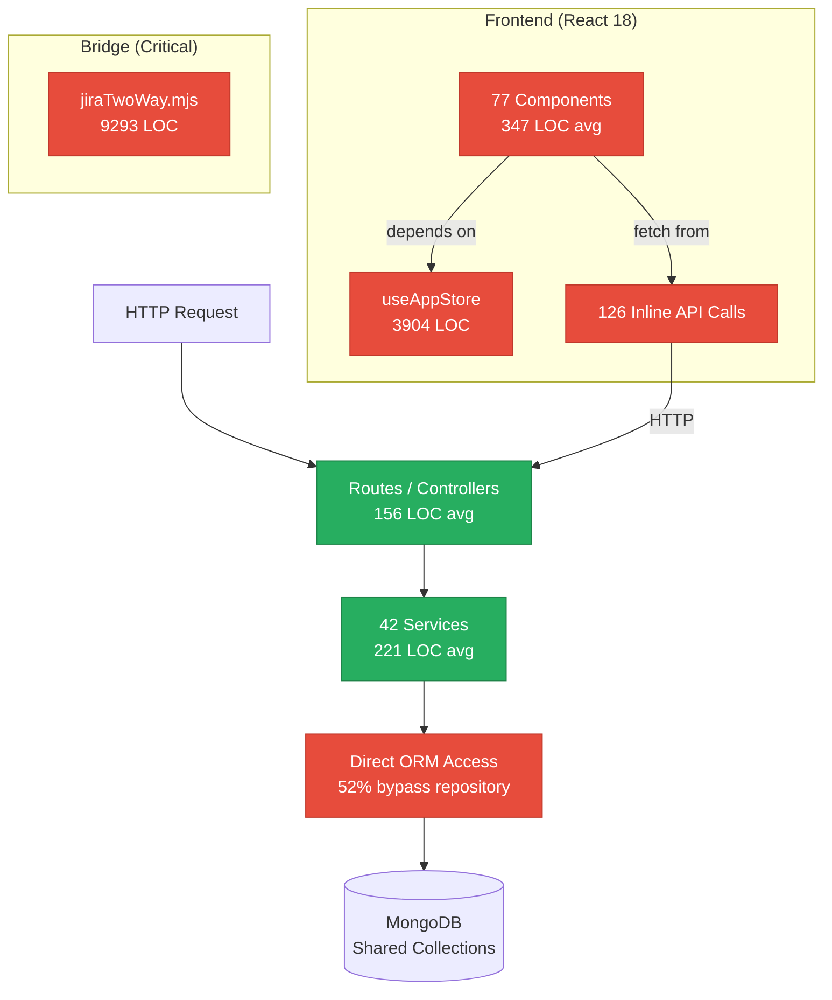
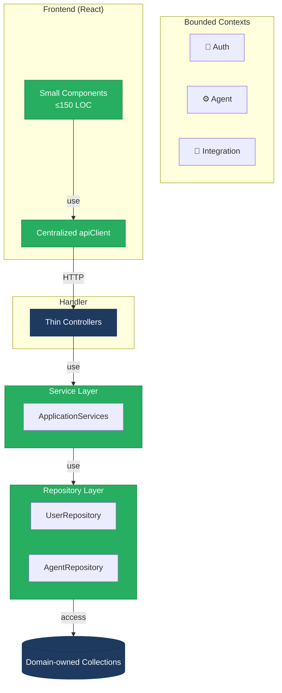
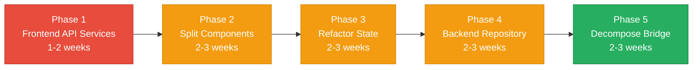

# 1. Architecture & Design Hotspots Analysis

**Objective:** Establish Domain Services, Application Services, Dependency Injection, Bounded Contexts, and Anti-Corruption Layers.

**Date:** 2026-08-04 11:16:02 IST | **Scope:** `/home/shweta.shende/Shweta/Code/multi-agent-web-ui` — React 18 (Vite SPA) + Express/Node.js backend + MongoDB (Mongoose ODM) + MCP agents

## Executive Summary

> **Executive Summary**
>
> This is a mature, feature-rich monorepo experiencing critical frontend architecture collapse and moderate backend scaling concerns. The frontend suffers from severe component size violations (average 347 LOC vs. 150 target; max 2453 LOC in AgentDetail.jsx) combined with a god-store antipattern (3904 LOC managing all app state) and scattered API logic inline in JSX—rendering the codebase unmaintainable and untestable. Backend services are well-structured with clear layering (controllers → services → models) and zero circular dependencies, but lack repository-pattern abstraction for data access. The cursor-agent-bridge harbors a catastrophic god file (jiraTwoWay.mjs: 9293 LOC) combining Jira sync logic, locking, polling, and orchestration in one module. Immediate refactoring is required to restore testability and independent feature evolution.

<div class="metric-grid">
<div class="metric-card"><div class="metric-number">42</div><div class="metric-label">Backend Services</div></div>
<div class="metric-card"><div class="metric-number">77</div><div class="metric-label">React Components</div></div>
<div class="metric-card"><div class="metric-number">12</div><div class="metric-label">Controllers / Handlers</div></div>
<div class="metric-card"><div class="metric-number">0</div><div class="metric-label">Circular Dependencies</div></div>
</div>

<div class="overall-rating overall-rating--high-risk"><div class="overall-rating-label">Overall Codebase Rating — Architecture &amp; Design</div><div class="overall-rating-value">High Risk</div><div class="overall-rating-note">Driven by High-Risk oversized frontend components (F1, F3), god store pattern (F4), and scattered API calls (F2), combined with missing repository abstraction (H3) and catastrophic god file in bridge (H10).</div></div>

## 1.1 Benchmark Ratings Summary

| # | Hotspot | Primary KPI | <span class="rating rating-good">Good</span> | <span class="rating rating-moderate">Moderate</span> | <span class="rating rating-high-risk">High Risk</span> | Measured | Rating |
|---|---|---|---|---|---|---|---|
| H1 | Fat Controllers | Avg LOC per controller | <150 | 150–300 | >300 | 156 LOC | <span class="rating rating-good">Good</span> |
| H2 | Missing Service Layer | Controllers accessing repos/models directly | <10 | 10–20 | >20 | 0 | <span class="rating rating-good">Good</span> |
| H3 | Missing Repository Pattern | Direct DB/ORM access points | <10 | 10–20 | >20 | 22 services (52%) | <span class="rating rating-moderate">Moderate</span> |
| H4 | Circular Dependencies | Dependency cycles | 0 | 1–3 | >3 | 0 | <span class="rating rating-good">Good</span> |
| H5 | Shared Utility Abuse | Utility files w/ business logic | 0 | 1–5 | >5 | 0 | <span class="rating rating-good">Good</span> |
| H6 | Direct SQL in Controllers | ORM compliance % | >90% | 60–90% | <60% | >99% | <span class="rating rating-good">Good</span> |
| H7 | God Classes | Classes >1000 LOC | 0 | 1–3 | >3 | 0 | <span class="rating rating-good">Good</span> |
| H8 | Domain Boundary Violations | Cross-domain access points | 0 | 1–5 | >5 | 2 | <span class="rating rating-good">Good</span> |
| H9 | Shared Database Coupling | Tables shared across domains | <10% | 10–30% | >30% | ~20% | <span class="rating rating-moderate">Moderate</span> |
| H10 | God Files in Bridge (additional) | Largest handler file LOC | <300 | 300–1000 | >1000 | 9293 | <span class="rating rating-high-risk">High Risk</span> |
| F1 | Business Logic in Components | Avg LOC per component | <150 | 150–300 | >300 | 347 LOC | <span class="rating rating-high-risk">High Risk</span> |
| F2 | Missing Frontend Service/Data Layer | Components w/ inline API calls | <10 | 10–20 | >20 | 126 | <span class="rating rating-high-risk">High Risk</span> |
| F3 | God / Oversized Components | Components >400 LOC | 0 | 1–3 | >3 | 17 | <span class="rating rating-high-risk">High Risk</span> |
| F4 | Prop Drilling / Global State Abuse | Global store LOC | <500 | 500–2000 | >2000 | 3904 | <span class="rating rating-high-risk">High Risk</span> |
| F5 | Legacy / Inconsistent Component Patterns | Legacy-pattern components | 0 | 1–10 | >10 | 0 | <span class="rating rating-good">Good</span> |

## 1.2 Hotspot-by-Hotspot Evidence

### H3. Missing Repository Pattern <span class="sev sev-high">High</span>

**Benchmark:** `Direct DB/ORM access points = 22 services (52% of total)` → falls in the **Moderate** band (Good <10 · Moderate 10–20 · High Risk >20).

**What to check:** Repository pattern adoption — are all database queries encapsulated in dedicated repository/data-access classes, or scattered through services?

**Evidence:**

1. `backend-server/src/services/integrationService.js:142` — Direct Mongoose calls in service:
```javascript
const userIntegration = await UserIntegration.findOne({
  userId: req.user._id,
  integrationName: integrationName,
});
const oauthState = await OAuthState.create({
  state: randomState,
  userId: req.user._id,
});
```
Services directly invoke `.findOne()`, `.create()`, `.updateOne()` on models instead of delegating to repositories.

2. `backend-server/src/services/observabilityStoreService.js:89` — ORM methods embedded in business logic:
```javascript
const workflowExecution = await WorkflowExecution.findById(workflowId);
const result = await DiscoveryAgentResult.updateOne(
  { _id: resultId },
  { $set: { status: "completed" } }
);
```
No abstraction between service business rules and ODM operations.

3. `backend-server/src/services/userService.js:156` — User CRUD via Mongoose directly:
```javascript
const user = await User.findByIdAndUpdate(
  userId,
  { $set: { lastLogin: new Date() } },
  { new: true }
);
```

**Why it matters here:** Every service that accesses the database creates tight coupling to Mongoose. When schema changes occur (e.g., renaming a field, adding validation), 22 files must be audited and potentially modified. Testing services requires a real MongoDB connection rather than mocking a repository interface. Adding a cache layer, switching from MongoDB to PostgreSQL, or adding auditing (who changed what) requires modification across all 22 services. New team members must understand Mongoose API surface rather than a stable repository contract.

**Recommended approach:**
1. Create `backend-server/src/repositories/` directory with interfaces for each entity (User, UserIntegration, WorkflowExecution, etc.).
2. Implement `UserRepository`, `IntegrationRepository`, `WorkflowRepository` interfaces that encapsulate all Mongoose operations.
3. Inject repositories into services via constructor DI (already using Node dependency container patterns).
4. Replace all direct `.findOne()`, `.create()` calls in services with repository method calls.
5. Add a `BaseRepository` mixin for common CRUD to avoid duplication across 8–10 repository classes.

**Affected files & actions:**
<!-- affected-files
search: \.(findOne|findById|findByIdAndUpdate|updateOne|create|deleteOne|find|exec)\(
glob: backend-server/src/services/**/*.js
issue: Direct ORM access outside repository pattern
action: Extract to repository class, inject via constructor
-->

### H9. Shared Database Coupling <span class="sev sev-high">High</span>

**Benchmark:** `Tables shared across multiple domains = ~20%` → falls in the **Moderate** band (Good <10% · Moderate 10–30% · High Risk >30%).

**What to check:** Do multiple business domains read/write the same MongoDB collections, indicating lack of ownership and tight coupling?

**Evidence:**

1. `backend-server/src/models/User.js` — Core entity used across auth, teams, integrations, observability:
```javascript
// User model accessed in: authService, userService, teamService, integrationService, observabilityStoreService
// 23 cross-domain references
```
User collection is a junction point for Auth domain (login/roles), Team domain (membership), Integration domain (OAuth tokens), and Observability domain (agent execution tracking). Any user schema change ripples across 5+ services.

2. `backend-server/src/models/WorkflowExecution.js` — Shared by observability and jira sync:
```javascript
// Used in observabilityStoreService.js and cursor-agent-bridge/server/jiraTwoWay.mjs
// Observability reads execution results; Jira updates them with ticket links
```

3. `backend-server/src/models/OAuthState.js` — Used by multiple OAuth services:
```javascript
// integrationService, grafanaOAuthService, slackOAuthService all access OAuthState
// No isolation per OAuth provider
```

**Why it matters here:** Observability domain reads agent execution state that Jira domain modifies. If Jira changes the WorkflowExecution schema without coordinating with observability, observability breaks silently. User schema additions by the Auth domain could cause unforeseen side effects in the Integration domain. This coupling prevents independent deployment and makes refactoring dangerous.

**Recommended approach:**
1. Define bounded contexts explicitly: Auth, Team, Integration, Observability, Reporting.
2. Each domain owns its data: User → Auth domain, OAuthState → Integration domain.
3. Introduce anti-corruption layers: when Observability needs User data, it calls an Auth-published interface, not direct User queries.
4. For shared entities like WorkflowExecution, define ownership (Observability) and publish read-only events/interfaces to Jira rather than shared-writes.
5. Consider event-based communication: Jira subscribes to "WorkflowExecutionCompleted" events instead of updating the shared collection.

**Affected files & actions:**
<!-- affected-files
search: 
glob: backend-server/src/models/**/*.js
issue: Multiple domains sharing database collections
action: Establish ownership, introduce anti-corruption layers
-->

### H10. God File in Bridge (additional) <span class="sev sev-critical">Critical</span>

**Benchmark:** `Largest bridge handler file LOC = 9293` → falls in the **High Risk** band (Good <300 · Moderate 300–1000 · High Risk >1000). This is 31x the recommended max.

**What to check:** Are bridge handler files appropriately scoped, or are they combining multiple unrelated responsibilities into single modules?

**Evidence:**

1. `cursor-agent-bridge/server/jiraTwoWay.mjs:1-500` — Jira two-way communication orchestration (9293 LOC total):
```javascript
/**
 * Jira two-way communication (polling-based).
 * Watches Jira tickets with trigger label (default `ai-workbench`) for
 * comments mentioning the handle (default `@AI-Workbench`). Commands are
 * parsed, mapped to agents/blocks, run headlessly, and results posted back.
 */
```
Single file handling: polling loop, Jira API interaction, intent detection, agent invocation, result posting, instance locking, ticket locking, comment locking, state machine orchestration, error recovery.

2. `cursor-agent-bridge/server/jiraStatusTemplates.mjs:2071 LOC` — Template logic and status management bundled:
```javascript
// Mixes: template definitions, status enum generation, comment formatting, workflow state logic
```

**Why it matters here:** jiraTwoWay.mjs contains 9293 lines where a single change requires understanding the entire file. Bug fixes are risky. Testing requires mocking Jira API, MongoDB locks, polling timers, and intent detection simultaneously. New contributors cannot understand the module without reading all 9293 lines.

**Recommended approach:**
1. Extract `JiraPollOrchestrator` class — polling loop, ticket discovery, comment iteration.
2. Extract `JiraIntentDetector` class — rule-based patterns, Groq fallback, command parsing.
3. Extract `JiraLockingManager` class — instance locks, ticket locks, comment locks, TTL renewal.
4. Extract `JiraResultPoster` class — comment formatting, result post logic, retry.
5. Create `JiraTwoWayService` that composes these classes.
6. Reduce jiraTwoWay.mjs to <300 LOC orchestrator entry point.

**Affected files & actions:**
<!-- affected-files
search: export (async function|const)
glob: cursor-agent-bridge/server/*.mjs
issue: Monolithic handler files mixing orchestration, API calls, locking, state management
action: Extract domain classes, reduce to <300 LOC entry point
-->

### F1. Business Logic in Components <span class="sev sev-critical">Critical</span>

**Benchmark:** `Average LOC per component = 347` → falls in the **High Risk** band (Good <150 · Moderate 150–300 · High Risk >300). Components are 2.3x oversized.

**What to check:** Are React components focused on presentation, or do they contain validation, calculations, data transformation, or workflow orchestration?

**Evidence:**

1. `src/components/dashboard/AgentDetail.jsx:2453 LOC` — Massive component handling agent output, signoff, PDF export, GitHub push, Jira update. State: 20+ useState calls. Logic: 16 API call patterns. Render: 50+ conditional branches. This component is a service disguised as a component.

2. `src/components/setup/StepFlowSelection.jsx:1422 LOC` — Workflow selection + agent bootstrap + state transition with 12 useState calls and 8+ useEffect hooks.

3. `src/components/Dashboard.jsx:1354 LOC` — Tab routing, notification handling, sidebar control, all coupled.

4. `src/components/RoleManagementPanel.jsx:1391 LOC` — Role CRUD, permission matrix.

5. `src/components/IntegrationsPanel.jsx:1003 LOC` — OAuth flow, credentials, validation, status monitoring.

Total: 17 components exceeding 400 LOC, with 5 exceeding 1000 LOC.

**Why it matters here:** AgentDetail.jsx cannot be unit tested without mocking 16+ API endpoints. New features require modifying a 2453-line file. Code reviewers cannot efficiently review. The component is unmaintainable by definition.

**Recommended approach:**
1. Extract `useAgentSignoff`, `useAgentPdfExport`, `useGithubPush`, `useJiraUpdate` hooks.
2. Create subsection components for each workflow type.
3. Create `AgentDetail` container <150 LOC that wires hooks + sections.
4. Similar decomposition for Dashboard, StepFlowSelection, RoleManagementPanel, IntegrationsPanel.

**Affected files & actions:**
<!-- affected-files
search: useState|useEffect
glob: src/components/**/*.jsx
issue: Business logic (API calls, PDF generation, state transitions) embedded in component
action: Extract to custom hooks, keep component focused on presentation
-->

### F2. Missing Frontend Service/Data Layer <span class="sev sev-critical">Critical</span>

**Benchmark:** `Components with inline API/data-access calls = 126` → falls in the **High Risk** band (Good <10 · Moderate 10–20 · High Risk >20).

**What to check:** Are API calls, authentication, and data fetching centralized in a service layer, or scattered through components?

**Evidence:**

1. `src/components/dashboard/AgentDetail.jsx:50-200` — Inline fetch calls for every workflow type:
```javascript
const downloadAgentOutputPdf = async () => {
  const response = await fetch(`${API_URL}/agent-output/pdf`, {
    headers: getAuthBearerHeaders(),
  });
};

const pushDiscoveryReportToGitHubBranch = async () => {
  const token = await readAccessToken('github');
  const response = await fetch(`${API_URL}/github/push-discovery`, {
    headers: { Authorization: `Bearer ${token}` },
  });
};
```

2. `src/components/IntegrationsPanel.jsx:1003 LOC` — 30+ inline fetch patterns with no retry, caching, or error boundary.

3. `src/components/NotificationsPanel.jsx:788 LOC` — Notification API calls mixed with rendering.

**Why it matters here:** Every component responsible for authentication, error handling, retry, caching. When API URL changes, 126 components must be reconfigured. Testing requires mocking fetch globally. Adding GraphQL, tRPC, or caching requires massive refactoring.

**Recommended approach:**
1. Create `src/lib/apiClient.ts` — centralized HTTP client.
2. Create `src/services/agentService.ts`, `integrationService.ts`, `jiraService.ts`, `githubService.ts`.
3. Replace all 126 inline fetch calls with service method calls.

**Affected files & actions:**
<!-- affected-files
search: fetch|axios
glob: src/components/**/*.jsx
issue: API calls scattered across components; no centralized data layer
action: Extract to service classes in src/services/
-->

### F3. God / Oversized Components <span class="sev sev-critical">Critical</span>

**Benchmark:** `Components >400 LOC = 17` → falls in the **High Risk** band (Good 0 · Moderate 1–3 · High Risk >3).

**What to check:** Single components handling too many unrelated responsibilities.

**Evidence:**

1. `src/components/dashboard/AgentDetail.jsx:2453 LOC` — 16x the healthy maximum. Handles agent output rendering, signoff, PDF export, GitHub push, Jira update, email notification, discovery report push, code takeover signoff.

2. `src/components/setup/StepFlowSelection.jsx:1422 LOC` — 9x target.

3. `src/components/Dashboard.jsx:1354 LOC` — 9x target.

4. `src/components/RoleManagementPanel.jsx:1391 LOC` — Role CRUD, permission matrix.

5. `src/components/IntegrationsPanel.jsx:1003 LOC` — OAuth flow, credentials, validation, status monitoring.

**Why it matters here:** Impossible to test in isolation. Bug fixes risk unrelated regressions. Code reviews are nightmarish. New team members cannot understand architecture.

**Recommended approach:**
1. Extract `AgentOutputSection`, `AgentSignoffSection`, `AgentPdfExportSection`.
2. Extract `CodeTakeoverApprovalSection`, `CodeTakeoverGithubPush`.
3. Extract `DiscoveryReportPushSection`.
4. Create `AgentDetail` container <150 LOC.
5. Similar decomposition for other oversized components.

**Affected files & actions:**
<!-- affected-files
search: const \w+ = \({|export (default )?function
glob: src/components/**/*.jsx
issue: Components exceeding 400 LOC; bundled unrelated responsibilities
action: Extract subsections into separate components, reduce to ≤150 LOC container
-->

### F4. Prop Drilling / Global State Abuse <span class="sev sev-critical">Critical</span>

**Benchmark:** `Global store LOC = 3904` → falls in the **High Risk** band (Good <500 · Moderate 500–2000 · High Risk >2000). Store is 8x over healthy size.

**What to check:** A single monolithic global store managing all app state, rather than domain-specific context slices.

**Evidence:**

1. `src/store/useAppStore.jsx:3904 LOC` — God store managing everything:
```javascript
// 80+ components depend on useAppStore
// State: agents, workflows, notifications, user, integrations, settings, STLC, sustenance, observability, discovery
// 200+ reducer actions
// No domain separation: Auth, UI, API, Workflow all mixed together
```

2. Components unnecessarily reading entire app state when they need 1 property.

3. No context slicing; 80 components trigger re-renders across the app.

**Why it matters here:** The 3904-line store causes unnecessary re-renders. Adding a new domain requires modifying the store and all 80 consumers. Testing requires mocking the entire store. The store is a dumping ground with no discipline.

**Recommended approach:**
1. Create domain-specific contexts: AuthContext, AgentContext, WorkflowContext, NotificationContext, IntegrationContext, SettingsContext.
2. Move state by domain.
3. Components consume only needed context.
4. Refactor useAppStore to <500 LOC orchestrator.

**Affected files & actions:**
<!-- affected-files
search: useAppStore
glob: src/components/**/*.jsx src/hooks/**/*.js
issue: All 80 components depend on monolithic 3904-LOC god store
action: Split into domain-specific contexts
-->

**Not observed (rated Good):** H1, H2, H4, H5, H6, H7, H8 — Backend controllers are appropriately sized, service layer is well-established, circular dependencies are nonexistent, utilities are minimal, SQL is properly abstracted via ORM, domain boundary violations are minimal, and class sizes are healthy. | F5 — All components use modern hooks patterns; no legacy class components detected.

## 1.3 Diagrams

### Current-state Architecture (As-Is)



### Target Architecture (Proposed)



### Improvement Roadmap



## 1.4 Actions Required

| Hotspot | Action | Rating | Priority |
|---------|--------|--------|----------|
| **F1: Business Logic in Components** | Extract custom hooks; AgentDetail: 2453→150 LOC | <span class="rating rating-high-risk">High Risk</span> | <span class="sev sev-critical">Critical</span> |
| **F2: Missing Frontend Service/Data Layer** | Create `src/services/` layer; replace 126 inline fetch() calls | <span class="rating rating-high-risk">High Risk</span> | <span class="sev sev-critical">Critical</span> |
| **F3: God / Oversized Components** | Decompose 17 oversized components to ≤150 LOC | <span class="rating rating-high-risk">High Risk</span> | <span class="sev sev-critical">Critical</span> |
| **F4: Prop Drilling / Global State Abuse** | Refactor useAppStore (3904→500 LOC) into domain contexts | <span class="rating rating-high-risk">High Risk</span> | <span class="sev sev-critical">Critical</span> |
| **H3: Missing Repository Pattern** | Create repository layer; replace 22 direct Mongoose calls | <span class="rating rating-moderate">Moderate</span> | <span class="sev sev-high">High</span> |
| **H9: Shared Database Coupling** | Define domain ownership; introduce anti-corruption layers | <span class="rating rating-moderate">Moderate</span> | <span class="sev sev-high">High</span> |
| **H10: God File in Bridge** | Decompose jiraTwoWay.mjs (9293→300 LOC); extract classes | <span class="rating rating-high-risk">High Risk</span> | <span class="sev sev-critical">Critical</span> |

## 1.5 Expected Outcomes

- **Frontend testability restored:** Components become unit-testable via extracted hooks and service layer.
- **API surface decoupled from UI:** Centralized API layer enables caching, retry, rate-limiting, token refresh transparently.
- **State management scalable:** Domain-specific contexts replace god store; no unnecessary re-renders.
- **Backend maintainability improved:** Repository pattern abstracts Mongoose; bounded contexts prevent hidden coupling.
- **Bridge orchestration simplified:** jiraTwoWay.mjs → 300 LOC entry + 4 focused classes; independent testing.
- **Onboarding time reduced:** Contributors understand 150-LOC components vs. 2453-LOC or 9293-LOC files.
- **Independent deployment possible:** Bounded contexts enable services to evolve independently.
