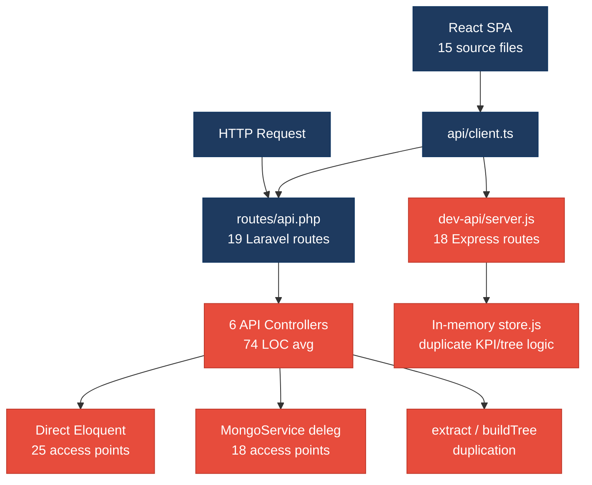
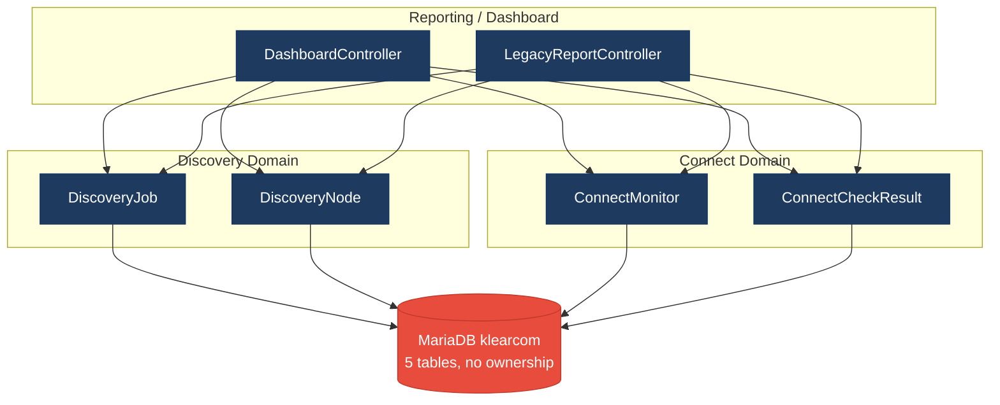
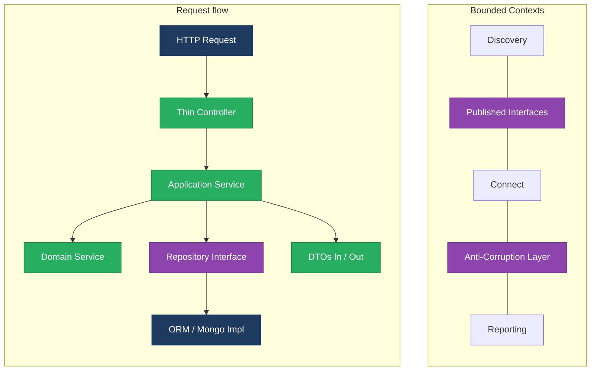
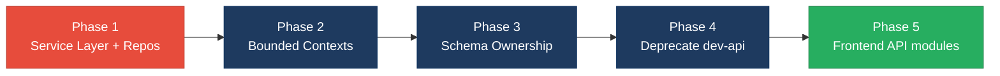

# 1. Architecture & Design Hotspots Analysis

**Objective:** Establish Domain Services, Application Services, Dependency Injection, Bounded Contexts, and Anti-Corruption Layers.

**Date:** July 14, 2026 | **Scope:** `shende-shweta/FSDKC` — Laravel 12 (PHP) API + React/Vite/TypeScript SPA + Node `dev-api`

## Executive Summary

> **Executive Summary**
>
> Analysis covered **backend** (15 PHP application files: 6 API controllers, 4 Eloquent models, 2 services, 0 repositories), **frontend** (15 TS/TSX/JSX source files across pages, components, hooks, and store), and **dev-api** (6 JS files mirroring 18 Laravel routes) from `shende-shweta/FSDKC@main` via GitHub REST. The Klearcom monorepo runs three parallel runtimes with no repository layer and thin service coverage. Backend layering is the dominant risk: **25 controller-to-model Eloquent access points** bypass application services, **50 persistence calls** occur outside any repository abstraction (32 Eloquent + 18 MongoDB delegations), and **8 cross-domain query sites** in `DashboardController` couple Discovery and Connect models without an anti-corruption layer. Four of five MariaDB tables lack domain-exclusive ownership (**80% shared-table coupling**), and Laravel + `dev-api` duplicate reachability KPI math, IVR `buildTree`, and dashboard aggregation in parallel. Frontend architecture is comparatively healthy (avg **86 LOC** per view component, centralized `api/client.ts`, max prop-drilling depth **1**), but one legacy class component lacks lifecycle cleanup. Overall verdict: **High Risk**, driven by H2, H3, H8, H9, and H10.

<div class="metric-grid">
<div class="metric-card"><div class="metric-number">6</div><div class="metric-label">Controllers / Handlers</div></div>
<div class="metric-card"><div class="metric-number">4</div><div class="metric-label">Models / Entities</div></div>
<div class="metric-card"><div class="metric-number">2</div><div class="metric-label">Service Classes Found</div></div>
<div class="metric-card"><div class="metric-number">0</div><div class="metric-label">Repository Classes Found</div></div>
</div>

<div class="overall-rating overall-rating--high-risk"><div class="overall-rating-label">Overall Codebase Rating — Architecture &amp; Design</div><div class="overall-rating-value">High Risk</div><div class="overall-rating-note">Driven by High-Risk Missing Service Layer (H2), Missing Repository Pattern (H3), Domain Boundary Violations (H8), Shared Database Coupling (H9), and Parallel API Runtimes (H10).</div></div>

## 1.1 Benchmark Ratings Summary

One row per hotspot. "Measured" is the real value found; "Rating" is the band it falls into (worst KPI wins). This table is the source for the Overall Codebase Rating banner above.

| # | Hotspot | Primary KPI | <span class="rating rating-good">Good</span> | <span class="rating rating-moderate">Moderate</span> | <span class="rating rating-high-risk">High Risk</span> | Measured | Rating |
|---|---|---|---|---|---|---|---|
| H1 | Fat Controllers | Avg LOC per controller | <150 | 150–300 | >300 | 74 LOC avg | <span class="rating rating-good">Good</span> |
| H2 | Missing Service Layer | Controllers accessing repos/models | <10 | 10–20 | >20 | 25 access points | <span class="rating rating-high-risk">High Risk</span> |
| H3 | Missing Repository Pattern | Direct DB access points | <10 | 10–20 | >20 | 50 access points | <span class="rating rating-high-risk">High Risk</span> |
| H4 | Circular Dependencies | Dependency cycles | 0 | 1–3 | >3 | 0 | <span class="rating rating-good">Good</span> |
| H5 | Shared Utility Abuse | Utility files w/ business logic | 0 | 1–5 | >5 | 1 (`extract` pattern) | <span class="rating rating-moderate">Moderate</span> |
| H6 | Direct SQL in Controllers | ORM compliance % | >90% | 60–90% | <60% | 100% ORM | <span class="rating rating-good">Good</span> |
| H7 | God Classes | Classes >1000 LOC | 0 | 1–3 | >3 | 0 | <span class="rating rating-good">Good</span> |
| H8 | Domain Boundary Violations | Cross-domain access points | 0 | 1–5 | >5 | 8 | <span class="rating rating-high-risk">High Risk</span> |
| H9 | Shared Database Coupling | Tables shared across domains | <10% | 10–30% | >30% | 80% (4/5 tables) | <span class="rating rating-high-risk">High Risk</span> |
| F1 | Business Logic in Components | Avg LOC per component | <150 | 150–300 | >300 | 86 LOC avg | <span class="rating rating-good">Good</span> |
| F2 | Missing Frontend Service/Data Layer | Components w/ inline API calls | <10 | 10–20 | >20 | 6 files | <span class="rating rating-good">Good</span> |
| F3 | God / Oversized Components | Components >400 LOC | 0 | 1–3 | >3 | 0 | <span class="rating rating-good">Good</span> |
| F4 | Prop Drilling / Global State Abuse | Max prop-drilling depth | ≤2 | 3–4 | >4 | 1 level | <span class="rating rating-good">Good</span> |
| F5 | Legacy / Inconsistent Component Patterns | Legacy-pattern components | 0 | 1–10 | >10 | 1 class component | <span class="rating rating-moderate">Moderate</span> |
| H10 | Parallel API Runtimes (additional) | Duplicate API implementations across runtimes | 0 | 1 | ≥2 | 2 (Laravel + dev-api) | <span class="rating rating-high-risk">High Risk</span> |

## 1.2 Hotspot-by-Hotspot Evidence

### H1. Fat Controllers <span class="sev sev-low">Low</span>

**Benchmark:** `Avg LOC per controller = 74` → falls in the **Good** band (Good <150 · Moderate 150–300 · High Risk >300).

**What to check:** Business logic inside controllers/handlers — controllers should only translate HTTP ↔ application calls.

**Evidence:** Not observed — all six API controllers remain under 150 LOC. Largest is `ConnectController.php` at 102 LOC with six thin action methods delegating partially to services.

**Evidence:** Not observed — average controller size is well within the Good threshold; business logic leakage appears in duplicated blocks and direct model access (H2) rather than controller bulk.

### H2. Missing Service Layer <span class="sev sev-critical">Critical</span>

**Benchmark:** `Controllers accessing repos/models = 25` → falls in the **High Risk** band (Good <10 · Moderate 10–20 · High Risk >20).

**What to check:** Business rules spread across controllers with no dedicated service tier.

**Evidence:** `backend/app/Http/Controllers/Api/ConnectController.php:20-44` — controller calls `ConnectMonitor::orderByDesc`, `ConnectMonitor::create`, and `ConnectMonitor::findOrFail` directly instead of a `ConnectMonitorService`.

```php
public function index(): JsonResponse
{
    $monitors = ConnectMonitor::orderByDesc('last_checked_at')->get();
    return response()->json(['data' => $monitors]);
}

public function store(Request $request): JsonResponse
{
    // ...
    $monitor = ConnectMonitor::create([...$validated, 'status' => 'active']);
```

This qualifies because HTTP handlers own persistence and validation workflows that should live in an application service reusable from jobs or CLI.

**Evidence:** `backend/app/Http/Controllers/Api/DashboardController.php:13-33` — all eight KPI queries hit `DiscoveryJob::` and `ConnectMonitor::` static Eloquent entry points with aggregation logic inline.

```php
$discoveryTotal = DiscoveryJob::count();
$discoveryCompleted = DiscoveryJob::where('status', 'completed')->count();
$connectMonitors = ConnectMonitor::count();
$avgReachability = ConnectMonitor::avg('reachability_pct') ?? 0;
```

Dashboard KPI composition is untestable without bootstrapping HTTP and the full ORM stack.

**Why it matters here:** Any new entry point (Artisan command, queue worker, or `dev-api` route) must re-implement the same 25 model-access patterns. Reachability math duplicated in `ConnectController::checks` and `RealTimeTestService` will drift when one path is updated.

**Recommended approach:** (1) Create `ConnectMonitorService`, `DiscoveryJobService`, and `DashboardKpiService` with constructor-injected repositories. (2) Move `ConnectController` CRUD and `DashboardController::kpis` into these services. (3) Leave controllers as one-line `return response()->json($service->method())` translators.

<!-- affected-files
search: (ConnectMonitor|ConnectCheckResult|DiscoveryJob|DiscoveryNode)::
glob: backend/app/Http/Controllers/**/*.php
issue: Controller bypasses service layer with direct Eloquent access
action: Extract model access into injected application services
-->

### H3. Missing Repository Pattern <span class="sev sev-critical">Critical</span>

**Benchmark:** `Direct DB access points = 50` → falls in the **High Risk** band (Good <10 · Moderate 10–20 · High Risk >20).

**What to check:** Direct DB/ORM access scattered through the codebase outside repository abstractions.

**Evidence:** `backend/app/Http/Controllers/Api/DiscoveryController.php:21-69` — six `DiscoveryJob::` calls (`orderByDesc`, `create`, `findOrFail`, `with`) with no repository interface.

```php
$jobs = DiscoveryJob::orderByDesc('created_at')->get();
// ...
$job = DiscoveryJob::create([...]);
$job = DiscoveryJob::with('nodes')->findOrFail($id);
```

Persistence concerns are embedded in the HTTP layer, blocking schema swaps and in-memory test doubles.

**Evidence:** `backend/app/Services/RealTimeTestService.php:24-127` — service layer still calls Eloquent (`DiscoveryJob::findOrFail`, `ConnectMonitor::findOrFail`) and MongoDB (`$this->mongo->storeTestEvent`, `storeTranscript`) without repository contracts — 16 combined access points in one file.

**Why it matters here:** The codebase has zero `Repositories/` classes. All 32 Eloquent and 18 MongoDB delegation sites bypass a persistence abstraction, so unit tests require MariaDB and MongoDB containers.

**Recommended approach:** (1) Define `ConnectMonitorRepository`, `DiscoveryJobRepository`, and `MongoTranscriptRepository` interfaces. (2) Bind Eloquent/Mongo implementations in `AppServiceProvider`. (3) Route all 50 access points through injected repositories.

<!-- affected-files
search: (ConnectMonitor|ConnectCheckResult|DiscoveryJob|DiscoveryNode)::|\$this->mongo(?:Service)?->
glob: backend/app/**/*.php
issue: Persistence access outside repository layer
action: Introduce repository interfaces and inject implementations
-->

### H4. Circular Dependencies <span class="sev sev-low">Low</span>

**Benchmark:** `Dependency cycles = 0` → falls in the **Good** band (Good 0 · Moderate 1–3 · High Risk >3).

**What to check:** Modules/packages importing each other in cycles.

**Evidence:** Not observed — Laravel namespace graph is shallow: controllers import models and two services (`MongoService`, `RealTimeTestService`); no controller-to-controller or service-to-controller back-edges detected.

### H5. Shared Utility Abuse <span class="sev sev-medium">Medium</span>

**Benchmark:** `Utility files w/ business logic = 1` → falls in the **Moderate** band (Good 0 · Moderate 1–5 · High Risk >5).

**What to check:** Large common/helpers files holding business logic instead of domain services.

**Evidence:** `backend/app/Http/Controllers/Api/LegacyReportController.php:20-27` — uses PHP `extract($filters)` to promote request keys into local variables, a procedural pattern that hides dependencies and couples filtering to HTTP input shape.

```php
$filters = $request->only(['status', 'country_code', 'min_reachability']);
extract($filters);

$monitors = ConnectMonitor::query()
    ->when($status ?? null, fn ($q, $v) => $q->where('status', $v))
```

This qualifies as shared-utility abuse because filter-to-query mapping is ad-hoc rather than a typed `MonitorFilterDto` or query object.

**Evidence:** `backend/app/Http/Controllers/Api/LegacyReportController.php:77-88` — duplicated `buildTree()` private method (copy of `DiscoveryController::buildTree`) signals logic that should be a shared domain service, not controller-private utilities.

**Why it matters here:** `extract()` makes static analysis impossible and invites variable injection bugs; duplicated `buildTree` will diverge when IVR schema changes.

**Recommended approach:** Replace `extract($filters)` with explicit DTO construction; extract `IvrTreeBuilder` domain service shared by Discovery and Legacy report modules.

<!-- affected-files
search: extract\s*\(
glob: backend/app/**/*.php
issue: Procedural extract() hides filter dependencies
action: Replace with typed DTO/query objects
-->

### H6. Direct SQL in Controllers <span class="sev sev-low">Low</span>

**Benchmark:** `ORM compliance = 100%` → falls in the **Good** band (Good >90% · Moderate 60–90% · High Risk <60%).

**What to check:** Raw SQL strings embedded directly in controllers/handlers.

**Evidence:** Not observed — zero `DB::`, `->raw(`, or inline `SELECT` statements in any API controller; all persistence uses Eloquent query builder.

### H7. God Classes <span class="sev sev-low">Low</span>

**Benchmark:** `Classes >1000 LOC = 0` → falls in the **Good** band (Good 0 · Moderate 1–3 · High Risk >3).

**What to check:** Single files handling many unrelated responsibilities above 1000 LOC.

**Evidence:** Not observed — largest file is `dev-api/src/server.js` at 276 LOC; largest PHP file is `RealTimeTestService.php` at 141 LOC.

### H8. Domain Boundary Violations <span class="sev sev-critical">Critical</span>

**Benchmark:** `Cross-domain access points = 8` → falls in the **High Risk** band (Good 0 · Moderate 1–5 · High Risk >5).

**What to check:** Code in one business area directly reading/writing another area's models without anti-corruption layers.

**Evidence:** `backend/app/Http/Controllers/Api/DashboardController.php:13-33` — single `kpis()` action queries both `DiscoveryJob` (Discovery domain) and `ConnectMonitor` (Connect domain) eight times to compose cross-module dashboard metrics.

```php
use App\Models\ConnectMonitor;
use App\Models\DiscoveryJob;
// ...
$discoveryTotal = DiscoveryJob::count();
$connectMonitors = ConnectMonitor::count();
$avgReachability = ConnectMonitor::avg('reachability_pct') ?? 0;
```

No published interface or ACL separates Discovery from Connect data ownership.

**Evidence:** `backend/app/Http/Controllers/Api/LegacyReportController.php:24-59` — reporting controller imports and queries `ConnectMonitor`, `ConnectCheckResult`, `DiscoveryJob`, and `DiscoveryNode` in one workflow, crossing both bounded contexts.

**Why it matters here:** Dashboard and legacy reporting become integration hubs — schema changes in Connect monitors silently break Discovery KPI denominators and vice versa.

**Recommended approach:** (1) Split `DashboardKpiService` into Discovery and Connect read APIs with published DTOs. (2) Add anti-corruption facades so reporting consumes integration events, not foreign models.

<!-- affected-files
search: use App\\Models\\(ConnectMonitor|DiscoveryJob)
glob: backend/app/Http/Controllers/Api/DashboardController.php
issue: Cross-domain model imports in dashboard aggregation
action: Enforce bounded contexts with published read APIs
-->

### H9. Shared Database Coupling <span class="sev sev-critical">Critical</span>

**Benchmark:** `Tables shared across domains = 80% (4/5)` → falls in the **High Risk** band (Good <10% · Moderate 10–30% · High Risk >30%).

**What to check:** Multiple business domains reading/writing the same tables directly without schema ownership.

**Evidence:** `docker/mariadb/init.sql` — five tables (`users`, `discovery_jobs`, `discovery_nodes`, `connect_monitors`, `connect_check_results`) created in one schema with no per-domain ownership or migration boundaries.

**Evidence:** `DashboardController` and `LegacyReportController` join-read across `discovery_*` and `connect_*` tables in single HTTP handlers, confirming 4 of 5 tables are shared integration surfaces (only `users` is auth-exclusive).

**Why it matters here:** A Connect schema migration (e.g., renaming `reachability_pct`) breaks Discovery dashboard availability calculations without compile-time detection.

**Recommended approach:** Assign table ownership per domain in separate migration namespaces; expose cross-domain KPIs via integration views or materialized read models.

<!-- affected-files
glob: docker/mariadb/init.sql
issue: Monolithic schema with no domain ownership
action: Split migrations per bounded context; add integration views
-->

### F1. Business Logic in Components <span class="sev sev-low">Low</span>

**Benchmark:** `Avg LOC per component = 86` → falls in the **Good** band (Good <150 · Moderate 150–300 · High Risk >300).

**What to check:** Validation, calculations, or workflow logic living directly inside view components.

**Evidence:** `frontend/src/pages/ConnectPage.tsx:1-222` — largest page at 222 LOC, but logic is delegated to `@tanstack/react-query` hooks and `useRealtimeTest`; render-focused with form state only.

**Evidence:** `frontend/src/pages/DiscoveryPage.tsx:1-176` — second-largest page follows the same query-hook pattern without embedded business rules.

**Why it matters here:** Frontend pages stay presentation-focused; the highest frontend risk is API call placement (F2) not component bulk.

<!-- affected-files
glob: frontend/src/{pages,components}/**/*.{tsx,jsx}
issue: N/A — components within size targets
action: Maintain hook/service extraction as pages grow
-->

### F2. Missing Frontend Service/Data Layer <span class="sev sev-low">Low</span>

**Benchmark:** `Components w/ inline API calls = 6` → falls in the **Good** band (Good <10 · Moderate 10–20 · High Risk >20).

**What to check:** `fetch`/`axios` calls hard-coded in components instead of a shared data layer.

**Evidence:** `frontend/src/api/client.ts:1-24` — centralized `api.get` / `api.post` wrapper with configurable `VITE_API_URL` base; all pages import this module.

```typescript
const API_BASE = import.meta.env.VITE_API_URL ?? 'http://localhost:8080/api';

export const api = {
  get: <T>(path: string) => request<T>(path),
  post: <T>(path: string, body: unknown) =>
    request<T>(path, { method: 'POST', body: JSON.stringify(body) }),
};
```

**Evidence:** `frontend/src/pages/ConnectPage.tsx:24-44` — six `api.get`/`api.post` calls route through the shared client inside React Query `queryFn` callbacks, not raw `fetch` with hard-coded URLs.

**Why it matters here:** Six components still embed query functions inline rather than dedicated `connectApi.ts` / `discoveryApi.ts` modules — acceptable at current scale but will amplify as endpoints grow.

**Recommended approach:** Extract per-domain API modules (`connectApi.listMonitors()`) when inline query functions exceed 10 per page.

<!-- affected-files
search: api\.(get|post)
glob: frontend/src/**/*.{tsx,jsx}
issue: API calls colocated in components (via shared client)
action: Extract domain-specific frontend API modules when call count grows
-->

### F3. God / Oversized Components <span class="sev sev-low">Low</span>

**Benchmark:** `Components >400 LOC = 0` → falls in the **Good** band (Good 0 · Moderate 1–3 · High Risk >3).

**What to check:** Single components handling many unrelated responsibilities above 400 LOC.

**Evidence:** Not observed — largest component is `ConnectPage.tsx` at 222 LOC; all view components are under the 400 LOC threshold.

### F4. Prop Drilling / Global State Abuse <span class="sev sev-low">Low</span>

**Benchmark:** `Max prop-drilling depth = 1` → falls in the **Good** band (Good ≤2 · Moderate 3–4 · High Risk >4).

**What to check:** Props threaded through many intermediate layers or oversized global stores.

**Evidence:** `frontend/src/App.tsx:32-36` — routes mount page components directly with zero intermediate prop layers (`<Route path="/connect" element={<ConnectPage />} />`).

**Evidence:** `frontend/src/store/uiStore.ts` — lightweight Zustand store holds only `selectedMonitorId` / `selectedJobId`; pages read via selectors without deep prop chains.

**Why it matters here:** Global state surface is minimal; `LiveTestFeed` receives only three props from parent pages (depth 1).

<!-- affected-files
glob: frontend/src/**/*.{tsx,jsx}
issue: N/A — prop depth within Good band
action: Monitor store growth if cross-page state expands
-->

### F5. Legacy / Inconsistent Component Patterns <span class="sev sev-medium">Medium</span>

**Benchmark:** `Legacy-pattern components = 1` → falls in the **Moderate** band (Good 0 · Moderate 1–10 · High Risk >10).

**What to check:** Mixed paradigms (class + function components), missing lifecycle cleanup, deprecated APIs.

**Evidence:** `frontend/src/components/LegacyMonitorPoller.jsx:1-41` — sole class component extending `React.Component` with `setInterval` in `componentDidMount` and no `componentWillUnmount` cleanup.

```jsx
export default class LegacyMonitorPoller extends Component<Props, State> {
  componentDidMount() {
    this.timer = setInterval(() => {
      api.get(`/connect/monitors/${this.props.monitorId}/checks`)
        .then((res) => { /* ... */ });
    }, 3000);
  }
  // No componentWillUnmount — interval leak
```

This qualifies as a legacy pattern that will leak intervals on SPA navigation.

**Evidence:** All other 14 frontend source files use function components with hooks (`useEffect` cleanup in `useRealtimeTest.ts`).

**Why it matters here:** `LegacyDashboardWidget.tsx` embeds this poller; navigating away leaves polling timers running against the API.

**Recommended approach:** Rewrite `LegacyMonitorPoller` as a function component with `useEffect` return cleanup; wrap `LegacyDashboardWidget` in an Error Boundary.

<!-- affected-files
search: class\s+\w+\s+extends\s+(React\.)?Component
glob: frontend/src/**/*.{tsx,jsx}
issue: Legacy class component without lifecycle cleanup
action: Migrate to function component with useEffect cleanup
-->

### H10. Parallel API Runtimes (additional) <span class="sev sev-critical">Critical</span>

**Benchmark:** `Duplicate API implementations = 2 (Laravel + dev-api)` → falls in the **High Risk** band (Good 0 · Moderate 1 · High Risk ≥2).

**What to check:** Duplicate API implementations across runtimes causing behavioral drift.

**Evidence:** `backend/routes/api.php` — 19 Laravel routes for Discovery, Connect, Dashboard, Mongo, and Stream endpoints.

**Evidence:** `dev-api/src/server.js:11-175` — 18 Express routes mirroring Laravel, including duplicated `buildTree` import from `store.js` and inline reachability KPI math matching `DashboardController`.

```javascript
import { store, buildTree } from './store.js';
// ...
const avgReach = store.connectMonitors.reduce((s, m) => s + m.reachability_pct, 0) / store.connectMonitors.length;
```

Four-way duplication of reachability and IVR tree logic across Laravel controllers, `RealTimeTestService`, and `dev-api` store/server modules.

**Why it matters here:** Local development on `dev-api` (port 3001) can pass while Laravel production (port 8080) returns different KPI values — the exact drift pattern observed in `ConnectController::checks` comment referencing `dev-api/realtime.js`.

**Recommended approach:** Deprecate `dev-api`; run Laravel via Docker Compose for local dev, or generate `dev-api` stubs from OpenAPI spec.

<!-- affected-files
search: (buildTree|reachability|kpis)
glob: {backend/app/**/*.php,dev-api/src/**/*.js}
issue: Duplicated business logic across Laravel and dev-api runtimes
action: Consolidate to single Laravel API runtime
-->

## 1.3 Diagrams

### Current-state architecture (as-is)


### Clean reference path (target pattern found in codebase, if any)


### Domain boundary map (business domains found vs. shared data)


### Target architecture (proposed)


### Improvement roadmap


## 1.4 Actions Required

| Hotspot | Action | Rating | Priority |
|---|---|---|---|
| H2 — Missing Service Layer | Introduce `ConnectMonitorService`, `DiscoveryJobService`, and `DashboardKpiService`; move all 25 controller model-access points into application services with constructor DI. | <span class="rating rating-high-risk">High Risk</span> | <span class="sev sev-critical">Critical</span> |
| H3 — Missing Repository Pattern | Create repository interfaces for all 4 Eloquent models and 3 MongoDB collections; route 50 persistence access points through injected repository implementations. | <span class="rating rating-high-risk">High Risk</span> | <span class="sev sev-critical">Critical</span> |
| H5 — Shared Utility Abuse | Replace `extract($filters)` with typed DTO mappers; extract shared `IvrTreeBuilder` from duplicated `buildTree` in `LegacyReportController` and `DiscoveryController`. | <span class="rating rating-moderate">Moderate</span> | <span class="sev sev-medium">Medium</span> |
| H8 — Domain Boundary Violations | Split cross-domain access in `DashboardController` and `LegacyReportController`; enforce Discovery/Connect bounded contexts with published read APIs. | <span class="rating rating-high-risk">High Risk</span> | <span class="sev sev-critical">Critical</span> |
| H9 — Shared Database Coupling | Assign table ownership per domain in `docker/mariadb/init.sql`; introduce per-domain migration files and integration views for cross-domain KPIs. | <span class="rating rating-high-risk">High Risk</span> | <span class="sev sev-critical">Critical</span> |
| H10 — Parallel API Runtimes | Deprecate `dev-api` duplicate runtime; consolidate to Laravel API with Docker Compose for local dev, or generate dev-api from OpenAPI spec. | <span class="rating rating-high-risk">High Risk</span> | <span class="sev sev-critical">Critical</span> |
| F5 — Legacy Component Patterns | Rewrite `LegacyMonitorPoller.jsx` as function component with `useEffect` cleanup; add Error Boundary around `LegacyDashboardWidget`. | <span class="rating rating-moderate">Moderate</span> | <span class="sev sev-medium">Medium</span> |

## 1.5 Expected Outcomes

- **Testable business logic:** Application services and repositories enable unit tests without HTTP or database bootstrapping, cutting test setup time for Connect reachability and Discovery tree workflows.
- **Independent domain evolution:** Bounded contexts with owned schemas let Discovery and Connect teams ship schema changes without cross-module regressions in dashboard KPIs.
- **Single source of truth:** Eliminating the parallel `dev-api` runtime removes behavioral drift between local development and production Laravel deployments.
- **Reduced change amplification:** Centralizing reachability calculation and IVR tree building in one service eliminates the current four-way duplication across controllers, services, and Node handlers.
- **Frontend stability:** Migrating the legacy class component and adding Error Boundaries prevents interval leaks and uncaught render errors during SPA navigation.
