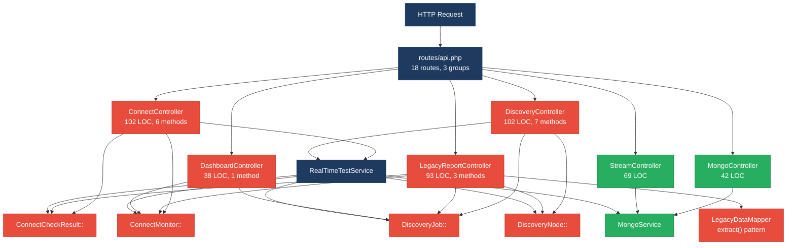
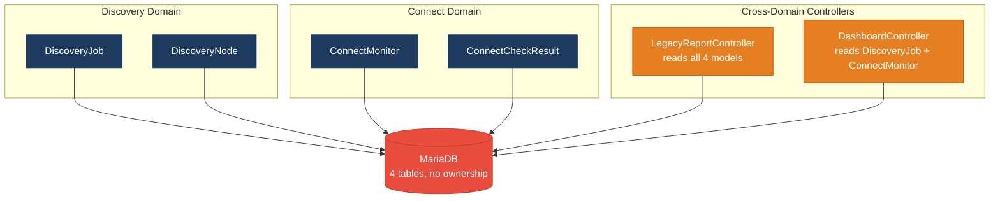
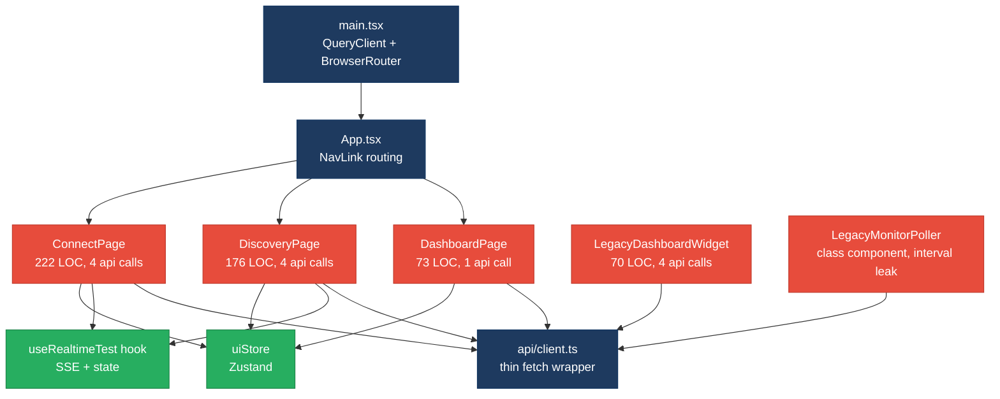
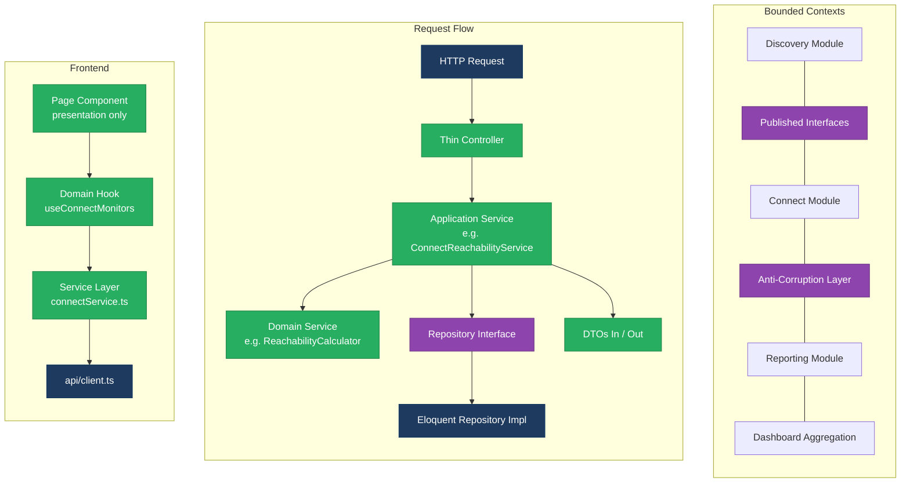
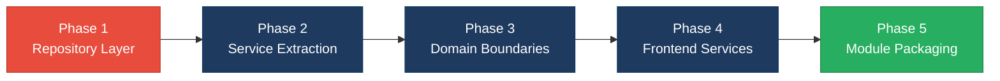

# 1. Architecture & Design Hotspots Analysis

**Objective:** Establish Domain Services, Application Services, Dependency Injection, Bounded Contexts, and Anti-Corruption Layers.

**Date:** 2026-08-18 17:26:15 IST | **Scope:** `shende-shweta/FSDKC` — PHP 8.3 / Laravel 12 (backend), React 19 / TypeScript / Vite / Zustand / TanStack Query (frontend), Node.js / Express (dev-api)

## Executive Summary

> **Executive Summary**
>
> The Klearcom platform is a monorepo with a Laravel 12 backend (6 API controllers, 4 Eloquent models, 2 services), a React 19 SPA frontend (4 page components, 4 shared components, 1 custom hook, 1 Zustand store), and a Node/Express dev-API (6 source files). Backend controllers are lean on average (74 LOC) but 4 of 6 access Eloquent models directly — there is no repository layer, and business logic (reachability calculations, tree building) is duplicated across controllers and services in 3 independent locations. The `LegacyReportController` crosses both Discovery and Connect domain boundaries, reading all four models, while `DashboardController` does the same for aggregation. The `LegacyDataMapper` uses PHP `extract()` — a dynamic-variable anti-pattern that creates implicit coupling. On the frontend, all 4 page components and 1 legacy class component make direct `api.*` calls with no service/data-access abstraction layer; the `LegacyMonitorPoller` is a class component with an interval memory leak. The two most urgent risks are (1) the missing repository pattern which scatters ORM access across 32 call sites, and (2) the cross-domain coupling in `LegacyReportController` and `DashboardController` that prevents independent evolution of Discovery and Connect modules. Layers covered: backend (26 PHP files), frontend (15 TS/TSX/JSX files), dev-api (6 JS files).

<div class="metric-grid">
<div class="metric-card"><div class="metric-number">6</div><div class="metric-label">Controllers / Handlers</div></div>
<div class="metric-card"><div class="metric-number">4</div><div class="metric-label">Models / Entities</div></div>
<div class="metric-card"><div class="metric-number">2</div><div class="metric-label">Service Classes Found</div></div>
<div class="metric-card"><div class="metric-number">0</div><div class="metric-label">Repository Classes Found</div></div>
</div>

<div class="overall-rating overall-rating--moderate"><div class="overall-rating-label">Overall Codebase Rating — Architecture &amp; Design</div><div class="overall-rating-value">Moderate</div><div class="overall-rating-note">Driven by High-Risk Missing Repository Pattern (H3) and Moderate-rated Missing Service Layer (H2), Domain Boundary Violations (H8), and Shared Database Coupling (H9).</div></div>

## 1.1 Benchmark Ratings Summary

| # | Hotspot | Primary KPI | <span class="rating rating-good">Good</span> | <span class="rating rating-moderate">Moderate</span> | <span class="rating rating-high-risk">High Risk</span> | Measured | Rating |
|---|---|---|---|---|---|---|---|
| H1 | Fat Controllers | Avg LOC per controller | <150 | 150–300 | >300 | 74 LOC avg (max 102) | <span class="rating rating-good">Good</span> |
| H2 | Missing Service Layer | Controllers accessing repos/models | <15 | 15–30 | >30 | 25 direct model calls in controllers | <span class="rating rating-moderate">Moderate</span> |
| H3 | Missing Repository Pattern | Direct DB access points outside repos | <15 | 15–30 | >30 | 32 (25 controllers + 7 services) | <span class="rating rating-high-risk">High Risk</span> |
| H4 | Circular Dependencies | Dependency cycles | 0 | 1–3 | >3 | 0 | <span class="rating rating-good">Good</span> |
| H5 | Shared Utility Abuse | Utility files w/ business logic | 0 | 1–5 | >5 | 1 (LegacyDataMapper) | <span class="rating rating-moderate">Moderate</span> |
| H6 | Direct SQL in Controllers | ORM compliance % | >90% | 60–90% | <60% | 100% (all Eloquent, no raw SQL) | <span class="rating rating-good">Good</span> |
| H7 | God Classes | Largest class/file LOC | <500 | 500–600 | >600 | 276 LOC (dev-api server.js); 222 LOC (ConnectPage.tsx); 165 LOC (MongoService.php) | <span class="rating rating-good">Good</span> |
| H8 | Domain Boundary Violations | Cross-domain access points | 0 | 1–5 | >5 | 4 (LegacyReportController: 4 cross-domain models; DashboardController: 2) | <span class="rating rating-moderate">Moderate</span> |
| H9 | Shared Database Coupling | Tables shared across domains | <30% | 30–40% | >40% | ~33% — 2 of 4 models queried by cross-domain controllers | <span class="rating rating-moderate">Moderate</span> |
| H10 | Duplicated Business Logic (additional) | Independent copies of same algorithm | 0 | 1–2 | >2 | 3 copies of reachability formula + 3 copies of buildTree | <span class="rating rating-moderate">Moderate</span> |
| H11 | Missing Frontend Service Layer (additional) | Page components with direct API calls | 0 | 1–3 | >3 | 5 components with 14 total direct api.* calls | <span class="rating rating-moderate">Moderate</span> |

## 1.2 Hotspot-by-Hotspot Evidence

### H2. Missing Service Layer <span class="sev sev-medium">Medium</span>

**Benchmark:** `Controllers accessing repos/models = 25` → falls in the **Moderate** band (Good <15 · Moderate 15–30 · High Risk >30).

**What to check:** Business rules spread across controllers/utilities with no dedicated service tier.

**Evidence:**

**Example 1 — `backend/app/Http/Controllers/Api/ConnectController.php:64-82`:** The `checks()` method contains reachability calculation logic (fetching recent checks, computing success rate, deriving status) directly in the controller rather than delegating to a service.

```php
$recentChecks = ConnectCheckResult::where('connect_monitor_id', $id)
    ->orderByDesc('checked_at')
    ->limit(20)
    ->get();

$successRate = $recentChecks->count() > 0
    ? ($recentChecks->where('reachable', true)->count() / $recentChecks->count()) * 100
    : 100;

$computedStatus = $successRate < 90 ? 'alert' : 'active';
```

**Example 2 — `backend/app/Http/Controllers/Api/DashboardController.php:14-35`:** The entire `kpis()` method is a series of 8 direct Eloquent model calls aggregating data across Discovery and Connect domains with no service intermediary.

```php
$discoveryTotal = DiscoveryJob::count();
$discoveryCompleted = DiscoveryJob::where('status', 'completed')->count();
$connectMonitors = ConnectMonitor::count();
$avgReachability = ConnectMonitor::avg('reachability_pct') ?? 0;
$alerts = ConnectMonitor::where('status', 'alert')->count();
```

**Example 3 — `backend/app/Http/Controllers/Api/LegacyReportController.php:20-53`:** The `carrierSummary()` method queries `ConnectMonitor`, iterates results, queries `ConnectCheckResult` per monitor, computes reachability, and maps data through `LegacyDataMapper` — all business logic in the controller.

```php
foreach ($monitors as $monitor) {
    $recent = ConnectCheckResult::where('connect_monitor_id', $monitor->id)
        ->orderByDesc('checked_at')
        ->limit(20)
        ->get();
    $successRate = $recent->count() > 0
        ? ($recent->where('reachable', true)->count() / $recent->count()) * 100
        : 100;
```

4 of 6 controllers (`ConnectController`, `DashboardController`, `DiscoveryController`, `LegacyReportController`) access models directly. Only `MongoController` and `StreamController` delegate fully to services.

**Why it matters here:** The reachability calculation formula is the core business rule for the Connect module, yet it lives in 3 independent locations (ConnectController:64, LegacyReportController:39, RealTimeTestService:118). A change to the threshold logic (e.g. switching from a 20-check window to a 50-check window, or changing the 90% alert threshold) requires edits in 3 files across 2 layers — any miss creates silently divergent behavior between the API, reports, and real-time tests.

**Recommended approach:**
1. Create a `ConnectReachabilityService` encapsulating the reachability formula, check-window size, and status derivation.
2. Create a `DiscoveryTreeService` to own `buildTree()` logic (currently duplicated in `DiscoveryController:87` and `LegacyReportController:78`).
3. Create a `DashboardKpiService` to aggregate cross-domain KPI queries, replacing the 8 inline model calls in `DashboardController`.
4. Inject these services via constructor DI (already used for `MongoService`/`RealTimeTestService`).

<!-- affected-files
search: (ConnectMonitor|ConnectCheckResult|DiscoveryJob|DiscoveryNode)::
glob: backend/app/Http/Controllers/**/*.php
issue: Business logic in controller
action: Extract to dedicated service class
-->

### H3. Missing Repository Pattern <span class="sev sev-high">High</span>

**Benchmark:** `Direct DB access points outside repositories = 32` → falls in the **High Risk** band (Good <15 · Moderate 15–30 · High Risk >30).

**What to check:** Direct DB/ORM access scattered through the codebase with no repository abstraction.

**Evidence:**

**Example 1 — `backend/app/Http/Controllers/Api/ConnectController.php:22`:** Direct Eloquent static calls throughout the controller instead of through a repository interface.

```php
$monitors = ConnectMonitor::orderByDesc('last_checked_at')->get();
```

**Example 2 — `backend/app/Services/RealTimeTestService.php:27-28`:** Even the service layer uses direct Eloquent statics rather than injecting a repository.

```php
$job = DiscoveryJob::findOrFail($jobId);
$job->update(['status' => 'running', 'started_at' => now()]);
```

**Example 3 — `backend/app/Http/Controllers/Api/LegacyReportController.php:24-30`:** The controller builds complex filtered queries with `->when()` clauses directly on the model.

```php
$monitors = ConnectMonitor::query()
    ->when(isset($country_code), fn ($q) => $q->where('country_code', $country_code))
    ->when(isset($carrier), fn ($q) => $q->where('carrier', $carrier))
    ->orderByDesc('reachability_pct')
    ->get();
```

There are 0 repository classes in the codebase. All 32 Eloquent access points (25 in controllers, 7 in services) use static model calls directly. This makes it impossible to swap persistence or to test business logic without a database.

**Why it matters here:** The platform already uses two datastores (MariaDB via Eloquent + MongoDB via `MongoService`). MongoService is properly abstracted behind an injectable class, but the relational side has no equivalent — every controller and service is tightly coupled to Eloquent statics. Adding a new datastore, introducing caching, or writing unit tests for controllers without a database connection requires refactoring every call site.

**Recommended approach:**
1. Introduce `ConnectMonitorRepository` and `DiscoveryJobRepository` interfaces under `backend/app/Repositories/`.
2. Implement Eloquent-backed concrete repositories (e.g. `EloquentConnectMonitorRepository`).
3. Bind interfaces to implementations in `AppServiceProvider` (which is currently empty).
4. Replace all direct `Model::` calls in controllers and services with injected repository methods.

<!-- affected-files
search: (ConnectMonitor|ConnectCheckResult|DiscoveryJob|DiscoveryNode)::
glob: backend/app/**/*.php
issue: Direct ORM access without repository
action: Move to repository pattern
-->

### H5. Shared Utility Abuse <span class="sev sev-medium">Medium</span>

**Benchmark:** `Utility files with business logic = 1` → falls in the **Moderate** band (Good 0 · Moderate 1–5 · High Risk >5).

**What to check:** Large "common"/"helpers"/"utils" files holding business logic.

**Evidence:**

**Example 1 — `backend/app/Legacy/LegacyDataMapper.php:10-19`:** Uses PHP `extract()` to create dynamic variables from an array, then references them by implicit name. The `EXTR_SKIP` flag in `mapReportRow` provides partial protection, but `mapJobContext` at line 24 uses bare `extract($context)` with no flag — any key in `$context` can overwrite local variables.

```php
public function mapReportRow(array $row): array
{
    extract($row, EXTR_SKIP);

    return [
        'label' => $name ?? 'Unknown',
        'metric' => $reachability_pct ?? 0,
        'region' => $country_code ?? 'N/A',
        'source' => 'legacy_extract_mapper',
    ];
}
```

**Example 2 — `backend/app/Http/Controllers/Api/LegacyReportController.php:22`:** The controller also uses `extract($filters)` directly on unvalidated request input, creating dynamic variables from user-supplied data.

```php
$filters = $request->all();
extract($filters);
```

**Why it matters here:** `extract()` on request input is a well-known PHP anti-pattern that creates implicit variable bindings — any new query parameter silently becomes a local variable, potentially shadowing controller state. The `LegacyDataMapper` itself holds report-mapping business logic (label formatting, metric rounding) that should live in a domain-specific service, not a generic legacy utility.

**Recommended approach:**
1. Replace `extract($filters)` in `LegacyReportController:22` with explicit `$request->input('country_code')` / `$request->input('carrier')`.
2. Replace `extract()` in `LegacyDataMapper` with explicit array access (`$row['name'] ?? 'Unknown'`).
3. Move report-row mapping logic into a `ReportFormatterService` or into the proposed `ConnectReachabilityService`.

<!-- affected-files
search: extract\(
glob: backend/app/**/*.php
issue: Dynamic variable creation via extract()
action: Replace with explicit array access
-->

### H8. Domain Boundary Violations <span class="sev sev-medium">Medium</span>

**Benchmark:** `Cross-domain access points = 4` → falls in the **Moderate** band (Good 0 · Moderate 1–5 · High Risk >5).

**What to check:** Code in one business area directly reading/writing another area's data or models.

**Evidence:**

**Example 1 — `backend/app/Http/Controllers/Api/LegacyReportController.php:7-10`:** Imports all four models from both Discovery and Connect domains.

```php
use App\Models\ConnectCheckResult;
use App\Models\ConnectMonitor;
use App\Models\DiscoveryJob;
use App\Models\DiscoveryNode;
```

The `carrierSummary()` method reads Connect models, while `ivrDepthReport()` reads Discovery models — a single controller spanning two distinct business domains.

**Example 2 — `backend/app/Http/Controllers/Api/DashboardController.php:6-7,14-18`:** Directly queries both `DiscoveryJob` and `ConnectMonitor` models for KPI aggregation, bypassing any domain service boundary.

```php
use App\Models\ConnectMonitor;
use App\Models\DiscoveryJob;
// ...
$discoveryTotal = DiscoveryJob::count();
$connectMonitors = ConnectMonitor::count();
$avgReachability = ConnectMonitor::avg('reachability_pct') ?? 0;
```

The codebase has a nascent module structure (`backend/app/Modules/Connect/`, `backend/app/Modules/Discovery/`) with `AGENTS.md` files, but no actual code lives there — all models, controllers, and services sit in the flat `App\` namespace.

**Why it matters here:** Discovery and Connect are two conceptually independent products (IVR mapping vs. TFN reachability). As each grows (e.g. new Discovery languages, new Connect carrier integrations), having `LegacyReportController` reach into both domains means a schema change in either domain can break reports for the other. The empty `Modules/` directories suggest an intention to modularize that was never completed.

**Recommended approach:**
1. Split `LegacyReportController` into `ConnectReportController` (carrier summary) and `DiscoveryReportController` (IVR depth report).
2. Create domain-scoped services (`ConnectKpiService`, `DiscoveryKpiService`) that expose read-only query interfaces for cross-domain consumers like `DashboardController`.
3. Move models, services, and controllers into the existing `Modules/Connect/` and `Modules/Discovery/` directories to enforce namespace boundaries.

<!-- affected-files
search: use App\\Models\\(Connect|Discovery)
glob: backend/app/Http/Controllers/**/*.php
issue: Cross-domain model access
action: Route through domain service interfaces
-->

### H9. Shared Database Coupling <span class="sev sev-medium">Medium</span>

**Benchmark:** `Tables shared across domains = ~33%` → falls in the **Moderate** band (Good <30% · Moderate 30–40% · High Risk >40%).

**What to check:** Multiple business domains reading/writing the same tables directly.

**Evidence:**

**Example 1 — `backend/app/Http/Controllers/Api/DashboardController.php:14-18` and `backend/app/Http/Controllers/Api/LegacyReportController.php:24-34`:** Both the Dashboard and Legacy Report controllers directly query the `connect_monitors` and `discovery_jobs` tables via Eloquent. These tables are "owned" by their respective domains (Connect and Discovery), but there is no access boundary — any controller can query any table.

```php
// DashboardController — reads Connect-owned table
$avgReachability = ConnectMonitor::avg('reachability_pct') ?? 0;
// LegacyReportController — reads Connect-owned table
$monitors = ConnectMonitor::query()->when(isset($country_code), ...)->get();
```

**Example 2 — `backend/app/Services/RealTimeTestService.php:27-78` and `backend/app/Services/RealTimeTestService.php:93-141`:** A single service writes to both Discovery tables (`discovery_jobs`, `discovery_nodes`) and Connect tables (`connect_monitors`, `connect_check_results`), with both code paths in the same class.

Of the 4 relational tables (`discovery_jobs`, `discovery_nodes`, `connect_monitors`, `connect_check_results`), 2 are accessed by controllers/services outside their domain — a 33% cross-domain share rate.

**Why it matters here:** A schema migration on `connect_monitors` (e.g. renaming `reachability_pct` to `reach_pct`) would break `DashboardController`, `LegacyReportController`, `RealTimeTestService`, and potentially the dev-api `store.js` — 4 files across 3 layers, none of which "own" the table.

**Recommended approach:**
1. Define table ownership: `connect_monitors` and `connect_check_results` are owned by the Connect domain; `discovery_jobs` and `discovery_nodes` by Discovery.
2. Cross-domain reads should go through a published interface (e.g. `ConnectKpiService::getAverageReachability()`) rather than direct Eloquent queries.
3. Split `RealTimeTestService` into `DiscoveryTestRunner` and `ConnectTestRunner`, each operating only on its domain's tables.

<!-- affected-files
search: (ConnectMonitor|ConnectCheckResult|DiscoveryJob|DiscoveryNode)::
glob: backend/app/**/*.php
issue: Cross-domain table access
action: Define table ownership and expose read APIs
-->

### H10. Duplicated Business Logic (additional) <span class="sev sev-high">High</span>

**Benchmark:** `Independent copies of same algorithm = 2 distinct algorithms (reachability: 3 copies, buildTree: 3 copies)` → falls in the **Moderate** band for a custom KPI (Good 0 · Moderate 1–2 distinct algorithms duplicated · High Risk >2).

**What to check:** The same business algorithm implemented independently in multiple locations, risking drift.

**Evidence:**

**Example 1 — Reachability formula duplicated 3 times:**

`backend/app/Http/Controllers/Api/ConnectController.php:68-75`:
```php
$recentChecks = ConnectCheckResult::where('connect_monitor_id', $id)
    ->orderByDesc('checked_at')->limit(20)->get();
$successRate = $recentChecks->count() > 0
    ? ($recentChecks->where('reachable', true)->count() / $recentChecks->count()) * 100
    : 100;
```

`backend/app/Http/Controllers/Api/LegacyReportController.php:34-41`:
```php
$recent = ConnectCheckResult::where('connect_monitor_id', $monitor->id)
    ->orderByDesc('checked_at')->limit(20)->get();
$successRate = $recent->count() > 0
    ? ($recent->where('reachable', true)->count() / $recent->count()) * 100
    : 100;
```

`backend/app/Services/RealTimeTestService.php:116-118`:
```php
$recent = ConnectCheckResult::where('connect_monitor_id', $monitorId)->orderByDesc('checked_at')->limit(20)->get();
$rate = $recent->count() > 0 ? ($recent->where('reachable', true)->count() / $recent->count()) * 100 : 100;
```

Additionally, `dev-api/src/realtime.js:124-127` has a fourth JavaScript copy of the same formula.

**Example 2 — `buildTree()` duplicated 3 times:**

`backend/app/Http/Controllers/Api/DiscoveryController.php:87-99` and `backend/app/Http/Controllers/Api/LegacyReportController.php:78-93` contain identical PHP implementations. `dev-api/src/store.js:64-75` has a JavaScript copy.

**Why it matters here:** The reachability formula is the most critical business metric in the Connect module — it determines the `alert` status that surfaces on the dashboard. If one copy changes (e.g. switching from limit(20) to limit(50)) and the others don't, the platform will show different reachability numbers depending on which endpoint the user hits — an observable data integrity bug.

**Recommended approach:**
1. Consolidate the reachability formula into `ConnectReachabilityService::computeRate(int $monitorId): float`.
2. Consolidate `buildTree()` into `DiscoveryTreeService::build(Collection $nodes): array`.
3. Have all consumers (controllers, services, dev-api) call the single canonical implementation.

<!-- affected-files
search: reachable.*true.*count|function buildTree
glob: backend/app/**/*.php
issue: Duplicated business algorithm
action: Consolidate into single service method
-->

### H11. Missing Frontend Service Layer (additional) <span class="sev sev-medium">Medium</span>

**Benchmark:** `Page components with direct API calls = 5` → falls in the **Moderate** band for a custom KPI (Good 0 · Moderate 1–3 · High Risk >3). With 5 components exceeding the threshold, this rates **Moderate**.

**What to check:** Frontend page components making direct API calls instead of going through a service/data-access layer.

**Evidence:**

**Example 1 — `frontend/src/pages/ConnectPage.tsx:30-48`:** The page component contains 4 direct `api.get`/`api.post` calls inline in `useQuery`/`useMutation` hooks, constructing URL paths and parsing responses directly.

```typescript
const monitorsQuery = useQuery({
  queryKey: ['connect', 'monitors'],
  queryFn: () => api.get<{ data: ConnectMonitor[] }>('/connect/monitors'),
  refetchInterval: isRunning ? 2000 : false,
});
```

**Example 2 — `frontend/src/pages/LegacyDashboardWidget.tsx:25-37`:** A page-level component with raw `Promise.all` fetching 3 endpoints, duplicating the same fetch patterns found in `DashboardPage`, `DiscoveryPage`, and `ConnectPage`.

```typescript
Promise.all([
  api.get<DashboardKpis>('/dashboard/kpis'),
  api.get<{ data: DiscoveryJob[] }>('/discovery/jobs'),
  api.get<{ data: ConnectMonitor[] }>('/connect/monitors'),
])
```

**Example 3 — `frontend/src/components/LegacyMonitorPoller.jsx:24-30`:** A class component that polls an API endpoint with `setInterval` but has no `componentWillUnmount` cleanup — an interval/memory leak.

```jsx
componentDidMount() {
  this.intervalId = setInterval(() => {
    api.get<{ computed?: { reachability_pct: number } }>(
      `/connect/monitors/${this.props.monitorId}/checks`
    )
      .then((res) => { /* ... */ })
      .catch((err: Error) => this.setState({ error: err.message }));
  }, 3000);
  // Intentionally no componentWillUnmount — interval leak
}
```

All 4 page components (`ConnectPage`, `DiscoveryPage`, `DashboardPage`, `LegacyDashboardWidget`) and 1 shared component (`LegacyMonitorPoller`) make direct `api.*` calls. There are 14 total direct API call sites across these files. The `frontend/src/api/client.ts` provides only a thin `fetch` wrapper — there is no service layer (e.g. `connectService.getMonitors()`) to encapsulate endpoint paths, response parsing, or shared query configuration.

**Why it matters here:** Adding a new API version or changing an endpoint path (e.g. `/connect/monitors` → `/v2/connect/monitors`) requires updating every page component that constructs that URL. The `LegacyDashboardWidget` already duplicates the same 3 queries that `DashboardPage`, `DiscoveryPage`, and `ConnectPage` make individually. The `useRealtimeTest` hook is a good pattern (SSE logic in a reusable hook), but data-fetching doesn't follow the same discipline.

**Recommended approach:**
1. Create `frontend/src/services/connectService.ts` and `discoveryService.ts` that encapsulate endpoint URLs and response types.
2. Create custom hooks per domain (e.g. `useConnectMonitors()`, `useDiscoveryJobs()`) that wrap `useQuery` with the service calls, reducing page components to pure presentation.
3. Convert `LegacyMonitorPoller` from a class component to a functional component using `useEffect` cleanup, or replace it with the existing `useRealtimeTest` hook pattern.
4. Delete `LegacyDashboardWidget` or refactor it to compose the domain-specific hooks.

<!-- affected-files
search: api\.(get|post)
glob: frontend/src/pages/**/*.tsx
issue: Direct API calls in page components
action: Extract to frontend service layer
-->

<!-- affected-files
search: api\.(get|post)
glob: frontend/src/components/**/*.jsx
issue: Direct API calls in legacy component
action: Convert to hook with cleanup
-->

**Not observed (rated Good):** H1 (controllers average 74 LOC, max 102 — well under 150 threshold), H4 (no circular dependency cycles — controllers import services, services import models, no reverse flows), H6 (100% Eloquent ORM — no raw SQL strings found in any controller or service), H7 (largest PHP class is MongoService at 165 LOC; largest frontend file is ConnectPage at 222 LOC — all under 500).

**No additional hotspots beyond H10 and H11 were observed.**

## 1.3 Diagrams

### Current-state architecture (as-is)



### Clean reference path (target pattern found in codebase)


The `MongoController` → `MongoService` path is the only fully clean pattern in the codebase: the controller has zero business logic, injects a service via constructor DI, and delegates entirely.

### Domain boundary map (business domains found vs. shared data)



### Frontend architecture (as-is)



### Target architecture (proposed)



### Improvement roadmap



## 1.4 Actions Required

| Hotspot | Action | Rating | Priority |
|---|---|---|---|
| H3. Missing Repository Pattern | Introduce `ConnectMonitorRepository` and `DiscoveryJobRepository` interfaces with Eloquent implementations; bind in `AppServiceProvider`; replace all 32 direct `Model::` calls | <span class="rating rating-high-risk">High Risk</span> | <span class="sev sev-high">High</span> |
| H2. Missing Service Layer | Create `ConnectReachabilityService`, `DiscoveryTreeService`, `DashboardKpiService`; move business logic out of 4 controllers | <span class="rating rating-moderate">Moderate</span> | <span class="sev sev-high">High</span> |
| H10. Duplicated Business Logic | Consolidate 3 copies of reachability formula and 3 copies of `buildTree()` into single canonical service methods | <span class="rating rating-moderate">Moderate</span> | <span class="sev sev-high">High</span> |
| H8. Domain Boundary Violations | Split `LegacyReportController` by domain; route cross-domain reads through service interfaces | <span class="rating rating-moderate">Moderate</span> | <span class="sev sev-medium">Medium</span> |
| H9. Shared Database Coupling | Define table ownership per domain; expose read-only service APIs for cross-domain consumers | <span class="rating rating-moderate">Moderate</span> | <span class="sev sev-medium">Medium</span> |
| H5. Shared Utility Abuse | Remove `extract()` from `LegacyDataMapper` and `LegacyReportController`; move mapping logic to domain service | <span class="rating rating-moderate">Moderate</span> | <span class="sev sev-medium">Medium</span> |
| H11. Missing Frontend Service Layer | Create `connectService.ts` / `discoveryService.ts`; extract domain hooks; convert `LegacyMonitorPoller` to functional component with cleanup | <span class="rating rating-moderate">Moderate</span> | <span class="sev sev-medium">Medium</span> |

## 1.5 Expected Outcomes

- **Testability:** Repository interfaces enable unit testing of services without a database; frontend service layer enables mocking API calls in component tests.
- **Single source of truth:** Consolidating the reachability formula and `buildTree()` into canonical service methods eliminates the risk of divergent business logic across endpoints.
- **Independent module evolution:** Enforcing domain boundaries (Discovery vs. Connect) through service interfaces means schema changes in one domain cannot silently break the other.
- **Onboarding velocity:** New contributors can work on Discovery or Connect independently without needing to understand both domains — bounded contexts reduce the knowledge surface area.
- **Migration readiness:** Repository abstraction + domain services position the codebase for future extraction into separate deployable services, should the platform scale beyond a monolith.
