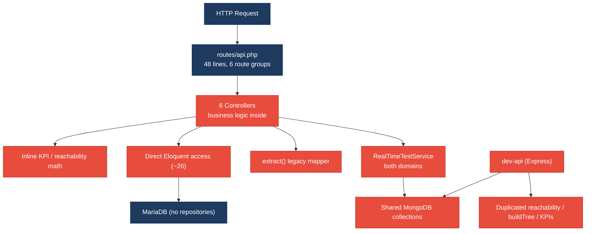
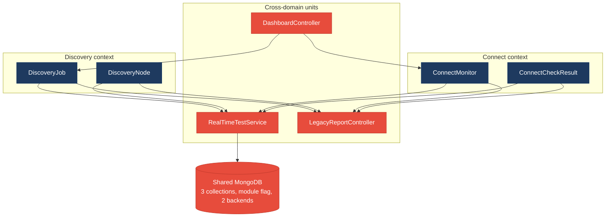
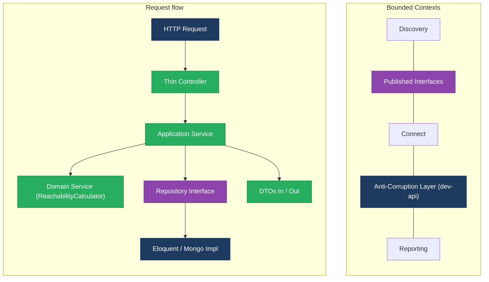
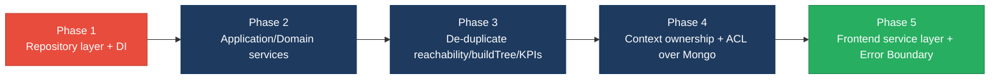

# 1. Architecture & Design Hotspots Analysis

**Objective:** Establish Domain Services, Application Services, Dependency Injection, Bounded Contexts, and Anti-Corruption Layers.

**Date:** 2026-07-24 | **Scope:** `shende-shweta/FSDKC` (branch `main`) — PHP 8.2 / Laravel 11 backend · React 18 + TypeScript + Vite frontend · Node.js / Express dev-api

## Executive Summary

> **Executive Summary**
>
> FSDKC is a small but structurally revealing full-stack "Klearcom" voice-observability platform spanning three layers: a PHP/Laravel API (`backend/`), a React/TypeScript SPA (`frontend/`), and a parallel Node/Express mock API (`dev-api/`) that re-implements the entire backend surface. Absolute file sizes are modest, so no God Class or oversized-component threshold is breached, but the design-level hotspots are severe: there is **no repository layer at all** (0 repository classes against ~38 direct Eloquent/ORM access points) and **no application-service tier** for read paths, so controllers such as `DashboardController` and `LegacyReportController` carry KPI math, `extract()`-based mapping, and cross-domain queries directly. The dominant risk is **change amplification through duplication and shared data**: the reachability formula is copy-pasted across `ConnectController`, `RealTimeTestService`, `LegacyReportController`, and `dev-api/realtime.js`, `buildTree` across three files, and both the Laravel and Express backends read/write the *same* MongoDB `klearcom` collections with no ownership. The Connect and Discovery bounded contexts (declared in `AGENTS.md` module files) are violated by controllers and services that touch both domains at once. Layers covered: **backend** (6 Laravel controllers, 2 services, 4 models, 1 legacy mapper), **frontend** (9 React components/pages, 1 hook, 1 store), and a **second backend** (Express dev-api, ~17 route handlers). The overall verdict is High Risk, driven by the missing service/repository tiers, shared-database coupling, and a fully duplicated parallel backend.

<div class="metric-grid">
<div class="metric-card"><div class="metric-number">6</div><div class="metric-label">Controllers / Handlers (Laravel)</div></div>
<div class="metric-card"><div class="metric-number">4</div><div class="metric-label">Models / Entities</div></div>
<div class="metric-card"><div class="metric-number">2</div><div class="metric-label">Service Classes Found</div></div>
<div class="metric-card"><div class="metric-number">0</div><div class="metric-label">Repository Classes Found</div></div>
</div>

<div class="overall-rating overall-rating--high-risk"><div class="overall-rating-label">Overall Codebase Rating — Architecture &amp; Design</div><div class="overall-rating-value">High Risk</div><div class="overall-rating-note">Driven by High-Risk Missing Service Layer (H2), Missing Repository Pattern (H3), Shared Database Coupling (H9), and a fully Duplicated Parallel Backend (H10).</div></div>

## 1.1 Benchmark Ratings Summary

One row per hotspot. "Measured" is the real value found in the repository; "Rating" is the band it falls into (worst measured KPI wins). This table is the source for the Overall Codebase Rating banner above.

| # | Hotspot | Primary KPI | <span class="rating rating-good">Good</span> | <span class="rating rating-moderate">Moderate</span> | <span class="rating rating-high-risk">High Risk</span> | Measured | Rating |
|---|---|---|---|---|---|---|---|
| H1 | Fat Controllers | Avg LOC per controller (+ business logic) | <150 | 150–300 | >300 | 74 LOC avg, but 3/6 hold business logic | <span class="rating rating-moderate">Moderate</span> |
| H2 | Missing Service Layer | Controllers accessing repos/models | <10 | 10–20 | >20 | ~26 direct access points | <span class="rating rating-high-risk">High Risk</span> |
| H3 | Missing Repository Pattern | Direct DB/ORM access points | <10 | 10–20 | >20 | ~38 access points, 0 repositories | <span class="rating rating-high-risk">High Risk</span> |
| H4 | Circular Dependencies | Dependency cycles | 0 | 1–3 | >3 | 0 | <span class="rating rating-good">Good</span> |
| H5 | Shared Utility Abuse | Utility files w/ business logic | 0 | 1–5 | >5 | 2 (`LegacyDataMapper`, `dev-api/store.js`) | <span class="rating rating-moderate">Moderate</span> |
| H6 | Direct SQL in Controllers | ORM/query-builder compliance % | >90% | 60–90% | <60% | ~85% (2 in-controller query builders) | <span class="rating rating-moderate">Moderate</span> |
| H7 | God Classes | Classes >1000 LOC | 0 | 1–3 | >3 | 0 (largest 276 LOC) | <span class="rating rating-good">Good</span> |
| H8 | Domain Boundary Violations | Cross-domain access points | 0 | 1–5 | >5 | 5 | <span class="rating rating-moderate">Moderate</span> |
| H9 | Shared Database Coupling | Data stores shared across domains | <10% | 10–30% | >30% | ~37% (3/8 stores, 2 backends) | <span class="rating rating-high-risk">High Risk</span> |
| H10 | Duplicated Parallel Backend *(additional)* | Business algorithms duplicated across backends | 0 | 1–2 | >2 | 3 (reachability, buildTree, KPI math) | <span class="rating rating-high-risk">High Risk</span> |
| F1 | Business Logic in Components | Avg LOC per component (+ logic) | <150 | 150–300 | >300 | 81 LOC avg, 3 carry orchestration logic | <span class="rating rating-moderate">Moderate</span> |
| F2 | Missing Frontend Service/Data Layer | Components w/ inline API calls | <10 | 10–20 | >20 | 6 files build endpoints inline | <span class="rating rating-moderate">Moderate</span> |
| F3 | God / Oversized Components | Components >400 LOC | 0 | 1–3 | >3 | 0 (largest 222 LOC) | <span class="rating rating-good">Good</span> |
| F4 | Prop Drilling / Global State Abuse | Max prop-drilling depth | ≤2 | 3–4 | >4 | ≤2 levels | <span class="rating rating-good">Good</span> |
| F5 | Legacy / Inconsistent Component Patterns | Legacy-pattern components | 0 | 1–10 | >10 | 2 (class component + manual-fetch widget) | <span class="rating rating-moderate">Moderate</span> |

*H10 defined:* **Duplicated Parallel Backend** — KPI = count of distinct business algorithms re-implemented in a second independent backend. Thresholds: Good 0 · Moderate 1–2 · High Risk >2. Justified because each duplicated algorithm must be changed in lockstep across languages or the two backends silently diverge.

## 1.2 Hotspot-by-Hotspot Evidence

### H1. Fat Controllers <span class="sev sev-high">High</span>

**Benchmark:** `Avg LOC per controller = 74` (size is Good) but 3 of 6 controllers embed non-trivial business logic → worst-wins lands in the **Moderate** band (Good <150 · Moderate 150–300 · High Risk >300 LOC; the business-logic sub-criterion drives the rating up).

**What to check:** Business logic (KPI math, tree building, reachability calculation, data mapping) living inside controllers instead of application/domain services.

**Evidence:**

`backend/app/Http/Controllers/Api/LegacyReportController.php:19-53` — the class is even self-documented as an anti-pattern (line 14-16). It runs filtering, per-monitor sub-queries, and the reachability formula inline:

```php
public function carrierSummary(Request $request): JsonResponse
{
    $filters = $request->all();
    extract($filters);                       // dynamic vars from user input
    $monitors = ConnectMonitor::query()
        ->when(isset($country_code), fn ($q) => $q->where('country_code', $country_code))
        ->orderByDesc('reachability_pct')->get();
    foreach ($monitors as $monitor) {
        $recent = ConnectCheckResult::where('connect_monitor_id', $monitor->id)
            ->orderByDesc('checked_at')->limit(20)->get();
        $successRate = $recent->count() > 0
            ? ($recent->where('reachable', true)->count() / $recent->count()) * 100 : 100;
        // ... maps + aggregates rows here
    }
}
```

`backend/app/Http/Controllers/Api/DashboardController.php:12-37` — the entire KPI aggregation (availability %, operational counts, distinct-country count) is computed in the controller with no service:

```php
$avgReachability = ConnectMonitor::avg('reachability_pct') ?? 0;
'ivr_availability_pct' => $discoveryTotal > 0
    ? round(($discoveryCompleted / $discoveryTotal) * 100, 1) : 0,
'countries_monitored' => ConnectMonitor::distinct('country_code')->count('country_code'),
```

`backend/app/Http/Controllers/Api/ConnectController.php:57-85` — `checks()` recomputes the reachability/status rule inline (and the comment on line 65 admits it duplicates `RealTimeTestService` and `dev-api`).

**Why it matters here:** Because this math lives in controllers, it can only be exercised through an HTTP request — there is no way to reuse it from a queue job, CLI command, or test without booting the HTTP layer. When the reachability rule changes (e.g. threshold from 90% to 95%), a contributor must find and edit it in `ConnectController`, `LegacyReportController`, and `RealTimeTestService` together, and any miss produces inconsistent dashboards vs. reports.

**Recommended approach:** (1) Create a `ReachabilityCalculator` domain service and replace the inline formula in `ConnectController::checks`, `LegacyReportController::carrierSummary`, and `RealTimeTestService`. (2) Introduce a `DashboardMetricsService` that `DashboardController::kpis` delegates to. (3) Move `carrierSummary` aggregation into a `CarrierReportService`. (4) Reduce each controller to request-validation + service-call + response mapping.

<!-- affected-files
search: successRate|distinct\(|->avg\(|extract\(|buildTree|reachability_pct
glob: backend/app/Http/Controllers/**/*.php
issue: Business/KPI logic embedded directly in controller
action: Extract into an Application/Domain Service; keep the controller thin
-->

### H2. Missing Service Layer <span class="sev sev-critical">Critical</span>

**Benchmark:** `Controllers accessing repositories/models directly = ~26 access points` → **High Risk** band (Good <10 · Moderate 10–20 · High Risk >20).

**What to check:** Controllers/handlers reaching straight into Eloquent models (or the Express in-memory store) instead of an application-service tier that owns the workflow.

**Evidence:** Every business controller talks to models directly. `DashboardController.php:14-33` issues 9 model queries; `ConnectController.php:22,36,47,59-66,89` ~7; `DiscoveryController.php:21,35,46,57-58,69` ~6; `LegacyReportController.php:24,34,58-59` ~4.

```php
// DashboardController.php:14-18 — no service between HTTP and persistence
$discoveryTotal = DiscoveryJob::count();
$discoveryCompleted = DiscoveryJob::where('status', 'completed')->count();
$connectMonitors = ConnectMonitor::count();
$avgReachability = ConnectMonitor::avg('reachability_pct') ?? 0;
$alerts = ConnectMonitor::where('status', 'alert')->count();
```

The same pattern repeats in the Express backend — `dev-api/src/server.js:58-80` reads `store.discoveryJobs` / `store.connectMonitors` directly inside the route handler. Only the *write/run* paths (`runCheck`, `start`) delegate to `RealTimeTestService`; all read paths bypass any service.

**Why it matters here:** With no service layer, the four business controllers each own an independent copy of "how to read Connect/Discovery state." A schema or rule change (say, excluding paused monitors from averages) must be applied in each controller and in the dev-api handler, and there is no single object a unit test can target — tests must go through HTTP routes. As the team adds a second entry point (scheduled reachability sweeps, a CLI export), the workflow has to be re-written again.

**Recommended approach:** (1) Add `ConnectService`, `DiscoveryService`, and `DashboardMetricsService` under `backend/app/Services`, constructor-injected into the controllers (DI is already used for `MongoService`/`RealTimeTestService`, so the pattern exists). (2) Move all model queries out of `DashboardController`, `LegacyReportController`, `ConnectController`, `DiscoveryController` into those services. (3) Mirror the same service boundary in `dev-api` so both backends share the contract.

<!-- affected-files
search: (ConnectMonitor|ConnectCheckResult|DiscoveryJob|DiscoveryNode)::
glob: backend/app/Http/Controllers/**/*.php
issue: Controller accesses Eloquent models directly (no service tier)
action: Route reads/writes through an Application Service
-->

### H3. Missing Repository Pattern <span class="sev sev-critical">Critical</span>

**Benchmark:** `Direct DB/ORM access points outside a repository = ~38` with **0 repository classes** → **High Risk** band (Good <10 · Moderate 10–20 · High Risk >20).

**What to check:** Persistence access (Eloquent static calls, query builders, `create`/`update`/`findOrFail`) scattered across controllers and services with no repository abstraction.

**Evidence:** No `Repositories/` directory or repository class exists anywhere under `backend/app`. ORM access is spread through controllers (§H2, ~26 points) *and* the service layer. `RealTimeTestService.php` alone has ~12 direct persistence calls:

```php
// RealTimeTestService.php:83-124 — service reads & writes models directly
$monitor = ConnectMonitor::findOrFail($monitorId);
ConnectCheckResult::create([ 'connect_monitor_id' => $monitorId, /* ... */ ]);
$recent = ConnectCheckResult::where('connect_monitor_id', $monitorId)
    ->orderByDesc('checked_at')->limit(20)->get();
$monitor->update([ 'reachability_pct' => round($rate, 2), /* ... */ ]);
```

The identical `ConnectCheckResult::where(...)->limit(20)->get()` retrieval appears in `ConnectController.php:66`, `LegacyReportController.php:34`, and `RealTimeTestService.php:117` — three copies of the same query because there is no `ConnectCheckResultRepository` to own it.

**Why it matters here:** Persistence details (column names, ordering, the "last 20 checks" window) leak into HTTP handlers and business services, so a change to how recent checks are selected forces edits in at least three files. There is also no seam to swap or mock the datastore, which is why the test suite is limited to a pure calculation test (`ReachabilityCalculationTest`) rather than repository-level tests.

**Recommended approach:** (1) Introduce `ConnectMonitorRepository`, `ConnectCheckResultRepository`, `DiscoveryJobRepository`, `DiscoveryNodeRepository` interfaces + Eloquent implementations, bound in `AppServiceProvider::register` (currently empty at `AppServiceProvider.php:9-12`). (2) Encapsulate the "recent 20 checks" query as `ConnectCheckResultRepository::recentFor($monitorId)`. (3) Inject repositories into the new services from H2, not into controllers.

<!-- affected-files
search: ::(query|where|find|findOrFail|create|count|avg|max|distinct)\(|->update\(
glob: backend/app/**/*.php
issue: Direct ORM/DB access outside any repository
action: Move persistence behind a Repository interface + Eloquent implementation
-->

### H4. Circular Dependencies <span class="sev sev-low">Low</span>

**Benchmark:** `Dependency cycles = 0` → **Good** band (Good 0 · Moderate 1–3 · High Risk >3).

**What to check:** Modules/classes importing one another (controller↔service↔model cycles, mutual service imports).

**Evidence:** Not observed — dependencies are strictly one-directional: controllers → services (`ConnectController` → `MongoService`, `RealTimeTestService`), `RealTimeTestService` → `MongoService` → MongoDB driver, and services → models. No model imports a controller or service, and the two services do not import each other cyclically.

### H5. Shared Utility Abuse <span class="sev sev-medium">Medium</span>

**Benchmark:** `Utility/helper files holding business logic = 2` → **Moderate** band (Good 0 · Moderate 1–5 · High Risk >5).

**What to check:** Generic "mapper"/"helper"/"store" files that accumulate business logic and are reused everywhere.

**Evidence:** `backend/app/Legacy/LegacyDataMapper.php:10-31` is a shared mapper holding report-shaping logic driven by an **unsafe `extract()`** on caller-supplied arrays:

```php
public function mapReportRow(array $row): array
{
    extract($row, EXTR_SKIP);               // creates $name, $reachability_pct, ...
    return ['label' => $name ?? 'Unknown', 'metric' => $reachability_pct ?? 0, /* ... */];
}
```

`dev-api/src/store.js:64-74` mixes the in-memory data store with the recursive `buildTree` business algorithm, so a generic "store" module owns domain logic that is also duplicated in the Laravel controllers.

**Why it matters here:** `LegacyDataMapper` is consumed by `LegacyReportController`, so report row-shaping rules are hidden inside a generic mapper with an `extract()` that silently creates variables from input — brittle and a security smell. Because `buildTree` lives in a shared `store.js`, the Express backend's tree logic drifts independently from the two Laravel copies.

**Recommended approach:** (1) Replace `LegacyDataMapper::mapReportRow` with an explicit `CarrierReportRow` DTO/value object — no `extract()`. (2) Extract `buildTree` from `store.js` into a dedicated `IvrTreeBuilder` used by both backends (ties into H10). (3) Keep `store.js` a pure data holder.

<!-- affected-files
search: extract\(|buildTree
glob: backend/app/Legacy/**/*.php
issue: Shared mapper/util holds business logic (and unsafe extract())
action: Replace with explicit DTOs / a dedicated domain service
-->

### H6. Direct SQL in Controllers <span class="sev sev-medium">Medium</span>

**Benchmark:** `In-controller query-builder compliance ≈ 85%` → **Moderate** band (Good >90% · Moderate 60–90% · High Risk <60%). No raw SQL strings appear in controllers, but query-builder chains are embedded in a controller and a handler.

**What to check:** Raw SQL or query-builder chains embedded directly in controllers/handlers instead of a repository.

**Evidence:** No `DB::raw`/`DB::select`/`DB::statement` exists in any controller — the only raw SQL is the schema file `docker/mariadb/init.sql`. However, `LegacyReportController.php:24-28` embeds an Eloquent query-builder chain in the controller:

```php
$monitors = ConnectMonitor::query()
    ->when(isset($country_code), fn ($q) => $q->where('country_code', $country_code))
    ->when(isset($carrier), fn ($q) => $q->where('carrier', $carrier))
    ->orderByDesc('reachability_pct')->get();
```

and `dev-api/src/server.js:45-53` builds a MongoDB query directly inside the route handler (`getDb().collection('call_diagnostics').find({...}).sort(...).limit(10)`).

**Why it matters here:** These builder chains couple the HTTP handler to collection/column names and sort order, so a schema change to `connect_monitors` or the `call_diagnostics` collection breaks the controller directly and cannot be tested without the datastore.

**Recommended approach:** (1) Move the `LegacyReportController` filter/sort chain into `ConnectMonitorRepository::filtered(...)`. (2) Move the dev-api diagnostics query into a `DiagnosticsRepository`. (3) Controllers should receive already-shaped results.

<!-- affected-files
search: ::query\(\)|->when\(|->orderByDesc\(|DB::
glob: backend/app/Http/Controllers/**/*.php
issue: Query-builder chain embedded in controller
action: Move the query into a repository method
-->

### H7. God Classes <span class="sev sev-low">Low</span>

**Benchmark:** `Classes/files >1000 LOC = 0` → **Good** band (Good 0 · Moderate 1–3 · High Risk >3).

**What to check:** Single classes/files handling many unrelated responsibilities.

**Evidence:** Not observed — the largest source file is `dev-api/src/server.js` at 276 LOC, then `frontend/src/pages/ConnectPage.tsx` (222) and `backend/app/Services/MongoService.php` (165). No class approaches the 1000-LOC threshold. (Note: responsibility concentration still exists — see H1/H2 — but no single-file size violation.)

### H8. Domain Boundary Violations <span class="sev sev-high">High</span>

**Benchmark:** `Cross-domain access points = 5` → **Moderate** band (Good 0 · Moderate 1–5 · High Risk >5), at the top of the Moderate band.

**What to check:** Code in one business area (Connect) directly reading/writing another area's (Discovery) models, despite the declared `Modules/Connect` and `Modules/Discovery` bounded contexts (`backend/app/Modules/*/AGENTS.md`).

**Evidence:** Several units span both contexts:
1. `LegacyReportController.php` imports and queries **both** `ConnectMonitor`/`ConnectCheckResult` (line 24,34) **and** `DiscoveryJob`/`DiscoveryNode` (line 58-59).
2. `DashboardController.php:14-18` reads both `DiscoveryJob` and `ConnectMonitor`.
3. `RealTimeTestService.php` owns both `runDiscoveryTest` (line 22) and `runConnectTest` (line 81) — one service, two domains.
4. `MongoService` is shared by both domains via a `module` string parameter (`'connect'` / `'discovery'`) rather than context-owned stores.
5. Frontend `LegacyDashboardWidget.tsx:19-23` fetches Discovery, Connect, and Dashboard resources in one component.

```php
// LegacyReportController.php — same controller reaches into both bounded contexts
use App\Models\ConnectCheckResult;   // Connect context
use App\Models\ConnectMonitor;       // Connect context
use App\Models\DiscoveryJob;         // Discovery context
use App\Models\DiscoveryNode;        // Discovery context
```

**Why it matters here:** The `AGENTS.md` files declare Connect and Discovery as separate modules, but nothing enforces it, so the two domains cannot be extracted or evolved independently — a change to `DiscoveryNode` can break `LegacyReportController` and `RealTimeTestService`, which also serve Connect. This hidden coupling is what makes the "one service does everything" pattern spread.

**Recommended approach:** (1) Split `RealTimeTestService` into `Discovery\DiscoveryTestRunner` and `Connect\ConnectTestRunner`. (2) Split `LegacyReportController` into per-context report controllers. (3) Have the dashboard consume per-context read models via published interfaces rather than reaching into both sets of Eloquent models.

<!-- affected-files
search: use App\\Models\\(Connect|Discovery)
glob: backend/app/**/*.php
issue: Unit spans multiple bounded contexts (Connect + Discovery)
action: Split by bounded context; communicate via published interfaces
-->

### H9. Shared Database Coupling <span class="sev sev-high">High</span>

**Benchmark:** `Data stores shared across domains ≈ 37%` (3 of 8 stores) plus two backends over one database → **High Risk** band (Good <10% · Moderate 10–30% · High Risk >30%).

**What to check:** Multiple business domains — and multiple applications — reading/writing the same tables/collections with no ownership.

**Evidence:** The datastore has 5 MariaDB tables (`users`, `discovery_jobs`, `discovery_nodes`, `connect_monitors`, `connect_check_results`) and 3 MongoDB collections (`transcripts`, `test_events`, `call_diagnostics`). The three MongoDB collections are written and read by **both** the Connect and Discovery domains, keyed only by a `module` field:

```php
// MongoService.php:62-93 — one collection set, both domains distinguished by a string
public function storeTranscript(string $module, int $referenceId, array $payload): ?string
public function storeTestEvent(string $sessionId, string $module, int $referenceId, array $event): ?string
```

Worse, **two independent backends own the same database**: `backend/app/Services/MongoService.php` (Laravel) and `dev-api/src/mongo.js` / `server.js:45-53` (Express) both connect to the same `klearcom` MongoDB and its collections. `docker/mariadb/init.sql` is a single hand-maintained schema ("manual migrations per Klearcom practice", line 1) shared by every domain.

**Why it matters here:** A change to the shape of a `test_events` document (or a rename in `call_diagnostics`) must be coordinated across the Laravel `MongoService`, the Express `mongo.js`, and every consumer of both domains — a silent-divergence trap. Because the collections have no per-context ownership, Discovery and Connect cannot be split into independent services without first untangling their shared documents.

**Recommended approach:** (1) Give each context its own collections (`discovery_transcripts`, `connect_transcripts`, …) or an internal API, and drop the `module` discriminator. (2) Introduce an **Anti-Corruption Layer** between the Express dev-api and the shared Mongo store so only one backend owns writes. (3) Adopt real, versioned migrations instead of the shared `init.sql`.

<!-- affected-files
search: storeTranscript|storeTestEvent|storeDiagnostic|getTranscripts|getTestEvents|getDiagnostics
glob: backend/app/**/*.php
issue: Reads/writes shared MongoDB collections across both domains
action: Introduce per-context ownership + an Anti-Corruption Layer
-->

### H10. Duplicated Parallel Backend <span class="sev sev-high">High</span> *(additional)*

**Benchmark:** `Distinct business algorithms duplicated across backends = 3` → **High Risk** band (Good 0 · Moderate 1–2 · High Risk >2). KPI defined in §1.1.

**What to check:** The Express `dev-api` re-implements the Laravel API surface, duplicating core algorithms in a second language.

**Evidence:** Three business algorithms exist in multiple copies:
1. **Reachability formula** — `ConnectController.php:71-75`, `RealTimeTestService.php:118,122`, `LegacyReportController.php:39-41`, and `dev-api/src/realtime.js:147-152`:

```js
// dev-api/src/realtime.js:147-152 — same formula as the three PHP copies
const successRate = recent.length > 0
  ? (recent.filter((c) => c.reachable).length / recent.length) * 100 : 100;
monitor.reachability_pct = Math.round(successRate * 100) / 100;
monitor.status = successRate < 90 ? 'alert' : 'active';
```
2. **`buildTree`** — `DiscoveryController.php:87-101`, `LegacyReportController.php:78-92` (comment: "Duplicate of DiscoveryController::buildTree — copy-paste debt"), and `dev-api/src/store.js:64-74`.
3. **Dashboard KPI math** — `DashboardController.php:12-37` and `dev-api/src/server.js:58-80`.

**Why it matters here:** Every one of these rules now has 3–4 authoritative copies across PHP and JavaScript. Changing the alert threshold or the availability formula in one place and missing another produces a dashboard that disagrees with a report, or a dev environment that behaves differently from production — the most expensive class of "works on my machine" bug.

**Recommended approach:** (1) Decide whether `dev-api` is a throwaway mock or a real service; if a mock, generate it from the same OpenAPI contract rather than hand-copying logic. (2) Consolidate reachability into one `ReachabilityCalculator` and `buildTree` into one `IvrTreeBuilder` (H1/H5). (3) Add a contract test that asserts both backends return identical KPI shapes.

<!-- affected-files
search: reachab|buildTree|successRate|ivr_availability_pct
glob: dev-api/src/**/*.js
issue: Business algorithm duplicated from the Laravel backend
action: Consolidate into a single shared implementation / generate from a contract
-->

### F1. Business Logic in Components <span class="sev sev-medium">Medium</span>

**Benchmark:** `Avg LOC per component = 81` (size Good) but 3 components embed non-presentational logic → **Moderate** band (Good <150 · Moderate 150–300 · High Risk >300 LOC; the logic-in-view sub-criterion drives the rating).

**What to check:** Validation, data orchestration, polling, or workflow logic living directly inside React view components instead of hooks/services.

**Evidence:** `frontend/src/pages/ConnectPage.tsx:50-56` embeds a multi-query cache-invalidation workflow in the view:

```tsx
const handleRunCheck = async (monitorId: number) => {
  setSelectedId(monitorId);
  await startConnectCheck(monitorId);
  queryClient.invalidateQueries({ queryKey: ['connect'] });
  queryClient.invalidateQueries({ queryKey: ['mongodb'] });
  queryClient.invalidateQueries({ queryKey: ['dashboard'] });
};
```

`DiscoveryPage.tsx:46-52` duplicates the same three-invalidation orchestration, and `LegacyDashboardWidget.tsx:16-45` inlines `Promise.all` fetching, a 10s polling interval, and error handling directly in the component body.

**Why it matters here:** The "what to refresh after a test run" rule is copy-pasted across `ConnectPage` and `DiscoveryPage`; adding a fourth query cache means editing every page. `LegacyDashboardWidget` mixes data-fetching, polling lifecycle, and rendering, so it cannot be tested or reused as a presentational component.

**Recommended approach:** (1) Move the post-run invalidation set into the `useRealtimeTest` hook (or a `useAfterTestRun` hook) so pages just call it. (2) Replace `LegacyDashboardWidget`'s manual fetching with the shared React Query hooks used by `DashboardPage`. (3) Keep page components presentational.

<!-- affected-files
search: invalidateQueries|Promise\.all|setInterval|useState\(
glob: frontend/src/**/*.{jsx,tsx}
issue: Non-presentational logic (orchestration/polling) inside a view component
action: Extract into a custom hook or frontend service
-->

### F2. Missing Frontend Service/Data Layer <span class="sev sev-medium">Medium</span>

**Benchmark:** `Components building API endpoints inline = 6` → **Moderate** band (Good <10 · Moderate 10–20 · High Risk >20). A thin shared `api` client exists, but there is no per-domain service layer, so endpoint strings are scattered.

**What to check:** `fetch`/`axios` calls and hard-coded API URLs inline in components instead of a per-domain service/data layer.

**Evidence:** `frontend/src/api/client.ts` provides only a generic `get`/`post` wrapper; every component hand-builds endpoint paths. `ConnectPage.tsx:24,30,37,43` builds four different `/connect/...` and `/mongodb/...` URLs inline:

```tsx
queryFn: () => api.get<{ data: ConnectCheckResult[] }>(`/connect/monitors/${selectedId}/checks`),
queryFn: () => api.get<{ data: Transcript[] }>(`/mongodb/transcripts?module=connect&reference_id=${selectedId}`),
```

The same inline-path pattern appears in `DiscoveryPage.tsx:20,26,33`, `DashboardPage.tsx:8`, `LegacyDashboardWidget.tsx:20-22`, `LegacyMonitorPoller.jsx:24`, and `hooks/useRealtimeTest.ts:29-31` — 6 files owning raw endpoint strings.

**Why it matters here:** Endpoint shapes (`/mongodb/transcripts?module=…&reference_id=…`) are duplicated across components; a route rename forces a hunt through pages, a widget, a class component, and a hook. There is no typed `connectApi`/`discoveryApi` module to centralize them.

**Recommended approach:** (1) Add `frontend/src/api/connect.ts`, `discovery.ts`, `dashboard.ts` exposing typed functions (`getMonitors()`, `getChecks(id)`, …) built on the existing `api` client. (2) Have components/hooks call those instead of literal paths. (3) Co-locate response types with each service.

<!-- affected-files
search: api\.(get|post)\(|/connect/|/discovery/|/dashboard/|/mongodb/
glob: frontend/src/**/*.{jsx,tsx,ts}
issue: Inline API endpoint path built inside a component/hook
action: Move endpoints into a typed per-domain service module
-->

### F3. God / Oversized Components <span class="sev sev-low">Low</span>

**Benchmark:** `Components >400 LOC = 0` → **Good** band (Good 0 · Moderate 1–3 · High Risk >3).

**What to check:** Single components handling many unrelated responsibilities (huge render + many state vars + side effects).

**Evidence:** Not observed — the largest component is `ConnectPage.tsx` at 222 LOC, then `DiscoveryPage.tsx` (176). None exceed the 400-LOC threshold. (Logic concentration is captured under F1, not size.)

### F4. Prop Drilling / Global State Abuse <span class="sev sev-low">Low</span>

**Benchmark:** `Max prop-drilling depth ≤ 2 levels` → **Good** band (Good ≤2 · Moderate 3–4 · High Risk >4).

**What to check:** Props threaded through many intermediate layers, or one giant global store everything reads/writes.

**Evidence:** Not observed — the Zustand store `store/uiStore.ts:10-15` is minimal and focused (two selected-id values + setters), not a god-store. Props are shallow: `LiveTestFeed`, `IvrTree`, and `LegacyMonitorPoller` each receive props one level from their page; `IvrTree` recurses on its own `nodes` (recursion, not drilling). No prop is threaded beyond 2 levels.

### F5. Legacy / Inconsistent Component Patterns <span class="sev sev-medium">Medium</span>

**Benchmark:** `Legacy/inconsistent-pattern components = 2` → **Moderate** band (Good 0 · Moderate 1–10 · High Risk >10).

**What to check:** Mixed paradigms (class + function components), missing lifecycle cleanup, missing error boundaries, inconsistent data-fetching conventions.

**Evidence:** `frontend/src/components/LegacyMonitorPoller.jsx:17-33` is the only **class component** in an otherwise function-component codebase, and it deliberately omits `componentWillUnmount`, leaking its 3s interval:

```jsx
componentDidMount() {
  this.intervalId = setInterval(() => { /* poll ... */ }, 3000);
  // Intentionally no componentWillUnmount — EventSource/interval leak for audit finding
}
```

`LegacyDashboardWidget.tsx:48` throws inside render (`if (error) throw new Error(error)`) with **no Error Boundary anywhere** in the tree (`App.tsx` wires routes directly, no boundary), so that throw crashes the app. It also fetches via manual `useEffect`/`Promise.all` while every other page uses React Query — an inconsistent data-fetching convention. The codebase also mixes `.jsx` and `.tsx` component files.

**Why it matters here:** The class component's interval leak accumulates timers on every mount/unmount; combined with the missing Error Boundary, a single failed `dashboard/kpis` fetch in `LegacyDashboardWidget` takes down the whole SPA rather than a section.

**Recommended approach:** (1) Convert `LegacyMonitorPoller` to a function component with a `useEffect` cleanup that clears the interval. (2) Add an `ErrorBoundary` around routes in `App.tsx`. (3) Migrate `LegacyDashboardWidget` to React Query hooks for convention consistency; standardize on `.tsx`.

<!-- affected-files
search: extends Component|componentDidMount|componentWillUnmount|throw new Error
glob: frontend/src/**/*.{jsx,tsx}
issue: Legacy class component / missing cleanup / missing error boundary
action: Convert to function component with cleanup; add an Error Boundary
-->

## 1.3 Diagrams

### Current-state architecture (as-is)


### Clean reference path (target pattern already partly present)


### Domain boundary map (business domains vs. shared data)


### Target architecture (proposed)


### Improvement roadmap


## 1.4 Actions Required

| Hotspot | Action | Rating | Priority |
|---|---|---|---|
| H2 Missing Service Layer | Introduce `ConnectService`/`DiscoveryService`/`DashboardMetricsService`; move all controller model queries into them | <span class="rating rating-high-risk">High Risk</span> | <span class="sev sev-critical">Critical</span> |
| H3 Missing Repository Pattern | Add repository interfaces + Eloquent impls, bound in `AppServiceProvider`; encapsulate the "recent 20 checks" query | <span class="rating rating-high-risk">High Risk</span> | <span class="sev sev-critical">Critical</span> |
| H9 Shared Database Coupling | Give each context its own Mongo collections; add an ACL over the dev-api; adopt versioned migrations | <span class="rating rating-high-risk">High Risk</span> | <span class="sev sev-high">High</span> |
| H10 Duplicated Parallel Backend | Consolidate reachability/`buildTree`/KPI math into single shared services; add cross-backend contract test | <span class="rating rating-high-risk">High Risk</span> | <span class="sev sev-high">High</span> |
| H1 Fat Controllers | Extract KPI/reachability/mapping logic out of `Dashboard`/`Legacy`/`Connect` controllers into services | <span class="rating rating-moderate">Moderate</span> | <span class="sev sev-high">High</span> |
| H8 Domain Boundary Violations | Split `RealTimeTestService` and `LegacyReportController` per bounded context; consume via published interfaces | <span class="rating rating-moderate">Moderate</span> | <span class="sev sev-high">High</span> |
| H5 Shared Utility Abuse | Replace `LegacyDataMapper` `extract()` with DTOs; extract `buildTree` from `store.js` | <span class="rating rating-moderate">Moderate</span> | <span class="sev sev-medium">Medium</span> |
| H6 Direct SQL in Controllers | Move `LegacyReportController` and dev-api diagnostics query builders into repositories | <span class="rating rating-moderate">Moderate</span> | <span class="sev sev-medium">Medium</span> |
| F1 Business Logic in Components | Move post-run invalidation into a hook; migrate `LegacyDashboardWidget` off manual fetching | <span class="rating rating-moderate">Moderate</span> | <span class="sev sev-medium">Medium</span> |
| F2 Missing Frontend Service/Data Layer | Add typed per-domain API service modules; remove inline endpoint strings from 6 files | <span class="rating rating-moderate">Moderate</span> | <span class="sev sev-medium">Medium</span> |
| F5 Legacy / Inconsistent Component Patterns | Convert `LegacyMonitorPoller` to a function component with cleanup; add an Error Boundary; standardize on React Query | <span class="rating rating-moderate">Moderate</span> | <span class="sev sev-medium">Medium</span> |

## 1.5 Expected Outcomes

- **Testable business rules:** reachability, IVR-tree, and KPI logic move into services/repositories that can be unit-tested without booting HTTP or the datastore, extending the coverage that today stops at `ReachabilityCalculationTest`.
- **Single source of truth:** consolidating the duplicated reachability/`buildTree`/KPI algorithms (H1/H5/H10) means a rule change is a one-file edit, eliminating dashboard-vs-report and prod-vs-dev divergence.
- **Independently evolvable domains:** enforcing the Connect and Discovery bounded contexts and giving each its own data ownership (H8/H9) makes either domain extractable into its own service without untangling shared models or collections.
- **Swappable persistence:** a repository tier (H3) decouples business logic from Eloquent/Mongo, enabling schema changes and datastore swaps behind stable interfaces.
- **Resilient, consistent frontend:** a typed per-domain service layer plus an Error Boundary and function-component conventions (F1/F2/F5) remove inline endpoint duplication, stop interval leaks, and prevent a single failed fetch from crashing the SPA.
