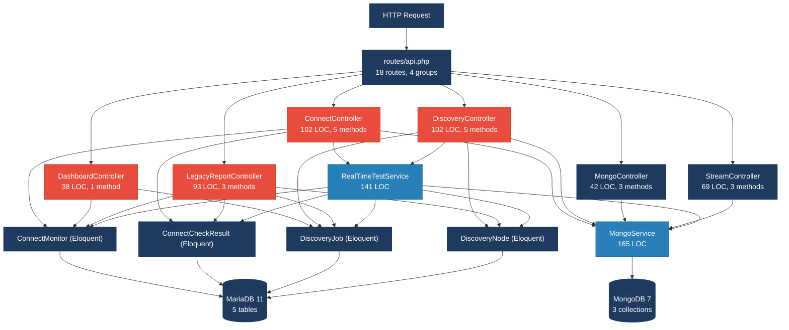
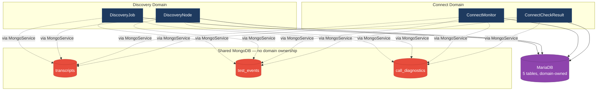
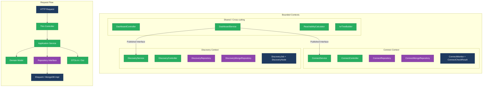
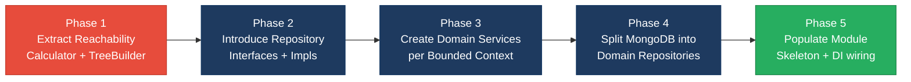

# 1. Architecture & Design Hotspots Analysis

**Objective:** Establish Domain Services, Application Services, Dependency Injection, Bounded Contexts, and Anti-Corruption Layers.

**Date:** 2026-08-14 16:35:28 IST | **Scope:** `shende-shweta/FSDKC` (main) — PHP 8.3 / Laravel 12 monolithic REST API (backend), React 19 / TypeScript / Vite 6 SPA (frontend), Node.js / Express dev-API, MariaDB 11, MongoDB 7, Docker / Nginx / PHP-FPM, GitHub Actions CI

**Layers analyzed:** Backend (26 PHP files, 1 127 LOC), Frontend (15 TSX/JSX/TS files, 983 LOC), Dev-API (6 JS files, 832 LOC). Total: 47 source files, 2 942 LOC.

## Executive Summary

> **Executive Summary**
>
> The Klearcom platform is a voice-quality observability system built as a Laravel 12 monolithic REST API with a React 19 SPA frontend and a parallel Node.js dev-API. While controllers are commendably thin (avg 74 LOC) and the frontend properly uses a shared API client with React Query, the codebase has three systemic architecture issues: (1) zero repository abstractions — all 32 database access points scatter Eloquent calls through controllers and services; (2) domain boundary violations between the Discovery and Connect modules, which share MongoDB collections and cross-read each other's models without interfaces; and (3) critical business logic (the reachability KPI formula) is duplicated in four independent locations across two codebases with no canonical source of truth. The `app/Modules/Connect` and `app/Modules/Discovery` skeleton directories signal an intent to modularize that has not yet begun. These gaps collectively create high change-amplification risk — modifying the reachability calculation, swapping a persistence layer, or extracting a bounded context will each require hunting across multiple files and two languages.

<div class="metric-grid">
<div class="metric-card"><div class="metric-number">6</div><div class="metric-label">Controllers / Handlers</div></div>
<div class="metric-card"><div class="metric-number">4</div><div class="metric-label">Models / Entities</div></div>
<div class="metric-card"><div class="metric-number">2</div><div class="metric-label">Service Classes Found</div></div>
<div class="metric-card"><div class="metric-number">0</div><div class="metric-label">Repository Classes Found</div></div>
</div>

<div class="overall-rating overall-rating--high-risk"><div class="overall-rating-label">Overall Codebase Rating — Architecture &amp; Design</div><div class="overall-rating-value">High Risk</div><div class="overall-rating-note">Driven by High-Risk Missing Repository Pattern (H3), Domain Boundary Violations (H8), Shared Database Coupling (H9), and Duplicated Business Logic (H10).</div></div>

## 1.1 Benchmark Ratings Summary

| # | Hotspot | Primary KPI | <span class="rating rating-good">Good</span> | <span class="rating rating-moderate">Moderate</span> | <span class="rating rating-high-risk">High Risk</span> | Measured | Rating |
|---|---|---|---|---|---|---|---|
| H1 | Fat Controllers | Avg LOC per controller | <150 | 150–300 | >300 | 74 LOC | <span class="rating rating-good">Good</span> |
| H2 | Missing Service Layer | Controller methods directly accessing models | <10 | 10–20 | >20 | 13 methods | <span class="rating rating-moderate">Moderate</span> |
| H3 | Missing Repository Pattern | Direct DB/ORM access points outside repositories | <10 | 10–20 | >20 | 32 | <span class="rating rating-high-risk">High Risk</span> |
| H4 | Circular Dependencies | Dependency cycles | 0 | 1–3 | >3 | 0 | <span class="rating rating-good">Good</span> |
| H5 | Shared Utility Abuse | Utility files w/ business logic | 0 | 1–5 | >5 | 1 (LegacyDataMapper) | <span class="rating rating-moderate">Moderate</span> |
| H6 | Direct SQL in Controllers | ORM compliance % | >90% | 60–90% | <60% | 100% | <span class="rating rating-good">Good</span> |
| H7 | God Classes | Classes >1000 LOC | 0 | 1–3 | >3 | 0 | <span class="rating rating-good">Good</span> |
| H8 | Domain Boundary Violations | Cross-domain access points | 0 | 1–5 | >5 | 6 | <span class="rating rating-high-risk">High Risk</span> |
| H9 | Shared Database Coupling | Data stores shared across domains | <10% | 10–30% | >30% | 37.5% (3/8) | <span class="rating rating-high-risk">High Risk</span> |
| H10 | Duplicated Business Logic (additional) | Duplicated business-critical code sites | 0–1 | 2–4 | >4 | 7 sites | <span class="rating rating-high-risk">High Risk</span> |
| F1 | Business Logic in Components | Avg LOC per component | <150 | 150–300 | >300 | 86 LOC | <span class="rating rating-good">Good</span> |
| F2 | Missing Frontend Service/Data Layer | Components w/ inline API calls | <10 | 10–20 | >20 | 2 | <span class="rating rating-good">Good</span> |
| F3 | God / Oversized Components | Components >400 LOC | 0 | 1–3 | >3 | 0 | <span class="rating rating-good">Good</span> |
| F4 | Prop Drilling / Global State Abuse | Max prop-drilling depth | ≤2 | 3–4 | >4 | ≤2 levels | <span class="rating rating-good">Good</span> |
| F5 | Legacy / Inconsistent Component Patterns | Legacy-pattern components | 0 | 1–10 | >10 | 2 | <span class="rating rating-moderate">Moderate</span> |
| C1 | Anemic Domain Model (context) | Models with domain behaviour (% of total) | >70% | 30–70% | <30% | 0% (0/4) | <span class="rating rating-high-risk">High Risk</span> |
| C2 | Empty Module Skeleton (context) | Module directories with actual code | 100% | 50–100% | <50% | 0% (0/2) | <span class="rating rating-high-risk">High Risk</span> |

**Context-driven items owned by other reports:**
- Missing Authentication/Authorization (zero auth middleware on all API routes) → owned by `06-security.md`.
- Unsafe `extract()` usage in LegacyDataMapper → owned by `06-security.md` and `03-code-quality.md`.
- No Laravel migrations present (schema managed via Docker init.sql) → owned by `07-technical-debt.md`.

**No additional hotspots beyond the standard set and context items were observed.**

## 1.2 Hotspot-by-Hotspot Evidence

### H2. Missing Service Layer <span class="sev sev-medium">Medium</span>

**Benchmark:** `Controller methods directly accessing models = 13` → falls in the **Moderate** band (Good <10 · Moderate 10–20 · High Risk >20).

**What to check:** Controllers/handlers directly accessing repositories/models with no dedicated service tier.

**Evidence:** 13 of 20 controller methods access Eloquent models directly instead of delegating to a service. Only `MongoController` (3 methods) and `StreamController` (3 methods) properly delegate to `MongoService`.

Example 1 — `DashboardController::kpis` performs 8 Eloquent queries inline:

```php
// backend/app/Http/Controllers/Api/DashboardController.php:14-33
$discoveryTotal = DiscoveryJob::count();
$discoveryCompleted = DiscoveryJob::where('status', 'completed')->count();
$connectMonitors = ConnectMonitor::count();
$avgReachability = ConnectMonitor::avg('reachability_pct') ?? 0;
$alerts = ConnectMonitor::where('status', 'alert')->count();
// ... plus 3 more inline queries at lines 30-33
```

Example 2 — `ConnectController::checks` embeds a reachability calculation with 2 extra queries:

```php
// backend/app/Http/Controllers/Api/ConnectController.php:66-75
$recentChecks = ConnectCheckResult::where('connect_monitor_id', $id)
    ->orderByDesc('checked_at')
    ->limit(20)
    ->get();
$successRate = $recentChecks->count() > 0
    ? ($recentChecks->where('reachable', true)->count() / $recentChecks->count()) * 100
    : 100;
```

Example 3 — `LegacyReportController::carrierSummary` loops through monitors and queries check results per monitor inside the loop (N+1 pattern):

```php
// backend/app/Http/Controllers/Api/LegacyReportController.php:33-41
foreach ($monitors as $monitor) {
    $recent = ConnectCheckResult::where('connect_monitor_id', $monitor->id)
        ->orderByDesc('checked_at')
        ->limit(20)
        ->get();
    $successRate = $recent->count() > 0
        ? ($recent->where('reachable', true)->count() / $recent->count()) * 100
        : 100;
```

Total: 13 controller methods with direct model access across 4 controllers.

**Why it matters here:** KPI aggregation logic in `DashboardController`, reachability computation in `ConnectController` and `LegacyReportController`, and tree-building in `DiscoveryController` are all business rules that cannot be reused from CLI commands, queued jobs, or the dev-API — each caller must re-implement them. The N+1 loop in `LegacyReportController::carrierSummary` would be the first performance bottleneck as monitor count grows.

**Recommended approach:**
1. Create a `ConnectService` that owns the reachability calculation, check history retrieval, and monitor management.
2. Create a `DiscoveryService` that owns the tree-building logic and job lifecycle.
3. Create a `DashboardService` that composes KPIs from the other services.
4. Keep controllers as thin HTTP→Service→Response translators.

<!-- affected-files
search: (DiscoveryJob|ConnectMonitor|ConnectCheckResult|DiscoveryNode)::(count|where|findOrFail|create|avg|distinct|query|orderByDesc|with)
glob: backend/app/Http/Controllers/**/*.php
issue: Direct model access in controller
action: Extract to service class
-->

### H3. Missing Repository Pattern <span class="sev sev-critical">Critical</span>

**Benchmark:** `Direct DB/ORM access points outside repositories = 32` → falls in the **High Risk** band (Good <10 · Moderate 10–20 · High Risk >20).

**What to check:** Direct DB/ORM access scattered through the codebase without a repository abstraction layer.

**Evidence:** Zero repository classes exist. All 32 Eloquent access points are spread across 4 controllers and 1 service. The `MongoService` acts as a de facto repository for MongoDB (8 methods), but no equivalent exists for MariaDB/Eloquent.

Example 1 — `ConnectController` performs 7 direct model calls across 5 methods:

```php
// backend/app/Http/Controllers/Api/ConnectController.php:22
$monitors = ConnectMonitor::orderByDesc('last_checked_at')->get();

// backend/app/Http/Controllers/Api/ConnectController.php:60-68
$checks = ConnectCheckResult::where('connect_monitor_id', $id)
    ->orderByDesc('checked_at')
    ->limit(50)
    ->get();
$recentChecks = ConnectCheckResult::where('connect_monitor_id', $id)
    ->orderByDesc('checked_at')
    ->limit(20)
    ->get();
```

Example 2 — `RealTimeTestService` has 6 direct model calls, mixing Eloquent reads and writes:

```php
// backend/app/Services/RealTimeTestService.php:24-25
$job = DiscoveryJob::findOrFail($jobId);
$job->update(['status' => 'running', 'started_at' => now()]);

// backend/app/Services/RealTimeTestService.php:52-58
$node = DiscoveryNode::create([
    'discovery_job_id' => $jobId,
    'parent_id' => $parentId,
    'prompt_text' => $step['transcript'] ?? 'Menu discovered',
    'node_type' => 'menu',
    'depth' => $parentId ? 1 : 0,
]);
```

Example 3 — `DashboardController::kpis` queries 4 different models with 8 Eloquent calls, none via a repository:

```php
// backend/app/Http/Controllers/Api/DashboardController.php:14-18
$discoveryTotal = DiscoveryJob::count();
$discoveryCompleted = DiscoveryJob::where('status', 'completed')->count();
$connectMonitors = ConnectMonitor::count();
$avgReachability = ConnectMonitor::avg('reachability_pct') ?? 0;
$alerts = ConnectMonitor::where('status', 'alert')->count();
```

Breakdown: ConnectController (7), DashboardController (8), DiscoveryController (6), LegacyReportController (5), RealTimeTestService (6) = 32 total.

**Why it matters here:** Every query is hard-coded to Eloquent's MySQL driver. If the team ever needs to swap MariaDB for Aurora, add read replicas, or cache hot queries (e.g. the dashboard KPI aggregation that fires on every page load), there is no seam to intercept. Testing any controller requires a live database — mocking 32 scattered static calls is impractical.

**Recommended approach:**
1. Create `ConnectMonitorRepository` and `ConnectCheckResultRepository` interfaces under `app/Repositories/`.
2. Create `DiscoveryJobRepository` and `DiscoveryNodeRepository` interfaces.
3. Implement concrete Eloquent repositories, bind via `AppServiceProvider`.
4. Inject repositories into services (not controllers) — controllers call services, services call repositories.

<!-- affected-files
search: (DiscoveryJob|ConnectMonitor|ConnectCheckResult|DiscoveryNode)::(count|where|findOrFail|find|create|update|avg|distinct|query|orderByDesc|with|max)
glob: backend/app/**/*.php
issue: Direct ORM access without repository
action: Wrap in repository interface
-->

### H5. Shared Utility Abuse <span class="sev sev-low">Low</span>

**Benchmark:** `Utility files with business logic = 1` → falls in the **Moderate** band (Good 0 · Moderate 1–5 · High Risk >5).

**What to check:** Large utility/helper files used everywhere, holding business logic.

**Evidence:** `LegacyDataMapper` sits in `app/Legacy/` and uses the unsafe `extract()` pattern to transform business data.

```php
// backend/app/Legacy/LegacyDataMapper.php:10-20
public function mapReportRow(array $row): array
{
    extract($row, EXTR_SKIP);

    return [
        'label' => $name ?? 'Unknown',
        'metric' => $reachability_pct ?? 0,
        'region' => $country_code ?? 'N/A',
        'source' => 'legacy_extract_mapper',
    ];
}
```

It is instantiated directly (not via DI) in `LegacyReportController::carrierSummary` (line 31: `$mapper = new LegacyDataMapper()`), bypassing the container entirely.

**Why it matters here:** The `extract()` call creates variables from arbitrary arrays, which is a maintainability hazard (impossible to trace variable origins via static analysis) and a security concern (potential variable injection if the source array is user-influenced — and in `LegacyReportController` it is, since `extract($filters)` at line 22 extracts from `$request->all()`). The `new LegacyDataMapper()` instantiation means this class cannot be easily mocked or substituted.

**Recommended approach:**
1. Replace `extract()` with explicit array access (`$row['name']`).
2. Register `LegacyDataMapper` as a service in the container and inject via constructor DI.
3. Move the mapping logic into a dedicated `ReportTransformer` or DTO.

<!-- affected-files
search: extract\(
glob: backend/app/**/*.php
issue: Unsafe extract() pattern
action: Replace with explicit array access
-->

### H8. Domain Boundary Violations <span class="sev sev-high">High</span>

**Benchmark:** `Cross-domain access points = 6` → falls in the **High Risk** band (Good 0 · Moderate 1–5 · High Risk >5).

**What to check:** Code in one business area directly reading/writing another area's data or models.

**Evidence:** Two business domains exist — **Discovery** (DiscoveryJob, DiscoveryNode) and **Connect** (ConnectMonitor, ConnectCheckResult). Several components cross these boundaries without interfaces or anti-corruption layers.

Example 1 — `DashboardController` reads directly from both domains (8 Eloquent calls spanning both):

```php
// backend/app/Http/Controllers/Api/DashboardController.php:14-18
$discoveryTotal = DiscoveryJob::count();          // Discovery domain
$discoveryCompleted = DiscoveryJob::where('status', 'completed')->count(); // Discovery domain
$connectMonitors = ConnectMonitor::count();        // Connect domain
$avgReachability = ConnectMonitor::avg('reachability_pct') ?? 0; // Connect domain
```

Example 2 — `LegacyReportController` spans both domains: `carrierSummary` reads Connect models, `ivrDepthReport` reads Discovery models — both in the same controller class:

```php
// backend/app/Http/Controllers/Api/LegacyReportController.php:24-27 (Connect)
$monitors = ConnectMonitor::query()
    ->when(isset($country_code), fn ($q) => $q->where('country_code', $country_code))

// backend/app/Http/Controllers/Api/LegacyReportController.php:58-59 (Discovery)
$job = DiscoveryJob::findOrFail($jobId);
$nodes = DiscoveryNode::where('discovery_job_id', $jobId)->get();
```

Example 3 — `RealTimeTestService` handles both Discovery test execution and Connect test execution in a single class, directly accessing models from both domains:

```php
// backend/app/Services/RealTimeTestService.php:24 (Discovery)
$job = DiscoveryJob::findOrFail($jobId);

// backend/app/Services/RealTimeTestService.php:83 (Connect)
$monitor = ConnectMonitor::findOrFail($monitorId);
```

Cross-domain access points: DashboardController (2 patterns), LegacyReportController (2 patterns), RealTimeTestService (2 patterns) = 6 total.

Additionally, the empty `app/Modules/Connect/` and `app/Modules/Discovery/` directories (containing only `AGENTS.md` placeholders) show the team has recognized the need for bounded contexts but has not yet moved any code into the module structure.

**Why it matters here:** Extracting either Discovery or Connect into an independent deployable (microservice, package, or modular monolith boundary) would require untangling every cross-domain call. The `DashboardController` is the most entangled — it would need to call each domain's published interface rather than reaching into their models. The `RealTimeTestService` conflates two distinct workflows (IVR traversal vs. TFN reachability) in one class, making it the highest-risk component for unintended regressions.

**Recommended approach:**
1. Split `RealTimeTestService` into `DiscoveryTestService` and `ConnectTestService`.
2. Create `DiscoveryQueryService` and `ConnectQueryService` with published interfaces for cross-domain reads.
3. `DashboardController` and `LegacyReportController` should depend on these query interfaces, not on the raw models.
4. Move domain code into `app/Modules/Connect/` and `app/Modules/Discovery/` to enforce the boundaries structurally.

<!-- affected-files
search: (DiscoveryJob|DiscoveryNode|ConnectMonitor|ConnectCheckResult)::
glob: backend/app/Http/Controllers/Api/DashboardController.php
issue: Cross-domain model access
action: Replace with domain query interface
-->

<!-- affected-files
search: (DiscoveryJob|DiscoveryNode|ConnectMonitor|ConnectCheckResult)::
glob: backend/app/Http/Controllers/Api/LegacyReportController.php
issue: Cross-domain model access
action: Replace with domain query interface
-->

<!-- affected-files
search: (DiscoveryJob|DiscoveryNode|ConnectMonitor|ConnectCheckResult)::
glob: backend/app/Services/RealTimeTestService.php
issue: Multi-domain service coupling
action: Split into domain-specific services
-->

### H9. Shared Database Coupling <span class="sev sev-high">High</span>

**Benchmark:** `Data stores shared across domains = 37.5% (3 of 8)` → falls in the **High Risk** band (Good <10% · Moderate 10–30% · High Risk >30%).

**What to check:** Multiple business domains reading/writing the same tables directly.

**Evidence:** The application uses 8 data stores: 5 MariaDB tables (domain-owned) and 3 MongoDB collections (shared). The MariaDB schema is cleanly separated:

| Table | Owner Domain |
|---|---|
| `users` | General (no FK to any domain) |
| `discovery_jobs` | Discovery |
| `discovery_nodes` | Discovery |
| `connect_monitors` | Connect |
| `connect_check_results` | Connect |

However, all 3 MongoDB collections are shared by both domains via a `module` field discriminator:

| Collection | Writers | Discriminator |
|---|---|---|
| `transcripts` | Discovery, Connect | `module` field |
| `test_events` | Discovery, Connect | `module` field |
| `call_diagnostics` | Discovery, Connect | `module` field |

Both `RealTimeTestService::runDiscoveryTest` and `RealTimeTestService::runConnectTest` write to the same collections via `MongoService`:

```php
// backend/app/Services/RealTimeTestService.php:36-38 (Discovery writing to shared collection)
$this->mongo->storeTestEvent($sessionId, 'discovery', $jobId, [...]);

// backend/app/Services/RealTimeTestService.php:94 (Connect writing to same collection)
$this->mongo->storeTestEvent($sessionId, 'connect', $monitorId, [...]);
```

The MongoDB `init.js` and `seed-data.js` confirm this shared design — both modules' seed data goes into the same collections with indexes only on `module + reference_id`.

**Why it matters here:** Schema changes to any shared collection (adding fields, changing indexes, modifying the document shape) affect both Discovery and Connect. There is no per-domain ownership of the MongoDB data model. If one domain needs a different transcript format or retention policy, the change risks breaking the other domain's reads. The `module` field is a soft discriminator with no schema enforcement.

**Recommended approach:**
1. Define per-domain MongoDB collection namespaces (e.g. `discovery_transcripts`, `connect_transcripts`) or logically separate via the module field with per-domain typed accessors.
2. Split `MongoService` into `DiscoveryMongoRepository` and `ConnectMongoRepository` with domain-specific document schemas.
3. If shared collections must remain, introduce an anti-corruption layer that maps domain-specific DTOs to/from the shared document format.

<!-- affected-files
search: storeTestEvent|storeTranscript|storeDiagnostic|getTranscripts|getDiagnostics|getTestEvents
glob: backend/app/Services/MongoService.php
issue: Shared MongoDB collections across domains
action: Split into domain-owned repositories
-->

### H10. Duplicated Business Logic (additional) <span class="sev sev-critical">Critical</span>

**Benchmark:** `Duplicated business-critical code sites = 7` → falls in the **High Risk** band (Good 0–1 · Moderate 2–4 · High Risk >4). Justification: business-critical KPI calculations duplicated across independent codebases compound the risk of divergence and silent correctness bugs; threshold is set tighter than generic code duplication.

**What to check:** Identical business logic implementations scattered across the codebase with no single source of truth.

**Evidence:** Two distinct business formulas are duplicated across 7 independent locations in 2 languages:

**Reachability KPI formula** — the same `successRate = reachableCount / totalCount * 100` with a `< 90 → alert` threshold appears in 4 places:

Location 1:
```php
// backend/app/Http/Controllers/Api/ConnectController.php:71-75
$successRate = $recentChecks->count() > 0
    ? ($recentChecks->where('reachable', true)->count() / $recentChecks->count()) * 100
    : 100;
$computedStatus = $successRate < 90 ? 'alert' : 'active';
```

Location 2:
```php
// backend/app/Services/RealTimeTestService.php:118-122
$rate = $recent->count() > 0 ? ($recent->where('reachable', true)->count() / $recent->count()) * 100 : 100;
$monitor->update([
    'reachability_pct' => round($rate, 2),
    'status' => $rate < 90 ? 'alert' : 'active',
]);
```

Location 3:
```php
// backend/app/Http/Controllers/Api/LegacyReportController.php:39-41
$successRate = $recent->count() > 0
    ? ($recent->where('reachable', true)->count() / $recent->count()) * 100
    : 100;
```

Location 4:
```javascript
// dev-api/src/realtime.js:147-152
const successRate = recent.length > 0
  ? (recent.filter((c) => c.reachable).length / recent.length) * 100
  : 100;
monitor.reachability_pct = Math.round(successRate * 100) / 100;
monitor.status = successRate < 90 ? 'alert' : 'active';
```

**IVR Tree-building algorithm** — the recursive `buildTree(nodes, parentId)` function is duplicated in 3 places:

```php
// backend/app/Http/Controllers/Api/DiscoveryController.php:87-101
private function buildTree($nodes, ?int $parentId = null): array { ... }

// backend/app/Http/Controllers/Api/LegacyReportController.php:78-92 (docblock: "Duplicate of DiscoveryController::buildTree — copy-paste debt")
private function buildTree($nodes, ?int $parentId = null): array { ... }
```

```javascript
// dev-api/src/store.js:64-75
export function buildTree(nodes, parentId = null) { ... }
```

**Why it matters here:** The reachability formula is the most business-critical KPI in the platform — it determines the `alert` status shown to operations users. If the 90% threshold or the calculation method is updated in one location but not the other three, monitors will show inconsistent alert states depending on which code path produced the value. The `ConnectController::checks` comment at line 65 explicitly acknowledges this duplication ("Duplicate reachability calculation block") but does not resolve it.

**Recommended approach:**
1. Extract `ReachabilityCalculator::compute(Collection $checks): ReachabilityResult` as a domain value object encapsulating the formula, sample size (20), and alert threshold (90%).
2. All 3 PHP locations call this single calculator; the dev-API imports the threshold as a constant.
3. Extract `IvrTreeBuilder::build(Collection $nodes): array` as a shared service used by both `DiscoveryController` and `LegacyReportController`.

<!-- affected-files
search: (reachable.*count|successRate|success_rate|buildTree)
glob: backend/app/**/*.php
issue: Duplicated business logic
action: Extract canonical service/value object
-->

### F5. Legacy / Inconsistent Component Patterns <span class="sev sev-low">Low</span>

**Benchmark:** `Legacy-pattern components = 2` → falls in the **Moderate** band (Good 0 · Moderate 1–10 · High Risk >10).

**What to check:** Mixed paradigms, missing error boundaries, deprecated lifecycle/APIs, no shared component conventions.

**Evidence:** The frontend uses two distinct component paradigms:

Example 1 — `LegacyMonitorPoller` is the only React class component in a codebase that otherwise uses function components + hooks exclusively. It also has an intentional interval leak (no `componentWillUnmount`):

```jsx
// frontend/src/components/LegacyMonitorPoller.jsx:17-33
export default class LegacyMonitorPoller extends Component<Props, State> {
  intervalId: ReturnType<typeof setInterval> | null = null;
  state: State = { reachability: null, error: null };

  componentDidMount() {
    this.intervalId = setInterval(() => {
      api.get<{ computed?: { reachability_pct: number } }>(...)
        .then(...)
        .catch(...);
    }, 3000);
    // Intentionally no componentWillUnmount — EventSource/interval leak for audit finding
  }
```

Example 2 — `LegacyDashboardWidget` uses raw `useEffect` + `useState` for data fetching with manual `setInterval` polling, while every other page uses React Query (`useQuery` + `useMutation`). It also throws an uncaught error with no Error Boundary wrapper:

```tsx
// frontend/src/pages/LegacyDashboardWidget.tsx:16-48
useEffect(() => {
  let cancelled = false;
  Promise.all([
    api.get<DashboardKpis>('/dashboard/kpis'),
    api.get<{ data: DiscoveryJob[] }>('/discovery/jobs'),
    api.get<{ data: ConnectMonitor[] }>('/connect/monitors'),
  ]).then(...).catch((err: Error) => {
    if (!cancelled) setError(err.message);
  });
  const timer = setInterval(() => {
    api.get<DashboardKpis>('/dashboard/kpis').then((k) => { ... });
  }, 10000);
  return () => { cancelled = true; clearInterval(timer); };
}, []);
// ...
if (error) throw new Error(error); // Uncaught — no Error Boundary wraps this component
```

**Why it matters here:** A new developer seeing `LegacyMonitorPoller` might assume class components are acceptable in this codebase; the interval leak will cause memory issues in long-running SPA sessions. `LegacyDashboardWidget`'s `throw new Error(error)` will crash the entire React tree since no Error Boundary exists in the component hierarchy.

**Recommended approach:**
1. Convert `LegacyMonitorPoller` to a function component using the existing `useRealtimeTest` hook or a simpler `useQuery` with `refetchInterval`.
2. Convert `LegacyDashboardWidget` to use React Query (matching `DashboardPage`'s pattern).
3. Add an `ErrorBoundary` wrapper at the route or layout level.

<!-- affected-files
search: (class\s+\w+\s+extends\s+Component|componentDidMount|componentWillUnmount|throw new Error)
glob: frontend/src/**/*.{tsx,jsx}
issue: Legacy component pattern
action: Convert to function component with hooks
-->

### C1. Anemic Domain Model (context) <span class="sev sev-high">High</span>

**Benchmark:** `Models with domain behaviour = 0% (0 of 4)` → falls in the **High Risk** band (Good >70% · Moderate 30–70% · High Risk <30%). Justification: an anemic domain model pushes all business logic into services and controllers, removing the natural enforcement point for invariants; above 70% of models having at least one non-trivial method is "Good" because it indicates domain rules are co-located with data.

**What to check:** Whether Eloquent models contain any domain behaviour (business methods, computed properties, validation rules, state transitions) or are purely data containers.

**Evidence:** All 4 Eloquent models are pure data containers with only `$fillable`, `$casts`, and relationship declarations — zero business methods:

```php
// backend/app/Models/ConnectMonitor.php (entire file, 29 LOC)
class ConnectMonitor extends Model
{
    protected $fillable = ['name', 'toll_free_number', 'country_code', 'carrier', 'status', 'reachability_pct', 'last_checked_at'];
    protected $casts = ['reachability_pct' => 'float', 'last_checked_at' => 'datetime'];
    public function checkResults(): HasMany { return $this->hasMany(ConnectCheckResult::class); }
}
```

The reachability calculation, alert-status determination, and tree-building logic all belong to the domain but live in controllers and services. For example, the `< 90 → alert` threshold is a domain invariant of `ConnectMonitor` that should be a model method like `updateReachability(Collection $recentChecks)`.

```php
// backend/app/Models/DiscoveryJob.php (entire file, 32 LOC)
class DiscoveryJob extends Model
{
    protected $fillable = ['name', 'phone_number', 'country_code', 'status', ...];
    protected $casts = ['languages' => 'array', 'started_at' => 'datetime', 'completed_at' => 'datetime'];
    public function nodes(): HasMany { return $this->hasMany(DiscoveryNode::class); }
}
```

State transitions (`pending → running → completed`) are managed externally in `RealTimeTestService` via raw `$job->update(['status' => ...])` calls, with no validation that the transition is legal.

**Why it matters here:** Without domain methods, the business rules governing status transitions, reachability thresholds, and tree integrity are scattered across services and controllers. Any new developer adding a status change (e.g. `failed → retrying`) must discover all the places where status is set rather than having a single `DiscoveryJob::transitionTo(string $status)` method that enforces valid transitions.

**Recommended approach:**
1. Add `ConnectMonitor::computeReachability(Collection $checks): float` and `ConnectMonitor::isAlert(): bool`.
2. Add `DiscoveryJob::transitionTo(string $status): void` with valid-transition enforcement.
3. Add `DiscoveryNode::buildTree(Collection $siblings): array` as a model-level concern.
4. Treat models as the natural home for single-entity invariants; keep multi-entity orchestration in services.

<!-- affected-files
search: class\s+\w+\s+extends\s+Model
glob: backend/app/Models/**/*.php
issue: Anemic domain model
action: Add domain behaviour methods
-->

### C2. Empty Module Skeleton (context) <span class="sev sev-medium">Medium</span>

**Benchmark:** `Module directories with actual code = 0% (0 of 2)` → falls in the **High Risk** band (Good 100% · Moderate 50–100% · High Risk <50%). Justification: skeleton directories that never receive code create false expectations of modular structure; 100% means every declared module has actual source.

**What to check:** Whether the `app/Modules/` directory structure contains actual domain code or is only a placeholder.

**Evidence:** Both backend and frontend have module directories, but all four contain only `AGENTS.md` placeholder files:

```
backend/app/Modules/Connect/AGENTS.md    (807 bytes)
backend/app/Modules/Discovery/AGENTS.md  (870 bytes)
frontend/src/modules/Connect/AGENTS.md   (320 bytes)
frontend/src/modules/Discovery/AGENTS.md (320 bytes)
```

Meanwhile, the actual Connect and Discovery code lives in the flat `app/Http/Controllers/Api/`, `app/Models/`, `app/Services/`, `frontend/src/pages/`, and `frontend/src/components/` directories with no structural separation.

**Why it matters here:** A developer inspecting the project structure sees `app/Modules/Connect/` and `app/Modules/Discovery/`, signalling that bounded contexts are in place — but clicking into them reveals no code. This creates a misleading architecture narrative. The empty skeleton also indicates a stalled modularization effort that should either be completed or removed to avoid confusion.

**Recommended approach:**
1. **Option A (Complete):** Move domain-specific controllers, services, models, and routes into `app/Modules/Connect/` and `app/Modules/Discovery/` with proper Laravel module structure (each with its own `routes/`, `Models/`, `Services/`, `Controllers/`).
2. **Option B (Remove):** Delete the empty `Modules/` directories if modularization is not on the near-term roadmap, and add them back when actual code migration begins.

<!-- affected-files
search: AGENTS\.md
glob: backend/app/Modules/**/*
issue: Empty module skeleton
action: Populate with domain code or remove
-->

**Not observed (rated Good):** H1 (Fat Controllers — avg 74 LOC, all under 150), H4 (Circular Dependencies — no cycles detected; dependency flow is Controllers → Services → Models, no reverse edges), H6 (Direct SQL in Controllers — 100% ORM compliance, no raw SQL strings), H7 (God Classes — largest file is MongoService at 165 LOC, well under 1 000), F1 (Business Logic in Components — avg 86 LOC per component), F2 (Missing Frontend Service/Data Layer — only 2 legacy components bypass React Query; all others use the shared `api` client via `useQuery`/`useMutation`), F3 (God / Oversized Components — largest is ConnectPage at 222 LOC, under 400), F4 (Prop Drilling / Global State Abuse — Zustand store has only 4 fields; max prop depth ≤2 levels).

## 1.3 Diagrams

### Current-state architecture (as-is)



### Clean reference path (target pattern found in codebase)

The `MongoController → MongoService → MongoDB` path is the cleanest architecture pattern in this codebase: a thin controller delegating entirely to an injected service.


### Domain boundary map (business domains vs. shared data)



### Target architecture (proposed)



### Improvement roadmap



## 1.4 Actions Required

| Hotspot | Action | Rating | Priority |
|---|---|---|---|
| H3. Missing Repository Pattern | Introduce `ConnectMonitorRepository`, `ConnectCheckResultRepository`, `DiscoveryJobRepository`, `DiscoveryNodeRepository` interfaces with Eloquent implementations; bind via `AppServiceProvider`; inject into services | <span class="rating rating-high-risk">High Risk</span> | <span class="sev sev-critical">Critical</span> |
| H10. Duplicated Business Logic | Extract `ReachabilityCalculator` value object and `IvrTreeBuilder` service as single sources of truth; update all 7 call sites across PHP and JS codebases | <span class="rating rating-high-risk">High Risk</span> | <span class="sev sev-critical">Critical</span> |
| H8. Domain Boundary Violations | Split `RealTimeTestService` into `DiscoveryTestService` and `ConnectTestService`; create published query interfaces for cross-domain reads; refactor `DashboardController` and `LegacyReportController` to use them | <span class="rating rating-high-risk">High Risk</span> | <span class="sev sev-high">High</span> |
| H9. Shared Database Coupling | Split shared MongoDB collections into domain-owned repositories with typed document schemas; or add anti-corruption layer between domains and shared collections | <span class="rating rating-high-risk">High Risk</span> | <span class="sev sev-high">High</span> |
| C1. Anemic Domain Model | Add domain behaviour to models: `ConnectMonitor::computeReachability()`, `DiscoveryJob::transitionTo()`, `DiscoveryNode::buildTree()`; enforce state-machine transitions | <span class="rating rating-high-risk">High Risk</span> | <span class="sev sev-high">High</span> |
| H2. Missing Service Layer | Create `ConnectService`, `DiscoveryService`, `DashboardService`; move all business logic out of 13 controller methods into services | <span class="rating rating-moderate">Moderate</span> | <span class="sev sev-medium">Medium</span> |
| C2. Empty Module Skeleton | Either populate `app/Modules/Connect/` and `app/Modules/Discovery/` with actual domain code, or remove the empty directories to avoid misleading structure | <span class="rating rating-high-risk">High Risk</span> | <span class="sev sev-medium">Medium</span> |
| H5. Shared Utility Abuse | Replace `extract()` in `LegacyDataMapper` with explicit array access; register as a service via DI; consider replacing with a dedicated DTO or Transformer | <span class="rating rating-moderate">Moderate</span> | <span class="sev sev-low">Low</span> |
| F5. Legacy / Inconsistent Patterns | Convert `LegacyMonitorPoller` class component to function component with hooks; convert `LegacyDashboardWidget` to React Query; add Error Boundary at layout level | <span class="rating rating-moderate">Moderate</span> | <span class="sev sev-low">Low</span> |

## 1.5 Expected Outcomes

- **Testable business logic:** Extracting `ReachabilityCalculator`, `IvrTreeBuilder`, and domain services means every business rule can be unit-tested without HTTP requests or a live database.
- **Single source of truth for KPIs:** The duplicated reachability formula converges to one canonical implementation, eliminating the risk of inconsistent alert states across API endpoints.
- **Independent domain evolution:** With repository interfaces and bounded-context boundaries enforced via `app/Modules/`, the Discovery and Connect domains can evolve, scale, and eventually extract independently.
- **Safe persistence swaps:** Repository abstractions let the team add read replicas, caching layers, or migrate from MariaDB to Aurora without touching business logic.
- **Onboarding clarity:** Removing the empty `Modules/` skeleton (or populating it) and standardizing frontend patterns (all function components, all React Query) means new developers see a consistent architecture rather than two competing paradigms.
