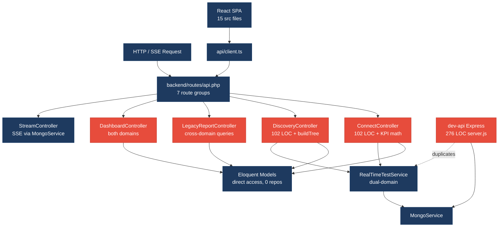
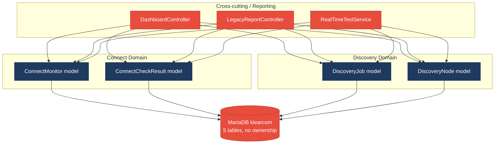
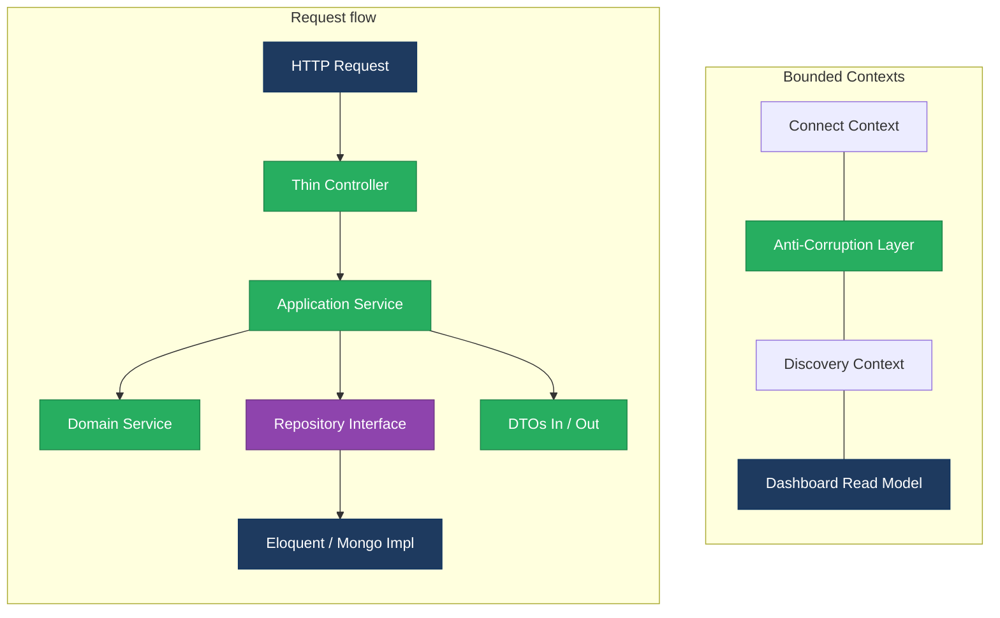
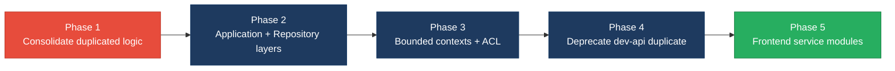

# 1. Architecture & Design Hotspots Analysis

**Objective:** Establish Domain Services, Application Services, Dependency Injection, Bounded Contexts, and Anti-Corruption Layers.

**Date:** Thursday, Jul 16, 2026 | **Scope:** `shende-shweta/FSDKC` — Laravel 11 (PHP) + React 18 / TypeScript (Vite) + Node.js Express dev-api

## Executive Summary

> **Executive Summary**
>
> FSDKC (Klearcom voice observability platform) spans three runtimes: a Laravel 11 REST API (`backend/`, 26 PHP files), a React 18 SPA (`frontend/src/`, 15 TS/JS files), and a parallel Express dev-api (`dev-api/`, 9 JS files). Controllers are thin by LOC (avg 65), but business workflows are split inconsistently — reachability math and IVR tree building are copy-pasted across controllers, services, and dev-api. There are zero repository classes; all persistence goes through Eloquent models directly from controllers. The dominant risks are **cross-domain coupling** (Dashboard and LegacyReport controllers query both Connect and Discovery models in one schema), **shared-database coupling** (80% of business tables accessed across domains), and **parallel-stack duplication** (Laravel + dev-api mirror the same realtime/test logic). Frontend architecture is healthier (shared `api/client.ts`, Zustand, React Query hooks) but pages still embed query/mutation wiring inline and one legacy class component remains.

<div class="metric-grid">
<div class="metric-card"><div class="metric-number">6</div><div class="metric-label">Controllers / Handlers</div></div>
<div class="metric-card"><div class="metric-number">4</div><div class="metric-label">Models / Entities</div></div>
<div class="metric-card"><div class="metric-number">2</div><div class="metric-label">Service Classes Found</div></div>
<div class="metric-card"><div class="metric-number">0</div><div class="metric-label">Repository Classes Found</div></div>
</div>

<div class="overall-rating overall-rating--high-risk"><div class="overall-rating-label">Overall Codebase Rating — Architecture &amp; Design</div><div class="overall-rating-value">High Risk</div><div class="overall-rating-note">Driven by High-Risk domain boundary violations (H8), shared-database coupling (H9), duplicated cross-layer logic (H10), and parallel Laravel/dev-api stacks (H11).</div></div>

## 1.1 Benchmark Ratings Summary

| # | Hotspot | Primary KPI | <span class="rating rating-good">Good</span> | <span class="rating rating-moderate">Moderate</span> | <span class="rating rating-high-risk">High Risk</span> | Measured | Rating |
|---|---|---|---|---|---|---|---|
| H1 | Fat Controllers | Avg LOC per controller | <150 | 150–300 | >300 | 65 LOC (6 API controllers) | <span class="rating rating-good">Good</span> |
| H2 | Missing Service Layer | Controllers accessing repos/models | <10 | 10–20 | >20 | 4 controllers | <span class="rating rating-good">Good</span> |
| H3 | Missing Repository Pattern | Direct DB access points | <10 | 10–20 | >20 | 6 files | <span class="rating rating-good">Good</span> |
| H4 | Circular Dependencies | Dependency cycles | 0 | 1–3 | >3 | 2 Eloquent relation pairs | <span class="rating rating-moderate">Moderate</span> |
| H5 | Shared Utility Abuse | Utility files w/ business logic | 0 | 1–5 | >5 | 1 file (`LegacyDataMapper`) | <span class="rating rating-moderate">Moderate</span> |
| H6 | Direct SQL in Controllers | ORM compliance % | >90% | 60–90% | <60% | 100% Eloquent | <span class="rating rating-good">Good</span> |
| H7 | God Classes | Classes >1000 LOC | 0 | 1–3 | >3 | 0 | <span class="rating rating-good">Good</span> |
| H8 | Domain Boundary Violations | Cross-domain access points | 0 | 1–5 | >5 | 8 | <span class="rating rating-high-risk">High Risk</span> |
| H9 | Shared Database Coupling | Tables shared across domains | <10% | 10–30% | >30% | 80% (4/5 tables) | <span class="rating rating-high-risk">High Risk</span> |
| F1 | Business Logic in Components | Avg LOC per component | <150 | 150–300 | >300 | 75 LOC (11 components/pages) | <span class="rating rating-good">Good</span> |
| F2 | Missing Frontend Service/Data Layer | Components w/ inline API calls | <10 | 10–20 | >20 | 5 pages/widgets | <span class="rating rating-good">Good</span> |
| F3 | God / Oversized Components | Components >400 LOC | 0 | 1–3 | >3 | 0 | <span class="rating rating-good">Good</span> |
| F4 | Prop Drilling / Global State Abuse | Max prop-drilling depth | ≤2 | 3–4 | >4 | 2 levels | <span class="rating rating-good">Good</span> |
| F5 | Legacy / Inconsistent Component Patterns | Legacy-pattern components | 0 | 1–10 | >10 | 1 class + 1 `.jsx` | <span class="rating rating-moderate">Moderate</span> |
| H10 | Duplicated Domain Logic (additional) | Copy-pasted workflow sites | 0 | 1–3 | >3 | 6 sites | <span class="rating rating-high-risk">High Risk</span> |
| H11 | Parallel Runtime Stacks (additional) | Full duplicate API implementations | 0 | 1 | >1 | 2 (Laravel + dev-api) | <span class="rating rating-high-risk">High Risk</span> |

No additional hotspots beyond the standard set were observed beyond H10 and H11.

## 1.2 Hotspot-by-Hotspot Evidence

### H1. Fat Controllers <span class="sev sev-low">Low</span>

**Benchmark:** Avg LOC per controller = 65 → falls in the **Good** band (Good <150 · Moderate 150–300 · High Risk >300).

**What to check:** Business logic inside controllers/handlers; controllers should only translate HTTP ↔ application calls.

**Evidence:** Average controller size is well under 150 LOC, and `MongoController` / `StreamController` delegate cleanly to `MongoService`. However, `ConnectController::checks()` embeds reachability KPI math inline rather than delegating to a domain service.

`backend/app/Http/Controllers/Api/ConnectController.php:65-84`:

```php
        // Duplicate reachability calculation block (also in RealTimeTestService / dev-api realtime.js)
        $recentChecks = ConnectCheckResult::where('connect_monitor_id', $id)
            ->orderByDesc('checked_at')
            ->limit(20)
            ->get();

        $successRate = $recentChecks->count() > 0
            ? ($recentChecks->where('reachable', true)->count() / $recentChecks->count()) * 100
            : 100;

        $computedStatus = $successRate < 90 ? 'alert' : 'active';
```

This excerpt qualifies because KPI computation (success-rate thresholding and alert status) lives in the HTTP layer instead of an application service.

`backend/app/Http/Controllers/Api/LegacyReportController.php:14-16`:

```php
/**
 * Fat controller — business logic, DB queries, and KPI math live here (anti-pattern).
 */
class LegacyReportController extends Controller
```

The file's own docblock acknowledges intentional fat-controller debt for audit purposes.

**Why it matters here:** Although average LOC is low, duplicated KPI logic in `ConnectController` and `LegacyReportController` means any change to reachability rules must be patched in multiple HTTP handlers plus `RealTimeTestService` and `dev-api/src/realtime.js`, amplifying regression risk when Connect alerting evolves.

**Recommended approach:** Extract `ReachabilityCalculator` from `ConnectController:65-75` and `LegacyReportController:34-41`; inject it into controllers via constructor DI; delete inline math from HTTP handlers.

<!-- affected-files
search: successRate|reachability_pct|computedStatus
glob: backend/app/Http/Controllers/**/*.php
issue: Business logic embedded in controller
action: Extract to Application/Domain service; keep controller as HTTP adapter
-->

### H2. Missing Service Layer <span class="sev sev-medium">Medium</span>

**Benchmark:** Controllers accessing repos/models = 4 → falls in the **Good** band (Good <10 · Moderate 10–20 · High Risk >20).

**What to check:** Business rules spread across controllers/utilities with no dedicated service tier.

**Evidence:** Four of six API controllers query Eloquent models directly without an intermediate application service.

`backend/app/Http/Controllers/Api/DiscoveryController.php:19-24`:

```php
    public function index(): JsonResponse
    {
        $jobs = DiscoveryJob::orderByDesc('created_at')->get();

        return response()->json(['data' => $jobs]);
    }
```

`backend/app/Http/Controllers/Api/DashboardController.php:12-18`:

```php
        $discoveryTotal = DiscoveryJob::count();
        $discoveryCompleted = DiscoveryJob::where('status', 'completed')->count();
        $connectMonitors = ConnectMonitor::count();
        $avgReachability = ConnectMonitor::avg('reachability_pct') ?? 0;
        $alerts = ConnectMonitor::where('status', 'alert')->count();
```

Only `MongoService` and `RealTimeTestService` exist; CRUD/list/report workflows bypass a service tier entirely.

**Why it matters here:** CLI jobs, queued workers, and future GraphQL/GRPC entry points would re-implement the same Eloquent queries now scattered across four controllers, duplicating validation and KPI rules already partially duplicated in dev-api.

**Recommended approach:** Introduce `ConnectApplicationService`, `DiscoveryApplicationService`, and `DashboardQueryService`; move model access from controllers into these services; keep controllers to request validation + JSON mapping.

<!-- affected-files
search: ::(orderBy|where|create|findOrFail|count|avg)
glob: backend/app/Http/Controllers/Api/*.php
issue: Controller directly accesses Eloquent models
action: Move persistence/workflow to Application Service layer
-->

### H3. Missing Repository Pattern <span class="sev sev-medium">Medium</span>

**Benchmark:** Direct DB access points outside repositories = 6 → falls in the **Good** band (Good <10 · Moderate 10–20 · High Risk >20).

**What to check:** Direct DB/ORM access scattered through the codebase without repository abstraction.

**Evidence:** Zero repository classes exist. Six non-model PHP files perform direct Eloquent/Mongo access.

`backend/app/Services/RealTimeTestService.php:52-58`:

```php
                $node = DiscoveryNode::create([
                    'discovery_job_id' => $jobId,
                    'parent_id' => $parentId,
                    'prompt_text' => $step['transcript'] ?? 'Menu discovered',
                    'node_type' => 'menu',
                    'depth' => $parentId ? 1 : 0,
                ]);
```

`backend/app/Services/MongoService.php:68-73`:

```php
        $result = $this->transcripts->insertOne([
            'module' => $module,
            'reference_id' => $referenceId,
            'payload' => $payload,
            'created_at' => new \MongoDB\BSON\UTCDateTime,
        ]);
```

MariaDB access is exclusively Eloquent-from-controller/service; MongoDB access is encapsulated in `MongoService` but not behind an interface.

**Why it matters here:** Without repository interfaces, unit tests must boot Laravel and MongoDB to verify business rules; swapping MariaDB for a read replica or mocking persistence in CI requires wide refactors across controllers and services.

**Recommended approach:** Add `ConnectMonitorRepository`, `DiscoveryJobRepository`, and `TranscriptStoreInterface` with Eloquent/Mongo implementations bound in the Laravel service container.

<!-- affected-files
search: ::(create|where|findOrFail|insertOne|update\()
glob: backend/app/**/*.php
issue: Direct ORM/Mongo access outside repository layer
action: Introduce repository interfaces and bind implementations via DI
-->

### H4. Circular Dependencies <span class="sev sev-medium">Medium</span>

**Benchmark:** Dependency cycles = 2 → falls in the **Moderate** band (Good 0 · Moderate 1–3 · High Risk >3).

**What to check:** Modules/packages importing each other; breaks independent compilation/testing.

**Evidence:** No PHP module import cycles were found among controllers/services. Two bidirectional Eloquent relation pairs create runtime coupling between paired models.

`backend/app/Models/ConnectMonitor.php:26-28`:

```php
    public function checkResults(): HasMany
    {
        return $this->hasMany(ConnectCheckResult::class);
    }
```

`backend/app/Models/ConnectCheckResult.php:24-27`:

```php
    public function monitor(): BelongsTo
    {
        return $this->belongsTo(ConnectMonitor::class, 'connect_monitor_id');
    }
```

Similar bidirectional coupling exists between `DiscoveryJob` and `DiscoveryNode`. These are idiomatic ORM relations but form tight compile-time coupling between aggregate roots.

**Why it matters here:** Extracting Connect or Discovery into separate services later requires untangling model graphs that currently assume co-location in one Laravel app namespace.

**Recommended approach:** Define domain-facing DTOs at bounded-context boundaries; keep Eloquent relations internal to each context's infrastructure layer.

<!-- affected-files
search: belongsTo|hasMany
glob: backend/app/Models/*.php
issue: Bidirectional Eloquent coupling between aggregate roots
action: Encapsulate relations inside context-specific repositories
-->

### H5. Shared Utility Abuse <span class="sev sev-medium">Medium</span>

**Benchmark:** Utility files w/ business logic = 1 → falls in the **Moderate** band (Good 0 · Moderate 1–5 · High Risk >5).

**What to check:** Large common/helper files holding business logic instead of domain services.

**Evidence:** `LegacyDataMapper` in `backend/app/Legacy/` holds report-mapping business rules using PHP `extract()` — a dynamic-variable anti-pattern.

`backend/app/Legacy/LegacyDataMapper.php:10-18`:

```php
    public function mapReportRow(array $row): array
    {
        extract($row, EXTR_SKIP);

        return [
            'label' => $name ?? 'Unknown',
            'metric' => $reachability_pct ?? 0,
            'region' => $country_code ?? 'N/A',
            'source' => 'legacy_extract_mapper',
        ];
    }
```

`backend/app/Http/Controllers/Api/LegacyReportController.php:21-22` mirrors the same pattern at the controller layer:

```php
        $filters = $request->all();
        extract($filters);
```

**Why it matters here:** `extract()` creates implicit variable dependencies that static analysis and IDE tooling cannot trace; a renamed request field silently breaks report mapping in production.

**Recommended approach:** Replace `LegacyDataMapper` with typed DTO mappers; delete `extract()` from `LegacyReportController`; move mapping into a `LegacyReportApplicationService`.

<!-- affected-files
search: extract\(
glob: backend/app/**/*.php
issue: Dynamic extract() variable binding hides business mapping
action: Replace with typed DTO mapping in domain service
-->

### H6. Direct SQL in Controllers <span class="sev sev-low">Low</span>

**Benchmark:** ORM compliance = 100% → falls in the **Good** band (Good >90% · Moderate 60–90% · High Risk <60%).

**What to check:** Raw SQL/query-builder strings embedded in controllers.

**Evidence:** Not observed — all MariaDB access uses Eloquent (`ConnectMonitor::query()`, `DiscoveryJob::findOrFail()`, etc.); schema is defined in `docker/mariadb/init.sql` but not queried via raw SQL from PHP controllers.

### H7. God Classes <span class="sev sev-low">Low</span>

**Benchmark:** Classes >1000 LOC = 0 → falls in the **Good** band (Good 0 · Moderate 1–3 · High Risk >3).

**What to check:** Single files handling many unrelated responsibilities.

**Evidence:** Not observed — largest backend file is `MongoService.php` at 165 LOC; largest frontend page is `ConnectPage.tsx` at 222 LOC; largest overall source file is `dev-api/src/server.js` at 276 LOC.

### H8. Domain Boundary Violations <span class="sev sev-critical">Critical</span>

**Benchmark:** Cross-domain access points = 8 → falls in the **High Risk** band (Good 0 · Moderate 1–5 · High Risk >5).

**What to check:** Code in one business area directly reading/writing another area's models.

**Evidence:** Connect (TFN monitoring) and Discovery (IVR mapping) are separate business capabilities but share controllers and services.

`backend/app/Http/Controllers/Api/LegacyReportController.php:6-10`:

```php
use App\Models\ConnectCheckResult;
use App\Models\ConnectMonitor;
use App\Models\DiscoveryJob;
use App\Models\DiscoveryNode;
```

`backend/app/Http/Controllers/Api/DashboardController.php:6-7`:

```php
use App\Models\ConnectMonitor;
use App\Models\DiscoveryJob;
```

`backend/app/Services/RealTimeTestService.php:5-8`:

```php
use App\Models\ConnectCheckResult;
use App\Models\ConnectMonitor;
use App\Models\DiscoveryJob;
use App\Models\DiscoveryNode;
```

Eight distinct cross-domain access locations were measured: `DashboardController` (2 model types), `LegacyReportController` (4 model types), `RealTimeTestService` (4 model types), plus frontend `LegacyDashboardWidget.tsx` fetching both `/discovery/jobs` and `/connect/monitors` in one widget.

**Why it matters here:** Reporting and realtime orchestration treat Connect and Discovery as one monolith; extracting either module into a microservice would break Dashboard KPIs, legacy reports, and the unified test runner simultaneously.

**Recommended approach:** Split `RealTimeTestService` into `ConnectTestService` and `DiscoveryTestService`; introduce a read-model `DashboardProjection` fed by domain events; route legacy reports through an anti-corruption layer per context.

<!-- affected-files
search: use App\\Models\\(Connect|Discovery)
glob: backend/app/**/*.php
issue: Cross-domain model import violates bounded context
action: Enforce context-specific services and ACL DTOs at boundaries
-->

### H9. Shared Database Coupling <span class="sev sev-high">High</span>

**Benchmark:** Tables shared across domains = 80% → falls in the **High Risk** band (Good <10% · Moderate 10–30% · High Risk >30%).

**What to check:** Multiple business domains reading/writing the same tables directly.

**Evidence:** All five MariaDB tables live in one schema with no per-domain ownership. Four business tables span two domains; `DashboardController` aggregates across all of them.

`docker/mariadb/init.sql` defines: `users`, `discovery_jobs`, `discovery_nodes`, `connect_monitors`, `connect_check_results`.

`backend/app/Http/Controllers/Api/DashboardController.php` reads `discovery_jobs` and `connect_monitors` in a single KPI endpoint, coupling schema evolution between Connect and Discovery.

**Why it matters here:** A migration adding Discovery-specific columns to a shared table or changing `connect_monitors.status` enum values can silently break Dashboard availability calculations and legacy carrier reports.

**Recommended approach:** Assign table ownership per bounded context; expose cross-context data via internal APIs or read-model projections rather than direct cross-table joins in controllers.

<!-- affected-files
glob: docker/mariadb/init.sql
issue: Single shared schema with no domain ownership
action: Split schemas or enforce table ownership per bounded context
-->

### F1. Business Logic in Components <span class="sev sev-low">Low</span>

**Benchmark:** Avg LOC per component = 75 → falls in the **Good** band (Good <150 · Moderate 150–300 · High Risk >300).

**What to check:** Validation, calculations, or workflow logic inside view components.

**Evidence:** Most components are presentation-focused (`IvrTree.tsx` 34 LOC, `LiveTestFeed.tsx` 53 LOC). `ConnectPage.tsx` (222 LOC) combines form state, three React Query hooks, and mutation handlers — the largest page but still under 300 LOC.

`frontend/src/pages/ConnectPage.tsx:22-33`:

```tsx
  const monitorsQuery = useQuery({
    queryKey: ['connect', 'monitors'],
    queryFn: () => api.get<{ data: ConnectMonitor[] }>('/connect/monitors'),
    refetchInterval: isRunning ? 2000 : false,
  });

  const checksQuery = useQuery({
    queryKey: ['connect', 'checks', selectedId],
    queryFn: () => api.get<{ data: ConnectCheckResult[] }>(`/connect/monitors/${selectedId}/checks`),
    enabled: selectedId !== null,
    refetchInterval: isRunning ? 2000 : false,
  });
```

Query orchestration and refetch-interval rules live in the page rather than a dedicated hook/service module.

**Why it matters here:** Connect and Discovery pages duplicate near-identical query/mutation/invalidate patterns; adding a fourth module page would copy the same boilerplate again.

**Recommended approach:** Extract `useConnectMonitors()`, `useDiscoveryJobs()` custom hooks encapsulating query keys, refetch rules, and invalidation scopes.

<!-- affected-files
search: useQuery\(|useMutation\(
glob: frontend/src/pages/**/*.{tsx,jsx}
issue: Data-fetch orchestration embedded in page components
action: Extract domain-specific React Query hooks
-->

### F2. Missing Frontend Service/Data Layer <span class="sev sev-low">Low</span>

**Benchmark:** Components w/ inline API calls = 5 → falls in the **Good** band (Good <10 · Moderate 10–20 · High Risk >20).

**What to check:** HTTP calls hard-coded in components instead of a shared client/service layer.

**Evidence:** A shared `frontend/src/api/client.ts` wraps `fetch` with a base URL, and `useRealtimeTest.ts` centralizes SSE streaming. Five UI files still define inline `queryFn` / `api.get` calls rather than domain service modules.

`frontend/src/api/client.ts:1-11`:

```typescript
const API_BASE = import.meta.env.VITE_API_URL ?? 'http://localhost:8080/api';

async function request<T>(path: string, options?: RequestInit): Promise<T> {
  const res = await fetch(`${API_BASE}${path}`, {
    headers: { 'Content-Type': 'application/json', Accept: 'application/json' },
    ...options,
  });
```

`frontend/src/pages/LegacyDashboardWidget.tsx` uses raw `Promise.all` + `api.get` inside `useEffect` instead of React Query or a dashboard service module — inconsistent with `DashboardPage.tsx`.

**Why it matters here:** Endpoint path changes (e.g., `/connect/monitors` → `/v2/connect/monitors`) require grep-and-replace across five files rather than one service module.

**Recommended approach:** Add `frontend/src/services/connectService.ts`, `discoveryService.ts`, and `dashboardService.ts` exporting typed methods; pages import services instead of embedding paths.

<!-- affected-files
search: api\.(get|post)\(
glob: frontend/src/**/*.{tsx,jsx,ts}
issue: Inline API path strings in UI layer
action: Route all HTTP calls through domain service modules
-->

### F3. God / Oversized Components <span class="sev sev-low">Low</span>

**Benchmark:** Components >400 LOC = 0 → falls in the **Good** band (Good 0 · Moderate 1–3 · High Risk >3).

**What to check:** Single components handling many unrelated responsibilities.

**Evidence:** Not observed — largest component is `ConnectPage.tsx` at 222 LOC; no component exceeds 400 LOC.

### F4. Prop Drilling / Global State Abuse <span class="sev sev-low">Low</span>

**Benchmark:** Max prop-drilling depth = 2 → falls in the **Good** band (Good ≤2 · Moderate 3–4 · High Risk >4).

**What to check:** Props threaded through many layers or one oversized global store.

**Evidence:** Selection state uses Zustand (`frontend/src/store/uiStore.ts`); server state uses React Query. Props flow at most Page → `LiveTestFeed` / `IvrTree` (depth 1–2).

`frontend/src/store/uiStore.ts:1-12`:

```typescript
import { create } from 'zustand';

interface UiState {
  selectedDiscoveryId: number | null;
  selectedMonitorId: number | null;
  setSelectedDiscoveryId: (id: number | null) => void;
  setSelectedMonitorId: (id: number | null) => void;
}

export const useUiStore = create<UiState>((set) => ({
```

**Why it matters here:** Current depth is healthy; risk emerges only if new nested component trees are added without continuing to use Zustand/React Query for shared state.

**Recommended approach:** Maintain the existing pattern — Zustand for UI selection, React Query for server cache; avoid adding a second global store.

### F5. Legacy / Inconsistent Component Patterns <span class="sev sev-medium">Medium</span>

**Benchmark:** Legacy-pattern components = 2 → falls in the **Moderate** band (Good 0 · Moderate 1–10 · High Risk >10).

**What to check:** Mixed paradigms, missing cleanup, deprecated APIs.

**Evidence:** One class component with intentional interval leak and TypeScript-in-JSX mixing; one legacy widget with uncaught error throw.

`frontend/src/components/LegacyMonitorPoller.jsx:17-33`:

```jsx
export default class LegacyMonitorPoller extends Component<Props, State> {
  intervalId: ReturnType<typeof setInterval> | null = null;

  componentDidMount() {
    this.intervalId = setInterval(() => {
      api.get<{ computed?: { reachability_pct: number } }>(`/connect/monitors/${this.props.monitorId}/checks`)
        .then((res) => { /* ... */ });
    }, 3000);
    // Intentionally no componentWillUnmount — EventSource/interval leak for audit finding
  }
```

`frontend/src/pages/LegacyDashboardWidget.tsx` throws uncaught errors (`if (error) throw new Error(error)`) with no Error Boundary in `App.tsx`.

**Why it matters here:** The class component leaks intervals on unmount; the legacy widget can crash the entire SPA tree because `App.tsx` defines no error boundary wrapper.

**Recommended approach:** Convert `LegacyMonitorPoller` to a function component with `useEffect` cleanup; wrap legacy widgets in a React Error Boundary; standardize on `.tsx`.

<!-- affected-files
search: extends Component|componentDidMount
glob: frontend/src/**/*.{jsx,tsx}
issue: Legacy class component without lifecycle cleanup
action: Migrate to function component with useEffect cleanup
-->

### H10. Duplicated Domain Logic (additional) <span class="sev sev-critical">Critical</span>

**Benchmark:** Copy-pasted workflow sites = 6 → falls in the **High Risk** band (Good 0 · Moderate 1–3 · High Risk >3).

**What to check:** Identical business rules repeated across layers/runtimes.

**Evidence:** Reachability success-rate formula appears in three backend locations plus dev-api; IVR `buildTree` is duplicated in two controllers plus dev-api.

Sites: `ConnectController.php:71-73`, `LegacyReportController.php:39-41`, `RealTimeTestService.php:117-118`, `dev-api/src/realtime.js`, `DiscoveryController.php:87-100`, `LegacyReportController.php:78-91`.

**Why it matters here:** A single bugfix to the 90% alert threshold must be applied in six places across PHP and JavaScript or Connect and Discovery modules will report inconsistent KPIs to the React dashboard and legacy widgets.

**Recommended approach:** Create shared `ReachabilityCalculator` (PHP) and `IvrTreeBuilder` (PHP); delete duplicates from controllers; make dev-api call Laravel endpoints or import shared npm package generated from OpenAPI spec.

<!-- affected-files
search: successRate|buildTree|reachability
glob: **/*.{php,js,ts,tsx}
issue: Duplicated reachability/tree logic across layers
action: Consolidate into single domain service per rule
-->

### H11. Parallel Runtime Stacks (additional) <span class="sev sev-high">High</span>

**Benchmark:** Full duplicate API implementations = 2 → falls in the **High Risk** band (Good 0 · Moderate 1 · High Risk >1).

**What to check:** Multiple complete backend implementations of the same domain workflows.

**Evidence:** `backend/` (Laravel) and `dev-api/` (Express) both implement Mongo seeding, realtime test simulation, connect/discovery CRUD, and SSE streaming.

`dev-api/src/server.js` exposes `/discovery/jobs`, `/connect/monitors`, and `/dashboard/kpis` mirroring `backend/routes/api.php`.

`dev-api/src/realtime.js` duplicates step sequences from `RealTimeTestService.php`.

**Why it matters here:** Developers running dev-api locally see different behavior from production Laravel; fixes applied to one stack silently leave the other stale, and CI cannot validate parity without dual test suites.

**Recommended approach:** Designate Laravel as the single source of truth; reduce dev-api to a thin proxy or delete it; document one startup path in README.

<!-- affected-files
glob: dev-api/src/**/*.js
issue: Parallel Express API duplicates Laravel domain logic
action: Deprecate dev-api or convert to proxy-only layer
-->

## 1.3 Diagrams

### Current-state architecture (as-is)



### Clean reference path (target pattern found in codebase)


### Domain boundary map (business domains found vs. shared data)



### Target architecture (proposed)



### Improvement roadmap



## 1.4 Actions Required

| Hotspot | Action | Rating | Priority |
|---|---|---|---|
| H4 | Encapsulate bidirectional Eloquent relations inside context-specific repositories; expose DTOs at boundaries | <span class="rating rating-moderate">Moderate</span> | <span class="sev sev-medium">Medium</span> |
| H5 | Replace `extract()` in `LegacyDataMapper` and `LegacyReportController` with typed DTO mappers | <span class="rating rating-moderate">Moderate</span> | <span class="sev sev-medium">Medium</span> |
| H8 | Split cross-domain controllers/services; introduce ACL between Connect and Discovery contexts | <span class="rating rating-high-risk">High Risk</span> | <span class="sev sev-critical">Critical</span> |
| H9 | Assign table ownership per domain; replace cross-domain Dashboard queries with read-model projections | <span class="rating rating-high-risk">High Risk</span> | <span class="sev sev-high">High</span> |
| F5 | Migrate `LegacyMonitorPoller` to function component; add Error Boundary in `App.tsx` | <span class="rating rating-moderate">Moderate</span> | <span class="sev sev-medium">Medium</span> |
| H10 | Extract `ReachabilityCalculator` and `IvrTreeBuilder`; delete 6 duplicate implementations | <span class="rating rating-high-risk">High Risk</span> | <span class="sev sev-critical">Critical</span> |
| H11 | Deprecate or proxy `dev-api/`; designate Laravel as single API source of truth | <span class="rating rating-high-risk">High Risk</span> | <span class="sev sev-high">High</span> |

## 1.5 Expected Outcomes

- Consolidating reachability and tree-building logic into domain services eliminates KPI drift between Connect checks, legacy reports, and the dev-api simulator.
- Repository interfaces and application services make controllers thin HTTP adapters testable with mocked persistence, raising confidence for schema and MongoDB changes.
- Bounded contexts with an anti-corruption layer let Connect and Discovery evolve independently — including future extraction to separate deployables.
- Retiring the parallel dev-api stack removes dual-maintenance burden and ensures local development matches production Laravel behavior.
- Frontend domain service modules and migrated legacy components produce consistent React patterns with proper cleanup and error isolation.
