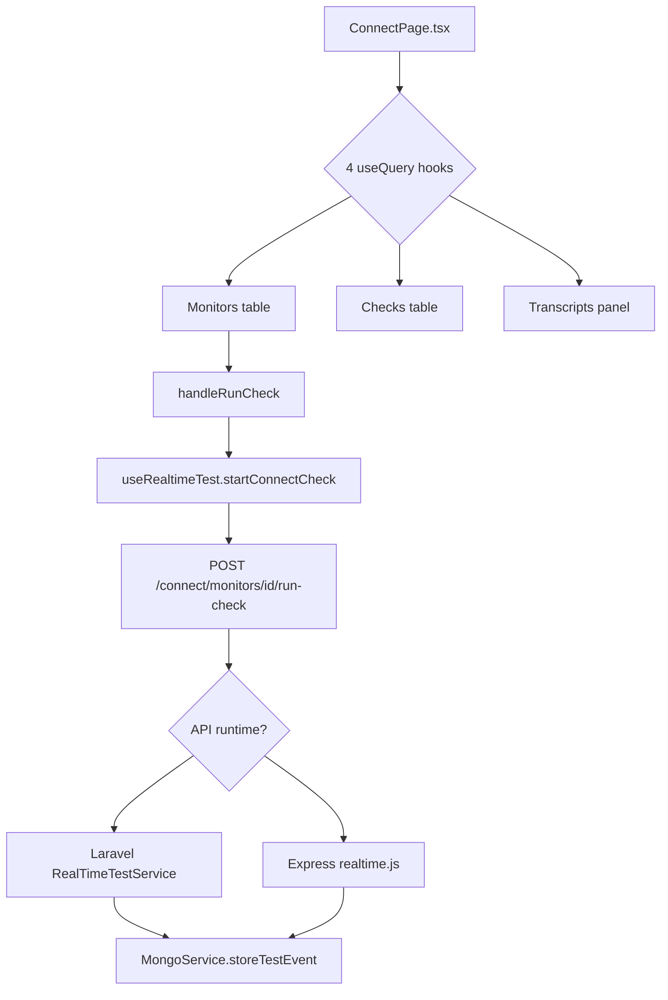
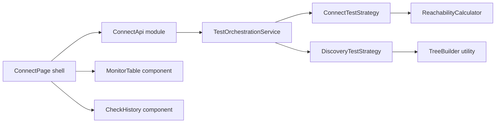
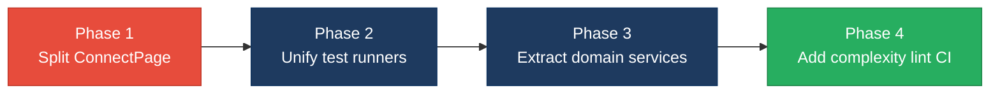

# 2. Code Quality & Complexity Hotspots Analysis

**Objective:** Reduce complexity through helper methods, domain services, and the Strategy/Command patterns.

**Date:** July 16, 2026 | **Scope:** `shende-shweta/FSDKC` (main) — Laravel 11 PHP backend, Express dev-api (Node.js), React 18 + TypeScript + Vite frontend

## Executive Summary

> **Executive Summary**
>
> Analysis covered **50 source files** across three layers: **17 frontend** (898 LOC), **26 backend** (918 LOC), and **6 dev-api** (720 LOC), totaling **2,598 LOC** of application code. No stack-specific complexity linter (ESLint `complexity`, PHPMD, Sonar) is configured; metrics were derived via manual branch counting and LOC analysis against GitHub `main`. The codebase is young (**3 commits**) with low churn and clear single-author ownership, but **structural complexity and duplication are elevated**: `ConnectPage.tsx` registers **cyclomatic complexity ≈36** and **201 LOC** in a single component, and **parallel Laravel + Express implementations** duplicate realtime test workflows and KPI logic (~**11%** estimated business-rule duplication). Overall health is **High Risk**, driven by frontend page complexity and cross-runtime business-logic duplication despite favorable churn and ownership signals.

<div class="metric-grid">
<div class="metric-card"><div class="metric-number">50</div><div class="metric-label">Files Analyzed</div></div>
<div class="metric-card"><div class="metric-number">1</div><div class="metric-label">Functions/Methods Over 200 LOC</div></div>
<div class="metric-card"><div class="metric-number">0</div><div class="metric-label">Classes/Files Over 1000 LOC</div></div>
<div class="metric-card"><div class="metric-number">36</div><div class="metric-label">Highest Cyclomatic Complexity</div></div>
</div>

<div class="overall-rating overall-rating--high-risk"><div class="overall-rating-label">Overall Codebase Rating — Code Quality &amp; Complexity</div><div class="overall-rating-value">High Risk</div><div class="overall-rating-note">Driven by H1 cyclomatic complexity (36 in ConnectPage), H3 oversized ConnectPage component (201 LOC), and H4 cross-runtime business-logic duplication (~11%).</div></div>

<div class="hotspot-score hotspot-score--moderate"><div class="hotspot-score-label">Hotspot Score (weighted composite)</div><div class="hotspot-score-value">46 / 100 — Moderate</div><div class="hotspot-score-formula">Hotspot Score = (Cyclomatic Complexity × 25%) + (Code Churn × 25%) + (Defect Density × 20%) + (Class/Function Size × 15%) + (Business Logic Duplication × 10%) + (Developer Ownership Risk × 5%) = (85×0.25) + (10×0.25) + (15×0.20) + (72×0.15) + (78×0.10) + (5×0.05) = 46</div></div>

## 2.1 Benchmark Ratings Summary

| # | Hotspot | Primary KPI | <span class="rating rating-good">Good</span> | <span class="rating rating-moderate">Moderate</span> | <span class="rating rating-high-risk">High Risk</span> | Measured | Rating |
|---|---|---|---|---|---|---|---|
| H1 | High Cyclomatic Complexity | Max complexity per method | <10 | 10–20 | >20 | **36** (`ConnectPage.tsx` component) | <span class="rating rating-high-risk">High Risk</span> |
| H2 | Large Classes | Largest class LOC | <300 | 300–1000 | >1000 | **224** (`dev-api/src/server.js`) | <span class="rating rating-good">Good</span> |
| H3 | Large Functions | Largest function LOC | <50 | 50–200 | >200 | **201** (`ConnectPage.tsx` component) | <span class="rating rating-high-risk">High Risk</span> |
| H4 | Business Logic Duplication | Duplicated business logic % | <5% | 5–10% | >10% | **~11%** (est. ~285 LOC duplicated / 2,598 total) | <span class="rating rating-high-risk">High Risk</span> |
| H5 | Duplicate Code (general) | Overall duplicate code % | <5% | 5–10% | >10% | **~8%** (structural + block duplicates) | <span class="rating rating-moderate">Moderate</span> |
| H6 | High Churn Areas | Monthly changes (top files) | <5 | 5–10 | >10 | **2** (max per file, 6-month window) | <span class="rating rating-good">Good</span> |
| H7 | Defect-Prone Files | Fix commits (hottest file) | 1–3 | 4–5 | >5 | **1** (`frontend/src/App.tsx`, logo fix) | <span class="rating rating-good">Good</span> |
| H8 | Ownership Issues | Top-author ownership % | >80% | 60–80% | <60% | **100%** (single author `ksabai-gl` on hot files) | <span class="rating rating-good">Good</span> |
| H9 | Dual API Runtimes (additional) | Parallel endpoint implementations | 0 | 1 runtime | 2+ full stacks | **2** (Laravel + Express) | <span class="rating rating-high-risk">High Risk</span> |
| H10 | Missing Lifecycle Cleanup (additional) | Components with interval/SSE leak | 0 | 1 | 2+ | **1** (`LegacyMonitorPoller.jsx`) | <span class="rating rating-moderate">Moderate</span> |

### Hotspot Score breakdown

| Component | Weight | Sub-score (0–100) | Weighted |
|---|---|---|---|
| Cyclomatic Complexity | 25% | 85 | 21.25 |
| Code Churn | 25% | 10 | 2.50 |
| Defect Density | 20% | 15 | 3.00 |
| Class/Function Size | 15% | 72 | 10.80 |
| Business Logic Duplication | 10% | 78 | 7.80 |
| Developer Ownership Risk | 5% | 5 | 0.25 |
| **Hotspot Score** | **100%** | | **46 / 100** |

## 2.2 Hotspot-by-Hotspot Evidence

### H1. High Cyclomatic Complexity <span class="sev sev-critical">Critical</span>

**Benchmark:** `Max complexity per method = 36` → falls in the **High Risk** band (Good <10 · Moderate 10–20 · High Risk >20).

The highest-complexity unit is the `ConnectPage` React component, not a discrete handler. Nested JSX conditionals (`?:`, `&&`, `.map()`), four parallel React Query hooks, and inline mutation handlers produce **≈36 decision points** in one render function — well above the >20 threshold.

**Example 1 — `frontend/src/pages/ConnectPage.tsx:9-221`**

```tsx
export default function ConnectPage() {
  const monitorsQuery = useQuery({ /* … */ refetchInterval: isRunning ? 2000 : false });
  const checksQuery = useQuery({ enabled: selectedId !== null, refetchInterval: isRunning ? 2000 : false });
  const transcriptsQuery = useQuery({ enabled: selectedId !== null, refetchInterval: isRunning ? 1500 : false });
  // … nested ternaries for loading / empty / table states across 3 sections
  {monitorsQuery.isLoading ? <div className="empty">Loading…</div> : ( <table>…</table> )}
  {!selectedId ? <div className="empty">…</div> : checksQuery.isLoading ? … : checksQuery.data?.data.length ? … : …}
}
```

**Why it matters here:** Every new Connect feature (filters, bulk actions, export) must navigate 36 branch paths in one file. Regression risk is high because React Query `refetchInterval` toggles and selection state interact across three tables and a transcript panel without extracted sub-components or a state machine.

**Recommended approach:**
1. Extract `MonitorForm`, `MonitorTable`, `CheckHistoryPanel`, and `TranscriptPanel` from `ConnectPage.tsx`.
2. Move query-key definitions and invalidation into `frontend/src/api/connectApi.ts`.
3. Apply a **Command pattern** for `handleRunCheck` (encapsulate start + invalidate queries).

**Example 2 — `dev-api/src/realtime.js:104-179` (`runConnectTest`)**

```javascript
export async function runConnectTest(monitorId, sessionId) {
  const reachable = Math.random() > 0.2;
  for (const step of CONNECT_STEPS) {
    await sleep(600 + Math.random() * 500);
    const stepPayload = { type: 'step', ...step, timestamp: new Date().toISOString() };
    if (step.event === 'check_complete') {
      stepPayload.reachable = reachable;
      stepPayload.latency_ms = reachable ? Math.floor(180 + Math.random() * 300) : null;
    }
    await storeTestEvent(sessionId, 'connect', monitorId, stepPayload);
  }
  // reachability rate, monitor update, transcript, diagnostic — 6 more branches
}
```

**Why it matters here:** The Node `runConnectTest` mirrors Laravel `RealTimeTestService::runConnectTest` with 16 branch points. Divergence between runtimes will produce inconsistent demo behavior.

**Recommended approach:** Extract shared step definitions to a JSON schema; implement **Strategy** classes per runtime that consume the same step contract.

<!-- affected-files
search: (isLoading|isRunning|refetchInterval|\.map\(|useQuery|useMutation)
glob: frontend/src/**/*.{tsx,ts,jsx}
issue: High cyclomatic complexity in page/hook components
action: Extract sub-components and dedicated hooks; target CC <10 per unit
-->

<!-- affected-files
search: (if\s*\(|else|foreach|for\s*\(|switch|catch|&&|\|\|)
glob: {backend/app/**/*.php,dev-api/src/**/*.js}
issue: Branch-heavy service/test-runner methods
action: Decompose into step handlers using Command/Strategy pattern
-->

### H2. Large Classes <span class="sev sev-low">Low</span>

**Benchmark:** `Largest class LOC = 224` → falls in the **Good** band (Good <300 · Moderate 300–1000 · High Risk >1000).

No file exceeds 1,000 LOC. The largest units are `dev-api/src/server.js` (224 LOC), `frontend/src/pages/ConnectPage.tsx` (208 LOC), and `frontend/src/pages/DiscoveryPage.tsx` (162 LOC). All remain under the 300 LOC "Good" threshold for file size, though frontend pages are approaching Moderate.

**Evidence:** Not observed above the 300 LOC file threshold — largest file is `dev-api/src/server.js` at 224 LOC. Frontend pages (`ConnectPage.tsx` 208, `DiscoveryPage.tsx` 162) are large relative to peers but not class/file hotspots by KPI.

### H3. Large Functions <span class="sev sev-high">High</span>

**Benchmark:** `Largest function LOC = 201` → falls in the **High Risk** band (Good <50 · Moderate 50–200 · High Risk >200).

**Example 1 — `frontend/src/pages/ConnectPage.tsx:9-221`**

```tsx
export default function ConnectPage() {
  // 201 executable lines: 4 queries, 1 mutation, 2 handlers, 4 UI sections
  return ( <> … </> );
}
```

**Why it matters here:** A 201-line component violates the <100 LOC best-practice ceiling for React pages. It mixes form state, SSE-driven live feed, tabular data, and transcript rendering — four responsibilities in one function.

**Recommended approach:** Split into four components under `frontend/src/pages/connect/`; keep `ConnectPage` as a thin orchestrator (<50 LOC).

**Example 2 — `dev-api/src/seed-data.js:1-118` (`getSeedDocuments`)**

```javascript
export function getSeedDocuments() {
  // 118 LOC of inline seed document definitions
  return [ /* monitors, jobs, nodes, checks, transcripts … */ ];
}
```

**Why it matters here:** Seed data as one function is hard to diff and extend; new modules will bloat it further.

**Recommended approach:** Move seed fixtures to `dev-api/src/fixtures/*.json` loaded by a 20-line factory.

<!-- affected-files
glob: frontend/src/pages/*.{tsx,jsx}
issue: Oversized page components (>150 LOC)
action: Split into feature sub-components and custom hooks; cap page shell at <80 LOC
-->

### H4. Business Logic Duplication <span class="sev sev-critical">Critical</span>

**Benchmark:** `Duplicated business logic % = ~11%` → falls in the **High Risk** band (Good <5% · Moderate 5–10% · High Risk >10%).

**Example 1 — Reachability rate formula (3 implementations)**

`backend/app/Services/RealTimeTestService.php:117-124`:

```php
$recent = ConnectCheckResult::where('connect_monitor_id', $monitorId)->orderByDesc('checked_at')->limit(20)->get();
$rate = $recent->count() > 0 ? ($recent->where('reachable', true)->count() / $recent->count()) * 100 : 100;
$monitor->update(['reachability_pct' => round($rate, 2), 'status' => $rate < 90 ? 'alert' : 'active']);
```

`dev-api/src/realtime.js:146-153` — identical success-rate and alert-threshold logic on in-memory arrays.

`backend/app/Http/Controllers/Api/ConnectController.php:65-74` — same formula inlined in `checks()`.

**Why it matters here:** The 90% alert threshold and 20-check rolling window are business rules copied three times. Changing the threshold requires coordinated edits across PHP service, PHP controller, and Node runtime.

**Recommended approach:** Extract `ReachabilityCalculator` domain service in Laravel; expose via API contract that dev-api imports or code-generates from OpenAPI.

**Example 2 — Parallel realtime test runners**

`backend/app/Services/RealTimeTestService.php:22-79` (`runDiscoveryTest`) and `dev-api/src/realtime.js:34-102` share **8/11 workflow keywords** (reachable, latency, status, node, carrier, ivr, mongo, check) and identical step sequences.

**Why it matters here:** Two full implementations of Discovery and Connect test orchestration exist — a classic **business-logic duplication** hotspot that will drift on every feature addition.

**Recommended approach:** Designate Laravel as the single orchestration runtime; reduce dev-api to a thin proxy, or extract shared step definitions into `docs/contracts/test-steps.json`.

**Example 3 — Dashboard KPI duplication**

`dev-api/src/server.js:58-79` duplicates `backend/app/Http/Controllers/Api/DashboardController.php:12-36` KPI aggregation (IVR availability %, reachability average, alert counts).

<!-- affected-files
search: (reachability_pct|successRate|rate\s*<\s*90|buildTree|runConnectTest|runDiscoveryTest)
glob: {backend/**/*.php,dev-api/src/**/*.js}
issue: Duplicated business rules across Laravel and Express
action: Consolidate into shared domain services; single source of truth for KPI and test workflows
-->

<!-- affected-files
search: (queryClient\.invalidateQueries|handleRunCheck|handleStart|transcriptsQuery)
glob: frontend/src/pages/*.{tsx,jsx}
issue: Duplicated page workflow between Connect and Discovery modules
action: Extract shared PageShell, EntityTable, and TranscriptPanel components
-->

### H5. Duplicate Code (general) <span class="sev sev-medium">Medium</span>

**Benchmark:** `Overall duplicate code % = ~8%` → falls in the **Moderate** band (Good <5% · Moderate 5–10% · High Risk >10%).

**Example 1 — `buildTree()` copy-paste**

`backend/app/Http/Controllers/Api/DiscoveryController.php:87-101` and `backend/app/Http/Controllers/Api/LegacyReportController.php:77-91` contain identical recursive tree-building implementations (confirmed in `docs/CODEBASE_AUDIT_ISSUES.md`).

```php
private function buildTree($nodes, $parentId = null): array
{
    return $nodes->where('parent_id', $parentId)->map(function ($node) use ($nodes) {
        return ['id' => $node->id, 'children' => $this->buildTree($nodes, $node->id)];
    })->values()->all();
}
```

**Example 2 — `dev-api/src/store.js` `buildTree()` ↔ PHP controllers**

Same algorithm reimplemented in JavaScript for the in-memory dev store.

**Why it matters here:** Structural duplication (not just similar logic) increases copy-paste maintenance; tree-shape changes must be applied in three places.

**Recommended approach:** Single `TreeBuilder` utility per runtime, or shared test fixtures; add a jscpd/PHPCPD scan to CI.

<!-- affected-files
search: (function buildTree|buildTree\s*\()
glob: {backend/**/*.php,dev-api/src/**/*.js}
issue: Copy-pasted buildTree recursive implementation
action: Extract to shared TreeBuilder utility; delete duplicates
-->

### H6. High Churn Areas <span class="sev sev-low">Low</span>

**Benchmark:** `Monthly changes (top files) = 2` → falls in the **Good** band (Good <5 · Moderate 5–10 · High Risk >10).

Git history on `main` contains **3 commits** (initial platform, error fixes, logo fix). Top-churn files (`frontend/src/App.tsx`, `dev-api/src/server.js`, `backend/routes/api.php`) each changed **2 times** over the repository lifetime — well below monthly churn thresholds.

**Evidence:** Not observed at concerning levels — repository is young with minimal edit frequency.

### H7. Defect-Prone Files <span class="sev sev-low">Low</span>

**Benchmark:** `Fix commits (hottest file) = 1` → falls in the **Good** band (Good 1–3 · Moderate 4–5 · High Risk >5).

Only one fix-pattern commit (`481814f fixes on logo`) touches `frontend/src/App.tsx`. No file has recurring bug-fix commits.

**Evidence:** Not observed — insufficient fix-commit history to indicate defect-prone files.

### H8. Ownership Issues <span class="sev sev-low">Low</span>

**Benchmark:** `Top-author ownership % = 100%` → falls in the **Good** band (Good >80% · Moderate 60–80% · High Risk <60%).

All hot files (`RealTimeTestService.php`, `realtime.js`, `ConnectPage.tsx`) show **100%** authorship by `ksabai-gl` across 3 commits. No ownership fragmentation.

**Evidence:** Not observed — single-author ownership is clear.

### H9. Dual API Runtimes (additional) <span class="sev sev-high">High</span>

**Benchmark:** `Parallel endpoint implementations = 2 full stacks (Laravel + Express)` → falls in the **High Risk** band (KPI: 0 = Good · 1 = Moderate · 2+ = High Risk).

**Example 1 — `dev-api/src/server.js:58-79` vs `backend/app/Http/Controllers/Api/DashboardController.php`**

Both implement `/api/dashboard/kpis` with identical response shape but separate query logic.

**Example 2 — Stream endpoints**

`backend/app/Http/Controllers/Api/StreamController.php:32-68` (`streamSession` polling loop) mirrors `dev-api/src/server.js` SSE handlers — duplicated streaming semantics.

**Why it matters here:** Maintaining two API runtimes doubles every endpoint change, test matrix, and deployment surface. This is an architectural code-quality hotspot beyond simple copy-paste.

**Recommended approach:** Pick one runtime for production; deprecate the other to seed/fixture-only role, or generate Express routes from Laravel OpenAPI spec.

<!-- affected-files
search: (app\.get\(|app\.post\(|Route::)
glob: {dev-api/src/server.js,backend/routes/**/*.php}
issue: Parallel API surface in Express and Laravel
action: Consolidate to single API runtime; document deprecation path for dev-api
-->

### H10. Missing Lifecycle Cleanup (additional) <span class="sev sev-medium">Medium</span>

**Benchmark:** `Components with interval/SSE leak = 1` → falls in the **Moderate** band (KPI: 0 = Good · 1 = Moderate · 2+ = High Risk).

**Example — `frontend/src/components/LegacyMonitorPoller.jsx:17-33`**

```jsx
export default class LegacyMonitorPoller extends Component<Props, State> {
  componentDidMount() {
    this.intervalId = setInterval(() => {
      api.get(`/connect/monitors/${this.props.monitorId}/checks`)
        .then((res) => { /* … */ })
        .catch((err) => this.setState({ error: err.message }));
    }, 3000);
    // Intentionally no componentWillUnmount — interval leak for audit finding
  }
}
```

**Why it matters here:** The class component sets a 3-second polling interval without `componentWillUnmount` cleanup. Unmounting the widget leaks timers and continues API calls — a resource and defect hotspot.

**Recommended approach:** Add `componentWillUnmount` with `clearInterval`, or migrate to a functional component using `useEffect` cleanup (matching `useRealtimeTest.ts` pattern).

<!-- affected-files
search: (setInterval|componentDidMount)
glob: frontend/src/**/*.{jsx,tsx}
issue: Missing interval/SSE cleanup on unmount
action: Add componentWillUnmount or useEffect cleanup; migrate class component to hooks
-->

## 2.3 Code Churn & Stability Evidence

Git history is available on `main` (3 commits, shallow clone verified July 16, 2026).

### Top files by change frequency (all time)

| Changes | File | Layer |
|--------:|------|-------|
| 2 | `frontend/src/App.tsx` | Frontend |
| 2 | `dev-api/src/server.js` | dev-api |
| 2 | `backend/routes/api.php` | Backend |
| 2 | `backend/app/Http/Controllers/Api/ConnectController.php` | Backend |
| 1 | `frontend/src/pages/ConnectPage.tsx` | Frontend |
| 1 | `frontend/src/pages/DiscoveryPage.tsx` | Frontend |
| 1 | `backend/app/Services/RealTimeTestService.php` | Backend |
| 1 | `dev-api/src/realtime.js` | dev-api |

### Fix/bug commit touches

| Fix commits | File | Commit message |
|------------:|------|----------------|
| 1 | `frontend/src/App.tsx` | `fixes on logo` |
| 0 | All service/controller hot files | — |

### Ownership concentration

| File | Distinct authors | Top author % |
|------|-----------------|-------------|
| `backend/app/Services/RealTimeTestService.php` | 1 | 100% (`ksabai-gl`) |
| `dev-api/src/realtime.js` | 1 | 100% |
| `frontend/src/pages/ConnectPage.tsx` | 1 | 100% |

## 2.4 Diagrams

### Complexity / call-flow hotspot



### Refactored target structure



### Improvement roadmap



## 2.5 Actions Required

| Hotspot | Action | Rating | Priority |
|---|---|---|---|
| H1 High Cyclomatic Complexity | Split `ConnectPage.tsx` and `DiscoveryPage.tsx` into sub-components; extract query hooks; target CC <10 per unit | <span class="rating rating-high-risk">High Risk</span> | <span class="sev sev-critical">Critical</span> |
| H3 Large Functions | Decompose 201-line `ConnectPage` into 4 feature components; move `getSeedDocuments` fixtures to JSON files | <span class="rating rating-high-risk">High Risk</span> | <span class="sev sev-high">High</span> |
| H4 Business Logic Duplication | Consolidate reachability formula, `buildTree`, and test-runner workflows into shared domain services; deprecate duplicate Express logic | <span class="rating rating-high-risk">High Risk</span> | <span class="sev sev-critical">Critical</span> |
| H5 Duplicate Code (general) | Extract `TreeBuilder` utility; add jscpd/PHPCPD to CI with <5% threshold | <span class="rating rating-moderate">Moderate</span> | <span class="sev sev-medium">Medium</span> |
| H9 Dual API Runtimes | Designate single production API runtime; document dev-api deprecation or generate from OpenAPI | <span class="rating rating-high-risk">High Risk</span> | <span class="sev sev-high">High</span> |
| H10 Missing Lifecycle Cleanup | Add `componentWillUnmount` to `LegacyMonitorPoller.jsx` or migrate to hooks with `useEffect` cleanup | <span class="rating rating-moderate">Moderate</span> | <span class="sev sev-medium">Medium</span> |

## 2.6 Expected Outcomes

- Cyclomatic complexity on Connect/Discovery pages drops below 10 per component, making UI changes testable with shallow render tests.
- Business-rule changes (reachability threshold, alert logic) require a single edit in a domain service instead of three coordinated copies.
- Eliminating the dual-runtime pattern halves the API maintenance surface and removes drift between Laravel and Express responses.
- Extracted page sub-components enable Storybook documentation and faster code reviews (<80 LOC per PR file).
- Adding complexity and duplication lint rules to CI prevents regression of hotspots identified in this audit.
