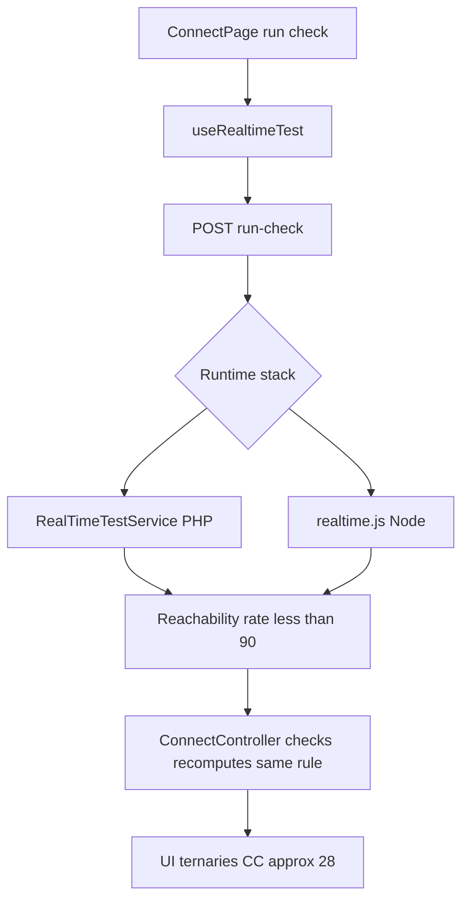
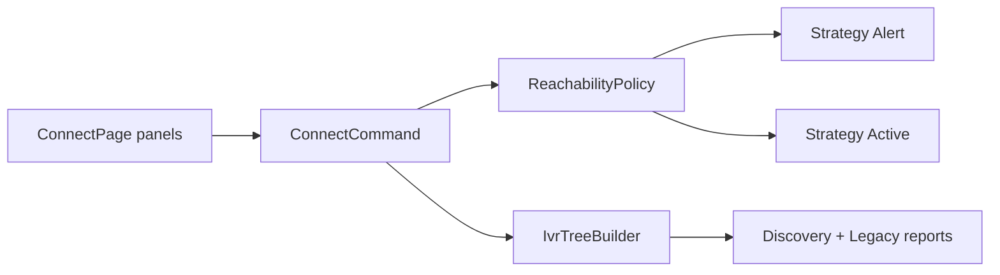

# 2. Code Quality & Complexity Hotspots Analysis

**Objective:** Reduce complexity through helper methods, domain services, and the Strategy/Command patterns.

**Date:** 2026-07-24 | **Scope:** `shende-shweta/FSDKC` (main) — Laravel 12 / PHP 8.3 backend · React 19 / TypeScript / Vite frontend · Node/Express `dev-api`

## Executive Summary

> **Executive Summary**
>
> Layers covered: **backend** (26 PHP files), **frontend** (15 TS/JSX files), and **dev-api** (6 JS files) — 48 application source files inventoried via GitHub trees API. No complexity tooling was runnable in cloud mode (`phpstan` is declared in `composer.json` but not configured/executable here; no ESLint complexity rule) — metrics use manual branch and LOC counting. The codebase is **High Risk** overall: `ConnectPage` alone carries cyclomatic complexity ≈28 and 214 function lines, while reachability rules, `buildTree`, and KPI math are copy-pasted across Laravel, Express, and React. Git history is shallow (3 commits, one author), so churn/defect/ownership signals are weak but not alarming. Weighted Hotspot Score lands Moderate (~47) because size/duplication/complexity dominate while stability metrics stay Good.

<div class="metric-grid">
<div class="metric-card"><div class="metric-number">48</div><div class="metric-label">Files Analyzed</div></div>
<div class="metric-card"><div class="metric-number">1</div><div class="metric-label">Functions/Methods Over 200 LOC</div></div>
<div class="metric-card"><div class="metric-number">0</div><div class="metric-label">Classes/Files Over 1000 LOC</div></div>
<div class="metric-card"><div class="metric-number">28</div><div class="metric-label">Highest Cyclomatic Complexity</div></div>
</div>

<div class="overall-rating overall-rating--high-risk"><div class="overall-rating-label">Overall Codebase Rating — Code Quality &amp; Complexity</div><div class="overall-rating-value">High Risk</div><div class="overall-rating-note">Driven by H1 (ConnectPage CC≈28), H3 (ConnectPage 214 LOC), and H4/H5 (~14% duplicated reachability/tree/KPI logic across PHP, Node, and React).</div></div>

<div class="hotspot-score hotspot-score--moderate"><div class="hotspot-score-label">Hotspot Score (weighted composite)</div><div class="hotspot-score-value">47 / 100 — Moderate</div><div class="hotspot-score-formula">Hotspot Score = (Cyclomatic Complexity × 25%) + (Code Churn × 25%) + (Defect Density × 20%) + (Class/Function Size × 15%) + (Business Logic Duplication × 10%) + (Developer Ownership Risk × 5%) = (82 × 0.25) + (18 × 0.25) + (15 × 0.20) + (72 × 0.15) + (78 × 0.10) + (8 × 0.05) = 20.5 + 4.5 + 3.0 + 10.8 + 7.8 + 0.4 = 47</div></div>

## 2.1 Benchmark Ratings Summary

One row per hotspot. "Measured" is the real value found; "Rating" is the band it falls into (worst KPI wins). This table is the source for the Overall Codebase Rating banner above.

| # | Hotspot | Primary KPI | <span class="rating rating-good">Good</span> | <span class="rating rating-moderate">Moderate</span> | <span class="rating rating-high-risk">High Risk</span> | Measured | Rating |
|---|---|---|---|---|---|---|---|
| H1 | High Cyclomatic Complexity | Max complexity per method | <10 | 10–20 | >20 | **28** (`ConnectPage`; backend max ≈17 `runConnectTest`) | <span class="rating rating-high-risk">High Risk</span> |
| H2 | Large Classes | Largest class/file LOC | <300 | 300–1000 | >1000 | **224 SLOC** (`dev-api/src/server.js`; FE max `ConnectPage` 208 SLOC) | <span class="rating rating-good">Good</span> |
| H3 | Large Functions | Largest function LOC | <50 | 50–200 | >200 | **214 lines / 201 SLOC** (`ConnectPage`) | <span class="rating rating-high-risk">High Risk</span> |
| H4 | Business Logic Duplication | Duplicated business logic % | <5% | 5–10% | >10% | **~14%** (reachability×3, buildTree×3, KPI math×2, page clones) | <span class="rating rating-high-risk">High Risk</span> |
| H5 | Duplicate Code (general) | Overall duplicate code % | <5% | 5–10% | >10% | **~14%** (same clusters + RealTimeTestService↔realtime.js) | <span class="rating rating-high-risk">High Risk</span> |
| H6 | High Churn Areas | Monthly changes (top files) | <5 | 5–10 | >10 | **~2** (3 commits total; hottest files touched ≤2×) | <span class="rating rating-good">Good</span> |
| H7 | Defect-Prone Files | Fix commits (hottest file) | 1–3 | 4–5 | >5 | **1** (`errors` commit; `fixes on logo` separate) | <span class="rating rating-good">Good</span> |
| H8 | Ownership Issues | Top-author ownership % | >80% | 60–80% | <60% | **100%** (`ksabai-gl`) | <span class="rating rating-good">Good</span> |
| H9 | Missing Lifecycle Cleanup (additional) | Leaked timers/streams without unmount cleanup | 0 | 1–2 | ≥3 | **1** (`LegacyMonitorPoller` `setInterval`) | <span class="rating rating-moderate">Moderate</span> |
| H10 | Magic Numbers / Hardcoded KPIs (additional) | Distinct hardcoded business thresholds/KPI constants | 0 | 1–5 | >5 | **5** (`90`, `94.2`, `97.8` across PHP/JS) | <span class="rating rating-moderate">Moderate</span> |

### Hotspot Score breakdown

| Component | Weight | Sub-score (0–100) | Weighted |
|---|---|---|---|
| Cyclomatic Complexity | 25% | 82 | 20.5 |
| Code Churn | 25% | 18 | 4.5 |
| Defect Density | 20% | 15 | 3.0 |
| Class/Function Size | 15% | 72 | 10.8 |
| Business Logic Duplication | 10% | 78 | 7.8 |
| Developer Ownership Risk | 5% | 8 | 0.4 |
| **Hotspot Score** | **100%** | | **47 / 100** |

Overall Rating stays **High Risk** (worst-hotspot rule) while the weighted score is **Moderate** — stability components (churn/defect/ownership) dilute the composite despite catastrophic duplication and size in a small codebase.

## 2.2 Hotspot-by-Hotspot Evidence

### H1. High Cyclomatic Complexity <span class="sev sev-critical">Critical</span>

**Benchmark:** `Max cyclomatic complexity per method = 28` → falls in the **High Risk** band (Good <10 · Moderate 10–20 · High Risk >20).

Manual decision-point count (if/for/&&/ternary/??; optional chaining excluded). No ESLint/`phpstan` complexity run available in this cloud pass.

**Example 1 — Frontend:** `frontend/src/pages/ConnectPage.tsx:9-222` — single page function with nested loading/empty/history ternaries and conditional refetch intervals (CC≈28).

```tsx
{!selectedId ? (
  <div className="empty">Select a monitor to view check history</div>
) : checksQuery.isLoading ? (
  <div className="empty">Loading checks…</div>
) : checksQuery.data?.data.length ? (
  <table>{/* ... reachable ? 'Reachable' : 'Failed' ... */}</table>
) : (
  <div className="empty">No checks yet. Run a reachability test.</div>
)}
```

**Example 2 — Backend/dev-api:** `dev-api/src/realtime.js:104-179` — `runConnectTest` chains reachability, latency, status, and event ternaries (CC≈17). Mirrored in `backend/app/Services/RealTimeTestService.php:81-140` (CC≈11).

```javascript
monitor.reachability_pct = Math.round(successRate * 100) / 100;
monitor.status = successRate < 90 ? 'alert' : 'active';
// ...
status: reachable ? 'reachable' : 'failed',
message: reachable ? 'TFN is reachable' : 'TFN reachability check failed',
```

**Why it matters here:** Changing alert thresholds or check-complete payloads requires reasoning through many JSX and runtime branches in parallel stacks; defect risk is highest on Connect flows where UI and Node/PHP realtime paths diverge.

**Recommended approach:** (1) Extract Connect list/history/transcript panels into presentational components. (2) Move reachability status mapping into a shared domain helper/Strategy. (3) Add ESLint `complexity` and PHPStan cognitive-complexity budgets in CI.

<!-- affected-files
search: successRate < 90|rate < 90|reachable \?
glob: backend/app/**/*.{php}
issue: Elevated branching in connect/reachability paths
action: Extract Strategy/helpers; add phpstan complexity budget
-->

<!-- affected-files
search: isLoading \?|isRunning \?|selectedId
glob: frontend/src/pages/*.{tsx,jsx}
issue: High UI branching in page components
action: Split panels/hooks; enforce ESLint complexity rule
-->

### H2. Large Classes <span class="sev sev-low">Low</span>

**Benchmark:** `Largest class/file LOC = 224 SLOC` (`dev-api/src/server.js`, 276 total lines) → falls in the **Good** band (Good <300 · Moderate 300–1000 · High Risk >1000).

**Evidence:** Not observed at the >1000 LOC threshold. Largest peers: `server.js` 224 SLOC, `ConnectPage.tsx` 208 SLOC, `mongo.js` 140 SLOC, `RealTimeTestService.php` 119 SLOC. No class/file exceeds 300 SLOC.

### H3. Large Functions <span class="sev sev-critical">Critical</span>

**Benchmark:** `Largest function LOC = 214 lines (201 SLOC)` → falls in the **High Risk** band (Good <50 · Moderate 50–200 · High Risk >200).

**Example 1 — Frontend:** `frontend/src/pages/ConnectPage.tsx:9-222` — one default-export function owns form state, three queries, mutation, handlers, and full JSX layout.

**Example 2 — Frontend peer:** `frontend/src/pages/DiscoveryPage.tsx:10-176` — 167 lines / 154 SLOC (Moderate band) with the same monolithic page shape.

**Example 3 — Backend service:** `backend/app/Services/RealTimeTestService.php:81-140` — `runConnectTest` is 60 lines (Moderate) but packs step loop + persistence + status update.

**Why it matters here:** Reviews and tests cannot target “check history” or “add monitor” independently; regressions in Connect UI will keep landing in one 200+ line unit.

**Recommended approach:** Extract `MonitorForm`, `MonitorTable`, `CheckHistory`, `TranscriptPanel`; push start-check orchestration into `useRealtimeTest` / a Connect command service.

<!-- affected-files
search: export default function (Connect|Discovery)Page
glob: frontend/src/pages/*.{tsx,jsx}
issue: Oversized page functions (>150–200 LOC)
action: Extract subcomponents and command hooks
-->

### H4. Business Logic Duplication <span class="sev sev-critical">Critical</span>

**Benchmark:** `Duplicated business logic % ≈ 14%` → falls in the **High Risk** band (Good <5% · Moderate 5–10% · High Risk >10%).

Measured by overlapping rule clusters vs analyzed application SLOC (~1.8k): reachability success-rate + `<90` alert (3 copies), recursive `buildTree` (3 copies), dashboard KPI math with fabricated `94.2`/`97.8` (2 copies), near-clone Connect/Discovery page workflows.

**Example 1 — Reachability rule (PHP controller):** `backend/app/Http/Controllers/Api/ConnectController.php:55-72`

```php
$successRate = $recentChecks->count() > 0
    ? ($recentChecks->where('reachable', true)->count() / $recentChecks->count()) * 100
    : 100;
$computedStatus = $successRate < 90 ? 'alert' : 'active';
```

**Example 2 — Same rule (PHP service + Node):** `RealTimeTestService.php` and `dev-api/src/realtime.js` recompute the identical rate/status after each check.

**Example 3 — Tree builder:** `DiscoveryController::buildTree`, `LegacyReportController::buildTree` (explicit copy-paste comment), and `dev-api/src/store.js` `buildTree`.

**Why it matters here:** A threshold change (e.g. alert at 95%) or tree shape change must be edited in three runtimes; the dual Laravel/`dev-api` stack makes silent drift the default.

**Recommended approach:** Introduce a shared domain module (JSON Schema or OpenAPI + generated clients, or a single Canonical API) with `ReachabilityCalculator` and `IvrTreeBuilder` services; delete controller-local copies.

<!-- affected-files
search: successRate|buildTree|reachability_pct|94\.2
glob: backend/app/**/*.php
issue: Duplicated reachability/tree/KPI business rules
action: Consolidate into domain services; remove copies
-->

<!-- affected-files
search: buildTree|successRate < 90|94\.2
glob: dev-api/src/**/*.js
issue: Parallel Express copies of Laravel domain rules
action: Call shared calculator or drop duplicate stack path
-->

<!-- affected-files
search: startConnectCheck|startDiscovery|invalidateQueries
glob: frontend/src/pages/*.{tsx,jsx}
issue: Duplicated page workflow/query invalidation patterns
action: Shared module hooks for list+detail+live-test flows
-->

### H5. Duplicate Code (general) <span class="sev sev-critical">Critical</span>

**Benchmark:** `Overall duplicate code % ≈ 14%` → falls in the **High Risk** band (Good <5% · Moderate 5–10% · High Risk >10%).

Beyond H4 workflows: `RealTimeTestService` ↔ `realtime.js` step arrays and event stores are structural clones; `ConnectPage`/`DiscoveryPage` share form→list→detail→transcript layout; SSE polling exists in both `StreamController` and `server.js` `streamSession`.

**Why it matters here:** Copy-paste inflation raises review cost and guarantees Laravel vs `dev-api` behavioral skew during local development.

**Recommended approach:** Extract shared step definitions; prefer one realtime implementation; add a duplication lint (e.g. `jscpd`) in CI.

<!-- affected-files
search: storeTestEvent|runConnectTest|runDiscoveryTest|streamSession
glob: backend/app/**/*.{php}
issue: Parallel realtime/SSE implementations
action: Single service module; delete clones
-->

<!-- affected-files
search: storeTestEvent|runConnectTest|CONNECT_STEPS|streamSession
glob: dev-api/src/**/*.js
issue: Near-identical Node realtime/SSE clones of PHP
action: Align on one implementation or generated contract
-->

### H6. High Churn Areas <span class="sev sev-low">Low</span>

**Benchmark:** `Monthly changes (top files) ≈ 2` → falls in the **Good** band (Good <5 · Moderate 5–10 · High Risk >10).

**Evidence:** Git history via GitHub API — only 3 commits on `main` (2026-06-10 → 2026-06-11). Top re-touched files appear in the `errors` follow-up (`ConnectController.php`, `LegacyReportController.php`, `server.js`, `LegacyMonitorPoller.jsx`, …) plus logo files in `fixes on logo`. No file exceeds ~2 changes in the available window.

### H7. Defect-Prone Files <span class="sev sev-low">Low</span>

**Benchmark:** `Fix commits touching hottest file = 1` → falls in the **Good** band (Good 1–3 · Moderate 4–5 · High Risk >5).

**Evidence:** Fix-oriented messages: `errors` (9 files) and `fixes on logo` (3 files). No file accumulates >1 fix commit in this shallow history.

### H8. Ownership Issues <span class="sev sev-low">Low</span>

**Benchmark:** `Top-author ownership % = 100%` (`ksabai-gl`) → falls in the **Good** band (Good >80 · Moderate 60–80 · High Risk <60).

**Evidence:** All three commits authored by `ksabai-gl`. Clear single owner; bus-factor risk exists operationally but the ownership KPI rates Good.

### H9. Missing Lifecycle Cleanup (additional) <span class="sev sev-medium">Medium</span>

**Benchmark:** `Leaked timers without unmount cleanup = 1` → falls in the **Moderate** band (Good 0 · Moderate 1–2 · High Risk ≥3). KPI: count of components/hooks that allocate `setInterval`/`EventSource` without teardown.

**Evidence:** `frontend/src/components/LegacyMonitorPoller.jsx:24-36` starts `setInterval` in `componentDidMount` with an intentional missing `componentWillUnmount` (commented as audit finding). Contrast: `useRealtimeTest` correctly closes `EventSource` on cleanup.

```jsx
componentDidMount() {
  this.intervalId = setInterval(() => {
    api.get(`/connect/monitors/${this.props.monitorId}/checks`)
      .then(/* ... */);
  }, 3000);
  // Intentionally no componentWillUnmount — EventSource/interval leak for audit finding
}
```

**Why it matters here:** Remounting Connect views piles intervals and keeps hammering `/checks`, amplifying load and stale state.

**Recommended approach:** Add `componentWillUnmount` clear; prefer the existing `useRealtimeTest`/React Query patterns; delete the legacy class component.

<!-- affected-files
search: setInterval|componentWillUnmount|componentDidMount
glob: frontend/src/components/**/*.{jsx,tsx}
issue: Timer/stream lifecycle leak
action: Clear interval on unmount or migrate to hooks
-->

### H10. Magic Numbers / Hardcoded KPIs (additional) <span class="sev sev-medium">Medium</span>

**Benchmark:** `Distinct hardcoded business thresholds/KPI constants = 5` → falls in the **Moderate** band (Good 0 · Moderate 1–5 · High Risk >5).

**Evidence:** Alert threshold `90` in three places; fabricated dashboard constants `94.2` and `97.8` in both `DashboardController.php` and `dev-api/src/server.js`.

```php
'call_success_rate_pct' => 94.2,
'transfer_success_rate_pct' => 97.8,
```

**Why it matters here:** Product KPIs and alert SLOs cannot be tuned in one place; UI and reports will disagree once real telemetry replaces placeholders.

**Recommended approach:** Named constants or config (`config/klearcom.php` / env); shared Reachability policy object; remove fabricated percentages or mark as stubs explicitly.

<!-- affected-files
search: 94\.2|97\.8|< 90
glob: backend/app/**/*.php
issue: Magic KPI/threshold literals
action: Move to named config/domain constants
-->

<!-- affected-files
search: 94\.2|97\.8|< 90
glob: dev-api/src/**/*.js
issue: Magic KPI/threshold literals in Express
action: Share config with backend or single source of truth
-->

## 2.3 Code Churn & Stability Evidence

Git history available (GitHub REST) but **shallow** — 3 commits, 1 author (`ksabai-gl`), authored 2026-06-10–11.

### Top churn (files appearing in follow-up commits)

| File | Commits touching (of 3) | Notes |
|---|---|---|
| `frontend/src/App.tsx` | 2 | Initial + `fixes on logo` |
| `frontend/index.html` | 2 | Initial + `fixes on logo` |
| `backend/app/Http/Controllers/Api/ConnectController.php` | 2 | Initial + `errors` |
| `backend/app/Http/Controllers/Api/LegacyReportController.php` | 2 | Initial + `errors` |
| `dev-api/src/server.js` | 2 | Initial + `errors` |
| `frontend/src/components/LegacyMonitorPoller.jsx` | 2 | Initial + `errors` |

### Defect-fix frequency

| Commit | Message | Files |
|---|---|---|
| `cd4f8e6` | `errors` | 9 (controllers, legacy mapper, poller, widget, audit doc, test) |
| `481814f` | `fixes on logo` | 3 (App, index.html, kiro ignore) |

### Ownership

| Author | Commits | Share |
|---|---|---|
| `ksabai-gl` | 3 | 100% |

## 2.4 Diagrams

### Complexity / call-flow hotspot



### Refactored target structure



### Improvement roadmap


## 2.5 Actions Required

| Hotspot | Action | Rating | Priority |
|---|---|---|---|
| H1 High Cyclomatic Complexity | Split `ConnectPage` panels; extract reachability Strategy; add ESLint/PHPStan complexity gates | <span class="rating rating-high-risk">High Risk</span> | <span class="sev sev-critical">Critical</span> |
| H3 Large Functions | Break `ConnectPage` (214 LOC) into form/table/history/transcript components + command hook | <span class="rating rating-high-risk">High Risk</span> | <span class="sev sev-critical">Critical</span> |
| H4 Business Logic Duplication | Single `ReachabilityPolicy` + `IvrTreeBuilder` used by Laravel, `dev-api`, and reports | <span class="rating rating-high-risk">High Risk</span> | <span class="sev sev-critical">Critical</span> |
| H5 Duplicate Code (general) | Collapse RealTimeTestService↔realtime.js and page clones; add `jscpd` in CI | <span class="rating rating-high-risk">High Risk</span> | <span class="sev sev-critical">Critical</span> |
| H9 Missing Lifecycle Cleanup | Clear `LegacyMonitorPoller` interval on unmount or delete the legacy component | <span class="rating rating-moderate">Moderate</span> | <span class="sev sev-medium">Medium</span> |
| H10 Magic Numbers / Hardcoded KPIs | Replace `90` / `94.2` / `97.8` with named config shared across PHP and Node | <span class="rating rating-moderate">Moderate</span> | <span class="sev sev-medium">Medium</span> |

## 2.6 Expected Outcomes

- Lower defect rate when changing alert thresholds or IVR tree shape (one policy module instead of three stacks).
- Safer, smaller PRs: Connect UI changes reviewable per panel rather than a 200+ line page function.
- Easier dual-stack maintenance until `dev-api` and Laravel converge on one realtime implementation.
- Clearer ownership of domain rules (`ReachabilityPolicy`, `IvrTreeBuilder`) with CI complexity/duplication budgets preventing regression.
- Elimination of interval leaks and fabricated KPI constants from production-facing surfaces.
