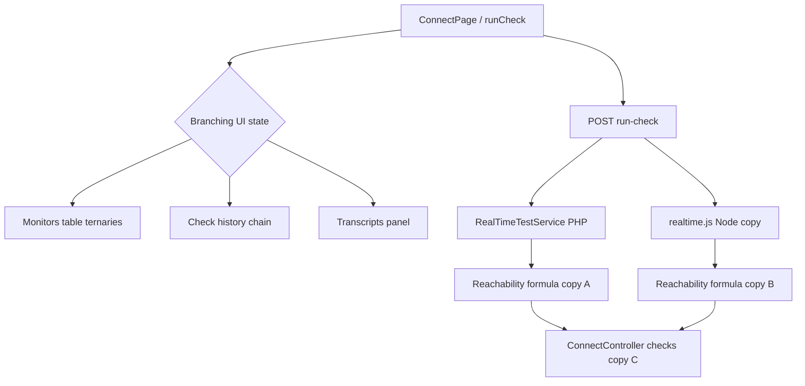
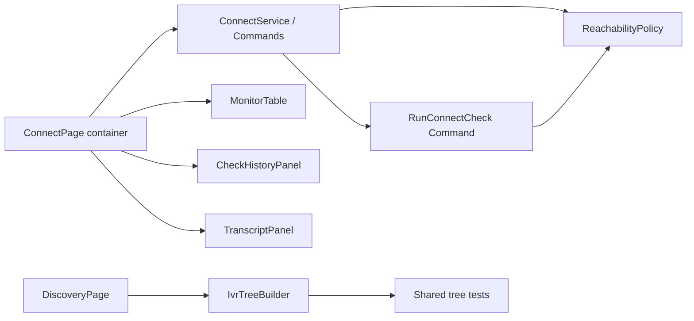
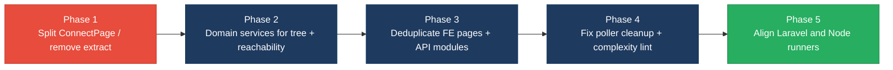

# 2. Code Quality & Complexity Hotspots Analysis

**Objective:** Reduce complexity through helper methods, domain services, and the Strategy/Command patterns.

**Date:** 2026-07-24 | **Scope:** `shende-shweta/FSDKC` (`main`) — Laravel 12 / PHP 8.3 backend, React 19 + TypeScript frontend, Node/Express `dev-api`

## Executive Summary

> **Executive Summary**
>
> Klearcom is a small multi-layer platform (Laravel API, React SPA, Node `dev-api`) with no runnable complexity tooling configured (phpstan is listed in Composer but unused; no ESLint complexity rule), so metrics were measured by manual branch/LOC inspection across **39 application source files** (backend 18, frontend 15, `dev-api` 6). The worst findings are a **201-LOC** `ConnectPage` component (ESLint-style CC ≈ 20), **~8.8–12.3%** duplicated business/UI logic (IVR `buildTree` ×3, reachability math ×4, dual Laravel/`dev-api` realtime runners, near-clone Discovery/Connect pages), and **3** unsafe `extract()` call sites in legacy PHP. Git history is short (3 commits, single author `ksabai-gl`); churn and ownership look healthy, but they do not offset the structural duplication and size risks. Overall rating is **High Risk**, driven by large functions, general duplication, and `extract()`.

<div class="metric-grid">
<div class="metric-card"><div class="metric-number">39</div><div class="metric-label">Files Analyzed</div></div>
<div class="metric-card"><div class="metric-number">1</div><div class="metric-label">Functions/Methods Over 200 LOC</div></div>
<div class="metric-card"><div class="metric-number">0</div><div class="metric-label">Classes/Files Over 1000 LOC</div></div>
<div class="metric-card"><div class="metric-number">20</div><div class="metric-label">Highest Cyclomatic Complexity</div></div>
</div>

<div class="overall-rating overall-rating--high-risk"><div class="overall-rating-label">Overall Codebase Rating — Code Quality &amp; Complexity</div><div class="overall-rating-value">High Risk</div><div class="overall-rating-note">Driven by H3 Large Functions (ConnectPage 201 LOC), H5 Duplicate Code (~12.3%), and H9 unsafe extract() (3 call sites).</div></div>

<div class="hotspot-score hotspot-score--moderate"><div class="hotspot-score-label">Hotspot Score (weighted composite)</div><div class="hotspot-score-value">42 / 100 — Moderate</div><div class="hotspot-score-formula">Hotspot Score = (Cyclomatic Complexity × 25%) + (Code Churn × 25%) + (Defect Density × 20%) + (Class/Function Size × 15%) + (Business Logic Duplication × 10%) + (Developer Ownership Risk × 5%) = (66 × 0.25) + (18 × 0.25) + (15 × 0.20) + (68 × 0.15) + (72 × 0.10) + (8 × 0.05) = 42</div></div>

Weighted score is Moderate because low churn/ownership risk dilutes the composite; Overall stays High Risk per worst-hotspot rule.

## 2.1 Benchmark Ratings Summary

Layers covered: **Backend** (Laravel `backend/app` + routes/tests = 18 files) · **Frontend** (React `frontend/src` = 15 files) · **Dev API** (Node `dev-api/src` = 6 files). Tooling: manual LOC/branch counts (no ESLint complexity, no radon/gocyclo, phpstan present in `composer.json` but no config/run).

| # | Hotspot | Primary KPI | <span class="rating rating-good">Good</span> | <span class="rating rating-moderate">Moderate</span> | <span class="rating rating-high-risk">High Risk</span> | Measured | Rating |
|---|---|---|---|---|---|---|---|
| H1 | High Cyclomatic Complexity | Max complexity per method | <10 | 10–20 | >20 | 20 (`ConnectPage`, ESLint-style) · FE DiscoveryPage 18 · BE-JS `runConnectTest` 15 · BE-PHP `runConnectTest` 10 | <span class="rating rating-moderate">Moderate</span> |
| H2 | Large Classes | Largest class/file LOC | <300 | 300–1000 | >1000 | 224 (`dev-api/src/server.js`); next FE `ConnectPage.tsx` 208 | <span class="rating rating-good">Good</span> |
| H3 | Large Functions | Largest function LOC | <50 | 50–200 | >200 | 201 (`ConnectPage`); FE DiscoveryPage 154 · BE max ~64 (`runConnectTest`) | <span class="rating rating-high-risk">High Risk</span> |
| H4 | Business Logic Duplication | Duplicated business logic % | <5% | 5–10% | >10% | ~8.8% (`buildTree`×3, reachability×4, dual realtime, KPI×2) | <span class="rating rating-moderate">Moderate</span> |
| H5 | Duplicate Code (general) | Overall duplicate code % | <5% | 5–10% | >10% | ~12.3% (H4 + Discovery/Connect page UI clone) | <span class="rating rating-high-risk">High Risk</span> |
| H6 | High Churn Areas | Monthly changes (top files) | <5 | 5–10 | >10 | ~2 (June 2026; top files touched twice) | <span class="rating rating-good">Good</span> |
| H7 | Defect-Prone Files | Fix commits (hottest file) | 1–3 | 4–5 | >5 | 1 (`ConnectController` / `server.js` / `App.tsx` in fix commits) | <span class="rating rating-good">Good</span> |
| H8 | Ownership Issues | Top-author ownership % | >80% | 60–80% | <60% | 100% (`ksabai-gl`) | <span class="rating rating-good">Good</span> |
| H9 | Unsafe `extract()` / dynamic vars (additional) | `extract()` call sites (Good 0 · Moderate 1–2 · High Risk ≥3) | 0 | 1–2 | ≥3 | 3 | <span class="rating rating-high-risk">High Risk</span> |
| H10 | Missing lifecycle cleanup (additional) | Uncleared interval/SSE components (Good 0 · Moderate 1 · High Risk ≥2) | 0 | 1 | ≥2 | 1 (`LegacyMonitorPoller`) | <span class="rating rating-moderate">Moderate</span> |

### Hotspot Score breakdown

| Component | Weight | Sub-score (0–100) | Weighted |
|---|---|---|---|
| Cyclomatic Complexity | 25% | 66 | 16.5 |
| Code Churn | 25% | 18 | 4.5 |
| Defect Density | 20% | 15 | 3.0 |
| Class/Function Size | 15% | 68 | 10.2 |
| Business Logic Duplication | 10% | 72 | 7.2 |
| Developer Ownership Risk | 5% | 8 | 0.4 |
| **Hotspot Score** | **100%** | | **42 / 100** |

Business Logic Duplication component uses the worse of H4/H5 (H5 High Risk ≈ 72). Class/Function Size uses the worse of H2/H3 (H3 High Risk, barely over 200 LOC ≈ 68).

## 2.2 Hotspot-by-Hotspot Evidence

### H1. High Cyclomatic Complexity <span class="sev sev-medium">Medium</span>

**Benchmark:** `Max cyclomatic complexity per method = 20` → falls in the **Moderate** band (Good <10 · Moderate 10–20 · High Risk >20).

Highest measured method/component is frontend `ConnectPage` (ESLint-style CC ≈ 20) from nested loading/selection/status ternaries and `&&` short-circuits. Backend peak is `runConnectTest` in `dev-api/src/realtime.js` (CC ≈ 15) and PHP `RealTimeTestService::runConnectTest` (CC ≈ 10). No method exceeded 20 under ESLint decision-point counting (`.map` not counted).

Example — frontend conditional density in `ConnectPage.tsx`:

```108:145:frontend/src/pages/ConnectPage.tsx
          {monitorsQuery.isLoading ? (
            <div className="empty">Loading…</div>
          ) : (
            <table>
              ...
                    style={{ cursor: 'pointer', background: selectedId === m.id ? 'var(--surface-2)' : undefined }}
                  >
...
                        {isRunning && selectedId === m.id ? 'Testing…' : 'Run Test'}
```

Example — backend connect test branching in `realtime.js`:

```115:152:dev-api/src/realtime.js
  const reachable = Math.random() > 0.2;

  for (const step of CONNECT_STEPS) {
    await sleep(600 + Math.random() * 500);
    ...
    if (step.event === 'check_complete') {
      stepPayload.reachable = reachable;
      stepPayload.latency_ms = reachable ? Math.floor(180 + Math.random() * 300) : null;
    }
...
  monitor.reachability_pct = Math.round(successRate * 100) / 100;
  monitor.status = successRate < 90 ? 'alert' : 'active';
```

**Why it matters here:** Connect reachability UI and simulated carrier checks encode many status paths in a single function. Exhaustive tests for every loading/selection/failure combination are impractical, so regressions in badge text, refetch intervals, or alert thresholds are likely when either path changes.

**Recommended approach:**
1. Extract `MonitorTable`, `CheckHistoryPanel`, and `TranscriptPanel` from `ConnectPage.tsx`.
2. Move reachability threshold (`successRate < 90`) into a shared `ReachabilityPolicy` / Strategy used by PHP and Node.
3. Enable ESLint `complexity` (max 10) and phpstan level that flags high-CC methods once Composer scripts are wired.

<!-- affected-files
search: (isLoading\s*\?|isPending\s*\?|isRunning\s*\?|reachable\s*\?|successRate\s*<)
glob: frontend/src/**/*.{tsx,ts,jsx,js}
issue: High conditional density in UI/test flows
action: Extract presentational subcomponents; reduce nested ternaries
-->

<!-- affected-files
search: (function runConnectTest|successRate\s*<\s*90|reachable\s*\?)
glob: {dev-api/src,backend/app}/**/*.{js,php}
issue: Branch-heavy connect test / status logic
action: Extract ReachabilityPolicy helpers; split step handlers
-->

### H2. Large Classes <span class="sev sev-low">Low</span>

**Benchmark:** `Largest class/file LOC = 224` → falls in the **Good** band (Good <300 · Moderate 300–1000 · High Risk >1000).

No file exceeds 1000 source LOC. Largest peers: `dev-api/src/server.js` (224), `frontend/src/pages/ConnectPage.tsx` (208), `frontend/src/pages/DiscoveryPage.tsx` (162), `dev-api/src/realtime.js` (155).

**Evidence:** Observed — all application files are under 300 LOC; size risk shows up as large *functions* (H3), not god-classes.

### H3. Large Functions <span class="sev sev-critical">Critical</span>

**Benchmark:** `Largest function LOC = 201` → falls in the **High Risk** band (Good <50 · Moderate 50–200 · High Risk >200).

`ConnectPage` is a single default-export function spanning lines 9–222 (201 non-blank source lines) mixing form state, three React Query hooks, mutations, live feed, dual tables, and transcripts. `DiscoveryPage` is 154 LOC with the same shape. Backend functions peak around 64 LOC (`runConnectTest` in `realtime.js`).

```9:61:frontend/src/pages/ConnectPage.tsx
export default function ConnectPage() {
  const queryClient = useQueryClient();
  const selectedId = useUiStore((s) => s.selectedMonitorId);
  ...
  const monitorsQuery = useQuery({ ... });
  const checksQuery = useQuery({ ... });
  const transcriptsQuery = useQuery({ ... });
  const createMutation = useMutation({ ... });
  const handleRunCheck = async (monitorId: number) => { ... };
  const handleSubmit = (e: FormEvent) => { ... };
```

```10:50:frontend/src/pages/DiscoveryPage.tsx
export default function DiscoveryPage() {
  const queryClient = useQueryClient();
  ...
  const jobsQuery = useQuery({ ... });
  const treeQuery = useQuery({ ... });
  const transcriptsQuery = useQuery({ ... });
  const createMutation = useMutation({ ... });
  const handleStart = async (jobId: number) => { ... };
```

**Why it matters here:** Any Connect UX change (new check columns, transcript filters, form fields) touches the entire page function, raising merge conflict and regression risk. Discovery mirrors the same structure, so fixes often must be applied twice.

**Recommended approach:**
1. Split `ConnectPage` into container + presentational children under `frontend/src/pages/connect/`.
2. Extract shared `useResourceCrud` / invalidation helpers used by both Discovery and Connect.
3. Keep page entry components under ~80 LOC.

<!-- affected-files
search: export default function (ConnectPage|DiscoveryPage|LegacyDashboardWidget)
glob: frontend/src/pages/**/*.{tsx,jsx}
issue: Oversized page component function
action: Split into smaller components and hooks (SRP)
-->

### H4. Business Logic Duplication <span class="sev sev-high">High</span>

**Benchmark:** `Duplicated business-rule code ≈ 8.8%` → falls in the **Moderate** band (Good <5% · Moderate 5–10% · High Risk >10%).

Measured from second+ copies of known workflows against ~2430 app source LOC: IVR `buildTree` in three places, reachability success-rate formula in four, dual Laravel/`dev-api` realtime runners, and duplicated dashboard KPI math.

```87:100:backend/app/Http/Controllers/Api/DiscoveryController.php
    private function buildTree($nodes, ?int $parentId = null): array
    {
        return $nodes
            ->where('parent_id', $parentId)
            ->map(fn (DiscoveryNode $node) => [
                ...
                'children' => $this->buildTree($nodes, $node->id),
            ])
```

```77:91:backend/app/Http/Controllers/Api/LegacyReportController.php
    /** Duplicate of DiscoveryController::buildTree — copy-paste debt */
    private function buildTree($nodes, ?int $parentId = null): array
    {
        return $nodes
            ->where('parent_id', $parentId)
            ->map(fn (DiscoveryNode $node) => [
                ...
                'children' => $this->buildTree($nodes, $node->id),
            ])
```

```64:74:dev-api/src/store.js
export function buildTree(nodes, parentId = null) {
  return nodes
    .filter((n) => n.parent_id === parentId)
    .map((n) => ({
      ...
      children: buildTree(nodes, n.id),
    }));
}
```

```65:83:backend/app/Http/Controllers/Api/ConnectController.php
        // Duplicate reachability calculation block (also in RealTimeTestService / dev-api realtime.js)
        $recentChecks = ConnectCheckResult::where('connect_monitor_id', $id)
            ->orderByDesc('checked_at')
            ->limit(20)
            ->get();

        $successRate = $recentChecks->count() > 0
            ? ($recentChecks->where('reachable', true)->count() / $recentChecks->count()) * 100
            : 100;

        $computedStatus = $successRate < 90 ? 'alert' : 'active';
```

**Why it matters here:** Reachability alert threshold (`< 90`) and IVR tree shape are product rules. Changing them requires coordinated edits across PHP controllers, PHP services, and the Node `dev-api`, or the Docker and local-dev paths diverge silently.

**Recommended approach:**
1. Create `App\Services\IvrTreeBuilder` and call it from Discovery + LegacyReport; mirror once in `dev-api` or share a JSON schema test.
2. Extract `ReachabilityCalculator` (domain service) used by `ConnectController`, `RealTimeTestService`, and port to `realtime.js`.
3. Prefer Command objects (`RunConnectCheck`, `RunDiscoveryTraversal`) so Laravel and Node invoke the same step list definition.

<!-- affected-files
search: (function buildTree|private function buildTree|reachability_pct|successRate\s*<\s*90)
glob: {backend/app,dev-api/src}/**/*.{php,js}
issue: Duplicated IVR tree / reachability business rules
action: Consolidate into domain services shared by Laravel and Node
-->

### H5. Duplicate Code (general) <span class="sev sev-critical">Critical</span>

**Benchmark:** `Overall duplicate code ≈ 12.3%` → falls in the **High Risk** band (Good <5% · Moderate 5–10% · High Risk >10%).

Beyond H4, `ConnectPage` and `DiscoveryPage` share near-identical form cards, React Query refetch patterns, live-feed placement, row-selection styling, and transcript panels (~70 LOC structural clone). `LegacyDashboardWidget` also re-fetches dashboard/jobs/monitors overlapping `DashboardPage`.

```18:36:frontend/src/pages/DiscoveryPage.tsx
  const jobsQuery = useQuery({
    queryKey: ['discovery', 'jobs'],
    queryFn: () => api.get<{ data: DiscoveryJob[] }>('/discovery/jobs'),
    refetchInterval: isRunning ? 2000 : false,
  });
```

```22:40:frontend/src/pages/ConnectPage.tsx
  const monitorsQuery = useQuery({
    queryKey: ['connect', 'monitors'],
    queryFn: () => api.get<{ data: ConnectMonitor[] }>('/connect/monitors'),
    refetchInterval: isRunning ? 2000 : false,
  });
```

**Why it matters here:** UI copy-paste doubles the maintenance surface for loading states, invalidation keys, and Mongo transcript panels. Drift already shows in module-specific labels while structure stays cloned.

**Recommended approach:**
1. Introduce `ResourceListPage` layout + `TranscriptPanel` shared components.
2. Add `discoveryApi` / `connectApi` modules under `frontend/src/api/`.
3. Add a duplication lint (e.g. jscpd) in CI once workflows exist.

<!-- affected-files
search: (refetchInterval:\s*isRunning|invalidateQueries|mongodb/transcripts)
glob: frontend/src/**/*.{tsx,ts,jsx}
issue: Near-clone page/query/transcript UI patterns
action: Extract shared layout components and API modules
-->

### H6. High Churn Areas <span class="sev sev-low">Low</span>

**Benchmark:** `Monthly changes (top files) ≈ 2` → falls in the **Good** band (Good <5 · Moderate 5–10 · High Risk >10).

Git history via GitHub (`main`, 3 commits, June 2026): files changed most often after the initial import are touched twice (`frontend/src/App.tsx`, `frontend/index.html`, `ConnectController.php`, `api.php`, `dev-api/src/server.js`). That is low monthly churn for a young repo.

**Evidence:** See §2.3 tables. No hotspot action required beyond watching Connect paths as the product grows.

### H7. Defect-Prone Files <span class="sev sev-low">Low</span>

**Benchmark:** `Fix/bug commits touching hottest file = 1` → falls in the **Good** band (Good 1–3 · Moderate 4–5 · High Risk >5).

Two commits match fix/error messaging (`errors`, `fixes on logo`). Each application file in those commits appears once. No file shows a recurring fix cluster yet.

**Evidence:** Not a structural defect magnet yet — history is too short for strong signal; continue monitoring `ConnectController` and `server.js` where fix commits already landed.

### H8. Ownership Issues <span class="sev sev-low">Low</span>

**Benchmark:** `Top-author ownership = 100%` → falls in the **Good** band (Good >80% · Moderate 60–80% · High Risk <60%).

All 3 commits are authored by `ksabai-gl`. Ownership is clear (single author), though bus-factor risk exists outside this agent's ownership KPI.

**Evidence:** Not observed as fragmented ownership.

### H9. Unsafe `extract()` / dynamic vars (additional) <span class="sev sev-critical">Critical</span>

**Benchmark:** `extract() call sites = 3` → falls in the **High Risk** band (Good 0 · Moderate 1–2 · High Risk ≥3). KPI: count of `extract(` usages in PHP application code.

```10:24:backend/app/Legacy/LegacyDataMapper.php
    public function mapReportRow(array $row): array
    {
        extract($row, EXTR_SKIP);
        return [
            'label' => $name ?? 'Unknown',
            ...
        ];
    }

    public function mapJobContext(array $context): array
    {
        extract($context);
```

```19:22:backend/app/Http/Controllers/Api/LegacyReportController.php
    public function carrierSummary(Request $request): JsonResponse
    {
        $filters = $request->all();
        extract($filters);
```

**Why it matters here:** `extract($request->all())` injects request keys as local variables, enabling scope pollution and making static analysis blind. Combined with AGENTS.md guidance to avoid `extract()`, this is intentional tech debt that still ships on `main`.

**Recommended approach:**
1. Replace with explicit `$request->only(['country_code','carrier'])` and typed arrays.
2. Rewrite `LegacyDataMapper` to read keys from `$row['name']` etc.
3. Add phpstan / CI grep gate forbidding `extract(`.

<!-- affected-files
search: extract\s*\(
glob: backend/app/**/*.php
issue: Unsafe extract() dynamic variable creation
action: Replace with explicit array access / validated DTOs
-->

### H10. Missing lifecycle cleanup (additional) <span class="sev sev-medium">Medium</span>

**Benchmark:** `Uncleared interval/SSE components = 1` → falls in the **Moderate** band (Good 0 · Moderate 1 · High Risk ≥2). KPI: components that start `setInterval`/`EventSource` without unmount cleanup.

```22:33:frontend/src/components/LegacyMonitorPoller.jsx
  componentDidMount() {
    this.intervalId = setInterval(() => {
      api.get<{ computed?: { reachability_pct: number } }>(`/connect/monitors/${this.props.monitorId}/checks`)
        .then((res) => { ... })
        .catch((err: Error) => this.setState({ error: err.message }));
    }, 3000);
    // Intentionally no componentWillUnmount — EventSource/interval leak for audit finding
  }
```

Contrast: `LegacyDashboardWidget` correctly clears its interval in the `useEffect` cleanup. Only `LegacyMonitorPoller` lacks cleanup.

**Why it matters here:** Polling continues after unmount, causing setState-on-unmounted warnings and wasted API traffic when the legacy poller is mounted in dashboards.

**Recommended approach:**
1. Add `componentWillUnmount` (or convert to a hook with cleanup) clearing `intervalId`.
2. Prefer React Query `refetchInterval` already used elsewhere instead of class polling.
3. Add a frontend lint rule or test asserting interval cleanup.

<!-- affected-files
search: setInterval\s*\(
glob: frontend/src/**/*.{jsx,tsx,js,ts}
issue: Timer started without guaranteed cleanup
action: Clear interval/SSE on unmount; prefer React Query
-->

## 2.3 Code Churn & Stability Evidence

Git history available via GitHub API on `shende-shweta/FSDKC` (`main`): **3 commits**, all by **ksabai-gl**, spanning 2026-06-10 → 2026-06-11. No local clone; churn computed from commit file lists.

### Top files by change frequency

| Commits touching file | File | Distinct authors |
|---|---|---|
| 2 | `frontend/src/App.tsx` | 1 |
| 2 | `frontend/index.html` | 1 |
| 2 | `backend/app/Http/Controllers/Api/ConnectController.php` | 1 |
| 2 | `backend/routes/api.php` | 1 |
| 2 | `dev-api/src/server.js` | 1 |
| 1 | `frontend/src/pages/ConnectPage.tsx` (initial) | 1 |
| 1 | `backend/app/Http/Controllers/Api/LegacyReportController.php` | 1 |
| 1 | `frontend/src/components/LegacyMonitorPoller.jsx` | 1 |

### Fix / error commit touches

| Fix-oriented commits | File |
|---|---|
| 1 | `backend/app/Http/Controllers/Api/ConnectController.php` |
| 1 | `dev-api/src/server.js` |
| 1 | `frontend/src/App.tsx` |
| 1 | `frontend/src/components/LegacyMonitorPoller.jsx` |
| 1 | `backend/app/Legacy/LegacyDataMapper.php` |
| 1 | `backend/app/Http/Controllers/Api/LegacyReportController.php` |

### Ownership

| File | Authors | Top author share |
|---|---|---|
| All application files in history | `ksabai-gl` | 100% |

## 2.4 Diagrams

### Complexity / call-flow hotspot



### Refactored target structure



### Improvement roadmap



## 2.5 Actions Required

| Hotspot | Action | Rating | Priority |
|---|---|---|---|
| H1 High Cyclomatic Complexity | Split `ConnectPage` conditionals into subcomponents; extract shared reachability helpers; enable ESLint `complexity` | <span class="rating rating-moderate">Moderate</span> | <span class="sev sev-medium">Medium</span> |
| H3 Large Functions | Break `ConnectPage` (201 LOC) and shrink `DiscoveryPage` (154 LOC) via hooks + presentational children | <span class="rating rating-high-risk">High Risk</span> | <span class="sev sev-critical">Critical</span> |
| H4 Business Logic Duplication | Consolidate `buildTree` and reachability math into domain services used by Laravel and `dev-api` | <span class="rating rating-moderate">Moderate</span> | <span class="sev sev-high">High</span> |
| H5 Duplicate Code (general) | Extract shared page layout / transcript / query patterns; add duplication detection in CI | <span class="rating rating-high-risk">High Risk</span> | <span class="sev sev-critical">Critical</span> |
| H9 Unsafe `extract()` | Replace 3 `extract()` sites with explicit validated arrays / DTOs; gate in CI | <span class="rating rating-high-risk">High Risk</span> | <span class="sev sev-critical">Critical</span> |
| H10 Missing lifecycle cleanup | Add unmount cleanup to `LegacyMonitorPoller` or migrate to React Query | <span class="rating rating-moderate">Moderate</span> | <span class="sev sev-medium">Medium</span> |

## 2.6 Expected Outcomes

- Lower defect rate on Connect/Discovery changes by testing smaller components and a single reachability policy.
- Safer refactors when IVR tree or alert thresholds change — one service update instead of three+ copies.
- Easier code review once page components stay under ~80 LOC and ternaries are flattened.
- Clearer ownership of domain rules (`IvrTreeBuilder`, `ReachabilityPolicy`) versus UI shells.
- Elimination of `extract()` and interval-leak debt reduces security and runtime footguns in legacy paths.
