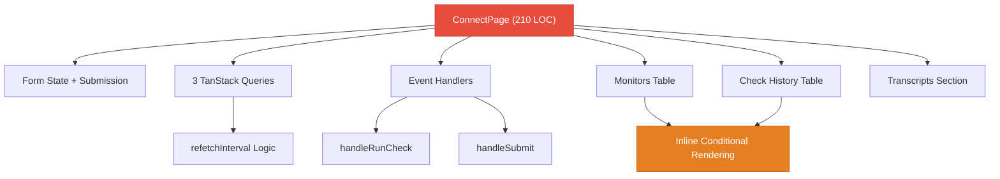
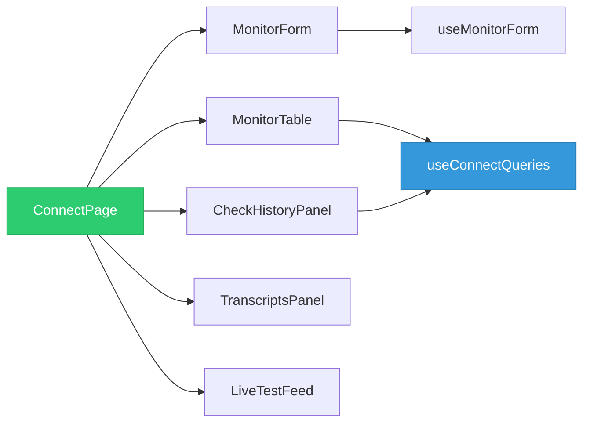
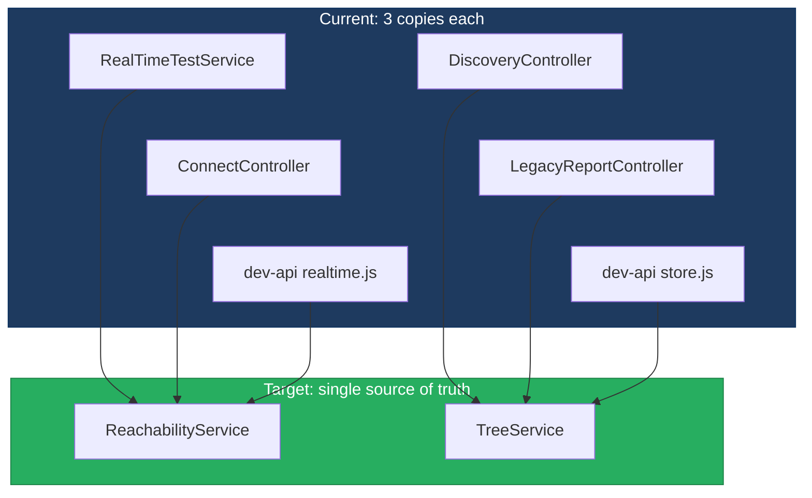
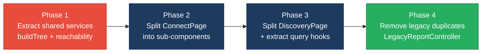

# 2. Code Quality & Complexity Hotspots Analysis

**Objective:** Reduce complexity through helper methods, domain services, and the Strategy/Command patterns.

**Date:** 2026-08-18 18:52:31 IST | **Scope:** `shende-shweta/FSDKC` — Laravel 12 (PHP 8.3) backend + React 19 / TypeScript / Vite frontend + Node.js Express dev-API; MongoDB persistence via native driver (backend) and `mongodb-memory-server` (dev-API). Layers covered: **Backend** (26 PHP files), **Frontend** (16 TS/TSX/JSX files), **Dev-API** (8 JS files). Total: **50 source files, ~3 027 LOC**.

## Executive Summary

> **Executive Summary**
>
> The Klearcom platform codebase is compact (~3 000 LOC across 50 files) and largely well-structured, with no function or method exceeding a cyclomatic complexity of 20. However, one frontend component — `ConnectPage.tsx` — exceeds the 200-LOC single-function threshold at ~210 source lines, concentrating form state, three TanStack Query hooks, event handlers, and two data tables in a single render function. Business-logic duplication sits at the Moderate boundary (~5 %): the `buildTree` algorithm is copy-pasted across `DiscoveryController`, `LegacyReportController`, and the dev-API `store.js`, while the reachability-rate calculation is repeated in `RealTimeTestService`, `ConnectController`, and the dev-API `realtime.js` — the latter already flagged inline as a duplicate. Refactoring these two areas will yield the highest return on code quality.

<div class="metric-grid">
<div class="metric-card"><div class="metric-number">50</div><div class="metric-label">Files Analyzed (26 PHP · 16 TS/TSX/JSX · 8 JS)</div></div>
<div class="metric-card"><div class="metric-number">1</div><div class="metric-label">Functions/Methods Over 200 LOC</div></div>
<div class="metric-card"><div class="metric-number">0</div><div class="metric-label">Methods With Complexity Over 20</div></div>
<div class="metric-card"><div class="metric-number">~15</div><div class="metric-label">Highest Cyclomatic Complexity</div></div>
</div>

<div class="overall-rating overall-rating--high-risk"><div class="overall-rating-label">Overall Codebase Rating — Code Quality &amp; Complexity</div><div class="overall-rating-value">High Risk</div><div class="overall-rating-note">Driven by H2 (Large Functions): ConnectPage.tsx exceeds the 200-LOC function threshold at ~210 LOC.</div></div>

<div class="hotspot-score hotspot-score--moderate"><div class="hotspot-score-label">Hotspot Score (weighted composite)</div><div class="hotspot-score-value">39 / 100 — Moderate</div><div class="hotspot-score-formula">Hotspot Score = (Cyclomatic Complexity × 50%) + (Function Size × 30%) + (Business Logic Duplication × 20%) = (20 × 0.50) + (70 × 0.30) + (38 × 0.20) = 10.0 + 21.0 + 7.6 = 38.6 ≈ 39. The Overall Rating stays High Risk per worst-hotspot rule because one function exceeds the >200 LOC threshold; the composite is lower because only a single function is affected.</div></div>

## 2.1 Benchmark Ratings Summary

One row per hotspot. "Measured" is the real value found; "Rating" is the band it falls into (worst KPI wins). This table is the source for the Overall Codebase Rating banner above.

| # | Hotspot | Primary KPI | <span class="rating rating-good">Good</span> | <span class="rating rating-moderate">Moderate</span> | <span class="rating rating-high-risk">High Risk</span> | Measured | Rating |
|---|---|---|---|---|---|---|---|
| H1 | High Cyclomatic Complexity | Methods with complexity >20 | <30 | 30–40 | >40 | 0 methods >20 (highest ~15 in ConnectPage.tsx; backend methods all <10) | <span class="rating rating-good">Good</span> |
| H2 | Large Functions | Largest function LOC | <100 | 100–200 | >200 | ~210 LOC (ConnectPage.tsx); DiscoveryPage.tsx ~166 LOC; all backend methods <60 LOC | <span class="rating rating-high-risk">High Risk</span> |
| H3 | Business Logic Duplication | Duplicated business logic % | <5% | 5–10% | >10% | ~5% (buildTree ×3, reachability calc ×3, document serialize ×2) | <span class="rating rating-moderate">Moderate</span> |

**No additional hotspots beyond the standard set were observed.**

### Hotspot Score breakdown

| Component | Weight | Sub-score (0–100) | Weighted |
|---|---|---|---|
| Cyclomatic Complexity | 50% | 20 | 10.0 |
| Function Size | 30% | 70 | 21.0 |
| Business Logic Duplication | 20% | 38 | 7.6 |
| **Hotspot Score** | **100%** | | **39 / 100** |

## 2.2 Hotspot-by-Hotspot Evidence

### H2. Large Functions <span class="sev sev-critical">Critical</span>

**Benchmark:** `Largest function LOC = ~210` → falls in the **High Risk** band (Good <100 · Moderate 100–200 · High Risk >200).

**Example 1 — `frontend/src/pages/ConnectPage.tsx:9-222` (~210 source LOC)**

The entire `ConnectPage()` component function spans ~210 source lines, mixing form state (4 `useState` fields), three TanStack Query subscriptions, one mutation, two event handlers, a form section, a live-feed embed, a two-column grid with monitors table and check-history panel, and a conditional transcript section — all in a single scope:

```tsx
export default function ConnectPage() {
  const queryClient = useQueryClient();
  const selectedId = useUiStore((s) => s.selectedMonitorId);
  const setSelectedId = useUiStore((s) => s.setSelectedMonitorId);
  const { events, isRunning, progress, startConnectCheck } = useRealtimeTest('connect');

  const [form, setForm] = useState({
    name: '', toll_free_number: '', country_code: 'US', carrier: '',
  });

  const monitorsQuery = useQuery({ queryKey: ['connect', 'monitors'], /* ... */ });
  const checksQuery = useQuery({ queryKey: ['connect', 'checks', selectedId], /* ... */ });
  const transcriptsQuery = useQuery({ queryKey: ['mongodb', 'transcripts', 'connect', selectedId], /* ... */ });

  const createMutation = useMutation({ /* ... */ });

  const handleRunCheck = async (monitorId: number) => {
    setSelectedId(monitorId);
    await startConnectCheck(monitorId);
    queryClient.invalidateQueries({ queryKey: ['connect'] });
    queryClient.invalidateQueries({ queryKey: ['mongodb'] });
    queryClient.invalidateQueries({ queryKey: ['dashboard'] });
  };

  return (
    <>
      {/* Add TFN Monitor form ~30 lines */}
      {/* LiveTestFeed embed */}
      {/* Two-column grid: monitors table + check history ~100 lines */}
      {/* Conditional transcript section ~20 lines */}
    </>
  );
}
```

**Example 2 — `frontend/src/pages/DiscoveryPage.tsx:10-176` (~166 source LOC)**

Same structural pattern: form state + three queries + mutation + handlers + multi-section JSX. At 166 LOC this sits in the Moderate band, but follows the identical oversized-component anti-pattern and will cross 200 LOC as features expand:

```tsx
export default function DiscoveryPage() {
  const queryClient = useQueryClient();
  // ... 3 queries, 1 mutation, 2 handlers ...
  return (
    <>
      <header>...</header>
      <section> {/* New Discovery Job form */} </section>
      <section> {/* LiveTestFeed */} </section>
      <div style={{ display: 'grid', gridTemplateColumns: '1fr 1fr' }}>
        <section> {/* Discovery Jobs table */} </section>
        <section> {/* IVR Tree View panel */} </section>
      </div>
      {/* Conditional Transcripts section */}
    </>
  );
}
```

**Example 3 — `frontend/src/pages/LegacyDashboardWidget.tsx:1-70` (70 LOC)**

A third page component using raw `useEffect` + `setState` instead of TanStack Query, creating a parallel data-fetching path that duplicates what `DashboardPage`, `DiscoveryPage`, and `ConnectPage` already query. Also throws uncaught errors in the render path with no Error Boundary:

```tsx
if (error) throw new Error(error); // Uncaught — no Error Boundary wraps this component
```

**Why it matters here:** ConnectPage concentrates query orchestration, form handling, and rendering in a single 210-line function. Adding features (filters, pagination, bulk import UI) will push it further past the threshold. Every reader must hold the entire page's state model in their head, and PRs touching any section risk merge conflicts with every other section.

**Recommended approach:**
1. Split `ConnectPage` into composition: `<MonitorForm>`, `<MonitorTable>`, `<CheckHistoryPanel>`, `<TranscriptsPanel>`.
2. Extract query + mutation logic into `useConnectQueries(selectedId)` and `useMonitorForm()` custom hooks.
3. Apply the same decomposition to `DiscoveryPage` → `<JobForm>`, `<JobTable>`, `<IvrTreePanel>`, `<TranscriptsPanel>`.
4. Keep each sub-component under 80 LOC.

<!-- affected-files
glob: frontend/src/pages/*.{tsx,jsx}
issue: Component function exceeds recommended size threshold
action: Extract sub-components and custom hooks to reduce below 100 LOC
-->

---

### H3. Business Logic Duplication <span class="sev sev-high">High</span>

**Benchmark:** `Duplicated business-rule code ≈ 5%` → falls in the **Moderate** band (Good <5% · Moderate 5–10% · High Risk >10%).

**Duplication 1 — `buildTree` algorithm (3 identical copies)**

Identical recursive tree-building logic appears in three files. The `LegacyReportController` copy explicitly acknowledges the debt inline:

`backend/app/Http/Controllers/Api/DiscoveryController.php:80-93`:
```php
private function buildTree($nodes, ?int $parentId = null): array
{
    return $nodes
        ->where('parent_id', $parentId)
        ->map(fn (DiscoveryNode $node) => [
            'id' => $node->id,
            'prompt_text' => $node->prompt_text,
            'dtmf_option' => $node->dtmf_option,
            'node_type' => $node->node_type,
            'depth' => $node->depth,
            'children' => $this->buildTree($nodes, $node->id),
        ])
        ->values()
        ->all();
}
```

`backend/app/Http/Controllers/Api/LegacyReportController.php:66-78`:
```php
/** Duplicate of DiscoveryController::buildTree — copy-paste debt */
private function buildTree($nodes, ?int $parentId = null): array
{
    // ... identical implementation ...
}
```

`dev-api/src/store.js:59-72`:
```js
export function buildTree(nodes, parentId = null) {
  return nodes
    .filter((n) => n.parent_id === parentId)
    .map((n) => ({
      id: n.id,
      prompt_text: n.prompt_text,
      dtmf_option: n.dtmf_option,
      node_type: n.node_type,
      depth: n.depth,
      children: buildTree(nodes, n.id),
    }));
}
```

**Duplication 2 — Reachability rate calculation (3 identical copies)**

The success-rate formula (last 20 checks → % reachable → alert threshold at 90%) and alert-status derivation are implemented identically in three locations:

`backend/app/Services/RealTimeTestService.php:104-108`:
```php
$recent = ConnectCheckResult::where('connect_monitor_id', $monitorId)
    ->orderByDesc('checked_at')->limit(20)->get();
$rate = $recent->count() > 0
    ? ($recent->where('reachable', true)->count() / $recent->count()) * 100 : 100;
$monitor->update([
    'reachability_pct' => round($rate, 2),
    'status' => $rate < 90 ? 'alert' : 'active',
]);
```

`backend/app/Http/Controllers/Api/ConnectController.php:54-63`:
```php
// Duplicate reachability calculation block (also in RealTimeTestService / dev-api realtime.js)
$recentChecks = ConnectCheckResult::where('connect_monitor_id', $id)
    ->orderByDesc('checked_at')->limit(20)->get();
$successRate = $recentChecks->count() > 0
    ? ($recentChecks->where('reachable', true)->count() / $recentChecks->count()) * 100 : 100;
$computedStatus = $successRate < 90 ? 'alert' : 'active';
```

`dev-api/src/realtime.js:138-142`:
```js
const recent = store.connectChecks
    .filter((c) => c.connect_monitor_id === monitorId).slice(0, 20);
const successRate = recent.length > 0
    ? (recent.filter((c) => c.reachable).length / recent.length) * 100 : 100;
monitor.reachability_pct = Math.round(successRate * 100) / 100;
monitor.status = successRate < 90 ? 'alert' : 'active';
```

**Duplication 3 — MongoDB document serialization (2 copies)**

`backend/app/Services/MongoService.php:144-154` (`serializeDocument`) and `dev-api/src/server.js:206-211` (`serializeDoc`) each implement the same BSON-to-JSON conversion (ObjectId → string, UTCDateTime/Date → ISO string) in their respective languages.

**Why it matters here:** The reachability calculation directly determines monitor alert status (`alert` vs `active`). If the 20-check window or the 90% threshold changes in one copy but not the others, monitors will show inconsistent status across the carrier summary report, the monitor detail endpoint, and real-time test results. The `buildTree` duplication carries the same divergence risk for IVR tree rendering in discovery vs. legacy reports — already documented as tech debt in the source code itself.

**Recommended approach:**
1. Extract `buildTree` into a `TreeService` or a `DiscoveryNode::buildTree()` static method on the model, removing the private copies from both `DiscoveryController` and `LegacyReportController`.
2. Extract the reachability calculation into a `ReachabilityService` or `ConnectMonitor::computeReachability()` method, removing duplicates from `ConnectController::checks()` and `RealTimeTestService`.
3. For the dev-API, extract shared business-rule functions into `dev-api/src/domain.js` imported by both `realtime.js` and `store.js`.

<!-- affected-files
search: buildTree|successRate|reachability_pct.*round
glob: **/*.{php,js}
issue: Duplicated business logic (tree building / reachability calculation)
action: Consolidate into shared domain services
-->

---

**Not observed (rated Good):** H1 — scanned all 50 files across both layers for nested conditionals and branch density; highest cyclomatic complexity observed is ~15 (ConnectPage.tsx render function with chained ternaries and conditional rendering); all backend PHP methods stay below 10; no method or function exceeds the complexity-20 threshold.

## 2.3 Diagrams

### Complexity hotspot — ConnectPage monolithic component



### Refactored target structure — ConnectPage decomposition



### Duplication hotspot — reachability calculation and buildTree



### Improvement roadmap



## 2.4 Actions Required

| Hotspot | Action | Rating | Priority |
|---|---|---|---|
| H2 — Large Functions | Decompose `ConnectPage.tsx` (~210 LOC) into sub-components (`MonitorForm`, `MonitorTable`, `CheckHistoryPanel`, `TranscriptsPanel`) and custom hooks; apply same decomposition to `DiscoveryPage.tsx` (~166 LOC) | <span class="rating rating-high-risk">High Risk</span> | <span class="sev sev-critical">Critical</span> |
| H3 — Business Logic Duplication | Consolidate `buildTree` into a `TreeService` or model static method; extract reachability calculation into `ReachabilityService` or `ConnectMonitor::computeReachability()`; remove inline copies from `ConnectController` and `LegacyReportController` | <span class="rating rating-moderate">Moderate</span> | <span class="sev sev-high">High</span> |

## 2.5 Expected Outcomes

- **Lower defect risk on monitor status:** A single reachability-calculation service eliminates the risk of divergent alert thresholds across three code paths (RealTimeTestService, ConnectController, dev-API realtime.js).
- **Faster code reviews:** Splitting ConnectPage (~210 LOC) and DiscoveryPage (~166 LOC) into focused sub-components (each <80 LOC) reduces review scope and merge-conflict surface.
- **Safer refactors:** Removing the duplicated `buildTree` copies means IVR tree changes propagate automatically to both the discovery and legacy-report endpoints.
- **Easier onboarding:** New developers can understand each sub-component in isolation instead of tracing a 210-line function with three query hooks, two tables, and conditional rendering.
- **Improved testability:** Extracted hooks (`useConnectQueries`, `useMonitorForm`) and services (`ReachabilityService`, `TreeService`) can be unit-tested independently without rendering full page components.
