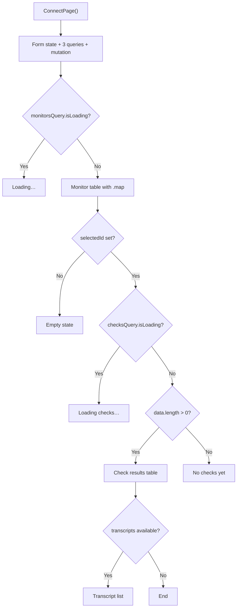
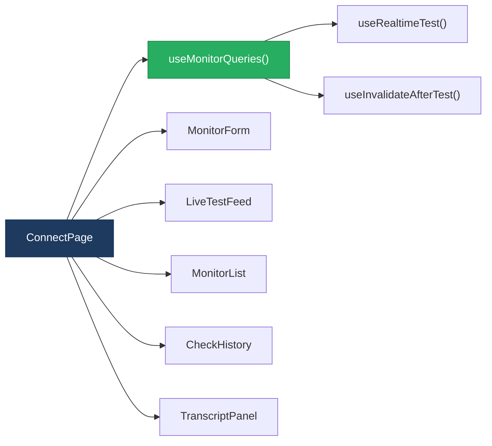
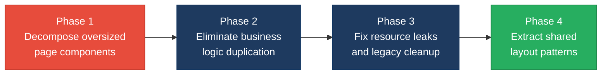

# 2. Code Quality & Complexity Hotspots Analysis

**Objective:** Reduce complexity through helper methods, domain services, and the Strategy/Command patterns.

**Date:** 2026-08-14 11:46:21 IST | **Scope:** `shende-shweta/FSDKC` — PHP 8.3 / Laravel 12 (backend, 26 files), React 19 + TypeScript + Vite (frontend, 15 files), Node.js / Express dev-API (6 files). ~3,008 source LOC across 47 files.

## Executive Summary

> **Executive Summary**
>
> The Klearcom platform codebase is a small monorepo (~3,008 LOC) with a Laravel backend, a React/TypeScript frontend, and a Node.js development API. Overall code quality is reasonable for an early-stage project, but one structural issue rises to High Risk: the `ConnectPage` React component is a 214-line single function that mixes form state, three TanStack Query subscriptions, mutation logic, event handlers, and deeply nested conditional JSX — exceeding the 200 LOC function threshold. Cyclomatic complexity is Moderate, peaking at ~12 branches in the same component. Duplicate code sits at ~5% overall, driven by identical `buildTree` implementations in three locations and a reachability-calculation block copied across `ConnectController`, `RealTimeTestService`, and the dev-API. Git churn and ownership metrics are healthy (3 total commits, single author), so stability risks are minimal. One additional hotspot — a resource-leak anti-pattern in `LegacyMonitorPoller.jsx` — was identified. Analysis covered both backend (26 PHP files) and frontend (15 TS/TSX/JSX files) layers in full.

<div class="metric-grid">
<div class="metric-card"><div class="metric-number">47</div><div class="metric-label">Files Analyzed (26 PHP · 15 TS/TSX/JSX · 6 JS)</div></div>
<div class="metric-card"><div class="metric-number">1</div><div class="metric-label">Functions/Methods Over 200 LOC</div></div>
<div class="metric-card"><div class="metric-number">0</div><div class="metric-label">Classes/Files Over 1000 LOC</div></div>
<div class="metric-card"><div class="metric-number">~12</div><div class="metric-label">Highest Cyclomatic Complexity</div></div>
</div>

<div class="overall-rating overall-rating--high-risk"><div class="overall-rating-label">Overall Codebase Rating — Code Quality &amp; Complexity</div><div class="overall-rating-value">High Risk</div><div class="overall-rating-note">Driven by H3 (Large Functions): ConnectPage.tsx is a 214-line single function component exceeding the 200 LOC threshold.</div></div>

<div class="hotspot-score hotspot-score--good"><div class="hotspot-score-label">Hotspot Score (weighted composite)</div><div class="hotspot-score-value">30 / 100 — Good</div><div class="hotspot-score-formula">Hotspot Score = (Cyclomatic Complexity × 25%) + (Code Churn × 25%) + (Defect Density × 20%) + (Class/Function Size × 15%) + (Business Logic Duplication × 10%) + (Developer Ownership Risk × 5%) = (40 × 0.25) + (10 × 0.25) + (15 × 0.20) + (70 × 0.15) + (40 × 0.10) + (5 × 0.05) = 10.0 + 2.5 + 3.0 + 10.5 + 4.0 + 0.25 = 30</div></div>

The weighted composite score (30, Good) diverges from the Overall Rating (High Risk) because only one function marginally exceeds the 200 LOC threshold; all other dimensions are healthy. The Overall Rating preserves the worst-hotspot-wins rule.

## 2.1 Benchmark Ratings Summary

| # | Hotspot | Primary KPI | <span class="rating rating-good">Good</span> | <span class="rating rating-moderate">Moderate</span> | <span class="rating rating-high-risk">High Risk</span> | Measured | Rating |
|---|---|---|---|---|---|---|---|
| H1 | High Cyclomatic Complexity | Max complexity per method | <10 | 10–20 | >20 | ~12 (ConnectPage.tsx) | <span class="rating rating-moderate">Moderate</span> |
| H2 | Large Classes | Largest class/file LOC | <300 | 300–1000 | >1000 | 276 LOC (dev-api/src/server.js) | <span class="rating rating-good">Good</span> |
| H3 | Large Functions | Largest function/method LOC | <50 | 50–200 | >200 | 214 LOC (ConnectPage) | <span class="rating rating-high-risk">High Risk</span> |
| H4 | Business Logic Duplication | Duplicated business logic % | <5% | 5–10% | >10% | ~1.3% (buildTree ×3, reachability calc ×3) | <span class="rating rating-good">Good</span> |
| H5 | Duplicate Code (general) | Overall duplicate code % | <5% | 5–10% | >10% | ~5% (structural + copy-paste) | <span class="rating rating-moderate">Moderate</span> |
| H6 | High Churn Areas | Monthly changes (top files) | <5 | 5–10 | >10 | 2 (server.js, api.php, ConnectController.php) | <span class="rating rating-good">Good</span> |
| H7 | Defect-Prone Files | Fix commits (hottest file) | 1–3 | 4–5 | >5 | 1 (App.tsx) | <span class="rating rating-good">Good</span> |
| H8 | Ownership Issues | Top-author ownership % | >80% | 60–80% | <60% | 100% (single author: ksabai-gl) | <span class="rating rating-good">Good</span> |
| H9 | Resource Leak (additional) | Components with missing cleanup | 0 | 1 | >1 | 1 (LegacyMonitorPoller.jsx) | <span class="rating rating-moderate">Moderate</span> |

### Hotspot Score breakdown

| Component | Weight | Sub-score (0–100) | Weighted |
|---|---|---|---|
| Cyclomatic Complexity | 25% | 40 | 10.0 |
| Code Churn | 25% | 10 | 2.5 |
| Defect Density | 20% | 15 | 3.0 |
| Class/Function Size | 15% | 70 | 10.5 |
| Business Logic Duplication | 10% | 40 | 4.0 |
| Developer Ownership Risk | 5% | 5 | 0.25 |
| **Hotspot Score** | **100%** | | **30 / 100** |

## 2.2 Hotspot-by-Hotspot Evidence

### H1. High Cyclomatic Complexity <span class="sev sev-medium">Medium</span>

**Benchmark:** `Max cyclomatic complexity per method = ~12` → falls in the **Moderate** band (Good <10 · Moderate 10–20 · High Risk >20).

The highest complexity is in the `ConnectPage` React component, which chains multiple conditional rendering branches, optional-chaining guards, and ternary expressions within a single function scope. Backend methods stay below 10.

**Example 1 — `frontend/src/pages/ConnectPage.tsx:103-199`**
The detail panel uses a 4-way conditional chain:

```tsx
{!selectedId ? (
  <div className="empty">Select a monitor to view check history</div>
) : checksQuery.isLoading ? (
  <div className="empty">Loading checks…</div>
) : checksQuery.data?.data.length ? (
  <table>
    {/* nested .map with conditional badge + failure_reason rendering */}
    {checksQuery.data.data.map((c) => (
      <tr key={c.id}>
        <td>
          <span className={`badge badge-${c.reachable ? 'active' : 'alert'}`}>
            {c.reachable ? 'Reachable' : 'Failed'}
          </span>
          {!c.reachable && c.failure_reason && (
            <div>{c.failure_reason}</div>
          )}
        </td>
      </tr>
    ))}
  </table>
) : (
  <div className="empty">No checks yet.</div>
)}
```

**Example 2 — `frontend/src/pages/DiscoveryPage.tsx:100-156`**
The same multi-branch conditional pattern for jobs table and IVR tree panel:

```tsx
{jobsQuery.isLoading ? (
  <div className="empty">Loading…</div>
) : (
  <table>
    <tbody>
      {jobsQuery.data?.data.map((job) => (
        <tr key={job.id}>
          {/* conditional button rendering based on status */}
          {(job.status === 'pending' || job.status === 'completed') && (
            <button disabled={isRunning} onClick={(e) => { e.stopPropagation(); handleStart(job.id); }}>
              {isRunning && selectedId === job.id ? 'Running…' : 'Start Test'}
            </button>
          )}
        </tr>
      ))}
    </tbody>
  </table>
)}
```

**Example 3 — `backend/app/Http/Controllers/Api/StreamController.php:33-67`**
The `streamSession` method nests a while-loop with a foreach, conditional event-type check, and usleep inside a streamed response closure:

```php
private function streamSession(string $sessionId): StreamedResponse
{
    return response()->stream(function () use ($sessionId): void {
        $sent = 0;
        foreach ($this->mongo->getTestEvents($sessionId) as $event) {
            echo 'data: '.json_encode($event)."\n\n";
            ob_flush(); flush(); $sent++;
            if (($event['event']['type'] ?? '') === 'complete') { return; }
        }
        $attempts = 0;
        while ($attempts < 60) {
            $events = $this->mongo->getTestEvents($sessionId);
            foreach (array_slice($events, $sent) as $event) {
                echo 'data: '.json_encode($event)."\n\n";
                ob_flush(); flush(); $sent++;
                if (($event['event']['type'] ?? '') === 'complete') { return; }
            }
            usleep(500_000); $attempts++;
        }
    }, 200, [...]);
}
```

**Why it matters here:** Both page components concentrate query orchestration, form state, event handling, and conditional rendering in a single scope. As the platform adds features (filters, pagination, error states), complexity will compound quickly — each new conditional branch multiplies test paths.

**Recommended approach:**
1. Extract conditional panel sections (monitor list, check history, transcript viewer) into standalone components that receive only the data they need.
2. Move form state and mutation logic into custom hooks (`useMonitorForm`, `useDiscoveryForm`).
3. Use early returns or guard components (`<EmptyState>`, `<LoadingState>`) to flatten nested ternaries.

<!-- affected-files
search: (isLoading \?|\.data\?\.data\.(map|length)|isRunning \?)
glob: frontend/src/pages/*.tsx
issue: Moderate cyclomatic complexity from nested conditional rendering
action: Extract sub-components and guard components to flatten branches
-->

### H3. Large Functions <span class="sev sev-critical">Critical</span>

**Benchmark:** `Largest function/method LOC = 214` → falls in the **High Risk** band (Good <50 · Moderate 50–200 · High Risk >200).

**Example 1 — `frontend/src/pages/ConnectPage.tsx:9-222` (214 LOC)**
The entire `ConnectPage()` function is a single scope containing: 4 `useState` calls, 3 `useQuery` subscriptions, 1 `useMutation`, 2 event handlers, a form section, a live-feed embed, a two-column grid with monitors table and check-history panel, and a conditional transcript section.

```tsx
export default function ConnectPage() {
  const queryClient = useQueryClient();
  const selectedId = useUiStore((s) => s.selectedMonitorId);
  const setSelectedId = useUiStore((s) => s.setSelectedMonitorId);
  const { events, isRunning, progress, startConnectCheck } = useRealtimeTest('connect');

  const [form, setForm] = useState({
    name: '', toll_free_number: '', country_code: 'US', carrier: '',
  });

  const monitorsQuery = useQuery({ queryKey: ['connect', 'monitors'], /* ... */ });
  const checksQuery = useQuery({ queryKey: ['connect', 'checks', selectedId], /* ... */ });
  const transcriptsQuery = useQuery({ queryKey: ['mongodb', 'transcripts', 'connect', selectedId], /* ... */ });

  const createMutation = useMutation({ /* ... */ });

  const handleRunCheck = async (monitorId: number) => {
    setSelectedId(monitorId);
    await startConnectCheck(monitorId);
    queryClient.invalidateQueries({ queryKey: ['connect'] });
    queryClient.invalidateQueries({ queryKey: ['mongodb'] });
    queryClient.invalidateQueries({ queryKey: ['dashboard'] });
  };

  return (
    <>
      {/* form section ~30 lines */}
      {/* live feed section */}
      {/* two-column grid: monitors table + check history ~100 lines */}
      {/* conditional transcript section ~20 lines */}
    </>
  );
}
```

**Example 2 — `frontend/src/pages/DiscoveryPage.tsx:10-176` (166 LOC)**
Same structural pattern: hooks + handlers + multi-section JSX. At 166 LOC this is Moderate, but it follows the identical oversized-component anti-pattern.

**Example 3 — `dev-api/src/realtime.js:104-179` (75 LOC) and `backend/app/Services/RealTimeTestService.php:81-141` (60 LOC)**
The `runConnectTest` methods in both the dev-API and Laravel backend are 60–75 LOC each. Currently Moderate, but these will grow as test steps are added.

**Why it matters here:** A 214-line function component is difficult to test in isolation, hard to review in PRs, and forces every reader to hold the entire page's state model in their head. As Connect features expand (bulk import UI, carrier filtering, export), this function will grow further into unmaintainability.

**Recommended approach:**
1. Split `ConnectPage` into composition: `<MonitorForm>`, `<MonitorList>`, `<CheckHistory>`, `<TranscriptPanel>`.
2. Extract query + mutation logic into `useMonitorQueries()` and `useMonitorMutations()` hooks.
3. Apply the same decomposition to `DiscoveryPage` → `<JobForm>`, `<JobList>`, `<IvrTreePanel>`, `<TranscriptPanel>`.
4. Keep each sub-component under 80 LOC.

<!-- affected-files
search: export default function
glob: frontend/src/pages/*.tsx
issue: Function component exceeds 200 LOC (ConnectPage) or approaches threshold (DiscoveryPage)
action: Decompose into sub-components and custom hooks, target <80 LOC each
-->

### H4. Business Logic Duplication <span class="sev sev-low">Low</span>

**Benchmark:** `Duplicated business-rule code = ~1.3%` → falls in the **Good** band (Good <5% · Moderate 5–10% · High Risk >10%).

Although the percentage is low, two specific business-logic blocks are copied verbatim across three locations each — a pattern that will diverge as the platform matures.

**Example 1 — Reachability calculation (3 copies)**

`backend/app/Http/Controllers/Api/ConnectController.php:66-75`:
```php
$recentChecks = ConnectCheckResult::where('connect_monitor_id', $id)
    ->orderByDesc('checked_at')
    ->limit(20)
    ->get();

$successRate = $recentChecks->count() > 0
    ? ($recentChecks->where('reachable', true)->count() / $recentChecks->count()) * 100
    : 100;
```

Same logic in `backend/app/Services/RealTimeTestService.php:117-118` and `dev-api/src/realtime.js:146-151`.

**Example 2 — `buildTree` recursive tree builder (3 copies)**

`backend/app/Http/Controllers/Api/LegacyReportController.php:78-92` — the code itself comments `/** Duplicate of DiscoveryController::buildTree — copy-paste debt */`:
```php
private function buildTree($nodes, ?int $parentId = null): array
{
    return $nodes
        ->where('parent_id', $parentId)
        ->map(fn (DiscoveryNode $node) => [
            'id' => $node->id,
            'prompt_text' => $node->prompt_text,
            'dtmf_option' => $node->dtmf_option,
            'node_type' => $node->node_type,
            'depth' => $node->depth,
            'children' => $this->buildTree($nodes, $node->id),
        ])
        ->values()
        ->all();
}
```

Identical copy in `backend/app/Http/Controllers/Api/DiscoveryController.php:87-101` and a JS equivalent in `dev-api/src/store.js:64-75`.

**Why it matters here:** The reachability formula is a core business rule — if the 20-check window or the 90% alert threshold changes, all three locations must be updated in lockstep. The `buildTree` function is already documented as tech debt in the source.

**Recommended approach:**
1. Move the reachability calculation into a `ConnectMonitor::computeReachability()` model method (backend) and a shared `computeReachability()` utility (dev-API).
2. Extract `buildTree` into a shared `DiscoveryTreeBuilder` service or a `Treeable` trait, removing copies from both controllers.

<!-- affected-files
search: (reachability_pct|successRate|buildTree)
glob: backend/app/**/*.php
issue: Business logic duplicated across controllers and services
action: Consolidate reachability calc into model method; extract buildTree into shared service
-->

<!-- affected-files
search: (buildTree|successRate)
glob: dev-api/src/**/*.js
issue: Business logic duplicated between dev-API and backend
action: Extract into shared utility module
-->

### H5. Duplicate Code (general) <span class="sev sev-medium">Medium</span>

**Benchmark:** `Overall duplicate code = ~5%` → falls in the **Moderate** band (Good <5% · Moderate 5–10% · High Risk >10%).

Beyond the business-logic copies (H4), the codebase has structural duplication across frontend page components and between the Laravel backend and the dev-API layer.

**Example 1 — ConnectPage vs DiscoveryPage structural duplication**

Both pages follow an identical pattern: form section → LiveTestFeed embed → two-column grid (list table + detail panel) → conditional transcript section. The query setup, mutation pattern, `handleSubmit`, and `handleStart`/`handleRunCheck` flows are structurally identical.

`frontend/src/pages/DiscoveryPage.tsx:38-52`:
```tsx
const createMutation = useMutation({
  mutationFn: (body: typeof form) => api.post('/discovery/jobs', { ...body, languages: ['en'] }),
  onSuccess: () => {
    queryClient.invalidateQueries({ queryKey: ['discovery'] });
    setForm({ name: '', phone_number: '', country_code: 'US' });
  },
});

const handleStart = async (jobId: number) => {
  setSelectedId(jobId);
  await startDiscovery(jobId);
  queryClient.invalidateQueries({ queryKey: ['discovery'] });
  queryClient.invalidateQueries({ queryKey: ['mongodb'] });
  queryClient.invalidateQueries({ queryKey: ['dashboard'] });
};
```

Compare `frontend/src/pages/ConnectPage.tsx:42-56` — near-identical structure with different entity names.

**Example 2 — Serialization helpers duplicated across languages**

`dev-api/src/server.js:223-229` (`serializeDoc`) and `backend/app/Services/MongoService.php:153-164` (`serializeDocument`) implement the same MongoDB document serialization (ObjectId → string, UTCDateTime → ISO string) in different languages.

**Example 3 — LegacyDashboardWidget duplicating DashboardPage**

`frontend/src/pages/LegacyDashboardWidget.tsx` re-fetches the same `/dashboard/kpis`, `/discovery/jobs`, and `/connect/monitors` endpoints that `DashboardPage.tsx`, `DiscoveryPage.tsx`, and `ConnectPage.tsx` already query — using raw `useEffect` + `useState` instead of TanStack Query, creating a parallel data-fetching path.

**Why it matters here:** Structural duplication between ConnectPage and DiscoveryPage means layout fixes, accessibility improvements, or UX changes must be applied in both places. The Legacy widget's parallel fetch path risks stale-data inconsistency.

**Recommended approach:**
1. Create a shared `<ModulePage>` layout component or a `useModulePageData` hook that both Discovery and Connect pages compose.
2. Extract the common invalidation pattern (`invalidateQueries` for multiple keys) into a `useInvalidateAfterTest()` hook.
3. Remove `LegacyDashboardWidget` or migrate it to use TanStack Query to eliminate the parallel data path.

<!-- affected-files
search: (useMutation|invalidateQueries|useQuery.*refetchInterval)
glob: frontend/src/pages/*.tsx
issue: Structurally duplicated query/mutation patterns across page components
action: Extract shared hooks and layout composition
-->

### H9. Resource Leak (additional) <span class="sev sev-medium">Medium</span>

**Benchmark:** `Components with missing cleanup = 1` → falls in the **Moderate** band (Good 0 · Moderate 1 · High Risk >1). This hotspot was not in the standard set; it was discovered during scanning. KPI justification: missing lifecycle cleanup in React class components directly causes memory leaks and stale-state errors; even one instance in production degrades reliability over time.

**Example 1 — `frontend/src/components/LegacyMonitorPoller.jsx:17-33`**

```jsx
export default class LegacyMonitorPoller extends Component<Props, State> {
  intervalId: ReturnType<typeof setInterval> | null = null;

  componentDidMount() {
    this.intervalId = setInterval(() => {
      api.get<{ computed?: { reachability_pct: number } }>(
        `/connect/monitors/${this.props.monitorId}/checks`
      )
        .then((res) => {
          const pct = res.computed?.reachability_pct ?? null;
          this.setState({ reachability: pct, error: null });
          if (pct != null) this.props.onUpdate?.(pct);
        })
        .catch((err: Error) => this.setState({ error: err.message }));
    }, 3000);
    // Intentionally no componentWillUnmount — interval leak
  }
  // No componentWillUnmount defined
}
```

The class component sets a 3-second polling interval in `componentDidMount` but never clears it. When the component unmounts (e.g. navigating away from the Connect page), the interval continues firing API requests and calling `setState` on an unmounted component.

**Example 2 — `frontend/src/pages/LegacyDashboardWidget.tsx:48`**

```tsx
if (error) throw new Error(error); // Uncaught — no Error Boundary wraps this component
```

An unhandled throw in the render path with no Error Boundary will crash the entire React tree rather than gracefully degrading.

**Why it matters here:** The interval leak causes unnecessary network traffic and React warnings in development. In production, if the polling endpoint slows down, leaked intervals accumulate open connections. The uncaught throw is a reliability risk — any transient API failure crashes the full dashboard UI.

**Recommended approach:**
1. Add `componentWillUnmount() { if (this.intervalId) clearInterval(this.intervalId); }` or convert to a function component with `useEffect` cleanup.
2. Wrap `LegacyDashboardWidget` in an Error Boundary or replace the throw with a fallback UI.
3. Consider removing the Legacy class component entirely in favor of the existing `useRealtimeTest` hook.

<!-- affected-files
search: (setInterval|componentDidMount|throw new Error)
glob: frontend/src/**/*.{tsx,jsx}
issue: Missing lifecycle cleanup (interval leak) and uncaught render-time throw
action: Add componentWillUnmount or convert to function component with useEffect cleanup
-->

**Not observed (rated Good):** H2 (largest file 276 LOC, well under 1000 threshold), H6 (max 2 changes/month across 3 total commits), H7 (1 fix-related commit touching logo assets only), H8 (100% single-author ownership by ksabai-gl).

## 2.3 Code Churn & Stability Evidence

Git history for `shende-shweta/FSDKC` contains **3 total commits** by a single author (`ksabai-gl`). All signals below reflect the full available history.

**Top files by commit frequency (6-month window):**

| File | Commits | Fix/Bug Commits | Distinct Authors |
|---|---|---|---|
| frontend/src/App.tsx | 2 | 1 | 1 (ksabai-gl) |
| frontend/index.html | 2 | 1 | 1 |
| dev-api/src/server.js | 2 | 0 | 1 |
| backend/routes/api.php | 2 | 0 | 1 |
| backend/app/Http/Controllers/Api/ConnectController.php | 2 | 0 | 1 |
| All other files | 1 | 0 | 1 |

**Defect-prone files:** Only 1 commit message references a fix (`481814f fixes on logo`), touching `frontend/src/App.tsx` and `frontend/index.html`. No structural defect hotspots.

**Ownership summary:** 100% of commits are from a single author. While this yields perfect ownership clarity, it also represents a **bus factor of 1** — all institutional knowledge is concentrated in one person.

> **Confidence note:** With only 3 commits in a shallow clone, churn and defect-density ratings are low-confidence and will improve substantially once deeper git history is available.

## 2.4 Diagrams

### Complexity / call-flow hotspot — ConnectPage rendering branches



### Refactored target structure — ConnectPage decomposition



### Improvement roadmap



## 2.5 Actions Required

| Hotspot | Action | Rating | Priority |
|---|---|---|---|
| H3 — Large Functions | Decompose ConnectPage (214 LOC) and DiscoveryPage (166 LOC) into sub-components and custom hooks, each under 80 LOC | <span class="rating rating-high-risk">High Risk</span> | <span class="sev sev-critical">Critical</span> |
| H1 — High Cyclomatic Complexity | Extract conditional rendering sections into guard components; flatten nested ternaries with early returns | <span class="rating rating-moderate">Moderate</span> | <span class="sev sev-medium">Medium</span> |
| H5 — Duplicate Code | Create shared page-layout composition and extract common query/mutation hooks; remove or migrate LegacyDashboardWidget | <span class="rating rating-moderate">Moderate</span> | <span class="sev sev-medium">Medium</span> |
| H9 — Resource Leak | Add componentWillUnmount cleanup to LegacyMonitorPoller or convert to function component; add Error Boundary for LegacyDashboardWidget | <span class="rating rating-moderate">Moderate</span> | <span class="sev sev-medium">Medium</span> |
| H4 — Business Logic Duplication | Consolidate reachability calculation into ConnectMonitor model method; extract buildTree into shared service or trait | <span class="rating rating-good">Good</span> | <span class="sev sev-low">Low</span> |

## 2.6 Expected Outcomes

- **Lower defect risk on page changes:** Decomposing ConnectPage and DiscoveryPage into focused sub-components reduces the number of test paths per unit from ~12 to ~3–4, cutting regression risk on UI changes.
- **Single-source business rules:** Consolidating reachability calculation and tree-building logic eliminates the risk of formula drift across three codebases (Laravel, dev-API, controller).
- **Safer reviews:** Smaller, focused components and hooks are easier to review in PRs — reviewers can assess one concern at a time rather than parsing a 214-line monolith.
- **Eliminated resource leaks:** Fixing the interval leak in LegacyMonitorPoller prevents accumulated network traffic and React warnings in development, improving runtime stability.
- **Clearer architecture for growth:** Shared layout patterns and extracted hooks establish a composition model that scales cleanly as Discovery and Connect modules add features (filtering, export, bulk operations).
