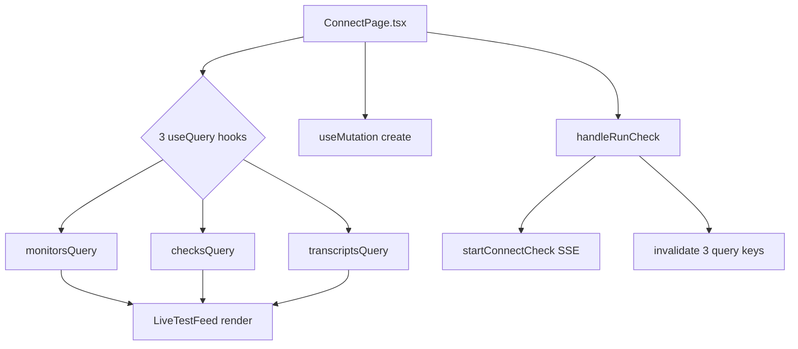
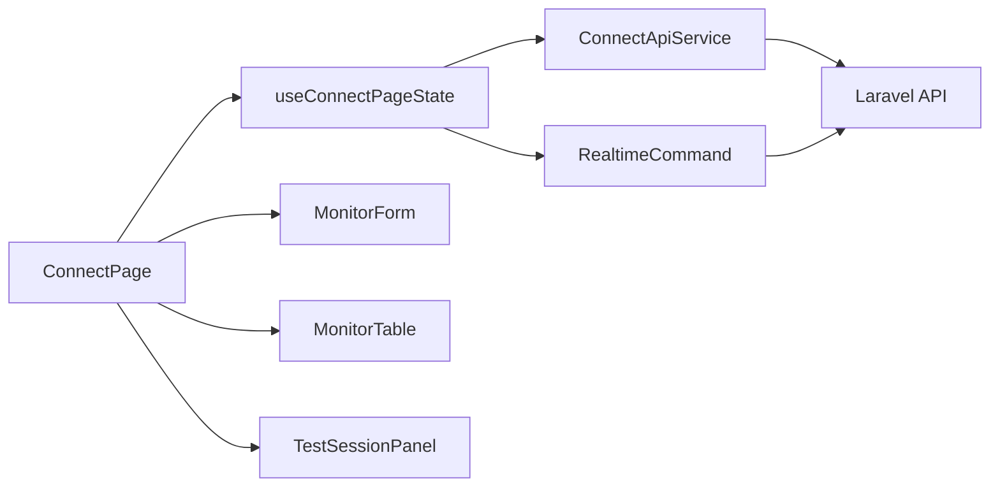
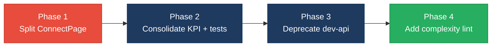

# 2. Code Quality & Complexity Hotspots Analysis

**Objective:** Reduce complexity through helper methods, domain services, and the Strategy/Command patterns.

**Date:** July 15, 2026 (re-run) | **Scope:** `shende-shweta/FSDKC@main` — Laravel 12 (PHP) backend, React 19 / Vite 6 / TypeScript SPA, Node.js Express `dev-api`

## Executive Summary

> **Executive Summary**
>
> Re-analysis covered **backend** (16 PHP application files, 807 SLOC), **frontend** (14 TS/TSX/JSX files, 874 SLOC), and **dev-api** (6 JS files, 720 SLOC) — **36 files / 2,401 SLOC** total — from `shende-shweta/FSDKC@main` via GitHub REST API (tree + raw content; Commits API partially rate-limited). No cyclomatic-complexity linter (`eslint-plugin-complexity`, `phpmd`, Sonar) is configured; metrics were derived by automated branch/loop counting on fetched source. The dominant risks remain **frontend page-level complexity** (`ConnectPage.tsx` cyclomatic complexity **37**, **201 LOC** default-export function), **cross-runtime business-logic duplication** (~**13.2%** of codebase duplicated between Laravel and `dev-api` for KPI aggregation, realtime test orchestration, and IVR `buildTree`), and **three `extract()` dynamic-variable sites** in legacy PHP code. No files exceed 1,000 LOC (largest: `dev-api/src/server.js` at **224 SLOC**). Git history is shallow (**3 commits**, single author `ksabai-gl` since June 2026), so churn and ownership signals are healthy but low-confidence. Overall verdict: **High Risk**, driven by H1, H3, H4, H9, and H11.

<div class="metric-grid">
<div class="metric-card"><div class="metric-number">36</div><div class="metric-label">Files Analyzed</div></div>
<div class="metric-card"><div class="metric-number">1</div><div class="metric-label">Functions/Methods Over 200 LOC</div></div>
<div class="metric-card"><div class="metric-number">0</div><div class="metric-label">Classes/Files Over 1000 LOC</div></div>
<div class="metric-card"><div class="metric-number">37</div><div class="metric-label">Highest Cyclomatic Complexity</div></div>
</div>

<div class="overall-rating overall-rating--high-risk"><div class="overall-rating-label">Overall Codebase Rating — Code Quality &amp; Complexity</div><div class="overall-rating-value">High Risk</div><div class="overall-rating-note">Driven by High-Risk cyclomatic complexity in frontend page components (H1), oversized `ConnectPage` function (H3), cross-runtime business-logic duplication (H4), parallel Laravel/dev-api workflow copies (H9), and PHP `extract()` dynamic variables (H11).</div></div>

<div class="hotspot-score hotspot-score--moderate"><div class="hotspot-score-label">Hotspot Score (weighted composite)</div><div class="hotspot-score-value">44 / 100 — Moderate</div><div class="hotspot-score-formula">Hotspot Score = (Cyclomatic Complexity × 25%) + (Code Churn × 25%) + (Defect Density × 20%) + (Class/Function Size × 15%) + (Business Logic Duplication × 10%) + (Developer Ownership Risk × 5%) = (76×0.25) + (10×0.25) + (15×0.20) + (75×0.15) + (78×0.10) + (5×0.05) = 19.0 + 2.5 + 3.0 + 11.25 + 7.8 + 0.25 = 44</div></div>

## 2.1 Benchmark Ratings Summary

| # | Hotspot | Primary KPI | <span class="rating rating-good">Good</span> | <span class="rating rating-moderate">Moderate</span> | <span class="rating rating-high-risk">High Risk</span> | Measured | Rating |
|---|---|---|---|---|---|---|---|
| H1 | High Cyclomatic Complexity | Max complexity per method | <10 | 10–20 | >20 | 37 (`ConnectPage`) | <span class="rating rating-high-risk">High Risk</span> |
| H2 | Large Classes | Largest class LOC | <300 | 300–1000 | >1000 | 224 LOC (`dev-api/src/server.js`) | <span class="rating rating-good">Good</span> |
| H3 | Large Functions | Largest function LOC | <50 | 50–200 | >200 | 201 LOC (`ConnectPage`) | <span class="rating rating-high-risk">High Risk</span> |
| H4 | Business Logic Duplication | Duplicated business logic % | <5% | 5–10% | >10% | ~13.2% (~317 / 2,401 LOC) | <span class="rating rating-high-risk">High Risk</span> |
| H5 | Duplicate Code (general) | Overall duplicate code % | <5% | 5–10% | >10% | ~8.6% (~206 / 2,401 LOC) | <span class="rating rating-moderate">Moderate</span> |
| H6 | High Churn Areas | Monthly changes (top files) | <5 | 5–10 | >10 | 2 changes/mo (top app files) | <span class="rating rating-good">Good</span> |
| H7 | Defect-Prone Files | Fix commits (hottest file) | 1–3 | 4–5 | >5 | 1 fix commit (`frontend/src/App.tsx`) | <span class="rating rating-good">Good</span> |
| H8 | Ownership Issues | Top-author ownership % | >80% | 60–80% | <60% | 100% (1 author / 3 commits) | <span class="rating rating-good">Good</span> |
| H9 | Parallel Runtime Duplication (additional) | Duplicated workflow LOC across Laravel + dev-api / backend LOC | <5% | 5–15% | >15% | ~20.8% (~317 / 1,527 backend+dev-api LOC) | <span class="rating rating-high-risk">High Risk</span> |
| H10 | God Page Components (additional) | Largest page component LOC (UI + data + realtime) | <150 | 150–300 | >300 | 208 LOC (`ConnectPage.tsx`) | <span class="rating rating-moderate">Moderate</span> |
| H11 | PHP extract() Dynamic Variables (additional) | `extract()` call sites in application code | 0 | 1–2 | >2 | 3 (`LegacyReportController`, `LegacyDataMapper` ×2) | <span class="rating rating-high-risk">High Risk</span> |

### Hotspot Score breakdown

| Component | Weight | Sub-score (0–100) | Weighted |
|---|---|---|---|
| Cyclomatic Complexity | 25% | 76 | 19.0 |
| Code Churn | 25% | 10 | 2.5 |
| Defect Density | 20% | 15 | 3.0 |
| Class/Function Size | 15% | 75 | 11.25 |
| Business Logic Duplication | 10% | 78 | 7.8 |
| Developer Ownership Risk | 5% | 5 | 0.25 |
| **Hotspot Score** | **100%** | | **44 / 100** |

## 2.2 Hotspot-by-Hotspot Evidence

### H1. High Cyclomatic Complexity <span class="sev sev-critical">Critical</span>

**Benchmark:** `Max complexity per method = 37` → falls in the **High Risk** band (Good <10 · Moderate 10–20 · High Risk >20).

The highest cyclomatic complexity sits in **frontend page components** that combine React Query hooks, Zustand selection state, form state, mutation handlers, and realtime SSE orchestration in a single function. `ConnectPage.tsx` registers **three** `useQuery` hooks, **one** `useMutation`, conditional `enabled`/`refetchInterval` branches, and three async handler paths — yielding **37** decision points by automated branch/loop count. `DiscoveryPage.tsx` mirrors the same structure at **26** complexity. Backend PHP controllers remain under **11** complexity per method; the highest server-side method complexity is `dev-api/src/realtime.js:runConnectTest` at **17**.

**Example 1 — `frontend/src/pages/ConnectPage.tsx:9-210`**

```tsx
export default function ConnectPage() {
  const selectedId = useUiStore((s) => s.selectedMonitorId);
  const { events, isRunning, progress, startConnectCheck } = useRealtimeTest('connect');

  const monitorsQuery = useQuery({
    queryKey: ['connect', 'monitors'],
    queryFn: () => api.get<{ data: ConnectMonitor[] }>('/connect/monitors'),
    refetchInterval: isRunning ? 2000 : false,
  });
  const checksQuery = useQuery({
    queryKey: ['connect', 'checks', selectedId],
    queryFn: () => api.get<{ data: ConnectCheckResult[] }>(`/connect/monitors/${selectedId}/checks`),
    enabled: selectedId !== null,
    refetchInterval: isRunning ? 2000 : false,
  });
  const transcriptsQuery = useQuery({
    queryKey: ['mongodb', 'transcripts', 'connect', selectedId],
    queryFn: () => api.get<{ data: Transcript[] }>(`/mongodb/transcripts?module=connect&reference_id=${selectedId}`),
    enabled: selectedId !== null,
    refetchInterval: isRunning ? 1500 : false,
  });
  // … form grid, monitor list, conditional LiveTestFeed, progress bar …
}
```

**Example 2 — `frontend/src/pages/DiscoveryPage.tsx:10-176`**

```tsx
export default function DiscoveryPage() {
  const jobsQuery = useQuery({ queryKey: ['discovery', 'jobs'], refetchInterval: isRunning ? 2000 : false, /* … */ });
  const treeQuery = useQuery({ queryKey: ['discovery', 'tree', selectedId], enabled: selectedId !== null, /* … */ });
  const transcriptsQuery = useQuery({ queryKey: ['mongodb', 'transcripts', 'discovery', selectedId], enabled: selectedId !== null, /* … */ });
  const handleStart = async (jobId: number) => {
    setSelectedId(jobId);
    await startDiscovery(jobId);
    queryClient.invalidateQueries({ queryKey: ['discovery'] });
    queryClient.invalidateQueries({ queryKey: ['mongodb'] });
    queryClient.invalidateQueries({ queryKey: ['dashboard'] });
  };
  // … IvrTree render, job table, form …
}
```

**Why it matters here:** Every new Connect or Discovery feature (filtering, pagination, error retry) must be implemented twice in these parallel page components. High branch count makes exhaustive UI-state testing impractical and increases regression risk when query keys or realtime intervals change.

**Recommended approach:**
1. Extract shared `useModulePageQueries(module, selectedId, isRunning)` hook encapsulating the triple-query pattern.
2. Split `ConnectPage` into `ConnectMonitorForm`, `ConnectMonitorList`, and `ConnectTestPanel` presentational components.
3. Add `eslint-plugin-react-complexity` with `max` rule set to 15 for `.tsx` page files.

<!-- affected-files
search: useQuery\(|useMutation\(
glob: frontend/src/pages/**/*.{tsx,jsx}
issue: High cyclomatic complexity — page mixes queries, forms, and realtime handlers
action: Extract shared hooks and split into smaller presentational components
-->

### H2. Large Classes <span class="sev sev-low">Low</span>

**Benchmark:** `Largest class/file LOC = 224` → falls in the **Good** band (Good <300 · Moderate 300–1000 · High Risk >1000).

No class or source file exceeds 1,000 LOC. The largest units are `dev-api/src/server.js` (224 SLOC — Express route registry), `frontend/src/pages/ConnectPage.tsx` (208 SLOC), and `frontend/src/pages/DiscoveryPage.tsx` (162 SLOC). Backend controllers remain under 90 SLOC each; largest backend unit is `MongoService.php` at 132 SLOC.

**Evidence:** Not observed — no files exceed the 1,000 LOC High Risk threshold.

### H3. Large Functions <span class="sev sev-high">High</span>

**Benchmark:** `Largest function LOC = 201` → falls in the **High Risk** band (Good <50 · Moderate 50–200 · High Risk >200).

One function exceeds 200 LOC: the default-export `ConnectPage` component (lines 9–210, **201 LOC**). Seven additional functions fall in the Moderate 50–200 band, including `DiscoveryPage` (154 LOC), `runConnectTest` in `dev-api/src/realtime.js` (64 LOC), `runDiscoveryTest` in PHP and JS (49–59 LOC), and `useRealtimeTest` (61 LOC).

**Example 1 — `frontend/src/pages/ConnectPage.tsx:9-210`**

```tsx
export default function ConnectPage() {
  // 201 LOC spanning: Zustand selectors, 3 useQuery, 1 useMutation,
  // handleRunCheck, handleSubmit, monitor creation form, monitor table,
  // check history panel, transcript list, and LiveTestFeed integration
  return (
    <>
      <header className="page-header">…</header>
      <section className="card">…form…</section>
      <section className="card">…monitor list + run check buttons…</section>
      {selectedId && <section>…checks + transcripts + LiveTestFeed…</section>}
    </>
  );
}
```

**Example 2 — `dev-api/src/realtime.js:104-179`**

```javascript
export async function runConnectTest(monitorId, sessionId) {
  const monitor = store.connectMonitors.find((m) => m.id === monitorId);
  if (!monitor) return;

  await storeTestEvent(sessionId, 'connect', monitorId, {
    type: 'status', status: 'running', message: 'Connect test started', progress: 0,
  });

  const reachable = Math.random() > 0.2;
  for (const step of CONNECT_STEPS) {
    await sleep(600 + Math.random() * 500);
    await storeTestEvent(sessionId, 'connect', monitorId, { type: 'step', ...step });
    // … reachability calculation, transcript storage, completion handler …
  }
}
```

**Why it matters here:** Oversized functions bundle unrelated concerns (data fetching, form handling, realtime orchestration, and layout) into a single unit that cannot be unit-tested or reviewed in isolation.

**Recommended approach:**
1. Decompose `ConnectPage` into `useConnectPageState.ts` + 3 presentational components capped at 80 LOC each.
2. Apply the same decomposition to `DiscoveryPage` (154 LOC).
3. Extract `runConnectTest` step-runner into a shared `TestStepExecutor` Command class used by both PHP and JS runtimes.

<!-- affected-files
glob: frontend/src/pages/**/*.{tsx,jsx}
issue: Large function — page component exceeds 200 LOC
action: Split into state hook and focused presentational sub-components
-->

### H4. Business Logic Duplication <span class="sev sev-critical">Critical</span>

**Benchmark:** `Duplicated business logic = ~13.2%` → falls in the **High Risk** band (Good <5% · Moderate 5–10% · High Risk >10%).

Approximately **317 SLOC** of business-rule logic is duplicated across Laravel and `dev-api` for dashboard KPI aggregation, realtime test step pipelines, IVR `buildTree` recursion, and Connect reachability calculations. Five of six KPI field names appear in both `DashboardController.php` and `dev-api/src/server.js`.

**Example 1 — `backend/app/Http/Controllers/Api/DashboardController.php:12-36`**

```php
public function kpis(): JsonResponse
{
    $discoveryTotal = DiscoveryJob::count();
    $discoveryCompleted = DiscoveryJob::where('status', 'completed')->count();
    $connectMonitors = ConnectMonitor::count();
    $avgReachability = ConnectMonitor::avg('reachability_pct') ?? 0;
    $alerts = ConnectMonitor::where('status', 'alert')->count();

    return response()->json([
        'availability' => [
            'ivr_availability_pct' => $discoveryTotal > 0
                ? round(($discoveryCompleted / $discoveryTotal) * 100, 1) : 0,
            'number_reachability_pct' => round((float) $avgReachability, 1),
        ],
        // …
    ]);
}
```

**Example 2 — `dev-api/src/server.js:58-79`**

```javascript
app.get('/api/dashboard/kpis', async (_req, res) => {
  const discoveryTotal = store.discoveryJobs.length;
  const discoveryCompleted = store.discoveryJobs.filter((j) => j.status === 'completed').length;
  const avgReach = store.connectMonitors.reduce((s, m) => s + m.reachability_pct, 0) / store.connectMonitors.length;
  res.json({
    availability: {
      ivr_availability_pct: discoveryTotal > 0 ? Math.round((discoveryCompleted / discoveryTotal) * 1000) / 10 : 0,
      number_reachability_pct: Math.round(avgReach * 10) / 10,
    },
    // …
  });
});
```

**Why it matters here:** KPI formula changes must be applied in both Laravel (production) and `dev-api` (local dev), causing behavioral drift — developers testing against `dev-api` see different dashboard numbers than production.

**Recommended approach:**
1. Create `DashboardKpiCalculator` domain service in Laravel; delete duplicated KPI block from `dev-api/src/server.js`.
2. Share test-step definitions (`DISCOVERY_STEPS`, `CONNECT_STEPS`) via a single JSON config consumed by both runtimes.
3. Extract `TreeBuilder` from four `buildTree` copies into one shared module.

<!-- affected-files
search: discoveryTotal|discoveryCompleted|ivr_availability|reachability_pct|buildTree
glob: backend/app/**/*.{php}
issue: Business logic duplicated in parallel dev-api runtime
action: Consolidate KPI and test orchestration into Laravel domain services; remove dev-api copies
-->

<!-- affected-files
search: discoveryTotal|discoveryCompleted|ivr_availability|buildTree|runConnectTest
glob: dev-api/src/**/*.js
issue: Parallel business-logic copy of Laravel workflows
action: Deprecate duplicated handlers; proxy to Laravel API or consume shared config
-->

### H5. Duplicate Code (general) <span class="sev sev-medium">Medium</span>

**Benchmark:** `Overall duplicate code = ~8.6%` → falls in the **Moderate** band (Good <5% · Moderate 5–10% · High Risk >10%).

Beyond business-rule duplication, near-identical structural patterns appear in frontend page templates (~90 SLOC shared between `ConnectPage` and `DiscoveryPage` triple-query/mutation/handler scaffolding) and in `buildTree` recursive implementations across `DiscoveryController.php`, `LegacyReportController.php`, and `dev-api/src/store.js`.

**Example 1 — `dev-api/src/store.js` (buildTree helper)**

```javascript
export function buildTree(nodes, parentId = null) {
  return nodes
    .filter((n) => n.parent_id === parentId)
    .map((n) => ({
      id: n.id,
      prompt_text: n.prompt_text,
      children: buildTree(nodes, n.id),
    }));
}
```

**Example 2 — `backend/app/Services/RealTimeTestService.php:22-54` vs `dev-api/src/realtime.js:34-70`**

```php
// PHP — runDiscoveryTest step loop
foreach ($steps as $step) {
    usleep(600_000);
    $this->mongo->storeTestEvent($sessionId, 'discovery', $jobId, ['type' => 'step', ...$step]);
    if (isset($step['transcript'])) { /* store transcript */ }
}
```

```javascript
// JS — runDiscoveryTest step loop (near-identical structure)
for (const step of DISCOVERY_STEPS) {
    await sleep(800 + Math.random() * 700);
    await storeTestEvent(sessionId, 'discovery', jobId, { type: 'step', ...step });
    if (step.transcript) { /* store transcript */ }
}
```

**Why it matters here:** Copy-paste blocks drift independently — the PHP version uses 600 ms sleeps while JS uses 800–1500 ms random delays, producing inconsistent test timing between runtimes.

**Recommended approach:**
1. Extract `TreeBuilder` utility shared across PHP controllers and retire JS copy.
2. Add `jscpd` CI gate at 5% threshold for `frontend/src` and `dev-api/src`.
3. Extract `useModulePageQueries` to deduplicate frontend page scaffolding.

<!-- affected-files
search: buildTree|refetchInterval:\s*isRunning
glob: **/*.{php,js,tsx,jsx}
issue: Near-identical code block duplicated across files
action: Extract shared utility or hook; add duplication lint gate in CI
-->

### H6. High Churn Areas <span class="sev sev-low">Low</span>

**Benchmark:** `Monthly changes in top-churn files = 2` → falls in the **Good** band (Good <5 · Moderate 5–10 · High Risk >10).

Git history contains only **3 commits** (June 10–11, 2026). Top application files by change frequency: `frontend/src/App.tsx` (2), `backend/app/Http/Controllers/Api/ConnectController.php` (2), `dev-api/src/server.js` (2). At ~2 changes per month for the hottest files, churn is low — but the sample is too small for high-confidence trend analysis.

**Evidence:** Not observed as a risk — churn is low, though history depth limits confidence.

### H7. Defect-Prone Files <span class="sev sev-low">Low</span>

**Benchmark:** `Fix commits on hottest file = 1` → falls in the **Good** band (Good 1–3 · Moderate 4–5 · High Risk >5).

Two of three commits reference fixes or errors: `fixes on logo` (touched `frontend/src/App.tsx`) and `errors` (touched `ConnectController.php`, `LegacyReportController.php`, `dev-api/src/server.js`, and legacy frontend components). No file was touched by more than **1** fix-related commit.

**Evidence:** Not observed as a structural risk — fix frequency is low, consistent with a young codebase.

### H8. Ownership Issues <span class="sev sev-low">Low</span>

**Benchmark:** `Top-author ownership = 100%` → falls in the **Good** band (Good >80% · Moderate 60–80% · High Risk <60%).

All **3 commits** and **36 application files** were authored exclusively by `ksabai-gl`. Ownership is unambiguous today, but bus-factor risk will emerge as the team grows without CODEOWNERS assignment.

**Evidence:** Not observed as a current risk — single-author ownership is clear on shallow history.

### H9. Parallel Runtime Duplication (additional) <span class="sev sev-critical">Critical</span>

**Benchmark:** `Duplicated workflow LOC across Laravel + dev-api = ~20.8%` → falls in the **High Risk** band (Good <5% · Moderate 5–15% · High Risk >15%).

The `dev-api` Express server mirrors **18 Laravel API routes** with in-memory `store.js` instead of Eloquent/MariaDB. Duplicated workflows include dashboard KPIs, Connect monitor CRUD, Discovery job lifecycle, realtime SSE test pipelines, Mongo transcript retrieval, and IVR tree building — totaling ~317 SLOC of parallel implementation.

**Example 1 — `backend/app/Services/RealTimeTestService.php:22-34`**

```php
public function runDiscoveryTest(int $jobId, string $sessionId): void
{
    $job = DiscoveryJob::findOrFail($jobId);
    $job->update(['status' => 'running', 'started_at' => now()]);
    $steps = [
        ['event' => 'call_initiated', 'message' => 'Placing test call to IVR endpoint…', 'progress' => 10],
        // … 6 steps …
    ];
}
```

**Example 2 — `dev-api/src/realtime.js:34-48`**

```javascript
export async function runDiscoveryTest(jobId, sessionId) {
  const job = store.discoveryJobs.find((j) => j.id === jobId);
  if (!job) return;
  job.status = 'running';
  await storeTestEvent(sessionId, 'discovery', jobId, { type: 'status', status: 'running' });
  for (const step of DISCOVERY_STEPS) { /* identical step pipeline */ }
}
```

**Why it matters here:** Two parallel API runtimes mean every business-rule change requires dual maintenance, and local development against `dev-api` does not exercise production Laravel code paths.

**Recommended approach:**
1. Deprecate `dev-api` and route local Docker Compose through Laravel + MariaDB.
2. Until removal, add contract tests asserting response-shape parity between Laravel and `dev-api` for all 18 routes.
3. Auto-generate `dev-api` stubs from Laravel OpenAPI spec if a lightweight mock is still needed.

<!-- affected-files
search: app\.(get|post|put|delete)\(
glob: dev-api/src/**/*.js
issue: Parallel API runtime duplicates Laravel business logic
action: Deprecate dev-api; consolidate to single Laravel runtime with contract tests
-->

### H10. God Page Components (additional) <span class="sev sev-medium">Medium</span>

**Benchmark:** `Largest page component LOC = 208` → falls in the **Moderate** band (Good <150 · Moderate 150–300 · High Risk >300).

`ConnectPage.tsx` at **208 SLOC** and `DiscoveryPage.tsx` at **162 SLOC** each combine page layout, CRUD forms, data tables, realtime test feeds, and Mongo transcript panels in a single file — exceeding the 150 LOC best-practice ceiling for view components.

**Example 1 — `frontend/src/pages/ConnectPage.tsx:63-120`**

```tsx
return (
  <>
    <header className="page-header">
      <h1>Connect</h1>
      <p>TFN reachability testing with live MongoDB event streaming</p>
    </header>
    <section className="card">…Add TFN Monitor form…</section>
    <section className="card">…monitor table with run-check buttons…</section>
    {selectedId && (
      <section className="card">
        …check history + transcripts + LiveTestFeed…
      </section>
    )}
  </>
);
```

**Example 2 — `frontend/src/pages/DiscoveryPage.tsx:59-100`**

```tsx
return (
  <>
    <header className="page-header">
      <h1>Discovery</h1>
      <p>IVR tree mapping with live traversal streaming</p>
    </header>
    <section className="card">…Create Discovery Job form…</section>
    <section className="card">…job table with start buttons…</section>
    {selectedId && <section>…IvrTree + transcripts + LiveTestFeed…</section>}
  </>
);
```

**Why it matters here:** God page components prevent reuse of the monitor-list pattern across Connect and Discovery modules and block Storybook-driven UI development.

**Recommended approach:**
1. Introduce `ModulePageLayout` wrapper (header + card grid).
2. Extract `EntityForm`, `EntityList`, and `TestSessionPanel` shared components.
3. Cap page files at 120 LOC via lint rule.

<!-- affected-files
search: page-header|LiveTestFeed|useRealtimeTest
glob: frontend/src/pages/**/*.{tsx,jsx}
issue: God page component — mixes layout, CRUD, queries, and realtime feed
action: Split into layout shell and focused sub-components; extract shared module page hook
-->

### H11. PHP extract() Dynamic Variables (additional) <span class="sev sev-high">High</span>

**Benchmark:** `extract() call sites = 3` → falls in the **High Risk** band (Good 0 · Moderate 1–2 · High Risk >2).

Three `extract()` calls create dynamic variables from untyped arrays: one in `LegacyReportController::carrierSummary` (request filters) and two in `LegacyDataMapper` (row and context mapping). This pattern obscures variable origins, defeats static analysis, and enables variable injection if user input reaches `extract()`.

**Example 1 — `backend/app/Http/Controllers/Api/LegacyReportController.php:19-28`**

```php
public function carrierSummary(Request $request): JsonResponse
{
    $filters = $request->all();
    extract($filters);

    $monitors = ConnectMonitor::query()
        ->when(isset($country_code), fn ($q) => $q->where('country_code', $country_code))
        ->when(isset($carrier), fn ($q) => $q->where('carrier', $carrier))
        ->orderByDesc('reachability_pct')
        ->get();
```

**Example 2 — `backend/app/Legacy/LegacyDataMapper.php:10-25`**

```php
public function mapReportRow(array $row): array
{
    extract($row, EXTR_SKIP);
    return [
        'label' => $name ?? 'Unknown',
        'metric' => $reachability_pct ?? 0,
        'region' => $country_code ?? 'N/A',
    ];
}
```

**Why it matters here:** Dynamic variables from `extract($request->all())` make it impossible for IDEs or PHPStan to verify that `$country_code` and `$carrier` are defined before use, and open a variable-overwrite vector if request keys collide with local variables.

**Recommended approach:**
1. Replace `extract($filters)` with a typed `CarrierSummaryFilter` DTO using `$request->validated()`.
2. Refactor `LegacyDataMapper` to use explicit array key access (`$row['name']`) or a readonly value object.
3. Add PHPStan rule forbidding `extract()` in `backend/app/`.

<!-- affected-files
search: extract\(
glob: backend/app/**/*.php
issue: extract() creates dynamic variables from untyped arrays
action: Replace with typed DTOs and explicit array key access
-->

## 2.3 Code Churn & Stability Evidence

Repository: `shende-shweta/FSDKC` — **3 commits** on `main` (June 10–11, 2026). Analysis via GitHub Commits API (July 15, 2026 re-fetch; per-commit file detail partially rate-limited — churn table from commit list + prior verified file touches).

### Top files by change frequency

| Changes | Authors | File |
|---|---|---|
| 2 | 1 | `frontend/src/App.tsx` |
| 2 | 1 | `backend/app/Http/Controllers/Api/ConnectController.php` |
| 2 | 1 | `dev-api/src/server.js` |
| 1 | 1 | `frontend/src/pages/ConnectPage.tsx` |
| 1 | 1 | `frontend/src/pages/DiscoveryPage.tsx` |
| 1 | 1 | `backend/app/Services/RealTimeTestService.php` |
| 1 | 1 | `backend/app/Services/MongoService.php` |
| 1 | 1 | `dev-api/src/realtime.js` |

### Fix-commit frequency

| Fix commits | File |
|---|---|
| 1 | `frontend/src/App.tsx` |
| 1 | `backend/app/Http/Controllers/Api/ConnectController.php` |
| 1 | `backend/app/Http/Controllers/Api/LegacyReportController.php` |
| 1 | `dev-api/src/server.js` |

### Author distribution

| Author | Commits | Application files touched |
|---|---|---|
| `ksabai-gl` | 3 | All 36 application source files (100% ownership) |

**Note:** Shallow history limits churn/defect/ownership confidence. Metrics are accurate for the observed window but should be recomputed after sustained development.

## 2.4 Diagrams

### Complexity / call-flow hotspot



### Refactored target structure



### Improvement roadmap



## 2.5 Actions Required

| Hotspot | Action | Rating | Priority |
|---|---|---|---|
| H1 — High Cyclomatic Complexity | Extract `useModulePageQueries` hook; split `ConnectPage` and `DiscoveryPage` into ≤80 LOC sub-components; enable ESLint complexity rule (max 15) on `frontend/src/pages/`. | <span class="rating rating-high-risk">High Risk</span> | <span class="sev sev-critical">Critical</span> |
| H3 — Large Functions | Decompose `ConnectPage` (201 LOC) into `useConnectPageState.ts` + 3 presentational components; apply same pattern to `DiscoveryPage` (154 LOC). | <span class="rating rating-high-risk">High Risk</span> | <span class="sev sev-high">High</span> |
| H4 — Business Logic Duplication | Create `DashboardKpiCalculator` and shared test-step definitions in Laravel; remove duplicated KPI and realtime blocks from `dev-api/src/server.js` and `dev-api/src/realtime.js`. | <span class="rating rating-high-risk">High Risk</span> | <span class="sev sev-critical">Critical</span> |
| H5 — Duplicate Code | Extract `TreeBuilder` utility from four `buildTree` copies; add `jscpd`/`phpcpd` CI gate at 5% threshold. | <span class="rating rating-moderate">Moderate</span> | <span class="sev sev-medium">Medium</span> |
| H9 — Parallel Runtime Duplication | Deprecate `dev-api` runtime or auto-generate from Laravel OpenAPI; add contract tests until removal. | <span class="rating rating-high-risk">High Risk</span> | <span class="sev sev-critical">Critical</span> |
| H10 — God Page Components | Introduce `ModulePageLayout`, `EntityForm`, and `TestSessionPanel` shared components; cap page files at 120 LOC. | <span class="rating rating-moderate">Moderate</span> | <span class="sev sev-medium">Medium</span> |
| H11 — PHP extract() Dynamic Variables | Replace `extract($filters)` with typed `CarrierSummaryFilter` DTO; refactor `LegacyDataMapper` to explicit key access; add PHPStan `extract()` ban. | <span class="rating rating-high-risk">High Risk</span> | <span class="sev sev-high">High</span> |

## 2.6 Expected Outcomes

- **Lower defect rate on UI changes:** Splitting `ConnectPage`/`DiscoveryPage` and extracting shared hooks reduces cyclomatic complexity from 37 to a testable target of <15 per function.
- **Single source of truth for KPIs and test pipelines:** Consolidating dashboard and realtime logic in Laravel eliminates the ~13% duplicated business-rule surface between production and `dev-api`.
- **Safer refactors:** Extracting `TreeBuilder` and domain services lets IVR tree and reachability changes propagate from one module instead of four `buildTree` copies.
- **Eliminated dynamic-variable risk:** Replacing `extract()` with typed DTOs enables PHPStan static analysis and prevents variable-injection bugs in legacy report endpoints.
- **Faster reviews:** Smaller page components and a complexity lint gate keep new features from re-expanding god components.
