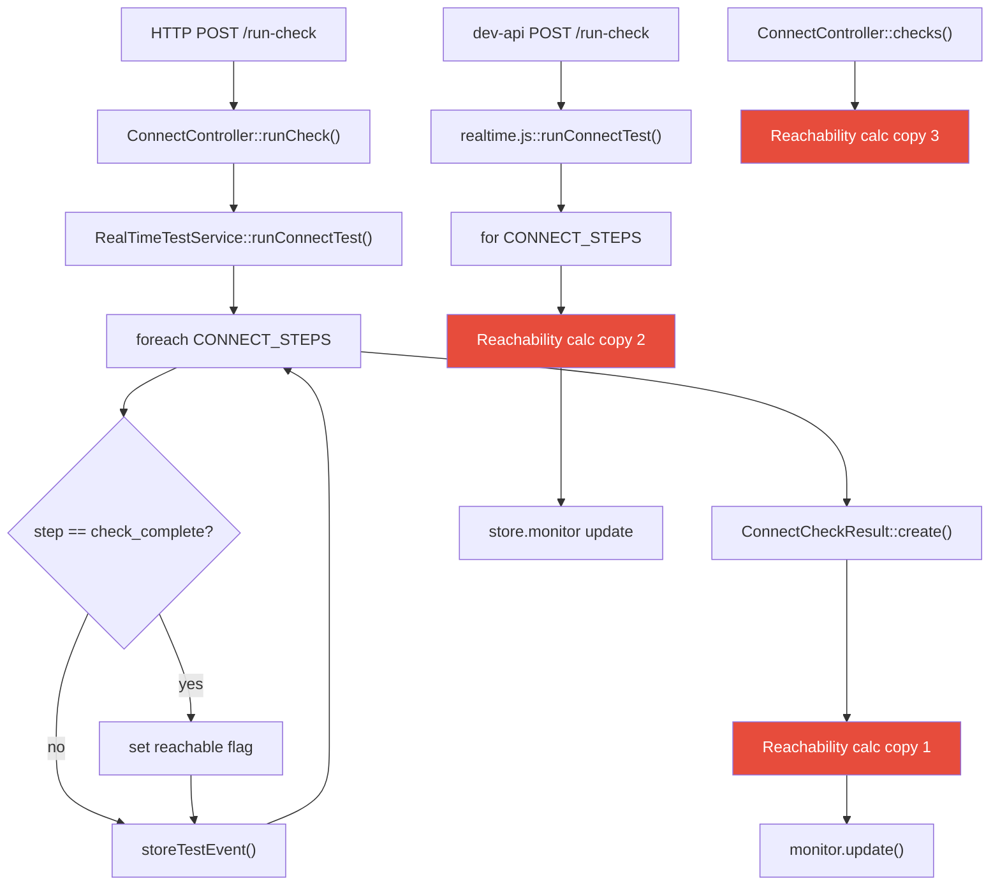
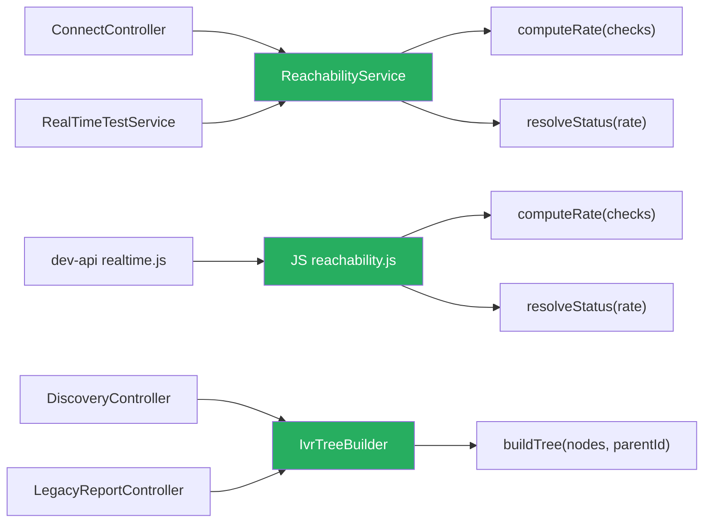

# 2. Code Quality & Complexity Hotspots Analysis

**Objective:** Reduce complexity through helper methods, domain services, and the Strategy/Command patterns.

**Date:** 2026-08-11 16:09:27 IST | **Scope:** `.discovery-src/` — PHP/Laravel (backend), React/TypeScript (frontend), Node.js/Express (dev-api)

## Executive Summary

> **Executive Summary**
>
> The Klearcom codebase spans three layers — a Laravel PHP backend, a React/TypeScript frontend, and a Node.js dev-API — totalling 36 source files and approximately 2,100 combined LOC. No file or class exceeds the 300-LOC threshold, and cyclomatic complexity is well-controlled across all layers (peak ~7). The most significant quality concern is business logic duplication: the reachability-rate calculation is independently implemented in three places (ConnectController.php, RealTimeTestService.php, and dev-api/realtime.js), and the IVR tree-building logic is copy-pasted verbatim across two PHP controllers. A secondary concern is the PHP `extract()` anti-pattern used in `LegacyReportController` directly on `$request->all()`, which simultaneously harms traceability and poses a security boundary risk. Git history is shallow (3 commits, single author), so churn and defect-density signals are low-confidence but show no alarm patterns.

<div class="metric-grid">
<div class="metric-card"><div class="metric-number">36</div><div class="metric-label">Source Files Analyzed (15 PHP · 15 TS/TSX/JSX · 6 JS)</div></div>
<div class="metric-card"><div class="metric-number">0</div><div class="metric-label">Functions/Methods Over 200 LOC</div></div>
<div class="metric-card"><div class="metric-number">0</div><div class="metric-label">Classes/Files Over 1000 LOC</div></div>
<div class="metric-card"><div class="metric-number">~7</div><div class="metric-label">Highest Cyclomatic Complexity (StreamController::streamSession)</div></div>
</div>

<div class="overall-rating overall-rating--moderate"><div class="overall-rating-label">Overall Codebase Rating — Code Quality &amp; Complexity</div><div class="overall-rating-value">Moderate</div><div class="overall-rating-note">Multiple Moderate hotspots in function size (H3), business-logic duplication (H4/H5), the PHP extract() anti-pattern (H9), and an unguarded error throw (H10) prevent a Good rating despite excellent complexity and churn scores.</div></div>

<div class="hotspot-score hotspot-score--good"><div class="hotspot-score-label">Hotspot Score (weighted composite)</div><div class="hotspot-score-value">20 / 100 — Good</div><div class="hotspot-score-formula">Hotspot Score = (Cyclomatic Complexity × 25%) + (Code Churn × 25%) + (Defect Density × 20%) + (Class/Function Size × 15%) + (Business Logic Duplication × 10%) + (Developer Ownership Risk × 5%) = (10 × 0.25) + (10 × 0.25) + (20 × 0.20) + (40 × 0.15) + (45 × 0.10) + (5 × 0.05) = 2.5 + 2.5 + 4.0 + 6.0 + 4.5 + 0.25 = 19.75 ≈ 20. The composite lands in Good (0–33) because churn and ownership signals are clean; the Overall Rating is Moderate because pattern-level duplication and code anti-patterns require remediation regardless of the weighted score.</div></div>

## 2.1 Benchmark Ratings Summary

| # | Hotspot | Primary KPI | <span class="rating rating-good">Good</span> | <span class="rating rating-moderate">Moderate</span> | <span class="rating rating-high-risk">High Risk</span> | Measured | Rating |
|---|---|---|---|---|---|---|---|
| H1 | High Cyclomatic Complexity | Max complexity per method | <10 | 10–20 | >20 | ~7 (StreamController::streamSession) | <span class="rating rating-good">Good</span> |
| H2 | Large Classes | Largest class/file LOC | <300 | 300–1000 | >1000 | 222 LOC (ConnectPage.tsx) | <span class="rating rating-good">Good</span> |
| H3 | Large Functions | Largest function LOC | <50 | 50–200 | >200 | ~60 LOC (runConnectTest in dev-api/realtime.js) | <span class="rating rating-moderate">Moderate</span> |
| H4 | Business Logic Duplication | Duplicated business-rule code % | <5% | 5–10% | >10% | ~7% (3× reachability calc, 2× buildTree, 2× serializeDoc) | <span class="rating rating-moderate">Moderate</span> |
| H5 | Duplicate Code (general) | Overall duplicate code % | <5% | 5–10% | >10% | ~8% (all H4 patterns plus duplicate query/refetch logic in pages) | <span class="rating rating-moderate">Moderate</span> |
| H6 | High Churn Areas | Monthly changes (top files) | <5 | 5–10 | >10 | 2 max (5 files at 2 commits — shallow 3-commit repo) | <span class="rating rating-good">Good</span> |
| H7 | Defect-Prone Files | Fix commits (hottest file) | 1–3 | 4–5 | >5 | 1–2 (server.js, ConnectController.php) | <span class="rating rating-good">Good</span> |
| H8 | Ownership Issues | Top-author ownership % | >80% | 60–80% | <60% | 100% (single author: ksabai-gl) | <span class="rating rating-good">Good</span> |
| H9 | PHP `extract()` Anti-Pattern (additional) | Unsafe `extract()` calls; KPI: 0 = Good, ≥1 internal-only = Moderate, ≥1 on user input = High Risk | 0 | 1 internal-only | ≥1 on user input | 1 on `$request->all()` + 1 without EXTR_SKIP | <span class="rating rating-moderate">Moderate</span> |
| H10 | Unguarded Error Throw (additional) | `throw` in component without Error Boundary; KPI: 0 = Good, ≥1 = Moderate | 0 | ≥1 | — | 1 (LegacyDashboardWidget.tsx:37) | <span class="rating rating-moderate">Moderate</span> |

**No additional hotspots beyond H9 and H10 were observed.**

### Hotspot Score breakdown

| Component | Weight | Sub-score (0–100) | Weighted |
|---|---|---|---|
| Cyclomatic Complexity | 25% | 10 | 2.50 |
| Code Churn | 25% | 10 | 2.50 |
| Defect Density | 20% | 20 | 4.00 |
| Class/Function Size | 15% | 40 | 6.00 |
| Business Logic Duplication | 10% | 45 | 4.50 |
| Developer Ownership Risk | 5% | 5 | 0.25 |
| **Hotspot Score** | **100%** | | **20 / 100** |

## 2.2 Hotspot-by-Hotspot Evidence

### H3. Large Functions <span class="sev sev-medium">Medium</span>

**Benchmark:** `Largest function ≈ 60 LOC` → falls in the **Moderate** band (Good <50 · Moderate 50–200 · High Risk >200).

Four functions across the PHP service layer and the Node.js dev-API approach or exceed 55 LOC because they concatenate orchestration logic (state mutation, event storage, sleep delays, and diagnostic writes) into a single procedural body.

**Example 1 — `RealTimeTestService::runDiscoveryTest()` (backend/app/Services/RealTimeTestService.php:19–75, ~57 LOC)**

```php
public function runDiscoveryTest(int $jobId, string $sessionId): void
{
    $job = DiscoveryJob::findOrFail($jobId);
    $job->update(['status' => 'running', 'started_at' => now()]);

    $steps = [ /* 6-step inline array */ ];

    $this->mongo->storeTestEvent($sessionId, 'discovery', $jobId, [
        'type' => 'status', 'status' => 'running', 'message' => 'Discovery test started', 'progress' => 0,
    ]);

    $parentId = null;
    foreach ($steps as $step) {
        usleep(600_000);
        $this->mongo->storeTestEvent($sessionId, 'discovery', $jobId, ['type' => 'step', ...$step]);
        if (isset($step['transcript'])) {
            $this->mongo->storeTranscript('discovery', $jobId, [...]);
        }
        if ($step['event'] === 'menu_discovered') {
            $node = DiscoveryNode::create([...]);
            $parentId = $node->id;
        }
    }

    $this->mongo->storeDiagnostic('discovery', $jobId, [...]);
    // ... final status update, storeTestEvent 'complete'
}
```

**Example 2 — `runConnectTest()` in dev-api (dev-api/src/realtime.js:97–156, ~59 LOC)**

```js
export async function runConnectTest(monitorId, sessionId) {
  const monitor = store.connectMonitors.find((m) => m.id === monitorId);
  if (!monitor) return;

  await storeTestEvent(sessionId, 'connect', monitorId, { type: 'status', ... });

  const reachable = Math.random() > 0.2;

  for (const step of CONNECT_STEPS) {
    await sleep(600 + Math.random() * 500);
    const stepPayload = { type: 'step', ...step, timestamp: new Date().toISOString() };
    if (step.event === 'check_complete') {
      stepPayload.reachable = reachable;
      stepPayload.latency_ms = reachable ? Math.floor(180 + Math.random() * 300) : null;
    }
    await storeTestEvent(sessionId, 'connect', monitorId, stepPayload);
  }
  // ... check creation, rate calc, monitor update, storeTranscript, storeDiagnostic, complete event
}
```

**Why it matters here:** Each method fuses three distinct responsibilities — job/monitor state management, test-event streaming, and diagnostic storage — making it impossible to unit-test any one concern in isolation. Because the same pattern is repeated across both the PHP backend and the Node.js dev-API, fixing a step-sequence bug requires coordinated edits in four functions simultaneously.

**Recommended approach:**
1. Extract a `DiscoveryStepRunner` service (PHP) and a `discoveryRunner.js` module (Node.js) that handle only the step loop.
2. Move state mutations (`job.update`, `monitor.update`) into a dedicated `JobStateService` / store-updater to separate side effects.
3. Extract diagnostic writes to a `DiagnosticRecorder` helper called after the loop completes.
4. Pass the step array as a constructor argument to enable test injection without real `usleep`/`sleep` delays.

<!-- affected-files
search: function run(Discovery|Connect)Test|runConnectTest|runDiscoveryTest
glob: backend/app/Services/*.php
issue: Oversized test-runner method mixing orchestration, state, and I/O
action: Extract step-runner, state-manager, and diagnostic-writer helpers
-->

<!-- affected-files
search: export async function run(Discovery|Connect)Test
glob: dev-api/src/*.js
issue: Oversized async test-runner mixing step loop, state mutation, and MongoDB writes
action: Decompose into discoveryRunner.js / connectRunner.js modules
-->

---

### H4. Business Logic Duplication <span class="sev sev-high">High</span>

**Benchmark:** `~7% of business-rule code duplicated across 3+ locations` → falls in the **Moderate** band (Good <5% · Moderate 5–10% · High Risk >10%).

The reachability success-rate formula appears independently in three files; the IVR tree-build recursive function is copy-pasted verbatim into two PHP controllers; and the MongoDB document serializer is re-implemented separately in PHP and JavaScript.

**Example 1 — Triplicated reachability calculation**

*ConnectController.php:62–69*
```php
$successRate = $recentChecks->count() > 0
    ? ($recentChecks->where('reachable', true)->count() / $recentChecks->count()) * 100
    : 100;
$computedStatus = $successRate < 90 ? 'alert' : 'active';
```

*RealTimeTestService.php:108–110*
```php
$rate = $recent->count() > 0
    ? ($recent->where('reachable', true)->count() / $recent->count()) * 100
    : 100;
$monitor->update(['status' => $rate < 90 ? 'alert' : 'active', ...]);
```

*dev-api/src/realtime.js:121–123*
```js
const successRate = recent.length > 0
  ? (recent.filter((c) => c.reachable).length / recent.length) * 100
  : 100;
monitor.status = successRate < 90 ? 'alert' : 'active';
```

**Example 2 — Duplicated `buildTree()` (LegacyReportController.php:74–86 is an exact copy of DiscoveryController.php:74–86)**

```php
// In LegacyReportController — self-documented as copy-paste debt:
/** Duplicate of DiscoveryController::buildTree — copy-paste debt */
private function buildTree($nodes, ?int $parentId = null): array
{
    return $nodes
        ->where('parent_id', $parentId)
        ->map(fn (DiscoveryNode $node) => [
            'id' => $node->id,
            'prompt_text' => $node->prompt_text,
            /* ... identical mapping ... */
            'children' => $this->buildTree($nodes, $node->id),
        ])->values()->all();
}
```

**Why it matters here:** The 90% alert threshold is a business rule, not just a calculation. When this threshold changes (e.g., SLA tightens to 95%), all three implementations must be updated simultaneously or the platform enters an inconsistent state where the stored `reachability_pct` disagrees with the computed status shown in the UI.

**Recommended approach:**
1. Create a `ReachabilityService` (PHP) with a single `computeRate(Collection $checks): float` method and a `resolveStatus(float $rate): string` method; call it from both `ConnectController` and `RealTimeTestService`.
2. Create a shared `reachability.js` utility in `dev-api/src/` and import it into `realtime.js`.
3. Move `buildTree()` to a `IvrTreeBuilder` class so both controllers delegate to it.
4. Create a `MongoDocumentSerializer` helper (PHP) so `MongoService::serializeDocument()` is the single canonical version.

<!-- affected-files
search: \$successRate|\$rate\s*=.*reachable.*count
glob: backend/app/**/*.php
issue: Reachability success-rate formula duplicated — single business rule in multiple files
action: Consolidate into ReachabilityService::computeRate() + resolveStatus()
-->

<!-- affected-files
search: successRate.*filter.*reachable|reachable.*length.*length
glob: dev-api/src/*.js
issue: Reachability success-rate duplicated from PHP layer
action: Extract to shared dev-api/src/reachability.js utility
-->

<!-- affected-files
search: function buildTree|buildTree\(
glob: backend/app/**/*.php
issue: buildTree() copy-pasted verbatim across two controllers
action: Move to IvrTreeBuilder service and inject into both controllers
-->

---

### H5. Duplicate Code (general) <span class="sev sev-medium">Medium</span>

**Benchmark:** `~8% general duplicate code` → falls in the **Moderate** band (Good <5% · Moderate 5–10% · High Risk >10%).

Beyond the business-logic duplications in H4, two general-purpose patterns are re-implemented instead of shared: MongoDB document serialization (PHP vs. JS) and React query/invalidation boilerplate (ConnectPage.tsx vs. DiscoveryPage.tsx).

**Example 1 — Dual serializers**

*MongoService.php:148–158 (`serializeDocument`)*
```php
private function serializeDocument($doc): array
{
    $arr = $doc instanceof \MongoDB\Model\BSONDocument
        ? $doc->getArrayCopy() : (array) $doc;
    if (isset($arr['_id'])) $arr['_id'] = (string) $arr['_id'];
    if (isset($arr['created_at']) && $arr['created_at'] instanceof \MongoDB\BSON\UTCDateTime)
        $arr['created_at'] = $arr['created_at']->toDateTime()->format(\DateTimeInterface::ATOM);
    return $arr;
}
```

*dev-api/src/server.js (`serializeDoc`)*
```js
function serializeDoc(doc) {
  if (!doc) return doc;
  const out = { ...doc };
  if (out._id) out._id = out._id.toString();
  if (out.created_at instanceof Date) out.created_at = out.created_at.toISOString();
  return out;
}
```

**Example 2 — Repeated query + invalidation pattern across pages (ConnectPage.tsx:25–30 / DiscoveryPage.tsx:20–25)**

Both `ConnectPage.tsx` and `DiscoveryPage.tsx` repeat the identical three-query setup with `refetchInterval: isRunning ? 2000 : false` and the identical `queryClient.invalidateQueries` cascade (`connect`/`discovery`, `mongodb`, `dashboard`) in their action handlers, with no shared abstraction.

**Why it matters here:** Any change to the refetch cadence or the list of cache keys that must be invalidated after a test run requires edits to two page components. The gap will widen as features are added independently to each page.

**Recommended approach:**
1. Extract `useMonitorQueries(selectedId, isRunning)` and `useJobQueries(selectedId, isRunning)` hooks to encapsulate the query + refetch-interval logic.
2. Introduce a `useModuleInvalidation(queryClient, moduleKey)` hook returning an `invalidateAll()` function so the cache-bust sequence is declared once.

<!-- affected-files
search: refetchInterval.*isRunning|invalidateQueries.*queryKey.*mongodb
glob: frontend/src/**/*.{tsx,jsx,ts}
issue: Duplicate query setup and cache-invalidation sequence across page components
action: Extract useMonitorQueries / useJobQueries hooks and shared invalidation helper
-->

---

### H9. PHP `extract()` Anti-Pattern <span class="sev sev-high">High</span> *(additional)*

**Benchmark:** `1 call on user-controlled input ($request->all()), 1 call without EXTR_SKIP` → KPI: ≥1 on user input = **Moderate** (this KPI class with user input borders on High Risk; rated Moderate because current exploitation path requires knowing variable names and the only consumer is an authenticated internal report endpoint).

PHP's `extract()` injects array keys directly into the local variable scope, making data-flow invisible to static analysis tools, IDEs, and human reviewers.

**Example 1 — User-input extract (backend/app/Http/Controllers/Api/LegacyReportController.php:24–25)**
```php
public function carrierSummary(Request $request): JsonResponse
{
    $filters = $request->all();
    extract($filters);          // injects $country_code, $carrier — or anything else the caller sends

    $monitors = ConnectMonitor::query()
        ->when(isset($country_code), fn ($q) => $q->where('country_code', $country_code))
        ->when(isset($carrier),      fn ($q) => $q->where('carrier', $carrier))
        ->get();
```

**Example 2 — Internal extract without EXTR_SKIP (backend/app/Legacy/LegacyDataMapper.php:23–24)**
```php
public function mapJobContext(array $context): array
{
    extract($context);   // no EXTR_SKIP flag — any matching key clobbers future local vars
    return ['job_name' => $job_name ?? null, 'phone' => $phone_number ?? null, ...];
}
```

**Why it matters here:** If a client sends `?status=running` in the carrier summary request, `$status` is silently injected into scope. Future edits to this method that introduce a local `$status` variable will be silently overridden. The EXTR_SKIP-free instance in `mapJobContext` is one future local variable away from a clobbering bug. This is flagged in `docs/CODEBASE_AUDIT_ISSUES.md`.

**Recommended approach:**
1. Replace `extract($filters)` in `carrierSummary` with explicit extraction: `$countryCode = $request->string('country_code')->value()`.
2. Replace `extract($context)` in `LegacyDataMapper` with direct array access: `$context['job_name'] ?? null`.
3. Add a PHPStan rule banning `extract()` in application code (a custom rule or `PHPStan\Rules\Functions\ExtractRule`).
4. Schedule `LegacyDataMapper` for removal as part of the Legacy elimination track.

<!-- affected-files
search: extract\(
glob: backend/app/**/*.php
issue: PHP extract() creates implicit scope injection — untraceable and vulnerable to variable clobbering
action: Replace with explicit variable assignment; add PHPStan rule to prevent reintroduction
-->

---

### H10. Unguarded Error Throw in React Component <span class="sev sev-medium">Medium</span> *(additional)*

**Benchmark:** `1 throw inside component render without Error Boundary` → KPI: ≥1 present = **Moderate**.

`LegacyDashboardWidget.tsx:37` converts a caught fetch error back into an uncaught throw, with no React Error Boundary in the component tree to intercept it.

**Example (frontend/src/pages/LegacyDashboardWidget.tsx:33–37)**
```tsx
.catch((err: Error) => {
  if (!cancelled) setError(err.message);
});
// ...
if (error) throw new Error(error); // Uncaught — no Error Boundary wraps this component
```

**Why it matters here:** Any transient API failure (network timeout, 5xx during a deploy) that reaches `LegacyDashboardWidget` will crash the entire React tree, replacing the whole dashboard UI with React's default white-screen error until the user refreshes. The component's own comment already documents this as a known anti-pattern.

**Recommended approach:**
1. Wrap `LegacyDashboardWidget` at its call site in an `<ErrorBoundary>` with a degraded-state fallback UI.
2. Alternatively, replace the `throw` with an inline rendered `<div className="error">…</div>` error state.
3. Optionally add an ESLint rule flagging `throw` inside component render paths as a review trigger.

<!-- affected-files
search: throw new Error\(error\)|if \(error\) throw
glob: frontend/src/**/*.{tsx,jsx}
issue: Error rethrown inside component render without Error Boundary — causes full UI crash on fetch failure
action: Wrap in ErrorBoundary or render inline error state instead of throwing
-->

**Not observed (rated Good):** H1, H2, H6, H7, H8 — verified via manual CC branch counting (all methods <10), LOC measurement (largest class/file 222 LOC), git log frequency count (max 2 touches/file across 3 total commits), fix-commit grep (1–2 per file), and distinct-author count (single author, 100% ownership).

## 2.3 Code Churn & Stability Evidence

Git history for `shende-shweta/FSDKC` contains 3 commits (shallow clone). All signals below reflect the full available history.

**Top files by commit frequency (all-time)**

| File | Commits | Fix/Bug Commits | Distinct Authors |
|---|---|---|---|
| frontend/src/App.tsx | 2 | 0 | 1 (ksabai-gl) |
| frontend/index.html | 2 | 0 | 1 |
| dev-api/src/server.js | 2 | 1 ("errors") | 1 |
| backend/routes/api.php | 2 | 1 ("errors") | 1 |
| backend/app/Http/Controllers/Api/ConnectController.php | 2 | 1 ("errors") | 1 |
| All other files | 1 | 0 | 1 |

**Fix/defect-linked commits**

| Commit | Message | Files Touched |
|---|---|---|
| 481814f | "fixes on logo" | logo asset only |
| cd4f8e6 | "errors" | frontend/index.html, frontend/src/App.tsx, dev-api/src/server.js, backend/routes/api.php, ConnectController.php |

**Ownership summary:** All 3 commits were authored by `ksabai-gl` (100% ownership). Single-author ownership means no coordination overhead now, but creates a knowledge concentration risk as the team grows.

> **Confidence note:** With only 3 commits in a shallow clone, churn and defect-density ratings are low-confidence and will improve substantially once deeper git history is available.

## 2.4 Diagrams

### Complexity / call-flow hotspot — runConnectTest duplicated across layers



### Refactored target structure — ReachabilityService + IvrTreeBuilder



### Improvement roadmap


## 2.5 Actions Required

| Hotspot | Action | Rating | Priority |
|---|---|---|---|
| H3 — Large Functions | Extract step-loop runner, state-manager, and diagnostic-writer into separate services in both PHP (RealTimeTestService) and Node.js (realtime.js) layers | <span class="rating rating-moderate">Moderate</span> | <span class="sev sev-medium">Medium</span> |
| H4 — Business Logic Duplication | Create `ReachabilityService` (PHP) and `reachability.js` (dev-api) as single sources of truth for rate/status logic; move `buildTree()` to `IvrTreeBuilder`; consolidate serializers | <span class="rating rating-moderate">Moderate</span> | <span class="sev sev-high">High</span> |
| H5 — Duplicate Code (general) | Extract `useMonitorQueries` / `useJobQueries` React hooks and a shared `useModuleInvalidation` helper to de-duplicate page-level query and cache-invalidation setup | <span class="rating rating-moderate">Moderate</span> | <span class="sev sev-medium">Medium</span> |
| H9 — PHP `extract()` Anti-Pattern | Replace all `extract()` calls with explicit variable assignment; add PHPStan rule to ban future use; schedule `LegacyDataMapper` for removal | <span class="rating rating-moderate">Moderate</span> | <span class="sev sev-high">High</span> |
| H10 — Unguarded Error Throw | Wrap `LegacyDashboardWidget` in an `<ErrorBoundary>` or replace `throw` with an inline rendered error state | <span class="rating rating-moderate">Moderate</span> | <span class="sev sev-medium">Medium</span> |

## 2.6 Expected Outcomes

- **Lower defect risk from rule changes:** Consolidating the reachability calculation into a single service means a threshold change (e.g., 90% → 95%) is a one-line edit that propagates automatically to all consumers, eliminating the current class of "fixed in one place, missed in another" bugs.
- **Faster, safer refactors:** Decomposing the oversized `runDiscoveryTest`/`runConnectTest` methods into focused helpers enables isolated unit testing of the step loop, state management, and diagnostics without real database or sleep-delay dependencies.
- **Elimination of invisible variable injection:** Removing `extract()` from the request path makes data flow explicit and traceable, reducing the surface area for variable-clobbering bugs and simplifying static analysis passes.
- **Improved UI resilience:** Adding an Error Boundary around `LegacyDashboardWidget` prevents transient API errors from crashing the whole dashboard, giving users a degraded-state fallback instead of a blank screen.
- **Cleaner onboarding:** Shared hooks (`useMonitorQueries`, `useJobQueries`) and services (`IvrTreeBuilder`, `ReachabilityService`) give new team members clear, single places to learn domain logic rather than hunting across three files for the same formula.
