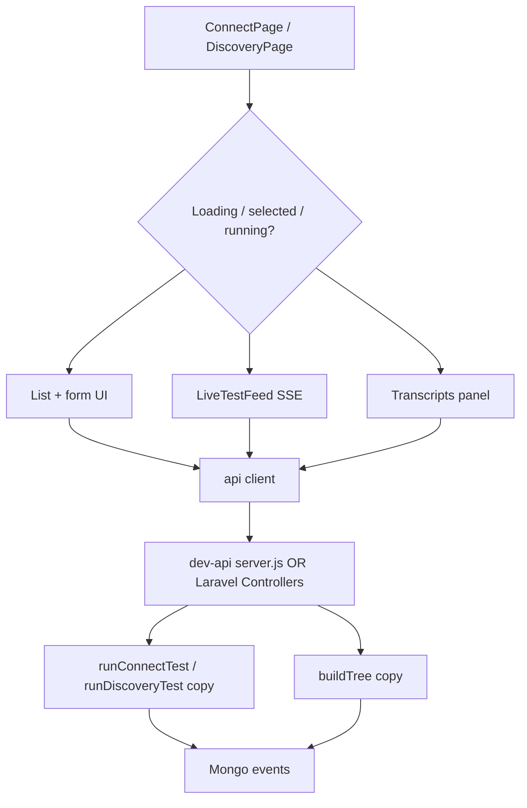
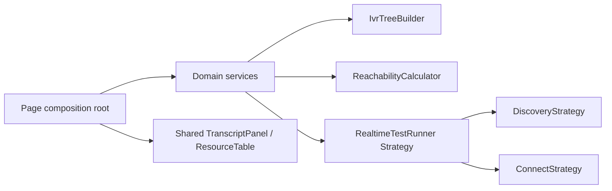
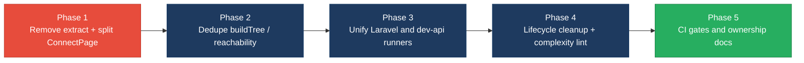

# 2. Code Quality & Complexity Hotspots Analysis

**Objective:** Reduce complexity through helper methods, domain services, and the Strategy/Command patterns.

**Date:** 2026-07-24 | **Scope:** `shende-shweta/FSDKC` (`main`) — Laravel 12 / PHP 8.3 backend, React 19 + TypeScript frontend, Node/Express `dev-api`

## Executive Summary

> **Executive Summary**
>
> Klearcom is a small multi-layer platform (Laravel API, React SPA, Node `dev-api`) with no runnable complexity tooling configured (phpstan is listed in Composer but unused; no ESLint complexity rule), so metrics were measured by manual branch/LOC inspection across **39 application source files** (backend 18, frontend 15, `dev-api` 6). The worst findings are a **201-LOC** `ConnectPage` component, **~12–14%** duplicated business/UI logic (IVR `buildTree`, reachability math, dual Laravel/`dev-api` realtime runners, near-clone Discovery/Connect pages), and **3** unsafe `extract()` call sites in legacy PHP. Git history is short (3 commits, single author `ksabai-gl`); churn and ownership look healthy, but they do not offset the structural duplication and size risks. Overall rating is **High Risk**, driven by large functions, duplication, and `extract()`.

<div class="metric-grid">
<div class="metric-card"><div class="metric-number">39</div><div class="metric-label">Files Analyzed</div></div>
<div class="metric-card"><div class="metric-number">1</div><div class="metric-label">Functions/Methods Over 200 LOC</div></div>
<div class="metric-card"><div class="metric-number">0</div><div class="metric-label">Classes/Files Over 1000 LOC</div></div>
<div class="metric-card"><div class="metric-number">20</div><div class="metric-label">Highest Cyclomatic Complexity</div></div>
</div>

<div class="overall-rating overall-rating--high-risk"><div class="overall-rating-label">Overall Codebase Rating — Code Quality &amp; Complexity</div><div class="overall-rating-value">High Risk</div><div class="overall-rating-note">Driven by H3 Large Functions (ConnectPage 201 LOC), H4/H5 duplication (~12–14%), and H9 unsafe extract() (3 call sites).</div></div>

<div class="hotspot-score hotspot-score--moderate"><div class="hotspot-score-label">Hotspot Score (weighted composite)</div><div class="hotspot-score-value">41 / 100 — Moderate</div><div class="hotspot-score-formula">Hotspot Score = (Cyclomatic Complexity × 25%) + (Code Churn × 25%) + (Defect Density × 20%) + (Class/Function Size × 15%) + (Business Logic Duplication × 10%) + (Developer Ownership Risk × 5%) = (60 × 0.25) + (18 × 0.25) + (15 × 0.20) + (68 × 0.15) + (75 × 0.10) + (8 × 0.05) = 41</div></div>

Weighted score is Moderate because low churn/ownership risk dilutes the composite; Overall stays High Risk per worst-hotspot rule.

## 2.1 Benchmark Ratings Summary

Layers covered: **Backend** (Laravel `backend/app` + routes/tests = 18 files) · **Frontend** (React `frontend/src` = 15 files) · **Dev API** (Node `dev-api/src` = 6 files). Tooling: manual LOC/branch counts (no ESLint complexity, no radon/gocyclo, phpstan present in `composer.json` but no config/run).

| # | Hotspot | Primary KPI | <span class="rating rating-good">Good</span> | <span class="rating rating-moderate">Moderate</span> | <span class="rating rating-high-risk">High Risk</span> | Measured | Rating |
|---|---|---|---|---|---|---|---|
| H1 | High Cyclomatic Complexity | Max complexity per method | <10 | 10–20 | >20 | 20 (`ConnectPage`) · FE 20 / BE-JS 15 (`runConnectTest`) / BE-PHP 11 | <span class="rating rating-moderate">Moderate</span> |
| H2 | Large Classes | Largest class/file LOC | <300 | 300–1000 | >1000 | 224 (`dev-api/src/server.js`); next FE `ConnectPage.tsx` 208 | <span class="rating rating-good">Good</span> |
| H3 | Large Functions | Largest function LOC | <50 | 50–200 | >200 | 201 (`ConnectPage`); FE DiscoveryPage 154 · BE max ~64 | <span class="rating rating-high-risk">High Risk</span> |
| H4 | Business Logic Duplication | Duplicated business logic % | <5% | 5–10% | >10% | ~12% (`buildTree`×3, reachability×4, dual realtime, KPI×2) | <span class="rating rating-high-risk">High Risk</span> |
| H5 | Duplicate Code (general) | Overall duplicate code % | <5% | 5–10% | >10% | ~14% (H4 + Discovery/Connect page UI clone) | <span class="rating rating-high-risk">High Risk</span> |
| H6 | High Churn Areas | Monthly changes (top files) | <5 | 5–10 | >10 | ~2 (June 2026; top files touched twice) | <span class="rating rating-good">Good</span> |
| H7 | Defect-Prone Files | Fix commits (hottest file) | 1–3 | 4–5 | >5 | 1 (`ConnectController` / `server.js` / `App.tsx` in fix commits) | <span class="rating rating-good">Good</span> |
| H8 | Ownership Issues | Top-author ownership % | >80% | 60–80% | <60% | 100% (`ksabai-gl`) | <span class="rating rating-good">Good</span> |
| H9 | Unsafe `extract()` / dynamic vars (additional) | `extract()` call sites (Good 0 · Moderate 1–2 · High Risk ≥3) | 0 | 1–2 | ≥3 | 3 | <span class="rating rating-high-risk">High Risk</span> |
| H10 | Missing lifecycle cleanup (additional) | Uncleared interval/SSE components (Good 0 · Moderate 1 · High Risk ≥2) | 0 | 1 | ≥2 | 1 (`LegacyMonitorPoller`) | <span class="rating rating-moderate">Moderate</span> |

### Hotspot Score breakdown

| Component | Weight | Sub-score (0–100) | Weighted |
|---|---|---|---|
| Cyclomatic Complexity | 25% | 60 | 15.0 |
| Code Churn | 25% | 18 | 4.5 |
| Defect Density | 20% | 15 | 3.0 |
| Class/Function Size | 15% | 68 | 10.2 |
| Business Logic Duplication | 10% | 75 | 7.5 |
| Developer Ownership Risk | 5% | 8 | 0.4 |
| **Hotspot Score** | **100%** | | **41 / 100** |

## 2.2 Hotspot-by-Hotspot Evidence

### H1. High Cyclomatic Complexity <span class="sev sev-medium">Medium</span>

**Benchmark:** `Max cyclomatic complexity per method = 20` → falls in the **Moderate** band (Good <10 · Moderate 10–20 · High Risk >20).

Highest measured method/component is frontend `ConnectPage` (CC ≈ 20) from nested loading/selection/status ternaries and conditional panels. Backend peak is `runConnectTest` in `dev-api/src/realtime.js` (CC ≈ 15) and PHP `RealTimeTestService::runConnectTest` (CC ≈ 11). No method exceeded 20.

Example — frontend conditional density in `ConnectPage.tsx`:

```118:145:frontend/src/pages/ConnectPage.tsx
          {monitorsQuery.isLoading ? (
            <div className="empty">Loading…</div>
          ) : (
            <table>
              ...
                    style={{ cursor: 'pointer', background: selectedId === m.id ? 'var(--surface-2)' : undefined }}
                  >
...
                        {isRunning && selectedId === m.id ? 'Testing…' : 'Run Test'}
```

Example — backend connect test branching in `realtime.js`:

```128:175:dev-api/src/realtime.js
  const reachable = Math.random() > 0.2;
  for (const step of CONNECT_STEPS) {
    ...
    if (step.event === 'check_complete') {
      stepPayload.reachable = reachable;
      stepPayload.latency_ms = reachable ? Math.floor(180 + Math.random() * 300) : null;
    }
    ...
  }
  ...
  monitor.status = successRate < 90 ? 'alert' : 'active';
```

**Why it matters here:** Discovery and Connect UIs encode many view states in one component; small UX changes risk breaking unrelated branches. Backend connect-test status math is similarly branch-heavy and duplicated, so defects multiply across stacks.

**Recommended approach:** 1) Extract presentational subcomponents (`MonitorTable`, `CheckHistory`, `TranscriptPanel`) from `ConnectPage`/`DiscoveryPage`. 2) Move reachability status decisions into a shared domain helper (Strategy: `ReachabilityPolicy`). 3) Add ESLint `complexity` / phpstan cognitive limits in CI.

<!-- affected-files
search: isRunning \? 2000 : false|selectedId === .+\? 'var\(--surface-2\)'
glob: frontend/src/pages/*.{tsx,jsx}
issue: High conditional density in page components
action: Split UI states into smaller components; reduce ternary nesting
-->

<!-- affected-files
search: successRate < 90 \? 'alert' : 'active'|reachable \? Math\.floor
glob: dev-api/src/**/*.{js,ts}
issue: Branch-heavy connect test / reachability logic
action: Extract ReachabilityPolicy helper; simplify runConnectTest
-->

### H2. Large Classes <span class="sev sev-low">Low</span>

**Benchmark:** `Largest class/file LOC = 224` (`dev-api/src/server.js`) → falls in the **Good** band (Good <300 · Moderate 300–1000 · High Risk >1000).

No class/file exceeds 1000 LOC. Largest peers: `server.js` 224, `ConnectPage.tsx` 208, `realtime.js` 155, `MongoService.php` 132. Files stay within a healthy size band for this stage of the codebase, though `server.js` already concentrates all HTTP routes in one module.

**Why it matters here:** Size is not yet catastrophic, but `server.js` is the natural place complexity will accumulate as endpoints grow. Treat the Good rating as a guardrail, not a free pass.

**Recommended approach:** Split `dev-api` routes into `routes/discovery.js`, `routes/connect.js`, `routes/mongodb.js` with thin handlers calling services.

<!-- affected-files
search: app\.(get|post)\('/api/
glob: dev-api/src/server.js
issue: Monolithic Express route file (largest backend module)
action: Split into route modules + services before it crosses 300 LOC
-->

### H3. Large Functions <span class="sev sev-critical">Critical</span>

**Benchmark:** `Largest function/method LOC = 201` (`ConnectPage`) → falls in the **High Risk** band (Good <50 · Moderate 50–200 · High Risk >200).

Exactly **1** function exceeds 200 source LOC (blanks/comments excluded): `ConnectPage`. `DiscoveryPage` is 154 LOC (Moderate). Backend methods stay ≤64 LOC (`runConnectTest` in `realtime.js`).

```10:40:frontend/src/pages/ConnectPage.tsx
export default function ConnectPage() {
  const queryClient = useQueryClient();
  const selectedId = useUiStore((s) => s.selectedMonitorId);
  const setSelectedId = useUiStore((s) => s.setSelectedMonitorId);
  const { events, isRunning, progress, startConnectCheck } = useRealtimeTest('connect');
  ...
  const monitorsQuery = useQuery({
    queryKey: ['connect', 'monitors'],
    queryFn: () => api.get<{ data: ConnectMonitor[] }>('/connect/monitors'),
    refetchInterval: isRunning ? 2000 : false,
  });
```

Parallel oversized page on Discovery:

```10:35:frontend/src/pages/DiscoveryPage.tsx
export default function DiscoveryPage() {
  const queryClient = useQueryClient();
  const selectedId = useUiStore((s) => s.selectedDiscoveryId);
  ...
  const jobsQuery = useQuery({
    queryKey: ['discovery', 'jobs'],
    queryFn: () => api.get<{ data: DiscoveryJob[] }>('/discovery/jobs'),
    refetchInterval: isRunning ? 2000 : false,
  });
```

**Why it matters here:** Form create, live SSE feed, list selection, detail history, and Mongo transcripts all live in one function — reviews and refactors cannot be scoped safely. This is the primary size driver for the Overall High Risk rating.

**Recommended approach:** 1) Extract `CreateMonitorForm`, `MonitorList`, `CheckHistoryPanel`, `TranscriptPanel`. 2) Mirror the same split for Discovery (`CreateJobForm`, `JobList`, `IvrTreePanel`). 3) Keep page components as composition roots (<50 LOC).

<!-- affected-files
search: export default function ConnectPage|export default function DiscoveryPage
glob: frontend/src/pages/*Page.tsx
issue: Page component function exceeds/approaches 200 LOC
action: Extract form/list/history/transcript subcomponents
-->

### H4. Business Logic Duplication <span class="sev sev-critical">Critical</span>

**Benchmark:** `Duplicated business-rule code ≈ 12%` → falls in the **High Risk** band (Good <5% · Moderate 5–10% · High Risk >10%).

Observed duplicated workflows (not just incidental copy):

1. **IVR `buildTree`** — identical recursion in `DiscoveryController`, `LegacyReportController`, and `dev-api/src/store.js`.
2. **Reachability success-rate formula** — same “last 20 checks / <90% ⇒ alert” rule in `ConnectController::checks`, `RealTimeTestService`, `LegacyReportController::carrierSummary`, and `realtime.js`.
3. **Realtime test runners** — `RealTimeTestService` (PHP) mirrors `realtime.js` (Node) step loops, Mongo event writes, and completion payloads.
4. **Dashboard KPI aggregation** — `DashboardController::kpis` vs `GET /api/dashboard/kpis` in `server.js`.

```87:101:backend/app/Http/Controllers/Api/DiscoveryController.php
    private function buildTree($nodes, ?int $parentId = null): array
    {
        return $nodes
            ->where('parent_id', $parentId)
            ->map(fn (DiscoveryNode $node) => [
                'id' => $node->id,
                ...
                'children' => $this->buildTree($nodes, $node->id),
            ])
            ->values()
            ->all();
    }
```

```77:91:backend/app/Http/Controllers/Api/LegacyReportController.php
    /** Duplicate of DiscoveryController::buildTree — copy-paste debt */
    private function buildTree($nodes, ?int $parentId = null): array
    {
        return $nodes
            ->where('parent_id', $parentId)
            ->map(fn (DiscoveryNode $node) => [
                ...
                'children' => $this->buildTree($nodes, $node->id),
            ])
            ->values()
            ->all();
    }
```

```65:74:backend/app/Http/Controllers/Api/ConnectController.php
        $successRate = $recentChecks->count() > 0
            ? ($recentChecks->where('reachable', true)->count() / $recentChecks->count()) * 100
            : 100;

        $computedStatus = $successRate < 90 ? 'alert' : 'active';
```

**Why it matters here:** A change to alert thresholds or tree shape must be applied in three-to-four places across PHP and JS; the existing audit doc already flags this as present tech debt. Drift between Laravel and `dev-api` will produce inconsistent UI KPIs in local vs Docker modes.

**Recommended approach:** 1) Create `App\Services\IvrTreeBuilder` and reuse from both controllers. 2) Create `ReachabilityCalculator` / Command used by Connect flows. 3) Treat `dev-api` as an adapter over shared fixtures/contracts, or generate one side from the other — do not hand-maintain parallel runners.

<!-- affected-files
search: function buildTree|private function buildTree
glob: backend/app/**/*.php
issue: Duplicated IVR buildTree business logic
action: Extract IvrTreeBuilder domain service
-->

<!-- affected-files
search: successRate|reachability_pct|successRate < 90
glob: {backend/app,dev-api/src}/**/*.{php,js}
issue: Duplicated reachability / alert threshold formula
action: Centralize ReachabilityCalculator; call from all stacks
-->

### H5. Duplicate Code (general) <span class="sev sev-high">High</span>

**Benchmark:** `Overall duplicate code ≈ 14%` → falls in the **High Risk** band (Good <5% · Moderate 5–10% · High Risk >10%).

Beyond H4, frontend Discovery/Connect pages share the same composition: form card → `LiveTestFeed` → two-column tables → Mongo transcripts panel, with near-identical query invalidation and selection styling. `MongoService.php` and `mongo.js` also mirror transcript/event/diagnostic APIs.

```156:175:frontend/src/pages/DiscoveryPage.tsx
      {selectedId && transcriptsQuery.data?.data.length ? (
        <section className="card" style={{ marginTop: '1.5rem' }}>
          <div className="card-header">
            <strong>MongoDB Transcripts</strong>
          </div>
          <div className="transcript-list">
            {transcriptsQuery.data.data.map((t) => (
              <div key={t._id} className="transcript-item">
                <div className="event-type">{String(t.payload?.event ?? 'transcript')}</div>
                <div>{String(t.payload?.transcript ?? JSON.stringify(t.payload))}</div>
              </div>
            ))}
          </div>
        </section>
      ) : null}
```

```198:218:frontend/src/pages/ConnectPage.tsx
      {selectedId && transcriptsQuery.data?.data.length ? (
        <section className="card" style={{ marginTop: '1.5rem' }}>
          <div className="card-header">
            <strong>MongoDB Transcripts</strong>
          </div>
          <div className="transcript-list">
            {transcriptsQuery.data.data.map((t) => (
              <div key={t._id} className="transcript-item">
                <div className="event-type">{String(t.payload?.event ?? 'transcript')}</div>
                <div>
                  {t.payload?.latency_ms != null && `Latency: ${t.payload.latency_ms}ms · `}
                  {String(t.payload?.failure_reason ?? t.payload?.carrier_route ?? '')}
                </div>
              </div>
            ))}
          </div>
        </section>
      ) : null}
```

**Why it matters here:** Copy-pasted UI blocks drift independently (Connect already diverges on transcript body formatting). Maintenance cost scales with every new module page cloned from this template.

**Recommended approach:** Shared `TranscriptPanel`, `ResourceTable`, and `createResourcePage` helpers; optional jscpd/ESLint duplicate detection in CI.

<!-- affected-files
search: MongoDB Transcripts|LiveTestFeed events=\{events\}
glob: frontend/src/pages/*.{tsx,jsx}
issue: Near-duplicate page layout and transcript panels
action: Extract shared TranscriptPanel and list/form primitives
-->

### H6. High Churn Areas <span class="sev sev-low">Low</span>

**Benchmark:** `Monthly changes in top-churn files ≈ 2` → falls in the **Good** band (Good <5 · Moderate 5–10 · High Risk >10).

Git history on `main`: **3 commits** (2026-06-10 → 2026-06-11), all by `ksabai-gl`. After the initial import, only a handful of files were touched twice (`ConnectController.php`, `server.js`, `App.tsx`, `index.html`, `routes/api.php`). No file shows sustained monthly churn >5.

**Evidence:** Not a high-churn hotspot — history is too young and sparse to indicate unstable modules. Continue monitoring once feature velocity increases, especially around duplicated files from H4/H5.

### H7. Defect-Prone Files <span class="sev sev-low">Low</span>

**Benchmark:** `Fix/bug commits touching hottest file = 1` → falls in the **Good** band (Good 1–3 · Moderate 4–5 · High Risk >5).

Fix-oriented commits: `errors` (cd4f8e6) and `fixes on logo` (481814f). Each application file appears in at most one of those commits (e.g. `ConnectController.php`, `server.js`, legacy files in `errors`; `App.tsx` / `index.html` in logo fix). No recurring fix concentration.

**Evidence:** Not observed as a chronic defect cluster — only isolated follow-up commits after the initial platform add.

### H8. Ownership Issues <span class="sev sev-low">Low</span>

**Benchmark:** `Top-author ownership = 100%` (`ksabai-gl`) → falls in the **Good** band (Good >80% · Moderate 60–80% · High Risk <60%).

All 3 commits are authored by a single contributor. Ownership is crystal clear; the risk is bus-factor (single owner), not fragmented ownership. Ownership **risk** sub-score remains low for the weighted formula (high concentration = clear owner).

**Evidence:** Not observed as multi-author coordination conflict.

### H9. Unsafe `extract()` / dynamic variable creation (additional) <span class="sev sev-critical">Critical</span>

**Benchmark:** `extract() call sites = 3` → falls in the **High Risk** band (Good 0 · Moderate 1–2 · High Risk ≥3). KPI: count of `extract(` usages in PHP application code.

Backend-only anti-pattern: request filters and row maps are injected into local scope via `extract()`, including on raw `$request->all()`.

```18:22:backend/app/Http/Controllers/Api/LegacyReportController.php
    public function carrierSummary(Request $request): JsonResponse
    {
        $filters = $request->all();
        extract($filters);
```

```12:24:backend/app/Legacy/LegacyDataMapper.php
    public function mapReportRow(array $row): array
    {
        extract($row, EXTR_SKIP);
        return [
            'label' => $name ?? 'Unknown',
            ...
        ];
    }

    public function mapJobContext(array $context): array
    {
        extract($context);
```

**Why it matters here:** Dynamic locals make static analysis and reviews unreliable and can collide with existing variables when request keys are attacker-controlled. AGENTS.md already warns against `extract()`, yet legacy paths still use it.

**Recommended approach:** Replace with explicit array access / DTOs; delete `extract()` call sites; add a phpstan or CI grep gate forbidding `extract(`.

<!-- affected-files
search: \bextract\s*\(
glob: backend/app/**/*.php
issue: Unsafe extract() dynamic variable creation
action: Replace with explicit keys/DTOs; ban extract() in CI
-->

### H10. Missing lifecycle cleanup (additional) <span class="sev sev-medium">Medium</span>

**Benchmark:** `Uncleared interval/SSE leak components = 1` → falls in the **Moderate** band (Good 0 · Moderate 1 · High Risk ≥2). KPI: React components that start timers/streams without unmount cleanup.

```22:33:frontend/src/components/LegacyMonitorPoller.jsx
  componentDidMount() {
    this.intervalId = setInterval(() => {
      api.get<{ computed?: { reachability_pct: number } }>(`/connect/monitors/${this.props.monitorId}/checks`)
        .then((res) => {
          const pct = res.computed?.reachability_pct ?? null;
          this.setState({ reachability: pct, error: null });
          if (pct != null) this.props.onUpdate?.(pct);
        })
        .catch((err: Error) => this.setState({ error: err.message }));
    }, 3000);
    // Intentionally no componentWillUnmount — EventSource/interval leak for audit finding
  }
```

**Why it matters here:** Leaving the Connect view mounts a forever-polling interval; repeated navigations stack timers and hammer the API. `useRealtimeTest` cleans EventSource on hook teardown, but pages never call `reset()` when leaving mid-stream.

**Recommended approach:** Implement `componentWillUnmount` / convert to a hook with cleanup; call `reset()` from page `useEffect` cleanup.

<!-- affected-files
search: setInterval\(|componentDidMount|componentWillUnmount
glob: frontend/src/**/*.{jsx,tsx,js,ts}
issue: Missing interval/SSE cleanup on unmount
action: Add unmount cleanup; prefer hooks with useEffect return
-->

## 2.3 Code Churn & Stability Evidence

Git history **is available** on `main` (3 commits, 2026-06-10–2026-06-11). Window is short; treat churn/defect metrics as early-stage signals.

### Top files by post-import change frequency

| File | Commits touching file (of 3) | Notes |
|---|---|---|
| `backend/app/Http/Controllers/Api/ConnectController.php` | 2 | Initial + `errors` |
| `dev-api/src/server.js` | 2 | Initial + `errors` |
| `frontend/src/App.tsx` | 2 | Initial + `fixes on logo` |
| `frontend/index.html` | 2 | Initial + `fixes on logo` |
| `backend/routes/api.php` | 2 | Initial + `errors` |

### Fix/bug-oriented commits

| Commit | Message | Notable files |
|---|---|---|
| `cd4f8e6` | `errors` | Legacy report/mapper, ConnectController, server.js, LegacyMonitorPoller, LegacyDashboardWidget, audit doc |
| `481814f` | `fixes on logo` | `App.tsx`, `index.html` |

### Ownership

| Author | Commits | Share |
|---|---|---|
| `ksabai-gl` | 3 | 100% |

## 2.4 Diagrams

### Complexity / call-flow hotspot



### Refactored target structure



### Improvement roadmap



## 2.5 Actions Required

| Hotspot | Action | Rating | Priority |
|---|---|---|---|
| H1 High Cyclomatic Complexity | Split Connect/Discovery page conditionals into subcomponents; add complexity lint | <span class="rating rating-moderate">Moderate</span> | <span class="sev sev-medium">Medium</span> |
| H3 Large Functions | Break `ConnectPage` (201 LOC) into form/list/history/transcript components; mirror on Discovery | <span class="rating rating-high-risk">High Risk</span> | <span class="sev sev-critical">Critical</span> |
| H4 Business Logic Duplication | Extract `IvrTreeBuilder` + `ReachabilityCalculator`; stop maintaining parallel PHP/JS runners | <span class="rating rating-high-risk">High Risk</span> | <span class="sev sev-critical">Critical</span> |
| H5 Duplicate Code (general) | Shared `TranscriptPanel` / list primitives; add duplicate detection in CI | <span class="rating rating-high-risk">High Risk</span> | <span class="sev sev-high">High</span> |
| H9 Unsafe `extract()` | Replace all `extract()` with explicit DTOs; CI ban | <span class="rating rating-high-risk">High Risk</span> | <span class="sev sev-critical">Critical</span> |
| H10 Missing lifecycle cleanup | Add `LegacyMonitorPoller` unmount cleanup; page-level SSE `reset()` | <span class="rating rating-moderate">Moderate</span> | <span class="sev sev-medium">Medium</span> |

## 2.6 Expected Outcomes

- Lower defect rate when changing alert thresholds or IVR tree shape (single source of truth for reachability and `buildTree`).
- Safer, smaller PR reviews once page components stay under ~50 LOC and strategies isolate Discovery vs Connect realtime behavior.
- Elimination of `extract()`-related variable collision and review blind spots in legacy report paths.
- Fewer client-side resource leaks from polling/SSE when navigating between modules.
- Clearer path to enable phpstan/ESLint complexity gates so regressions are caught in CI rather than audits.
