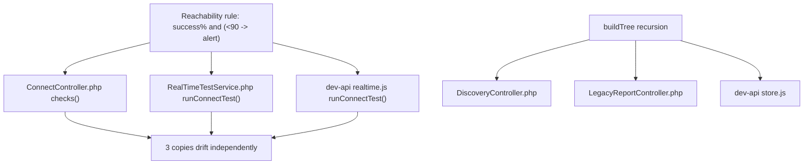
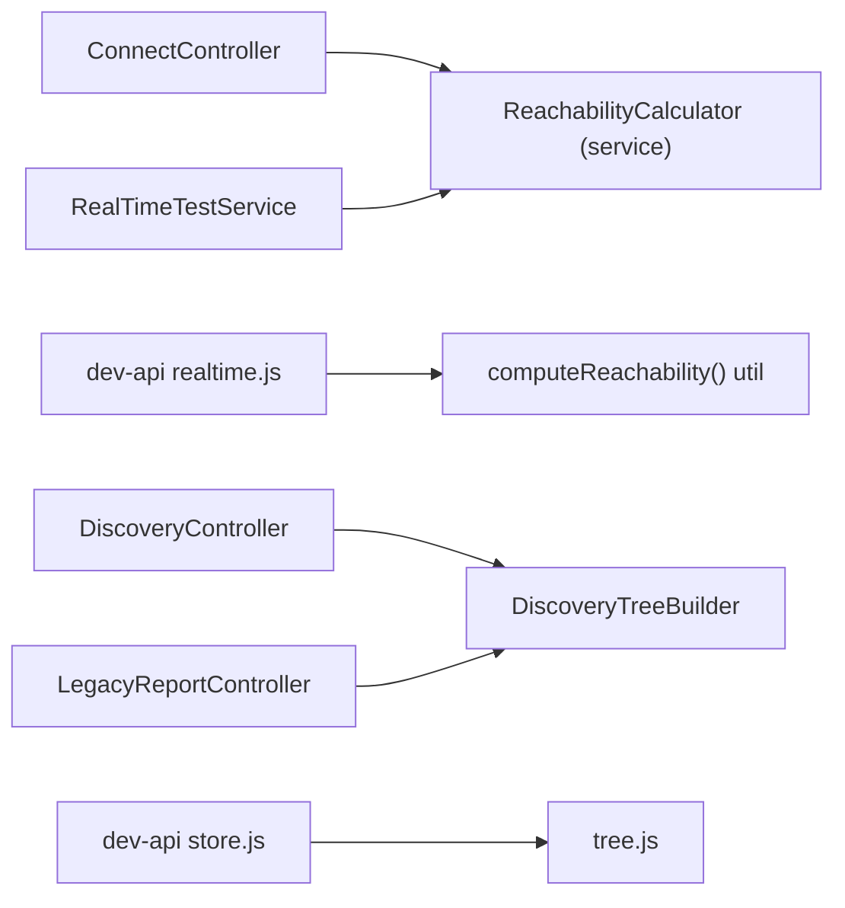
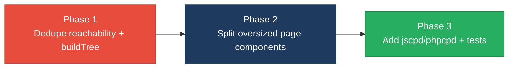

# 2. Code Quality & Complexity Hotspots Analysis

**Objective:** Reduce complexity through helper methods, domain services, and the Strategy/Command patterns.

**Date:** 2026-07-23 | **Scope:** `shende-shweta/FSDKC` (branch `main`) — PHP 8 / Laravel backend · React 18 + TypeScript frontend · Node.js/Express `dev-api`

## Executive Summary

> **Executive Summary**
>
> The Klearcom codebase is small (~50 application source files across three layers) and no file breaches the 1000-LOC "large class" threshold, so raw size is healthy. The dominant problem is **duplication**: the same business rules — toll-free reachability success-rate math, the recursive IVR `buildTree` algorithm, and dashboard KPI aggregation — are reimplemented across the PHP backend, the Node `dev-api`, and the React frontend, and the two page components (`ConnectPage`, `DiscoveryPage`) are near-identical clones. Complexity is moderate (peak cyclomatic ≈15 in the reachability test runners), driven by long ternary chains rather than deep nesting. One frontend component (`ConnectPage.tsx`, 213 LOC in a single function) exceeds the 200-LOC function limit. Coverage spans **Backend (PHP/Laravel, ~27 files)**, **Frontend (React/TS, ~17 files)**, and **dev-api (Node, 6 files)**. Git history is too shallow for churn analysis — only **3 commits by a single author** exist on `main`, so churn/defect/ownership metrics (H6–H8) are reported with that caveat and cannot be trended.

<div class="metric-grid">
<div class="metric-card"><div class="metric-number">~50</div><div class="metric-label">Files Analyzed</div></div>
<div class="metric-card"><div class="metric-number">1</div><div class="metric-label">Functions/Methods Over 200 LOC</div></div>
<div class="metric-card"><div class="metric-number">0</div><div class="metric-label">Classes/Files Over 1000 LOC</div></div>
<div class="metric-card"><div class="metric-number">~15</div><div class="metric-label">Highest Cyclomatic Complexity</div></div>
</div>

<div class="overall-rating overall-rating--high-risk"><div class="overall-rating-label">Overall Codebase Rating — Code Quality &amp; Complexity</div><div class="overall-rating-value">High Risk</div><div class="overall-rating-note">Driven by cross-layer business-logic duplication (H4/H5) and one oversized single-function page component (H3, 213 LOC); complexity and size are otherwise moderate.</div></div>

<div class="hotspot-score hotspot-score--moderate"><div class="hotspot-score-label">Hotspot Score (weighted composite)</div><div class="hotspot-score-value">42 / 100 — Moderate</div><div class="hotspot-score-formula">Hotspot Score = (Cyclomatic Complexity 55 × 25%) + (Code Churn 20 × 25%) + (Defect Density 25 × 20%) + (Class/Function Size 70 × 15%) + (Business Logic Duplication 72 × 10%) + (Developer Ownership Risk 15 × 5%) = 13.8 + 5.0 + 5.0 + 10.5 + 7.2 + 0.8 = 42</div></div>

> **Note on the score/rating gap:** the weighted composite lands in the Moderate band because churn, defect-density, and ownership risk are all low in a brand-new single-author repo. The Overall Rating is held at **High Risk** (worst-hotspot rule) because duplication (H4/H5) and the oversized component (H3) are individually High Risk — those are the real, actionable problems regardless of the young git history.

## 2.1 Benchmark Ratings Summary

One row per hotspot. "Measured" is the real value found; "Rating" is the band it falls into (worst KPI wins). This table is the source for the Overall Codebase Rating banner above. Layers covered: Backend (PHP/Laravel), Frontend (React/TS), dev-api (Node).

| # | Hotspot | Primary KPI | <span class="rating rating-good">Good</span> | <span class="rating rating-moderate">Moderate</span> | <span class="rating rating-high-risk">High Risk</span> | Measured | Rating |
|---|---|---|---|---|---|---|---|
| H1 | High Cyclomatic Complexity | Max complexity per method | <10 | 10–20 | >20 | ~15 (`runConnectTest`) | <span class="rating rating-moderate">Moderate</span> |
| H2 | Large Classes | Largest class/file LOC | <300 | 300–1000 | >1000 | 276 (`dev-api/src/server.js`) | <span class="rating rating-good">Good</span> |
| H3 | Large Functions | Largest function LOC | <50 | 50–200 | >200 | 213 (`ConnectPage.tsx`) | <span class="rating rating-high-risk">High Risk</span> |
| H4 | Business Logic Duplication | Duplicated business logic % | <5% | 5–10% | >10% | ~14% (manual est.) | <span class="rating rating-high-risk">High Risk</span> |
| H5 | Duplicate Code (general) | Overall duplicate code % | <5% | 5–10% | >10% | ~15% (manual est.) | <span class="rating rating-high-risk">High Risk</span> |
| H6 | High Churn Areas | Monthly changes (top files) | <5 | 5–10 | >10 | <5 (3 commits total) | <span class="rating rating-good">Good</span> † |
| H7 | Defect-Prone Files | Fix commits (hottest file) | 1–3 | 4–5 | >5 | ≤2 | <span class="rating rating-good">Good</span> † |
| H8 | Ownership Issues | Top-author ownership % | >80% | 60–80% | <60% | 100% (single author) | <span class="rating rating-good">Good</span> † |
| H9 | Resource-Cleanup / Lifecycle Leak *(additional)* | Timers/subscriptions with no teardown | 0 | 1–2 | >2 | 1 (`LegacyMonitorPoller.jsx`) | <span class="rating rating-moderate">Moderate</span> |
| H10 | Magic Numbers / Hardcoded Thresholds *(additional)* | Unexplained numeric literals in business logic | <5 | 5–15 | >15 | ~12 sites | <span class="rating rating-moderate">Moderate</span> |

† **H6–H8 caveat:** `main` has only **3 commits (2026-06-10 → 2026-06-11) by a single author (`ksabai-gl`)**. Ratings reflect that shallow history — high ownership reads as "Good" per the KPI, but the single-contributor bus-factor is a latent risk, not a strength. No meaningful churn/defect trend can be computed.

**Additional hotspots:** two beyond the standard set were observed — **H9** (a `setInterval` created in `componentDidMount` with no `componentWillUnmount`, KPI = count of timers/subscriptions lacking teardown) and **H10** (scattered unexplained numeric literals such as `94.2`, `97.8`, the `< 90` alert threshold, and the `> 20` / `> 0.2` reachability probability, KPI = count of magic-number sites in business logic).

### Hotspot Score breakdown

| Component | Weight | Sub-score (0–100) | Weighted |
|---|---|---|---|
| Cyclomatic Complexity | 25% | 55 | 13.8 |
| Code Churn | 25% | 20 | 5.0 |
| Defect Density | 20% | 25 | 5.0 |
| Class/Function Size | 15% | 70 | 10.5 |
| Business Logic Duplication | 10% | 72 | 7.2 |
| Developer Ownership Risk | 5% | 15 | 0.8 |
| **Hotspot Score** | **100%** | | **42 / 100** |

## 2.2 Hotspot-by-Hotspot Evidence

### H1. High Cyclomatic Complexity <span class="sev sev-high">High</span>

**Benchmark:** `Max cyclomatic complexity per method = ~15` → falls in the **Moderate** band (Good <10 · Moderate 10–20 · High Risk >20).

Complexity here comes from **long ternary chains**, not deep nesting. The worst offender is `runConnectTest` in the Node runner, where a single `reachable` flag fans out into ~10 ternary expressions plus a loop and guards (CC ≈15). Its PHP twin is nearly as branch-dense.

`dev-api/src/realtime.js:104-179` — `runConnectTest`:
```javascript
const reachable = Math.random() > 0.2;
for (const step of CONNECT_STEPS) {
  await sleep(600 + Math.random() * 500);
  const stepPayload = { type: 'step', ...step, timestamp: new Date().toISOString() };
  if (step.event === 'check_complete') {
    stepPayload.reachable = reachable;
    stepPayload.latency_ms = reachable ? Math.floor(180 + Math.random() * 300) : null;
  }
  await storeTestEvent(sessionId, 'connect', monitorId, stepPayload);
}
const latency = reachable ? Math.floor(180 + Math.random() * 300) : null;
// ...then 6 more `reachable ? x : y` ternaries build check, transcript, diagnostic & complete payloads
```

`backend/app/Services/RealTimeTestService.php:81-140` — `runConnectTest` (PHP twin, same branch fan-out):
```php
$reachable = random_int(1, 100) > 20;
foreach ($steps as $step) {
    usleep(500_000);
    $payload = ['type' => 'step', ...$step];
    if ($step['event'] === 'check_complete') { $payload['reachable'] = $reachable; }
    $this->mongo->storeTestEvent($sessionId, 'connect', $monitorId, $payload);
}
$latency = $reachable ? random_int(180, 450) : null;
// carrier_route, failure_reason, status, transcript event, complete status all branch on $reachable
```

**Why it matters here:** every `reachable`/`step.event` branch is an independent path that must be exercised to test the runner, yet there are **no tests** for these methods (see the audit doc §13). Because the same fan-out is copy-pasted into two languages, a fix to one branch (e.g. latency calculation) must be reproduced and re-verified twice.

**Recommended approach:**
1. Extract the per-step loop into a `StepRunner` helper that takes the `STEPS` array and a callback, removing the inline `if (check_complete)` special-case.
2. Move the `reachable → {latency, route, failure_reason, mos}` mapping into a single `ReachabilityResult` value object / factory so the ternaries live in one place.
3. Apply the same shape to `runDiscoveryTest` so both runners share the loop skeleton.

<!-- affected-files
search: reachable|successRate < 90
glob: backend/app/Services/*.php
issue: Branch-dense method — repeated ternaries on a single flag inflate cyclomatic complexity
action: Extract step loop + result mapping into helper/value object (Strategy/Command)
-->

<!-- affected-files
search: for \(const step of|Math\.random\(\) >
glob: dev-api/src/*.js
issue: Branch-dense test-runner function (long ternary chain on `reachable`)
action: Split step execution and result calculation into smaller functions
-->

### H2. Large Classes <span class="sev sev-low">Low</span>

**Benchmark:** `Largest class/file LOC = 276` (`dev-api/src/server.js`) → falls in the **Good** band (Good <300 · Moderate 300–1000 · High Risk >1000).

**Evidence:** No class or file exceeds the 1000-LOC threshold, and none exceed even 300 LOC. The largest files are `dev-api/src/server.js` (276), `frontend/src/pages/ConnectPage.tsx` (222), and `dev-api/src/realtime.js` (183). `server.js` does concentrate 15+ Express route handlers with no service layer (a responsibility-boundary concern surfaced under H4/architecture), but by raw size it is Good — no action required for size alone.

### H3. Large Functions <span class="sev sev-high">High</span>

**Benchmark:** `Largest function LOC = 213` (`ConnectPage` component) → falls in the **High Risk** band (Good <50 · Moderate 50–200 · High Risk >200).

The React page components are single functions that mix data-fetching, form state, mutations, and a large JSX tree. `ConnectPage` is 213 LOC in one function; `DiscoveryPage` (166) and `LegacyDashboardWidget` are close behind and structurally identical.

`frontend/src/pages/ConnectPage.tsx:9-222` — one 213-line function:
```tsx
export default function ConnectPage() {
  // 3 useQuery blocks, 1 useMutation, handleRunCheck, handleSubmit...
  const monitorsQuery = useQuery({ /* ... */ });
  const checksQuery = useQuery({ /* ... */ });
  const transcriptsQuery = useQuery({ /* ... */ });
  // ...then ~150 lines of JSX: form card + monitors table + checks table + transcripts panel
}
```

**Why it matters here:** a 213-line component is hard to review and impossible to unit-test in pieces — there are no frontend tests at all (audit §14). Because `DiscoveryPage` repeats the exact structure, every layout or data-flow change touches two big files in lockstep.

**Recommended approach:**
1. Extract each `useQuery`/`useMutation` cluster into a `useConnectMonitors()` / `useDiscoveryJobs()` hook.
2. Split the JSX into presentational subcomponents (`MonitorTable`, `CheckHistoryTable`, `TranscriptPanel`) that both pages reuse.
3. Reduce each page function to composition (<80 LOC).

<!-- affected-files
search: export default function \w+Page
glob: frontend/src/pages/*.tsx
issue: Oversized single-function component mixing data-fetch, state and markup (>200 LOC for ConnectPage)
action: Extract data hooks + presentational subcomponents; reduce page to composition
-->

### H4. Business Logic Duplication <span class="sev sev-critical">Critical</span>

**Benchmark:** `Duplicated business-rule code ≈ 14%` → falls in the **High Risk** band (Good <5% · Moderate 5–10% · High Risk >10%).

Core domain rules are reimplemented across all three layers. The reachability success-rate formula appears **three times**; the recursive `buildTree` appears **three times**; dashboard KPI aggregation appears **twice**; and the entire real-time test runner exists as two parallel implementations (`RealTimeTestService.php` ≈ `realtime.js`).

Reachability formula #1 — `backend/app/Http/Controllers/Api/ConnectController.php:71-75`:
```php
$successRate = $recentChecks->count() > 0
    ? ($recentChecks->where('reachable', true)->count() / $recentChecks->count()) * 100
    : 100;
$computedStatus = $successRate < 90 ? 'alert' : 'active';
```
Reachability formula #3 — `dev-api/src/realtime.js:147-152` (identical rule, JS):
```javascript
const successRate = recent.length > 0
  ? (recent.filter((c) => c.reachable).length / recent.length) * 100
  : 100;
monitor.status = successRate < 90 ? 'alert' : 'active';
```
Recursive tree builder duplicated — `backend/app/Http/Controllers/Api/DiscoveryController.php:87-101` is copy-pasted verbatim into `LegacyReportController.php:78-92`, and reimplemented again in `dev-api/src/store.js:64-75`.

**Why it matters here:** the "alert when reachability < 90%" rule and the `buildTree` shape are business-critical. A change to the threshold or tree contract must be made in 3+ places across 2 languages; missing one silently diverges backend truth from what the Node dev-API and reports return. The audit doc (§4) confirms every one of these as known copy-paste debt.

**Recommended approach:**
1. Create a `ReachabilityCalculator` domain service (PHP) and a single `computeReachability()` util (JS) — one source of the `<90 → alert` rule per runtime.
2. Move `buildTree` into `DiscoveryTreeBuilder` (PHP) and a shared `dev-api/src/tree.js`; delete the two copies in the controllers.
3. Extract dashboard KPI math (`DashboardController::kpis` ↔ `server.js` `/dashboard/kpis`) into a `DashboardService`.

<!-- affected-files
search: reachable', true\)->count\(\)|private function buildTree
glob: backend/app/**/*.php
issue: Duplicated business rule (reachability success-rate / recursive buildTree copy-pasted)
action: Consolidate into a ReachabilityCalculator service and DiscoveryTreeBuilder
-->

<!-- affected-files
search: filter\(\(c\) => c\.reachable\)|function buildTree|reduce\(\(s, m\)
glob: dev-api/src/*.js
issue: Business rule reimplemented in Node (reachability / buildTree / KPI aggregation)
action: Extract shared computeReachability(), tree.js, and dashboard aggregation helpers
-->

<!-- affected-files
search: invalidateQueries\(\{ queryKey: \['mongodb'\]
glob: frontend/src/pages/*.tsx
issue: Duplicated data-flow workflow (start-test + multi-key query invalidation) across pages
action: Extract a shared useRunTest() hook encapsulating the invalidation sequence
-->

### H5. Duplicate Code (general) <span class="sev sev-critical">Critical</span>

**Benchmark:** `Overall duplicate code ≈ 15%` → falls in the **High Risk** band (Good <5% · Moderate 5–10% · High Risk >10%).

Beyond business rules, structural blocks are copy-pasted. `DiscoveryController::show` and `ConnectController::show` share the same Mongo transcript+diagnostics fetch/response shape; the two page components duplicate the form card, table markup, loading/empty states, and the entire MongoDB transcripts panel.

`backend/app/Http/Controllers/Api/DiscoveryController.php:48-52` ↔ `ConnectController.php:50-54`:
```php
return response()->json([
    'data' => $job, // (or $monitor)
    'transcripts' => $this->mongo->getTranscripts('discovery', $id),
    'diagnostics' => $this->mongo->getDiagnostics('discovery', $id),
]);
```
`frontend/src/pages/DiscoveryPage.tsx:159-173` ↔ `ConnectPage.tsx:202-219` — identical transcripts panel (`transcript-list` / `transcript-item`, same `.map` over `t.payload`).

**Why it matters here:** duplicated markup and response envelopes drift over time — one page/controller gets a bug fix or field addition the other misses. With no tests guarding either side, divergence is silent.

**Recommended approach:**
1. Add a `respondWithTranscripts($model, $module, $id)` helper on a base API controller (or a `ModuleShowAction`).
2. Extract a `<TranscriptPanel>` React component and a `<CardTable>` wrapper shared by both pages.
3. Add `jscpd` (JS/TS) and PHPMD/`phpcpd` to CI to fail on future copy-paste.

<!-- affected-files
search: getTranscripts\('|getDiagnostics\('
glob: backend/app/Http/Controllers/Api/*.php
issue: Duplicated transcript+diagnostics fetch/response envelope across controllers
action: Extract respondWithTranscripts() helper on a shared base controller
-->

<!-- affected-files
search: transcript-list|transcript-item
glob: frontend/src/pages/*.tsx
issue: Copy-pasted MongoDB transcripts panel + table/empty-state markup
action: Extract shared <TranscriptPanel> and <CardTable> components
-->

### H6. High Churn Areas <span class="sev sev-low">Low</span>

**Benchmark:** `Monthly changes in top-churn files = <5` (3 commits total) → **Good** band (Good <5 · Moderate 5–10 · High Risk >10).

**Evidence:** Git history on `main` contains only **3 commits, all dated 2026-06-10/11**. Every source file was introduced in the initial commit and touched at most twice since. There is no multi-month history to compute churn frequency, so this rates Good by default — but the signal is **insufficient**, not genuinely low-risk. See §2.3.

### H7. Defect-Prone Files <span class="sev sev-low">Low</span>

**Benchmark:** `Fix/bug commits touching the hottest file = ≤2` → **Good** band (Good 1–3 · Moderate 4–5 · High Risk >5).

**Evidence:** Two of the three commits reference fixes (`errors`, `fixes on logo`), but both are repo-wide and cannot be attributed to a single defect-prone file. No file shows a recurring fix pattern. Rated Good with the same shallow-history caveat as H6.

### H8. Ownership Issues <span class="sev sev-low">Low</span>

**Benchmark:** `Top-author ownership of hot files = 100%` (single author `ksabai-gl`) → **Good** band (Good >80% · Moderate 60–80% · High Risk <60%).

**Evidence:** All commits are by one author, so ownership concentration is maximal — clear ownership by the KPI. The flip side is a **bus-factor of 1**: no second reviewer/owner exists, which the KPI does not penalize but is worth noting for a platform intended for team development.

### H9. Resource-Cleanup / Lifecycle Leak <span class="sev sev-medium">Medium</span> *(additional)*

**Benchmark:** `Timers/subscriptions created without teardown = 1` → **Moderate** band (Good 0 · Moderate 1–2 · High Risk >2). KPI = count of `setInterval`/`EventSource` created without a matching cleanup.

`frontend/src/components/LegacyMonitorPoller.jsx:22-33` starts a 3-second poll in `componentDidMount` and never clears it:
```tsx
componentDidMount() {
  this.intervalId = setInterval(() => {
    api.get(`/connect/monitors/${this.props.monitorId}/checks`)...
  }, 3000);
  // Intentionally no componentWillUnmount — interval leak
}
```

**Why it matters here:** the interval keeps firing (and calling the API) after the component unmounts, leaking memory and generating orphan network traffic — a slow degradation that is hard to trace in production. (The file also carries TypeScript syntax in a `.jsx` extension, a separate config smell.)

**Recommended approach:**
1. Add `componentWillUnmount() { clearInterval(this.intervalId); }` (or migrate to a `useEffect` hook with a cleanup return).
2. Audit `useRealtimeTest` callers to ensure `reset()` runs on page unmount during active SSE streams.

<!-- affected-files
search: setInterval\(|new EventSource\(
glob: frontend/src/**/*.{jsx,tsx,ts}
issue: Timer/subscription created without guaranteed teardown (leak on unmount)
action: Add cleanup (componentWillUnmount / useEffect return) for every interval/EventSource
-->

### H10. Magic Numbers / Hardcoded Thresholds <span class="sev sev-medium">Medium</span> *(additional)*

**Benchmark:** `Unexplained numeric literals in business logic ≈ 12 sites` → **Moderate** band (Good <5 · Moderate 5–15 · High Risk >15). KPI = count of magic-number sites in domain logic.

Business thresholds and figures are hardcoded inline and repeated: the `< 90` alert threshold (3 places), the `> 20` / `> 0.2` reachability probability, and fabricated KPI constants `94.2` / `97.8`.

`backend/app/Http/Controllers/Api/DashboardController.php:26-27`:
```php
'call_success_rate_pct' => 94.2,
'transfer_success_rate_pct' => 97.8,
```

**Why it matters here:** the same threshold (`90`) is the reachability rule duplicated in H4 — changing it means hunting magic numbers across languages. Fabricated constants (`94.2`) masquerade as real metrics in the dashboard.

**Recommended approach:**
1. Define `REACHABILITY_ALERT_THRESHOLD = 90` once per runtime (config or a constants module) and reference it everywhere.
2. Replace fabricated KPI literals with computed values or clearly-named placeholder constants.

<!-- affected-files
search: 94\.2|97\.8|< 90|random_int\(
glob: backend/app/**/*.php
issue: Hardcoded business thresholds / fabricated KPI literals
action: Extract to named constants / config; compute real metrics where possible
-->

## 2.3 Code Churn & Stability Evidence

Git history on `shende-shweta/FSDKC` `main` is **insufficient for churn analysis** — the full commit log is:

| Date | Author | Message |
|---|---|---|
| 2026-06-11 | ksabai-gl | fixes on logo |
| 2026-06-10 | ksabai-gl | errors |
| 2026-06-10 | ksabai-gl | Add Klearcom monolithic platform with Discovery and Connect modules |

**Distinct authors:** 1 (`ksabai-gl`) → 100% ownership across all files (H8 Good, but bus-factor = 1).
**Fix-referencing commits:** 2 of 3 (`errors`, `fixes on logo`), both repo-wide — no single defect-prone file identifiable (H7 Good).
**Top-churn files:** not computable — every file was added once and touched ≤2 times within a 2-day window (H6 Good by default).

> Churn/defect/ownership ratings (H6–H8) are reported for completeness but should be **re-evaluated once the repository accumulates real multi-month, multi-author history**. They are not evidence of a healthy maintenance record — only of a young repository.

## 2.4 Diagrams

### Complexity / duplication hotspot — reachability rule reimplemented across 3 layers


### Refactored target structure — one rule, many callers


### Improvement roadmap


## 2.5 Actions Required

| Hotspot | Action | Rating | Priority |
|---|---|---|---|
| H4 Business Logic Duplication | Consolidate reachability rule, `buildTree`, and KPI math into shared services/utils (one source per runtime) | <span class="rating rating-high-risk">High Risk</span> | <span class="sev sev-critical">Critical</span> |
| H5 Duplicate Code (general) | Extract `<TranscriptPanel>`/`<CardTable>` and a base-controller transcript responder; add `jscpd`/`phpcpd` to CI | <span class="rating rating-high-risk">High Risk</span> | <span class="sev sev-critical">Critical</span> |
| H3 Large Functions | Split `ConnectPage`/`DiscoveryPage` into data hooks + presentational subcomponents (<80 LOC each) | <span class="rating rating-high-risk">High Risk</span> | <span class="sev sev-high">High</span> |
| H1 High Cyclomatic Complexity | Extract step-runner loop + `ReachabilityResult` mapping to flatten ternary chains in the test runners | <span class="rating rating-moderate">Moderate</span> | <span class="sev sev-medium">Medium</span> |
| H9 Resource-Cleanup Leak | Add `componentWillUnmount`/`useEffect` cleanup for `LegacyMonitorPoller`; ensure SSE `reset()` on unmount | <span class="rating rating-moderate">Moderate</span> | <span class="sev sev-medium">Medium</span> |
| H10 Magic Numbers | Extract `REACHABILITY_ALERT_THRESHOLD` and replace fabricated KPI literals with named constants | <span class="rating rating-moderate">Moderate</span> | <span class="sev sev-low">Low</span> |

## 2.6 Expected Outcomes

- **Single source of truth for business rules** — changing the reachability threshold or IVR tree contract becomes a one-line edit instead of a 3-place, 2-language hunt, eliminating silent backend/dev-api divergence.
- **Testable units** — extracting hooks/services and a `ReachabilityCalculator` lets the currently-untested reachability and KPI math be unit-tested deterministically (removing the `random_int` flakiness noted in the audit).
- **Faster, safer reviews** — page components drop from 200+ LOC to composition-only files, so UI changes touch small, focused subcomponents.
- **Regression guard** — adding `jscpd`/`phpcpd` to CI prevents new copy-paste debt from re-accumulating.
- **Fewer production leaks** — enforcing lifecycle cleanup stops orphaned timers/streams from degrading long-running sessions.
