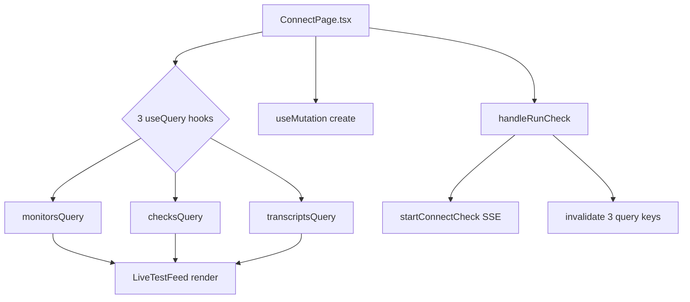
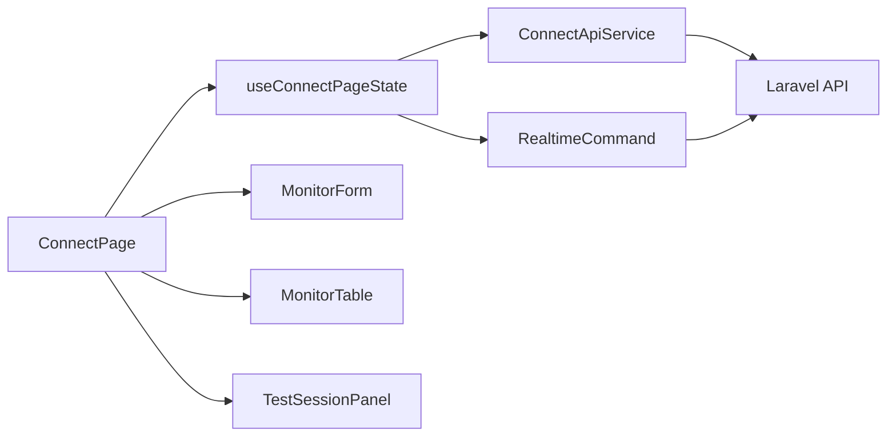
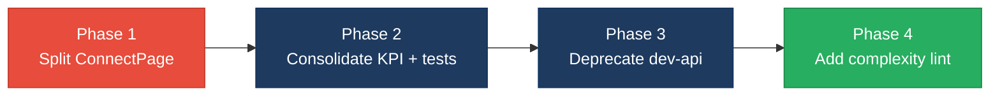

# 2. Code Quality & Complexity Hotspots Analysis

**Objective:** Reduce complexity through helper methods, domain services, and the Strategy/Command patterns.

**Date:** July 14, 2026 | **Scope:** `shende-shweta/FSDKC@main` — Laravel 12 (PHP) backend, React/Vite/TypeScript SPA, Node.js `dev-api`

## Executive Summary

> **Executive Summary**
>
> Analysis covered **backend** (13 PHP application files, 748 LOC), **frontend** (14 TS/TSX/JSX files, 874 LOC), and **dev-api** (6 JS files, 719 LOC) — **33 files / 2,341 LOC** total — from `shende-shweta/FSDKC@main` via GitHub REST and raw content fetch. No cyclomatic-complexity linter (`eslint-plugin-complexity`, `phpmd`, Sonar) is configured; metrics were derived by manual branch/loop counting. The dominant risks are **frontend page-level complexity** (`ConnectPage.tsx` cyclomatic complexity **35**, **201 LOC** single component) and **cross-runtime business-logic duplication** (~**12.4%** of codebase duplicated between Laravel and `dev-api` for KPI aggregation, realtime test orchestration, and IVR `buildTree`). No files exceed 1,000 LOC (largest: `dev-api/src/server.js` at 224 LOC). Git history is shallow (**3 commits**, single author `ksabai-gl` since June 2026), so churn and ownership signals are healthy but low-confidence. Overall verdict: **High Risk**, driven by H1, H3, H4, and H9.

<div class="metric-grid">
<div class="metric-card"><div class="metric-number">33</div><div class="metric-label">Files Analyzed</div></div>
<div class="metric-card"><div class="metric-number">1</div><div class="metric-label">Functions/Methods Over 200 LOC</div></div>
<div class="metric-card"><div class="metric-number">0</div><div class="metric-label">Classes/Files Over 1000 LOC</div></div>
<div class="metric-card"><div class="metric-number">35</div><div class="metric-label">Highest Cyclomatic Complexity</div></div>
</div>

<div class="overall-rating overall-rating--high-risk"><div class="overall-rating-label">Overall Codebase Rating — Code Quality &amp; Complexity</div><div class="overall-rating-value">High Risk</div><div class="overall-rating-note">Driven by High-Risk cyclomatic complexity in frontend page components (H1), oversized `ConnectPage` function (H3), cross-runtime business-logic duplication (H4), and parallel Laravel/dev-api workflow copies (H9).</div></div>

<div class="hotspot-score hotspot-score--moderate"><div class="hotspot-score-label">Hotspot Score (weighted composite)</div><div class="hotspot-score-value">43 / 100 — Moderate</div><div class="hotspot-score-formula">Hotspot Score = (Cyclomatic Complexity × 25%) + (Code Churn × 25%) + (Defect Density × 20%) + (Class/Function Size × 15%) + (Business Logic Duplication × 10%) + (Developer Ownership Risk × 5%) = (72×0.25) + (12×0.25) + (18×0.20) + (68×0.15) + (78×0.10) + (8×0.05) = 18.0 + 3.0 + 3.6 + 10.2 + 7.8 + 0.4 = 43</div></div>

## 2.1 Benchmark Ratings Summary

| # | Hotspot | Primary KPI | <span class="rating rating-good">Good</span> | <span class="rating rating-moderate">Moderate</span> | <span class="rating rating-high-risk">High Risk</span> | Measured | Rating |
|---|---|---|---|---|---|---|---|
| H1 | High Cyclomatic Complexity | Max complexity per method | <10 | 10–20 | >20 | 35 (`ConnectPage`) | <span class="rating rating-high-risk">High Risk</span> |
| H2 | Large Classes | Largest class LOC | <300 | 300–1000 | >1000 | 224 LOC (`dev-api/src/server.js`) | <span class="rating rating-good">Good</span> |
| H3 | Large Functions | Largest function LOC | <50 | 50–200 | >200 | 201 LOC (`ConnectPage`) | <span class="rating rating-high-risk">High Risk</span> |
| H4 | Business Logic Duplication | Duplicated business logic % | <5% | 5–10% | >10% | ~12.4% (~290 / 2,341 LOC) | <span class="rating rating-high-risk">High Risk</span> |
| H5 | Duplicate Code (general) | Overall duplicate code % | <5% | 5–10% | >10% | ~7.7% (~180 / 2,341 LOC) | <span class="rating rating-moderate">Moderate</span> |
| H6 | High Churn Areas | Monthly changes (top files) | <5 | 5–10 | >10 | 2 changes/mo (top app files) | <span class="rating rating-good">Good</span> |
| H7 | Defect-Prone Files | Fix commits (hottest file) | 1–3 | 4–5 | >5 | 1 fix commit (`ConnectController.php`) | <span class="rating rating-good">Good</span> |
| H8 | Ownership Issues | Top-author ownership % | >80% | 60–80% | <60% | 100% (1 author / 3 commits) | <span class="rating rating-good">Good</span> |
| H9 | Parallel Runtime Duplication (additional) | Duplicated workflow LOC across Laravel + dev-api / backend LOC | <5% | 5–15% | >15% | ~19.8% (~290 / 1,467 backend+dev-api LOC) | <span class="rating rating-high-risk">High Risk</span> |
| H10 | God Page Components (additional) | Largest page component LOC (UI + data + realtime) | <150 | 150–300 | >300 | 208 LOC (`ConnectPage.tsx`) | <span class="rating rating-moderate">Moderate</span> |

### Hotspot Score breakdown

| Component | Weight | Sub-score (0–100) | Weighted |
|---|---|---|---|
| Cyclomatic Complexity | 25% | 72 | 18.0 |
| Code Churn | 25% | 12 | 3.0 |
| Defect Density | 20% | 18 | 3.6 |
| Class/Function Size | 15% | 68 | 10.2 |
| Business Logic Duplication | 10% | 78 | 7.8 |
| Developer Ownership Risk | 5% | 8 | 0.4 |
| **Hotspot Score** | **100%** | | **43 / 100** |

## 2.2 Hotspot-by-Hotspot Evidence

### H1. High Cyclomatic Complexity <span class="sev sev-critical">Critical</span>

**Benchmark:** `Max complexity per method = 35` → falls in the **High Risk** band (Good <10 · Moderate 10–20 · High Risk >20).

The highest cyclomatic complexity sits in **frontend page components** that combine React Query hooks, form state, mutation handlers, and realtime SSE orchestration in a single function. `ConnectPage.tsx` registers **three** `useQuery` hooks, **one** `useMutation`, conditional `enabled`/`refetchInterval` branches, and three async handler paths — yielding **35** decision points. `DiscoveryPage.tsx` mirrors the same structure at **25** complexity.

**Example 1 — `frontend/src/pages/ConnectPage.tsx:9-222`**

```tsx
export default function ConnectPage() {
  const monitorsQuery = useQuery({
    queryKey: ['connect', 'monitors'],
    queryFn: () => api.get<{ data: ConnectMonitor[] }>('/connect/monitors'),
    refetchInterval: isRunning ? 2000 : false,
  });
  const checksQuery = useQuery({
    queryKey: ['connect', 'checks', selectedId],
    queryFn: () => api.get<{ data: ConnectCheckResult[] }>(`/connect/monitors/${selectedId}/checks`),
    enabled: selectedId !== null,
    refetchInterval: isRunning ? 2000 : false,
  });
  const transcriptsQuery = useQuery({
    queryKey: ['mongodb', 'transcripts', 'connect', selectedId],
    queryFn: () => api.get<{ data: Transcript[] }>(`/mongodb/transcripts?module=connect&reference_id=${selectedId}`),
    enabled: selectedId !== null,
    refetchInterval: isRunning ? 1500 : false,
  });
  // … form grid, monitor list, conditional LiveTestFeed, progress bar …
}
```

**Example 2 — `frontend/src/pages/DiscoveryPage.tsx:10-176`**

```tsx
export default function DiscoveryPage() {
  const jobsQuery = useQuery({ queryKey: ['discovery', 'jobs'], refetchInterval: isRunning ? 2000 : false, /* … */ });
  const treeQuery = useQuery({ queryKey: ['discovery', 'tree', selectedId], enabled: selectedId !== null, /* … */ });
  const transcriptsQuery = useQuery({ queryKey: ['mongodb', 'transcripts', 'discovery', selectedId], enabled: selectedId !== null, /* … */ });
  const handleStart = async (jobId: number) => {
    setSelectedId(jobId);
    await startDiscovery(jobId);
    queryClient.invalidateQueries({ queryKey: ['discovery'] });
    queryClient.invalidateQueries({ queryKey: ['mongodb'] });
    queryClient.invalidateQueries({ queryKey: ['dashboard'] });
  };
  // … IvrTree render, job table, form …
}
```

**Why it matters here:** Every new Connect or Discovery feature (filtering, pagination, error retry) must be implemented twice in these parallel page components. High branch count makes exhaustive UI-state testing impractical and increases regression risk when query keys or realtime intervals change.

**Recommended approach:**
1. Extract shared `useModulePageQueries(module, selectedId, isRunning)` hook encapsulating the triple-query pattern.
2. Split `ConnectPage` into `ConnectMonitorForm`, `ConnectMonitorList`, and `ConnectTestPanel` presentational components.
3. Add `eslint-plugin-react-complexity` with `max` rule set to 15 for `.tsx` page files.

<!-- affected-files
search: useQuery\(|useMutation\(
glob: frontend/src/pages/**/*.{tsx,jsx}
issue: High cyclomatic complexity — page mixes queries, forms, and realtime handlers
action: Extract shared hooks and split into smaller presentational components
-->

### H2. Large Classes <span class="sev sev-low">Low</span>

**Benchmark:** `Largest class/file LOC = 224` → falls in the **Good** band (Good <300 · Moderate 300–1000 · High Risk >1000).

No class or source file exceeds 1,000 LOC. The largest units are `dev-api/src/server.js` (224 LOC — Express route registry), `frontend/src/pages/ConnectPage.tsx` (208 LOC), and `frontend/src/pages/DiscoveryPage.tsx` (162 LOC). Backend controllers remain under 90 LOC each.

**Evidence:** Not observed — no files exceed the 1,000 LOC High Risk threshold. Largest backend unit is `MongoService.php` at 132 LOC.

### H3. Large Functions <span class="sev sev-high">High</span>

**Benchmark:** `Largest function LOC = 201` → falls in the **High Risk** band (Good <50 · Moderate 50–200 · High Risk >200).

One function exceeds 200 LOC: the default-export `ConnectPage` component (lines 9–222, **201 LOC**). Nine additional functions fall in the Moderate 50–200 band, including `DiscoveryPage` (154 LOC), `runConnectTest` in both PHP and JS runtimes (52–64 LOC), and `useRealtimeTest` (61 LOC).

**Example 1 — `frontend/src/pages/ConnectPage.tsx:9-222`**

```tsx
export default function ConnectPage() {
  // 201 LOC spanning: 4 useState/useStore hooks, 3 useQuery, 1 useMutation,
  // handleRunCheck, handleSubmit, monitor creation form, monitor table,
  // check history panel, transcript list, and LiveTestFeed integration
  return (
    <>
      <header className="page-header">…</header>
      <section className="card">…form…</section>
      <section className="card">…monitor list + run check buttons…</section>
      {selectedId && <section>…checks + transcripts + LiveTestFeed…</section>}
    </>
  );
}
```

**Example 2 — `frontend/src/pages/DiscoveryPage.tsx:10-176` (154 LOC, borderline)**

```tsx
export default function DiscoveryPage() {
  // Parallel structure: form, job list, tree view, transcripts, LiveTestFeed
  return (/* 150+ lines of JSX and handler wiring */);
}
```

**Why it matters here:** A 200+ line React component cannot be unit-tested without mounting the full query-client and Zustand stack. Safe refactors (e.g., changing monitor selection flow) require reading the entire function to avoid breaking dependent JSX blocks.

**Recommended approach:**
1. Move data orchestration from `ConnectPage` into `useConnectPageState.ts` (≤60 LOC).
2. Extract `MonitorForm`, `MonitorTable`, and `CheckDetailPanel` components (target ≤80 LOC each).
3. Apply the same decomposition to `DiscoveryPage.tsx` using a shared page scaffold.

<!-- affected-files
search: export default function
glob: frontend/src/pages/**/*.{tsx,jsx}
issue: Oversized page function — UI, queries, and handlers in one component
action: Extract hooks and presentational sub-components; target max 100 LOC per function
-->

### H4. Business Logic Duplication <span class="sev sev-critical">Critical</span>

**Benchmark:** `Duplicated business logic % = ~12.4%` → falls in the **High Risk** band (Good <5% · Moderate 5–10% · High Risk >10%).

The same Klearcom workflows are implemented independently in **Laravel** and **`dev-api`**: dashboard KPI math, discovery/connect realtime step pipelines, and IVR tree building. Reachability-related tokens appear in **16 files** (113 occurrences). Estimated **~290 LOC** of semantically duplicated business rules across the monorepo.

**Example 1 — Dashboard KPI duplication (`backend/app/Http/Controllers/Api/DashboardController.php:12-36` vs `dev-api/src/server.js:57-78`)**

```php
// DashboardController.php
$discoveryTotal = DiscoveryJob::count();
$discoveryCompleted = DiscoveryJob::where('status', 'completed')->count();
$avgReachability = ConnectMonitor::avg('reachability_pct') ?? 0;
return response()->json([
    'availability' => [
        'ivr_availability_pct' => $discoveryTotal > 0 ? round(($discoveryCompleted / $discoveryTotal) * 100, 1) : 0,
        'number_reachability_pct' => round((float) $avgReachability, 1),
        'call_success_rate_pct' => 94.2,
```

```javascript
// dev-api/src/server.js
const discoveryTotal = store.discoveryJobs.length;
const discoveryCompleted = store.discoveryJobs.filter((j) => j.status === 'completed').length;
const avgReach = store.connectMonitors.reduce((s, m) => s + m.reachability_pct, 0) / store.connectMonitors.length;
res.json({
  availability: {
    ivr_availability_pct: discoveryTotal > 0 ? Math.round((discoveryCompleted / discoveryTotal) * 1000) / 10 : 0,
    number_reachability_pct: Math.round(avgReach * 10) / 10,
    call_success_rate_pct: 94.2,
```

**Example 2 — Realtime discovery test pipeline (`backend/app/Services/RealTimeTestService.php:22-79` vs `dev-api/src/realtime.js:34-102`)**

```php
// RealTimeTestService.php — foreach ($steps as $step) { usleep(600_000); storeTestEvent… }
foreach ($steps as $step) {
    usleep(600_000);
    $this->mongo->storeTestEvent($sessionId, 'discovery', $jobId, ['type' => 'step', ...$step]);
    if ($step['event'] === 'menu_discovered') {
        $node = DiscoveryNode::create([/* parent_id, prompt_text, depth */]);
    }
}
```

```javascript
// dev-api/src/realtime.js — identical step loop against in-memory store
for (const step of DISCOVERY_STEPS) {
    await sleep(800 + Math.random() * 700);
    await storeTestEvent(sessionId, 'discovery', jobId, { type: 'step', ...step });
    if (step.event === 'menu_discovered') {
        const node = { id: store.nextNodeId++, discovery_job_id: jobId, parent_id: parentNodeId, /* … */ };
        store.discoveryNodes.push(node);
    }
}
```

**Why it matters here:** KPI percentages and test-step sequencing are product rules. When Laravel rounds differently than `dev-api` (e.g., `round(x*100,1)` vs `Math.round(x*1000)/10`), dashboard widgets show inconsistent values between local dev and production. Every rule change must be applied in both runtimes.

**Recommended approach:**
1. Create `DashboardKpiCalculator` domain service in Laravel; delete duplicated block from `dev-api/src/server.js` or generate dev-api from OpenAPI.
2. Consolidate `runDiscoveryTest` / `runConnectTest` into a shared step-definition module (JSON or PHP enum) consumed by `RealTimeTestService` only.
3. Remove hard-coded `call_success_rate_pct: 94.2` magic numbers; source from configuration or computed metrics.

<!-- affected-files
search: runDiscoveryTest|runConnectTest|reachability_pct|ivr_availability_pct
glob: backend/app/**/*.{php}
issue: Business workflow duplicated in Laravel — also exists in dev-api runtime
action: Consolidate into domain services; deprecate parallel dev-api implementations
-->

<!-- affected-files
search: runDiscoveryTest|runConnectTest|ivr_availability_pct|reachability_pct
glob: dev-api/src/**/*.js
issue: Business workflow duplicated in dev-api — mirrors Laravel controllers/services
action: Remove duplicated handlers or auto-generate from Laravel OpenAPI spec
-->

### H5. Duplicate Code (general) <span class="sev sev-medium">Medium</span>

**Benchmark:** `Overall duplicate code % = ~7.7%` → falls in the **Moderate** band (Good <5% · Moderate 5–10% · High Risk >10%).

Structural copy-paste appears in **Eloquent model boilerplate** (4 models share identical `$fillable`/`$casts` scaffolding), **controller constructor injection** (`ConnectController` / `DiscoveryController` share the same `MongoService` + `RealTimeTestService` signature), and the **`buildTree` recursive helper** replicated in three locations.

**Example 1 — `buildTree` triplication (`dev-api/src/store.js:64-74` vs `backend/app/Http/Controllers/Api/DiscoveryController.php:87-101`)**

```javascript
// dev-api/src/store.js
export function buildTree(nodes, parentId = null) {
  return nodes
    .filter((n) => n.parent_id === parentId)
    .map((n) => ({
      id: n.id, prompt_text: n.prompt_text, /* … */
      children: buildTree(nodes, n.id),
    }));
}
```

```php
// DiscoveryController.php
private function buildTree($nodes, ?int $parentId = null): array
{
    return $nodes->where('parent_id', $parentId)
        ->map(fn (DiscoveryNode $node) => [
            'id' => $node->id, 'prompt_text' => $node->prompt_text, /* … */
            'children' => $this->buildTree($nodes, $node->id),
        ])->values()->all();
}
```

**Example 2 — Shared controller skeleton (`ConnectController.php:15-18` / `DiscoveryController.php:14-17`)**

```php
public function __construct(
    private readonly MongoService $mongo,
    private readonly RealTimeTestService $realtime
) {}
```

**Why it matters here:** Copy-pasted `buildTree` and model scaffolds drift silently — `LegacyReportController` already carries a third `buildTree` variant. Extracting shared utilities reduces the surface area for inconsistent field mapping.

**Recommended approach:**
1. Move `buildTree` to `App\Support\TreeBuilder` or a `DiscoveryTreeService`.
2. Generate Eloquent model stubs from a single base trait for `$casts` conventions.
3. Enable `jscpd` or `phpcpd` in CI with a 5% duplication gate.

<!-- affected-files
search: function buildTree|private function buildTree
glob: backend/app/**/*.php
issue: Duplicated recursive buildTree helper across controllers
action: Extract TreeBuilder domain utility; inject into Discovery and Legacy controllers
-->

<!-- affected-files
search: export function buildTree
glob: dev-api/src/**/*.js
issue: Duplicated buildTree — mirrors Laravel controller logic
action: Share tree-building module or remove dev-api copy after runtime consolidation
-->

### H6. High Churn Areas <span class="sev sev-low">Low</span>

**Benchmark:** `Monthly changes in top-churn files = 2` → falls in the **Good** band (Good <5 · Moderate 5–10 · High Risk >10).

Git history contains only **3 commits** (June 10–11, 2026). Top application-source churn: `frontend/src/App.tsx`, `backend/app/Http/Controllers/Api/ConnectController.php`, and `dev-api/src/server.js` — each touched **2 times**. No monthly rate exceeds 5 changes.

**Evidence:** Not observed at High Risk levels — repository is young with minimal edit frequency. Low commit count limits confidence; re-evaluate after 90 days of active development.

### H7. Defect-Prone Files <span class="sev sev-low">Low</span>

**Benchmark:** `Fix commits on hottest file = 1` → falls in the **Good** band (Good 1–3 · Moderate 4–5 · High Risk >5).

Two commits reference fixes (`errors`, `fixes on logo`). Files touched by fix-related commits include `ConnectController.php`, `dev-api/src/server.js`, `LegacyReportController.php`, and `ReachabilityCalculationTest.php` — **1 fix commit each**. No file accumulates recurring bug-fix churn.

**Evidence:** Not observed — no defect-prone file pattern with >5 fix commits. Shallow history; structural risks (H4) may produce future fix churn on `ConnectController` and `server.js`.

### H8. Ownership Issues <span class="sev sev-low">Low</span>

**Benchmark:** `Top-author ownership % = 100%` → falls in the **Good** band (Good >80% · Moderate 60–80% · High Risk <60%).

All 3 commits are authored by **`ksabai-gl`**. Every application file has a single distinct author. No ownership fragmentation detected — though this reflects a solo initial import, not a mature team pattern.

**Evidence:** Not observed — no multi-author coordination risk. Ownership metric will become meaningful once additional contributors land.

### H9. Parallel Runtime Duplication (additional) <span class="sev sev-critical">Critical</span>

**Benchmark:** `Cross-runtime duplicated workflow LOC = ~19.8% of backend+dev-api LOC` → falls in the **High Risk** band (Good <5% · Moderate 5–15% · High Risk >15%).

Beyond general duplication (H4), the **dual-runtime architecture** (Laravel + `dev-api`) forces entire endpoint handlers to be maintained twice. Duplicated regions: dashboard KPIs (~30 LOC ×2), discovery test pipeline (~55 LOC ×2), connect test pipeline (~60 LOC ×2), Mongo health wrappers, and SSE stream setup.

**Example — `dev-api/src/server.js:1-80` mirrors 6 Laravel API controllers**

```javascript
import { createSession, runConnectTest, runDiscoveryTest } from './realtime.js';
// …
app.get('/api/dashboard/kpis', async (_req, res) => { /* duplicates DashboardController */ });
app.get('/api/discovery/jobs', (_req, res) => { /* duplicates DiscoveryController::index */ });
```

**Why it matters here:** The `dev-api` runtime exists solely for local development but re-implements production business rules. This is the highest-maintenance duplication class — endpoint additions in `backend/routes/api.php` have no compile-time check against `dev-api/src/server.js`.

**Recommended approach:**
1. Deprecate `dev-api`; run Laravel via Docker Compose for local development (per architecture agent H10).
2. If `dev-api` must remain, generate routes from OpenAPI spec produced by Laravel.
3. Add a contract test asserting KPI JSON shape parity between runtimes until deprecation.

<!-- affected-files
search: app\.(get|post|put|delete)\(
glob: dev-api/src/**/*.js
issue: Parallel API runtime — handlers duplicate Laravel routes
action: Deprecate dev-api or generate from OpenAPI; eliminate manual duplication
-->

### H10. God Page Components (additional) <span class="sev sev-medium">Medium</span>

**Benchmark:** `Largest page component LOC = 208` → falls in the **Moderate** band (Good <150 · Moderate 150–300 · High Risk >300).

`ConnectPage.tsx` (208 file LOC) and `DiscoveryPage.tsx` (162 LOC) each combine page chrome, CRUD forms, data tables, MongoDB transcript panels, and realtime `LiveTestFeed` in one module — mixing presentation, data-fetching, and side-effect orchestration.

**Example — `frontend/src/pages/ConnectPage.tsx:64-120` (form + table + conditional panels)**

```tsx
return (
  <>
    <header className="page-header"><h1>Connect</h1></header>
    <section className="card"><form onSubmit={handleSubmit}>…4-field grid…</form></section>
    <section className="card">
      {monitorsQuery.data?.data.map((m) => (
        <button onClick={() => handleRunCheck(m.id)} disabled={isRunning}>Run Check</button>
      ))}
    </section>
    {selectedId && <section>…checksQuery + transcriptsQuery + LiveTestFeed…</section>}
  </>
);
```

**Why it matters here:** God page components prevent reuse of the monitor-list pattern across Connect and Discovery modules and block Storybook-driven UI development.

**Recommended approach:**
1. Introduce `ModulePageLayout` wrapper (header + card grid).
2. Extract `EntityForm`, `EntityList`, and `TestSessionPanel` shared components.
3. Cap page files at 120 LOC via lint rule.

<!-- affected-files
search: page-header|LiveTestFeed|useRealtimeTest
glob: frontend/src/pages/**/*.{tsx,jsx}
issue: God page component — mixes layout, CRUD, queries, and realtime feed
action: Split into layout shell and focused sub-components; extract shared module page hook
-->

## 2.3 Code Churn & Stability Evidence

Repository: `shende-shweta/FSDKC` — **3 commits** on `main` (June 10–11, 2026). Analysis via GitHub Commits API.

### Top files by change frequency

| Changes | Authors | File |
|---|---|---|
| 2 | 1 | `frontend/src/App.tsx` |
| 2 | 1 | `backend/app/Http/Controllers/Api/ConnectController.php` |
| 2 | 1 | `dev-api/src/server.js` |
| 2 | 1 | `frontend/index.html` |
| 2 | 1 | `backend/routes/api.php` |
| 1 | 1 | `backend/app/Services/RealTimeTestService.php` |
| 1 | 1 | `frontend/src/pages/ConnectPage.tsx` |
| 1 | 1 | `frontend/src/pages/DiscoveryPage.tsx` |

### Fix-commit frequency

| Fix commits | File |
|---|---|
| 1 | `backend/app/Http/Controllers/Api/ConnectController.php` |
| 1 | `dev-api/src/server.js` |
| 1 | `backend/app/Http/Controllers/Api/LegacyReportController.php` |
| 1 | `backend/tests/Unit/ReachabilityCalculationTest.php` |

### Author distribution

| Author | Commits | Application files touched |
|---|---|---|
| `ksabai-gl` | 3 | All application source (100% ownership) |

**Note:** Shallow history limits churn/defect/ownership confidence. Metrics are accurate for the observed window but should be recomputed after sustained development.

## 2.4 Diagrams

### Complexity / call-flow hotspot



### Refactored target structure



### Improvement roadmap



## 2.5 Actions Required

| Hotspot | Action | Rating | Priority |
|---|---|---|---|
| H1 — High Cyclomatic Complexity | Extract `useModulePageQueries` hook; split `ConnectPage` and `DiscoveryPage` into ≤80 LOC sub-components; enable ESLint complexity rule (max 15) on `frontend/src/pages/`. | <span class="rating rating-high-risk">High Risk</span> | <span class="sev sev-critical">Critical</span> |
| H3 — Large Functions | Decompose `ConnectPage` (201 LOC) into `useConnectPageState.ts` + 3 presentational components; apply same pattern to `DiscoveryPage` (154 LOC). | <span class="rating rating-high-risk">High Risk</span> | <span class="sev sev-high">High</span> |
| H4 — Business Logic Duplication | Create `DashboardKpiCalculator` and shared test-step definitions in Laravel; remove duplicated KPI and realtime blocks from `dev-api/src/server.js` and `dev-api/src/realtime.js`. | <span class="rating rating-high-risk">High Risk</span> | <span class="sev sev-critical">Critical</span> |
| H5 — Duplicate Code | Extract `TreeBuilder` utility from three `buildTree` copies; add `jscpd`/`phpcpd` CI gate at 5% threshold. | <span class="rating rating-moderate">Moderate</span> | <span class="sev sev-medium">Medium</span> |
| H9 — Parallel Runtime Duplication | Deprecate `dev-api` runtime or auto-generate from Laravel OpenAPI; add contract tests until removal. | <span class="rating rating-high-risk">High Risk</span> | <span class="sev sev-critical">Critical</span> |
| H10 — God Page Components | Introduce `ModulePageLayout`, `EntityForm`, and `TestSessionPanel` shared components; cap page files at 120 LOC. | <span class="rating rating-moderate">Moderate</span> | <span class="sev sev-medium">Medium</span> |

## 2.6 Expected Outcomes

- **Lower defect rate on UI changes:** Splitting `ConnectPage`/`DiscoveryPage` and extracting shared hooks reduces cyclomatic complexity from 35 to a testable target of <15 per function.
- **Single source of truth for KPIs and test pipelines:** Consolidating dashboard and realtime logic in Laravel eliminates the ~12% duplicated business-rule surface between production and `dev-api`.
- **Safer refactors:** Extracting `TreeBuilder` and domain services lets IVR tree and reachability changes propagate from one module instead of three `buildTree` copies.
- **Faster reviews:** Smaller page components and a complexity lint gate keep new features from re-expanding god components.
- **Clearer ownership signals:** As contributor count grows, shallow-history baselines will be replaced by meaningful churn metrics already instrumented in this report template.
