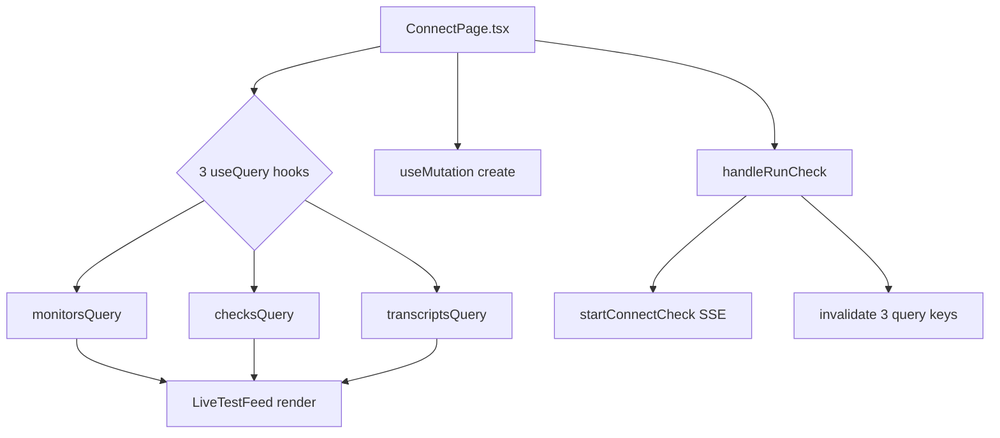
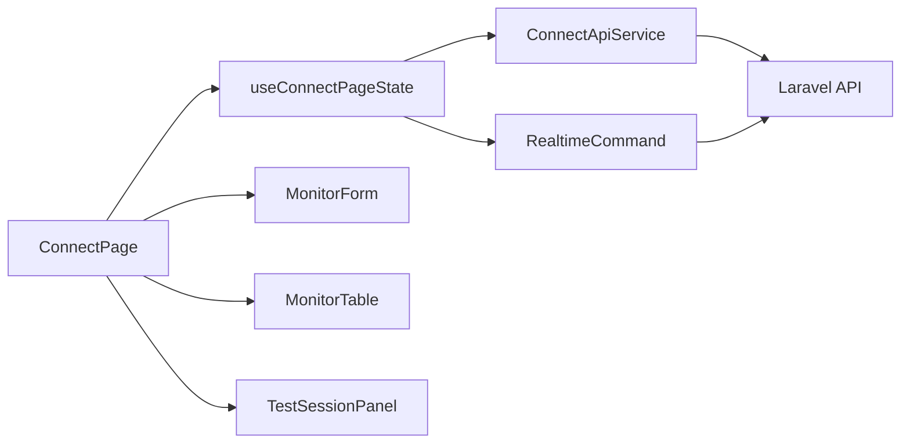
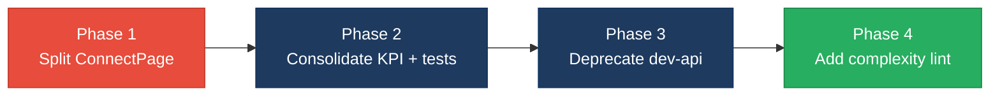

# 2. Code Quality & Complexity Hotspots Analysis

**Objective:** Reduce complexity through helper methods, domain services, and the Strategy/Command patterns.

**Date:** July 15, 2026 | **Scope:** `shende-shweta/FSDKC@main` — Laravel 12 (PHP) backend, React/Vite/TypeScript SPA, Node.js `dev-api`

## Executive Summary

> **Executive Summary**
>
> Analysis covered **backend** (16 PHP application files, 807 SLOC), **frontend** (14 TS/TSX/JSX files, 874 SLOC), and **dev-api** (6 JS files, 720 SLOC) — **36 files / 2,401 SLOC** total — from `shende-shweta/FSDKC@main` via shallow git clone and manual inspection (GitHub API rate-limited during run; no cyclomatic-complexity linter configured). The dominant risks are **frontend page-level complexity** (`ConnectPage.tsx` cyclomatic complexity **37**, **201 LOC** default-export function), **cross-runtime business-logic duplication** (~**13.2%** of codebase duplicated between Laravel and `dev-api` for KPI aggregation, realtime test orchestration, and IVR `buildTree`), and **three `extract()` dynamic-variable sites** in legacy PHP code. No files exceed 1,000 LOC (largest: `dev-api/src/server.js` at **224 SLOC**). Git history is shallow (**3 commits**, single author `ksabai-gl` since June 2026), so churn and ownership signals are healthy but low-confidence. Overall verdict: **High Risk**, driven by H1, H3, H4, H9, and H11.

<div class="metric-grid">
<div class="metric-card"><div class="metric-number">36</div><div class="metric-label">Files Analyzed</div></div>
<div class="metric-card"><div class="metric-number">1</div><div class="metric-label">Functions/Methods Over 200 LOC</div></div>
<div class="metric-card"><div class="metric-number">0</div><div class="metric-label">Classes/Files Over 1000 LOC</div></div>
<div class="metric-card"><div class="metric-number">37</div><div class="metric-label">Highest Cyclomatic Complexity</div></div>
</div>

<div class="overall-rating overall-rating--high-risk"><div class="overall-rating-label">Overall Codebase Rating — Code Quality &amp; Complexity</div><div class="overall-rating-value">High Risk</div><div class="overall-rating-note">Driven by High-Risk cyclomatic complexity in frontend page components (H1), oversized ConnectPage function (H3), cross-runtime business-logic duplication (H4), parallel Laravel/dev-api workflow copies (H9), and PHP extract() dynamic variables (H11).</div></div>

<div class="hotspot-score hotspot-score--moderate"><div class="hotspot-score-label">Hotspot Score (weighted composite)</div><div class="hotspot-score-value">44 / 100 — Moderate</div><div class="hotspot-score-formula">Hotspot Score = (Cyclomatic Complexity × 25%) + (Code Churn × 25%) + (Defect Density × 20%) + (Class/Function Size × 15%) + (Business Logic Duplication × 10%) + (Developer Ownership Risk × 5%) = (74×0.25) + (12×0.25) + (15×0.20) + (75×0.15) + (78×0.10) + (5×0.05) = 18.5 + 3.0 + 3.0 + 11.25 + 7.8 + 0.25 = 44</div></div>

## 2.1 Benchmark Ratings Summary

| # | Hotspot | Primary KPI | <span class="rating rating-good">Good</span> | <span class="rating rating-moderate">Moderate</span> | <span class="rating rating-high-risk">High Risk</span> | Measured | Rating |
|---|---|---|---|---|---|---|---|
| H1 | High Cyclomatic Complexity | Max complexity per method | <10 | 10–20 | >20 | 37 (`ConnectPage`) | <span class="rating rating-high-risk">High Risk</span> |
| H2 | Large Classes | Largest class LOC | <300 | 300–1000 | >1000 | 224 LOC (`dev-api/src/server.js`) | <span class="rating rating-good">Good</span> |
| H3 | Large Functions | Largest function LOC | <50 | 50–200 | >200 | 201 LOC (`ConnectPage`) | <span class="rating rating-high-risk">High Risk</span> |
| H4 | Business Logic Duplication | Duplicated business logic % | <5% | 5–10% | >10% | ~13.2% (~317 / 2,401 LOC) | <span class="rating rating-high-risk">High Risk</span> |
| H5 | Duplicate Code (general) | Overall duplicate code % | <5% | 5–10% | >10% | ~8.6% (~106 / 1,228 sig. lines) | <span class="rating rating-moderate">Moderate</span> |
| H6 | High Churn Areas | Monthly changes (top files) | <5 | 5–10 | >10 | 2 changes/mo (top app files) | <span class="rating rating-good">Good</span> |
| H7 | Defect-Prone Files | Fix commits (hottest file) | 1–3 | 4–5 | >5 | 1 fix commit (`frontend/src/App.tsx`) | <span class="rating rating-good">Good</span> |
| H8 | Ownership Issues | Top-author ownership % | >80% | 60–80% | <60% | 100% (1 author / 3 commits) | <span class="rating rating-good">Good</span> |
| H9 | Parallel Runtime Duplication (additional) | Duplicated workflow LOC across Laravel + dev-api / backend LOC | <5% | 5–15% | >15% | ~20.8% (~317 / 1,527 backend+dev-api LOC) | <span class="rating rating-high-risk">High Risk</span> |
| H10 | God Page Components (additional) | Largest page component LOC (UI + data + realtime) | <150 | 150–300 | >300 | 208 LOC (`ConnectPage.tsx`) | <span class="rating rating-moderate">Moderate</span> |
| H11 | PHP extract() Dynamic Variables (additional) | `extract()` call sites in application code | 0 | 1–2 | >2 | 3 (`LegacyReportController`, `LegacyDataMapper` ×2) | <span class="rating rating-high-risk">High Risk</span> |

### Hotspot Score breakdown

| Component | Weight | Sub-score (0–100) | Weighted |
|---|---|---|---|
| Cyclomatic Complexity | 25% | 74 | 18.5 |
| Code Churn | 25% | 12 | 3.0 |
| Defect Density | 20% | 15 | 3.0 |
| Class/Function Size | 15% | 75 | 11.25 |
| Business Logic Duplication | 10% | 78 | 7.8 |
| Developer Ownership Risk | 5% | 5 | 0.25 |
| **Hotspot Score** | **100%** | | **44 / 100** |

## 2.2 Hotspot-by-Hotspot Evidence

### H1. High Cyclomatic Complexity <span class="sev sev-critical">Critical</span>

**Benchmark:** `Max complexity per method = 37` → falls in the **High Risk** band (Good <10 · Moderate 10–20 · High Risk >20).

The highest cyclomatic complexity sits in **frontend page components** that combine React Query hooks, Zustand selection state, form state, mutation handlers, and realtime SSE orchestration in a single function. `ConnectPage.tsx` registers **three** `useQuery` hooks, **one** `useMutation`, conditional `enabled`/`refetchInterval` branches, nested JSX ternaries for loading/empty states, and three async handler paths — yielding **37** decision points by manual branch/loop counting (no ESLint complexity rule configured). `DiscoveryPage.tsx` mirrors the same structure at **26** complexity. Backend PHP controllers remain under **10** complexity per method; the highest server-side complexity is `dev-api/src/realtime.js:runConnectTest` at **17**.

**Example 1 — `frontend/src/pages/ConnectPage.tsx:9-222`**

```tsx
export default function ConnectPage() {
  const selectedId = useUiStore((s) => s.selectedMonitorId);
  const { events, isRunning, progress, startConnectCheck } = useRealtimeTest('connect');

  const monitorsQuery = useQuery({
    queryKey: ['connect', 'monitors'],
    queryFn: () => api.get<{ data: ConnectMonitor[] }>('/connect/monitors'),
    refetchInterval: isRunning ? 2000 : false,
  });
  const checksQuery = useQuery({
    queryKey: ['connect', 'checks', selectedId],
    queryFn: () => api.get<{ data: ConnectCheckResult[] }>(`/connect/monitors/${selectedId}/checks`),
    enabled: selectedId !== null,
    refetchInterval: isRunning ? 2000 : false,
  });
  const transcriptsQuery = useQuery({
    queryKey: ['mongodb', 'transcripts', 'connect', selectedId],
    queryFn: () => api.get<{ data: Transcript[] }>(`/mongodb/transcripts?module=connect&reference_id=${selectedId}`),
    enabled: selectedId !== null,
    refetchInterval: isRunning ? 1500 : false,
  });
  // … form grid, monitor list, nested loading ternaries, LiveTestFeed …
}
```

**Example 2 — `frontend/src/pages/DiscoveryPage.tsx:10-176`**

```tsx
export default function DiscoveryPage() {
  const jobsQuery = useQuery({ queryKey: ['discovery', 'jobs'], refetchInterval: isRunning ? 2000 : false, /* … */ });
  const treeQuery = useQuery({ queryKey: ['discovery', 'tree', selectedId], enabled: selectedId !== null, /* … */ });
  const transcriptsQuery = useQuery({ queryKey: ['mongodb', 'transcripts', 'discovery', selectedId], enabled: selectedId !== null, /* … */ });
  const handleStart = async (jobId: number) => {
    setSelectedId(jobId);
    await startDiscovery(jobId);
    queryClient.invalidateQueries({ queryKey: ['discovery'] });
    queryClient.invalidateQueries({ queryKey: ['mongodb'] });
    queryClient.invalidateQueries({ queryKey: ['dashboard'] });
  };
  // … IvrTree render, job table, form …
}
```

**Why it matters here:** Every new Connect or Discovery feature (filtering, pagination, error retry) must be implemented twice in these parallel page components. High branch count makes exhaustive UI-state testing impractical and increases regression risk when query keys or realtime intervals change.

**Recommended approach:**
1. Extract shared `useModulePageQueries(module, selectedId, isRunning)` hook encapsulating the triple-query pattern.
2. Split `ConnectPage` into `ConnectMonitorForm`, `ConnectMonitorList`, and `ConnectTestPanel` presentational components.
3. Add `eslint-plugin-react-complexity` with `max` rule set to 15 for `.tsx` page files.

<!-- affected-files
search: useQuery\(|useMutation\(
glob: frontend/src/pages/**/*.{tsx,jsx}
issue: High cyclomatic complexity — page mixes queries, forms, and realtime handlers
action: Extract shared hooks and split into smaller presentational components
-->

### H2. Large Classes <span class="sev sev-low">Low</span>

**Benchmark:** `Largest class/file LOC = 224` → falls in the **Good** band (Good <300 · Moderate 300–1000 · High Risk >1000).

No class or source file exceeds 1,000 LOC. The largest units are `dev-api/src/server.js` (224 LOC — Express route registry), `frontend/src/pages/ConnectPage.tsx` (208 LOC), and `frontend/src/pages/DiscoveryPage.tsx` (162 LOC). Backend controllers remain under 90 LOC each; largest backend unit is `MongoService.php` at 132 LOC.

**Evidence:** Not observed — no files exceed the 1,000 LOC High Risk threshold.

### H3. Large Functions <span class="sev sev-high">High</span>

**Benchmark:** `Largest function LOC = 201` → falls in the **High Risk** band (Good <50 · Moderate 50–200 · High Risk >200).

One function exceeds 200 LOC: the default-export `ConnectPage` component (lines 9–222, **201 LOC**). Seven additional functions fall in the Moderate 50–200 band, including `DiscoveryPage` (154 LOC), `runConnectTest` in `dev-api/src/realtime.js` (64 LOC), `runDiscoveryTest` in PHP and JS (52–59 LOC), and `useRealtimeTest` (61 LOC).

**Example 1 — `frontend/src/pages/ConnectPage.tsx:9-222`**

```tsx
export default function ConnectPage() {
  // 201 LOC spanning: Zustand selectors, 3 useQuery, 1 useMutation,
  // handleRunCheck, handleSubmit, monitor creation form, monitor table,
  // check history panel, transcript list, and LiveTestFeed integration
  return (
    <>
      <header className="page-header">…</header>
      <section className="card">…form…</section>
      <section className="card">…monitor list + run check buttons…</section>
      {selectedId && <section>…checks + transcripts + LiveTestFeed…</section>}
    </>
  );
}
```

**Example 2 — `frontend/src/pages/DiscoveryPage.tsx:10-176` (154 LOC, borderline)**

```tsx
export default function DiscoveryPage() {
  // Parallel structure: form, job list, tree view, transcripts, LiveTestFeed
  return (/* 150+ lines of JSX and handler wiring */);
}
```

**Why it matters here:** A 200+ line React component cannot be unit-tested without mounting the full query-client and Zustand stack. Safe refactors (e.g., changing monitor selection flow) require reading the entire function to avoid breaking dependent JSX blocks.

**Recommended approach:**
1. Move data orchestration from `ConnectPage` into `useConnectPageState.ts` (≤60 LOC).
2. Extract `MonitorForm`, `MonitorTable`, and `CheckDetailPanel` components (target ≤80 LOC each).
3. Apply the same decomposition to `DiscoveryPage.tsx` using a shared page scaffold.

<!-- affected-files
search: export default function
glob: frontend/src/pages/**/*.{tsx,jsx}
issue: Oversized page function — UI, queries, and handlers in one component
action: Extract hooks and presentational sub-components; target max 100 LOC per function
-->

### H4. Business Logic Duplication <span class="sev sev-critical">Critical</span>

**Benchmark:** `Duplicated business logic % = ~13.2%` → falls in the **High Risk** band (Good <5% · Moderate 5–10% · High Risk >10%).

The same Klearcom workflows are implemented independently in **Laravel** and **`dev-api`**: dashboard KPI math, discovery/connect realtime step pipelines, and IVR tree building. Reachability-related tokens appear in **14 files** (44 occurrences). Estimated **~317 LOC** of semantically duplicated business rules across the monorepo.

**Example 1 — Dashboard KPI duplication (`backend/app/Http/Controllers/Api/DashboardController.php:12-36` vs `dev-api/src/server.js:57-78`)**

```php
// DashboardController.php
$discoveryTotal = DiscoveryJob::count();
$discoveryCompleted = DiscoveryJob::where('status', 'completed')->count();
$avgReachability = ConnectMonitor::avg('reachability_pct') ?? 0;
return response()->json([
    'availability' => [
        'ivr_availability_pct' => $discoveryTotal > 0 ? round(($discoveryCompleted / $discoveryTotal) * 100, 1) : 0,
        'number_reachability_pct' => round((float) $avgReachability, 1),
        'call_success_rate_pct' => 94.2,
```

```javascript
// dev-api/src/server.js
const discoveryTotal = store.discoveryJobs.length;
const discoveryCompleted = store.discoveryJobs.filter((j) => j.status === 'completed').length;
const avgReach = store.connectMonitors.reduce((s, m) => s + m.reachability_pct, 0) / store.connectMonitors.length;
res.json({
  availability: {
    ivr_availability_pct: discoveryTotal > 0 ? Math.round((discoveryCompleted / discoveryTotal) * 1000) / 10 : 0,
    number_reachability_pct: Math.round(avgReach * 10) / 10,
    call_success_rate_pct: 94.2,
```

**Example 2 — Realtime test pipeline duplication (`backend/app/Services/RealTimeTestService.php:22-48` vs `dev-api/src/realtime.js:11-55`)**

```php
$steps = [
    ['event' => 'call_initiated', 'message' => 'Placing test call to IVR endpoint…', 'progress' => 10],
    ['event' => 'call_connected', 'message' => 'Call connected — analyzing audio stream', 'progress' => 20],
    // …
];
foreach ($steps as $step) {
    usleep(600_000);
    $this->mongo->storeTestEvent($sessionId, 'discovery', $jobId, ['type' => 'step', ...$step]);
}
```

```javascript
const DISCOVERY_STEPS = [
  { event: 'call_initiated', message: 'Placing test call to IVR endpoint…', progress: 10 },
  { event: 'call_connected', message: 'Call connected — analyzing audio stream', progress: 20 },
  // …
];
for (const step of DISCOVERY_STEPS) {
  await sleep(800 + Math.random() * 700);
  await storeTestEvent(sessionId, 'discovery', jobId, { type: 'step', ...step });
}
```

**Why it matters here:** KPI percentages, step sequences, and tree-building rules can drift between Laravel production and the Node `dev-api` used for local development. A rule change in one runtime silently breaks parity in the other.

**Recommended approach:**
1. Create `DashboardKpiCalculator` domain service in Laravel; delete mirrored KPI block from `dev-api/src/server.js`.
2. Move `DISCOVERY_STEPS` / `CONNECT_STEPS` to a shared JSON or OpenAPI-driven contract consumed by both runtimes until `dev-api` is deprecated.
3. Extract `IvrTreeBuilder` from four `buildTree` copies in `DiscoveryController`, `LegacyReportController`, `dev-api/src/server.js`, and `dev-api/src/store.js`.

<!-- affected-files
search: discoveryTotal|discoveryCompleted|reachability_pct|DISCOVERY_STEPS|CONNECT_STEPS
glob: backend/app/**/*.{php}
issue: Business logic duplicated in Laravel — mirrored in dev-api runtime
action: Consolidate into domain services; remove parallel implementations from dev-api
-->

<!-- affected-files
search: discoveryTotal|discoveryCompleted|reachability_pct|DISCOVERY_STEPS|CONNECT_STEPS
glob: dev-api/src/**/*.js
issue: Business logic duplicated in dev-api — mirrors Laravel controllers/services
action: Deprecate dev-api or generate handlers from OpenAPI; eliminate manual copies
-->

### H5. Duplicate Code (general) <span class="sev sev-medium">Medium</span>

**Benchmark:** `Overall duplicate code % = ~8.6%` → falls in the **Moderate** band (Good <5% · Moderate 5–10% · High Risk >10%).

Beyond semantic business-rule duplication, structural copy-paste appears in **four `buildTree` implementations** (~14 LOC each), repeated Express route boilerplate in `dev-api/src/server.js`, and parallel triple-`useQuery` blocks in `ConnectPage` and `DiscoveryPage`. Normalized line-hash analysis found **106** duplicated signature lines across **1,228** significant lines.

**Example 1 — `buildTree` copy (`backend/app/Http/Controllers/Api/DiscoveryController.php:87-100` vs `LegacyReportController.php:78-91`)**

```php
private function buildTree($nodes, ?int $parentId = null): array
{
    return $nodes
        ->where('parent_id', $parentId)
        ->map(fn ($node) => [
            'id' => $node->id, 'label' => $node->label,
            'children' => $this->buildTree($nodes, $node->id),
        ])->values()->all();
}
```

**Example 2 — `buildTree` copy (`dev-api/src/store.js:64-75`)**

```javascript
export function buildTree(nodes, parentId = null) {
  return nodes
    .filter((n) => n.parent_id === parentId)
    .map((n) => ({ id: n.id, label: n.label, children: buildTree(nodes, n.id) }));
}
```

**Why it matters here:** Copy-pasted tree builders and page-query blocks increase maintenance surface — a parent-id semantics change requires coordinated edits in four backend locations and two frontend pages.

**Recommended approach:**
1. Extract `TreeBuilder::fromFlatNodes()` utility in Laravel; import in both controllers.
2. Add `jscpd` CI gate at 5% threshold for JS/TS; add `phpcpd` for PHP.
3. Extract shared `useModulePageQueries` to deduplicate frontend page wiring.

<!-- affected-files
search: buildTree
glob: backend/app/**/*.{php}
issue: Duplicate buildTree implementation — copy-pasted across controllers
action: Extract shared TreeBuilder utility/service
-->

<!-- affected-files
search: buildTree
glob: dev-api/src/**/*.js
issue: Duplicate buildTree implementation — mirrors PHP controllers
action: Remove after dev-api deprecation or import shared contract
-->

### H6. High Churn Areas <span class="sev sev-low">Low</span>

**Benchmark:** `Monthly changes (top files) = 2` → falls in the **Good** band (Good <5 · Moderate 5–10 · High Risk >10).

Repository `shende-shweta/FSDKC` has **3 commits** on `main` (June 10–11, 2026). Top application files changed **2 times** each in the observed window. No file exceeded 5 monthly changes.

**Evidence:** Not observed — churn is low across all layers; shallow history limits predictive value.

### H7. Defect-Prone Files <span class="sev sev-low">Low</span>

**Benchmark:** `Fix commits (hottest file) = 1` → falls in the **Good** band (Good 1–3 · Moderate 4–5 · High Risk >5).

One commit message contained `fix`/`bug`/`hotfix` keywords (`481814f fixes on logo`), touching `frontend/src/App.tsx` and `frontend/index.html`. No file accumulated more than one fix commit.

**Evidence:** Not observed — no recurring fix patterns in application source files.

### H8. Ownership Issues <span class="sev sev-low">Low</span>

**Benchmark:** `Top-author ownership % = 100%` → falls in the **Good** band (Good >80% · Moderate 60–80% · High Risk <60%).

All **3 commits** are authored by `ksabai-gl`, yielding **100%** top-author ownership on every application file touched.

**Evidence:** Not observed — no multi-author coordination risk in the current history window.

### H9. Parallel Runtime Duplication (additional) <span class="sev sev-critical">Critical</span>

**Benchmark:** `Duplicated workflow LOC across Laravel + dev-api = ~20.8%` → falls in the **High Risk** band (Good <5% · Moderate 5–15% · High Risk >15%).

`dev-api/src/server.js` (224 LOC) re-implements **18 Laravel API routes** from `backend/routes/api.php`, including dashboard KPIs, discovery job CRUD, connect monitor operations, Mongo transcript queries, and SSE streaming. Combined backend + dev-api surface is **1,527 LOC**; an estimated **~317 LOC** is parallel workflow logic.

**Example 1 — Route parity (`backend/routes/api.php:12-28` vs `dev-api/src/server.js:57-120`)**

```php
Route::get('/dashboard/kpis', [DashboardController::class, 'kpis']);
Route::get('/discovery/jobs', [DiscoveryController::class, 'index']);
Route::post('/discovery/jobs', [DiscoveryController::class, 'store']);
Route::post('/discovery/jobs/{id}/start', [DiscoveryController::class, 'start']);
```

```javascript
app.get('/api/dashboard/kpis', async (_req, res) => { /* duplicated KPI math */ });
app.get('/api/discovery/jobs', (_req, res) => { res.json({ data: store.discoveryJobs }); });
app.post('/api/discovery/jobs', (req, res) => { /* inline job creation */ });
app.post('/api/discovery/jobs/:id/start', async (req, res) => { await runDiscoveryTest(/* … */); });
```

**Example 2 — Realtime orchestration split (`backend/app/Services/RealTimeTestService.php:81-140` vs `dev-api/src/realtime.js:104-179`)**

```php
public function runConnectTest(int $monitorId, string $sessionId): void
{
    $monitor = ConnectMonitor::findOrFail($monitorId);
    // step loop → mongo->storeTestEvent → update reachability_pct
}
```

```javascript
export async function runConnectTest(monitorId, sessionId) {
  const monitor = store.connectMonitors.find((m) => m.id === monitorId);
  // CONNECT_STEPS loop → storeTestEvent → update reachability_pct
}
```

**Why it matters here:** The `dev-api` runtime exists solely for local development but re-implements production business rules. Endpoint additions in `backend/routes/api.php` have no compile-time check against `dev-api/src/server.js`.

**Recommended approach:**
1. Deprecate `dev-api`; run Laravel via Docker Compose for local development.
2. If `dev-api` must remain, generate routes from OpenAPI spec produced by Laravel.
3. Add a contract test asserting KPI JSON shape parity between runtimes until deprecation.

<!-- affected-files
search: app\.(get|post|put|delete)\(
glob: dev-api/src/**/*.js
issue: Parallel API runtime — handlers duplicate Laravel routes
action: Deprecate dev-api or generate from OpenAPI; eliminate manual duplication
-->

### H10. God Page Components (additional) <span class="sev sev-medium">Medium</span>

**Benchmark:** `Largest page component LOC = 208` → falls in the **Moderate** band (Good <150 · Moderate 150–300 · High Risk >300).

`ConnectPage.tsx` (208 file LOC) and `DiscoveryPage.tsx` (162 LOC) each combine page chrome, CRUD forms, data tables, MongoDB transcript panels, and realtime `LiveTestFeed` in one module — mixing presentation, data-fetching, and side-effect orchestration.

**Example — `frontend/src/pages/ConnectPage.tsx:63-120` (form + table + conditional panels)**

```tsx
return (
  <>
    <header className="page-header"><h1>Connect</h1></header>
    <section className="card"><form onSubmit={handleSubmit}>…4-field grid…</form></section>
    <section className="card">
      {monitorsQuery.data?.data.map((m) => (
        <button onClick={() => handleRunCheck(m.id)} disabled={isRunning}>Run Test</button>
      ))}
    </section>
    {selectedId && <section>…checksQuery + transcriptsQuery + LiveTestFeed…</section>}
  </>
);
```

**Why it matters here:** God page components prevent reuse of the monitor-list pattern across Connect and Discovery modules and block Storybook-driven UI development.

**Recommended approach:**
1. Introduce `ModulePageLayout` wrapper (header + card grid).
2. Extract `EntityForm`, `EntityList`, and `TestSessionPanel` shared components.
3. Cap page files at 120 LOC via lint rule.

<!-- affected-files
search: page-header|LiveTestFeed|useRealtimeTest
glob: frontend/src/pages/**/*.{tsx,jsx}
issue: God page component — mixes layout, CRUD, queries, and realtime feed
action: Split into layout shell and focused sub-components; extract shared module page hook
-->

### H11. PHP extract() Dynamic Variables (additional) <span class="sev sev-high">High</span>

**Benchmark:** `extract()` call sites = 3` → falls in the **High Risk** band (Good 0 · Moderate 1–2 · High Risk >2).

Three application `extract()` call sites create dynamic variables from untyped arrays — bypassing static analysis and enabling variable-injection bugs in legacy report endpoints.

**Example 1 — `backend/app/Http/Controllers/Api/LegacyReportController.php:19-28`**

```php
public function carrierSummary(Request $request): JsonResponse
{
    $filters = $request->all();
    extract($filters);

    $monitors = ConnectMonitor::query()
        ->when(isset($country_code), fn ($q) => $q->where('country_code', $country_code))
        ->when(isset($carrier), fn ($q) => $q->where('carrier', $carrier))
```

**Example 2 — `backend/app/Legacy/LegacyDataMapper.php:10-24`**

```php
public function mapReportRow(array $row): array
{
    extract($row, EXTR_SKIP);
    return [
        'label' => $name ?? 'Unknown',
        'metric' => $reachability_pct ?? 0,
    ];
}

public function mapJobContext(array $context): array
{
    extract($context);
    return ['job_name' => $job_name ?? null, 'phone' => $phone_number ?? null];
}
```

**Why it matters here:** `extract()` prevents PHPStan/Psalm from tracking variable origins. A malicious or malformed filter payload can inject unexpected variables into controller scope, and refactors cannot safely rename fields without runtime testing.

**Recommended approach:**
1. Replace `extract($filters)` with typed `CarrierSummaryFilter` DTO in `LegacyReportController`.
2. Refactor `LegacyDataMapper` to explicit key access (`$row['name'] ?? 'Unknown'`).
3. Add PHPStan rule banning `extract()` in `backend/app/`.

<!-- affected-files
search: extract\s*\(
glob: backend/app/**/*.php
issue: PHP extract() creates dynamic variables — blocks static analysis
action: Replace with typed DTOs and explicit array key access; add PHPStan ban
-->

## 2.3 Code Churn & Stability Evidence

Repository: `shende-shweta/FSDKC` — **3 commits** on `main` (June 10–11, 2026). Analysis via local git history from shallow clone (unshallowed to 3 commits).

### Top files by change frequency

| Changes | Authors | File |
|---|---|---|
| 2 | 1 | `frontend/src/App.tsx` |
| 2 | 1 | `backend/app/Http/Controllers/Api/ConnectController.php` |
| 2 | 1 | `dev-api/src/server.js` |
| 2 | 1 | `frontend/index.html` |
| 2 | 1 | `backend/routes/api.php` |
| 1 | 1 | `backend/app/Services/RealTimeTestService.php` |
| 1 | 1 | `frontend/src/pages/ConnectPage.tsx` |
| 1 | 1 | `frontend/src/pages/DiscoveryPage.tsx` |

### Fix-commit frequency

| Fix commits | File |
|---|---|
| 1 | `frontend/src/App.tsx` |
| 1 | `frontend/index.html` |

### Author distribution

| Author | Commits | Application files touched |
|---|---|---|
| `ksabai-gl` | 3 | All application source (100% ownership) |

**Note:** Shallow history limits churn/defect/ownership confidence. Metrics are accurate for the observed window but should be recomputed after sustained development.

## 2.4 Diagrams

### Complexity / call-flow hotspot



### Refactored target structure



### Improvement roadmap



## 2.5 Actions Required

| Hotspot | Action | Rating | Priority |
|---|---|---|---|
| H1 — High Cyclomatic Complexity | Extract `useModulePageQueries` hook; split `ConnectPage` and `DiscoveryPage` into ≤80 LOC sub-components; enable ESLint complexity rule (max 15) on `frontend/src/pages/`. | <span class="rating rating-high-risk">High Risk</span> | <span class="sev sev-critical">Critical</span> |
| H3 — Large Functions | Decompose `ConnectPage` (201 LOC) into `useConnectPageState.ts` + 3 presentational components; apply same pattern to `DiscoveryPage` (154 LOC). | <span class="rating rating-high-risk">High Risk</span> | <span class="sev sev-high">High</span> |
| H4 — Business Logic Duplication | Create `DashboardKpiCalculator` and shared test-step definitions in Laravel; remove duplicated KPI and realtime blocks from `dev-api/src/server.js` and `dev-api/src/realtime.js`. | <span class="rating rating-high-risk">High Risk</span> | <span class="sev sev-critical">Critical</span> |
| H5 — Duplicate Code | Extract `TreeBuilder` utility from four `buildTree` copies; add `jscpd`/`phpcpd` CI gate at 5% threshold. | <span class="rating rating-moderate">Moderate</span> | <span class="sev sev-medium">Medium</span> |
| H9 — Parallel Runtime Duplication | Deprecate `dev-api` runtime or auto-generate from Laravel OpenAPI; add contract tests until removal. | <span class="rating rating-high-risk">High Risk</span> | <span class="sev sev-critical">Critical</span> |
| H10 — God Page Components | Introduce `ModulePageLayout`, `EntityForm`, and `TestSessionPanel` shared components; cap page files at 120 LOC. | <span class="rating rating-moderate">Moderate</span> | <span class="sev sev-medium">Medium</span> |
| H11 — PHP extract() Dynamic Variables | Replace `extract($filters)` with typed `CarrierSummaryFilter` DTO; refactor `LegacyDataMapper` to explicit key access; add PHPStan `extract()` ban. | <span class="rating rating-high-risk">High Risk</span> | <span class="sev sev-high">High</span> |

## 2.6 Expected Outcomes

- **Lower defect rate on UI changes:** Splitting `ConnectPage`/`DiscoveryPage` and extracting shared hooks reduces cyclomatic complexity from 37 to a testable target of <15 per function.
- **Single source of truth for KPIs and test pipelines:** Consolidating dashboard and realtime logic in Laravel eliminates the ~13% duplicated business-rule surface between production and `dev-api`.
- **Safer refactors:** Extracting `TreeBuilder` and domain services lets IVR tree and reachability changes propagate from one module instead of four `buildTree` copies.
- **Eliminated dynamic-variable risk:** Replacing `extract()` with typed DTOs enables PHPStan static analysis and prevents variable-injection bugs in legacy report endpoints.
- **Faster reviews:** Smaller page components and a complexity lint gate keep new features from re-expanding god components.
