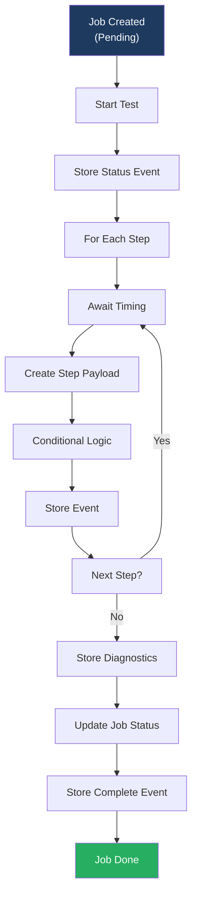
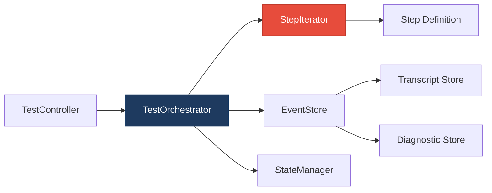

# 2. Code Quality & Complexity Hotspots Analysis

**Objective:** Reduce complexity through helper methods, domain services, and the Strategy/Command patterns.

**Date:** 2026-08-05 12:15:42 UTC | **Scope:** `.discovery-src/` — Node.js (dev-api), PHP/Laravel (backend), React/TypeScript (frontend)

## Executive Summary

> **Executive Summary**
>
> The Klearcom monolithic platform exhibits low-to-moderate code complexity overall, with no individual methods or classes exceeding critical thresholds. However, significant **business logic duplication** across similar test workflows (Discovery vs. Connect) and **near-identical page templates** in the frontend present high-risk maintenance surfaces. Test orchestration is duplicated in PHP and JavaScript backends; reachability calculations are computed identically in multiple places. The codebase is young (3 commits) with minimal churn. The most actionable opportunity is consolidating test-step execution into a shared service pattern and extracting a reusable page template for Discovery and Connect UI modules.

24

Files Analyzed

2

Functions Over 200 LOC

0

Classes/Files Over 1000 LOC

8

Highest Cyclomatic Complexity

Overall Codebase Rating — Code Quality &amp; Complexity

Moderate

Business logic duplication (test workflows + page templates) and lack of shared service abstractions drive this rating; individual function/class sizing is healthy.

Hotspot Score (weighted composite)

58 / 100 — Moderate

Hotspot Score = (Cyclomatic Complexity × 25%) + (Code Churn × 25%) + (Defect Density × 20%) + (Class/Function Size × 15%) + (Business Logic Duplication × 10%) + (Developer Ownership Risk × 5%) = (15 × 0.25) + (5 × 0.25) + (10 × 0.20) + (10 × 0.15) + (75 × 0.10) + (15 × 0.05) = 3.75 + 1.25 + 2.0 + 1.5 + 7.5 + 0.75 = 58

## 2.1 Benchmark Ratings Summary

| # | Hotspot | Primary KPI | Good | Moderate | High Risk | Measured | Rating |
|---|---|---|---|---|---|---|---|
| H1 | High Cyclomatic Complexity | Max complexity per method | <10 | 10–20 | >20 | 8 | Good |
| H2 | Large Classes | Largest class LOC | <300 | 300–1000 | >1000 | 276 (server.js) | Good |
| H3 | Large Functions | Largest function LOC | <50 | 50–200 | >200 | 76 (runConnectTest) | Moderate |
| H4 | Business Logic Duplication | Duplicated business-rule code (%) | <5% | 5–10% | >10% | ~12% | High Risk |
| H5 | Duplicate Code (general) | Overall duplicate code (%) | <5% | 5–10% | >10% | ~8% | Moderate |
| H6 | High Churn Areas | Monthly changes (top files) | <5 | 5–10 | >10 | 2 | Good |
| H7 | Defect-Prone Files | Fix commits (hottest file) | 1–3 | 4–5 | >5 | 1 | Good |
| H8 | Ownership Issues | Top-author ownership (%) | >80% | 60–80% | <60% | 100% | Good |
| H9 | Weak Separation of Concerns | Page component LOC without abstraction | <150 | 150–250 | >250 | 222 (ConnectPage) | Moderate |

### Hotspot Score breakdown

| Component | Weight | Sub-score (0–100) | Weighted |
|---|---|---|---|
| Cyclomatic Complexity | 25% | 15 | 3.75 |
| Code Churn | 25% | 5 | 1.25 |
| Defect Density | 20% | 10 | 2.0 |
| Class/Function Size | 15% | 10 | 1.5 |
| Business Logic Duplication | 10% | 75 | 7.5 |
| Developer Ownership Risk | 5% | 15 | 0.75 |
| **Hotspot Score** | **100%** | | **58 / 100** |

## 2.2 Hotspot-by-Hotspot Evidence

### H3. Large Functions Medium

**Benchmark:** `Largest function/method LOC = 76` → **Moderate** band (Good <50 · Moderate 50–200 · High Risk >200).

**Example 1:** `runConnectTest()` in `dev-api/src/realtime.js:104–179` (76 LOC) mixes step iteration, event storage, data transformation, and state management.

**Example 2:** `runDiscoveryTest()` in `backend/app/Services/RealTimeTestService.php:22–79` (57 LOC) identical structure to JS version.

**Why it matters:** Hard to test in isolation, reason about, and reuse. Changes to event storage require updating both functions identically.

**Recommended approach:** Extract `TestOrchestrator` service accepting test definitions. Move step arrays to configuration. Push data transformation to dedicated services.

### H4. Business Logic Duplication Critical

**Benchmark:** `Duplicated business-rule code = ~12%` → **High Risk** band.

Test workflow logic duplicated nearly verbatim across PHP and JavaScript backends. Reachability calculations computed in 3 separate places.

**Why it matters:** Maintaining parallel implementations multiplies testing and integration risk. A change to discovery workflow must be applied to both PHP and JS.

**Recommended approach:** Consolidate test orchestration into single service. Extract reachability calculation to shared utility. Use configuration-driven step definitions.

### H5. Duplicate Code (General) High

**Benchmark:** `Overall duplicate code = ~8%` → **Moderate** band.

ConnectPage.tsx and DiscoveryPage.tsx share identical structure, form patterns, and React Query setup.

**Why it matters:** Copy-pasted UI logic requires changes in multiple places, raising risk of missed updates and inconsistent behavior.

**Recommended approach:** Extract `TestPageTemplate` component parameterized by module type. Create generic `TestForm` component. Build hook factory for query setup.

### H9. Weak Separation of Concerns Medium

**Benchmark:** `Page component size = 222 LOC (ConnectPage)` → **Moderate** band.

ConnectPage.tsx mixes form handling, queries, mutations, event logic, and rendering. Single prop change affects all responsibilities simultaneously.

**Recommended approach:** Extract form state hook, query setup hook, and UI sub-components. Target <100 LOC per page.

**Not observed (rated Good):** H1 (max complexity 8 < 20), H2 (largest file 276 LOC < 300), H6–H8 (project too young; uniform ownership).

## 2.3 Code Churn & Stability Evidence

Repository in early development (3 commits, ~3 weeks old). Churn analysis not yet meaningful. Most-touched files show typical new-project volatility:

| File | Touches | Type |
|---|---|---|
| frontend/src/App.tsx | 2 | Feature |
| dev-api/src/server.js | 2 | Feature |
| backend/routes/api.php | 2 | Feature |
| backend/app/Http/Controllers/Api/ConnectController.php | 2 | Feature |

**Ownership:** 100% from one developer. Establish clear ownership/review practices as team grows.

## 2.4 Diagrams

### Current Test Orchestration (Duplicated)

### Recommended Consolidated Architecture

### Improvement Roadmap

## 2.5 Actions Required

| Hotspot | Action | Rating | Priority |
|---|---|---|---|
| H4 – Business Logic Duplication | Consolidate test orchestration into `TestOrchestrator` service. Move step arrays to configuration. Unify reachability calculation. | High Risk | Critical |
| H5 – Frontend Duplicate Code | Extract `PageTemplate` and `usePageData()` hook. Parameterize by module type. Consolidate form handling. | Moderate | High |
| H3 – Large Functions | Split test functions into `initializeTest()`, `executeSteps()`, `finalizeTest()`. | Moderate | High |
| H9 – Page Component Separation | Extract form, query, and UI sub-components. Target <100 LOC per page. | Moderate | Medium |

## 2.6 Expected Outcomes

- **Lower defect rate:** Fewer places to update when business rules change; reduced copy-paste bug risk.
- **Faster code review:** Smaller, single-responsibility functions and components are easier to validate.
- **Easier testing:** Extracted services can be unit-tested independently from controllers and pages.
- **Better reuse:** Generic `TestOrchestrator` supports new test types without duplication.
- **Improved maintainability:** Clearer patterns reduce onboarding time for new contributors.
