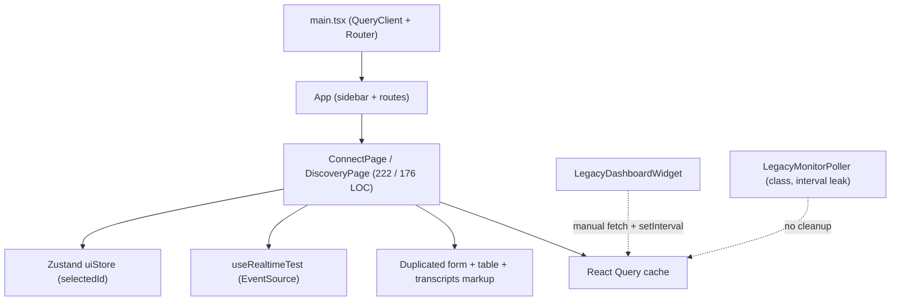
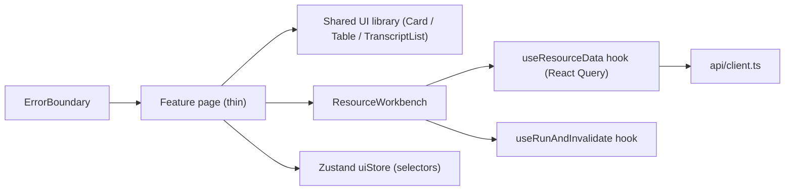
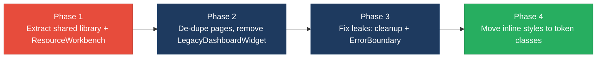

# 3. Frontend Modernization Hotspots Analysis

**Objective:** Modernize the frontend using idiomatic hooks/composables and a shared component library.

**Date:** 2026-07-23 | **Scope:** `frontend/` (repo `shende-shweta/FSDKC`, branch `main`) — React 19.2 + TypeScript 5.7 + Vite 6, with @tanstack/react-query 5, Zustand 5, react-router-dom 7

## Executive Summary

> **Executive Summary**
>
> The frontend is a small, modern React 19 + TypeScript + Vite SPA (14 source files under `frontend/src`) that already adopts function components, Hooks, React Query for server state, and a Zustand store for UI state — a healthy baseline. The dominant modernization gap is **duplication**: `ConnectPage` and `DiscoveryPage` are near-identical workbench pages (same form → live-feed → two-column list/detail → transcripts layout, and a verbatim "MongoDB Transcripts" block), while `LegacyDashboardWidget` re-implements `DashboardPage` with manual `fetch`+`setInterval` instead of React Query. Styling is another gap: presentation is driven by inline `style={{…}}` objects scattered across most pages rather than CSS-module or design-token classes, so visual changes must be hand-applied N times. Two deliberately-seeded reliability anti-patterns remain — a class component (`LegacyMonitorPoller.jsx`) with a `setInterval` and no `componentWillUnmount` cleanup, and `LegacyDashboardWidget` that `throw`s in render with no Error Boundary above it. Component size and prop-drilling are healthy (largest component 222 LOC, max drill depth 2), so the work is consolidation and hygiene, not a rewrite.

<div class="metric-grid">
<div class="metric-card"><div class="metric-number">14</div><div class="metric-label">Components/Files Scanned</div></div>
<div class="metric-card"><div class="metric-number">1</div><div class="metric-label">Legacy Class-Based Components</div></div>
<div class="metric-card"><div class="metric-number">0</div><div class="metric-label">Components Over 500 LOC</div></div>
<div class="metric-card"><div class="metric-number">1</div><div class="metric-label">Global/Shared State Modules</div></div>
</div>

<div class="overall-rating overall-rating--high-risk"><div class="overall-rating-label">Overall Codebase Rating — Frontend Modernization</div><div class="overall-rating-value">High Risk</div><div class="overall-rating-note">Driven by H1 (near-duplicate ConnectPage/DiscoveryPage + LegacyDashboardWidget) and H6 (pervasive inline styles, no shared design-token/CSS-module layer); H2, H3 and H7 are Moderate.</div></div>

## 3.1 Benchmark Ratings Summary

One row per hotspot. "Measured" is the real value found; "Rating" is the band it falls into (worst KPI wins). Percentages use the 9 top-level component modules under `frontend/src` as the denominator. This table is the source for the Overall Codebase Rating banner above.

| # | Hotspot | Primary KPI | <span class="rating rating-good">Good</span> | <span class="rating rating-moderate">Moderate</span> | <span class="rating rating-high-risk">High Risk</span> | Measured | Rating |
|---|---|---|---|---|---|---|---|
| H1 | UI Component Duplication | Duplicate components % | <5% | 5–10% | >10% | ~33% (3/9: ConnectPage, DiscoveryPage, LegacyDashboardWidget) | <span class="rating rating-high-risk">High Risk</span> |
| H2 | Legacy Class-Based Components | Modern component adoption % | >90% | 70–90% | <70% | 88.9% (1 class of 9) | <span class="rating rating-moderate">Moderate</span> |
| H3 | Massive Components | Largest component LOC | <200 | 200–500 | >500 | 222 LOC (`ConnectPage.tsx`) | <span class="rating rating-moderate">Moderate</span> |
| H4 | Global State Dependencies | Components reading global state % | <30% | 30–60% | >60% | ~22% (2/9 read Zustand `uiStore`) | <span class="rating rating-good">Good</span> |
| H5 | Complex State Management | Max prop-drilling depth | <3 | 3–5 | >5 | 2 levels | <span class="rating rating-good">Good</span> |
| H6 | Inline Styles / No Design Tokens *(additional)* | Components using inline `style={{}}` % (target <10%) | <10% | 10–30% | >30% | ~56% (5/9) | <span class="rating rating-high-risk">High Risk</span> |
| H7 | Missing Effect Cleanup / No Error Boundary *(additional)* | Uncleaned side-effect + uncaught-render sites (target 0) | 0 | 1–2 | >2 | 2 (interval leak + render `throw`) | <span class="rating rating-moderate">Moderate</span> |

**Additional-hotspot KPIs:** H6 — share of components that carry inline `style={{}}` objects instead of token/CSS-module classes; >30% signals no reusable style layer. H7 — count of side effects without cleanup or render-time throws without an Error Boundary; any such site is a latent leak/crash, so >2 is High Risk, 1–2 Moderate.

Beyond H6–H7, no further frontend-modernization anti-patterns with hard evidence were observed (bundle sizes are small, no direct DOM manipulation, no obvious unmemoized hot paths).

## 3.2 Hotspot-by-Hotspot Evidence

### H1. UI Component Duplication <span class="sev sev-critical">Critical</span>

**Benchmark:** `Duplicate components % = ~33% (3/9)` → falls in the **High Risk** band (Good <5% · Moderate 5–10% · High Risk >10%).

`ConnectPage.tsx` and `DiscoveryPage.tsx` are structurally the same page: a create form, a `<LiveTestFeed>` section, a two-column grid (list table + detail panel), and a trailing "MongoDB Transcripts" card — wired with the same React Query + `useRealtimeTest` + `useUiStore` triplet. The `handleRunCheck`/`handleStart` handlers are line-for-line equivalent:

```tsx
// frontend/src/pages/DiscoveryPage.tsx:52-58
const handleStart = async (jobId: number) => {
  setSelectedId(jobId);
  await startDiscovery(jobId);
  queryClient.invalidateQueries({ queryKey: ['discovery'] });
  queryClient.invalidateQueries({ queryKey: ['mongodb'] });
  queryClient.invalidateQueries({ queryKey: ['dashboard'] });
};
```

```tsx
// frontend/src/pages/ConnectPage.tsx:56-62
const handleRunCheck = async (monitorId: number) => {
  setSelectedId(monitorId);
  await startConnectCheck(monitorId);
  queryClient.invalidateQueries({ queryKey: ['connect'] });
  queryClient.invalidateQueries({ queryKey: ['mongodb'] });
  queryClient.invalidateQueries({ queryKey: ['dashboard'] });
};
```

The transcripts card is duplicated almost verbatim in both pages, and `LegacyDashboardWidget.tsx` independently re-renders the same KPI + job-list + monitor-list surface that `DashboardPage.tsx` already owns (its own header comment flags this: *"Duplicate query/invalidate patterns also exist in DiscoveryPage and ConnectPage"*).

**Why it matters here:** Every change to the workbench layout, transcript rendering, or the "invalidate three query keys after a run" contract must be made in at least two places, and they will drift — one page already refetches transcripts at 1500ms while the shared feed logic is copy-pasted. `LegacyDashboardWidget` diverging from `DashboardPage` means two different notions of "the dashboard" can coexist.

**Recommended approach:**
1. Extract a `ResourceWorkbench` component parameterised by module (`'discovery' | 'connect'`) that composes the form, `LiveTestFeed`, list table, and detail panel.
2. Extract `TranscriptList` and a `useRunAndInvalidate(module)` hook so the triple-invalidate contract lives once.
3. Delete `LegacyDashboardWidget` (or fold its unique bits into `DashboardPage`) and route all dashboard reads through React Query.

<!-- affected-files
search: queryClient\.invalidateQueries|transcript-list|MongoDB Transcripts
glob: frontend/src/pages/*.tsx
issue: Duplicated page scaffold, transcript-rendering block, and run/invalidate handler across pages
action: Extract shared ResourceWorkbench + TranscriptList components and a useRunAndInvalidate hook
-->

### H2. Legacy Class-Based Components <span class="sev sev-high">High</span>

**Benchmark:** `Modern component adoption % = 88.9% (1 class of 9 top-level components)` → falls in the **Moderate** band (Good >90% · Moderate 70–90% · High Risk <70%).

One class component remains, and it is also mis-extensioned (`.jsx` file containing TypeScript `interface` declarations, which would not compile as plain JSX):

```tsx
// frontend/src/components/LegacyMonitorPoller.jsx:22-40
export default class LegacyMonitorPoller extends Component<Props, State> {
  intervalId: ReturnType<typeof setInterval> | null = null;
  state: State = { reachability: null, error: null };

  componentDidMount() {
    this.intervalId = setInterval(() => {
      api.get<{ computed?: { reachability_pct: number } }>(`/connect/monitors/${this.props.monitorId}/checks`)
        .then((res) => { /* setState */ })
        .catch((err: Error) => this.setState({ error: err.message }));
    }, 3000);
    // Intentionally no componentWillUnmount — EventSource/interval leak for audit finding
  }
```

**Why it matters here:** The rest of the codebase is function-components-with-Hooks, so this class is the odd one out: its polling logic cannot be shared with `useRealtimeTest`, and the `.jsx` extension carrying TS syntax is a latent build break if the file is ever included in `tsc`/Vite's JSX-only path. It also carries the H7 leak (see below).

**Recommended approach:**
1. Rewrite as a function component `LegacyMonitorPoller.tsx` using `useQuery`/`useEffect` with a cleanup return, or reuse `useRealtimeTest`'s streaming instead of 3s polling.
2. Rename the file to `.tsx` and delete the class scaffolding.

<!-- affected-files
search: extends Component|componentDidMount
glob: frontend/src/**/*.{jsx,tsx}
issue: Legacy React class component (also .jsx file holding TypeScript syntax)
action: Convert to a function component with Hooks and correct .tsx extension
-->

### H3. Massive Components <span class="sev sev-medium">Medium</span>

**Benchmark:** `Largest component LOC = 222 (ConnectPage.tsx)` → falls in the **Moderate** band (Good <200 · Moderate 200–500 · High Risk >500).

No component exceeds 500 LOC, but the two workbench pages mix markup, form state, four React Query hooks, event-stream wiring, and business handlers in one file:

```tsx
// frontend/src/pages/ConnectPage.tsx:1-20 (222 LOC total)
export default function ConnectPage() {
  const queryClient = useQueryClient();
  const selectedId = useUiStore((s) => s.selectedMonitorId);
  const setSelectedId = useUiStore((s) => s.setSelectedMonitorId);
  const { events, isRunning, progress, startConnectCheck } = useRealtimeTest('connect');
  const [form, setForm] = useState({ name: '', toll_free_number: '', country_code: 'US', carrier: '' });
  const monitorsQuery = useQuery({ /* … */ });
  const checksQuery = useQuery({ /* … */ });
  const transcriptsQuery = useQuery({ /* … */ });
  // …form JSX, list table, check-history table, transcripts card
```

`DiscoveryPage.tsx` (176 LOC) follows the same shape. Both bundle the create-form, the results table, and the transcripts panel into a single default export.

**Why it matters here:** These files concentrate the most churn (every feature tweak touches them), and because the pieces aren't extracted they can't be unit-tested or reused — which is exactly what fuels the H1 duplication.

**Recommended approach:**
1. Split each page into `<CreateForm>`, `<ResourceTable>`, and `<TranscriptList>` feature components.
2. Move the three React Query definitions into a `useConnectData(selectedId, isRunning)` / `useDiscoveryData(...)` hook so the page body is presentational.

<!-- affected-files
glob: frontend/src/pages/*.tsx
issue: Page component mixes form state, multiple queries, streaming wiring, and markup in one file
action: Split into feature components (CreateForm/ResourceTable/TranscriptList) + a per-page data hook
-->

### H4. Global State Dependencies <span class="sev sev-low">Low</span>

**Benchmark:** `Components reading global state % = ~22% (2/9)` → falls in the **Good** band (Good <30% · Moderate 30–60% · High Risk >60%).

The only module-level global mutable store is the Zustand `uiStore`, and it holds just two selected-ID values, read by exactly two pages via selector functions:

```ts
// frontend/src/store/uiStore.ts:9-14
export const useUiStore = create<UiState>((set) => ({
  selectedDiscoveryId: null,
  selectedMonitorId: null,
  setSelectedDiscoveryId: (id) => set({ selectedDiscoveryId: id }),
  setSelectedMonitorId: (id) => set({ selectedMonitorId: id }),
}));
```

**Why it matters here:** Global-state coupling is low and idiomatic — selectors avoid over-subscription and the store is tiny. The one watch-item is the cross-module React Query coupling (`invalidateQueries(['dashboard'])` fired from both feature pages), which is shared-cache coupling rather than shared mutable state; it is tracked under H1.

**Recommended approach:** No structural change required. If the store grows, split per-domain slices; keep using selector reads.

### H5. Complex State Management <span class="sev sev-low">Low</span>

**Benchmark:** `Max prop-drilling depth = 2 levels` → falls in the **Good** band (Good <3 · Moderate 3–5 · High Risk >5).

Props are passed at most two levels deep (`Page → LiveTestFeed`, `Page → IvrTree → TreeNode`, `DashboardPage → KpiCard`). Server state lives in React Query and UI state in Zustand, so there are no long prop chains or scattered `useEffect` sync chains for shared data.

```tsx
// frontend/src/components/IvrTree.tsx:7-13 — one-level pass, recursion is data-shaped not drilled
export default function IvrTree({ nodes }: Props) {
  return <div className="tree-view">{nodes.map((node) => <TreeNode key={node.id} node={node} />)}</div>;
}
```

**Why it matters here:** Data flow is easy to trace; the recursive `TreeNode` is legitimate tree rendering, not prop drilling. The genuine state-management smell is the *imperative* fetching in `LegacyDashboardWidget` (manual `Promise.all` + `setInterval` instead of React Query) — captured under H1/H7 rather than as a prop-drilling problem.

**Recommended approach:** No prop-drilling remediation needed; migrate the remaining imperative fetch (H7) to React Query for consistency.

### H6. Inline Styles / No Design-Token Layer <span class="sev sev-high">High</span> *(additional)*

**Benchmark:** `Components using inline style={{}} = ~56% (5/9)` → falls in the **High Risk** band (Good <10% · Moderate 10–30% · High Risk >30%).

Presentation is applied through inline object literals across `App`, `IvrTree`, `DashboardPage`, `DiscoveryPage`, and `ConnectPage`, referencing CSS variables directly rather than shared classes:

```tsx
// frontend/src/pages/DashboardPage.tsx:20-22
<h2 style={{ fontSize: '0.85rem', color: 'var(--muted)', marginBottom: '0.75rem', textTransform: 'uppercase', letterSpacing: '0.05em' }}>
  Availability KPIs
</h2>
```

```tsx
// frontend/src/pages/ConnectPage.tsx (repeated grid/spacing literals)
<div style={{ display: 'grid', gridTemplateColumns: '1fr 1fr', gap: '1.5rem' }}>
// …and <div style={{ fontSize: '0.8rem', color: 'var(--muted)' }}> repeated per row
```

The same "0.85rem uppercase muted heading" and "two-column 1.5rem grid" appear as hand-copied literals in multiple files even though `index.css` already defines design tokens (`--muted`, `--danger`, `--surface-2`).

**Why it matters here:** Because the spacing/typography values are inlined, there is no single place to adjust the design system — a token change in `index.css` won't reach these hard-coded literals, and each new card/row copies the values again (feeding H1). Inline objects also allocate a new object every render.

**Recommended approach:**
1. Promote the repeated inline literals to semantic classes (`.section-heading`, `.two-col-grid`, `.row-subtext`) in `index.css` or a CSS module.
2. Establish a shared component library (`Card`, `KpiCard`, `Badge`, `SectionHeading`) so pages consume classes/props, not style objects.

<!-- affected-files
search: style=\{\{
glob: frontend/src/**/*.tsx
issue: Inline style objects duplicating design-token values instead of shared classes/components
action: Replace with CSS-module/token classes and a shared UI component library
-->

### H7. Missing Effect Cleanup / No Error Boundary <span class="sev sev-high">High</span> *(additional)*

**Benchmark:** `Uncleaned side-effect + uncaught-render sites = 2` → falls in the **Moderate** band (Good 0 · Moderate 1–2 · High Risk >2).

Two reliability anti-patterns are present. First, `LegacyMonitorPoller` starts a 3s `setInterval` and deliberately omits `componentWillUnmount`, so the timer (and its API calls) leak after unmount:

```tsx
// frontend/src/components/LegacyMonitorPoller.jsx:25-37
componentDidMount() {
  this.intervalId = setInterval(() => { /* api.get(...).then(...) */ }, 3000);
  // Intentionally no componentWillUnmount — EventSource/interval leak for audit finding
}
```

Second, `LegacyDashboardWidget` throws during render on error with no Error Boundary above it (`main.tsx` wraps only `QueryClientProvider`/`BrowserRouter`), so a failed fetch unmounts the whole app:

```tsx
// frontend/src/pages/LegacyDashboardWidget.tsx:49
if (error) throw new Error(error); // Uncaught — no Error Boundary wraps this component
```

**Why it matters here:** The interval leak accumulates background polling on every mount/unmount cycle (navigating between pages), inflating API load and memory; the uncaught render-throw turns a transient API hiccup into a full white-screen crash because nothing catches it.

**Recommended approach:**
1. Convert the poller to a Hook with a cleanup return (`useEffect(() => { const id = setInterval(...); return () => clearInterval(id); }, [...])`), or reuse `useRealtimeTest`.
2. Add a top-level `<ErrorBoundary>` in `main.tsx`/`App.tsx` and render an inline error state instead of `throw` in `LegacyDashboardWidget`.

<!-- affected-files
search: setInterval|throw new Error
glob: frontend/src/**/*.{jsx,tsx}
issue: Side effect without cleanup (timer leak) and render-time throw with no Error Boundary
action: Add useEffect cleanup / clearInterval and wrap the app in an ErrorBoundary
-->

## 3.3 State Management & Dependency Evidence

Covered inline as **H4 (Global State Dependencies)** and **H5 (Complex State Management)** above. Summary: server state is centralised in React Query with sensible `staleTime`/`refetchInterval`, UI state is a minimal Zustand store read via selectors, and prop depth never exceeds 2. The only state-layer debt is the imperative `Promise.all` + `setInterval` fetching in `LegacyDashboardWidget` (a React Query bypass) — folded into H1/H7 remediation.

## 3.4 Diagrams

### Current UI data flow


### Target component + state layout


### Improvement roadmap


## 3.5 Actions Required

| Hotspot | Action | Rating | Priority |
|---|---|---|---|
| H1 UI Component Duplication | Extract `ResourceWorkbench` + `TranscriptList` + `useRunAndInvalidate`; delete/fold `LegacyDashboardWidget` | <span class="rating rating-high-risk">High Risk</span> | <span class="sev sev-critical">Critical</span> |
| H6 Inline Styles / No Design Tokens | Promote repeated inline literals to token classes; introduce shared `Card`/`KpiCard`/`Badge` components | <span class="rating rating-high-risk">High Risk</span> | <span class="sev sev-high">High</span> |
| H2 Legacy Class Component | Convert `LegacyMonitorPoller.jsx` to a `.tsx` function component with Hooks | <span class="rating rating-moderate">Moderate</span> | <span class="sev sev-high">High</span> |
| H7 Missing Cleanup / No Error Boundary | Add `clearInterval` cleanup and a top-level `ErrorBoundary`; replace render `throw` with an error state | <span class="rating rating-moderate">Moderate</span> | <span class="sev sev-high">High</span> |
| H3 Massive Components | Split `ConnectPage`/`DiscoveryPage` into feature components + data hooks | <span class="rating rating-moderate">Moderate</span> | <span class="sev sev-medium">Medium</span> |

## 3.6 Expected Outcomes

- A shared component library (`Card`, `KpiCard`, `Badge`, `TranscriptList`, `ResourceTable`) plus a `ResourceWorkbench` cuts the ~33% page duplication to near-zero, so layout/behavior fixes are made once.
- Moving inline `style={{}}` literals to design-token classes gives a single source of truth for spacing/typography and removes per-render style-object allocation.
- Converting `LegacyMonitorPoller` to a Hook-based function component and reusing `useRealtimeTest` restores 100% modern-component adoption and shareable polling logic.
- Adding `clearInterval` cleanup and a top-level `ErrorBoundary` eliminates the timer leak and turns render-time failures into a contained inline error instead of a full-app crash.
- Splitting the two workbench pages into presentational components + data hooks makes the highest-churn files testable and keeps every component comfortably under the 200-LOC target.
