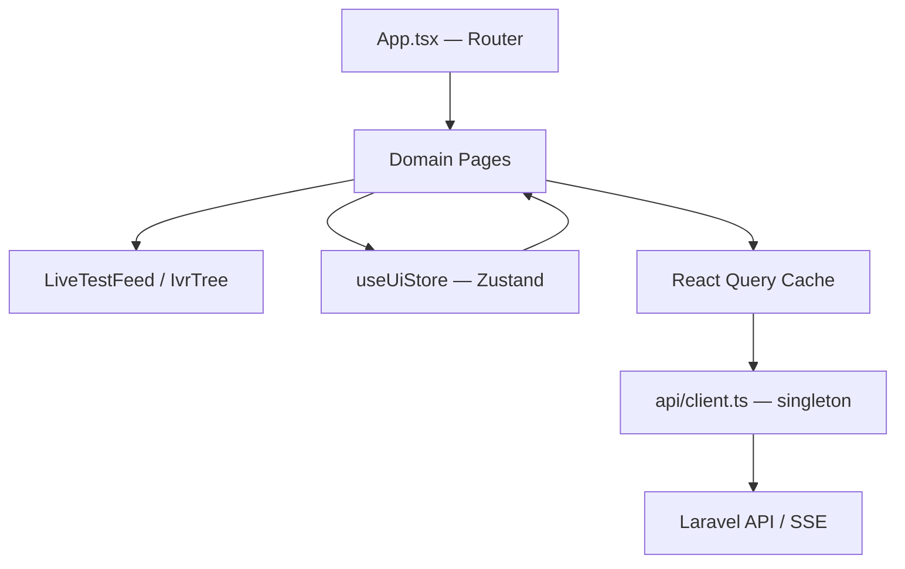
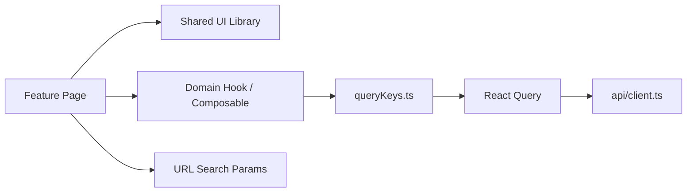
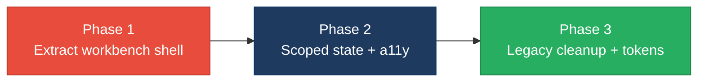

# 3. Frontend Modernization Hotspots Analysis

**Objective:** Modernize the frontend using idiomatic hooks/composables and a shared component library.

**Date:** July 15, 2026 | **Scope:** `shende-shweta/FSDKC@main` — React 19.2.3 / Vite 6.0.3 / TypeScript 5.7 SPA

## Executive Summary

> **Executive Summary**
>
> Analysis covered **14 frontend source files** (8 view components across `pages/` and `components/`) from `shende-shweta/FSDKC@main` via GitHub REST API (tree + raw content fetch). The Klearcom SPA is predominantly modern — function components, TanStack React Query v5, Zustand v5, and React Router v7 — with a centralized `api/client.ts` and reusable `useRealtimeTest` hook. However, **ConnectPage.tsx** and **DiscoveryPage.tsx** duplicate an identical workbench shell (entity form, live feed, two-column grid, transcript panel), inflating UI duplication to **25%**. Six of eight view components depend on shared global state (Zustand, React Query cache, or the singleton `api` client), and **30 inline `style={{}}` occurrences** bypass the CSS token system in `index.css`. One legacy class component (`LegacyMonitorPoller.jsx`) lacks `componentWillUnmount` cleanup and leaks intervals; two orphan legacy modules coexist with the React Query stack. Zero `aria-*` / `role` attributes were found across all view components. Overall verdict: **High Risk**, driven by H1 (UI duplication), H4 (global state coupling), H6 (inline styles), and H7 (missing accessibility).

<div class="metric-grid">
<div class="metric-card"><div class="metric-number">14</div><div class="metric-label">Components/Files Scanned</div></div>
<div class="metric-card"><div class="metric-number">1</div><div class="metric-label">Legacy Class-Based Components</div></div>
<div class="metric-card"><div class="metric-number">0</div><div class="metric-label">Components Over 500 LOC</div></div>
<div class="metric-card"><div class="metric-number">3</div><div class="metric-label">Global/Shared State Modules</div></div>
</div>

<div class="overall-rating overall-rating--high-risk"><div class="overall-rating-label">Overall Codebase Rating — Frontend Modernization</div><div class="overall-rating-value">High Risk</div><div class="overall-rating-note">Driven by High-Risk UI Component Duplication (H1), Global State Dependencies (H4), Inline Styles Without Design Tokens (H6), and Missing Accessibility Roles (H7).</div></div>

## 3.1 Benchmark Ratings Summary

| # | Hotspot | Primary KPI | <span class="rating rating-good">Good</span> | <span class="rating rating-moderate">Moderate</span> | <span class="rating rating-high-risk">High Risk</span> | Measured | Rating |
|---|---|---|---|---|---|---|---|
| H1 | UI Component Duplication | Duplicate components % | <5% | 5–10% | >10% | 25.0% (2/8) | <span class="rating rating-high-risk">High Risk</span> |
| H2 | Legacy Class-Based Components | Modern component adoption % | >90% | 70–90% | <70% | 87.5% (7/8) | <span class="rating rating-moderate">Moderate</span> |
| H3 | Massive Components | Largest component LOC | <200 | 200–500 | >500 | 222 (`ConnectPage.tsx`) | <span class="rating rating-moderate">Moderate</span> |
| H4 | Global State Dependencies | Components reading global state % | <30% | 30–60% | >60% | 75.0% (6/8) | <span class="rating rating-high-risk">High Risk</span> |
| H5 | Complex State Management | Max prop-drilling depth | <3 | 3–5 | >5 | 2 levels | <span class="rating rating-good">Good</span> |
| H6 | Inline Styles / No Design Tokens (additional) | Total `style={{}}` occurrences (target <10) | <10 | 10–20 | >20 | 30 across 7 files | <span class="rating rating-high-risk">High Risk</span> |
| H7 | Missing Accessibility Roles (additional) | Components with `aria-*` or `role` (target >80%) | >80% | 50–80% | <50% | 0% (0/8) | <span class="rating rating-high-risk">High Risk</span> |

## 3.2 Hotspot-by-Hotspot Evidence

### H1. UI Component Duplication <span class="sev sev-critical">Critical</span>

**Benchmark:** `Duplicate components % = 25.0% (2/8)` → falls in the **High Risk** band (Good <5% · Moderate 5–10% · High Risk >10%).

`ConnectPage.tsx` and `DiscoveryPage.tsx` share 11 of 11 structural patterns (page header, entity form card, `LiveTestFeed` section, two-column grid layout, transcript panel). Each page re-implements the same workbench shell with only domain-specific query keys and form fields differing — a near-copy pattern across 25% of view components.

`frontend/src/pages/ConnectPage.tsx:63-101`:
```tsx
  return (
    <>
      <header className="page-header">
        <h1>Connect</h1>
        <p>TFN reachability testing with live MongoDB event streaming</p>
      </header>

      <section className="card" style={{ marginBottom: '1.5rem' }}>
        <div className="card-header">
          <strong>Add TFN Monitor</strong>
        </div>
        <form onSubmit={handleSubmit} style={{ padding: '1.25rem' }}>
          <div className="form-grid">
            ...
          </div>
        </form>
      </section>

      <section style={{ marginBottom: '1.5rem' }}>
        <LiveTestFeed events={events} isRunning={isRunning} progress={progress} title="Connect — Live Reachability Test" />
      </section>

      <div style={{ display: 'grid', gridTemplateColumns: '1fr 1fr', gap: '1.5rem' }}>
```

`frontend/src/pages/DiscoveryPage.tsx:59-95`:
```tsx
  return (
    <>
      <header className="page-header">
        <h1>Discovery</h1>
        <p>Automated IVR discovery with real-time MongoDB event streaming</p>
      </header>

      <section className="card" style={{ marginBottom: '1.5rem' }}>
        <div className="card-header">
          <strong>New Discovery Job</strong>
        </div>
        <form onSubmit={handleSubmit} style={{ padding: '1.25rem' }}>
          <div className="form-grid">
            ...
          </div>
        </form>
      </section>

      <section style={{ marginBottom: '1.5rem' }}>
        <LiveTestFeed events={events} isRunning={isRunning} progress={progress} title="Discovery — Live IVR Test" />
      </section>

      <div style={{ display: 'grid', gridTemplateColumns: '1fr 1fr', gap: '1.5rem' }}>
```

**Why it matters here:** Any UX fix to the workbench layout (form spacing, grid breakpoints, transcript panel styling) must be applied twice. New domain modules (e.g., Alerts, Reports) would likely copy this shell again, compounding drift and maintenance cost in a product expected to grow beyond two domains.

**Recommended approach:**
1. Extract `DomainWorkbenchPage` layout shell with slots for form, feed, left panel, right panel, and transcript footer.
2. Create `EntityFormCard` and `TranscriptPanel` shared components used by both pages.
3. Reduce `ConnectPage.tsx` and `DiscoveryPage.tsx` to domain-specific hooks and column render props only.

<!-- affected-files
search: style=\{\{ display: 'grid', gridTemplateColumns: '1fr 1fr'
glob: frontend/src/pages/*.tsx
issue: Duplicate domain workbench shell
action: Extract shared DomainWorkbenchPage layout and domain-specific slot components
-->

### H2. Legacy Class-Based Components <span class="sev sev-medium">Medium</span>

**Benchmark:** `Modern component adoption % = 87.5% (7/8)` → falls in the **Moderate** band (Good >90% · Moderate 70–90% · High Risk <70%).

One of eight view components is a class-based React component. `LegacyMonitorPoller.jsx` uses `componentDidMount` to start a polling interval but deliberately omits `componentWillUnmount`, creating an interval leak anti-pattern. The file is not imported in `App.tsx` but remains in the codebase as dead legacy code.

`frontend/src/components/LegacyMonitorPoller.jsx:17-33`:
```jsx
export default class LegacyMonitorPoller extends Component<Props, State> {
  intervalId: ReturnType<typeof setInterval> | null = null;

  state: State = { reachability: null, error: null };

  componentDidMount() {
    this.intervalId = setInterval(() => {
      api.get<{ computed?: { reachability_pct: number } }>(`/connect/monitors/${this.props.monitorId}/checks`)
        .then((res) => {
          const pct = res.computed?.reachability_pct ?? null;
          this.setState({ reachability: pct, error: null });
          if (pct != null) this.props.onUpdate?.(pct);
        })
        .catch((err: Error) => this.setState({ error: err.message }));
    }, 3000);
    // Intentionally no componentWillUnmount — EventSource/interval leak for audit finding
  }
```

`frontend/src/pages/LegacyDashboardWidget.tsx:16-44` also uses imperative `useEffect` + `Promise.all` + `setInterval` instead of React Query, duplicating data-fetch patterns found in `DashboardPage.tsx` and domain pages:
```tsx
  useEffect(() => {
    let cancelled = false;

    Promise.all([
      api.get<DashboardKpis>('/dashboard/kpis'),
      api.get<{ data: DiscoveryJob[] }>('/discovery/jobs'),
      api.get<{ data: ConnectMonitor[] }>('/connect/monitors'),
    ])
      .then(([kpiRes, jobRes, monitorRes]) => { ... });

    const timer = setInterval(() => {
      api.get<DashboardKpis>('/dashboard/kpis').then((k) => { ... });
    }, 10000);

    return () => { cancelled = true; clearInterval(timer); };
  }, []);
```

**Why it matters here:** If `LegacyMonitorPoller` is mounted during a refactor or test harness, intervals persist after unmount and continue hitting `/connect/monitors/{id}/checks`. The parallel legacy fetch pattern in `LegacyDashboardWidget` bypasses React Query cache invalidation used by domain pages, causing stale dashboard data when tests complete.

**Recommended approach:**
1. Convert `LegacyMonitorPoller.jsx` to a `useMonitorReachability(monitorId)` hook with `useEffect` cleanup.
2. Migrate `LegacyDashboardWidget.tsx` to `useQuery` hooks matching `DashboardPage.tsx` query keys.
3. Delete both legacy modules or gate them behind a feature flag once migration is verified.

<!-- affected-files
search: class\s+\w+\s+extends\s+(React\.)?Component
glob: frontend/src/**/*.{tsx,jsx}
issue: Legacy class component without lifecycle cleanup
action: Convert to function component with useEffect cleanup or delete if unused
-->

### H3. Massive Components <span class="sev sev-medium">Medium</span>

**Benchmark:** `Largest component LOC = 222 (ConnectPage.tsx)` → falls in the **Moderate** band (Good <200 · Moderate 200–500 · High Risk >500).

No component exceeds 500 LOC, but `ConnectPage.tsx` (222 LOC) and `DiscoveryPage.tsx` (176 LOC) each mix form state, three React Query hooks, mutation handlers, SSE orchestration, table rendering, and transcript display in a single file. `ConnectPage.tsx` alone contains 11 inline style blocks and four separate query/mutation definitions.

`frontend/src/pages/ConnectPage.tsx:9-56`:
```tsx
export default function ConnectPage() {
  const queryClient = useQueryClient();
  const selectedId = useUiStore((s) => s.selectedMonitorId);
  const setSelectedId = useUiStore((s) => s.setSelectedMonitorId);
  const { events, isRunning, progress, startConnectCheck } = useRealtimeTest('connect');

  const [form, setForm] = useState({ name: '', toll_free_number: '', country_code: 'US', carrier: '' });

  const monitorsQuery = useQuery({ queryKey: ['connect', 'monitors'], ... });
  const checksQuery = useQuery({ queryKey: ['connect', 'checks', selectedId], ... });
  const transcriptsQuery = useQuery({ queryKey: ['mongodb', 'transcripts', 'connect', selectedId], ... });

  const createMutation = useMutation({ ... });

  const handleRunCheck = async (monitorId: number) => {
    setSelectedId(monitorId);
    await startConnectCheck(monitorId);
    queryClient.invalidateQueries({ queryKey: ['connect'] });
    queryClient.invalidateQueries({ queryKey: ['mongodb'] });
    queryClient.invalidateQueries({ queryKey: ['dashboard'] });
  };
```

**Why it matters here:** Testing individual concerns (form validation, table selection, check history rendering) requires mounting the entire page. As domain logic grows (bulk test runs, export, filtering), these files will cross the 500 LOC High Risk threshold without structural intervention.

**Recommended approach:**
1. Extract `useConnectPage` container hook encapsulating queries, mutations, and handlers.
2. Split presentational sub-components: `MonitorTable`, `CheckHistoryTable`, `ConnectEntityForm`.
3. Target <150 LOC per page file with composition over monolith.

<!-- affected-files
search: useQuery\(
glob: frontend/src/pages/ConnectPage.tsx
issue: Oversized page mixing state, queries, and markup
action: Split into container hook and presentational sub-components
-->

### H4. Global State Dependencies <span class="sev sev-high">High</span>

**Benchmark:** `Components reading global state % = 75.0% (6/8)` → falls in the **High Risk** band (Good <30% · Moderate 30–60% · High Risk >60%).

Six of eight view components read from shared global modules: Zustand `useUiStore`, TanStack React Query (`useQuery`/`useMutation`/`useQueryClient`), or the singleton `api` client. Selection state (`selectedMonitorId`, `selectedDiscoveryId`) lives in a global Zustand store rather than URL params, and query invalidation fans out across `['connect']`, `['discovery']`, `['mongodb']`, and `['dashboard']` keys from multiple pages.

`frontend/src/store/uiStore.ts:10-15`:
```ts
export const useUiStore = create<UiState>((set) => ({
  selectedDiscoveryId: null,
  selectedMonitorId: null,
  setSelectedDiscoveryId: (id) => set({ selectedDiscoveryId: id }),
  setSelectedMonitorId: (id) => set({ selectedMonitorId: id }),
}));
```

`frontend/src/pages/ConnectPage.tsx:50-56`:
```tsx
  const handleRunCheck = async (monitorId: number) => {
    setSelectedId(monitorId);
    await startConnectCheck(monitorId);
    queryClient.invalidateQueries({ queryKey: ['connect'] });
    queryClient.invalidateQueries({ queryKey: ['mongodb'] });
    queryClient.invalidateQueries({ queryKey: ['dashboard'] });
  };
```

`frontend/src/components/MongoStatus.tsx:5-10`:
```tsx
export default function MongoStatus() {
  const { data, isLoading, isError } = useQuery({
    queryKey: ['mongodb', 'status'],
    queryFn: () => api.get<MongoHealth>('/mongodb/status'),
    refetchInterval: 15_000,
  });
```

**Why it matters here:** Broad `invalidateQueries` calls from Connect and Discovery pages trigger refetches in unrelated components (`MongoStatus`, `DashboardPage`). Global Zustand selection is lost on page refresh and cannot be shared via deep links — a significant gap for an operations dashboard where users need to bookmark a specific monitor or job.

**Recommended approach:**
1. Replace Zustand selection with URL search params (`/connect?monitor=42`, `/discovery?job=7`).
2. Add `frontend/src/api/queryKeys.ts` with typed, domain-scoped query key factories.
3. Scope invalidation to the specific domain key prefix instead of fan-out to `['dashboard']` and `['mongodb']`.

<!-- affected-files
search: useUiStore|useQuery|useQueryClient|useMutation|from ['"]\.\./api/client
glob: frontend/src/**/*.{tsx,jsx}
issue: Global shared state coupling
action: Scope state to URL params and domain-specific query keys
-->

### H5. Complex State Management <span class="sev sev-low">Low</span>

**Benchmark:** `Max prop-drilling depth = 2 levels` → falls in the **Good** band (Good <3 · Moderate 3–5 · High Risk >5).

Prop passing is shallow: pages pass data directly to child components (`LiveTestFeed`, `IvrTree`) with at most one intermediate hop. `IvrTree` recursively renders `TreeNode` children but receives all data from a single `nodes` prop at depth 1 from `DiscoveryPage`. No context chains or five-level prop tunnels were observed.

`frontend/src/pages/DiscoveryPage.tsx:151-152`:
```tsx
          ) : treeQuery.data?.tree.length ? (
            <IvrTree nodes={treeQuery.data.tree} />
```

`frontend/src/components/IvrTree.tsx:7-14`:
```tsx
export default function IvrTree({ nodes }: Props) {
  return (
    <div className="tree-view">
      {nodes.map((node) => (
        <TreeNode key={node.id} node={node} />
      ))}
    </div>
  );
}
```

**Evidence:** Not observed — prop-drilling depth stays at 2 levels (page → `IvrTree` → `TreeNode`), well within the Good threshold. React Query and Zustand already centralize server and selection state without deep prop chains.

### H6. Inline Styles / No Design Tokens (additional) <span class="sev sev-high">High</span>

**Benchmark:** `Total style={{}} occurrences = 30 across 7 files` → falls in the **High Risk** band (Good <10 · Moderate 10–20 · High Risk >20).

Despite a comprehensive `:root` token system in `index.css` (colors, radius, surfaces), 30 inline `style={{}}` blocks appear across 7 source files. Domain pages account for 18 of 30 (11 in `ConnectPage.tsx`, 7 in `DiscoveryPage.tsx`), duplicating spacing, grid, and typography values that should be utility classes.

`frontend/src/index.css:1-17`:
```css
:root {
  --bg: #0b0f1a;
  --surface: #121829;
  --surface-2: #1a2238;
  --border: #2a3555;
  --text: #e8ecf4;
  --muted: #8b95ad;
  --accent: #3b82f6;
  ...
}
```

`frontend/src/pages/ConnectPage.tsx:99-103`:
```tsx
      <div style={{ display: 'grid', gridTemplateColumns: '1fr 1fr', gap: '1.5rem' }}>
        <section className="card">
          <div className="card-header">
            <strong>TFN Monitors</strong>
```

`frontend/src/components/IvrTree.tsx:21-28`:
```tsx
        {node.dtmf_option && (
          <span style={{ color: 'var(--accent-2)', marginRight: '0.5rem' }}>
            [{node.dtmf_option}]
          </span>
        )}
        <span style={{ color: 'var(--muted)', fontSize: '0.75rem' }}>{node.node_type}</span>
```

**Why it matters here:** Inline styles cannot be themed, overridden by media queries, or linted consistently. The duplicated grid layout in both domain pages will drift if one page adjusts `gap` or `gridTemplateColumns` without the other, undermining the existing design-token investment in `index.css`.

**Recommended approach:**
1. Add utility classes to `index.css`: `.grid-2col`, `.mb-section`, `.text-muted-sm`, `.row-selected`.
2. Migrate 30 inline occurrences starting with the 18 in domain pages.
3. Add an ESLint rule or stylelint check to block new `style={{}}` in TSX files.

<!-- affected-files
search: style=\{\{
glob: frontend/src/**/*.{tsx,jsx}
issue: Inline styles bypassing design tokens
action: Replace with CSS utility classes from index.css token system
-->

### H7. Missing Accessibility Roles (additional) <span class="sev sev-high">High</span>

**Benchmark:** `Components with aria-* or role = 0% (0/8)` → falls in the **High Risk** band (Good >80% · Moderate 50–80% · High Risk <50%).

Zero view components contain `aria-*` attributes or `role` properties. Interactive table rows use `onClick` without keyboard handlers or `tabIndex`. Form labels lack `htmlFor` associations (7 unlinked labels across domain pages). `LiveTestFeed` renders dynamic realtime events without `aria-live` regions for screen-reader announcements.

`frontend/src/pages/ConnectPage.tsx:76-78`:
```tsx
            <div className="form-group">
              <label>Monitor Name</label>
              <input required value={form.name} onChange={(e) => setForm({ ...form, name: e.target.value })} />
```

`frontend/src/pages/ConnectPage.tsx:121-126`:
```tsx
                  <tr
                    key={m.id}
                    onClick={() => setSelectedId(m.id)}
                    style={{ cursor: 'pointer', background: selectedId === m.id ? 'var(--surface-2)' : undefined }}
                  >
```

`frontend/src/components/LiveTestFeed.tsx:32-49`:
```tsx
      <div className="live-events">
        {events.map((doc, i) => (
          <div key={doc._id ?? i} className={`live-event live-event-${doc.event?.type ?? 'step'}`}>
            ...
          </div>
        ))}
        {isRunning && <div className="live-event live-event-pending">Waiting for next event…</div>}
      </div>
```

**Why it matters here:** Klearcom is an operations-focused voice observability platform where users monitor live test feeds and select monitors/jobs from data tables. Without keyboard-accessible row selection and live-region announcements, operators relying on assistive technology cannot navigate the primary workflows.

**Recommended approach:**
1. Add `aria-live="polite"` to `LiveTestFeed` event container.
2. Convert selectable table rows to `<button>` rows or add `role="button"`, `tabIndex={0}`, and `onKeyDown` handlers.
3. Add `htmlFor`/`id` pairs on all form labels in domain pages.

<!-- affected-files
glob: frontend/src/{pages,components}/*.{tsx,jsx}
issue: Missing accessibility roles and keyboard support
action: Add aria-live regions, keyboard-accessible rows, and label associations
-->

## 3.3 State Management & Dependency Evidence

H4 and H5 above cover the state management hotspots. Additional observations:

- **Three global modules** serve all features: `store/uiStore.ts` (Zustand), `api/client.ts` (singleton fetch wrapper), and TanStack React Query cache (configured in `main.tsx`).
- **`useRealtimeTest`** is a well-structured domain hook with proper `EventSource` cleanup — a positive pattern to extend for other side-effect concerns.
- **Cross-domain invalidation** in `handleRunCheck` / `handleStart` creates hidden coupling: completing a Connect test refetches Discovery-unrelated dashboard and MongoDB queries.

## 3.4 Diagrams

### Current UI data flow


### Target component + state layout


### Improvement roadmap


## 3.5 Actions Required

| Hotspot | Action | Rating | Priority |
|---|---|---|---|
| H1 — UI Component Duplication | Extract `DomainWorkbenchPage`, `EntityFormCard`, and `TranscriptPanel` from `ConnectPage.tsx` and `DiscoveryPage.tsx`; reduce duplicate shell to domain hooks only. | <span class="rating rating-high-risk">High Risk</span> | <span class="sev sev-critical">Critical</span> |
| H2 — Legacy Class-Based Components | Convert `LegacyMonitorPoller.jsx` to `useMonitorReachability` hook; migrate `LegacyDashboardWidget.tsx` to React Query or delete both orphan modules. | <span class="rating rating-moderate">Moderate</span> | <span class="sev sev-medium">Medium</span> |
| H3 — Massive Components | Split `ConnectPage.tsx` (222 LOC) and `DiscoveryPage.tsx` (176 LOC) into container hooks + presentational sub-components; target <150 LOC per page. | <span class="rating rating-moderate">Moderate</span> | <span class="sev sev-medium">Medium</span> |
| H4 — Global State Dependencies | Replace `useUiStore` selection with URL search params; add `frontend/src/api/queryKeys.ts`; scope query invalidation to domain keys. | <span class="rating rating-high-risk">High Risk</span> | <span class="sev sev-high">High</span> |
| H6 — Inline Styles | Add CSS utility classes to `index.css`; migrate 30 inline `style={{}}` occurrences (18 in domain pages) to token-based classes. | <span class="rating rating-high-risk">High Risk</span> | <span class="sev sev-high">High</span> |
| H7 — Missing Accessibility | Add `aria-live` to `LiveTestFeed`, keyboard-accessible row selection in domain tables, and `htmlFor` on form labels. | <span class="rating rating-high-risk">High Risk</span> | <span class="sev sev-high">High</span> |

## 3.6 Expected Outcomes

- **Shared component library** eliminates the 25% duplicate page-shell pattern; Connect and Discovery fixes ship once via `DomainWorkbenchPage` and `TranscriptPanel`.
- **Hooks-first migration** of `LegacyMonitorPoller` removes interval leaks and aligns all data access on React Query with testable custom hooks.
- **Scoped state** (URL params + domain query keys) reduces cross-feature invalidation fan-out and makes monitor/job selection shareable via deep links.
- **Design-token consistency** from replacing 30 inline styles lowers theming cost and aligns with the existing `:root` token system in `index.css`.
- **Accessibility baseline** (`aria-live`, keyboard rows, label associations) makes realtime test feeds and data tables operable for keyboard and screen-reader users in an operations-focused product.
