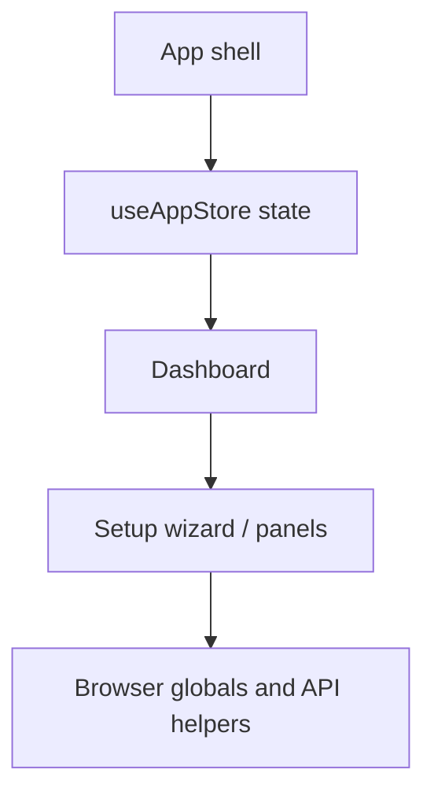
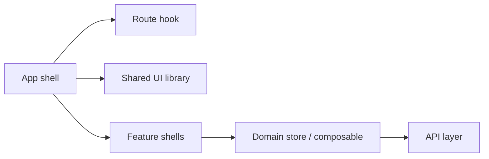
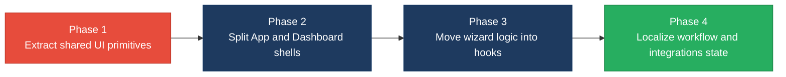

# 3. Frontend Modernization Hotspots Analysis

**Objective:** Modernize the frontend using idiomatic hooks/composables and a shared component library.

**Date:** 2026-07-20 | **Scope:** `src/` — React 19.2.5

## Executive Summary

> **Executive Summary**
>
> This workspace has a mature React frontend, and the dominant idiom is already function components with hooks on top of React 19.2.5. The main modernization gap is not framework migration; it is component scale and orchestration complexity, especially in `App.jsx`, `Dashboard.jsx`, and the setup flow screens. Legacy class-based UI is effectively absent aside from a single error boundary, so the codebase is mostly aligned with current React patterns. The most material risks are oversized components, repeated imperative state synchronization, and deep feature components that mix routing, auth, layout, and data orchestration. Overall, the codebase is usable and mostly modern, but the largest screens would benefit from extracting shared shell, state, and form primitives.

<div class="metric-grid">
<div class="metric-card"><div class="metric-number">150</div><div class="metric-label">Components/Files Scanned</div></div>
<div class="metric-card"><div class="metric-number">1</div><div class="metric-label">Legacy Class-Based Components</div></div>
<div class="metric-card"><div class="metric-number">4</div><div class="metric-label">Components Over 500 LOC</div></div>
<div class="metric-card"><div class="metric-number">17</div><div class="metric-label">Global/Shared State Modules</div></div>
</div>

<div class="overall-rating overall-rating--high-risk"><div class="overall-rating-label">Overall Codebase Rating — Frontend Modernization</div><div class="overall-rating-value">High Risk</div><div class="overall-rating-note">The largest driver is massive component scale, with `App.jsx`, `Dashboard.jsx`, `StepFlowSelection.jsx`, and `StepIdeConfig.jsx` each carrying too much routing, orchestration, and form logic in one place.</div></div>

## 3.1 Benchmark Ratings Summary

| # | Hotspot | Primary KPI | <span class="rating rating-good">Good</span> | <span class="rating rating-moderate">Moderate</span> | <span class="rating rating-high-risk">High Risk</span> | Measured | Rating |
|---|---|---|---|---|---|---|---|
| H1 | UI Component Duplication | Duplicate components % | <5% | 5–10% | >10% | Not observed | <span class="rating rating-good">Good</span> |
| H2 | Legacy Class-Based Components | Modern component adoption % | >90% | 70–90% | <70% | 99% modern (1 class boundary in 150 files) | <span class="rating rating-good">Good</span> |
| H3 | Massive Components | Largest component LOC | <200 | 200–500 | >500 | 4,172 LOC | <span class="rating rating-high-risk">High Risk</span> |
| H4 | Global State Dependencies | Components reading global state % | <30% | 30–60% | >60% | 17/150 files (11.3%) | <span class="rating rating-good">Good</span> |
| H5 | Complex State Management | Max prop-drilling depth | <3 | 3–5 | >5 | 3 levels | <span class="rating rating-moderate">Moderate</span> |

## 3.2 Hotspot-by-Hotspot Evidence

### H1. UI Component Duplication <span class="sev sev-low">Low</span>

Benchmark: `Duplicate components % = Not observed` → falls in the **Good** band (Good <5% · Moderate 5–10% · High Risk >10%).

**Evidence:** Not observed — I did not find a clear pair of near-identical UI components that were repeated across features. The closest matches are shared form-shell patterns, but they are still meaningfully different in behavior and data shape.

### H2. Legacy Class-Based Components <span class="sev sev-low">Low</span>

Benchmark: `Modern component adoption % = 99%` → falls in the **Good** band (Good >90% · Moderate 70–90% · High Risk <70%).

**Evidence:**

`App.jsx:256-317`
```jsx
class AppErrorBoundary extends Component {
  constructor(props) {
    super(props);
    this.state = { error: null };
  }

  static getDerivedStateFromError(error) {
    return { error };
  }

  componentDidCatch(error, info) {
    console.error("UI render error:", error, info);
  }
}
```

`App.jsx:305-317`
```jsx
function App() {
  return (
    <AppErrorBoundary>
      <AppProvider>
        <ToastProvider>
          <AppContent />
        </ToastProvider>
      </AppProvider>
    </AppErrorBoundary>
  );
}
```

`Sidebar.jsx:104-124`
```jsx
export default function Sidebar({
  jiraPanelOpen = false,
}) {
  const { state, actions } = useAppStore();
  const { setup, projects: allProjects, activeProjectId, currentRole, auth } = state;
  const user = auth?.user;
  const assignedProjects = user?.assignedProjects || [];
  const isAdminAwaitingPurchases = isAdminAwaitingTeamPurchase(user, currentRole);
```

**Why it matters here**

The one remaining class boundary is an error boundary, which is the right place to keep class syntax in React 19. Outside of that, the app is already operating in the hooks era, so there is no broad migration burden. The modernization opportunity is therefore not a framework rewrite, but reducing the amount of work each functional component performs.

**Recommended approach**

- Keep `AppErrorBoundary` as the only deliberate class component unless a new error boundary abstraction is introduced.
- Continue favoring hooks and composition in new code under `src/components/` and `src/hooks/`.
- Extract shared shell logic from `App.jsx` and `Dashboard.jsx` instead of introducing new stateful class wrappers.

<!-- affected-files
search: extends Component
glob: src/**/*.jsx
issue: legacy-class-boundary
action: preserve-as-error-boundary-or-convert-to-hooks
-->

### H3. Massive Components <span class="sev sev-critical">Critical</span>

Benchmark: `Largest component LOC = 4,172` → falls in the **High Risk** band (Good <200 · Moderate 200–500 · High Risk >500).

**Evidence:**

`src/hooks/useAgentExecution.js:1-20`
```js
import { useCallback, useEffect, useMemo, useRef, useState } from "react";
import { flushSync } from "react-dom";
import { BarChart3, RotateCcw } from "lucide-react";
import {
  useAppStore,
  SETUP_STEPS,
  AGENT_STATUS,
  canStartSequentialAgent,
```

`Dashboard.jsx:83-103`
```jsx
export default function Dashboard() {
  const { state, actions } = useAppStore();
  const [isUserMenuOpen, setIsUserMenuOpen] = useState(false);
  const [notificationUnreadCount, setNotificationUnreadCount] = useState(0);
  const {
    workflow,
    setup,
    view,
    dashboardPanel,
    dashboardConfigFocus,
    theme,
    error,
    currentRole,
    auth,
  } = state;
```

`App.jsx:102-132`
```jsx
function AppContent() {
  const { state, actions } = useAppStore();
  const { view, dashboardPanel, selectedAgentId, currentRole, auth, sessionEndedAlert } =
    state;

  // ── Auth Redirect ──────────────────────────────────────────────────────────
  useEffect(() => {
    if (
      !auth?.isAuthenticated &&
```

`StepIdeConfig.jsx:120-185`
```jsx
export default function StepIdeConfig({
  focusSection = null,
  hideStepBadge = false,
}) {
  const { state, actions } = useAppStore();
  const {
    ideConfig: savedConfig,
    projectFlow,
    targetWorkspace,
    agentBridgeBaseUrl = "",
  } = state.setup;
```

**Why it matters here**

These files are doing several jobs at once: route/state coordination, access control, modal orchestration, persistence, and layout. That makes them expensive to reason about and risky to extend, because a small change in one flow can accidentally affect unrelated UI behavior. It also makes targeted testing harder, since the logic is tangled with rendering.

**Recommended approach**

- Split `Dashboard.jsx` into shell, toolbar, workflow canvas, and panel/controller components.
- Move hash-routing and auth guard logic out of `App.jsx` into a focused navigation hook.
- Break `StepFlowSelection.jsx` and `StepIdeConfig.jsx` into smaller view sections plus reusable hooks for async loading and validation.
- Introduce shared UI primitives for common cards, labels, modals, and option lists so each screen can stay small.

<!-- affected-files
search: ^export default function .*\{|class AppErrorBoundary extends Component|useAppStore\(\)
glob: src/**/*.{js,jsx}
issue: oversized-react-component
action: extract-shell-state-and-presentational-subcomponents
-->

### H4. Global State Dependencies <span class="sev sev-low">Low</span>

Benchmark: `Components reading global state % = 11.3%` → falls in the **Good** band (Good <30% · Moderate 30–60% · High Risk >60%).

**Evidence:**

`App.jsx:102-132`
```jsx
function AppContent() {
  const { state, actions } = useAppStore();
  const { view, dashboardPanel, selectedAgentId, currentRole, auth, sessionEndedAlert } =
    state;
```

`Dashboard.jsx:83-103`
```jsx
export default function Dashboard() {
  const { state, actions } = useAppStore();
  const [isUserMenuOpen, setIsUserMenuOpen] = useState(false);
  const [notificationUnreadCount, setNotificationUnreadCount] = useState(0);
```

`Sidebar.jsx:107-132`
```jsx
  const { state, actions } = useAppStore();
  const { setup, projects: allProjects, activeProjectId, currentRole, auth } = state;
  const user = auth?.user;
  const assignedProjects = user?.assignedProjects || [];
  const isAdminAwaitingPurchases = isAdminAwaitingTeamPurchase(user, currentRole);
  const showPurchaseCta = canAdminAccessPurchasePanel(user, currentRole);
```

`StepFlowSelection.jsx:88-109`
```jsx
export default function StepFlowSelection() {
  const { state, actions } = useAppStore();
  const savedFlow = state.setup.projectFlow;
  const savedName = state.setup.projectName || "";
  const savedWorkspace = state.setup.targetWorkspace || "";
```

`StepIntegrationsConfig.jsx:90-107`
```jsx
export default function StepIntegrationsConfig() {
  const { state, actions } = useAppStore();
  const isCustom = state.setup.projectFlow === PROJECT_FLOW.CUSTOM;
  const stepNum = isCustom ? 5 : 4;
```

**Why it matters here**

The shared store is being used intentionally, but many screens couple directly to the same state source while also reading browser globals like `window`, `document`, `history`, and `localStorage`. That makes behavior depend on ambient state and can make component reuse or SSR-style testing more difficult. The current footprint is still localized enough to avoid a structural redesign, but the reliance on globals is concentrated in the most complex screens.

**Recommended approach**

- Keep shared store usage domain-scoped in feature screens instead of spreading it into smaller visual subcomponents.
- Move browser-global access behind small hooks such as `useHashRouting`, `useSidebarWidth`, and `useOAuthReturnHash`.
- Prefer dependency injection for API helpers so test fixtures can replace browser-dependent behavior cleanly.

<!-- affected-files
search: useAppStore\(|window\.|document\.|globalThis\.|localStorage|sessionStorage
glob: src/**/*.{js,jsx}
issue: shared-state-and-browser-global-coupling
action: isolate-globals-behind-hooks-and-feature-stores
-->

### H5. Complex State Management <span class="sev sev-medium">Medium</span>

Benchmark: `Max prop-drilling depth = 3` → falls in the **Moderate** band (Good <3 · Moderate 3–5 · High Risk >5).

**Evidence:**

`App.jsx:241-253`
```jsx
  return (
    <div className="app-shell">
      {view === "login" ? (
        <Login />
      ) : view === "change_password" ? (
        <ChangePassword />
      ) : view === "setup" ? (
        <SetupWizard />
      ) : (
        <Dashboard />
      )}
    </div>
  );
```

`Dashboard.jsx:625-633`
```jsx
  return (
    <JiraWorkbenchProvider
      enabled={jiraUiActive}
      baseUrl={setup.agentBridgeBaseUrl || ""}
      initialIssueKey={jiraNavigateKey || jiraDeepLinkKey}
    >
```

`Dashboard.jsx:1138-1156`
```jsx
                <WorkflowStageCanvas
                stages={stages}
                workflowAgents={workflow.agents}
                activeStageId={activeStageId}
                onStageSelect={setActiveStageId}
                onBackToStages={() => setActiveStageId(null)}
                setup={setup}
                canStartAgent={canStartAgent}
                selectedAgentIdForLogs={selectedAgentIdForLogs}
                onInspectAgentLogs={(agent) => setSelectedAgentIdForLogs(agent.id)}
                onRunStage={handleRunStage}
                onStopStage={handleStopStage}
                onResetStage={handleResetStage}
                onRunAll={handleRunAll}
                runAllDisabled={workflowRunning}
                resetDisabled={workflowRunning}
                onStlcManifestChange={actions.setStlcPipelineManifest}
                onSustenanceManifestChange={actions.setSustenancePipelineManifest}
              />
```

`Sidebar.jsx:303-307`
```jsx
    <aside
      className={`dashboard-sidebar ${isResizingSidebar ? "resizing" : ""} ${jiraPanelOpen ? "jira-panel-open" : ""}`}
      style={{ width: `${sidebarWidth}px` }}
    >
```

**Why it matters here**

State flow is understandable today, but a few screens still rely on wide prop bundles and nested controllers rather than a narrower feature store or composable hook. That makes the UI harder to extend because a parent often needs to know too much about child internals. The current depth is not extreme, but it is already at the point where decomposition would improve maintainability and test coverage.

**Recommended approach**

- Replace broad prop bundles with feature hooks that expose smaller, domain-specific APIs.
- Split `WorkflowStageCanvas` responsibilities so the stage list, stage actions, and log selection do not share one large prop surface.
- Introduce localized state containers for workflow canvas, setup wizard, and observability panels.

<!-- affected-files
search: <no search>
glob: src/components/**/*.{jsx,js}
issue: wide-prop-surface
action: narrow-controller-props-with-domain-hooks
-->

## 3.3 State Management & Dependency Evidence

The state-management risks are concentrated in the same places as the largest components: `App.jsx` for navigation and auth routing, `Dashboard.jsx` for screen orchestration, and the setup wizard screens for async configuration flows. The code already uses a central store consistently, which prevents uncontrolled prop chains across the entire app, but it also means the biggest screens absorb a large amount of coordination logic.

## 3.4 Diagrams

### Current UI data flow


### Target component + state layout


### Improvement roadmap


## 3.5 Actions Required

| Hotspot | Action | Rating | Priority |
|---|---|---|---|
| Massive Components | Split `App.jsx`, `Dashboard.jsx`, `StepFlowSelection.jsx`, and `StepIdeConfig.jsx` into shell, controller, and presentational pieces; extract navigation/auth logic and setup async flows into hooks. | <span class="rating rating-high-risk">High Risk</span> | <span class="sev sev-critical">Critical</span> |
| Complex State Management | Replace broad prop bundles with smaller domain hooks and localized feature state around `WorkflowStageCanvas` and the setup wizard. | <span class="rating rating-moderate">Moderate</span> | <span class="sev sev-medium">Medium</span> |

## 3.6 Expected Outcomes

- Shared UI primitives will reduce screen-specific markup drift and make the setup and dashboard flows feel consistent.
- Smaller hooks and feature shells will make the hardest screens easier to test and safer to extend.
- Localized state and narrower prop surfaces will reduce accidental coupling between routing, auth, workflow execution, and configuration forms.
- The codebase will stay aligned with React 19 hooks-first conventions while keeping the existing central store for truly shared concerns.
