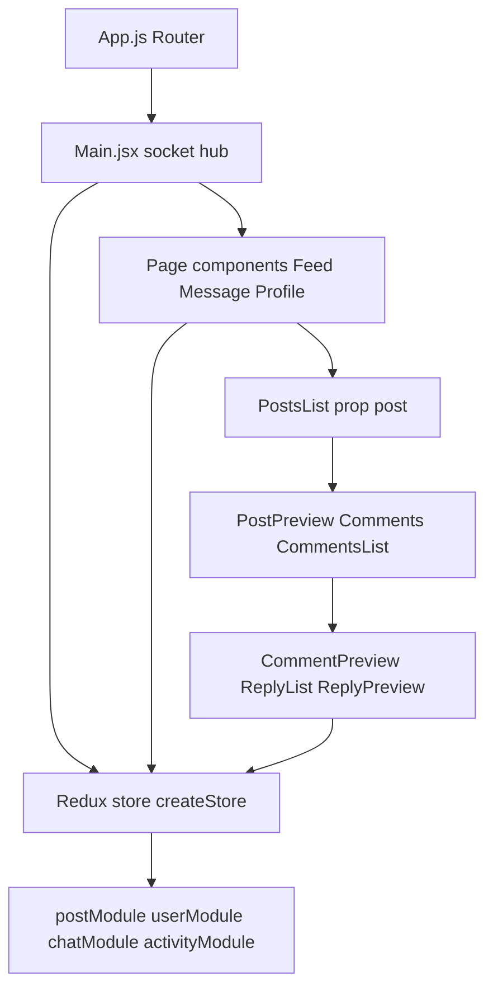
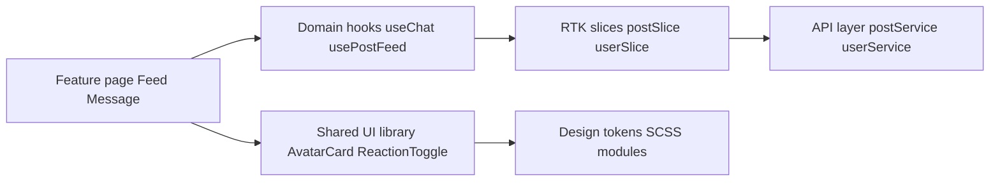
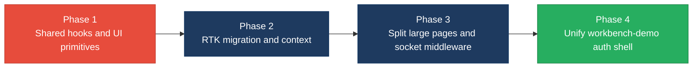

# 3. Frontend Modernization Hotspots Analysis

**Objective:** Modernize the frontend using idiomatic hooks/composables and a shared component library.

**Date:** July 15, 2026 | **Scope:** `target/` — React 18.2.0 (`social-media-react`, CRA + Redux 4/thunk) and React 18.3.1 TypeScript (`workbench-demo`, CRA + React Router 6)

## Executive Summary

> **Executive Summary**
>
> The target workspace contains two Create React App frontends; the primary application is `social-media-react` (59 of 61 scanned view files), a functional-component React 18 app with legacy Redux (`createStore` + thunks, no Redux Toolkit). All scanned components use hooks—no class components were found. The largest risks are duplicated preview/reaction UI across eight components (~13%), prop-drilling chains up to six levels in the post/comment/reply tree, and pervasive global Redux reads (46% of view files). The largest single file is `Message.jsx` at 250 LOC (moderate, below the 500 LOC threshold). `workbench-demo` is a small, modern TypeScript login shell with no shared component library linkage to the main app.

<div class="metric-grid">
<div class="metric-card"><div class="metric-number">61</div><div class="metric-label">Components/Files Scanned</div></div>
<div class="metric-card"><div class="metric-number">0</div><div class="metric-label">Legacy Class-Based Components</div></div>
<div class="metric-card"><div class="metric-number">0</div><div class="metric-label">Components Over 500 LOC</div></div>
<div class="metric-card"><div class="metric-number">5</div><div class="metric-label">Global/Shared State Modules</div></div>
</div>

<div class="overall-rating overall-rating--high-risk"><div class="overall-rating-label">Overall Codebase Rating — Frontend Modernization</div><div class="overall-rating-value">High Risk</div><div class="overall-rating-note">Driven by UI component duplication (H1), prop-drilling depth of 6 (H5), and 0% Redux Toolkit adoption (H6).</div></div>

## 3.1 Benchmark Ratings Summary

| # | Hotspot | Primary KPI | <span class="rating rating-good">Good</span> | <span class="rating rating-moderate">Moderate</span> | <span class="rating rating-high-risk">High Risk</span> | Measured | Rating |
|---|---|---|---|---|---|---|---|
| H1 | UI Component Duplication | Duplicate components % | <5% | 5–10% | >10% | 13.1% (8/61) | <span class="rating rating-high-risk">High Risk</span> |
| H2 | Legacy Class-Based Components | Modern component adoption % | >90% | 70–90% | <70% | 100% (61/61) | <span class="rating rating-good">Good</span> |
| H3 | Massive Components | Largest component LOC | <200 | 200–500 | >500 | 250 (`Message.jsx`) | <span class="rating rating-moderate">Moderate</span> |
| H4 | Global State Dependencies | Components reading global state % | <30% | 30–60% | >60% | 45.9% (28/61) | <span class="rating rating-moderate">Moderate</span> |
| H5 | Complex State Management | Max prop-drilling depth | <3 | 3–5 | >5 | 6 levels | <span class="rating rating-high-risk">High Risk</span> |
| H6 | Legacy Redux Without Toolkit (additional) | RTK slice/store adoption % | >90% | 70–90% | <70% | 0% (0/4 modules) | <span class="rating rating-high-risk">High Risk</span> |


## 3.2 Hotspot-by-Hotspot Evidence

### H1. UI Component Duplication <span class="sev sev-high">High</span>

**Benchmark:** `Duplicate components % = 13.1% (8/61)` → falls in the **High Risk** band (Good <5% · Moderate 5–10% · High Risk >10%).

Eight view files repeat near-identical UI/logic that could be shared primitives (`UserAvatarCard`, `ReactionToggle`, `PreviewListRow`). The reaction-like toggle is copy-pasted across post, comment, and reply previews; user-profile row layouts repeat across connection and message previews.

**Example 1 — `social-media-react/src/cmps/posts/post-preview/PostPreview.jsx:65-92`**

```jsx
const onLikePost = () => {
  const isAlreadyLike = post.reactions.some(
    (reaction) => reaction.userId === loggedInUser._id
  )
  if (isAlreadyLike) {
    post.reactions = post.reactions.filter(
      (reaction) => reaction.userId !== loggedInUser._id
    )
  } else if (!isAlreadyLike) {
    post.reactions.push({
      userId: loggedInUser._id,
      fullname: loggedInUser.fullname,
      reaction: 'like',
    })
  }
  dispatch(savePost(post)).then(/* ... */)
}
```

**Example 2 — `social-media-react/src/cmps/comments/CommentPreview.jsx:38-55`**

```jsx
const onLikeComment = () => {
  const commentToSave = { ...comment }
  const isAlreadyLike = commentToSave.reactions.some(
    (reaction) => reaction.userId === loggedInUser._id
  )
  if (isAlreadyLike) {
    commentToSave.reactions = commentToSave.reactions.filter(
      (reaction) => reaction.userId !== loggedInUser._id
    )
  } else if (!isAlreadyLike) {
    commentToSave.reactions.push({
      userId: loggedInUser._id,
      fullname: loggedInUser.fullname,
      reaction: 'like',
    })
  }
  onSaveComment(commentToSave)
}
```

**Example 3 — `social-media-react/src/cmps/replies/ReplyPreview.jsx:12-28`** — identical toggle pattern; also duplicated in `LikePreview.jsx`, `ConnectionPreview.jsx`, `MyConnectionPreview.jsx`, and `ThreadMsgPreview.jsx` (user avatar + async `userService.getById` shell).

**Why it matters here:** Every UX tweak to likes, avatars, or preview rows must be applied in up to eight places. Bug fixes (e.g., mutating `post.reactions` in place) propagate inconsistently, and there is no design-system source of truth across feed, comments, messages, and connections.

**Recommended approach:**
1. Extract `useReactionToggle(entity, saveFn)` hook used by `PostPreview`, `CommentPreview`, and `ReplyPreview`.
2. Create `UserAvatarCard` in `social-media-react/src/cmps/shared/` consumed by connection and message preview components.
3. Add Storybook or a `/styleguide` route documenting shared preview primitives before migrating feature pages.

<!-- affected-files
search: isAlreadyLike.*reactions
glob: social-media-react/src/**/*.{jsx,tsx}
issue: Duplicated reaction-toggle logic across preview components
action: Extract shared useReactionToggle hook and ReactionButton component
-->

### H2. Legacy Class-Based / Imperative Components <span class="sev sev-low">Low</span>

**Benchmark:** `Modern component adoption % = 100% (61/61)` → falls in the **Good** band (Good >90% · Moderate 70–90% · High Risk <70%).

**Evidence:** Not observed — ripgrep found zero `extends Component`, `extends React.Component`, or `connect(` HOC usages across `social-media-react/src` and `workbench-demo/src`. All pages and components export arrow or function components with hooks (`useState`, `useEffect`, `useSelector`, etc.).

### H3. Massive Components (>500 LOC) <span class="sev sev-medium">Medium</span>

**Benchmark:** `Largest component LOC = 250` → falls in the **Moderate** band (Good <200 · Moderate 200–500 · High Risk >500).

No file exceeds 500 LOC. The top three page-level files mix data fetching, Redux dispatch, and layout:

**Example 1 — `social-media-react/src/pages/Message.jsx:1-80` (250 LOC total)**

```jsx
function useChat(loggedInUser, chats, params) {
  const dispatch = useDispatch()
  const [isUserChatExist, setIsUserChatExist] = useState(undefined)
  const [messagesToShow, setMessagesToShow] = useState(null)
  // ... chat creation, user lookup, message assembly ...
  const checkIfChatExist = () => {
    return new Promise((resolve, reject) => {
      if (!chats) return reject(false)
      const isChatExist = chats.some(chat =>
        chat.userId === params.userId || chat.userId2 === params.userId
      )
      // ...
    })
  }
}
```

**Example 2 — `social-media-react/src/cmps/posts/CreatePostModal.jsx`** (229 LOC) — form state, media upload, and dispatch logic in one modal component.

**Example 3 — `social-media-react/src/pages/Signup.jsx`** (220 LOC) — registration form, validation, and Redux user creation combined.

**Why it matters here:** `Message.jsx` owns chat lifecycle, socket-adjacent state, and UI routing concerns in one file, making isolated testing and reuse of chat logic impossible without reading the entire module.

**Recommended approach:**
1. Move `useChat` from `Message.jsx` into `social-media-react/src/hooks/useChat.js`.
2. Split `CreatePostModal.jsx` into `PostFormFields`, `MediaUploadSection`, and `useCreatePost` hook.
3. Set a 200 LOC soft limit in ESLint (`max-lines`) for `pages/` and `cmps/`.

<!-- affected-files
search: .
glob: social-media-react/src/pages/Message.jsx
issue: Page component exceeds 200 LOC with embedded chat hook
action: Extract useChat hook and slim Message.jsx to layout only
-->

### H4. Global State Dependencies <span class="sev sev-medium">Medium</span>

**Benchmark:** `Components reading global state % = 45.9% (28/61)` → falls in the **Moderate** band (Good <30% · Moderate 30–60% · High Risk >60%).

Redux store exposes four combined modules (`postModule`, `userModule`, `chatModule`, `activityModule`) via legacy `createStore`. Twenty-eight view files call `useSelector`; pages like `Feed.jsx` depend on `loggedInUser` globally even for layout-only concerns.

**Example 1 — `social-media-react/src/store/index.js:1-20`**

```javascript
const rootReducer = combineReducers({
  postModule: postReducer,
  userModule: userReducer,
  chatModule: chatReducer,
  activityModule: activityReducer,
})
export const store = createStore(
  rootReducer,
  composeEnhancers(applyMiddleware(thunk))
)
```

**Example 2 — `social-media-react/src/pages/Feed.jsx:9-16`**

```jsx
const Feed = () => {
  const { loggedInUser } = useSelector((state) => state.userModule)
  const dispatch = useDispatch()
  useEffect(() => {
    dispatch(setCurrPage('home'))
    dispatch(setNextPage(1))
  }, [dispatch])
```

**Example 3 — `social-media-react/src/services/eventBusService.js:19-21`** — global singleton attached to `window.myBus` (latent hidden coupling if adopted widely).

**Why it matters here:** Nearly half of all view files are coupled to the monolithic Redux tree. Feature teams cannot mount components in isolation without mocking four reducer modules, and socket-driven updates in `Main.jsx` fan out through global actions affecting unrelated pages.

**Recommended approach:**
1. Migrate to Redux Toolkit with per-domain slices (`userSlice`, `postSlice`) and colocated selectors.
2. Introduce React Context for session-only data (`loggedInUser`) to reduce selector sprawl in layout components.
3. Remove or encapsulate `window.myBus`; prefer typed event hooks or RTK listener middleware.

<!-- affected-files
search: useSelector
glob: social-media-react/src/**/*.{jsx,tsx}
issue: Component reads global Redux state directly
action: Colocate selectors; migrate to RTK slices and scoped context where appropriate
-->

### H5. Complex State Management <span class="sev sev-high">High</span>

**Benchmark:** `Max prop-drilling depth = 6 levels` → falls in the **High Risk** band (Good <3 · Moderate 3–5 · High Risk >5).

The deepest chain runs from list container to leaf reply: `PostsList → PostPreview → Comments → CommentsList → CommentPreview → ReplyList → ReplyPreview`. Callback props (`onSaveComment`, `updateReply`) are threaded through every intermediate layer. `MsgPreview.jsx` also accepts eight callback/state props from `ListMsg.jsx`.

**Example 1 — `social-media-react/src/cmps/posts/PostsList.jsx:61-62`**

```jsx
{posts.map((post,idx) => (
  <PostPreview key={post._id+idx} post={post} />
))}
```

**Example 2 — `social-media-react/src/cmps/posts/post-preview/PostPreview.jsx:133-138`**

```jsx
{isShowComments && (
  <Comments
    comments={post.comments}
    postId={post._id}
    userPostId={post.userId}
  />
)}
```

**Example 3 — `social-media-react/src/cmps/comments/CommentsList.jsx:8-13` → `CommentPreview.jsx` → `ReplyList.jsx:7-8` → `ReplyPreview.jsx:7`**

```jsx
<CommentPreview
  key={comment._id}
  comment={comment}
  onSaveComment={onSaveComment}
/>
```

**Why it matters here:** Six-level prop chains force every intermediate component to know about comment-save semantics. Adding optimistic updates or error handling requires touching five files, and TypeScript migration (as started in `workbench-demo`) cannot easily propagate types through this depth.

**Recommended approach:**
1. Provide `PostInteractionContext` (postId, saveComment, updateReply) at `PostPreview` level so leaf components consume context instead of props.
2. Replace callback drilling in messaging with `useChat()` context from H3.
3. Adopt RTK entity adapters for posts/comments/replies so leaf components dispatch slice actions directly.

<!-- affected-files
search: onSaveComment=
glob: social-media-react/src/**/*.{jsx,tsx}
issue: Callback props drilled through comment/reply component tree
action: Introduce PostInteractionContext or RTK entity actions at post boundary
-->

### H6. Legacy Redux Without Toolkit (additional) <span class="sev sev-high">High</span>

**Benchmark:** `RTK slice/store adoption % = 0% (0/4 modules)` → falls in the **High Risk** band (Good >90% · Moderate 70–90% · High Risk <70%).

The store uses deprecated `createStore`, hand-written action creators (`postActions.js` 210 LOC), and four separate reducer files. No `@reduxjs/toolkit` dependency appears in `package.json`. Thunk action creators mix API calls, socket side effects, and UI loading flags.

**Example 1 — `social-media-react/package.json:21-27`**

```json
"react-redux": "^8.0.0",
"redux": "^4.1.2",
"redux-thunk": "^2.4.1",
```

**Example 2 — `social-media-react/src/store/actions/postActions.js:1-25`**

```javascript
import { postService } from '../../services/posts/postService'
export function loadPosts() {
  return async (dispatch) => {
    dispatch({ type: 'IS_LOADING', isPostsLoading: true })
    try {
      const posts = await postService.query(filterBy)
      dispatch({ type: 'SET_POSTS', posts })
    } catch (err) {
      console.log('err:', err)
    }
    dispatch({ type: 'IS_LOADING', isPostsLoading: false })
  }
}
```

**Example 3 — `social-media-react/src/pages/Main.jsx:110-140`** — twelve socket listeners registered in the page component, each dispatching legacy action types.

**Why it matters here:** Without RTK slices, reducers and action types are stringly-typed and scattered across 4 reducer + 4 action files (~600 LOC of boilerplate). This blocks modern tooling (RTK Query for posts/users, listener middleware for sockets) and increases regression risk when adding features.

**Recommended approach:**
1. Add `@reduxjs/toolkit` and `@reduxjs/toolkit/query` to `social-media-react`.
2. Convert `postModule` first (highest churn) to `createSlice` + `createAsyncThunk`.
3. Move socket subscriptions from `Main.jsx` into RTK listener middleware or a dedicated `useSocketSync` hook.

<!-- affected-files
search: createStore|combineReducers
glob: social-media-react/src/**/*.{js,jsx}
issue: Legacy Redux createStore/thunk pattern without RTK
action: Migrate store modules to Redux Toolkit slices and configureStore
-->

## 3.3 State Management & Dependency Evidence

H4 and H5 cover global Redux coupling and prop-drilling respectively. Additional dependency notes:

- **Socket service singleton** (`socket.service.js`) is initialized in `Main.jsx` with a dozen event bindings—tight coupling between transport layer and page shell.
- **Direct DOM access** in `InputFilter.jsx` (`document.getElementById`, `innerHTML`) and `MessageThread.jsx` (`document.querySelector`) bypasses React rendering for autocomplete and scroll—fragile alongside concurrent React 18 features.
- **`workbench-demo`** uses local component state + `localStorage` for auth token with no shared auth context—acceptable for its size but not integrated with the main app's Redux session model.

## 3.4 Diagrams

### Current UI data flow



### Target component + state layout



### Improvement roadmap



## 3.5 Actions Required

| Hotspot | Action | Rating | Priority |
|---|---|---|---|
| H1 UI Component Duplication | Extract `useReactionToggle`, `UserAvatarCard`, and shared preview list row components; refactor eight duplicate files to consume them. | <span class="rating rating-high-risk">High Risk</span> | <span class="sev sev-high">High</span> |
| H3 Massive Components | Extract `useChat` from `Message.jsx`; split `CreatePostModal.jsx` and `Signup.jsx` into hooks + presentational subcomponents; enforce 200 LOC soft limit. | <span class="rating rating-moderate">Moderate</span> | <span class="sev sev-medium">Medium</span> |
| H4 Global State Dependencies | Migrate to Redux Toolkit slices; scope session data via Context; remove `window.myBus` global export. | <span class="rating rating-moderate">Moderate</span> | <span class="sev sev-medium">Medium</span> |
| H5 Complex State Management | Add `PostInteractionContext` at post boundary; replace six-level callback drilling with context or RTK entity dispatches. | <span class="rating rating-high-risk">High Risk</span> | <span class="sev sev-high">High</span> |
| H6 Legacy Redux Without Toolkit | Add `@reduxjs/toolkit`, convert four modules to slices, relocate socket listeners to listener middleware. | <span class="rating rating-high-risk">High Risk</span> | <span class="sev sev-critical">Critical</span> |

## 3.6 Expected Outcomes

- A shared component library (`UserAvatarCard`, `ReactionToggle`, preview rows) reduces duplicated UI logic from ~13% toward the <5% target and stabilizes like/avatar behavior across feed, comments, and messages.
- Extracted hooks (`useChat`, `useReactionToggle`) and sub-200 LOC page components improve unit-test coverage and enable incremental TypeScript adoption.
- Redux Toolkit slices with colocated selectors cut boilerplate action/reducer code by roughly half and make socket-driven updates traceable via listener middleware instead of `Main.jsx` wiring.
- Context and entity-based dispatches collapse prop-drilling from six levels to ≤3, simplifying future feature work and cross-app patterns for `workbench-demo` integration.
