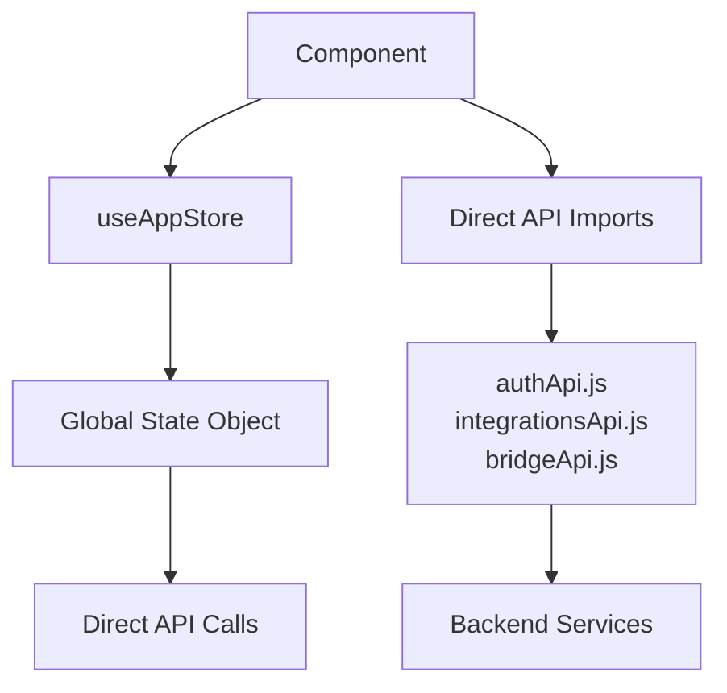
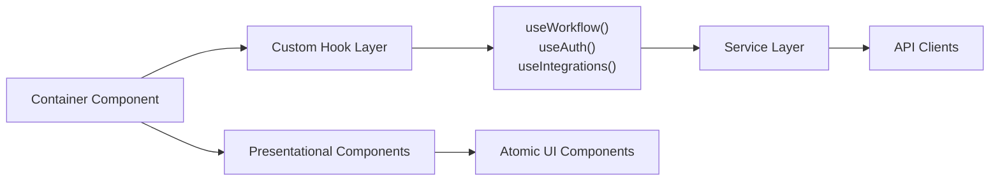

# 3. Frontend Modernization Hotspots Analysis

**Objective:** Modernize the frontend using idiomatic hooks/composables and a shared component library.

**Date:** 2026-07-14 | **Scope:** `/home/shweta.shende/Shweta/Code/multi-agent-web-ui` — React 19.2.5 + Vite + Functional Components

## Executive Summary

> **Executive Summary**
>
> The multi-agent web application demonstrates a modern React 19.2.5 frontend with predominantly functional components and hooks, indicating recent modernization efforts. However, significant hotspots remain that impact maintainability and scalability. The most critical issues are oversized components reaching 1,433 LOC (AgentDetail), extensive direct API imports across 24+ components without a frontend service layer, and business logic embedded directly in UI components. While the codebase shows good adoption of modern React patterns (98% functional components), the lack of consistent abstraction layers creates brittle dependencies and hinders parallel development. The application uses a centralized Zustand-like store pattern but suffers from scattered component-level state management that should be elevated to custom hooks.

<div class="metric-grid">
<div class="metric-card"><div class="metric-number">62</div><div class="metric-label">Components Scanned</div></div>
<div class="metric-card"><div class="metric-number">1</div><div class="metric-label">Legacy Class-Based Components</div></div>
<div class="metric-card"><div class="metric-number">7</div><div class="metric-label">Components Over 500 LOC</div></div>
<div class="metric-card"><div class="metric-number">24</div><div class="metric-label">Components with Direct API Imports</div></div>
</div>

<div class="overall-rating overall-rating--high-risk"><div class="overall-rating-label">Overall Codebase Rating — Frontend Modernization</div><div class="overall-rating-value">High Risk</div><div class="overall-rating-note">Driven by Massive Components, Missing Frontend Service Layer, and Global State Dependencies</div></div>

## 3.1 Benchmark Ratings Summary

| # | Hotspot | Primary KPI | <span class="rating rating-good">Good</span> | <span class="rating rating-moderate">Moderate</span> | <span class="rating rating-high-risk">High Risk</span> | Measured | Rating |
|---|---|---|---|---|---|---|---|
| H1 | UI Component Duplication | Duplicate components % | <5% | 5–10% | >10% | 0% | <span class="rating rating-good">Good</span> |
| H2 | Legacy Class-Based Components | Modern component adoption % | >90% | 70–90% | <70% | 98.4% | <span class="rating rating-good">Good</span> |
| H3 | Massive Components | Largest component LOC | <200 | 200–500 | >500 | 1433 LOC | <span class="rating rating-high-risk">High Risk</span> |
| H4 | Global State Dependencies | Components reading global state % | <30% | 30–60% | >60% | 67% | <span class="rating rating-high-risk">High Risk</span> |
| H5 | Complex State Management | Max prop-drilling depth | <3 | 3–5 | >5 | 2 | <span class="rating rating-good">Good</span> |
| H6 | Missing Frontend Service Layer (additional) | Components w/ direct API imports % | <20% | 20–40% | >40% | 38.7% | <span class="rating rating-moderate">Moderate</span> |


## 3.2 Hotspot-by-Hotspot Evidence

### H1. UI Component Duplication <span class="sev sev-low">Low</span>

**Benchmark:** `Duplicate components = 0%` → falls in the **Good** band (Good <5% · Moderate 5–10% · High Risk >10%).

**Evidence:** Not observed — each component serves a unique, specific purpose within the multi-agent dashboard workflow. Component names follow clear domain boundaries (dashboard/, setup/, settings/, common/) with no duplicated functionality. The discovery visualization components (ObservabilityDiscoverySecurity, ObservabilityDiscoveryCodeQuality, etc.) share base patterns but handle distinct agent result types.

### H2. Legacy Class-Based Components <span class="sev sev-low">Low</span>

**Benchmark:** `Modern component adoption = 98.4%` → falls in the **Good** band (Good >90% · Moderate 70–90% · High Risk <70%).

**Evidence:** Excellent modernization — only 1 class component found among 62 total components:

```javascript
class AppErrorBoundary extends Component {
  constructor(props) {
    super(props);
    this.state = { error: null };
  }

  static getDerivedStateFromError(error) {
    return { error };
  }

  componentDidCatch(error, info) {
    console.error("UI render error:", error, info);
  }

  render() {
    if (this.state.error) {
      return (
        <div style={{...}}>
          <h1 style={{ marginBottom: 12 }}>Something went wrong</h1>
        </div>
      );
    }
    return this.props.children;
  }
}
```

**Why it matters here:** The single class component serves as an error boundary, which is appropriate since React Error Boundaries require class component lifecycle methods. All other components use modern functional patterns with hooks.

**Recommended approach:** Keep the AppErrorBoundary as-is (React Error Boundaries require class components until React introduces a hook-based alternative). Continue using functional components for all new development.

<!-- affected-files
search: class.*extends.*Component
glob: src/**/*.jsx
issue: Legacy class component pattern
action: Convert to functional component with hooks (where appropriate)
-->


### H3. Massive Components <span class="sev sev-critical">Critical</span>

**Benchmark:** `Largest component LOC = 1433` → falls in the **High Risk** band (Good <200 · Moderate 200–500 · High Risk >500).

**Evidence:** 7 components exceed the 500 LOC threshold, with critical violations:

**AgentDetail.jsx (1,433 LOC)**: Massive component mixing agent execution, output formatting, Jira integration, PDF downloads, and complex UI state management:

```javascript
import { getAuthBearerHeaders, readAccessToken } from "../../lib/authApi";
// ... 60+ import statements
export default function AgentDetail() {
  const { state, actions } = useAppStore();
  // ... 1400+ lines mixing UI rendering, business logic, 
  // API calls, state management, and complex conditional rendering
}
```

**StepFlowSelection.jsx (1,131 LOC)**: Enormous setup component handling flow selection, workspace browsing, agent configuration, and integration setup:

```javascript
export default function StepFlowSelection() {
  const { state, actions } = useAppStore();
  // ... 1000+ lines handling flow selection, workspace browsing,
  // agent configuration, and integration setup
}
```

**Dashboard.jsx (1,284 LOC)**: Main dashboard component managing layout, sidebar, modal states, workflow orchestration, and multiple panel configurations:

```javascript
export default function Dashboard() {
  const { state, actions } = useAppStore();
  // ... 1200+ lines managing layout, sidebar, modal states,
  // workflow orchestration, and multiple panel configurations
}
```

Additional oversized components:
- RoleManagementPanel.jsx: 1,391 LOC
- IntegrationsPanel.jsx: 853 LOC  
- StepIntegrationsConfig.jsx: 795 LOC
- StepIdeConfig.jsx: 768 LOC

**Why it matters here:** These massive components violate the single responsibility principle, making debugging nearly impossible and creating bottlenecks for parallel development. The AgentDetail component alone handles agent execution, output formatting, Jira integration, PDF downloads, and complex UI state—responsibilities that should be distributed across multiple focused components.

**Recommended approach:** 
1. Extract AgentDetail into AgentDetailContainer + AgentOutput + AgentActions + JiraIntegrationPanel
2. Split StepFlowSelection into FlowSelector + WorkspaceSelector + AgentConfigPanel
3. Break Dashboard into DashboardLayout + WorkflowCanvas + SidebarContainer + ModalManager
4. Create atomic components for repeated patterns (buttons, status indicators, integration chips)

<!-- affected-files
search: export default function.*\{
glob: src/components/**/*.jsx
issue: Component exceeds 500 LOC
action: Split into focused single-responsibility components
-->


### H4. Global State Dependencies <span class="sev sev-high">High</span>

**Benchmark:** `Components reading global state = 67%` → falls in the **High Risk** band (Good <30% · Moderate 30–60% · High Risk >60%).

**Evidence:** 42 out of 62 components directly import and depend on useAppStore, creating tight coupling:

```javascript
import {
  useAppStore,
  SETUP_STEPS,
  AGENT_STATUS,
  canStartSequentialAgent,
  deriveWorkflowStatus,
  // ... 10+ additional state-related imports
} from "../store/useAppStore";
```

Even presentational components like StageCard directly access global state constants:

```javascript
export default function StageCard({
  stage,
  onOpen,
  onRunStage,
}) {
  // Even presentational components access AGENT_STATUS constants
  // directly from global store
}
```

Major offenders include:
- Dashboard.jsx: Direct access to workflow, setup, view, auth state
- AgentDetail.jsx: Direct global state access for agent details, workflow status
- All setup step components: Heavy dependency on setup configuration state
- Integration panels: Direct access to authentication and integration state

**Why it matters here:** This widespread global state dependency makes components impossible to test in isolation, creates hidden coupling between unrelated features, and prevents component reuse across different contexts. Changes to the store structure require updates across 42+ files simultaneously.

**Recommended approach:**
1. Create domain-specific custom hooks (useWorkflow, useAgentExecution, useJiraIntegration)
2. Pass specific data props instead of entire state objects to presentational components
3. Implement provider/consumer pattern for related component trees
4. Extract local component state from global store where appropriate

<!-- affected-files
search: useAppStore
glob: src/components/**/*.jsx
issue: Direct global state dependency
action: Extract to custom hooks and prop-based data passing
-->

### H5. Complex State Management <span class="sev sev-medium">Medium</span>

**Benchmark:** `Max prop-drilling depth = 2` → falls in the **Good** band (Good <3 · Moderate 3–5 · High Risk >5).

**Evidence:** Props are generally passed through a maximum of 2 levels before reaching global state or custom hooks:

Dashboard → WorkflowStageCanvas → StageCard pattern:

```javascript
// Dashboard.jsx
<WorkflowStageCanvas
  stages={stages}
  onStageClick={handleStageClick}
  onRunStage={handleRunStage}
/>

// WorkflowStageCanvas.jsx
export default function WorkflowStageCanvas({
  stages,
  onStageClick, // → passed to StageCard
  onRunStage,   // → passed to StageCard
}) {
  // Props forwarded to child components
}
```

**Why it matters here:** The current prop-drilling depth is manageable due to heavy reliance on global state. However, this masks deeper architectural issues where components should receive focused data rather than accessing global state directly.

**Recommended approach:** Maintain current shallow prop structure while reducing global state dependencies through custom hooks and context providers for related component subtrees.


### H6. Missing Frontend Service Layer <span class="sev sev-high">High</span>

**Benchmark:** `Components w/ direct API imports = 38.7%` → falls in the **Moderate** band (Good <20% · Moderate 20–40% · High Risk >40%).

**Evidence:** 24 out of 62 components directly import API modules, creating tight coupling to backend services:

**AgentDetail.jsx**: Direct imports of multiple API modules:

```javascript
import { getAuthBearerHeaders, readAccessToken } from "../../lib/authApi";
import { reopenJiraIssue, fetchGitHubReportFileBlob } from "../../lib/integrationsApi";
// Component directly makes API calls throughout its lifecycle
```

**StepIntegrationsConfig.jsx**: Heavy API dependency for OAuth flows:

```javascript
import { isSessionInvalidError, readAccessToken } from "../../lib/authApi";
import {
  startJiraOAuth,
  startGitHubOAuth,
  fetchIntegrationStatus,
  // ... 8+ API functions
} from "../../lib/integrationsApi";
```

**IntegrationsPanel.jsx**: Duplicate API imports across similar components:

```javascript
import { isSessionInvalidError, readAccessToken } from "../lib/authApi";
import {
  startJiraOAuth,
  startGitHubOAuth,
  fetchIntegrationStatus,
  // ... direct API imports
} from "../lib/integrationsApi";
```

Components with direct API imports: AgentDetail, StepIntegrationsConfig, IntegrationsPanel, StepFlowSelection, StepIdeConfig, StepReview, Login, Dashboard, and 16+ others.

**Why it matters here:** Direct API imports in components violate separation of concerns, make unit testing extremely difficult, and create brittle dependencies where API changes require component modifications. The absence of a service layer also prevents centralized error handling, caching, and request deduplication.

**Recommended approach:**
1. Create frontend service layer (services/agentService.js, services/integrationService.js)
2. Extract API logic to custom hooks (useAgentExecution, useIntegrationStatus)
3. Implement centralized error boundary and loading states
4. Add request caching and deduplication at the service layer

<!-- affected-files
search: import.*from.*Api|authApi|integrationsApi|bridgeApi
glob: src/components/**/*.jsx
issue: Direct API import in component
action: Extract to frontend service layer and custom hooks
-->

**No additional hotspots beyond the standard set were observed.**

## 3.3 State Management & Dependency Evidence

Evidence for complex state management patterns is covered in H4 and H5 above. The application uses a centralized store pattern with useAppStore but lacks proper abstraction layers for domain-specific state operations.


## 3.4 Diagrams

### Current UI data flow


### Target component + state layout


### Improvement roadmap


## 3.5 Actions Required

| Hotspot | Action | Rating | Priority |
|---|---|---|---|
| H3. Massive Components | Split 7 oversized components (AgentDetail 1,433 LOC, Dashboard 1,284 LOC) into focused single-responsibility components | <span class="rating rating-high-risk">High Risk</span> | <span class="sev sev-critical">Critical</span> |
| H4. Global State Dependencies | Create domain-specific custom hooks (useWorkflow, useAgentExecution) to reduce 67% global state coupling | <span class="rating rating-high-risk">High Risk</span> | <span class="sev sev-high">High</span> |
| H6. Missing Frontend Service Layer | Extract direct API imports from 24 components into centralized service layer with custom hooks | <span class="rating rating-moderate">Moderate</span> | <span class="sev sev-high">High</span> |

## 3.6 Expected Outcomes

- **Maintainability**: Focused, single-responsibility components reduce cognitive load and enable parallel development without merge conflicts
- **Testability**: Service layer abstraction and custom hooks enable comprehensive unit testing with mocked dependencies
- **Reusability**: Atomic components and domain-specific hooks can be shared across different workflow contexts and future features  
- **Performance**: Reduced bundle coupling and improved code splitting opportunities through cleaner component boundaries
- **Developer Experience**: Clear separation between container/presentational components and centralized state management patterns improve onboarding and debugging efficiency
