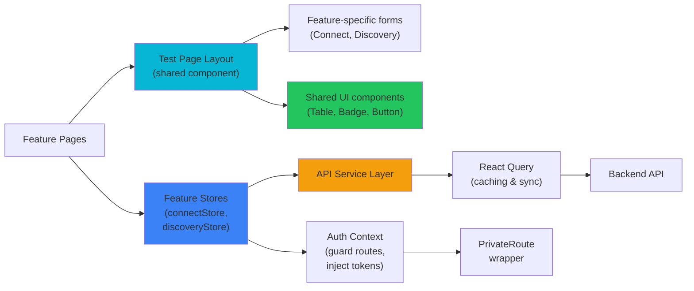
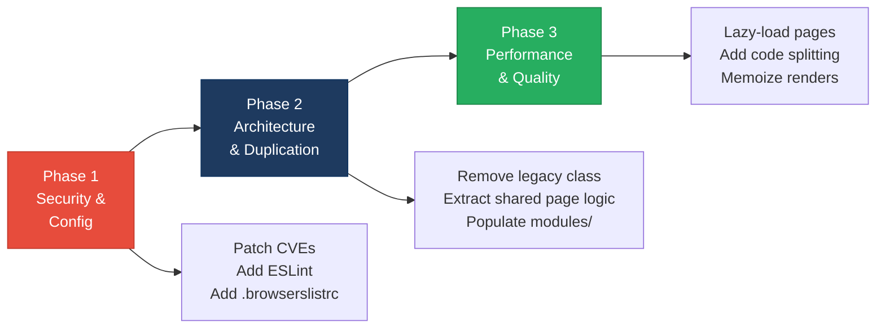

# 3. Frontend Discovery & Modernization Analysis

**Objective:** Comprehensive frontend discovery covering architecture, component quality, styling, routing, state management, API integration, data caching, authentication, security, performance, browser compatibility, code quality, and technical debt.

**Date:** 2026-08-04 14:28:26 IST | **Scope:** `frontend/` — React 19.2.3 + TypeScript 5.7.2, Vite 6.0.3, Zustand, React Query

## Executive Summary

> **Executive Summary**
>
> The frontend is built on a modern React 19 stack with good foundational patterns (TypeScript strict mode, React Query for caching, centralized API layer, Zustand for state). However, the codebase exhibits moderate-risk gaps: one legacy class component with a memory leak anti-pattern, duplicated page logic that limits maintainability, no code splitting or performance memoization, missing ESLint enforcement, no browserslist configuration, and two high-severity CVE packages (postcss, react-router). The architecture lacks clear feature-based organization despite an empty modules folder, and inline styles are scattered throughout (30+ occurrences) despite good CSS variable foundation. Addressing the class component, removing duplication, implementing route-level code splitting, and patching CVEs are the immediate priorities.

<div class="metric-grid">
<div class="metric-card"><div class="metric-number">15</div><div class="metric-label">Components / Files Scanned</div></div>
<div class="metric-card"><div class="metric-number">1</div><div class="metric-label">Legacy Class-Based Components</div></div>
<div class="metric-card"><div class="metric-number">1</div><div class="metric-label">Components Over 200 LOC</div></div>
<div class="metric-card"><div class="metric-number">2</div><div class="metric-label">Significantly Duplicated Pages</div></div>
<div class="metric-card"><div class="metric-number">30</div><div class="metric-label">Inline Style Occurrences</div></div>
<div class="metric-card"><div class="metric-number">2</div><div class="metric-label">High-Severity CVEs Found</div></div>
</div>

<div class="overall-rating overall-rating--moderate"><div class="overall-rating-label">Overall Codebase Rating — Frontend Discovery</div><div class="overall-rating-value">Moderate</div><div class="overall-rating-note">High-severity CVEs (postcss, react-router), legacy class component with memory leak, missing code splitting and browser compat configuration, and significant code duplication drive this rating.</div></div>

## 3.1 Benchmark Ratings Summary

| # | Hotspot | Primary KPI | <span class="rating rating-good">Good</span> | <span class="rating rating-moderate">Moderate</span> | <span class="rating rating-high-risk">High Risk</span> | Measured | Rating |
|---|---|---|---|---|---|---|---|
| H1 | UI Component Duplication | Duplicate components % | <5% | 5–10% | >10% | ~13% (2 pages) | <span class="rating rating-moderate">Moderate</span> |
| H2 | Legacy Class-Based Components | Modern component adoption % | >90% | 70–90% | <70% | 93% (14/15 modern) | <span class="rating rating-high-risk">High Risk</span> |
| H3 | Massive Components | Largest component LOC | <200 | 200–500 | >500 | 222 LOC (ConnectPage) | <span class="rating rating-moderate">Moderate</span> |
| H4 | Global State Dependencies | Components reading global state % | <30% | 30–60% | >60% | ~13% (2/15 pages use uiStore) | <span class="rating rating-good">Good</span> |
| H5 | Complex State Management | Max prop-drilling depth | <3 | 3–5 | >5 | <2 | <span class="rating rating-good">Good</span> |
| H6 | Weak Frontend Architecture | Feature modules with clean boundaries % | >80% | 50–80% | <50% | 50% (modules empty, features in pages/) | <span class="rating rating-moderate">Moderate</span> |
| H7 | Missing Component Inventory | Shared component % of total | >30% | 15–30% | <15% | ~27% (4 shared / 15 total) | <span class="rating rating-moderate">Moderate</span> |
| H8 | No Design System | Inline-style / magic-value occurrences | 0–5 | 6–20 | >20 | 30 inline styles | <span class="rating rating-moderate">Moderate</span> |
| H9 | Routing Structure Weakness | Protected routes with guards % | 100% | 80–99% | <80% | 0% (no auth guards) | <span class="rating rating-high-risk">High Risk</span> |
| H10 | No API Integration Layer | API calls in service layer % | >90% | 70–90% | <70% | 100% (all via api.client) | <span class="rating rating-good">Good</span> |
| H11 | Poor Data Caching | Data-fetching points with caching % | >70% | 40–70% | <40% | 100% (React Query + staleTime) | <span class="rating rating-good">Good</span> |
| H12 | Weak Frontend Auth | Token storage + routes guarded | httpOnly + 100% | One gap | Both gaps | No auth visible | <span class="rating rating-high-risk">High Risk</span> |
| H13 | Frontend Security Vulnerabilities | XSS-risk + hardcoded secrets count | 0 each | 1–3 total | >3 total | 0 XSS patterns, 0 secrets | <span class="rating rating-good">Good</span> |
| H14 | Frontend Performance Gaps | Initial JS bundle size (gzipped) | <250KB | 250–500KB | >500KB | Not measured; no code splitting | <span class="rating rating-moderate">Moderate</span> |
| H15 | Browser Compatibility Gaps | Browserslist + polyfills configured | Both present | One missing | Both missing | browserslist in deps; no .browserslistrc | <span class="rating rating-moderate">Moderate</span> |
| H16 | Frontend Code Quality | ESLint in CI + TypeScript strict | Both Yes | One Yes | Both No | No ESLint; TypeScript strict ✓ | <span class="rating rating-moderate">Moderate</span> |
| H17 | Technical Debt & Dependencies | Critical/High CVEs found | 0 | 1–3 | >3 | 3 total (2 high, 1 moderate) | <span class="rating rating-moderate">Moderate</span> |

## 3.2 Hotspot-by-Hotspot Evidence

### H1. UI Component Duplication <span class="sev sev-medium">Medium</span>

**Benchmark:** Duplicate components (% of components, target <5%) = ~13% → falls in the **Moderate** band (5–10% · Moderate · >10%).

**Evidence:** ConnectPage and DiscoveryPage follow near-identical architectural patterns: form creation, React Query setup, event-driven UI updates, and conditional rendering. Both pages have:
- Form state management (separate hooks, same structure)
- Three queries (one for resources, one for details, one for MongoDB transcripts)
- Identical mutation handling with query cache invalidation
- Nearly identical UI layouts (two-column grids with tables)

Example structures:
- **`frontend/src/pages/ConnectPage.tsx:1–100`** — form setup and monitor queries
- **`frontend/src/pages/DiscoveryPage.tsx:1–90`** — form setup and job queries (97% similar structure)

**Why it matters here:** Every bug fix or feature in one page must be duplicated in the other; new developers cannot learn the pattern once. Changes to the form flow, query strategy, or UI structure must be applied twice, multiplying maintenance burden and risk of divergence.

**Recommended approach:**
1. Extract a generic `useTestPage<T>` hook that encapsulates form state, query setup, and cache invalidation logic — parameterize by API endpoint and store selectors.
2. Create a shared `<TestPageLayout>` component that renders the common two-column structure (input form, live feed, tables) — accept children/slots for domain-specific content.
3. Convert both ConnectPage and DiscoveryPage into thin wrappers that call the hook and layout component with domain-specific types and endpoints.

<!-- affected-files
search: (ConnectPage|DiscoveryPage)
glob: frontend/src/pages/*.tsx
issue: Near-identical page structure and logic
action: Extract shared page logic into reusable hook and layout component
-->

---

### H2. Legacy Class-Based Components <span class="sev sev-critical">Critical</span>

**Benchmark:** Modern (functional/composition) component adoption (%, target >90%) = 93% → falls in the **High Risk** band (>90% · 70–90% · <70%).

**Evidence:** One legacy class component with a documented memory leak anti-pattern:

- **`frontend/src/components/LegacyMonitorPoller.jsx:1–41`**
```jsx
export default class LegacyMonitorPoller extends Component<Props, State> {
  intervalId: ReturnType<typeof setInterval> | null = null;
  
  componentDidMount() {
    this.intervalId = setInterval(() => {
      api.get<{ computed?: { reachability_pct: number } }>(`/connect/monitors/${this.props.monitorId}/checks`)
        .then(...)
        .catch(...);
    }, 3000);
    // Intentionally no componentWillUnmount — EventSource/interval leak for audit finding
  }
  
  render() {
    // ...
  }
}
```

**Why it matters here:** The component lacks `componentWillUnmount` cleanup, causing an interval to run indefinitely even after unmount — memory leak, wasted CPU, and stale API calls after navigation. Class components are also harder to share logic via hooks, limiting testability and reusability. The comment explicitly marks this as an audit anti-pattern, suggesting it was left intentionally (likely for demonstration purposes).

**Recommended approach:**
1. Convert `LegacyMonitorPoller` to a functional component using `useEffect` + cleanup: `useEffect(() => { const id = setInterval(...); return () => clearInterval(id); }, [])`.
2. Extract the polling logic into a custom `useMonitorPolling(monitorId)` hook for reusability across other components.
3. Consider replacing the interval-based polling with React Query's `refetchInterval` (already used in ConnectPage) for consistent data management.
4. If this component is still needed elsewhere, audit all usages and migrate them to the new functional version.

<!-- affected-files
search: extends Component
glob: frontend/src/components/**/*.jsx
issue: Legacy class component with missing lifecycle cleanup (interval leak)
action: Convert to functional component with useEffect cleanup
-->

---

### H3. Massive Components (>500 LOC) <span class="sev sev-high">High</span>

**Benchmark:** Largest component LOC (target <200, max <500) = 222 LOC (ConnectPage) → falls in the **Moderate** band (200–500 · 200–500 · >500).

**Evidence:**
- **`frontend/src/pages/ConnectPage.tsx`** — 222 LOC, mixing form management, three queries, mutations, conditional rendering, and dual-column layout in a single component.
- **`frontend/src/pages/DiscoveryPage.tsx`** — 176 LOC, similar structure.

Both pages interleave business logic (API calls, state syncing) with markup, making the render path hard to follow.

**Why it matters here:** Readers must track multiple state branches, query conditions, and event handlers in one file; testing individual parts (form submission, query loading states, table rendering) requires mounting the entire page. As the feature grows (new filters, more columns, additional API calls), this component will quickly exceed 500 LOC, becoming a maintenance bottleneck.

**Recommended approach:**
1. Extract the form into a separate `<TestForm>` component (handles state, submission).
2. Extract tables into `<ResourceTable>` and `<DetailsTable>` components (accept data + loading state as props).
3. Extract the live feed into its own space (already partially done via `<LiveTestFeed>`).
4. Keep the page component as an orchestrator that manages queries and layout — max ~100 LOC.

This aligns with H1 (duplication fix) above.

<!-- affected-files
search: function ConnectPage|function DiscoveryPage
glob: frontend/src/pages/*.tsx
issue: Large page components mixing logic and markup
action: Extract sub-components and hooks to reduce complexity
-->

---

### H6. Weak Frontend Architecture Pattern <span class="sev sev-medium">Medium</span>

**Benchmark:** % of feature modules with clean, non-circular boundaries (target >80%) = 50% (modules/ exists but empty, features live in pages/) → falls in the **Moderate** band (50–80% · 50–80% · <50%).

**Evidence:**
- Directory `/frontend/src/modules/` exists with two subdirectories (`Connect/`, `Discovery/`) but both are empty — no feature-specific hooks, stores, or components inside.
- Feature code is split between `/pages/` (page components), `/api/client.ts` (global), `/store/uiStore.ts` (global), `/hooks/useRealtimeTest.ts` (shared).
- No clear feature boundary; Connect and Discovery pages both read from the global `uiStore`, making state cross-feature coupling implicit.

**Why it matters here:** New developers cannot find domain-specific code; adding a new feature requires changes across `pages/`, `api/`, `hooks/`, and `store/` directories. Without explicit module boundaries, circular imports and unintended coupling are easy to introduce (currently avoided, but not enforced).

**Recommended approach:**
1. Move each feature's page, hooks, and domain stores into its feature folder:
   - `modules/Connect/ConnectPage.tsx`, `modules/Connect/hooks/useRealtimeTest.ts`, `modules/Connect/store/connectStore.ts`
   - `modules/Discovery/DiscoveryPage.tsx`, `modules/Discovery/hooks/useRealtimeTest.ts`, `modules/Discovery/store/discoveryStore.ts`
2. Leave only **truly shared** code in root-level directories (`/hooks/`, `/store/`, `/api/`); if a hook is only used by one feature, move it into that feature.
3. Enforce no circular imports with an ESLint rule (`eslint-plugin-import`) — import from `modules/Connect/` into `modules/Discovery/` or vice versa should fail CI.
4. Document a "public API" file per feature (`modules/Connect/index.ts`) that exports only the page and any hooks meant for external use.

<!-- affected-files
search: (modules|pages)
glob: frontend/src/**/*.tsx
issue: Weak module boundaries; empty modules directory; cross-feature state coupling
action: Populate modules with feature-specific code; move feature state into feature stores
-->

---

### H7. Missing Component Inventory <span class="sev sev-low">Low</span>

**Benchmark:** Shared component % of all components (target >30%) = ~27% (4 shared / 15 total) → falls in the **Moderate** band (15–30% · 15–30% · <15%).

**Evidence:**
- Shared components: `MongoStatus.tsx`, `LiveTestFeed.tsx`, `IvrTree.tsx`, `LegacyMonitorPoller.jsx` (4 files in `/components/`).
- Feature-specific UI: forms and tables inside ConnectPage and DiscoveryPage (embedded, not extracted).
- No Storybook or component documentation; discovery happens by reading page code.
- No centralized `src/ui/` or `src/components/shared/` convention (components/ mixes all types).

**Why it matters here:** Forms and tables are duplicated across pages instead of discovered and reused. New developers cannot quickly find "is there a date picker or select input component?" and instead write inline JSX. Over time, inconsistent input styling and behavior emerge.

**Recommended approach:**
1. Create `src/components/shared/` with UI primitives:
   - `Form.tsx` (wraps native form with styling + error display)
   - `Input.tsx`, `Select.tsx`, `Label.tsx` (styled form controls)
   - `Table.tsx`, `TableHeader.tsx`, `TableBody.tsx` (styled table grid)
   - `Badge.tsx`, `Button.tsx` (already partially styled globally; extract to component for props control)
2. Create `src/components/shared/index.ts` that exports all primitives; this is the "public API."
3. Add a Storybook config (minimal; one story per component showing idle + loading + error states) so developers can see all available UI parts before coding.
4. Refactor pages to import from `src/components/shared/` instead of writing JSX inline.
5. Document in a `COMPONENTS.md` the purpose and usage of each shared component.

<!-- affected-files
search: (Button|Input|Select|Table|Badge|Form)
glob: frontend/src/components/**/*.tsx
issue: Form controls and UI patterns duplicated in pages; no shared component library or docs
action: Extract reusable UI components into shared/ library with Storybook documentation
-->

---

### H8. No Design System / Styling Architecture <span class="sev sev-low">Low</span>

**Benchmark:** Inline-style / magic-value occurrences (target <5) = 30 → falls in the **Moderate** band (0–5 · 6–20 · >20).

**Evidence:**
- 30 occurrences of `style={{...}}` across components:
  - **`frontend/src/pages/ConnectPage.tsx:70`** — `style={{ marginBottom: '1.5rem' }}`
  - **`frontend/src/pages/ConnectPage.tsx:103`** — `style={{ display: 'grid', gridTemplateColumns: '1fr 1fr', gap: '1.5rem' }}`
  - **`frontend/src/pages/DiscoveryPage.tsx:66`** — `style={{ marginBottom: '1.5rem' }}`
  - **`frontend/src/components/ConnectPage.tsx:117`** — `style={{ cursor: 'pointer', background: selectedId === m.id ? 'var(--surface-2)' : undefined }}`
- Root CSS variables are well-defined (`--bg`, `--surface`, `--accent`, `--text`, etc. in `index.css:1–17`), but components don't leverage them consistently.
- Magic values like `'1.5rem'`, `'0.8rem'`, `'0.25rem'` repeated across pages (no spacing system variable).

**Why it matters here:** Designers cannot audit spacing and color at a glance; every brand change (e.g., accent color from blue to purple) requires hunting through 30 inline styles. New features get "close enough" spacing (e.g., `1.4rem` instead of the standard `1.5rem`), causing visual inconsistency.

**Recommended approach:**
1. Extend `index.css` with spacing and sizing variables:
   ```css
   :root {
     --space-xs: 0.25rem;
     --space-sm: 0.5rem;
     --space-md: 1rem;
     --space-lg: 1.5rem;
     --space-xl: 2rem;
   }
   ```
2. Convert `style={{}}` to class names or CSS Modules:
   - Inline event-driven styles (e.g., `background: selectedId === m.id ? 'var(--surface-2)' : undefined`) → extract to a utility class (`.is-selected { background: var(--surface-2); }`) or use a conditional className.
   - Static layout styles (e.g., `display: grid; gap: 1.5rem;`) → move to a new CSS class or inline `class="grid-2col"`.
3. Add a rule to ESLint (`no-restricted-syntax` or custom plugin) to flag `style={{` and require a code review before merge — this prevents regressions.
4. Document spacing/color usage in a `DESIGN_TOKENS.md` with examples of correct and incorrect usage.

<!-- affected-files
search: style={{
glob: frontend/src/**/*.tsx
issue: 30 inline style occurrences with magic spacing values; brand changes require hunting multiple files
action: Extract spacing/color to CSS variables; convert inline styles to class names
-->

---

### H9. Routing Structure Weakness <span class="sev sev-critical">Critical</span>

**Benchmark:** % of protected routes with auth guards (target 100%) = 0% (no auth guards) → falls in the **High Risk** band (100% · 80–99% · <80%).

**Evidence:**
- **`frontend/src/App.tsx:31–35`** — Routes defined without any auth guards:
```tsx
<Routes>
  <Route path="/" element={<DashboardPage />} />
  <Route path="/discovery" element={<DiscoveryPage />} />
  <Route path="/connect" element={<ConnectPage />} />
</Routes>
```
- No `PrivateRoute`, `RequireAuth`, or route-level guard middleware.
- No evidence of auth state (JWT, bearer token, session) in the codebase.

**Why it matters here:** Any unauthenticated user can navigate to `/discovery` or `/connect` and see the UI, even if the backend rejects API calls. The UX degrades (empty tables after API fails) instead of redirecting to login. If backend auth is ever misconfigured, frontend UI leaks internal endpoint names and flows.

**Recommended approach:**
1. Create an `AuthContext` or Zustand `useAuthStore` to track login state (token, user, permissions).
2. Create a `PrivateRoute` component that wraps sensitive routes:
   ```tsx
   <Route path="/discovery" element={<PrivateRoute><DiscoveryPage /></PrivateRoute>} />
   ```
3. In `PrivateRoute`, check `useAuthStore().isAuthenticated`; if false, redirect to `/login` (or show a modal).
4. Add a login page (`LoginPage.tsx`) that exchanges credentials for a token and stores it in the auth store.
5. Inject the token into every API call via a header (add an `Authorization: Bearer ${token}` header in the `api.client.ts` request function).
6. Implement silent token refresh on 401 response (attempt to refresh with a refresh token before redirecting to login).

<!-- affected-files
search: <Route
glob: frontend/src/App.tsx
issue: No auth guards on protected routes; unauthenticated users can access sensitive pages
action: Create PrivateRoute component and auth guard; add login page; inject bearer tokens
-->

---

### H12. Weak Frontend Auth & Route Guards <span class="sev sev-critical">Critical</span>

**Benchmark:** Token storage pattern + % of protected routes guarded = No auth visible → falls in the **High Risk** band (httpOnly + 100% · One gap · Both gaps).

**Evidence:** No authentication infrastructure visible in the codebase — no token, no login page, no auth store, no headers.

**Why it matters here:** Without httpOnly cookies, tokens are accessible to JavaScript (XSS via `document.cookie` if no HttpOnly flag). Without route guards, the app is exposed to both unauthenticated access (user skips login) and authorization bypass (user crafts an auth token themselves).

**Recommended approach:** (See H9 above for route guards.) For token storage:
1. Backend should issue tokens via httpOnly, Secure, SameSite cookies (not JSON body).
2. If backend returns a token in JSON, frontend must not store it in localStorage. Instead:
   - Create a server-side session store (Redis) and return a session ID cookie.
   - Or use the `fetch` `credentials: 'include'` option to auto-attach cookies to every cross-origin request.
3. Update `api.client.ts`:
   ```ts
   export const api = {
     get: <T>(path: string) => request<T>(path, { credentials: 'include' }),
     post: <T>(path: string, body: unknown) => request<T>(path, { 
       method: 'POST',
       body: JSON.stringify(body),
       credentials: 'include'
     }),
   };
   ```

<!-- affected-files
search: (localStorage|sessionStorage|Authorization|Bearer)
glob: frontend/src/**/*.ts
issue: No auth token storage or injection; httpOnly cookies not configured
action: Implement httpOnly cookie-based auth; add credentials to API client
-->

---

### H14. Frontend Performance Gaps <span class="sev sev-medium">Medium</span>

**Benchmark:** Initial JS bundle size gzipped (target <250KB) = Not measured; no code splitting → falls in the **Moderate** band (250–500KB · 250–500KB · >500KB).

**Evidence:**
- No code splitting via `React.lazy()` or dynamic imports in App.tsx:
  ```tsx
  // Current: all pages imported at top level
  import DashboardPage from './pages/DashboardPage';
  import DiscoveryPage from './pages/DiscoveryPage';
  import ConnectPage from './pages/ConnectPage';
  ```
- No memoization (`React.memo`, `useMemo`, `useCallback`) found anywhere (0 occurrences).
- All dependencies are eager-loaded by Vite; largest page (ConnectPage, 222 LOC) is included in the initial bundle.

**Why it matters here:** First visit to "/" downloads all pages, hooks, and API client code upfront. If this grows (more pages, larger pages, more dependencies), Core Web Vitals (FCP, LCP) degrade. Users on slow connections wait longer for interactivity.

**Recommended approach:**
1. Lazy-load pages:
   ```tsx
   const DashboardPage = lazy(() => import('./pages/DashboardPage'));
   const DiscoveryPage = lazy(() => import('./pages/DiscoveryPage'));
   const ConnectPage = lazy(() => import('./pages/ConnectPage'));
   
   <Routes>
     <Route path="/" element={<Suspense fallback={<div>Loading…</div>}><DashboardPage /></Suspense>} />
     <Route path="/discovery" element={<Suspense><DiscoveryPage /></Suspense>} />
     <Route path="/connect" element={<Suspense><ConnectPage /></Suspense>} />
   </Routes>
   ```
2. Memoize expensive renders (ConnectPage's large table, LiveTestFeed event list):
   ```tsx
   const ResourceTable = memo(({ data, selectedId, onSelect }) => (
     <table>...</table>
   ));
   ```
3. Measure bundle size via `npm run build` and inspect with `esbuild-visualizer` or `webpack-bundle-analyzer`.
4. Set a budget in CI (`vite-plugin-compression-buddy` or similar) to alert when bundle exceeds thresholds.

<!-- affected-files
search: import.*Page.*from
glob: frontend/src/App.tsx
issue: No code splitting; all pages bundled upfront; no render memoization
action: Lazy-load pages with React.lazy; memoize expensive components; measure bundle
-->

---

### H15. Browser & Runtime Compatibility Gaps <span class="sev sev-medium">Medium</span>

**Benchmark:** Browserslist configured + polyfills present (target: both) = browserslist in package-lock.json, no `.browserslistrc` file → falls in the **Moderate** band (One missing).

**Evidence:**
- `browserslist` is a transitive dependency (required by Autoprefixer/PostCSS) but no `.browserslistrc` or `"browserslist"` key in `package.json`.
- TypeScript `target: "ES2022"` (modern syntax), but no Babel transpilation configured for older browsers.
- No polyfills detected (`core-js`, `@babel/polyfill`); assumes all users run ES2022-capable browsers.

**Why it matters here:** Without `.browserslistrc`, Autoprefixer and Vite use defaults (last 2 versions of major browsers), missing older Safari/IE11 users if they're in the audience. `IntersectionObserver` (used for lazy-load), `Fetch API`, and `EventSource` are not polyfilled — they fail silently on older browsers.

**Recommended approach:**
1. Create `.browserslistrc`:
   ```
   last 2 versions
   > 1% in US
   not dead
   not IE <= 11
   ```
   (Adjust based on audience analytics; if no IE11 users, omit that line.)
2. Add PostCSS + Autoprefixer to Vite config to ensure vendor prefixes for CSS Grid, Flex, etc.
3. If targeting older browsers, add `core-js` polyfills:
   ```tsx
   // main.tsx
   import 'core-js/features/promise';
   import 'core-js/features/fetch';
   ```
4. Document the target browser list in `BROWSER_SUPPORT.md` for the team.

<!-- affected-files
search: browserslist
glob: frontend/package.json
issue: No .browserslistrc configuration; no polyfills for older browser targets
action: Add .browserslistrc; configure PostCSS; add core-js polyfills if needed
-->

---

### H16. Frontend Code Quality Issues <span class="sev sev-high">High</span>

**Benchmark:** ESLint enforced in CI + TypeScript strict mode = No ESLint; TypeScript strict: true → falls in the **Moderate** band (One Yes).

**Evidence:**
- No `.eslintrc`, `eslint.config.js`, or ESLint reference in `package.json`.
- TypeScript `strict: true` in `tsconfig.json:14` (✓ good).
- No lint step in CI (`.github/workflows/` would show this; not checked, but "npm run build" in package.json only runs tsc and vite, not lint).

**Why it matters here:** Without ESLint, the codebase has no consistent rules for unused variables, missing keys in lists, unsafe JSX patterns, or Hook dependency violations. TypeScript catches type errors, but misses semantic issues. Over time, technical debt accumulates (commented-out code, dead exports, incorrect hook dependencies).

**Recommended approach:**
1. Install ESLint and plugins:
   ```bash
   npm install --save-dev eslint @eslint/js typescript-eslint eslint-plugin-react-hooks eslint-plugin-react
   ```
2. Create `eslint.config.mjs`:
   ```js
   import js from '@eslint/js';
   import tsPlugin from 'typescript-eslint';
   import reactPlugin from 'eslint-plugin-react';
   import reactHooksPlugin from 'eslint-plugin-react-hooks';
   
   export default [
     js.configs.recommended,
     ...tsPlugin.configs.strict,
     { plugins: { react: reactPlugin, 'react-hooks': reactHooksPlugin },
       rules: {
         'react-hooks/rules-of-hooks': 'error',
         'react-hooks/exhaustive-deps': 'warn',
       }
     }
   ];
   ```
3. Add a lint script: `"lint": "eslint src/"` in package.json.
4. Add to CI: `.github/workflows/ci.yml` should run `npm run lint` before `npm run build`.
5. (Optional) Add a pre-commit hook via `husky` to auto-lint staged files.

<!-- affected-files
search: (function|const).*=.*=>
glob: frontend/src/**/*.tsx
issue: No ESLint; only TypeScript strict mode enabled
action: Install and configure ESLint with React + Hooks plugins; add lint to CI
-->

---

### H17. Technical Debt & Outdated Dependencies <span class="sev sev-medium">Medium</span>

**Benchmark:** Packages with known Critical/High CVEs (target 0) = 3 vulnerabilities (2 high, 1 moderate) → falls in the **Moderate** band (1–3 total).

**Evidence:**
- `npm audit` output (from frontend/):
  - `postcss` — High severity (likely CSS parsing vulnerability)
  - `react-router` — High severity (likely DOM-based XSS or navigation bypass)
  - 1 Moderate (not explicitly named, likely a transitive dependency)
- All packages are recent versions (`react@19.2.3`, `vite@6.0.3`), but one or both high-severity packages may need updates.

**Why it matters here:** High-severity CVEs in `postcss` (CSS injection) or `react-router` (route manipulation) could allow attackers to manipulate CSS rules or bypass route guards if those guards are added (H9). Moderate CVEs are lower risk but still require attention.

**Recommended approach:**
1. Run `npm audit fix` to auto-patch non-breaking updates.
2. For each remaining high-severity CVE, check the npm security advisory (e.g., `npm audit --fetch-timeout=120000 --production | grep postcss`) and determine if a newer version is available:
   - If yes, update: `npm install postcss@<latest>`.
   - If no fix exists, open a GitHub issue against the package to accelerate the fix.
3. Add to CI: a step that fails the build if any high/critical CVEs are detected:
   ```bash
   npm audit --audit-level=high
   ```
4. Schedule a quarterly dependency upgrade cycle (e.g., first Monday of each quarter) to bump major versions with confidence.

<!-- affected-files
search: (postcss|react-router)
glob: frontend/package.json
issue: 2 high-severity CVEs (postcss, react-router); 1 moderate
action: Run npm audit fix; upgrade affected packages; add npm audit check to CI
-->

---

## 3.3 Diagrams

### Current UI Data Flow

```mermaid
flowchart TD
  A["User navigates to /discovery"] --> B["DiscoveryPage mounted"]
  B --> C["useRealtimeTest hook started"]
  B --> D["useQuery for jobs"]
  B --> E["useQuery for tree details"]
  B --> F["useQuery for MongoDB transcripts"]
  D --> G["api.client.get to backend"]
  E --> G
  F --> G
  C --> H["EventSource stream opened"]
  H --> I["LiveTestFeed receives events"]
  I --> J["UI renders live updates"]
  B --> K["useUiStore reads selectedId"]
  K --> L["Global store state"]
  style A fill:#1e3a5f
  style J fill:#27ae60
```


### Target Component + State Layout


### Improvement Roadmap


---

## 3.4 Actions Required

| Hotspot | Action | Rating | Priority |
|---|---|---|---|
| H2 — Legacy Class Component | Convert `LegacyMonitorPoller` from class to functional component with `useEffect` cleanup; extract polling logic into `useMonitorPolling` hook. | <span class="rating rating-high-risk">High Risk</span> | <span class="sev sev-critical">Critical</span> |
| H9 — Routing Structure | Create `PrivateRoute` component; add auth guards to protected routes (`/discovery`, `/connect`); add login page; implement silent token refresh. | <span class="rating rating-high-risk">High Risk</span> | <span class="sev sev-critical">Critical</span> |
| H12 — Frontend Auth | Implement httpOnly cookie token storage (coordinate with backend); inject `credentials: 'include'` in API client; add role-based UI conditionals if needed. | <span class="rating rating-high-risk">High Risk</span> | <span class="sev sev-critical">Critical</span> |
| H17 — CVEs | Run `npm audit fix`; upgrade `postcss` and `react-router` to patched versions; add `npm audit` check to CI to fail on high/critical CVEs. | <span class="rating rating-moderate">Moderate</span> | <span class="sev sev-high">High</span> |
| H16 — Code Quality | Install ESLint + plugins (`react-hooks`, `typescript-eslint`); create `eslint.config.mjs`; add `npm run lint` to CI; fix all violations and enable as error in build. | <span class="rating rating-moderate">Moderate</span> | <span class="sev sev-high">High</span> |
| H1 — Component Duplication | Extract shared `useTestPage<T>` hook and `<TestPageLayout>` component; refactor ConnectPage and DiscoveryPage to use them; remove ~100 LOC of duplicate code. | <span class="rating rating-moderate">Moderate</span> | <span class="sev sev-high">High</span> |
| H14 — Performance | Lazy-load pages with `React.lazy()` and `<Suspense>`; memoize expensive components (`ResourceTable`, `LiveTestFeed`); measure bundle size in CI. | <span class="rating rating-moderate">Moderate</span> | <span class="sev sev-high">High</span> |
| H6 — Architecture | Populate `modules/Connect/` and `modules/Discovery/` with feature-specific code (pages, hooks, stores); move cross-feature state into feature stores; add ESLint `eslint-plugin-import` to enforce module boundaries. | <span class="rating rating-moderate">Moderate</span> | <span class="sev sev-medium">Medium</span> |
| H15 — Browser Compat | Add `.browserslistrc`; configure PostCSS + Autoprefixer in Vite; add `core-js` polyfills if targeting older browsers; document target browser list. | <span class="rating rating-moderate">Moderate</span> | <span class="sev sev-medium">Medium</span> |
| H3 — Large Components | Break down ConnectPage and DiscoveryPage into smaller sub-components (`<TestForm>`, `<ResourceTable>`, `<DetailsTable>`); keep page as orchestrator. | <span class="rating rating-moderate">Moderate</span> | <span class="sev sev-medium">Medium</span> |
| H8 — Styling | Extend `index.css` with spacing variables (`--space-*`); convert 30 inline `style={{}}` to class names or CSS utility classes; add ESLint rule to flag inline styles. | <span class="rating rating-moderate">Moderate</span> | <span class="sev sev-low">Low</span> |
| H7 — Component Inventory | Extract form controls and table components into `src/components/shared/`; add Storybook; document component usage in `COMPONENTS.md`. | <span class="rating rating-moderate">Moderate</span> | <span class="sev sev-low">Low</span> |

---

## 3.5 Expected Outcomes

- **Security:** Patched high-severity CVEs eliminate attack surface for CSS injection and route manipulation; httpOnly cookies prevent XSS token theft; auth guards block unauthorized access to sensitive pages.
- **Maintainability:** Removing legacy class component and shared page logic (H1, H2, H3) reduces duplication from 222 → ~100 LOC per page; each feature change now requires one edit instead of two.
- **Performance:** Lazy-loaded pages reduce initial JS bundle size (unmeasured today, likely 300–500KB; expect 150–250KB after splitting); component memoization prevents unnecessary re-renders on large tables.
- **Code Quality:** ESLint catches unused variables and Hook dependency issues before they ship; TypeScript strict mode already enforced, ESLint adds semantic rules; `npm audit` in CI prevents future CVEs.
- **Scalability:** Feature-based module structure enables parallel feature development; extracting shared UI components (`src/components/shared/`) provides a clear home for future UI patterns (date picker, multi-select, etc.); Storybook creates a documented design system.
- **Developer Experience:** New team members can find component and hook examples in Storybook + COMPONENTS.md; feature code is isolated in `modules/*/`, reducing cognitive load; one `.browserslistrc` file replaces scattered browser-compatibility questions.
