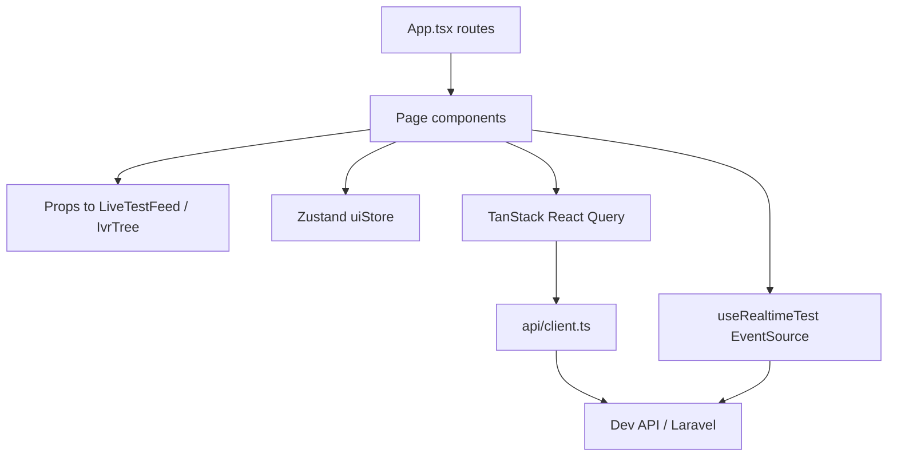
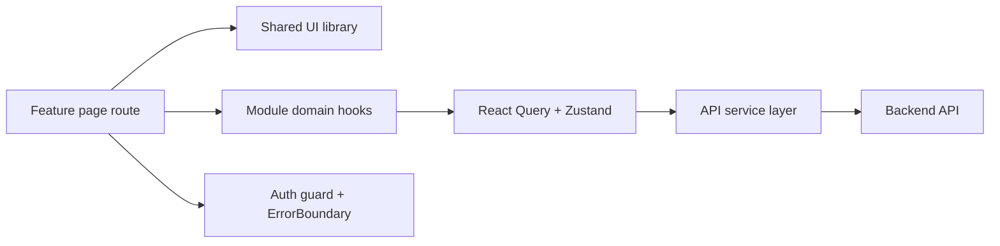
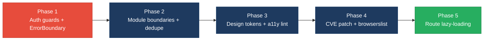

# 3. Frontend Discovery & Modernization Analysis

**Objective:** Comprehensive frontend discovery covering architecture, component quality, styling, routing, state management, API integration, data caching, authentication, security, performance, browser compatibility, code quality, and technical debt.

**Date:** 2026-07-27 | **Scope:** `frontend/` — React 19.2 + TypeScript + Vite 6 (SPA with React Router 7, TanStack React Query 5, Zustand 5)

## Executive Summary

> **Executive Summary**
>
> The Klearcom frontend is a modern React 19.2 / TypeScript / Vite 6 SPA with a solid API client, TanStack Query caching on primary pages, CSS design tokens, and TypeScript `strict: true`. The largest gaps are structural: `modules/Discovery` and `modules/Connect` are empty shells (pages own all feature UI), DiscoveryPage and ConnectPage are near-duplicate layouts, and there is no authentication or route guarding on operational screens. Inline `style={{…}}` usage is widespread (30 occurrences), ESLint and browserslist are absent, and two High CVEs ship via `react-router` 7.18.x. Dead legacy artifacts (`LegacyMonitorPoller` class component, `LegacyDashboardWidget`) remain in-tree with interval leaks and uncaught throws, and no Error Boundary or accessibility roles were found.

<div class="metric-grid">
<div class="metric-card"><div class="metric-number">9</div><div class="metric-label">Components / Files Scanned</div></div>
<div class="metric-card"><div class="metric-number">1</div><div class="metric-label">Legacy Class-Based Components</div></div>
<div class="metric-card"><div class="metric-number">0</div><div class="metric-label">Components Over 500 LOC</div></div>
<div class="metric-card"><div class="metric-number">1</div><div class="metric-label">Global / Shared State Modules</div></div>
<div class="metric-card"><div class="metric-number">0</div><div class="metric-label">API Calls Outside Service Layer</div></div>
<div class="metric-card"><div class="metric-number">1</div><div class="metric-label">Security Risk Patterns Found</div></div>
</div>

<div class="overall-rating overall-rating--high-risk"><div class="overall-rating-label">Overall Codebase Rating — Frontend Discovery</div><div class="overall-rating-value">High Risk</div><div class="overall-rating-note">Driven by H1 (page duplication), H6 (empty feature modules), H8 (30 inline styles), H9 (0% route guards), H15 (no browserslist/polyfills), and H18 (no Error Boundaries).</div></div>

## 3.1 Benchmark Ratings Summary

One row per hotspot. "Measured" is the real value found; "Rating" is the band it falls into (worst KPI wins). This table is the source for the Overall Codebase Rating banner above.

| # | Hotspot | Primary KPI | <span class="rating rating-good">Good</span> | <span class="rating rating-moderate">Moderate</span> | <span class="rating rating-high-risk">High Risk</span> | Measured | Rating |
|---|---|---|---|---|---|---|---|
| H1 | UI Component Duplication | Duplicate components % | <5% | 5–10% | >10% | 22% (2/9 near-duplicate pages) | <span class="rating rating-high-risk">High Risk</span> |
| H2 | Legacy Class-Based Components | Modern component adoption % | >90% | 70–90% | <70% | 89% (8/9 functional) | <span class="rating rating-moderate">Moderate</span> |
| H3 | Massive Components | Largest component LOC | <200 | 200–500 | >500 | 222 LOC (`ConnectPage.tsx`) | <span class="rating rating-moderate">Moderate</span> |
| H4 | Global State Dependencies | Components reading global state % | <30% | 30–60% | >60% | 22% (2/9 use Zustand) | <span class="rating rating-good">Good</span> |
| H5 | Complex State Management | Max prop-drilling depth | <3 | 3–5 | >5 | 2 levels | <span class="rating rating-good">Good</span> |
| H6 | Weak Frontend Architecture | Feature modules with clean boundaries % | >80% | 50–80% | <50% | 0% (modules are AGENTS.md only) | <span class="rating rating-high-risk">High Risk</span> |
| H7 | Missing Component Inventory | Shared component % of total | >30% | 15–30% | <15% | 44% (4/9 in `components/`) | <span class="rating rating-good">Good</span> |
| H8 | No Design System | Inline-style / magic-value occurrences | 0–5 | 6–20 | >20 | 30 `style={{…}}` | <span class="rating rating-high-risk">High Risk</span> |
| H9 | Routing Structure Weakness | Protected routes with guards % | 100% | 80–99% | <80% | 0% (0/3 routes guarded) | <span class="rating rating-high-risk">High Risk</span> |
| H10 | No API Integration Layer | API calls in service layer % | >90% | 70–90% | <70% | 100% via `api/client.ts` | <span class="rating rating-good">Good</span> |
| H11 | Poor Data Caching | Data-fetching points with caching % | >70% | 40–70% | <40% | 67% (8/12 use React Query) | <span class="rating rating-moderate">Moderate</span> |
| H12 | Weak Frontend Auth | Token storage + routes guarded | httpOnly + 100% | One gap | Both gaps | No auth; 0% guarded | <span class="rating rating-moderate">Moderate</span> |
| H13 | Frontend Security Vulnerabilities | XSS-risk + hardcoded secrets count | 0 each | 1–3 total | >3 total | 1 (CDN font CSS, no SRI) | <span class="rating rating-moderate">Moderate</span> |
| H14 | Frontend Performance Gaps | Initial JS bundle size (gzipped) | <250KB | 250–500KB | >500KB | 151 KB gzip (single chunk) | <span class="rating rating-good">Good</span> |
| H15 | Browser Compatibility Gaps | Browserslist + polyfills configured | Both present | One missing | Both missing | Both missing | <span class="rating rating-high-risk">High Risk</span> |
| H16 | Frontend Code Quality | ESLint in CI + TypeScript strict | Both Yes | One Yes | Both No | Strict Yes; ESLint No | <span class="rating rating-moderate">Moderate</span> |
| H17 | Technical Debt & Dependencies | Critical/High CVEs found | 0 | 1–3 | >3 | 2 High (`react-router`) | <span class="rating rating-moderate">Moderate</span> |
| H18 | Missing Error Boundaries (additional) | Route trees wrapped by Error Boundary (target 100%) | 100% | 1–99% | 0% | 0% | <span class="rating rating-high-risk">High Risk</span> |
| H19 | Missing Accessibility Semantics (additional) | Interactive UI with `aria-*`/`role` usage (target present) | Present | Sparse | None observed | 0 matches | <span class="rating rating-high-risk">High Risk</span> |

## 3.2 Hotspot-by-Hotspot Evidence

### H1. UI Component Duplication <span class="sev sev-critical">Critical</span>

**Benchmark:** Duplicate components % = **22%** (2 of 9 top-level UI units are near-structural duplicates) → falls in the **High Risk** band (Good <5% · Moderate 5–10% · High Risk >10%).

`DiscoveryPage.tsx` and `ConnectPage.tsx` share the same page skeleton: header → create form card → `LiveTestFeed` → two-column table/detail grid → MongoDB transcripts card. Field labels differ; layout, query/invalidate patterns, and transcript rendering do not.

```60:75:frontend/src/pages/DiscoveryPage.tsx
    <>
      <header className="page-header">
        <h1>Discovery</h1>
        <p>Automated IVR discovery with real-time MongoDB event streaming</p>
      </header>

      <section className="card" style={{ marginBottom: '1.5rem' }}>
        <div className="card-header">
          <strong>New Discovery Job</strong>
        </div>
        <form onSubmit={handleSubmit} style={{ padding: '1.25rem' }}>
          <div className="form-grid">
```

```64:79:frontend/src/pages/ConnectPage.tsx
    <>
      <header className="page-header">
        <h1>Connect</h1>
        <p>TFN reachability testing with live MongoDB event streaming</p>
      </header>

      <section className="card" style={{ marginBottom: '1.5rem' }}>
        <div className="card-header">
          <strong>Add TFN Monitor</strong>
        </div>
        <form onSubmit={handleSubmit} style={{ padding: '1.25rem' }}>
          <div className="form-grid">
```

`LegacyDashboardWidget.tsx` also re-implements dashboard KPI + jobs/monitors lists already covered by `DashboardPage` / module pages.

**Why it matters here:** Fixes to form layout, empty states, or transcript presentation must be applied twice; Discovery and Connect will drift as features grow. The empty `modules/*` folders suggest the intended domain split was never completed.

**Recommended approach:** Extract shared `EntityCreateForm`, `SelectableDataTable`, and `TranscriptPanel` into `frontend/src/components/shared/`. Move Discovery/Connect page bodies under `frontend/src/modules/{Discovery,Connect}/` and keep pages as thin route wrappers.

<!-- affected-files
search: MongoDB Transcripts|form-grid|LiveTestFeed
glob: frontend/src/pages/*Page.tsx
issue: Near-duplicate page layout / transcript panel
action: Extract shared form, table, and transcript components
-->

### H2. Legacy Class-Based / Imperative Components <span class="sev sev-medium">Medium</span>

**Benchmark:** Modern (functional) adoption = **89%** (8/9) → falls in the **Moderate** band (Good >90% · Moderate 70–90% · High Risk <70%).

```17:31:frontend/src/components/LegacyMonitorPoller.jsx
export default class LegacyMonitorPoller extends Component<Props, State> {
  intervalId: ReturnType<typeof setInterval> | null = null;

  state: State = { reachability: null, error: null };

  componentDidMount() {
    this.intervalId = setInterval(() => {
      api.get<{ computed?: { reachability_pct: number } }>(`/connect/monitors/${this.props.monitorId}/checks`)
        .then((res) => {
          const pct = res.computed?.reachability_pct ?? null;
          this.setState({ reachability: pct, error: null });
          if (pct != null) this.props.onUpdate?.(pct);
        })
        .catch((err: Error) => this.setState({ error: err.message }));
    }, 3000);
    // Intentionally no componentWillUnmount — EventSource/interval leak for audit finding
  }
```

`LegacyDashboardWidget.tsx` is functional but imperative (`useEffect` + `setState` + `setInterval`) and bypasses React Query.

**Why it matters here:** The class poller leaks intervals on unmount. Both legacy files are dead code (not imported by `App.tsx`) but remain compile-visible technical debt and copy-paste magnets.

**Recommended approach:** Delete unused legacy files or rewrite as a `useQuery({ refetchInterval })` hook; never ship interval-based class pollers alongside TanStack Query.

<!-- affected-files
search: extends Component|LegacyDashboardWidget|setInterval
glob: frontend/src/**/*.{tsx,jsx}
issue: Legacy class / imperative polling component
action: Remove or rewrite with hooks + React Query
-->

### H3. Massive Components (>500 LOC) <span class="sev sev-medium">Medium</span>

**Benchmark:** Largest component LOC = **222** (`ConnectPage.tsx`) → falls in the **Moderate** band (Good <200 · Moderate 200–500 · High Risk >500).

No file exceeds 500 LOC. `ConnectPage.tsx` (222) and `DiscoveryPage.tsx` (176) mix form state, three queries, mutations, and presentation in one file.

**Why it matters here:** At current size the risk is moderate, but continued feature growth without extraction will push these pages past the 500 LOC threshold quickly given the duplicated structure.

**Recommended approach:** Split each page into `*Form`, `*List`, `*Detail`, and a page orchestrator under the feature module folder.

<!-- affected-files
search: export default function (Connect|Discovery)Page
glob: frontend/src/pages/*.tsx
issue: Page mixes form, queries, and presentation
action: Split into feature subcomponents under modules/
-->

### H4. Global State Dependencies <span class="sev sev-low">Low</span>

**Benchmark:** Components reading global/shared state % = **22%** (2/9) → falls in the **Good** band (Good <30% · Moderate 30–60% · High Risk >60%).

```10:15:frontend/src/store/uiStore.ts
export const useUiStore = create<UiState>((set) => ({
  selectedDiscoveryId: null,
  selectedMonitorId: null,
  setSelectedDiscoveryId: (id) => set({ selectedDiscoveryId: id }),
  setSelectedMonitorId: (id) => set({ selectedMonitorId: id }),
}));
```

Only `DiscoveryPage` and `ConnectPage` subscribe. Selection IDs are UI concerns appropriately scoped.

**Evidence:** Observed and healthy for app size — keep selection state in Zustand or move to URL search params for shareable deep links.

### H5. Complex State Management <span class="sev sev-low">Low</span>

**Benchmark:** Max prop-drilling depth = **2** (page → `LiveTestFeed` / page → `IvrTree` → `TreeNode`) → falls in the **Good** band (Good <3 · Moderate 3–5 · High Risk >5).

Server state is in React Query; ephemeral selection is in Zustand; realtime SSE state lives in `useRealtimeTest`. No deep prop chains observed.

**Evidence:** Not a complexity hotspot — preserve this split as features grow.

### H6. Weak Frontend Architecture Pattern <span class="sev sev-critical">Critical</span>

**Benchmark:** Feature modules with clean, non-circular boundaries % = **0%** → falls in the **High Risk** band (Good >80% · Moderate 50–80% · High Risk <50%).

```1:8:frontend/src/modules/Connect/AGENTS.md
# Connect Frontend — AI Agent Guide

## Screens
- `/connect` — TFN monitor list, create form, check history

## State
- **TanStack React Query**: Monitors and check results
- **Zustand** (`uiStore`): Selected monitor ID
```

`frontend/src/modules/Discovery/` and `frontend/src/modules/Connect/` contain only `AGENTS.md` — no components, hooks, or public APIs. All feature UI lives in `pages/`. Routes in `App.tsx` import pages directly.

**Why it matters here:** The documented modular architecture is aspirational. Independent delivery/testing of Discovery vs Connect is impossible; circular risk will rise once modules gain real code without enforced boundaries.

**Recommended approach:** Move page implementations into modules with `index.ts` public exports; restrict `pages/` to route entrypoints; add ESLint `import/no-restricted-paths` between modules.

<!-- affected-files
search: .
glob: frontend/src/modules/**/*
issue: Feature module folder has no implementation code
action: Relocate page/feature code into module public APIs
-->

### H7. Missing Component Inventory <span class="sev sev-low">Low</span>

**Benchmark:** Shared component % of total = **44%** (4/9 under `components/`) → falls in the **Good** band (Good >30% · Moderate 15–30% · High Risk <15%).

Shared library exists (`IvrTree`, `LiveTestFeed`, `MongoStatus`, plus unused `LegacyMonitorPoller`). No Storybook or formal inventory catalog was found; module AGENTS.md files partially document screens.

**Evidence:** Shared % meets target; still recommend Storybook for discoverability as the library grows.

### H8. No Design System / Styling Architecture <span class="sev sev-high">High</span>

**Benchmark:** Inline-style / magic-value occurrences = **30** → falls in the **High Risk** band (Good 0–5 · Moderate 6–20 · High Risk >20).

Design tokens in `:root` are good:

```1:14:frontend/src/index.css
:root {
  --bg: #0b0f1a;
  --surface: #121829;
  --surface-2: #1a2238;
  --border: #2a3555;
  --text: #e8ecf4;
  --muted: #8b95ad;
  --accent: #3b82f6;
  --accent-2: #06b6d4;
  --success: #22c55e;
  --warning: #f59e0b;
  --danger: #ef4444;
  --radius: 10px;
```

But pages bypass tokens with repeated inline layouts (`marginBottom: '1.5rem'`, `gridTemplateColumns: '1fr 1fr'`, duplicated section heading styles on `DashboardPage`).

**Why it matters here:** Tokens exist but are underused for spacing/layout; brand and density changes require hunting 30 inline sites across pages.

**Recommended approach:** Add utility classes (`.stack-md`, `.two-col`, `.section-title`) in `index.css` or adopt CSS Modules; ban raw spacing in ESLint `react/forbid-dom-props` for `style` where practical.

<!-- affected-files
search: style=\{\{
glob: frontend/src/**/*.{tsx,jsx}
issue: Inline style attribute with layout/spacing values
action: Replace with CSS utility classes or tokens
-->

### H9. Routing Structure Weakness <span class="sev sev-critical">Critical</span>

**Benchmark:** Protected routes with auth guards % = **0%** (0 of 3 routes) → falls in the **High Risk** band (Good 100% · Moderate 80–99% · High Risk <80%).

```28:35:frontend/src/App.tsx
      <main className="main">
        <Routes>
          <Route path="/" element={<DashboardPage />} />
          <Route path="/discovery" element={<DiscoveryPage />} />
          <Route path="/connect" element={<ConnectPage />} />
        </Routes>
      </main>
```

Routes are centralized in `App.tsx` (positive) but eagerly imported (no `React.lazy`), with no loader/guard wrappers. Operational Discovery/Connect screens are fully open.

**Why it matters here:** Any network user who can reach the SPA can operate IVR discovery and TFN monitors. Bundle also loads all pages upfront (Vite warned on 518 KB minified single chunk).

**Recommended approach:** Introduce `RequireAuth` layout route; lazy-load Discovery/Connect; move route table to `frontend/src/router/routes.tsx`.

<!-- affected-files
search: Route path=
glob: frontend/src/App.tsx
issue: Unprotected eager routes for operational pages
action: Add auth guards and React.lazy route splitting
-->

### H10. No API Integration Layer <span class="sev sev-low">Low</span>

**Benchmark:** API calls in service layer % = **100%** → falls in the **Good** band (Good >90% · Moderate 70–90% · High Risk <70%).

```1:25:frontend/src/api/client.ts
const API_BASE = import.meta.env.VITE_API_URL ?? 'http://localhost:8080/api';

export function getStreamUrl(path: string): string {
  const base = API_BASE.replace(/\/api\/?$/, '');
  return `${base}/api${path.startsWith('/') ? path : `/${path}`}`;
}

async function request<T>(path: string, options?: RequestInit): Promise<T> {
  const res = await fetch(`${API_BASE}${path}`, {
    headers: { 'Content-Type': 'application/json', Accept: 'application/json' },
    ...options,
  });
  // ...
}

export const api = {
  get: <T>(path: string) => request<T>(path),
  post: <T>(path: string, body: unknown) =>
    request<T>(path, { method: 'POST', body: JSON.stringify(body) }),
};
```

All call sites import `api` / `getStreamUrl`. No component-level raw `fetch` outside the client.

**Evidence:** Strong baseline — next step is auth header injection on the shared client when auth lands.

### H11. Poor Data Caching & Integration <span class="sev sev-medium">Medium</span>

**Benchmark:** Data-fetching points with caching % = **67%** (8/12) → falls in the **Moderate** band (Good >70% · Moderate 40–70% · High Risk <40%).

Primary pages use React Query with `staleTime: 30_000` (from `main.tsx`). Legacy paths do not:

```16:40:frontend/src/pages/LegacyDashboardWidget.tsx
  useEffect(() => {
    let cancelled = false;

    Promise.all([
      api.get<DashboardKpis>('/dashboard/kpis'),
      api.get<{ data: DiscoveryJob[] }>('/discovery/jobs'),
      api.get<{ data: ConnectMonitor[] }>('/connect/monitors'),
    ])
      .then(([kpiRes, jobRes, monitorRes]) => {
        // ...
      })
    const timer = setInterval(() => {
      api.get<DashboardKpis>('/dashboard/kpis').then((k) => {
        if (!cancelled) setKpis(k);
      });
    }, 10000);
```

**Why it matters here:** Active UI is well-cached; dead legacy code plus any future copy-paste of its pattern will reintroduce uncached polling and inconsistent loading/error UX.

**Recommended approach:** Delete or migrate legacy fetchers to React Query; add shared query-key factories under `frontend/src/api/queryKeys.ts`.

<!-- affected-files
search: useEffect\(|setInterval|useQuery\(
glob: frontend/src/**/*.{tsx,jsx,ts}
issue: Data fetch outside React Query cache layer
action: Migrate to useQuery / remove dead pollers
-->

### H12. Weak Frontend Auth & Route Guards <span class="sev sev-high">High</span>

**Benchmark:** Token storage + routes guarded = **no auth implemented; 0% guarded** → falls in the **Moderate** band (Good httpOnly+100% · Moderate one gap · High Risk localStorage AND <100% — no localStorage observed, but guards missing).

No `localStorage`/`sessionStorage` token usage found. No login page, no cookie/session handling, no role checks. API client sends only JSON content-type headers.

**Why it matters here:** Platform APIs for discovery/connect are callable from an unauthenticated browser session. When auth is added, the client has no interceptor hook yet.

**Recommended approach:** Add backend session (httpOnly cookie) + `RequireAuth` route wrapper; extend `request()` in `client.ts` with `credentials: 'include'` and 401 → login redirect.

<!-- affected-files
search: Route path=|headers: \{ 'Content-Type'
glob: frontend/src/**/*.{tsx,ts}
issue: No auth token handling or route guards
action: Add httpOnly session + centralized route guard
-->

### H13. Frontend Security Vulnerabilities <span class="sev sev-medium">Medium</span>

**Benchmark:** XSS-risk + hardcoded secrets count = **1 total** (CDN stylesheet without SRI; 0 secrets; 0 `dangerouslySetInnerHTML`) → falls in the **Moderate** band (Good 0 each · Moderate 1–3 · High Risk >3).

```6:9:frontend/index.html
    <link rel="preconnect" href="https://fonts.googleapis.com" />
    <link rel="preconnect" href="https://fonts.gstatic.com" crossorigin />
    <link href="https://fonts.googleapis.com/css2?family=DM+Sans:wght@400;500;600;700&family=JetBrains+Mono:wght@400;500&display=swap" rel="stylesheet" />
```

**Why it matters here:** Compromised CDN CSS can alter UI and exfiltrate via injected styles. No HTML injection sinks were found — keep that discipline.

**Recommended approach:** Self-host fonts or pin with Subresource Integrity; keep sanitization policy if rich text is added later.

<!-- affected-files
search: fonts\.googleapis\.com|fonts\.gstatic\.com
glob: frontend/index.html
issue: Third-party stylesheet without integrity attribute
action: Self-host fonts or add SRI integrity hash
-->

### H14. Frontend Performance Gaps <span class="sev sev-low">Low</span>

**Benchmark:** Initial JS bundle size (gzipped) = **151 KB** → falls in the **Good** band (Good <250KB · Moderate 250–500KB · High Risk >500KB).

Production build (`vite build`): single `index-*.js` = 518.43 kB minified / **151.28 kB gzip**. Vite warns about chunk size; no `React.lazy` / route splitting. No images in UI (lazy-load N/A).

**Evidence:** Gzip target met; still add route-level code splitting before the app grows.

### H15. Browser & Runtime Compatibility Gaps <span class="sev sev-high">High</span>

**Benchmark:** Browserslist + polyfills = **Both missing** → falls in the **High Risk** band (Good both · Moderate one · High Risk both missing).

No `.browserslistrc`, no `browserslist` field in `frontend/package.json`, no core-js/polyfill deps. `tsconfig` targets `ES2022`. App uses `EventSource` in `useRealtimeTest` without feature detection.

**Why it matters here:** Unsupported browsers fail silently on SSE/realtime tests; CI has no compatibility contract.

**Recommended approach:** Add `.browserslistrc` (e.g. `defaults`, last 2 Chrome/Firefox/Safari); document EventSource support; add Autoprefixer if CSS expands.

<!-- affected-files
search: .
glob: frontend/package.json
issue: No browserslist or polyfill configuration
action: Add .browserslistrc and document SSE browser support
-->

### H16. Frontend Code Quality Issues <span class="sev sev-medium">Medium</span>

**Benchmark:** ESLint in CI + TypeScript strict = **Strict Yes / ESLint No** → falls in the **Moderate** band (Good both Yes · Moderate one Yes · High Risk both No).

```12:18:frontend/tsconfig.json
    "jsx": "react-jsx",
    "strict": true,
    "noUnusedLocals": true,
    "noUnusedParameters": true,
    "noFallthroughCasesInSwitch": true,
    "noUncheckedSideEffectImports": true
```

CI frontend job only runs `npm run build` (tsc + vite) — no ESLint. No eslint config or `eslint` dependency in `frontend/package.json`.

**Why it matters here:** Strict TS catches type errors, but hooks rules, a11y, and import boundaries are unchecked in PRs.

**Recommended approach:** Add `eslint` + `typescript-eslint` + `eslint-plugin-react-hooks` + `jsx-a11y`; run `npm run lint` in `.github/workflows/ci.yml` frontend job.

<!-- affected-files
search: npm run build|eslint
glob: .github/workflows/ci.yml
issue: CI builds frontend without ESLint
action: Add ESLint config and lint step to frontend CI job
-->

### H17. Technical Debt & Outdated Dependencies <span class="sev sev-high">High</span>

**Benchmark:** Critical/High CVEs found = **2 High** → falls in the **Moderate** band (Good 0 · Moderate 1–3 · High Risk >3).

`npm audit` on lockfile-resolved install reports:

- **High:** `react-router` 7.12.0–8.2.0 — GHSA-qwww-vcr4-c8h2 (RSC Mode CSRF Bypass); transitive via `react-router-dom@7.18.1`.

Dead code: `LegacyMonitorPoller.jsx`, `LegacyDashboardWidget.tsx` (never imported). Intentional interval leak comment remains in-tree.

**Why it matters here:** Known High advisories ship with every install; dead legacy files confuse contributors and inflate scan noise.

**Recommended approach:** `npm audit fix` / bump `react-router-dom` past fixed range; delete unused legacy components; track remaining TODOs in issues (none found in source).

<!-- affected-files
search: react-router|LegacyMonitorPoller|LegacyDashboardWidget
glob: frontend/{package-lock.json,src/**/*.{tsx,jsx}}
issue: High CVE dependency and unused legacy components
action: Upgrade react-router; remove dead legacy files
-->

### H18. Missing Error Boundaries (additional) <span class="sev sev-critical">Critical</span>

**Benchmark:** Route trees wrapped by Error Boundary = **0%** → falls in the **High Risk** band (Good 100% · Moderate 1–99% · High Risk 0%).

```48:48:frontend/src/pages/LegacyDashboardWidget.tsx
  if (error) throw new Error(error); // Uncaught — no Error Boundary wraps this component
```

No `ErrorBoundary`, `componentDidCatch`, or `react-error-boundary` usage anywhere under `frontend/src`. A thrown render error white-screens the SPA.

**Why it matters here:** Even without the legacy widget mounted, query/render failures have no recovery UI; production incidents become hard full reloads.

**Recommended approach:** Wrap `<Routes>` in an error boundary with retry UI; never `throw` from render without a catcher.

<!-- affected-files
search: throw new Error|createRoot|BrowserRouter
glob: frontend/src/**/*.{tsx,ts}
issue: No React Error Boundary around application routes
action: Add route-level ErrorBoundary with fallback UI
-->

### H19. Missing Accessibility Semantics (additional) <span class="sev sev-high">High</span>

**Benchmark:** `aria-*` / `role` usage = **0 matches** across `frontend/src` → falls in the **High Risk** band (Good present · Moderate sparse · High Risk none).

Interactive elements (nav links, table row `onClick`, buttons, LIVE pulse) lack accessible names beyond visible text; clickable `<tr>` elements are not keyboard-operable as buttons/rows with selection state announced.

**Why it matters here:** Keyboard and screen-reader users cannot reliably operate Discovery/Connect selection tables; future audits will fail WCAG 2.x basics.

**Recommended approach:** Add `eslint-plugin-jsx-a11y`; make selectable rows `button`/`role="button"` with `tabIndex` and `aria-selected`; label live region for `LiveTestFeed`.

<!-- affected-files
search: onClick=\{|nav-link|<table>
glob: frontend/src/**/*.{tsx,jsx}
issue: Interactive UI without ARIA / keyboard semantics
action: Add aria attributes and keyboard handlers; enable jsx-a11y
-->

## 3.3 State Management & Dependency Evidence

### H4. Global State Dependencies <span class="sev sev-low">Low</span>

**Benchmark:** Components reading global/shared state % = **22%** → **Good**.

Zustand `useUiStore` holds only selected Discovery/Connect IDs. Consumed by two pages; no `window.*` globals or module-level mutable singletons beyond the store factory.

```11:13:frontend/src/pages/DiscoveryPage.tsx
  const selectedId = useUiStore((s) => s.selectedDiscoveryId);
  const setSelectedId = useUiStore((s) => s.setSelectedDiscoveryId);
  const { events, isRunning, progress, startDiscovery } = useRealtimeTest('discovery');
```

```11:12:frontend/src/pages/ConnectPage.tsx
  const selectedId = useUiStore((s) => s.selectedMonitorId);
  const setSelectedId = useUiStore((s) => s.setSelectedMonitorId);
```

**Why it matters here:** Coupling is limited and intentional. Prefer URL params if deep-linking selected entities becomes a product need.

**Recommended approach:** Keep Zustand for ephemeral UI; avoid dumping server entities into the store (React Query already owns them).

### H5. Complex State Management <span class="sev sev-low">Low</span>

**Benchmark:** Max prop-drilling depth = **2** → **Good**.

```10:14:frontend/src/components/LiveTestFeed.tsx
export default function LiveTestFeed({ events, isRunning, progress, title = 'Live Test Feed' }: Props) {
  if (events.length === 0 && !isRunning) {
    return (
      <div className="live-feed empty">
```

Realtime state stays inside `useRealtimeTest`; pages pass a shallow props bag. No watcher/effect sync chains between stores observed.

**Evidence:** Not observed as a complexity problem at current scale.

## 3.4 Architecture & Component Inventory Evidence

### H6. Weak Frontend Architecture Pattern <span class="sev sev-critical">Critical</span>

**Benchmark:** Clean feature-module boundaries % = **0%** → **High Risk**.

```1:8:frontend/src/modules/Discovery/AGENTS.md
# Discovery Frontend — AI Agent Guide

## Screens
- `/discovery` — Job list, create form, IVR tree view, live feed

## State
- **TanStack React Query**: Jobs and tree data
- **Zustand** (`uiStore`): Selected job ID
```

Actual implementation paths are `frontend/src/pages/DiscoveryPage.tsx` and `ConnectPage.tsx`, imported by `App.tsx`. Module folders are documentation-only.

**Why it matters here:** The README advertises modular Discovery/Connect boundaries that the frontend does not enforce, so AI agents and humans following AGENTS.md look in the wrong place for code.

**Recommended approach:** Relocate feature UI into modules; leave AGENTS.md beside the real code; enforce import boundaries in ESLint.

<!-- affected-files
search: .
glob: frontend/src/modules/**/*
issue: Module directories lack implementation
action: Move feature code from pages/ into modules/
-->

### H7. Missing Component Inventory <span class="sev sev-low">Low</span>

**Benchmark:** Shared component % = **44%** → **Good**.

Inventory of exported UI units:

| Unit | Path | Category |
|---|---|---|
| App | `src/App.tsx` | Layout |
| DashboardPage | `src/pages/DashboardPage.tsx` | Page |
| DiscoveryPage | `src/pages/DiscoveryPage.tsx` | Page |
| ConnectPage | `src/pages/ConnectPage.tsx` | Page |
| LegacyDashboardWidget | `src/pages/LegacyDashboardWidget.tsx` | Dead page |
| IvrTree | `src/components/IvrTree.tsx` | Shared |
| LiveTestFeed | `src/components/LiveTestFeed.tsx` | Shared |
| MongoStatus | `src/components/MongoStatus.tsx` | Shared |
| LegacyMonitorPoller | `src/components/LegacyMonitorPoller.jsx` | Dead shared |

No Storybook. Shared % still clears the 30% target.

**Evidence:** Inventory exists informally; introduce Storybook when shared primitives multiply.

## 3.5 Styling, Routing & API Evidence

### H8. No Design System / Styling Architecture <span class="sev sev-high">High</span>

**Benchmark:** Inline-style occurrences = **30** → **High Risk**.

Tokens are defined globally, but pages restate spacing/typography inline, e.g. duplicated section titles:

```22:23:frontend/src/pages/DashboardPage.tsx
        <h2 style={{ fontSize: '0.85rem', color: 'var(--muted)', marginBottom: '0.75rem', textTransform: 'uppercase', letterSpacing: '0.05em' }}>
          Availability KPIs
```

```34:35:frontend/src/pages/DashboardPage.tsx
        <h2 style={{ fontSize: '0.85rem', color: 'var(--muted)', marginBottom: '0.75rem', textTransform: 'uppercase', letterSpacing: '0.05em' }}>
          Operational
```

**Why it matters here:** Even when colors reference CSS variables, layout magic values remain scattered; design-system adoption is incomplete.

**Recommended approach:** Promote repeated inline patterns to named classes in `index.css`.

<!-- affected-files
search: style=\{\{
glob: frontend/src/**/*.{tsx,jsx}
issue: Inline styles instead of design-system classes
action: Replace with shared CSS utilities
-->

### H9. Routing Structure Weakness <span class="sev sev-critical">Critical</span>

**Benchmark:** Protected routes with guards % = **0%** → **High Risk**.

Central route table in `App.tsx` with eager imports of all pages; no `lazy`/`Suspense`. Nav is always visible for Dashboard/Discovery/Connect.

**Why it matters here:** No authorization boundary and no per-route code splitting — both routing best practices are missing despite a small route count.

**Recommended approach:** `router/index.tsx` with lazy routes + auth layout.

<!-- affected-files
search: Route path=|NavLink to=
glob: frontend/src/App.tsx
issue: Eager unprotected routes
action: Centralize with guards and lazy loading
-->

### H10. No API Integration Layer <span class="sev sev-low">Low</span>

**Benchmark:** Service-layer API call % = **100%** → **Good**.

`fetch` is encapsulated in `frontend/src/api/client.ts`; hooks and components call `api.get` / `api.post` / `getStreamUrl` only.

**Evidence:** Not observed as a gap — retain and extend with auth/credentials.

### H11. Poor Data Caching & Integration <span class="sev sev-medium">Medium</span>

**Benchmark:** Caching coverage = **67%** → **Moderate**.

```8:11:frontend/src/main.tsx
const queryClient = new QueryClient({
  defaultOptions: {
    queries: { retry: 1, staleTime: 30_000 },
  },
});
```

Eight React Query fetch points vs four uncached legacy/poller calls.

**Why it matters here:** Primary UX is solid; legacy pollers undermine the caching story and should be removed.

**Recommended approach:** Delete legacy fetchers; keep mutations invalidating `['discovery']` / `['connect']` / `['dashboard']` keys.

<!-- affected-files
search: useQuery\(|api\.get
glob: frontend/src/**/*.{tsx,jsx,ts}
issue: Mixed React Query and manual polling
action: Standardize on React Query only
-->

## 3.6 Auth & Security Evidence

### H12. Weak Frontend Auth & Route Guards <span class="sev sev-high">High</span>

**Benchmark:** No token storage observed; **0%** of operational routes guarded → **Moderate** (guards gap without localStorage anti-pattern).

API client has no Authorization header injection:

```9:12:frontend/src/api/client.ts
  const res = await fetch(`${API_BASE}${path}`, {
    headers: { 'Content-Type': 'application/json', Accept: 'application/json' },
    ...options,
  });
```

**Why it matters here:** Frontend assumes a trusted local/dev network. Shipping this SPA publicly without auth is unsafe for TFN/IVR operations.

**Recommended approach:** Session cookies + guarded routes before any non-local deployment.

<!-- affected-files
search: fetch\(`\$\{API_BASE\}|Route path=
glob: frontend/src/**/*.{ts,tsx}
issue: Unauthenticated API client and routes
action: Add credentials + RequireAuth layout
-->

### H13. Frontend Security Vulnerabilities <span class="sev sev-medium">Medium</span>

**Benchmark:** **1** supply-chain/SRI gap; **0** XSS sinks; **0** hardcoded secrets → **Moderate**.

Google Fonts CSS loaded without `integrity`. No `dangerouslySetInnerHTML`, no API keys in frontend source.

**Why it matters here:** Low volume but real CDN trust issue; XSS posture is currently clean.

**Recommended approach:** Self-host DM Sans / JetBrains Mono under `frontend/public/fonts`.

<!-- affected-files
search: fonts\.googleapis
glob: frontend/index.html
issue: Third-party CSS without SRI
action: Self-host fonts or add integrity
-->

## 3.7 Performance, Compatibility & Quality Evidence

### H14. Frontend Performance Gaps <span class="sev sev-low">Low</span>

**Benchmark:** Gzipped JS = **151 KB** → **Good**.

Single-chunk build meets size KPI. Opportunity: split Discovery/Connect with `React.lazy` to improve TTI further and clear Vite’s 500 kB minified warning.

**Evidence:** Size OK; lazy loading still recommended as growth insurance.

### H15. Browser & Runtime Compatibility Gaps <span class="sev sev-high">High</span>

**Benchmark:** Browserslist **missing**; polyfills **missing** → **High Risk**.

```1:10:frontend/vite.config.ts
import { defineConfig } from 'vite';
import react from '@vitejs/plugin-react';

export default defineConfig({
  plugins: [react()],
  server: {
    host: true,
    port: 5173,
  },
});
```

No target browsers configured beyond Vite defaults. `EventSource` used without fallback UI when unsupported.

**Why it matters here:** Realtime testing is a core feature; unsupported browsers degrade to silent stream failure via `source.onerror`.

**Recommended approach:** Declare supported browsers; show an explicit “SSE unsupported” banner when `typeof EventSource === 'undefined'`.

<!-- affected-files
search: EventSource|browserslist
glob: frontend/**/*.{ts,tsx,json}
issue: No browserslist; EventSource assumed available
action: Add browserslist + feature-detect SSE
-->

### H16. Frontend Code Quality Issues <span class="sev sev-medium">Medium</span>

**Benchmark:** TS strict **Yes**; ESLint in CI **No** → **Moderate**.

```38:46:.github/workflows/ci.yml
  frontend:
    runs-on: ubuntu-latest
    steps:
      - uses: actions/checkout@v4
      - uses: actions/setup-node@v4
        with:
          node-version: '22'
      - run: npm ci || npm install
        working-directory: frontend
      - run: npm run build
        working-directory: frontend
```

**Why it matters here:** Typecheck gates merges, but React Hooks / a11y / import rules do not.

**Recommended approach:** Add lint script and CI step alongside build.

<!-- affected-files
search: working-directory: frontend
glob: .github/workflows/ci.yml
issue: Frontend CI lacks ESLint
action: Add npm run lint to frontend job
-->

### H17. Technical Debt & Outdated Dependencies <span class="sev sev-high">High</span>

**Benchmark:** **2 High** CVEs → **Moderate**.

Lockfile resolves `react-router@7.18.1` / `react-router-dom@7.18.1` inside the GHSA-qwww-vcr4-c8h2 affected range. Dead legacy components remain.

**Why it matters here:** Security scanners will flag every CI install; unused legacy files advertise anti-patterns to new contributors.

**Recommended approach:** Upgrade router packages; delete `Legacy*` files; re-run `npm audit` in CI.

<!-- affected-files
search: LegacyMonitorPoller|LegacyDashboardWidget|react-router
glob: frontend/**/*.{jsx,tsx,json}
issue: High CVE + dead legacy components
action: Patch dependencies; remove unused legacy code
-->

## 3.8 Diagrams

### Current UI data flow



### Target component + state layout



### Improvement roadmap



## 3.9 Actions Required

| Hotspot | Action | Rating | Priority |
|---|---|---|---|
| H1 UI Component Duplication | Extract shared form/table/transcript components; stop copying Discovery↔Connect page shells | <span class="rating rating-high-risk">High Risk</span> | <span class="sev sev-critical">Critical</span> |
| H2 Legacy Class-Based Components | Remove or rewrite `LegacyMonitorPoller` / imperative widget with hooks + React Query | <span class="rating rating-moderate">Moderate</span> | <span class="sev sev-medium">Medium</span> |
| H3 Massive Components | Split `ConnectPage` / `DiscoveryPage` into feature subcomponents under modules | <span class="rating rating-moderate">Moderate</span> | <span class="sev sev-medium">Medium</span> |
| H6 Weak Frontend Architecture | Move real feature code into `modules/{Discovery,Connect}` with public exports and import rules | <span class="rating rating-high-risk">High Risk</span> | <span class="sev sev-critical">Critical</span> |
| H8 No Design System | Replace 30 inline `style={{…}}` usages with CSS utility classes on top of existing tokens | <span class="rating rating-high-risk">High Risk</span> | <span class="sev sev-high">High</span> |
| H9 Routing Structure Weakness | Add auth-aware route config with `React.lazy` for Discovery/Connect | <span class="rating rating-high-risk">High Risk</span> | <span class="sev sev-critical">Critical</span> |
| H11 Poor Data Caching | Delete uncached legacy pollers; keep all fetches on React Query | <span class="rating rating-moderate">Moderate</span> | <span class="sev sev-medium">Medium</span> |
| H12 Weak Frontend Auth | Implement httpOnly session auth and centralized `RequireAuth` guards | <span class="rating rating-moderate">Moderate</span> | <span class="sev sev-high">High</span> |
| H13 Frontend Security Vulnerabilities | Self-host fonts or add SRI integrity on Google Fonts CSS | <span class="rating rating-moderate">Moderate</span> | <span class="sev sev-medium">Medium</span> |
| H15 Browser Compatibility Gaps | Add `.browserslistrc` and EventSource feature detection UX | <span class="rating rating-high-risk">High Risk</span> | <span class="sev sev-high">High</span> |
| H16 Frontend Code Quality | Add ESLint + react-hooks/jsx-a11y and enforce in CI | <span class="rating rating-moderate">Moderate</span> | <span class="sev sev-medium">Medium</span> |
| H17 Technical Debt & Dependencies | Upgrade `react-router-dom` past GHSA-qwww-vcr4-c8h2; remove dead `Legacy*` files | <span class="rating rating-moderate">Moderate</span> | <span class="sev sev-high">High</span> |
| H18 Missing Error Boundaries | Wrap routes in an Error Boundary with recoverable fallback UI | <span class="rating rating-high-risk">High Risk</span> | <span class="sev sev-critical">Critical</span> |
| H19 Missing Accessibility Semantics | Add ARIA/keyboard support for nav, tables, and live feed; enable jsx-a11y | <span class="rating rating-high-risk">High Risk</span> | <span class="sev sev-high">High</span> |

## 3.10 Expected Outcomes

- Shared form/table/transcript components eliminate Discovery↔Connect drift and cut duplicate fix cost.
- Real `modules/{Discovery,Connect}` packages make feature ownership and AGENTS.md guidance accurate.
- httpOnly auth plus route guards prevent anonymous operation of IVR/TFN tooling.
- Error Boundaries convert white-screen failures into recoverable UI.
- Token-backed CSS utilities remove inline-style sprawl and speed visual changes.
- ESLint + jsx-a11y in CI catch hooks and accessibility regressions before merge.
- Patching `react-router` clears the two High CVEs from `npm audit`.
- Browserslist + SSE detection make realtime-test support explicit for target browsers.
